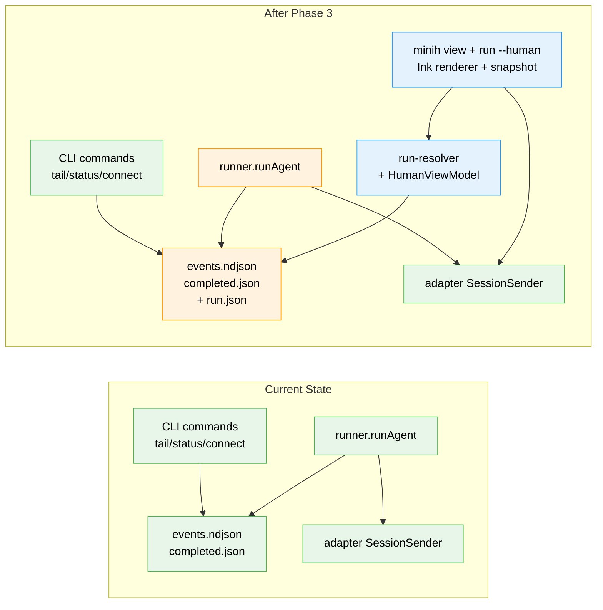
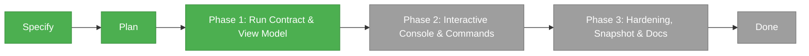

# Flight Plan: Human Agent View

**Spec**: [human-agent-view-spec.md](./human-agent-view-spec.md)
**Plan**: [human-agent-view-plan.md](./human-agent-view-plan.md)
**Generated**: 2026-04-28
**Status**: In Progress

---

## The Mission

**What we're building**: A readable terminal operator console for minih agent runs. An outside actor (human, CI, or supervising agent) can open one view to see the inside agent's transcript, tool activity, coordination messages, state, output status, and available controls — without juggling separate `tail`, `status`, inbox, and state commands.

**Why it matters**: Background and supervised agents become easier to observe and steer because the run is presented as a coherent conversation and activity timeline with truthful capability labels, not a stream of low-level event lines.

---

## Where We Are → Where We're Headed

```text
TODAY:                                          AFTER this plan:
4 commands to read 1 run                        1 console + same commands as before

🔵 tail/status/connect/inbox remain             🔵 tail/status/connect/inbox unchanged
🟡 events.ndjson tails as raw lines             🟢 transcript groups inside-agent output
🟡 sessionId only after completed.json          🟢 live run.json with sessionId at session_start
🟡 "latest" means 3 different things            🟢 one shared run resolver (by-id/active/completed)
❌ no operator console                          🔴 minih view <slug> + minih run --human
❌ no honest capability labels                  🔴 input available / read-only / completed
❌ no non-TTY snapshot                          🔴 deterministic stderr snapshot fallback
```



**Legend**: existing (green) | changed (orange) | new (blue)

---

## Scope

**Goals**:
- One readable console for `run --human` start-and-view and `view` attach-to-run.
- Grouped transcript with `Outside actor` / `Inside agent` labels.
- Tool calls as compact lifecycle rows.
- Workbench pane combining coordination timeline, state, and output/validation.
- Capability-honest footer: `input available` / `input read-only` / `completed`.
- UI-only follow pause (`Follow paused`); never implies agent execution stops.
- Deterministic snapshot/non-TTY fallback; stdout reserved for JSON envelopes.

**Non-Goals**:
- Cross-process attach send / file command lane (deferred — see Workshop 002 Phase 3).
- Real agent pause / interrupt / kill (Workshop 003).
- Migrating `tail` / `status` / `connect` to the new resolver.
- Public/JSON output for `view`; alternate-screen full-screen mode.
- Exposing `coordination.enabled` as a product mode.

---

## Journey Map



**Legend**: green = done | yellow = active | grey = not started

---

## Phases Overview

| Phase | Title | Tasks | CS | Status |
|-------|-------|-------|----|--------|
| 1 | Run Contract & View Model | 7 | CS-3 | Complete |
| 2 | Interactive Console & Commands | 8 | CS-4 | Pending |
| 3 | Hardening, Snapshot & Docs | 8 | CS-3 | Pending |

---

## Acceptance Criteria

- [ ] One operator console serves both start-and-view and attach-to-run journeys.
- [ ] Transcript groups deltas/messages and labels outside actor vs inside agent.
- [ ] Tool calls render as compact lifecycle rows with status.
- [ ] Workbench pane links acks to messages and shows state/output/validation.
- [ ] Footer capability labels reflect run state honestly; pause is UI-only.
- [ ] Ambiguous active runs error with candidate list rather than implicit attach.
- [ ] Non-TTY environments produce a deterministic snapshot; stdout stays clean.
- [ ] Malformed source data surfaces diagnostics without crashing the view.

---

## Key Risks

| Risk | Mitigation |
|------|-----------|
| Manifest write churn at high event rates | Throttled `updatedAt` writes (~250 ms) using existing `atomic-write.ts`. |
| Ink rendering leaks to stdout | Configure Ink to write to `process.stderr`; CLI tests assert empty stdout. |
| Cross-process attach users expect to send | Honest `attached-read-only` label + reason; deferred control lane documented. |
| `Pause` re-introduces "pause agent" confusion | Hard-code `Follow paused`; doc sweep in Phase 3. |
| Adding `ink`+`react` deps surfaces audit findings | `just fft` runs in Phase 2; new findings owned per repo policy. |
| Reducer drift between snapshot and renderer | Both consume the same `HumanViewModel`; shared fixtures. |

---

## Flight Log

<!-- Updated by /plan-6 and /plan-6a after each phase completes -->

_No phases completed yet._

### Phase 1: Run Contract & View Model — Complete (2026-04-28)

**What was done**: Live `run.json` manifest now written from run-folder creation through completion (status progressing `starting → active → completing → completed/failed`); shared `resolveRun({ slug, mode })` answers `by-id` / `latest-active` (with `MultipleActiveRunsError`) / `latest-completed` / `latest-any` with per-candidate fault tolerance and stale detection; pure deterministic `buildHumanViewModel(...)` reducer projects events + manifest + completion + inbox + state + history + output + validation into the full Workshop 004 model. Public types and runtime errors exported via `src/runner/index.ts` for Phase 2 consumption.

**Key changes**:
- `src/runner/types.ts` — added `LiveRunManifest`, `LiveRunStatus`, `RunResolveMode`, `ResolvedRun`, full `HumanViewModel` family.
- `src/runner/human-view-errors.ts` (new) — `MultipleActiveRunsError`, `ManifestSchemaVersionError`.
- `src/runner/run-manifest.ts` (new) — atomic write/read + throttled `updateManifest`.
- `src/runner/run-resolver.ts` (new) — shared run resolver.
- `src/runner/human-view-model.ts` (new) — pure reducer.
- `src/runner/human-view-fixtures.ts` (new) — fixture builders for tests.
- `src/runner/runner.ts` — manifest writes wired at folder-create / `session_start` / event tick (throttled) / terminal condition / completion.
- `src/runner/index.ts` — re-exports for new contracts.
- 30 new tests (10 manifest, 9 resolver, 11 reducer) — all green; existing 438 tests still green.
- `just fft` exit 0; 0 vulnerabilities.

**Decisions made**: Throttle test rewritten to assert "immediate-priority patches flush pending counters" rather than racing fake-timer flushes (cleaner contract, identical behaviour). `run.json` added to coordinated-run snapshot artifact list (legitimate addition; existing test updated).

### Subtask FX001: Code-Review Companion Agent — Complete (2026-04-28)

**What was done**: Built `agents/code-review-companion/` — a long-running coordinated exemplar agent designed in Workshop 007. Five files: `prompt.md` (8 sections incl. orient default + state/inbox vocabularies + ackOf rule + stop precedence), `instructions.md` (4 review checklists), `input-schema.json`, `output-schema.json` (Workshop 007 farewell envelope), `state/inside-state.schema.json`. Smoke-test verified the full coordination loop end-to-end: boot → orient default → outside task delivery via inbox forwarder → state transitions → `inbox_ack` → `finding` reply → `summary` → outside `control: stop` → `farewell` envelope → exit 0 with `validated: true`.

**Bonus minih bug fixes surfaced by the live smoke**:
- **MCP `inbox_list` schema**: removed top-level `not: { required: [...] }` — Copilot SDK rejects top-level `not`/`oneOf`/etc. with CAPIError 400. Mutual exclusion remains enforced at runtime. Would have blocked any coordinated agent on the gpt-5.4 SDK.
- **Phase 1 F002 verified live**: invalid-input early return now finalizes `run.json` with `status: 'failed'` (no more stranded `starting` runs).
- **Phase 1 FC-HIGH verified live**: `control.available: true` written to manifest when `coordination: enabled` (Phase 2's view will correctly label the companion `input-available`).

**Decisions made**: Used `gpt-5.4` (latest GPT registered in the Copilot SDK; `gpt-5.5` was rejected with E127 listing available models). Output schema `additionalProperties: true` (loose envelope, matches `coordination-smoke-test` precedent). `format: date-time` removed from output schema (AJV doesn't register the format).

**Next dogfood subject for Phase 2**: this companion. Start it with `node dist/cli/index.js run code-review-companion`, attach with the Phase 2 `view` command (when it lands), steer with `outside-send`.
