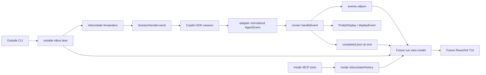

# Research Report: Human Agent View TUI

**Generated**: 2026-04-28T07:23:35+10:00  
**Research Query**: "Improve the Human view of the agent view with a basic React TUI that can start with a run or attach to a running run, show readable streams/status/messages/tool calls, support scrollback, send input, and pause."  
**Mode**: Pre-Plan / Research-Only  
**Location**: `docs/plans/009-human-agent-view/research-dossier.md`  
**FlowSpace**: Available  
**Findings**: 77 subagent findings synthesized  

## Executive Summary

### What It Does

Minih already records nearly everything a human view needs: normalized agent events in `events.ndjson`, completion metadata in `completed.json`, coordination inbox lanes, inside/outside state files, and state history. The missing product layer is a human-oriented presentation and control surface that turns those artifacts into a readable live operator view rather than a set of separate machine-shaped commands.

### Business Purpose

The goal is to let a human or outer agent understand a running agent at a glance: what it is saying, what tools it is using, what coordination messages are moving in and out, what the inside/outside statuses are, and what action can be taken next. This should make dogfood runs and real background agents easier to supervise without losing minih's machine-readable stdout/stderr contract.

### Key Insights

1. **This belongs in the CLI domain as a new presentation/control surface**. React/Ink components should not live in runner, adapter, or MCP.
2. **Readable attach is mostly available today; controllable attach is not**. A separate process can read run files, but cannot safely call the in-memory `SessionSender` unless the original runner exposes a run-scoped control channel.
3. **The first product contract should be a run view model, not a TUI**. Normalize events, metadata, coordination state, inbox lanes, and history once; the scratch TUI and final TUI can render that model.
4. **"Pause" needs a workshop before implementation**. Existing `paused` statuses are coordination state values, not a true SDK/run lifecycle pause.
5. **A scratch mock-up is the right next step**. There is no React/Ink dependency yet, so layout should be iterated in `scratch/` against sample run data before package dependencies or command contracts are added.

### Quick Stats

- **Primary domains touched**: `cli`, `runner`; reads `mcp`-backed coordination artifacts; consumes `adapter` event contracts indirectly.
- **Primary source files**: `src/cli/commands/run.ts`, `src/cli/commands/tail.ts`, `src/cli/commands/status.ts`, `src/cli/commands/connect.ts`, `src/cli/coordination.ts`, `src/runner/runner.ts`, `src/runner/folder.ts`, `src/runner/types.ts`, `src/adapter/events.ts`.
- **Current UI dependencies**: `chalk`, `cli-table3`, `commander`; no React/Ink dependency in `package.json`.
- **Relevant prior learnings**: 10 surfaced; strongest themes are stdout/stderr separation, avoid overbuilt cursor tricks, bounded snapshots, and timeline integrity.
- **External research opportunities**: 2, both about Ink/React TUI mechanics and terminal testing.

## Playback: My Current Thought

This should be treated as a human operator console over the existing run model, not as a replacement for `tail`, `status`, `connect`, or coordination commands. The UX should feel identical whether it starts the run or attaches later, but under the hood those are different modes:

1. **Start-and-view mode** can receive live events and a live `SessionSender` in the same process via the current `runAgent(..., onEvent)` and `onSessionReady` seams.
2. **Attach-read mode** can already reconstruct the live view from `events.ndjson`, state, inbox lanes, and history.
3. **Attach-control mode** needs a new durable control bridge because the `SessionSender` is currently in memory inside the original runner process.

So the design center is not "add Ink around tail"; it is "create a canonical run view/control contract, then render it with Ink." The first workshop should settle the control bridge because it determines whether attach mode can truly be the "exact same experience" as start-and-view mode.

## How It Currently Works

### Entry Points

| Entry Point | Type | Location | Current Purpose | TUI Relevance |
| --- | --- | --- | --- | --- |
| `minih run <slug>` | CLI/run start | `src/cli/commands/run.ts:41-208` | Starts a fresh agent run and streams events through `PrettyDisplay` or `displayEvent`. | Best hook for `--human` / auto-enter view. |
| `minih resume <slug> [message]` | CLI/session follow-up | `src/cli/commands/resume.ts:38-238` | Resumes a completed session using `completed.json.sessionId`. | Input/send precedent, but completed-session only. |
| `minih connect <slug>` | CLI/handoff | `src/cli/commands/connect.ts:26-188` | Prints a Copilot CLI resume command from completed metadata. | Session discovery precedent, but not live attach. |
| `minih tail <slug>` | CLI/live stream | `src/cli/commands/tail.ts:21-166` | Reads recent/following `events.ndjson` and renders each event. | Closest data-feed precedent. |
| `minih status <slug>` | CLI/live summary | `src/cli/commands/status.ts:85-267` | Computes active/stale/completed status, event counts, session ID, and recent turns. | Header/status pane precedent. |
| Outside coordination commands | CLI/run coordination | `src/cli/coordination.ts:205-281` | Resolve a run and read/write inbox/state artifacts. | Message/status panes should reuse these helpers. |

### Core Execution Flow

1. **CLI starts a run**
   - `run.ts` resolves agent config, model, params, MCP config, pretty/verbose display, then calls `runAgent()` with an event handler.
   - File: `src/cli/commands/run.ts:174-208`.

2. **Runner creates the durable run folder**
   - The run folder receives frozen inputs, output paths, `events.ndjson`, and later `completed.json`.
   - File: `src/runner/folder.ts:520-534`.

3. **Adapter emits normalized events**
   - Event types include `text_delta`, `message`, `thinking`, `tool_call`, `tool_result`, `usage`, `session_start`, `session_idle`, `session_error`, and `user_prompt`.
   - File: `src/adapter/events.ts:63-150`.

4. **Runner appends every event to `events.ndjson`**
   - `handleEvent()` increments stats, captures `activeSessionId` from `session_start`, appends NDJSON, and calls the CLI display callback.
   - File: `src/runner/runner.ts:370-412`.

5. **Coordinated runs start forwarders after session readiness**
   - `onSessionReady` receives a `SessionSender`; runner-owned inbox/state forwarders call `sender.send(...)` for outside updates.
   - File: `src/runner/runner.ts:419-454`.

6. **Completion metadata is written only at run end**
   - `completed.json` contains session ID, result, timing, event count, tool-call count, validation status, artifacts, and velocity.
   - File: `src/runner/runner.ts:644-670`; type in `src/runner/types.ts:120-153`.

### Data Flow



### State Management

- `events.ndjson` is the canonical scrollback source for agent events. `tail` already has a bounded suffix reader in `readRecentEventLines()` (`src/cli/commands/tail.ts:185-250`).
- `completed.json` is the canonical post-run metadata source (`src/runner/types.ts:120-153`).
- Live coordination state is stored as run-scoped `inside.json`, `outside.json`, inbox lanes, and `history.ndjson`; path helpers live in runner and shared CLI coordination helpers (`src/cli/coordination.ts:92-203`, `src/runner/types.ts:180-242`).
- `findRunSession()` only finds completed sessions with `completed.json.sessionId`; it skips live incomplete runs (`src/runner/folder.ts:552-608`).

## Architecture and Design

### Component Map

| Component | Current Owner | Responsibility | TUI Role |
| --- | --- | --- | --- |
| `AgentEvent` | adapter contract | Normalized event stream | Backbone for transcript/tools/status panes. |
| `runAgent()` | runner contract | Run orchestration and event persistence | Source of live events for start-and-view mode. |
| `events.ndjson` | runner artifact | Append-only durable event log | Backing store for scrollback and attach-read mode. |
| `CompletedMetadata` | runner contract | End-of-run summary | Completed summary and completed attach context. |
| `readRecentEventLines()` | cli/tail helper | Bounded suffix event reads | Candidate to extract for shared run-feed loading. |
| `status` logic | cli command | Active/stale/completed summary | Candidate to extract for status pane. |
| Coordination helpers | cli + runner | Read/write inbox/state lanes | Candidate to extract into coordination panes. |
| `SessionSender` | adapter/runner boundary | Live `send(prompt)` handle | Needed for start-and-view; not durable across processes. |

### Design Patterns Identified

1. **CLI as presentation/composition root**
   - CLI owns human UX, command parsing, SDK runtime construction, JSON envelopes, and stderr formatting (`docs/domains/cli/domain.md:3-9`, `docs/domains/cli/domain.md:54-70`).
   - Recommendation: place React/Ink command modules under `src/cli/`, not `src/runner/`.

2. **Runner as durable data/model source**
   - Runner owns run folders, event streaming, metadata, validation, and coordination artifacts (`docs/domains/runner/domain.md:3-9`, `docs/domains/runner/domain.md:40-82`).
   - Recommendation: extract reusable run readers/view-model helpers without importing React.

3. **Machine stdout, human stderr**
   - CLI convention is stdout for JSON envelope, human output on stderr (`docs/domains/cli/domain.md:60-63`).
   - Recommendation: full-screen TUI must not write machine data to stdout; either use stderr/raw TTY or be explicitly interactive/no-envelope.

4. **Append-only observability**
   - Prior pretty-mode work avoided scroll-region/cursor tricks and treated terminal scrollback as history.
   - Recommendation: mock-up should prefer simple panes and scrollback over elaborate terminal control.

### Proposed Initial UI Panes

| Pane | Content | Primary Source |
| --- | --- | --- |
| Header/status | slug, runId, sessionId, model, active/stale/completed, elapsed, event/tool counts | run manifest or `status` view model |
| Transcript | grouped user prompts, assistant deltas/messages, final messages, thinking collapsed/expandable | `events.ndjson` |
| Tool calls | active/completed tool calls, durations if available, errors | `tool_call`/`tool_result` events |
| Coordination inbox | outside-to-inside and inside-to-outside messages, ack relationships, unread markers | inbox lanes |
| State/status | inside status, outside status, recent state transition history | state files + `history.ndjson` |
| Output/schema | output path, validation state, degraded errors, latest check/validate result | output files + completed metadata |
| Input/action footer | text input, send, pause, attach mode, follow/snapshot toggle | live sender/control channel |
| Notes/retro | confusing/magic-wand notes during run | scratch/mock-up first; later maybe outside-retro integration |

## Dependencies and Integration

### What This Depends On

| Dependency | Type | Purpose | Risk if Changed |
| --- | --- | --- | --- |
| `AgentEvent` | adapter contract | Common event stream shape. | Breaking event names breaks tail/status/TUI. |
| `events.ndjson` | runner artifact | Durable scrollback and attach-read source. | Raw parse crashes or torn-line handling can leak into UI if not normalized. |
| `CompletedMetadata` | runner contract | Completed summary and session ID. | Live attach cannot wait for this; needs manifest. |
| Coordination inbox/state helpers | runner/cli helpers | Message/status panes. | Direct file reads duplicate validation and corruption handling. |
| `SessionSender` | runner/adapter callback | Live send during same-process run. | Not durable; cannot be recovered by another process today. |

### What Depends on This Today

No current product code depends on a TUI. The closest consumers of the same data are:

- `tail` reads and renders `events.ndjson` (`src/cli/commands/tail.ts:86-146`).
- `status` parses event counts and recent turns (`src/cli/commands/status.ts:29-83`, `src/cli/commands/status.ts:148-189`).
- `connect`/`resume` use `findRunSession()` and completed metadata (`src/runner/folder.ts:552-608`).
- Outside commands use `resolveCoordinationRunOrExit()` and inbox/state helpers (`src/cli/coordination.ts:205-281`).

### Missing Contracts

| Missing Contract | Why It Matters | Recommended Shape |
| --- | --- | --- |
| Live run manifest | Attach-by-run/latest needs runId/sessionId/status before completion. | Runner-owned `run.json` or `session.json`, updated on start/session_start/status changes. |
| Run index/resolver | Latest means different things in `tail`, `status`, `connect`. | Shared `listRuns()` and `resolveRun({ mode: latest-active | latest-completed | runId })`. |
| Attach view model | TUI should not parse raw files in React components. | `RunViewModel`/`AttachViewModel` derived from event log, state, inbox, history, metadata. |
| Control channel | A separate attach process cannot access the in-memory `SessionSender`. | Run-scoped command lane watched by original runner, or explicit IPC/control server. |
| Pause semantics | Current `paused` is side-state only. | Define UI pause vs coordination pause vs run/session pause. |

## Quality and Testing

### Current Test Coverage

| Area | Existing Coverage | Notes |
| --- | --- | --- |
| Tail snapshot/recent read | `test/cli/tail.test.ts`, `test/cli/commands.test.ts` | Good foundation for scrollback feed tests. |
| Runner event flow | `test/runner/runner-event-driven.test.ts` | Covers event ordering, idle boundaries, terminal conditions, and forwarder drain. |
| Run folders/state/inbox | `test/runner/folder.test.ts`, `test/runner/state.test.ts`, `test/cli/outside-send.test.ts`, `test/cli/outside-inbox-list.test.ts` | Good fixtures for attach-to-existing-run tests. |
| Connect/resume/status | Sparse/indirect | Needs narrow tests before attach UX depends on it. |
| TUI | None | No React/Ink dependency or test harness exists. |

### Recommended Test Strategy

1. **Scratch mock-up**
   - Put a simple program under `scratch/human-agent-view/`.
   - Feed it static sample data from real run artifacts or small JSON fixtures.
   - No formal product tests yet.

2. **Product foundation**
   - Unit-test a pure run view model: event lines + metadata + inbox/state/history -> pane state.
   - Unit-test run resolution: explicit run ID, latest active, latest completed, ambiguity.
   - Integration-test same-process start-and-view send wiring with `FakeAgentAdapter`.
   - Integration-test attach-read mode against run-folder fixtures.
   - Add control-channel tests only after the pause/send semantics are designed.

3. **Avoid early fragile terminal snapshots**
   - Test model/state transitions, not full-screen ANSI output, until the layout is stable.

## Modification Considerations

### Safe to Modify

1. **Scratch mock-up**
   - Low risk; not shipped.
   - Can iterate layout and input behavior quickly.

2. **CLI command registration**
   - Existing pattern is per-command registration in `src/cli/index.ts`.
   - A new command can remain isolated.

3. **Shared run readers/view model**
   - Safe if added as pure helpers and covered with tests.

### Modify with Caution

1. **Run discovery**
   - Current commands disagree on "latest" semantics.
   - Extracting shared logic should preserve existing command behavior unless deliberately migrated.

2. **Event rendering**
   - `displayEvent()` is used by `run --verbose` and `tail`.
   - TUI should derive from events, not mutate the existing renderer first.

3. **Coordination state/inbox reads**
   - Existing code handles torn lines, schema validation, wrong-lane messages, and state corruption.
   - TUI must reuse or extract those safeguards.

### Danger Zones

1. **Attach-control from a separate process**
   - There is no durable `SessionSender` today.
   - A naive TUI could claim it can send messages but only write files that no live session watches.

2. **Runner importing React/Ink**
   - Violates domain separation and makes non-UI code depend on terminal UI libraries.

3. **MCP as public control plane**
   - MCP is private inside-only; a public TUI should not call MCP tools directly.

4. **Pause semantics**
   - Side-state `paused` is not a real process pause.
   - Product UX must avoid false promises.

## Prior Learnings

### Prior Learnings Summary

| ID | Source | Key Insight | Action |
| --- | --- | --- | --- |
| PL-01 | `docs/plans/002-pretty-mode/pretty-mode-plan.md` | Avoid ANSI scroll regions/cursor tricks; tmux/ssh compatibility matters. | Keep the TUI basic and scroll-native at first. |
| PL-02 | `docs/plans/002-pretty-mode/pretty-mode-plan.md` | `text_delta` + `messageId` can suppress duplicate finals. | Group deltas/messages in the view model. |
| PL-03 | `docs/plans/002-pretty-mode/pretty-mode-plan.md` | Tool history can be terminal scrollback. | Do not overbuild replay state before the view model proves need. |
| PL-04 | `docs/plans/007-backgrounding/tasks/phase-5-outside-cli-surface/tasks.md` | stdout is always machine JSON; human output goes stderr. | TUI must preserve automation semantics. |
| PL-05 | `docs/plans/007-backgrounding/tasks/phase-5-outside-cli-surface/tasks.md` | Interactive commands still need machine-readable blocked envelopes. | Guard invalid contexts explicitly. |
| PL-06 | `docs/plans/007-backgrounding/tasks/phase-5-outside-cli-surface/tasks.md` | State mutations must append history for audit integrity. | Timeline panes should use history, not just current state. |
| PL-07 | `docs/plans/007-backgrounding/tasks/phase-6-agent-integration-and-prompting/execution.log.md` | Snapshot finalization is part of a successful coordinated run. | TUI should surface finalization/validation status. |
| PL-08 | `docs/plans/007-backgrounding/tasks/phase-6-agent-integration-and-prompting/reviews/review.phase-6-agent-integration-and-prompting.md` | Preview paths must match live run paths. | Mock-up data and final UI should use the same view-model pipeline. |
| PL-09 | `docs/plans/008-canonical-coordination-loop/no-context-two-agent-eval-prompt.md` | Prefer bounded snapshots over endless follow for status updates. | The TUI should support follow and snapshot/paused scroll modes. |
| PL-10 | `docs/plans/008-canonical-coordination-loop/no-context-two-agent-eval-prompt.md` | Every eval should capture magic-wand/clear/confusing feedback. | Consider a notes/retro pane or post-run prompt in the TUI. |

## Domain Context

### Existing Domains Relevant to This Research

| Domain | Relationship | Relevant Contracts | Recommendation |
| --- | --- | --- | --- |
| `cli` | Primary owner | command modules, JSON envelopes, stderr human UX, outside commands | Add TUI command/components here. |
| `runner` | Data/model source | `runAgent`, run folders, events, metadata, state helpers, display helpers | Expose pure view-model/read helpers only. |
| `adapter` | Event/session boundary | `AgentEvent`, `SessionSender` | Do not import SDK or adapter implementation into TUI. |
| `mcp` | Inside-only coordination | private inbox/state tools | Do not use as public TUI control plane. |

### Domain Map Position

The TUI should preserve the current import direction:

```text
cli TUI -> runner view/read helpers
cli TUI -> adapter types only through runner/adapter contracts if needed
cli TUI -> existing outside coordination CLI helpers
runner -> adapter
mcp -> runner
```

No new domain is recommended yet. A future `run-view` module may be useful, but it should start as a small CLI/runner contract rather than a domain.

## Critical Discoveries

### Critical Finding 01: Attach-read and attach-control are different products

**Impact**: Critical  
**Source Findings**: IA-05, IA-06, IA-07, IC-04, IC-08  
**What**: A separate process can read a live run's files, but cannot access the original process's in-memory `SessionSender`.  
**Why It Matters**: The user wants the same experience whether starting a run in human mode or attaching to a run started by another agent. That is only true after a control bridge exists.  
**Required Action**: Workshop the control channel before promising send/pause in attach mode.

### Critical Finding 02: Live session identity is not persisted early enough

**Impact**: High  
**Source Findings**: IA-03, IA-06, IC-02, IC-06  
**What**: `sessionId` is captured during `session_start`, but only persisted in `completed.json` at the end.  
**Why It Matters**: Attach by ID/latest and "ask what instance ID this is" need live run identity before completion.  
**Required Action**: Add a runner-owned live manifest in the future implementation plan.

### Critical Finding 03: Run discovery semantics are fragmented

**Impact**: High  
**Source Findings**: IA-02, DC-08, PS-04, PS-09  
**What**: `tail`/`status` choose newest run folder, `connect` chooses latest completed session, and outside commands resolve active runs only when unambiguous.  
**Why It Matters**: A human view needs predictable `--run <id>` and `latest` semantics.  
**Required Action**: Extract a shared run resolver before productizing attach.

### Critical Finding 04: Raw file rendering will recreate old machine-focused UX

**Impact**: High  
**Source Findings**: DC-01, DC-04, DC-05, DC-06, DC-10, PL-02  
**What**: Event and coordination files are low-level append-only logs; they need grouping, ack correlation, state transition merging, and error normalization.  
**Why It Matters**: The current pain is token/event dumping. A TUI that just splits raw logs into panes will still be hard to read.  
**Required Action**: Build a view model with grouped messages, collapsed deltas, tool-call lifecycle, and a merged coordination timeline.

## Workshop Opportunities

### Workshop 1: Product Shape and Pane Model

**Question**: What is the minimum useful operator console?  
**Topics**:
- Pane layout and priority: transcript vs tools vs coordination vs status.
- Scroll behavior: terminal scrollback, pane scrollback, snapshot mode, follow mode.
- How much "thinking" to show by default.
- How to represent long tool output without flooding.

**Likely Output**: A mock-up spec and scratch fixture scenarios.

### Workshop 2: Attach and Control Channel

**Question**: How can an attached process send/pause safely?  
**Topics**:
- Same-process `SessionSender` vs separate-process attach.
- Run-scoped command lane watched by original runner vs IPC/socket vs coordinated inbox reuse.
- How to report the live run/session ID.
- Failure modes if the original runner is gone.

**Likely Output**: ADR-level decision before implementation.

### Workshop 3: Pause Semantics

**Question**: What does "pause the agent" mean?  
**Candidate meanings**:
- Pause UI auto-follow only.
- Pause sending new human input.
- Pause outside-to-inside forwarders.
- Ask the model to pause via a message.
- Terminate/interrupt the SDK session.

**Likely Output**: Explicit UX labels so we do not overpromise true process pause.

### Workshop 4: View Model and Timeline

**Question**: What canonical timeline should the TUI render?  
**Topics**:
- Merge `events.ndjson`, inbox lanes, ack relationships, state history, validation/check failures, output writes, and retros.
- Correlate tool calls/results and message deltas/finals.
- Define pane state objects testable without Ink.

**Likely Output**: TypeScript interfaces and test fixtures.

### Workshop 5: Ink/React Prototype

**Question**: Can Ink deliver the layout/input/scroll behavior simply?  
**Topics**:
- Dependency choice and packaging impact.
- Key handling and text input.
- Scrollback support.
- TTY/non-TTY fallback.
- How to keep stdout clean.

**Likely Output**: `scratch/human-agent-view/` mock-up and dependency decision.

## External Research Opportunities

### Research Opportunity 1: Ink/React TUI Architecture for Node CLIs

**Why Needed**: The codebase currently has no React/Ink dependency, and the user specifically wants the "React TUI thing" while keeping the UI basic. We need current best practices for pane layout, input, scrollback, stderr/stdout handling, and cleanup.

**Impact on Plan**: Determines whether Ink is the right dependency and how much terminal behavior should be mocked before product implementation.

**Ready-to-use prompt**:

```text
/deepresearch "Research current best practices for building a simple interactive Node.js terminal UI with Ink/React for a CLI that must preserve machine-readable stdout and render human UI on stderr/raw TTY. Context: TypeScript ESM package, commander CLI, existing chalk/cli-table3 output, Node >=20.19, no React/Ink dependency yet. Need panes for live transcript, tool calls, status, messages, input box, scrollback, and clean Ctrl+C cleanup. Compare Ink, blessed/react-blessed, and simple readline/curses-like approaches. Recommend the smallest dependency strategy and testing approach."
```

**Results location**: `docs/plans/009-human-agent-view/external-research/ink-react-tui-architecture.md`

### Research Opportunity 2: Testing Interactive Terminal UIs

**Why Needed**: Existing tests are Vitest-heavy and logic-focused. Full-screen TUI snapshot tests can be brittle, so the project needs a pragmatic testing split.

**Impact on Plan**: Determines how much to test as view-model logic versus terminal rendering.

**Ready-to-use prompt**:

```text
/deepresearch "Research practical testing strategies for interactive terminal UIs in Node.js/TypeScript, especially Ink/React CLIs. Context: Vitest test suite, ESM package, terminal UI should render to stderr/raw TTY and preserve stdout JSON envelopes. Need recommendations for unit-testing view models, testing key input, scrollback, timers, Ctrl+C cleanup, and avoiding brittle ANSI snapshots."
```

**Results location**: `docs/plans/009-human-agent-view/external-research/testing-terminal-tuis.md`

## Recommendations

### If Specifying This Feature Next

1. Specify two initial user journeys separately:
   - `minih run <slug> --human` starts a run and opens the human view.
   - `minih view <slug> [--run <id>]` attaches to an existing run, defaulting to latest active when unambiguous.
2. Define attach mode capabilities honestly:
   - Read-only attach can ship earlier.
   - Send/pause attach requires the control-channel decision.
3. Treat `latest` as a product contract:
   - Prefer latest active.
   - Fall back to latest completed only for read-only transcript/history unless the user explicitly chooses completed mode.
   - Error on ambiguity with a list of candidate run IDs.
4. Define a `RunViewModel` before writing Ink components.
5. Keep all React/Ink code out of runner.

### If Workshoping First

Start with these in order:

1. **Attach and Control Channel** because it determines whether start-and-view and attach can be equivalent.
2. **Pane Model and Timeline** because it determines the mock-up data model.
3. **Pause Semantics** because the word "pause" is overloaded.
4. **Ink Prototype** after the model is known.

### If Mocking Up Immediately

Use `scratch/human-agent-view/` with:

- A static fixture representing:
  - active run metadata,
  - grouped assistant deltas,
  - tool call/result pairs,
  - inside/outside inbox messages,
  - state transitions,
  - degraded validation then repair.
- A fake input footer that appends local "sent" messages to the fixture.
- A fake pause toggle that clearly says "UI paused" until product pause semantics are designed.

## Appendix: File Inventory

### Core Files

| File | Purpose |
| --- | --- |
| `src/adapter/events.ts` | Normalized event contracts, including `SessionSender`. |
| `src/runner/runner.ts` | Event persistence, `onSessionReady`, forwarders, completion metadata. |
| `src/runner/types.ts` | `AgentRunConfig`, `CompletedMetadata`, coordination types. |
| `src/runner/folder.ts` | Run folder creation and completed-session lookup. |
| `src/cli/commands/run.ts` | Start-run CLI composition and display selection. |
| `src/cli/commands/resume.ts` | Completed-session follow-up message flow. |
| `src/cli/commands/connect.ts` | Completed-session handoff command and session listing. |
| `src/cli/commands/tail.ts` | Event-log follow/snapshot behavior. |
| `src/cli/commands/status.ts` | Active/stale/completed summary logic. |
| `src/cli/coordination.ts` | Outside coordination run resolution, inbox parsing, message appending. |

### Test Files

| File | Purpose |
| --- | --- |
| `test/cli/tail.test.ts` | Recent event suffix reader tests. |
| `test/cli/commands.test.ts` | CLI command regression coverage. |
| `test/runner/runner-event-driven.test.ts` | Event-driven runner behavior. |
| `test/runner/state.test.ts` | State persistence helpers. |
| `test/cli/outside-send.test.ts` | Outside inbox writes. |
| `test/cli/outside-inbox-list.test.ts` | Inside-lane reply reads. |
| `test/cli/state.test.ts` | Outside/inside state command behavior. |

## Next Steps

This was a read-only research pass. The next best step is **/plan-2c-v2-workshop** for the attach/control-channel decision, followed by a pane-model workshop and then the scratch mock-up.

**Research Complete**: 2026-04-28T07:23:35+10:00  
**Report Location**: `docs/plans/009-human-agent-view/research-dossier.md`
