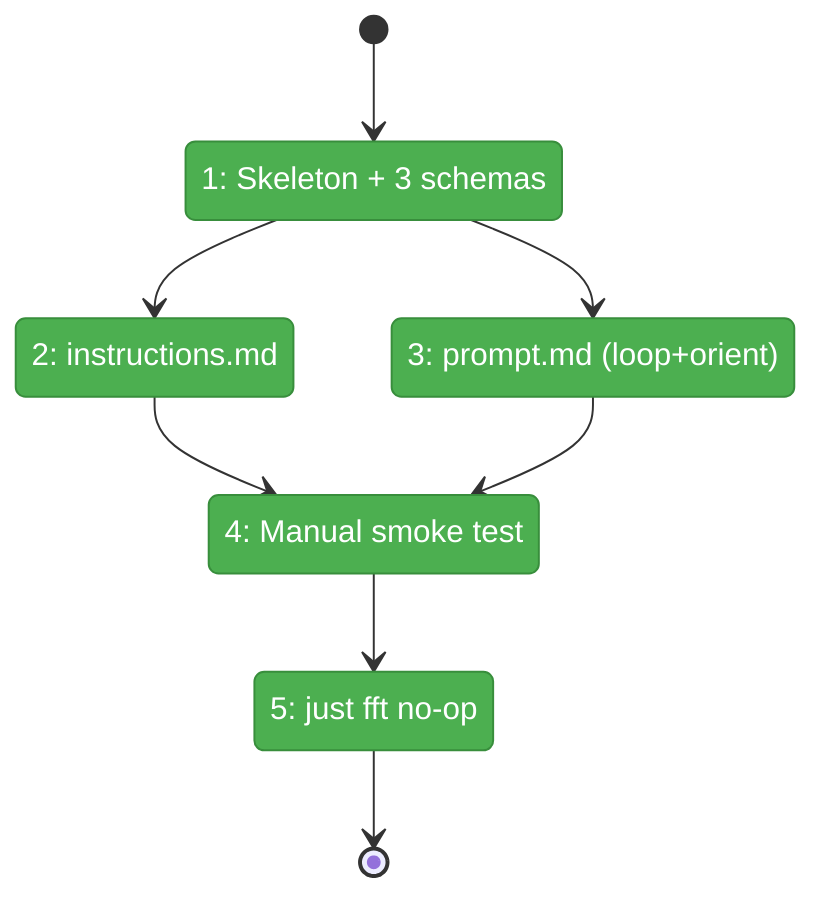
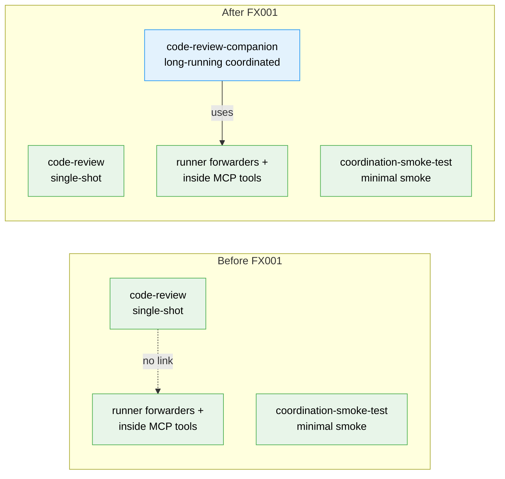

# Flight Plan: Subtask FX001 — Build Code-Review Companion Agent

**Subtask**: [001-subtask-build-code-review-companion-agent.md](./001-subtask-build-code-review-companion-agent.md)
**Parent Phase**: [Phase 1: Run Contract & View Model](./tasks.fltplan.md)
**Parent Task**: T007
**Workshop**: [007-coordinated-code-review-companion](../../workshops/007-coordinated-code-review-companion.md)
**Generated**: 2026-04-28
**Status**: Landed

---

## Departure → Destination

**Where we are**: Phase 1 of plan 009 just landed runner-side foundations (live `run.json` manifest, shared `resolveRun`, pure `buildHumanViewModel` reducer). Workshop 007 designs a coordinated code-review companion agent. No companion exists yet — the existing `code-review` agent is single-shot and cannot be steered.

**Where we're going**: A working `agents/code-review-companion/` that we can boot with `minih run code-review-companion`, observe self-orienting on the latest plan, and steer via `outside-send` (or via Phase 2's `view` footer once that lands). Phase 2 dogfood gets a real working partner from day one.

---

## Domain Context

### Domains We're Changing

| Domain | What Changes | Key Files |
|--------|-------------|-----------|
| `agents` | New folder with prompt + instructions + 3 schemas | `agents/code-review-companion/{prompt.md, instructions.md, input-schema.json, output-schema.json, state/inside-state.schema.json}` |

### Domains We Depend On (no changes)

| Domain | What We Consume | Contract |
|--------|----------------|----------|
| `runner` | inbox/state forwarders (auto-wired by `coordination: enabled` frontmatter) | inbox-forwarder, state-forwarder, run-manifest |
| `mcp` | inside MCP tools | `inbox_list({ waitMs })`, `inbox_send`, `inbox_ack`, `state_get`, `state_set`, `state_transition` |
| `agents/_shared` | shared preamble | `agents/_shared/preamble.md` (auto-injected) |

---

## Flight Status

<!-- Updated by /plan-6-v2: pending → active → done. Use blocked for problems/input needed. -->

**Legend**: grey = pending | yellow = active | red = blocked/needs input | green = done

---

## Stages

<!-- Updated by /plan-6-v2 during implementation: [ ] → [~] → [x] -->

- [x] **Stage 1: Create skeleton + 3 schemas** — folder, `input-schema.json` (initialTask/planPath/idleBudgetMs), `output-schema.json` (farewell envelope), `state/inside-state.schema.json` (status enum) (`agents/code-review-companion/{input-schema,output-schema}.json`, `agents/code-review-companion/state/inside-state.schema.json` — new files)
- [x] **Stage 2: Write instructions.md** — review checklists adapted from existing `code-review` agent (`agents/code-review-companion/instructions.md` — new file)
- [x] **Stage 3: Write prompt.md** — frontmatter (`coordination: enabled`) + 7 body sections incl. orient default verbatim from Workshop 007 (`agents/code-review-companion/prompt.md` — new file)
- [x] **Stage 4: Manual smoke test** — boot, observe orient, send outside task, observe finding+ack, send stop, observe farewell envelope (verification only, no file changes)
- [x] **Stage 5: just fft sanity** — confirm no regression to runtime tests (repo root)

---

## Architecture: Before & After

**Legend**: existing (green, unchanged) | new (blue, created)

---

## Acceptance Criteria

- [ ] Companion is discovered by `minih list` and `minih doctor` reports zero schema errors.
- [ ] `minih run code-review-companion` (no input params) sends one orient `progress` message within 60 s of `session_start`.
- [ ] Outside `task` message gets ack'd; reply has `ackOf` set; state transitions through `reading → reviewing → reporting → idle`.
- [ ] Idle path uses `inbox_list({ waitMs: 30000 })`; events.ndjson rate < 1 evt/min when idle.
- [ ] Outside `control: stop` triggers graceful exit 0 with `farewell` envelope at `output/report.json`.
- [ ] Farewell envelope passes `output-schema.json` validation.
- [ ] `just fft` exits 0 (no regression).

## Goals & Non-Goals

**Goals**:
- A working coordinated agent ready for Phase 2 of plan 009 to dogfood against.
- Zero changes to minih runtime / CLI / MCP code.

**Non-Goals**:
- ❌ No edits to existing `code-review/` agent.
- ❌ No `progress` throttling logic (deferred per Workshop 007 § Deferred).
- ❌ No Phase 2 view code.

---

## Checklist

- [x] ST001: Skeleton folder + input-schema.json + output-schema.json + state/inside-state.schema.json (CS-1)
- [x] ST002: instructions.md with ≥4 review checklists (CS-2)
- [x] ST003: prompt.md with coordination loop + orient default + vocabulary tables (CS-3)
- [x] ST004: Manual smoke test end-to-end (CS-2)
- [x] ST005: just fft no-regression confirmation (CS-1)

---

## PlanPak

Not active for this plan.
