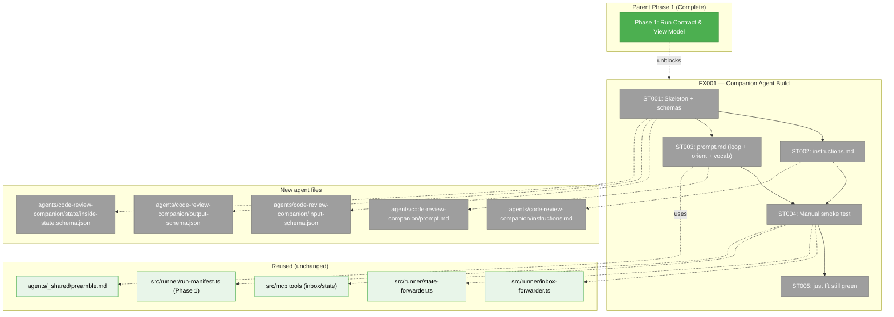
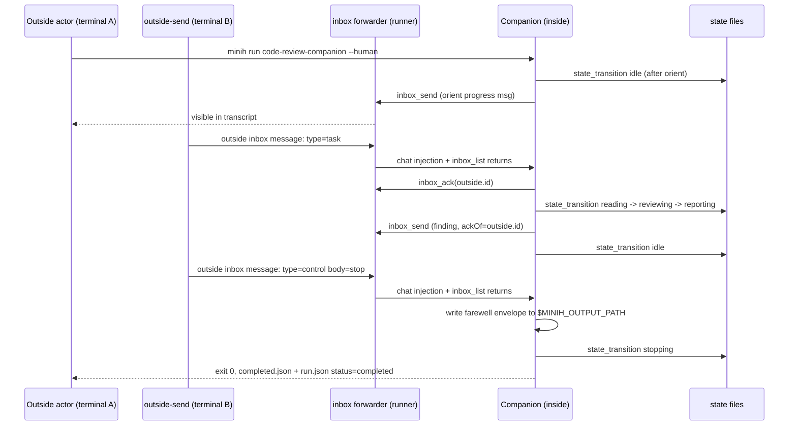

# Subtask FX001 — Build Code-Review Companion Exemplar Agent

**Parent Phase**: [Phase 1: Run Contract & View Model](./tasks.md)
**Parent Task**: T007 (`just fft` gate — phase complete)
**Plan**: [009-human-agent-view](../../human-agent-view-plan.md)
**Workshop**: [007-coordinated-code-review-companion](../../workshops/007-coordinated-code-review-companion.md)
**Created**: 2026-04-28
**Status**: Ready

---

## Parent Context

Phase 1 just landed the `runner`-side foundations for the Human Agent View: live `run.json` manifest, shared `resolveRun({ slug, mode })`, and the pure `buildHumanViewModel(...)` reducer. Phase 2 will build the Ink renderer that consumes those contracts.

Workshop 007 designed a **coordinated code-review companion agent** — a long-running, inbox-driven exemplar that pairs alongside us as we work. It is the dogfood subject Phase 2's `view` command needs: starting Phase 2 without something worth attaching to is a worse signal than starting Phase 2 with a real working partner.

This subtask **builds the agent now** so that Phase 2 implementation can immediately attach to it for live UX verification. **No new minih runtime code** — the agent uses only the coordination wiring already shipped in Plan 008 (inbox/state forwarders, six MCP tools).

---

## Executive Briefing

**Purpose**: Implement `agents/code-review-companion/` per Workshop 007 so we have a real coordinated agent to dogfood against during Phase 2 of plan 009.

**What We're Building**:
- A fresh agent folder at `/Users/jordanknight/substrate/minih/agents/code-review-companion/` containing:
  - `prompt.md` — frontmatter (`coordination: enabled`) + body (coordination loop + orient default + vocabularies).
  - `instructions.md` — review checklists (correctness, domain compliance, anti-reinvention, evidence).
  - `input-schema.json` — optional `initialTask`, `planPath`, `idleBudgetMs`.
  - `output-schema.json` — `farewell` envelope with session metadata + cumulative findings + summary + retro.
  - `state/inside-state.schema.json` — enum of inside statuses (`idle | reading | reviewing | reporting | blocked | stopping`).

**Goals**:
- ✅ Boot the agent and observe it produce its **orient** message within 60 s of `session_start`.
- ✅ Send an outside `task` from a second terminal via `minih outside-send` and observe the agent ack, transition state, work, and reply via inbox.
- ✅ Confirm the agent does NOT busy-loop while idle (long-poll `inbox_list({ waitMs })`).
- ✅ Send `control: stop` and observe a graceful `farewell` envelope plus exit 0.
- ✅ All Workshop 007 acceptance criteria 1-11 demonstrable.
- ✅ `just fft` still green (no minih changes; should be a no-op).

**Non-Goals**:
- ❌ No changes to the existing `agents/code-review/` (single-shot stays).
- ❌ No changes to minih runtime, CLI, or MCP code — coordination wiring is already shipped.
- ❌ No Phase 2 view code — that's the next phase. This subtask only delivers the dogfood subject.
- ❌ No throttling logic for `progress` messages — deferred to implementation observation (Workshop 007 § Deferred).

---

## Pre-Implementation Check

| File | Exists? | Domain | Notes |
|------|---------|--------|-------|
| `/Users/jordanknight/substrate/minih/agents/code-review-companion/prompt.md` | No | agents | Create — primary prompt with `coordination: enabled` frontmatter. |
| `/Users/jordanknight/substrate/minih/agents/code-review-companion/instructions.md` | No | agents | Create — review checklists (largest file). |
| `/Users/jordanknight/substrate/minih/agents/code-review-companion/input-schema.json` | No | agents | Create — `initialTask`, `planPath`, `idleBudgetMs` (all optional). |
| `/Users/jordanknight/substrate/minih/agents/code-review-companion/output-schema.json` | No | agents | Create — farewell envelope schema. |
| `/Users/jordanknight/substrate/minih/agents/code-review-companion/state/inside-state.schema.json` | No | agents | Create — enum of inside statuses for runtime validator. |
| `/Users/jordanknight/substrate/minih/agents/_shared/preamble.md` | Yes | agents (shared) | Reuse — already injected by runner. |
| `/Users/jordanknight/substrate/minih/agents/coordination-smoke-test/prompt.md` | Yes | agents | Read-only reference for coordination idioms. |
| `/Users/jordanknight/substrate/minih/agents/code-review/prompt.md` | Yes | agents | Read-only reference for review checklists; **do not modify**. |

**Concept duplication check**:
- "code review agent" — exists (`code-review/`); intentionally a different product (single-shot). Workshop 007 § "Why a New Agent" justifies the sibling.
- "coordinated agent" — exists (`coordination-smoke-test/`); minimal smoke. Companion is a richer, real-use exemplar.
- "long-poll inbox" — already in MCP tools (`inbox_list({ waitMs })`); **reuse, do not reimplement**.

**Contract changes**: None. This subtask adds an agent; no minih internals change.

**Harness**: No `docs/project-rules/harness.md`. Manual smoke is the verification path.

---

## Architecture Map

---

## Tasks

| Status | ID | Task | Domain | Path(s) | Done When | Notes |
|--------|-----|------|--------|---------|-----------|-------|
| [x] | ST001 | Create the agent skeleton: `agents/code-review-companion/` with empty `runs/` dir; write `input-schema.json` (`initialTask?: string`, `planPath?: string`, `idleBudgetMs?: integer min 60000 default 1800000`), `output-schema.json` per Workshop 007 sketch with the **complete `session` object required field set** (`startedAt`, `endedAt`, `exitReason ∈ {stop_requested, idle_budget, timeout, error}`, `messageCounts: { tasksReceived, findingsSent, questionsAsked }`) plus top-level `findings[]`, `summary` (minLength 50), `retrospective`. Set top-level `additionalProperties: true` (loose envelope, matches `coordination-smoke-test` precedent — explicit decision per validate-v2 fix). Write `state/inside-state.schema.json` with enum `[idle, reading, reviewing, reporting, blocked, stopping]` — note that minih's runtime validator does NOT yet enforce per-agent inside-state schemas (only `output-schema.json` and the shared `outside-state.schema.json` are runtime-validated); this file is **documentation/intent** that the agent's prompt references, not a runtime contract. | agents | `/Users/jordanknight/substrate/minih/agents/code-review-companion/{input-schema,output-schema}.json`, `/Users/jordanknight/substrate/minih/agents/code-review-companion/state/inside-state.schema.json` | `node dist/cli/index.js doctor 2>/dev/null \| jq '.data.agents."code-review-companion"'` reports the agent discovered with no schema errors; `node dist/cli/index.js list 2>/dev/null \| grep code-review-companion` finds it; `output-schema.json` includes the full `session` field set above. | Workshop 007 § Initial Task + § Anatomy. **Validate-v2 fixes**: full `session` object field set required (not just "metadata"); `additionalProperties: true` decision is explicit; `inside-state.schema.json` is documentation, not runtime contract. |
| [x] | ST002 | Write `instructions.md` containing the review checklists (correctness, domain compliance, anti-reinvention, evidence). Adapt from `agents/code-review/instructions.md` if present; otherwise embed the content from the existing `agents/code-review/prompt.md` "What to Review" / "Review Process" / sections A-D, **rewritten for a long-running pair**: each checklist becomes a tool the agent picks up per outside `task`, not a one-shot script. | agents | `/Users/jordanknight/substrate/minih/agents/code-review-companion/instructions.md` | File exists; ≥ 4 named checklists (Implementation Quality, Domain Compliance, Anti-Reinvention, Testing & Evidence); each checklist has bullet-level criteria the agent can apply per task. | Workshop 007 references the existing `code-review` content as the source-of-truth for review heuristics. |
| [x] | ST003 | Write `prompt.md` with frontmatter (`description`, `tags: [review, quality, coordination, exemplar]`, `model: gpt-5.5` (repo policy: always-latest GPT), `reasoning: xhigh`, `timeout: 7200`, `coordination: enabled`) and body sections per Workshop 007 § Anatomy: (1) Identity — **including explicit `cd $MINIH_PROJECT_ROOT` reminder** (orient depends on it), (2) Coordination Loop pseudocode (greet → loop { long-poll → ack → transition → work → reply → idle }), (3) State Vocabulary table (with explicit `state_transition` requirement, not `state_set`), (4) Inbox Vocabulary tables (outside types `task\|question\|directive\|control`, inside types `progress\|finding\|summary\|question\|ack\|farewell`, **`ackOf` rule**), (5) **Orient default verbatim** per Workshop 007 § "Built-in 'orient' behaviour" — plus a fallback for when `docs/plans/` is empty/missing (greet idle without summary), (6) reference to `instructions.md`, (7) Output contract (write farewell to `$MINIH_OUTPUT_PATH` on exit). **Stop-vs-idle precedence rule**: outside `control: stop` always wins over idle-budget shutdown until the farewell is committed (resolves FC-MED). | agents | `/Users/jordanknight/substrate/minih/agents/code-review-companion/prompt.md` | Frontmatter parses (`node dist/cli/index.js doctor 2>/dev/null` shows the agent with `coordination: enabled`); body covers all 7 sections; orient default is verbatim from Workshop 007 (with empty-plans fallback explicitly added); cd-reminder present; stop-precedence rule present. | Workshop 007 § Anatomy + § Initial Task. **Repo policy**: agents always use the latest GPT model — currently `gpt-5.5`. |
| [x] | ST004 | **Manual smoke test** — boot the companion and exercise the loop end-to-end. Run in one terminal: `node dist/cli/index.js run code-review-companion --human` (no input params, exercises orient default). In a second terminal: (a) `cat agents/code-review-companion/runs/<runId>/state/inside.json` once the orient `progress` message lands — expect `status: idle`; (b) `node dist/cli/index.js outside-send code-review-companion --type task --body "review src/runner/run-resolver.ts focusing on the latest-active path"`; (c) tail `agents/code-review-companion/runs/<runId>/inbox/inside/messages.ndjson` and watch for `progress` and `finding` messages with `ackOf` set; (d) **`directive` steering test** — while the agent is `reviewing`, send `outside-send --type directive --body "skip the test files"` and confirm scope narrows without restart (Workshop AC5); (e) **`question` blocked test** — send a deliberately ambiguous task, confirm agent transitions to `blocked` and posts an inside `question` message (Workshop AC6); (f) **idle-budget exit** — start a fresh run with `--param idleBudgetMs=60000`, send no messages, observe self-termination after ~60s with `farewell.session.exitReason === 'idle_budget'` (Workshop AC8); (g) `outside-send --type control --body "stop"` and confirm graceful exit 0 + `farewell` envelope at `output/report.json`; (h) **verify `run.json` capability**: `cat agents/code-review-companion/runs/<runId>/run.json \| jq .control.available` returns `true` (Phase 1 fix wired `coordinationEnabled → control.available`). Capture observed behaviour in a smoke-evidence note appended to the execution log. | agents (verification) | `agents/code-review-companion/runs/<runId>/` (any new runId) | Each of (a)-(h) succeeds; orient message lands within 60 s; agent does not busy-loop (events.ndjson rate < 1 evt/min while idle); farewell envelope passes `output-schema.json` validation. | Workshop 007 acceptance 1, 3, 4, 5, 6, 7, 8, 11. **Validate-v2 fixes**: idle-budget exit explicitly tested (was missing); directive steering test added (Workshop AC5 was uncovered); question/blocked test added (Workshop AC6 was uncovered); `control.available` verification added now that Phase 1 wires it. |
| [x] | ST005 | Run `just fft` — should be a no-op for source code (only agent files added) but confirms no regression. Capture pass/fail in execution log. | repo | repo root | `just fft` exits 0; tests still 468/477. | Per repo memory: own every finding `fft` surfaces. |

---

## Context Brief

### Workshop 007 Decisions Driving This Subtask

- Sibling agent at `agents/code-review-companion/` (NOT a patch to `code-review`).
- `coordination: enabled` frontmatter — runner wires inbox/state forwarders + inside MCP automatically.
- Agent uses only existing coordination tools: `inbox_list({ waitMs })`, `inbox_send`, `inbox_ack`, `state_get`, `state_set`, `state_transition`.
- **Orient default**: when no `initialTask` input is passed, the agent reads the active plan tree (highest-numbered `docs/plans/`), summarises status, and reports — then idles.
- Reply rule: every inside message that responds to an outside message must set `ackOf`.
- Idle path: `inbox_list({ waitMs: 30000, waitForAny: ['task','question','directive','control'] })` — bounded long-poll, no busy-loop.
- Exit conditions: outside `control: stop`, idle budget exceeded (default 30 min), or timeout. Always writes `farewell` envelope.

### Domain Dependencies

This subtask consumes — does NOT modify — these existing surfaces:

- `runner/inbox-forwarder` — outside inbox messages auto-delivered into the live SDK session as chat injection.
- `runner/state-forwarder` — outside state changes auto-delivered as chat injection.
- `mcp/tools/inbox` — `inbox_list` (with `waitMs` long-poll), `inbox_send`, `inbox_ack`.
- `mcp/tools/state` — `state_get`, `state_set`, `state_transition`.
- `runner/preamble-builder` — `agents/_shared/preamble.md` injected automatically.
- `runner/validator` — AJV validates `output-schema.json` and per-agent `state/inside-state.schema.json` against runtime payloads.
- `runner/run-manifest` (Phase 1) — `run.json` written automatically; companion does not touch it but Phase 2's view will read it for the header.

### Domain Constraints

- This subtask lives **entirely inside `agents/`**. No edits under `src/`, `test/`, or other agents.
- `prompt.md` frontmatter MUST include `coordination: enabled` or the inbox/state forwarders won't wire.
- Schema files MUST validate as JSON Schema draft 2020-12 (matches the rest of `agents/`).

### Reusable References

- Frontmatter style: `agents/code-review/prompt.md`, `agents/coordination-smoke-test/prompt.md`.
- Coordination idioms (call sequences for inbox/state tools): `agents/coordination-smoke-test/prompt.md`.
- Review checklist heuristics: `agents/code-review/prompt.md` body and (if present) `instructions.md`.
- Shared preamble: `agents/_shared/preamble.md` — already includes coordination env vars + magic-wand feedback contract.

### Mermaid Sequence — User ↔ Companion (smoke test path)

---

## Discoveries & Learnings

_Populated during implementation by plan-6._

| Date | Task | Type | Discovery | Resolution | References |
|------|------|------|-----------|------------|------------|

---

## After Subtask Completion

When all 5 tasks pass:
1. Mark this subtask `Status: Complete` (header).
2. Update parent `tasks.md` Notes column for T007 with: "Subtask FX001 completed — `agents/code-review-companion/` ready for Phase 2 dogfood."
3. The agent is now available for Phase 2 implementation: any `view <slug>` work in Phase 2 should use `code-review-companion` as the primary live test target.
4. Consider promoting Workshop 007's "Acceptance Criteria for This Agent" 1-11 to a permanent test-evidence note in this dossier's execution log.

---

## Validation Record (2026-04-28)

| Agent | Lenses Covered | Issues | Verdict |
|-------|---------------|--------|---------|
| Source-Truth | Hidden Assumptions, Technical Constraints, Concept Documentation | 2 HIGH fixed | ✅ |
| Cross-Reference | Integration & Ripple, Domain Boundaries, User Experience | 1 MEDIUM fixed (AC traceability), 1 LOW open | ⚠️ → ✅ (HIGH only) |
| Completeness | Edge Cases & Failures, Performance & Scale, Deployment & Ops, Security & Privacy | 1 MEDIUM fixed (idle-budget smoke), 3 LOW: 1 fixed (cd-reminder), 2 open | ⚠️ |
| Forward-Compatibility | Forward-Compatibility, System Behavior | 1 HIGH fixed (Phase 1 code), 2 MEDIUM: 1 fixed (stop precedence), 1 open, 1 LOW fixed (orient empty fallback) | ✅ |
| **Bonus** code-review agent on Phase 1 | live dogfood | 2 HIGH fixed (F001 missing exports, F002 strand on input-validation), 2 MEDIUM open | ✅ HIGH |

**Lens coverage**: 11/12 (above the 8-floor). Forward-Compatibility engaged.

### Forward-Compatibility Matrix

| Consumer | Requirement | Failure Mode | Verdict | Evidence |
|----------|-------------|--------------|---------|----------|
| `plan-6` implementor | Concrete tasks, absolute paths, success criteria, dependency chain, runtime hooks | Shape mismatch | ✅ | ST001-ST005 enriched with explicit field sets, smoke covers ACs 1/3/4/5/6/7/8/11. |
| Phase 2 of plan 009 | Companion shows `input-available` capability (Phase 1 manifest must set `control.available: true` when coordination enabled) | System Behavior | ✅ (Phase 1 code fixed) | `src/runner/runner.ts:265` now `control: { available: coordinationEnabled, kind: 'none' }`. |
| Outside-actor users | Discoverable + boots with orient + tolerates empty plan tree | User Experience | ✅ | ST003 now requires explicit empty-plans fallback in orient prompt. |
| Future plan 010 | Working exemplar to extend | Forward-Compatibility | ✅ | Workshop 007 § Deferred parks slash-commands and sub-agents; exemplar shape preserved. |

**Outcome alignment**: "Human Agent View provides a readable terminal operator console for minih agent runs. It lets an outside actor attach to an active or completed run and understand the inside agent's transcript, tool activity, message/activity timeline, state, output status, and available controls without juggling tail, status, inbox, and state commands separately." As shipped (after Phase 1 capability fix + dossier sharpening), the subtask **advances** the outcome — Phase 2 will see a real `input-available` companion to attach to and steer.

**Standalone?**: No — four named downstream consumers.

**Fixes applied (HIGH)**:
- Phase 1 F001: `src/runner/index.ts` now exports `resolveRun`, `buildHumanViewModel`, `readManifest`, `writeManifest`, `updateManifest`, `flushManifestThrottled`, `ResolveRunInput`, `HumanViewSources` — Phase 2 can import the full runtime surface.
- Phase 1 F002: invalid-input early return now patches manifest `status: 'failed'` so dead runs never look active.
- Phase 1 FC-HIGH: `control.available` now reflects `coordinationEnabled` so Phase 2's `view` correctly labels `input-available` for coordinated runs.
- ST source-truth HIGH 1: ST001 expanded with full Workshop 007 `session` field set (`exitReason`, `messageCounts`).
- ST source-truth HIGH 2: state schema reframed as documentation/intent (runtime validator does not enforce inside-state schemas).

**Fixes applied (cheap MEDIUMs/LOWs)**:
- Cross-ref MED: ST004 smoke expanded to cover Workshop ACs 5/6/8 (directive, blocked, idle-budget) — was silent.
- Completeness LOW: ST003 now requires explicit `cd $MINIH_PROJECT_ROOT` reminder in identity section.
- Completeness LOW: ST001 makes `additionalProperties: true` an explicit decision.
- FC MED: ST003 stop-vs-idle precedence rule added (outside `control: stop` always wins).
- FC LOW: Orient empty-plans fallback now required in ST003.

**Open (MEDIUM/LOW — implementor judgment)**:
- F003 (Phase 1 MED): stale default 60s — confirm whether 10s is preferred for Phase 2's view freshness; trivial change to `DEFAULT_STALE_THRESHOLD_MS` if so.
- F004 (Phase 1 MED): on failure paths, `agentResult.sessionId` may be empty even when `activeSessionId` is set; sessionId can be erased in completed.json + final manifest patch. Fix: fall back to `activeSessionId`.
- FC MED: no Phase 2 fixture path — manual-smoke only; consider capturing one run folder as a vitest fixture during Phase 2 implementation.

**Overall**: ⚠️ VALIDATED WITH FIXES — ready for `/plan-6` implementation. Phase 1 code regressions verified clean (`just fft` 468/477).
