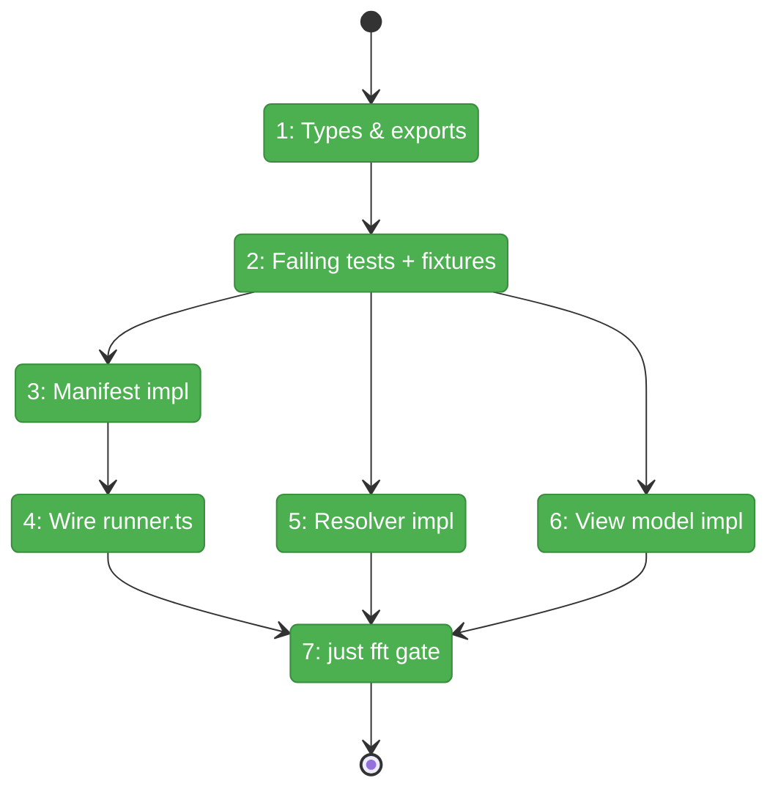
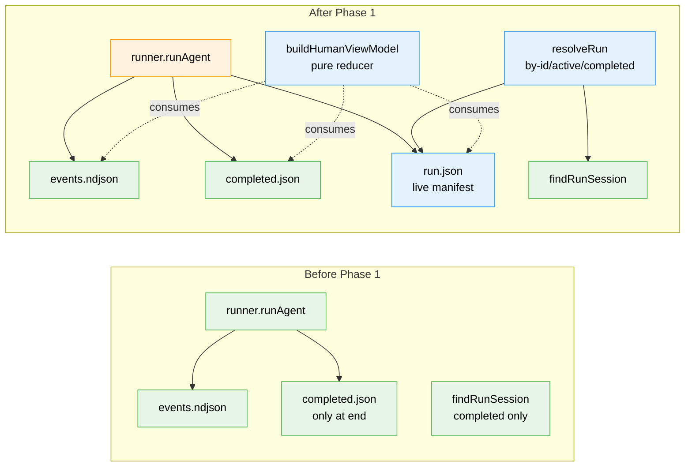

# Flight Plan: Phase 1 — Run Contract & View Model

**Plan**: [../../human-agent-view-plan.md](../../human-agent-view-plan.md)
**Phase**: Phase 1: Run Contract & View Model
**Generated**: 2026-04-28
**Status**: Landed

---

## Departure → Destination

**Where we are**: Minih's runner orchestrates agent runs and writes durable artifacts (`events.ndjson`, `completed.json`, inbox lanes, state files, history) but a live `sessionId` only lands in `completed.json` at the very end. Three CLI commands (`tail`, `status`, `connect`) each interpret "latest" differently. There is no canonical view-model — `tail` and pretty-mode render raw event lines.

**Where we're going**: After this phase, every run writes a `runs/<runId>/run.json` live manifest from the moment the folder is created and updates it through `session_start → active → completing → completed/failed`. A shared `resolveRun({ slug, mode })` answers `by-id`, `latest-active`, `latest-completed` queries with explicit ambiguity errors. A pure `buildHumanViewModel(...)` reducer projects raw artifacts into the Workshop 004 `HumanViewModel` shape — header, transcript, tools, coordination timeline, state, output, input, diagnostics — fully covered by failing-first unit tests. Phase 2 can then build its Ink renderer against a stable, tested contract.

---

## Domain Context

### Domains We're Changing

| Domain | What Changes | Key Files |
|--------|-------------|-----------|
| `runner` | New `LiveRunManifest`, `RunResolveMode`, view-model types; new `run-manifest.ts`, `run-resolver.ts`, `human-view-model.ts`, `human-view-fixtures.ts`; manifest writes wired into `runner.ts` at folder-create / `session_start` / event tick / terminal / completion. Public exports added to `index.ts`. | `src/runner/types.ts`, `src/runner/index.ts`, `src/runner/run-manifest.ts` (new), `src/runner/run-resolver.ts` (new), `src/runner/human-view-model.ts` (new), `src/runner/human-view-fixtures.ts` (new), `src/runner/runner.ts` |

### Domains We Depend On (no changes)

| Domain | What We Consume | Contract |
|--------|----------------|----------|
| `runner/atomic-write` (intra-domain) | `writeFileAtomicAsync` for atomic `run.json` writes | already exported via `src/runner/index.ts`; POSIX-only |
| `runner/folder` (intra-domain) | `findRunSession()` for resolver completed-only fallback | already exported |
| `adapter` | `AgentEvent` discriminated union typed as reducer input | type-only import |

---

## Flight Status

<!-- Updated by /plan-6-v2: pending → active → done. Use blocked for problems/input needed. -->

**Legend**: grey = pending | yellow = active | red = blocked/needs input | green = done

---

## Stages

<!-- Updated by /plan-6-v2 during implementation: [ ] → [~] → [x] -->

- [x] **Stage 1: Add types and re-exports** — declare `LiveRunManifest` (with `schemaVersion: 1` + Workshop 002 §1 full field set), `LiveRunStatus`, `RunResolveMode`, `ResolvedRun`, `MultipleActiveRunsError`, `ManifestSchemaVersionError`, and **every** Workshop 004 view-model type incl. all `CoordinationTimelineEntry` union members so failing tests can compile (`src/runner/types.ts`, `src/runner/index.ts`)
- [x] **Stage 2: Write failing tests + fixture builders** — TDD-first red bar across manifest, resolver, and reducer covering ACs 2/3/4/5/6/11/14 (`src/runner/human-view-fixtures.ts` — new file, `test/runner/{run-manifest,run-resolver,human-view-model}.test.ts` — new files)
- [x] **Stage 3: Implement run-manifest.ts** — atomic write/read + throttled `updateManifest()`; reuses `writeFileAtomicAsync` (`src/runner/run-manifest.ts` — new file)
- [x] **Stage 4: Wire manifest writes into runner.ts** — additive only; folder-create, `session_start`, event tick (throttled), terminal condition, completion/failure (`src/runner/runner.ts`)
- [x] **Stage 5: Implement run-resolver.ts** — `by-id` / `latest-active` (with `MultipleActiveRunsError`) / `latest-completed` (via existing `findRunSession()`) / `latest-any` (`src/runner/run-resolver.ts` — new file)
- [x] **Stage 6: Implement human-view-model.ts** — pure deterministic reducer; delta coalescing, tool pairing, ack correlation, output projection, diagnostics (`src/runner/human-view-model.ts` — new file)
- [x] **Stage 7: Run `just fft`** — full quality gate; own every finding

---

## Architecture: Before & After

**Legend**: existing (green, unchanged) | changed (orange, modified) | new (blue, created)

---

## Acceptance Criteria

- [ ] AC2 — `text_delta` stream + final `message` collapse to one transcript entry (reducer test).
- [ ] AC3 — Outside inbox rows labelled `Outside actor` (reducer test).
- [ ] AC4 — Inside `message` events labelled `Inside agent` (reducer test).
- [ ] AC5 — `tool_call` + `tool_result` pair into one `ToolCallView` with status (reducer test).
- [ ] AC6 — Inbox `ackOf` correlates inbox rows in coordination timeline (reducer test).
- [ ] AC11 — `latest-active` with multiple active runs throws `MultipleActiveRunsError` listing candidates (resolver test).
- [ ] AC14 — Malformed event/inbox lines emit `ViewDiagnostic` and never crash the reducer (reducer test).

## Goals & Non-Goals

**Goals**:
- Live `sessionId` durable from `session_start`, not just `completed.json`.
- One canonical "latest" run-resolution semantics for human-view commands.
- Pure, deterministic, well-tested view-model reducer covering Workshop 004 model in full.
- All new contracts surfaced via `src/runner/index.ts` so Phase 2 has a stable import surface.

**Non-Goals**:
- ❌ No CLI command, no Ink/React, no input bridge (Phase 2).
- ❌ No file command lane / cross-process control (deferred from plan).
- ❌ No migration of existing `tail`/`status`/`connect` to the new resolver.
- ❌ No real agent pause/kill.
- ❌ No Windows-specific atomic-write handling — POSIX-only by repo policy.

---

## Checklist

- [x] T001: Add full type surface (`LiveRunManifest` w/ `schemaVersion: 1` + Workshop 002 §1 fields, `LiveRunStatus`, `RunResolveMode`, `ResolvedRun`, `MultipleActiveRunsError`, `ManifestSchemaVersionError`, every Workshop 004 view-model + timeline sub-type); export from `runner/index.ts` (CS-1)
- [x] T002: Fixture builders + failing tests for manifest, resolver, reducer (CS-2)
- [x] T003: Implement `run-manifest.ts` with throttled atomic writes (CS-2)
- [x] T004: Wire manifest writes at folder-create / `session_start` / tick / terminal / completion in `runner.ts` (CS-2)
- [x] T005: Implement `run-resolver.ts` with `MultipleActiveRunsError` (CS-2)
- [x] T006: Implement pure `buildHumanViewModel` reducer (CS-3)
- [x] T007: `just fft` green; own all findings (CS-1)

---

## PlanPak

Not active for this plan.
