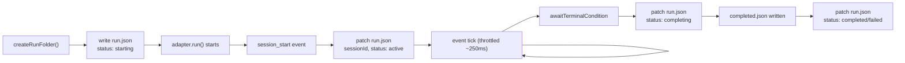
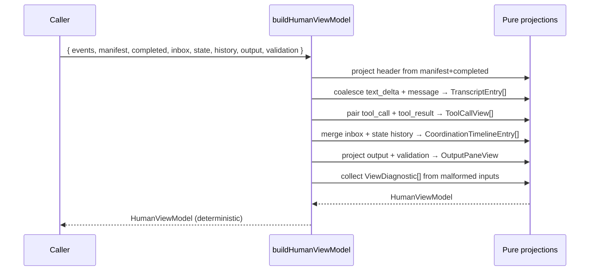

# Phase 1: Run Contract & View Model — Tasks

**Plan**: [../../human-agent-view-plan.md](../../human-agent-view-plan.md)
**Phase**: Phase 1: Run Contract & View Model
**Generated**: 2026-04-28
**Domain**: `runner` (modify)
**CS**: 3

---

## Executive Briefing

**Purpose**: Persist live run identity and project a pure, testable `HumanViewModel` from durable run artifacts so Phase 2's interactive Ink renderer has a stable, well-tested contract to consume.

**What We're Building**:
- A new `runs/<runId>/run.json` **live run manifest** (`schemaVersion: 1`, `slug`, `runId`, `runDir`, `pid`, `startedAt`, `updatedAt`, `status`, `sessionId`, `model`, `control`, `counters` — full Workshop 002 §1 field set) written at run-folder create, `session_start`, throttled per event tick, terminal condition, and completion/failure. Read path validates `schemaVersion`; v1 has no migration path (typed error on mismatch).
- A shared **run resolver** (`resolveRun({ slug, mode })`) that all human-view CLI commands will use to disambiguate `by-id`, `latest-active`, and `latest-completed` runs, with an explicit ambiguity error.
- A **pure view-model reducer** (`buildHumanViewModel`) that turns raw events + manifest + completion + inbox + state + history + output + validation artifacts into the `HumanViewModel` shape from Workshop 004 (header, transcript, tools, coordination timeline, state, output, input, diagnostics).

**Goals**:
- ✅ Live `sessionId` is durable from `session_start`, not just `completed.json` (Plan finding 01).
- ✅ One canonical "latest" semantics for human-view commands (Plan finding 02).
- ✅ Pure, deterministic, well-tested view-model reducer with delta coalescing, tool lifecycle pairing, ack correlation, output projection, and malformed-source diagnostics (Plan finding 04; AC2/3/4/5/6/14).
- ✅ Workshop 004 model surface stable enough for Phase 2 to destructure without follow-up shape changes (Forward-Compat HIGH from validate-v2).
- ✅ All new exports surfaced via `src/runner/index.ts`.

**Non-Goals**:
- ❌ No CLI command, no Ink/React, no input bridge — Phase 2.
- ❌ No file command lane / cross-process control — explicitly deferred per plan.
- ❌ No migration of existing `tail`/`status`/`connect` to the new resolver.
- ❌ No real agent pause/kill.
- ❌ No Windows-specific handling — `atomic-write.ts` is POSIX-only by repo policy; manifest inherits the same constraint.

---

## Prior Phase Context

_Phase 1. No prior phases._

---

## Pre-Implementation Check

| File | Exists? | Domain Check | Notes |
|------|---------|-------------|-------|
| `/Users/jordanknight/substrate/minih/src/runner/types.ts` | Yes | runner ✅ | Modify — add `LiveRunManifest`, `LiveRunStatus`, `RunResolveMode`, `ResolvedRun`, view-model types. |
| `/Users/jordanknight/substrate/minih/src/runner/index.ts` | Yes | runner ✅ | Modify — add exports for new contracts. |
| `/Users/jordanknight/substrate/minih/src/runner/run-manifest.ts` | No | runner ✅ | Create — manifest read/write/throttled-update helpers. |
| `/Users/jordanknight/substrate/minih/src/runner/run-resolver.ts` | No | runner ✅ | Create — `resolveRun({ slug, mode })`; reuses `findRunSession()` for completed. |
| `/Users/jordanknight/substrate/minih/src/runner/human-view-model.ts` | No | runner ✅ | Create — pure reducer; no I/O. |
| `/Users/jordanknight/substrate/minih/src/runner/human-view-fixtures.ts` | No | runner (test util) ✅ | Create — fixture builders (events/inbox/state/history/output) reusable by Phase 2/3 tests. |
| `/Users/jordanknight/substrate/minih/src/runner/runner.ts` | Yes | runner ✅ | Modify — wire manifest writes at folder-create / `session_start` (line ~403) / event tick / terminal condition (line ~516) / `completed.json` write (line ~644). Reuses existing seams. |
| `/Users/jordanknight/substrate/minih/src/runner/atomic-write.ts` | Yes | runner ✅ | Reuse `writeFileAtomicAsync` (already exported via `src/runner/index.ts`). POSIX-only by design — manifest inherits this. |
| `/Users/jordanknight/substrate/minih/src/runner/folder.ts` | Yes | runner ✅ | Reuse `findRunSession()` for completed-only fallback in resolver. |
| `/Users/jordanknight/substrate/minih/src/adapter/events.ts` | Yes | adapter (consume) ✅ | Reuse `AgentEvent` type to type reducer event input. No adapter changes. |
| `/Users/jordanknight/substrate/minih/test/runner/run-manifest.test.ts` | No | test ✅ | Create — TDD-first failing tests. |
| `/Users/jordanknight/substrate/minih/test/runner/run-resolver.test.ts` | No | test ✅ | Create — TDD-first failing tests. |
| `/Users/jordanknight/substrate/minih/test/runner/human-view-model.test.ts` | No | test ✅ | Create — TDD-first failing tests. |

**Concept duplication check** (`code-concept-search-v2` style scan, manual):
- "live run manifest / run.json" — does not exist; only `completed.json` exists today (`src/runner/runner.ts:644`).
- "run resolver" — `findRunSession()` exists (`src/runner/folder.ts`) but is completed-only; new resolver wraps + extends, does not duplicate.
- "view model" — none today; `displayEvent()` and `tail` render raw event lines.
- "atomic write" — reused from `src/runner/atomic-write.ts`. Do not re-implement.
- "throttle helper" — none in runner; implement inline (small, single-use).

**Contract changes**: Yes — new public exports from `runner/index.ts`. No existing exports change shape.

**Harness**: No `docs/project-rules/harness.md` configured. Implementation will use standard testing approach (Vitest + `just fft`).

---

## Architecture Map

```mermaid
flowchart TD
    classDef pending fill:#9E9E9E,stroke:#757575,color:#fff
    classDef completed fill:#4CAF50,stroke:#388E3C,color:#fff
    classDef existing fill:#E8F5E9,stroke:#4CAF50,color:#000

    subgraph Phase["Phase 1: Run Contract & View Model"]
        T001["T001: Types + exports"]:::pending
        T002["T002: Failing tests + fixtures"]:::pending
        T003["T003: run-manifest.ts impl"]:::pending
        T004["T004: Wire manifest into runner.ts"]:::pending
        T005["T005: run-resolver.ts impl"]:::pending
        T006["T006: human-view-model.ts impl"]:::pending
        T007["T007: just fft gate"]:::pending

        T001 --> T002
        T002 --> T003
        T002 --> T005
        T002 --> T006
        T003 --> T004
        T003 --> T007
        T004 --> T007
        T005 --> T007
        T006 --> T007
    end

    subgraph Files["New runner files"]
        F1["src/runner/types.ts"]:::pending
        F2["src/runner/index.ts"]:::pending
        F3["src/runner/run-manifest.ts (new)"]:::pending
        F4["src/runner/run-resolver.ts (new)"]:::pending
        F5["src/runner/human-view-model.ts (new)"]:::pending
        F6["src/runner/human-view-fixtures.ts (new)"]:::pending
        F7["src/runner/runner.ts"]:::pending
    end

    subgraph Existing["Reused (unchanged)"]
        E1["atomic-write.ts (writeFileAtomicAsync)"]:::existing
        E2["folder.ts (findRunSession)"]:::existing
        E3["adapter/events.ts (AgentEvent)"]:::existing
    end

    T001 -.-> F1
    T001 -.-> F2
    T002 -.-> F6
    T003 -.-> F3
    T003 -.-> E1
    T004 -.-> F7
    T005 -.-> F4
    T005 -.-> E2
    T006 -.-> F5
    T006 -.-> E3
```



---

## Tasks

| Status | ID | Task | Domain | Path(s) | Done When | Notes |
|--------|-----|------|--------|---------|-----------|-------|
| [x] | T001 | Add `LiveRunManifest` (with `schemaVersion: 1` and full Workshop 002 §1 field set: `slug`, `runId`, `runDir`, `pid`, `startedAt`, `updatedAt`, `status: LiveRunStatus`, `sessionId`, `model`, `control: { available, kind, commandLanePath? }`, `counters: { events, toolCalls, messages, errors }`), `LiveRunStatus = 'starting' \| 'active' \| 'idle' \| 'completing' \| 'completed' \| 'failed' \| 'stale'`, `RunResolveMode`, `ResolvedRun`, `MultipleActiveRunsError` (class), and the **complete** Workshop 004 view-model interfaces — `HumanViewModel`, `HumanHeaderView`, `TranscriptEntry`, `ToolCallView`, `CoordinationTimelineEntry` and **every** union member (`InboxTimelineEntry`, `StateTransitionTimelineEntry`, `ValidationTimelineEntry`, `ControlTimelineEntry`, `DiagnosticTimelineEntry`), `StatePaneView`, `OutputPaneView`, `InputFooterView`, `ViewDiagnostic` — to `src/runner/types.ts`. Add re-exports for **all** of these from `src/runner/index.ts`. Type-only — no runtime behavior. | runner | `/Users/jordanknight/substrate/minih/src/runner/types.ts`, `/Users/jordanknight/substrate/minih/src/runner/index.ts` | `npm run build` succeeds; every named type is importable from `'@/runner'` (or relative); `MultipleActiveRunsError` is a class with `candidates: Array<{ runId: string; startedAt: string; sessionId: string \| null }>`; no circular import; existing exports unchanged. | Plan task 1.1; Workshop 002 §1 (manifest schema with `schemaVersion: 1`); Workshop 004 §Top-Level Model + sub-types. Type-first so failing tests in T002 compile. **Validate-v2 fix**: every Phase 2 destructure target must be re-exported from `index.ts`. |
| [x] | T002 | Create `src/runner/human-view-fixtures.ts` with builders (`makeEventLog()`, `makeManifest()`, `makeCompleted()`, `makeInboxLane()`, `makeStateFile()`, `makeHistory()`, `makeOutput()`, `makeValidation()`). Write **failing** tests in `test/runner/run-manifest.test.ts`, `test/runner/run-resolver.test.ts`, `test/runner/human-view-model.test.ts`. Tests must import from the not-yet-implemented modules and assert against the contracts. Throttle tests use `vi.useFakeTimers()` (no real sleeps). | runner (test) | `/Users/jordanknight/substrate/minih/src/runner/human-view-fixtures.ts`, `/Users/jordanknight/substrate/minih/test/runner/run-manifest.test.ts`, `/Users/jordanknight/substrate/minih/test/runner/run-resolver.test.ts`, `/Users/jordanknight/substrate/minih/test/runner/human-view-model.test.ts` | `npx vitest run test/runner/run-manifest.test.ts test/runner/run-resolver.test.ts test/runner/human-view-model.test.ts` runs and **fails** with module-not-found / not-implemented (TDD red); test surface covers ACs 2, 3/4, 5, 6, 11, 14 listed below. | Plan task 1.2 (TDD-first per spec testing strategy). **Required test cases** (each must be a named `it(...)` block): **manifest** — (a) initial-state write with `schemaVersion: 1` round-trips correctly; (b) `status` patch progresses through `starting → active → completing → completed`; (c) throttled counter patches inside the throttle window do NOT dup-write to disk (verified with `vi.useFakeTimers()`); (d) `status` and `sessionId` patches bypass throttle and write immediately; (e) atomic write uses `writeFileAtomicAsync`; (f) `readManifest` returns `null` for missing file; (g) `readManifest` returns `null` + emits a diagnostic on torn/malformed JSON; (h) `readManifest` throws typed `ManifestSchemaVersionError` if `schemaVersion !== 1`; (i) crash-survival: a manifest left with `status: 'active'` after a fake "process exit" is still readable (does not corrupt `completed.json`). **resolver** — (a) `mode: 'by-id'` returns the named run; (b) `'by-id'` with non-existent `runId` returns `null`; (c) non-existent `slug` returns `null` (or typed error — pick one and test); (d) `'latest-active'` with one active run returns it; (e) `'latest-active'` with two active runs throws `MultipleActiveRunsError` whose `candidates` array lists each `{ runId, startedAt, sessionId }`; (f) `'latest-active'` returns `null` (or falls through per contract) when no active run exists; (g) `'latest-completed'` falls back via `findRunSession()`; (h) **per-candidate fault tolerance**: malformed `run.json` for one candidate while another is fine — resolver SKIPS the bad one and returns the good one (does not throw); (i) **stale detection**: a manifest whose `updatedAt` exceeds a configurable threshold is reported as `liveness: 'stale'`. **reducer** — (a) `text_delta` stream + final `message` collapse to one `TranscriptEntry` keyed by `messageId` (AC2); (b) inside `message` event labelled `Inside agent` (AC4); (c) outside inbox row labelled `Outside actor` (AC3); (d) `tool_call`+`tool_result` pair into one `ToolCallView` keyed by `toolCallId` with status (AC5); (e) inbox `ackOf` correlates inbox rows in coordination timeline (AC6); (f) `output` artifact projects into `OutputPaneView`; (g) malformed event line emits `ViewDiagnostic` and does NOT crash (AC14); (h) reducer is deterministic — calling twice with same input returns deeply-equal output. |
| [x] | T003 | Implement `src/runner/run-manifest.ts`: `writeManifest(runDir, manifest)`, `readManifest(runDir)` (returns `null` on missing/torn JSON; throws `ManifestSchemaVersionError` on `schemaVersion !== 1`), `updateManifest(runDir, patch, options?: { throttleMs?: number })` — patch-style update with ~250 ms throttle for `updatedAt`/counter-only patches. Use `writeFileAtomicAsync`. Status patches and `sessionId` patches bypass throttle (write immediately). All writes set `schemaVersion: 1`. Export `ManifestSchemaVersionError` via `src/runner/index.ts`. | runner | `/Users/jordanknight/substrate/minih/src/runner/run-manifest.ts` | `run-manifest.test.ts` turns green; round-trip works; throttled call coalesces (verified with fake timers); status/sessionId patches write immediately; schema-version mismatch throws typed error. | Plan task 1.3; reuse `writeFileAtomicAsync` (don't reimplement); POSIX-only inherited from `atomic-write.ts`. |
| [x] | T004 | Wire manifest writes in `src/runner/runner.ts` at: (a) immediately after `createRunFolder()` returns — write initial manifest with `status: 'starting'`, `sessionId: null`; (b) inside the `'session_start'` case (~line 403) — patch `sessionId` and `status: 'active'` (immediate, no throttle); (c) on every event tick after that case — throttled counter patch (`events`, `toolCalls`, `messages`, `errors`, `updatedAt`); (d) before `awaitTerminalCondition` (~line 511-516) — patch `status: 'completing'`; (e) just before / alongside the existing `completed.json` write (~line 644-668) — final patch `status: 'completed'` or `'failed'`. Do NOT remove or alter `completed.json` write; manifest is additive. | runner | `/Users/jordanknight/substrate/minih/src/runner/runner.ts` | A test under `FakeAgentAdapter` running an end-to-end run sees `run.json` progress through `starting → active → completing → completed`; `completed.json` still written; existing runner tests stay green. | Plan task 1.4; Workshop 002 §Write points; **must not** introduce SDK or CLI imports into runner. |
| [x] | T005 | Implement `src/runner/run-resolver.ts`: `resolveRun({ slug, mode })` returning `ResolvedRun \| null`; `mode: 'by-id'` requires `runId` and returns `null` if not found; `'latest-active'` lists runs with manifest `status` ∈ `{starting, active, completing}` and throws `MultipleActiveRunsError` listing `{ runId, startedAt, sessionId }` candidates if >1; `'latest-completed'` falls back via `findRunSession()`; `'latest-any'` prefers active else completed. **Per-candidate fault tolerance**: skip runs with unreadable/torn `run.json`, but include a diagnostic in the returned `ResolvedRun.diagnostics` so callers can surface (do NOT throw). **Stale detection**: a manifest whose `updatedAt` exceeds the configurable threshold (default 10 s; configurable via options) is reported as `liveness: 'stale'`. Non-existent slug returns `null`. | runner | `/Users/jordanknight/substrate/minih/src/runner/run-resolver.ts` | `run-resolver.test.ts` turns green for all four modes including per-candidate fault tolerance, stale detection, missing-runId, and missing-slug; `MultipleActiveRunsError` lists candidates (AC11). | Plan task 1.5; Plan finding 02/08; reuse `findRunSession()` from `folder.ts`; do not duplicate completed-session lookup. |
| [x] | T006 | Implement `src/runner/human-view-model.ts` with pure `buildHumanViewModel({ events, manifest, completed, inbox, state, history, output, validation })` that returns `HumanViewModel`. No I/O, no `await fs.*`. Implements: header projection (slug/runId/sessionId/status/capability/counts), transcript `text_delta`+`message` coalescing keyed by `messageId`, tool call/result pairing keyed by **`toolCallId`** (camelCase, per `src/adapter/events.ts:107-123`), coordination timeline merge from inbox lanes + state history with `ackOf` correlation, output-pane projection from `output`+`validation`, diagnostic surfacing for malformed lines (skip the bad line, emit `ViewDiagnostic`, never throw). | runner | `/Users/jordanknight/substrate/minih/src/runner/human-view-model.ts` | `human-view-model.test.ts` all green; reducer is deterministic (calling twice with same input returns equal output). | Plan task 1.6; Plan finding 04; Workshop 004 reducer pipeline; ACs 2, 3, 4, 5, 6, 14. **Must include** `output` and `validation` inputs (validate-v2 Forward-Compat fix). **Field name**: tool correlation is `toolCallId` not `tool_call_id` (validate-v2 source-truth fix). |
| [x] | T007 | Run `just fft`. Address any new lint/format/typecheck/test/audit findings owned by this change. | runner | repo root | `just fft` exits 0; new tests counted in vitest output; no new biome warnings; no new audit findings (or explicitly triaged per repo policy). | Plan task 1.7; pre-Phase-2 gate. Per repo memory: own every finding `fft` surfaces. **Subtask FX001 spawned (2026-04-28)** — see [001-subtask-build-code-review-companion-agent.md](./001-subtask-build-code-review-companion-agent.md) — builds the Workshop 007 coordinated companion as Phase 2 dogfood subject. |

---

## Context Brief

### Key Findings from Plan (referenced above)

- **Finding 01** (Critical) — Live `sessionId` is captured on `session_start` but only persisted in `completed.json`. **Action**: Write `run.json` early; update on `session_start`. Drives T001 (type), T003 (impl), T004 (wiring).
- **Finding 02** (Critical) — `tail`/`status`/`connect` interpret "latest" differently. **Action**: One shared resolver. Drives T001 (`RunResolveMode`), T005.
- **Finding 04** (High) — Raw file rendering recreates token-dump UX. **Action**: Pure `HumanViewModel` reducer with delta coalescing/tool pairing/ack correlation. Drives T002 (tests), T006 (impl).
- **Finding 08** (Medium) — `findRunSession()` is completed-only. **Action**: Resolver uses manifest first; falls back via `findRunSession()`. Drives T005.
- **Finding 09** (Medium) — `readRecentEventLines()` exists in `cli/tail.ts`. **Action for Phase 2** (not P1) — reuse rather than reimplement; **P1 reducer accepts already-loaded events**, no file reading.

### Domain Dependencies (concepts and contracts this phase consumes)

- `runner/atomic-write` — atomic file write helper (`writeFileAtomicAsync`) for `run.json`. Already exported from `src/runner/index.ts`. POSIX-only (Windows out of scope).
- `runner/folder` — `findRunSession()` for resolver completed-only fallback (T005). Already exported.
- `runner/types` — existing `CompletedMetadata`, `AgentRunConfig`, `InboxMessage`, `SideState`, `StateHistoryEntry` reused as inputs to the reducer.
- `adapter/events` — `AgentEvent` discriminated union typed as input to the reducer (T006). **Type-only import**; no SDK use.

### Domain Constraints

- **Import direction**: `runner → adapter` only. **Never** import from `cli`, `mcp`, `react`, `ink`, or `@github/copilot-sdk` in any Phase 1 file.
- **No I/O in `human-view-model.ts`**: pure reducer; tests should pass `events: AgentEvent[]` directly, not file paths.
- **Windows / cross-fs**: atomic-write is POSIX-only by design; manifest inherits this. Do not add a Windows shim in P1.
- **Public contract surface**: every new export must be re-exported via `src/runner/index.ts` (Phase 2 will import via that surface).
- **Existing exports** (`runAgent`, `findRunSession`, `writeFileAtomicAsync`, `CompletedMetadata`, …) **must not change shape** — additions only.

### Harness Context

No agent harness configured (no `docs/project-rules/harness.md`). Standard testing applies:
- **Verify**: `just fft` (lint → format → build → typecheck → test → audit)
- **Per-test-file**: `npx vitest run test/runner/<file>.test.ts`
- **Single test by name**: `npx vitest run -t "<name>"`

### Reusable from Prior Phases

None. This is Phase 1.

### Reusable for Future Phases

Phase 2 will import:
- `LiveRunManifest`, `RunResolveMode`, `ResolvedRun`, `MultipleActiveRunsError`, `HumanViewModel` (+ all sub-types) from `@runner` (re-exports).
- `resolveRun()` — drives `view <slug> [--run <id>]`.
- `buildHumanViewModel()` — drives the live run-feed projection in `src/cli/human/run-feed.ts` and the snapshot path in Phase 3.
- `human-view-fixtures.ts` builders — Phase 2 CLI tests + Phase 3 snapshot tests.

### Mermaid Flow Diagram — manifest lifecycle



### Mermaid Sequence Diagram — reducer pipeline (T006)



### Open MEDIUMs from validate-v2 (decision pending; do NOT block this phase)

- Windows TTY/publish smoke test (Phase 3 candidate).
- CS-4 vs CS-5 reassessment for Phase 2 (Phase 2 planning concern).
- Concept-table enumeration in Phase 3 task 3.7.
- `tail`/`status`/`connect` regression task in Phase 3.

These are **out of scope for Phase 1** and listed only for traceability.

---

## Discoveries & Learnings

_Populated during implementation by plan-6._

| Date | Task | Type | Discovery | Resolution | References |
|------|------|------|-----------|------------|------------|

**Types**: `gotcha` | `research-needed` | `unexpected-behavior` | `workaround` | `decision` | `debt` | `insight`

---

## Directory Layout

```
docs/plans/009-human-agent-view/
├── human-agent-view-plan.md
├── human-agent-view-spec.md
├── human-agent-view.fltplan.md
├── workshops/
│   ├── 001-product-shape-and-pane-model.md
│   ├── 002-attach-and-control-channel.md
│   ├── 003-pause-semantics.md
│   ├── 004-view-model-and-timeline.md
│   ├── 005-ink-react-prototype.md
│   └── 006-one-agent-mode-and-message-semantics.md
└── tasks/
    └── phase-1-run-contract-and-view-model/
        ├── tasks.md          ← this file
        ├── tasks.fltplan.md  ← generated by plan-5b
        └── execution.log.md  ← created by plan-6
```

**Next**: `/plan-6-v2-implement-phase --phase "Phase 1: Run Contract & View Model" --plan "/Users/jordanknight/substrate/minih/docs/plans/009-human-agent-view/human-agent-view-plan.md"`

---

## Validation Record (2026-04-28)

| Agent | Lenses Covered | Issues | Verdict |
|-------|---------------|--------|---------|
| Source-Truth | System Behavior, Hidden Assumptions, Technical Constraints | 1 HIGH fixed | ✅ |
| Cross-Reference | Integration & Ripple, Concept Documentation, Domain Boundaries | 1 MEDIUM fixed | ✅ |
| Completeness | Edge Cases & Failures, Performance & Scale, Deployment & Ops, User Experience | 2 HIGH fixed, 2 MEDIUM open, 1 LOW open | ⚠️ → ✅ (HIGH only) |
| Forward-Compatibility | Forward-Compatibility, Hidden Assumptions | 1 HIGH fixed, 1 MEDIUM fixed (folded into HIGH fix) | ✅ |

**Lens coverage**: 11/12 (above the 8-floor). Forward-Compatibility engaged.

### Forward-Compatibility Matrix

| Consumer | Requirement | Failure Mode | Verdict | Evidence |
|----------|-------------|--------------|---------|----------|
| `plan-6` implementor | Concrete tasks, absolute paths, measurable criteria, dependency chain, fixture scaffolding | Shape mismatch | ✅ | T002 now lists every `it(...)` block by behavior; T001 names every type. |
| Phase 2 dossier | Full Workshop 004 type surface re-exported from `src/runner/index.ts`; `MultipleActiveRunsError`, `ResolvedRun`, all timeline sub-types | Encapsulation lockout | ✅ | T001 now explicitly enumerates every type incl. union members. |
| Phase 3 dossier | Same `HumanViewModel` for snapshot path; reusable `human-view-fixtures.ts` builders | Test boundary | ✅ | Builders are runner-domain pure utilities, callable from CLI tests. |
| `src/cli/human/run-feed.ts` | Deterministic reducer over already-loaded sources | Lifecycle ownership | ✅ | T006 success criterion asserts determinism (call twice → equal). |

**Outcome alignment**: "Human Agent View provides a readable terminal operator console for minih agent runs. It lets an outside actor attach to an active or completed run and understand the inside agent's transcript, tool activity, message/activity timeline, state, output status, and available controls without juggling tail, status, inbox, and state commands separately." The Phase 1 dossier, as shipped, advances it (the verbatim source-of-truth contract Phase 2 will render is now fully specified, including the previously hidden type/export surface).

**Standalone?**: No — four named downstream consumers.

**Fixes applied (HIGH + paired MEDIUM)**:
- ST-HIGH: tool correlation field renamed to `toolCallId` (camelCase) per actual `AgentEvent` shape.
- COMP-HIGH-1: T002 expanded with explicit `it(...)`-block list including malformed-one-candidate, missing `runId`, missing `slug`, stale recovery, crash survival, fake-timer throttle assertions.
- COMP-HIGH-2: `schemaVersion: 1` + `ManifestSchemaVersionError` added to T001/T003; read-path version validation specified.
- FC-HIGH: T001 now names every type incl. `MultipleActiveRunsError`, `LiveRunStatus`, `ManifestSchemaVersionError`, all Workshop 004 sub-types and `CoordinationTimelineEntry` union members.
- CR-MED (paired): manifest brief now lists full Workshop 002 §1 field set.

**Open (MEDIUM/LOW — implementor judgment)**:
- COMP-MED-2: Some success criteria still narrative; implementor may add explicit assertion names while writing T002 — acceptable as long as the named cases are covered.
- COMP-LOW-1: `stale` handling now explicitly tested in T005 (closed in this pass).

**Overall**: ⚠️ VALIDATED WITH FIXES — ready for `/plan-6` implementation.
