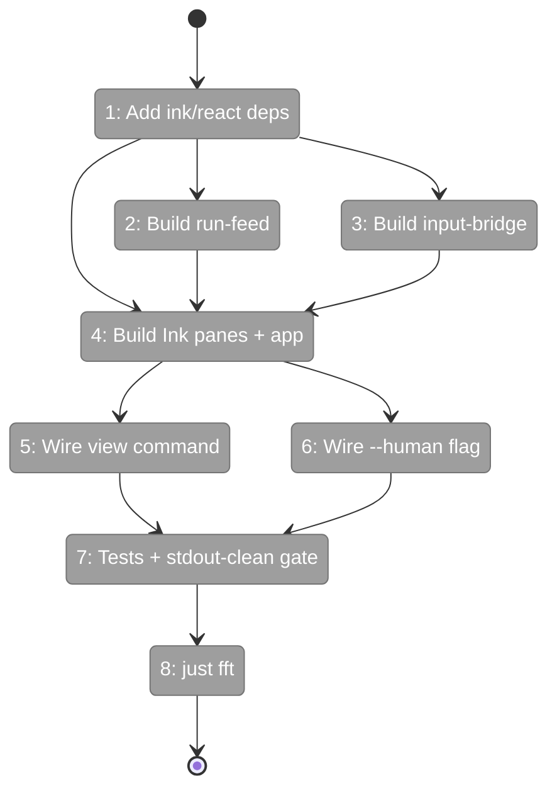
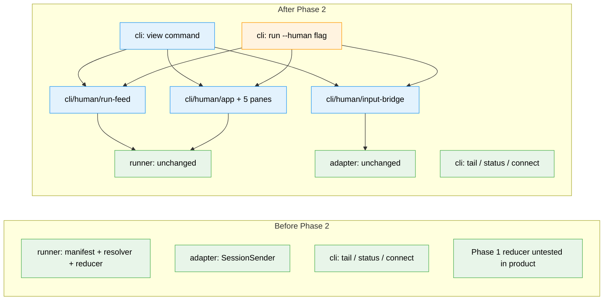

# Flight Plan: Phase 2 — Interactive Console & Commands

**Plan**: [../../human-agent-view-plan.md](../../human-agent-view-plan.md)
**Phase**: Phase 2: Interactive Console & Commands
**Generated**: 2026-04-30
**Status**: Ready for takeoff

---

## Departure → Destination

**Where we are**: Phase 1 shipped the foundations — `LiveRunManifest` (`run.json` written at folder-create / `session_start` / event tick / completion / failure), `resolveRun({ slug, mode })` for `by-id` / `latest-active` / `latest-completed` / `latest-any` with ambiguity errors, and the pure `buildHumanViewModel(sources)` reducer that produces `HumanViewModel` with header / transcript / tools / inbox / state / output / diagnostics slices. Nothing renders any of it yet — all of it is consumed only by tests.

**Where we're going**: A user typing `minih view <slug>` (or `minih run <slug> --human`) gets a live 5-pane Ink TUI rendered to stderr that updates in real time as the run progresses. Same-process runs (`run --human`) get a working footer that submits outside-actor messages via `SessionSender.send`; cross-process attaches see `attached-read-only`; completed runs show `completed`. Stdout stays empty during rendering (asserted by test). Pause toggle is scroll-only — never agent-pause.

---

## Domain Context

### Domains We're Changing

| Domain | What Changes | Key Files |
|--------|-------------|-----------|
| cli | New `view` command, `--human` flag on `run`, new `src/cli/human/` subdir with Ink renderer + run-feed + input-bridge + 5 panes. | `src/cli/commands/view.ts`, `src/cli/commands/run.ts`, `src/cli/index.ts`, `src/cli/human/{app,run-feed,input-bridge}.tsx/.ts`, `src/cli/human/panes/{header,transcript,tools,workbench,footer}.tsx` |
| build | Add `ink`, `react` (deps), `@types/react` (devDeps). Possibly add `"jsx": "react-jsx"` to `tsconfig.json` if not already present. | `package.json`, `tsconfig.json` (conditional) |
| cli (test) | New tests for input-bridge, view-command (incl. **stdout-clean assertion**), optional run-feed smoke. | `test/cli/human-input-bridge.test.ts`, `test/cli/view-command.test.ts` |

### Domains We Depend On (no changes)

| Domain | What We Consume | Contract |
|--------|----------------|----------|
| runner | Live run manifest reads | `LiveRunManifest`, `LiveRunStatus`, `readManifest` |
| runner | Run resolution | `resolveRun({ slug, mode, runId? })`, `MultipleActiveRunsError` |
| runner | View-model reducer | `buildHumanViewModel(sources): HumanViewModel`, `HumanViewSources` |
| runner | Coordinated artifact readers | `readInboxLane`, `readStateFile`, `readStateHistory` (existing, internal but reachable via `runner/index.ts`) |
| adapter | Same-process write channel | `SessionSender.send(prompt: string): Promise<string>`, surfaced via `AgentRunOptions.onSessionReady?` callback |
| cli (intra-domain) | Bounded torn-line-safe event reads | `readRecentEventLines` from `src/cli/commands/tail.ts:185` |

---

## Flight Status

<!-- Updated by /plan-6-v2: pending → active → done. Use blocked for problems/input needed. -->

**Legend**: grey = pending | yellow = active | red = blocked/needs input | green = done

---

## Stages

<!-- Updated by /plan-6-v2 during implementation: [ ] → [~] → [x] -->

- [ ] **Stage 1: Wire deps + tsconfig** — Add `ink`, `react`, `@types/react`; verify `.tsx` compiles (`package.json`, `tsconfig.json` if needed)
- [ ] **Stage 2: Run feed** — `fs.watch` loop + `readSnapshot()` one-shot helper for Phase 3 reuse; first emit lands before handle returns (`src/cli/human/run-feed.ts` — new file)
- [ ] **Stage 3: Input bridge** — Capability label + same-process `SessionSender.send` / refusal (`src/cli/human/input-bridge.ts` — new file)
- [ ] **Stage 4: Ink panes** — `app.tsx` exporting `mountHumanApp({ unmount, waitUntilExit })`; `exitOnCtrlC: false` (caller owns lifecycle); 5 panes; render to stderr; split layouts; pause-scroll copy (`src/cli/human/{app.tsx, panes/*.tsx}` — 6 new files)
- [ ] **Stage 5: `view` command** — Resolves run with **fallback chain** (`latest-active` → `latest-completed`); registers SIGINT → unmount; mounts read-only TUI (`src/cli/commands/view.ts` — new file; `src/cli/index.ts` — modified)
- [ ] **Stage 6: `run --human`** — Initial `feed.readSnapshot()` BEFORE mount; mount live TUI after `onSessionReady`; SIGINT → unmount + feed.stop (`src/cli/commands/run.ts` — modified)
- [ ] **Stage 7: Tests + stdout-clean gate** — Input-bridge unit tests, view-command integration, **stdout-empty assertion** (2 new test files)
- [ ] **Stage 8: `just fft`** — Pipeline green; audit triaged

---

## Architecture: Before & After

**Legend**: existing (green, unchanged) | changed (orange, modified) | new (blue, created)

---

## Acceptance Criteria

- [ ] AC-1: `minih view <slug>` resolves active run; `--run <id>` forces by-id; ambiguity → candidate-list error on stderr (T005)
- [ ] AC-2: `minih run <slug> --human` mounts the renderer after `onSessionReady`; footer becomes `input available` (T006)
- [ ] AC-3: Header shows slug / runId / sessionId / status / capability / event-count / tool-count (T004)
- [ ] AC-4: Transcript labels rows as `Outside actor` / `Inside agent`; coalesces text deltas (T004)
- [ ] AC-5: Tools pane renders compact lifecycle rows (running / success / error) (T004)
- [ ] AC-6: Workbench links acks to messages; renders reply-chain `ackOf` for non-ack types (T004)
- [ ] AC-7: Footer submit on same-process delivers as outside-actor message (T003, T006)
- [ ] AC-8: Read-only attach surfaces `attached-read-only` reason; completed surfaces `completed` (T003)
- [ ] AC-9: Pause toggle reads `Pause scroll` / `Resume follow`; never implies agent stops (T004)
- [ ] AC-15: Three split layouts via key handler (T004)
- [ ] AC-13 (HARD GATE): stdout produces zero terminal control bytes during view rendering (T007 — `expect(stdout.length).toBe(0)`)
- [ ] `npm audit` clean or new findings explicitly triaged (T001, T008)
- [ ] `just fft` green (T008)

## Goals & Non-Goals

**Goals**:
- Ship end-to-end `view` and `run --human` against Phase 1 contracts
- Capability-aware input via three-state bridge
- Stdout discipline enforced by automated test
- Visual parity with `scratch/human-agent-view/` baseline

**Non-Goals** (deferred or out of scope):
- `--snapshot` flag + non-TTY fallback (Phase 3 / T3.1)
- SIGINT / terminal cleanup handlers (Phase 3 / T3.2)
- `docs/how/human-view.md` + README quickstart (Phase 3 / T3.5/3.6)
- Cross-process input delivery (file command lane) — explicitly deferred in plan
- Domain history rows (Phase 3 / T3.7)
- Companion-mode-specific layout (revisit if drift surfaces)

---

## Checklist

- [ ] T001: Add `ink`, `react`, `@types/react`; verify `.tsx` compile + `npm audit` triaged
- [ ] T002: Implement `src/cli/human/run-feed.ts` (fs.watch + view-model rebuild)
- [ ] T003: Implement `src/cli/human/input-bridge.ts` (three-state capability bridge)
- [ ] T004: Implement Ink `app.tsx` + 5 panes; render to stderr; split layouts; correct pause copy
- [ ] T005: Implement `src/cli/commands/view.ts` and register in `src/cli/index.ts`
- [ ] T006: Add `--human` flag to `src/cli/commands/run.ts`; mount renderer after `onSessionReady`
- [ ] T007: Tests — `human-input-bridge.test.ts` + `view-command.test.ts` (incl. stdout-clean assertion)
- [ ] T008: `just fft` green; audit triaged
