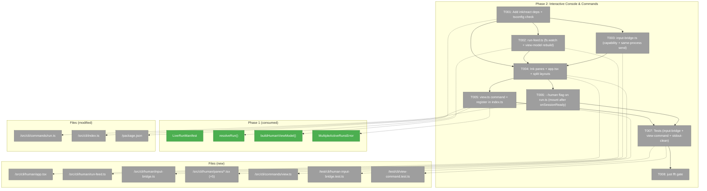
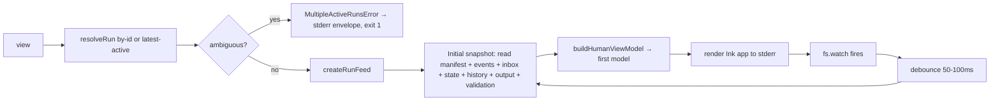
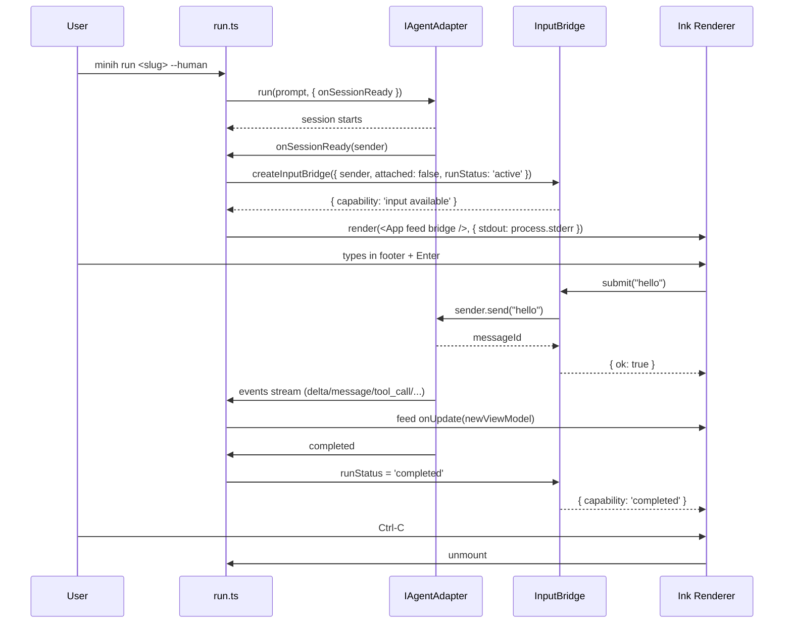
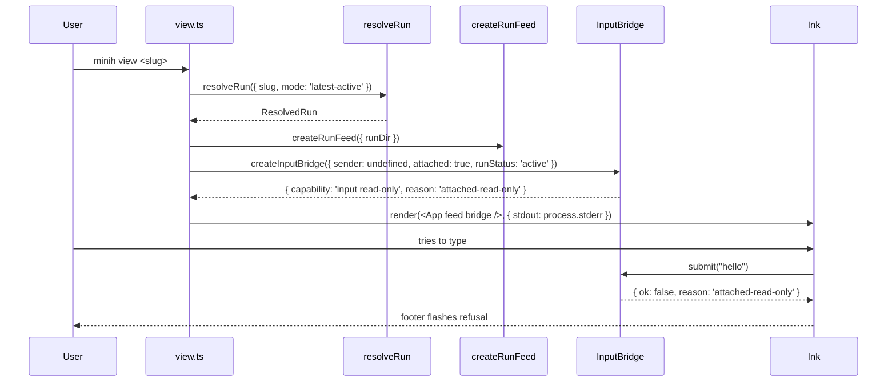

# Phase 2 Tasks — Interactive Console & Commands

**Plan**: [../../human-agent-view-plan.md](../../human-agent-view-plan.md)
**Phase**: Phase 2: Interactive Console & Commands
**Generated**: 2026-04-30

---

## Executive Briefing

**Purpose**: Ship the user-facing TUI for plan 009 — `minih view <slug>` (read-only / attached) and `minih run <slug> --human` (live, interactive). Renders the Phase 1 `HumanViewModel` via Ink/React to **stderr only**, with a capability-aware input footer that submits outside-actor messages via same-process `SessionSender.send`.

**What We're Building**:
- One Ink/React renderer (`app.tsx` + 5 panes) that consumes `HumanViewModel` from a file-watch loop (`run-feed.ts`)
- A capability-aware input bridge (`input-bridge.ts`) — same-process → live send, cross-process → `attached-read-only`, completed → no input
- Two entrypoints: a new `minih view <slug>` command and a `--human` flag on `minih run`
- Stdout discipline test that proves no terminal control bytes leak from either entrypoint

**Goals**:
- ✅ `minih view <slug>` and `minih run <slug> --human` both render a 5-pane TUI driven by Phase 1 view model
- ✅ Footer input delivers outside-actor messages on same-process runs; refuses with explicit reason on attach + completed
- ✅ Pause copy is `Pause scroll` / `Resume follow` — never implies agent stops
- ✅ Three split layouts (transcript-expanded / workbench-expanded / reset)
- ✅ Stdout stays empty during human-view rendering (asserted by test)
- ✅ `just fft` green; `npm audit` clean (or findings explicitly triaged)

**Non-Goals** (deferred or out of scope):
- ❌ Cross-process input delivery (file command lane) — spec §Deferred, plan finding 03
- ❌ `--snapshot` flag + non-TTY fallback — Phase 3 (T3.1)
- ❌ Terminal cleanup / SIGINT handlers — Phase 3 (T3.2)
- ❌ `docs/how/human-view.md` + README quickstart — Phase 3 (T3.5/3.6)
- ❌ Domain history rows — Phase 3 (T3.7)
- ❌ Alternate-screen / full-screen mode — out of scope per spec
- ❌ Companion-mode-specific layout — spec assumed one-shot trajectory; revisit if drift-watch picks it up

---

## Prior Phase Context

### Phase 1: Run Contract & View Model — DONE (2026-04-28)

**A. Deliverables** (absolute paths):

- `/Users/jordanknight/substrate/minih/src/runner/run-manifest.ts` — atomic `LiveRunManifest` writer/reader with throttled patches
- `/Users/jordanknight/substrate/minih/src/runner/run-resolver.ts` — `resolveRun({ slug, mode, staleThresholdMs?, agentsDir?, now? })` with `by-id` / `latest-active` / `latest-completed` / `latest-any`
- `/Users/jordanknight/substrate/minih/src/runner/human-view-model.ts` — pure `buildHumanViewModel(sources)` reducer
- `/Users/jordanknight/substrate/minih/src/runner/human-view-fixtures.ts` — fixture builders consumed by Phase 1 + 2 tests
- `/Users/jordanknight/substrate/minih/src/runner/human-view-errors.ts` — `MultipleActiveRunsError`, `ManifestSchemaVersionError`
- Re-exports added in `/Users/jordanknight/substrate/minih/src/runner/index.ts`
- Manifest writes wired in `runner.ts` at folder-create / `session_start` / event tick / completion / failure
- 30 new tests across runner test directory

**B. Dependencies Exported** (consumable by Phase 2):

- `LiveRunManifest`, `LiveRunStatus`, `RunResolveMode`, `ResolvedRun`, `ActiveRunCandidate`, `ResolverDiagnostic` (in `src/runner/types.ts`, re-exported via `src/runner/index.ts`)
- `HumanViewModel`, `HumanHeaderView`, `TranscriptEntry`, `ToolCallView`, `InboxTimelineEntry`, `StateTransitionTimelineEntry`, `ValidationTimelineEntry`, `ControlTimelineEntry`, `DiagnosticTimelineEntry`, `CoordinationTimelineEntry`, `StatePaneView`, `OutputPaneView`, `InputFooterView`, `ViewDiagnostic`
- `HumanViewSources`, `buildHumanViewModel(sources): HumanViewModel`
- `resolveRun(input): Promise<ResolvedRun>`
- `MultipleActiveRunsError` (with `candidates` field for the AC-11 ambiguity error path)
- `writeManifest`, `readManifest`, `updateManifest`, `flushThrottled` (mostly internal — Phase 2 should NOT call these directly; the renderer reads via the watch loop)

**C. Gotchas & Debt**:

- **Tool-call key is `toolCallId` (camelCase)** — not `tool_call_id`. The reducer pairs by this exact field; pane code must match.
- **Orphan results surface as `ViewDiagnostic` + synthetic row** — the tools pane must render synthetic rows distinguishably (e.g., warning style) without crashing.
- **`text_delta` coalescing keys on `messageId`** — orphan deltas (no matching `message`) become `streaming` rows. The transcript pane must render `streaming` rows differently from finalised `message` rows.
- **`readRecentEventLines()` was NOT extracted to runner** despite finding 09's plan-level direction. It still lives at `src/cli/commands/tail.ts:185`. Phase 2 has two options: (a) extract it now (cli → runner movement) or (b) wrap it in `run-feed.ts` for now and defer extraction. Pick one explicitly in T2.2.
- **Manifest throttle** — patches coalesce on a 250ms window; status / sessionId / control / model patches bypass throttle. The watch loop will see status flips quickly but counter updates may lag up to ~250ms. UI must not assume tight realtime.
- **Resolver per-candidate fault tolerance** — torn manifests produce a `ResolverDiagnostic`; healthy runs are still returned. The view command should surface diagnostics in the header or workbench (don't drop them silently).

**D. Incomplete Items**:

- None blocking. Phase 1 was fully completed (`tasks.md` shows all 7 tasks `[x]`).
- Subtask `001-subtask-build-code-review-companion-agent` (under Phase 1) — that's a sibling concern (built `code-review-companion` agent during the same window); not a Phase 2 dependency.

**E. Patterns to Follow**:

- **Pure reducer pattern**: Phase 1's `buildHumanViewModel` takes structured inputs and returns a model — no I/O. Phase 2's `run-feed.ts` is the I/O wrapper that converts artifact reads into reducer inputs. **Keep the I/O outside the reducer.**
- **Atomic writes via `writeFileAtomicAsync`** — already used by `run-manifest.ts`; Phase 2 doesn't need to reuse this directly (read-only consumer of manifests).
- **Diagnostics on malformed input, not throws** — Phase 1 chose to surface `ViewDiagnostic[]` instead of throwing. Phase 2 panes must render diagnostics, not assume clean inputs.
- **Test fixtures via `human-view-fixtures.ts`** — reuse `makeManifest`, `makeSessionStart`, `makeToolCall`, `makeInboxLane`, etc. for Phase 2 input-bridge and view-command tests where possible.

---

## Pre-Implementation Check

| File | Exists? | Domain Check | Notes |
|------|---------|-------------|-------|
| `src/cli/commands/view.ts` | ❌ NEW | cli ✓ | Plain command file pattern (cf. `agent-readme.ts`, `tail.ts`). |
| `src/cli/human/app.tsx` | ❌ NEW | cli ✓ | New subdirectory `src/cli/human/`. Mind tsconfig — already supports `.tsx`? **Verify in T2.1.** |
| `src/cli/human/run-feed.ts` | ❌ NEW | cli ✓ | Uses `fs.watch` + reuses or wraps `readRecentEventLines` from tail.ts (finding 09 still pending). |
| `src/cli/human/input-bridge.ts` | ❌ NEW | cli ✓ | Pure function over `SessionSender \| null` + capability label. |
| `src/cli/human/panes/{header,transcript,tools,workbench,footer}.tsx` | ❌ NEW (×5) | cli ✓ | One pane per file. Footer is the most stateful. |
| `src/cli/commands/run.ts` | ✓ EXISTS | cli ✓ | Add `--human` option; mount renderer after `onSessionReady`. **Risk**: cross-cuts existing run flow — surgical edit. |
| `src/cli/index.ts` | ✓ EXISTS | cli ✓ | Register `view` command alongside existing 22 commands. |
| `src/runner/index.ts` | ✓ EXISTS | runner ✓ | No changes if all Phase 2 imports are already re-exported (verified — `LiveRunManifest`, `HumanViewModel`, `resolveRun`, `buildHumanViewModel`, `MultipleActiveRunsError` all re-exported). |
| `src/cli/commands/tail.ts` | ✓ EXISTS | cli ✓ | Source of `readRecentEventLines`. **Decide T2.2**: import from cli (fine — both cli) or extract to runner (slightly cleaner, finding 09's intent). |
| `package.json` | ✓ EXISTS | — | Add `ink`, `react` (deps), `@types/react` (devDeps). **AC-18 from plan 015 was about plan-015's package.json invariance — that constraint does NOT apply to plan 009.** |
| `test/cli/human-input-bridge.test.ts` | ❌ NEW | cli (test) ✓ | Single home for input-bridge unit tests. |
| `test/cli/view-command.test.ts` | ❌ NEW | cli (test) ✓ | CLI integration via `execFileSync` against built CLI; **MUST assert `stdout.length === 0`** for the stdout-clean contract (AC-13). |

**Concept-search anti-reinvention check**:
- `run-feed.ts` watch loop: `fs.watch` is used in `src/runner/event-wait.ts` (plan 014) — **reuse the same Node API**, don't add new watcher dependency. Plan 014's `EventWatcher` is over events.ndjson specifically; the human-view feed needs broader coverage (events + manifest + inbox + state + history). Don't try to share — the requirements differ.
- `readRecentEventLines`: lives at `src/cli/commands/tail.ts:185`. Already torn-line-safe and bounded. **Reuse, don't reimplement.**
- Capability label derivation: lives nowhere yet. New concept (`input available` / `input read-only` / `completed`). Owned by `input-bridge.ts`.

**Harness context**: No `docs/project-rules/harness.md` configured. Standard testing applies (Vitest + `just fft`). Phase 1 followed this pattern; Phase 2 does the same.

**Drift Watch (since Phase 1 specced — pre plans 010-015)**:

| Drift | Impact on Phase 2 | Action |
|---|---|---|
| Plan 010 outside CLI rename (`outside-send` → `outside inbox send`) | Footer-submit semantic is unchanged (uses `SessionSender`, not the CLI) — no impact. | None. |
| Plan 011 retro harvest hint | Optional polish for completed-run footer. | Defer — Phase 3 polish if user requests. |
| Plan 012 peer telemetry (`peer.verdict`) | Workbench could surface `peer.verdict` from manifest if persisted there. **Manifest doesn't currently carry peer info.** | Defer — Phase 3 enhancement, would need manifest schema bump. |
| Plan 013 reply chains (`ackOf` for any type) | Activity / workbench pane "links acks to messages" (AC-6). The reducer already has `ackOf` correlation in `InboxTimelineEntry` via `acked` / `acks-other` / `unacked`. | **Verify** the workbench pane renders chain-style for non-ack types too. |
| Plan 014 `wait_for_any` | New tool name in tools pane. The reducer pairs by `toolCallId` regardless of name — should just work. | None — verify by looking at a real wait_for_any tool call event in fixture. |
| Plan 015 + companion mode | Long-lived runs accumulate many messages. The view-model is reset per snapshot; should scale. | None — but record as discovery if rendering chokes on large inbox lanes. |

---

## Architecture Map



---

## Tasks

| Status | ID | Task | Domain | Path(s) | Done When | Notes |
|--------|-----|------|--------|---------|-----------|-------|
| [x] | T001 | Add `ink`, `react` to `dependencies` and `@types/react` to `devDependencies` in `package.json`. Run `npm install`. Verify TypeScript compiles `.tsx` (check `tsconfig.json` `jsx`/`include`/`module` settings — add `"jsx": "react-jsx"` if missing). Verify `npm run build` is clean. Run `npm audit` and triage findings per repo policy (own every finding). | cli | `/Users/jordanknight/substrate/minih/package.json`, `/Users/jordanknight/substrate/minih/tsconfig.json` (only if `.tsx` not yet supported) | `npm install` succeeds; `npm run build` clean; any audit findings triaged with documented action. | Per finding 10. |
| [x] | T002 | Implement `src/cli/human/run-feed.ts`. Export `createRunFeed({ runDir, onUpdate, signal? }): { stop(): void; readSnapshot(): Promise<HumanViewSources> }`. **`readSnapshot()` is a public one-shot read** that Phase 3's snapshot mode will reuse without subscribing to the watcher. On start, snapshot all artifacts via `readSnapshot()` then call `onUpdate(buildHumanViewModel(sources))`. **Initial snapshot MUST complete before the first `onUpdate` fires** so the renderer has a populated view-model on first paint. Source readers: events.ndjson via `readRecentEventLines` from `/Users/jordanknight/substrate/minih/src/cli/commands/tail.ts:185` (intra-domain cli import — see decision below); manifest via `readManifest` from `src/runner`; inbox lanes via direct JSONL read using `inboxLanePath(location, side)` from `src/runner/folder.ts` (no canonical one-shot reader exists — `pollInboxLane` is long-poll + peer-detect, too heavyweight for a view feed); state files via `readStateLazy` from `src/runner/state.ts`; history via direct JSONL read using `historyPath(location)`; output + completed.json via standard `fs.readFile`; latest validation via standard `fs.readFile` (path TBD by inspecting Phase 1 fixtures). Set up `fs.watch` on the run dir; on any change, debounce ~50-100ms, re-snapshot, re-build, re-emit. Platform note: `fs.watch` recursive flag is supported on macOS (Darwin) and Windows but NOT reliable on Linux — start non-recursive and watch `events.ndjson`, `run.json`, inbox lanes, state files, history file, completed.json individually; if a Linux user later reports staleness, fall back to a 500ms-poll mode (record as discovery if needed). | cli | `/Users/jordanknight/substrate/minih/src/cli/human/run-feed.ts`, `/Users/jordanknight/substrate/minih/test/cli/human-run-feed.test.ts` (small unit) | `createRunFeed()` against a fixture run dir emits at least 2 view-model snapshots when events.ndjson changes; first emission lands BEFORE returning the handle (or via the first `onUpdate` call before any external trigger); `stop()` cleans up watchers; `readSnapshot()` returns a one-shot read without starting watchers; no leaked file handles. | **Decision (locked, see Discoveries)**: import `readRecentEventLines` directly from `src/cli/commands/tail.ts` — do NOT extract to runner in this phase. Records as `decision` in Discoveries. Per finding 09 the eventual extraction is intended, but Phase 2 isn't the right time. The readers above are the actual function names verified in `src/runner/` on 2026-04-30. |
| [x] | T003 | Implement `src/cli/human/input-bridge.ts`. Export `createInputBridge({ sender?: SessionSender, runStatus: LiveRunStatus, attached: boolean }): InputBridge` where `InputBridge = { capability: 'input available' \| 'input read-only' \| 'completed', reason?: string, submit(text: string): Promise<{ ok: true } \| { ok: false, reason: string }> }`. Logic: same-process (`sender` provided + `attached === false` + `runStatus !== 'completed'/'failed'`) → `input available`, submit calls `sender.send(text)`. Cross-process attach (`sender` not provided + run is active) → `input read-only`, reason `attached-read-only`, submit returns `{ ok: false }`. Completed run → `completed`, reason `run completed`, submit returns `{ ok: false }`. | cli | `/Users/jordanknight/substrate/minih/src/cli/human/input-bridge.ts` | Capability label derived correctly from inputs; `submit()` delegates to sender or refuses with reason. | Per spec AC-7/8; finding 07. Pure function — easy to unit test. |
| [x] | T004 | Implement Ink panes and root component. Files: (a) `src/cli/human/app.tsx` — Ink root, takes `{ feed, bridge, snapshot? }`, owns split-layout state (`'transcript' \| 'workbench' \| 'reset'`) + key handler (Workshop 003 keybindings — match scratch app.mjs); renders to `process.stderr` via Ink `<Static>` + `<Box>`. **Export `mountHumanApp(props): { unmount(): void; waitUntilExit(): Promise<void> }`** so callers (T005, T006, and Phase 3's snapshot/SIGINT path) own lifecycle. **Configure Ink with `exitOnCtrlC: false`** — process exit is owned by the caller (T005/T006 register Ctrl-C → `unmount()` themselves; Phase 3 will register SIGINT/SIGTERM at the same hook point). On unmount, **call `feed.stop()`** to release watchers. (b) `src/cli/human/panes/header.tsx` — slug, runId, sessionId, status, capability label, event/tool counts. (c) `src/cli/human/panes/transcript.tsx` — outside-actor / inside-agent rows, coalesced messages, streaming rows distinguished, malformed-input diagnostics rendered inline as warnings. (d) `src/cli/human/panes/tools.tsx` — compact lifecycle rows (running/success/error). (e) `src/cli/human/panes/workbench.tsx` — coordination timeline + state pane + output pane; renders inbox `acked` / `acks-other` / `unacked` ack states; renders `ackOf` reply chains for non-ack types. (f) `src/cli/human/panes/footer.tsx` — capability label + text input + pause toggle (`Pause scroll` / `Resume follow` — never agent-pause); on submit calls `bridge.submit()`. **Text input implementation**: prefer Ink's built-in `useInput` hook (no extra dep) for v1; if `useInput` proves too thin for cursor / paste / multi-line, escalate to adding `ink-text-input` to T001 deps and record as a discovery. Configure Ink `render(<App />, { stdout: process.stderr, exitOnCtrlC: false })`. | cli | `/Users/jordanknight/substrate/minih/src/cli/human/app.tsx`, `/Users/jordanknight/substrate/minih/src/cli/human/panes/header.tsx`, `/Users/jordanknight/substrate/minih/src/cli/human/panes/transcript.tsx`, `/Users/jordanknight/substrate/minih/src/cli/human/panes/tools.tsx`, `/Users/jordanknight/substrate/minih/src/cli/human/panes/workbench.tsx`, `/Users/jordanknight/substrate/minih/src/cli/human/panes/footer.tsx` | `mountHumanApp()` returns `{ unmount, waitUntilExit }`; calling `unmount()` also calls `feed.stop()` (verified by spy or fake feed); manual scratch parity check (`node scratch/human-agent-view/src/app.mjs --fixture coordination-rich`) shows same logical content; pause toggle reads `Pause scroll` / `Resume follow`; transcript rows say `Outside actor` / `Inside agent`; three split layouts work via key handler. | Workshop 001 layout, Workshop 003 pause labels, findings 05/06/07. **Largest task — most polish**. **Phase 3 forward-compat**: explicit `unmount()` handle + `exitOnCtrlC: false` is the seam Phase 3 uses for SIGINT/SIGTERM cleanup (per validation 2026-04-30). |
| [x] | T005 | Implement `src/cli/commands/view.ts`. Register `minih view <slug> [--run <id>]`. **Resolver fallback chain** (per validation 2026-04-30): if `--run <id>` → `mode: 'by-id'`; else try `mode: 'latest-active'`, and if no active run is found, fall back to `mode: 'latest-completed'`. If both miss, return a clean `formatError` envelope with code `E141`/equivalent and `details.tried: ['latest-active', 'latest-completed']`. On `MultipleActiveRunsError`, write a `formatError` envelope to **stderr**, list candidates in `details.candidates`, exit 1 (this is a JSON envelope error path — matches existing CLI error convention, doesn't violate stdout discipline because failures go to stderr). On success, instantiate `createRunFeed`, build `InputBridge` with `sender: undefined, attached: true, runStatus: <from manifest>`, call `mountHumanApp({ feed, bridge })` from T004. Register Ctrl-C → `unmount()` via `process.on('SIGINT', ...)` (Phase 3 will harden this). Register in `src/cli/index.ts`. **Defer `--snapshot` to Phase 3.** | cli | `/Users/jordanknight/substrate/minih/src/cli/commands/view.ts`, `/Users/jordanknight/substrate/minih/src/cli/index.ts` | `node dist/cli/index.js view <slug>` resolves an active run when one exists; resolves to the latest completed run when none active; `--run <id>` forces by-id; ambiguous active runs surface `MultipleActiveRunsError` envelope on stderr with candidate list; "no run for slug at all" returns a clean error not a crash. | Per AC-11; finding 02. |
| [x] | T006 | Add `--human` boolean flag to `src/cli/commands/run.ts`. When set, after the run starts and `onSessionReady(sender)` fires, instantiate `createRunFeed({ runDir })`, **call `feed.readSnapshot()` once before mounting** (per validation 2026-04-30 — guarantees the renderer paints with any events that landed before `onSessionReady`), then build `bridge = createInputBridge({ sender, runStatus: 'active', attached: false })` and call `mountHumanApp({ feed, bridge })`. Register `process.on('SIGINT', () => { unmount(); feed.stop(); })`. Coexist with existing pretty/verbose modes via mutually-exclusive validation (e.g., `--human` + `--verbose` → reject with E1xx). The renderer takes over stderr; the existing `displaySummary` final block must NOT print after Ink unmounts — gate via `if (opts.human) { startHumanRender(...) } else { existingPrettyOrPlainPath() }` and return early. | cli | `/Users/jordanknight/substrate/minih/src/cli/commands/run.ts` | `node dist/cli/index.js run <slug> --human` mounts the live TUI; first paint shows accumulated events from before `onSessionReady` (no blank initial frame); footer becomes `input available`; submitting from footer delivers via `SessionSender.send()` and the message appears in transcript on next snapshot. | Per spec goals §1; AC-7. **Cross-cuts existing run flow — surgical edit only.** |
| [x] | T007 | Write tests:<br>(a) `test/cli/human-input-bridge.test.ts` — covers all three capability states (same-process / attached / completed), `submit()` delegation, refusal reasons, runStatus transitions (active → completed flips capability).<br>(b) `test/cli/view-command.test.ts` — covers: `view <slug>` against a fixture run dir resolves correctly; ambiguity error envelope on stderr lists candidates; **`stdout.length === 0` (or contains zero terminal control bytes via regex `/\x1b\[/`) during view rendering** (AC-13 stdout-clean assertion); `--run <id>` forces by-id; non-existent slug returns clean error.<br>(c) Optional smoke: `test/cli/human-run-feed.test.ts` — fixture-driven, write events.ndjson, observe at least 2 emissions. | cli (test) | `/Users/jordanknight/substrate/minih/test/cli/human-input-bridge.test.ts`, `/Users/jordanknight/substrate/minih/test/cli/view-command.test.ts`, optional `/Users/jordanknight/substrate/minih/test/cli/human-run-feed.test.ts` | All new tests green via `npx vitest run test/cli/human-input-bridge.test.ts test/cli/view-command.test.ts`; stdout-clean assertion fails the test if any control bytes leak. | Per finding 05 — stdout discipline is the highest-value invariant in this phase. |
| [x] | T008 | Run `just fft`. Address every finding as ours (per repo doctrine — "any areas of found are ours"). Special attention to: lint on `.tsx` files (Biome supports it, but rules may differ); audit findings from new `ink`/`react` transitive deps. | all | repo root | `just fft` exits 0 end-to-end; tests count grows by ≥ T007 additions; audit clean or findings explicitly triaged. | Pre-Phase-3 gate. |

---

## Context Brief

**Key findings from plan** (relevance to Phase 2):

- **Finding 03** (Critical): Cross-process attach-control needs a durable command lane that doesn't exist yet → **Phase 2 ships `attached-read-only` only**; same-process write only via `SessionSender`. File command lane is explicitly deferred. T2.3 enforces this.
- **Finding 05** (High): TUI must keep stdout clean → **T2.4 configures Ink `stdout: process.stderr`**; T2.7 asserts via regex `/\x1b\[/` that stdout is byte-empty.
- **Finding 06** (High): "Pause" must never imply agent stops → **T2.4 footer copy is `Pause scroll` / `Resume follow`** (note plan-3 says `Follow paused` only; spec says `Pause scroll` / `Resume follow` — defer to spec because it's the user-facing canon).
- **Finding 07** (High): Hide `coordination.enabled` behind capability labels → **T2.3 input-bridge derives `input available` / `input read-only` / `completed`** from runtime state, never exposes the gate.
- **Finding 09** (Medium): Reuse `readRecentEventLines` → **T2.2 imports from `src/cli/commands/tail.ts:185` directly**. Extracting to runner is recorded as a discovery / future cleanup, not blocked here.
- **Finding 10** (Medium): `ink` + `react` install footprint → **T2.1 audit** is the gate. Plan was specced ~April 28; npm tree changed since.

**Domain dependencies** (concepts and contracts this phase consumes — from `docs/domains/runner/domain.md` and `docs/domains/adapter/domain.md`):

- `runner`: **Live Run Manifest** (`LiveRunManifest`, `readManifest`) — header pane reads slug/runId/sessionId/status/counters
- `runner`: **Run Resolution** (`resolveRun({ slug, mode })`) — `view` command resolves the active run
- `runner`: **Run Resolution Error** (`MultipleActiveRunsError` with `candidates`) — `view` command's ambiguity surface
- `runner`: **Human View Model** (`buildHumanViewModel(sources)`) — every pane consumes `HumanViewModel` slices
- `runner`: **Human View Sources** (`HumanViewSources` interface) — the shape that `run-feed.ts` constructs
- `runner`: **Inbox Lane Reader** + **State File Reader** + **State History Reader** — `run-feed.ts` reads coordinated artifacts
- `adapter`: **Session Sender** (`SessionSender { send(prompt: string): Promise<string> }`, exposed via `onSessionReady` callback in `AgentRunOptions`) — the in-process write channel for `--human` runs
- `adapter`: **Agent Run Options** (`AgentRunOptions.onSessionReady?`) — the callback that hands `SessionSender` to the renderer in T2.6
- `cli` (intra-domain): **Recent Event Lines Reader** (`readRecentEventLines` from `src/cli/commands/tail.ts:185`) — torn-line-safe bounded read

**Domain constraints**:

- All Phase 2 source files MUST live under `src/cli/`. Do NOT add files under `src/runner/` (that domain is closed for Phase 2 modifications).
- Renderer code (Ink/React) imports from `runner` and `adapter` via their `index.ts` barrels only — no deep imports into either domain's internals.
- Ink renderer MUST output to `process.stderr` (capability convention). The new `view` command's JSON-envelope error paths still use stdout for envelopes (matches existing CLI error convention) — but successful TUI rendering produces zero stdout bytes.
- Test placement: all new test files in `test/cli/` (per repo convention — no `test/build/`, `test/integration/`, etc.). Ref: plans 014 + 015 caught test-placement drift; we don't repeat that here.

**Harness context**: No `docs/project-rules/harness.md` configured. Standard testing applies (Vitest + `just fft`).

**Reusable from prior phases**:

- **Test fixtures**: `src/runner/human-view-fixtures.ts` exports `makeManifest`, `makeSessionStart`, `makeUserPrompt`, `makeTextDelta`, `makeMessage`, `makeToolCall`, `makeToolResult`, `makeEventLog`, `makeInboxMessage`, `makeInboxLane`, `makeStateFile`, `makeHistory`, `makeOutput`, `makeValidation`. Phase 2 tests should import these to construct `HumanViewSources` without re-rolling fixtures.
- **`MultipleActiveRunsError` shape**: Phase 1 tests already cover the candidate-list shape. Phase 2's view-command test reuses the same fixture to drive an ambiguous-active scenario.
- **Reducer determinism**: Phase 1 proved `buildHumanViewModel` is pure and deterministic; Phase 2's renderer can re-call it on every snapshot without idempotency concerns.

**Mermaid flow diagram** (run-feed lifecycle):



**Mermaid sequence diagram** (`--human` mode lifecycle):



**Sequence diagram** (`view` mode — read-only attached):



---

## Discoveries & Learnings

_Populated during implementation by plan-6._

| Date | Task | Type | Discovery | Resolution | References |
|------|------|------|-----------|------------|------------|

**Types**: `gotcha` | `research-needed` | `unexpected-behavior` | `workaround` | `decision` | `debt` | `insight`

Pre-recorded discoveries (decisions baked into the dossier):

| Date | Task | Type | Discovery | Resolution | References |
|------|------|------|-----------|------------|------------|
| 2026-04-30 | T002 | decision | `readRecentEventLines` was NOT extracted to runner in Phase 1 despite finding 09's intent. | Reuse from `src/cli/commands/tail.ts:185` directly (cli intra-domain import). Defer extraction. Will surface in Phase 3 retro if a third consumer appears. | finding 09 |
| 2026-04-30 | T002 | decision | No canonical one-shot reader for inbox lanes exists in `runner` — `pollInboxLane` is long-poll + peer-detect (heavyweight). | `run-feed.ts` reads inbox JSONL files directly using `inboxLanePath()` from `src/runner/folder.ts`. Same pattern for state history (`historyPath()` + JSONL parse). State files use `readStateLazy()` from `src/runner/state.ts`. | validation 2026-04-30 (Source-Truth) |
| 2026-04-30 | T002, T004 | decision | `run-feed` exposes `readSnapshot()` (one-shot read) alongside the streaming watcher; `app.tsx` exports `mountHumanApp()` returning `{ unmount, waitUntilExit }`; Ink configured `exitOnCtrlC: false`. | These three contracts are the Phase 3 forward-compat seam: Phase 3 snapshot mode reuses `readSnapshot()` without subscribing; Phase 3 SIGINT/SIGTERM hooks via the explicit `unmount()` handle. | validation 2026-04-30 (Forward-Compat) |
| 2026-04-30 | T004 | decision | Plan-3 says footer copy is "Follow paused"; spec says "Pause scroll / Resume follow". | Spec wins (user-facing canon). Use `Pause scroll` (when scrolled-locked) / `Resume follow` (when following live). | spec AC-9, Workshop 003 |
| 2026-04-30 | T004 | decision | Text-input implementation choice between Ink `useInput` (no extra dep) and `ink-text-input` (separate package). | Start with Ink's `useInput` for v1 — no extra dep. If cursor / paste / multi-line proves too thin in practice, escalate to adding `ink-text-input` to T001 deps and record as a discovery. | validation 2026-04-30 (Completeness) |
| 2026-04-30 | T005 | decision | `view <slug>` resolver mode for the no-`--run` case. | Fallback chain: try `latest-active`, then `latest-completed`. If both miss, return clean error with `details.tried`. Allows the user to view a just-completed run without supplying `--run`. | validation 2026-04-30 (Completeness E2) |
| 2026-04-30 | T007 | decision | AC-13 "stdout-clean" needs a concrete regex. | Use `/\x1b\[/` (ANSI CSI) — Ink uses CSI for cursor moves and color. Empty-stdout assertion is the strict version; CSI-free is the lenient version. Start with empty-stdout and relax only if a legitimate stdout write surfaces. | AC-13, finding 05 |

---

## Directory Layout

```
docs/plans/009-human-agent-view/
├── human-agent-view-plan.md
├── human-agent-view-spec.md
├── human-agent-view.fltplan.md
└── tasks/
    ├── phase-1-run-contract-and-view-model/
    │   ├── tasks.md
    │   ├── tasks.fltplan.md
    │   └── execution.log.md          # complete
    └── phase-2-interactive-console-and-commands/
        ├── tasks.md                   # this file
        ├── tasks.fltplan.md           # auto-generated by plan-5b
        └── execution.log.md           # created by plan-6
```

---

**Next step**: Run **/plan-6-v2-implement-phase --phase "Phase 2: Interactive Console & Commands" --plan "/Users/jordanknight/substrate/minih/docs/plans/009-human-agent-view/human-agent-view-plan.md"**

---

## Validation Record (2026-04-30)

| Agent | Lenses Covered | Issues | Verdict |
|-------|---------------|--------|---------|
| Source Truth | Factual Accuracy, Concept Documentation, Hidden Assumptions, Domain Boundaries | 1 HIGH fixed | ✅ |
| Cross-Reference | Integration & Ripple, Cross-Reference, Hidden Assumptions, Domain Boundaries | 1 HIGH fixed | ✅ |
| Completeness | Edge Cases & Failures, Hidden Assumptions, Deployment & Ops, Performance & Scale, Security & Privacy | 2 HIGH fixed, 5 MED open, 2 LOW open | ⚠️ |
| Forward-Compatibility | Forward-Compatibility | 1 HIGH fixed, 1 MED fixed | ✅ |

**Lens coverage**: 11/12 (above the 8-floor). Forward-Compatibility engaged (not STANDALONE — three downstream consumers named in VPO Vector).

### Forward-Compatibility Matrix

| Consumer | Requirement | Failure Mode | Verdict | Evidence |
|----------|-------------|--------------|---------|----------|
| Phase 3 snapshot mode | Reuse Phase 2 view model/feed for `snapshot.ts` without refactor | shape mismatch | ✅ (after fix) | T002 now exposes `readSnapshot(): Promise<HumanViewSources>` as a public one-shot read. |
| Phase 3 SIGINT/cleanup | Hook cleanup into same Ink unmount path | lifecycle ownership | ✅ (after fix) | T004 now exports `mountHumanApp()` returning `{ unmount, waitUntilExit }` with `exitOnCtrlC: false`; T005/T006 register their own SIGINT, Phase 3 will harden. |
| Phase 3 docs | Document capability labels, keybindings, footer copy, snapshot behavior | contract drift | ✅ | T004 + T005 + Goals explicitly name labels, `Pause scroll` / `Resume follow`, split layouts; spec ACs cover. |
| /plan-6 implementor | Self-contained tasks with clear files/DoD | test boundary | ✅ (after fix) | T002 lists exact reader names verified against source 2026-04-30; T004 visual baseline still references scratch but visual-only (acceptable). |
| End-user keybindings | Stable Workshop 003 keys only, no invention | contract drift | ✅ | T004 explicitly says "Workshop 003 keybindings — match scratch app.mjs"; pause-copy decision logged. |

**Outcome alignment**: The artifact does advance "Make the agent run legible to a human as it happens, support attaching to a running run, and let an outside actor send messages from the same console without exposing the internal coordination mode."

**Standalone?**: No — three downstream consumers named with concrete needs (Phase 3 hardening, /plan-6 implementor, end-user TUI consumer).

### Issues

| # | Sev | Lens | Issue | Action |
|---|-----|------|-------|--------|
| 01 | HIGH | Factual Accuracy | T002 named non-existent reader functions (`readInboxLane`, `readStateFile`, `readStateHistory`). | **FIXED**: T002 now uses `readStateLazy` + direct JSONL reads via `inboxLanePath`/`historyPath` path helpers; rationale recorded in Discoveries. |
| 02 | HIGH | Cross-Reference | tasks.md and tasks.fltplan.md disagreed on T002 (one said "decision pending", other locked it). | **FIXED**: Both files now lock the decision; tasks.md Discoveries section records it. |
| 03 | HIGH | Forward-Compatibility | T004 hardcoded `exitOnCtrlC: true`, blocking Phase 3 SIGINT/cleanup. | **FIXED**: T004 now uses `exitOnCtrlC: false` and exports `mountHumanApp()` returning `{ unmount, waitUntilExit }`. |
| 04 | HIGH | Edge Cases | `--human` mounting did not specify initial-snapshot-before-paint. | **FIXED**: T006 now calls `feed.readSnapshot()` once before `mountHumanApp` so first paint shows accumulated events. |
| 05 | HIGH | Edge Cases | `view <slug>` had no fallback for completed-only runs. | **FIXED**: T005 now falls back through `latest-active` → `latest-completed`; clean error with `details.tried` if both miss. |
| 06 | MED | Forward-Compat | `run-feed` watch-only design might force Phase 3 snapshot refactor. | **FIXED**: `readSnapshot()` is a public one-shot helper. |
| 07 | MED | Edge Cases | Orphan watcher cleanup not guaranteed on unmount. | **FIXED**: T004 says `unmount()` calls `feed.stop()`; verified in Done When. |
| 08 | MED | Deployment & Ops | `ink-text-input` not in T001 deps despite `<TextInput>` mention in T004. | **FIXED**: T004 specifies `useInput` first; escalation to `ink-text-input` is a discovery, not a hard dep. |
| 09 | MED | Security & Privacy | Footer input not constrained against ANSI/control-byte injection. | **OPEN — accepted for Phase 2**: input goes to `SessionSender.send()` which writes via the SDK transport (text channel, not a TTY render). Track for Phase 3 if a real attack surface emerges. |
| 10 | MED | Security & Privacy | Stderr leaks transcript content in CI capture. | **OPEN — accepted for Phase 2**: minih's existing pretty/verbose modes already render to stderr. No regression from Phase 2 baseline. Phase 3 documentation should call this out. |
| 11 | LOW | Hidden Assumptions | `.tsx` compile + npm-pack publish path not explicitly verified. | **OPEN — Phase 8 (just fft) gate**: `npm pack --dry-run` is not part of `just fft` today. T001 + T008 cover `npm run build` + `npm audit`. If an installed-only smoke matters, Phase 3 (T3.6 README quickstart) is the right home. |
| 12 | LOW | Performance & Scale | Large-run scaling not benchmarked. | **OPEN — defer**: Phase 1 reducer was tested but not benchmarked at 10k+ events. Companion-mode runs may surface this. Track for a future small fix-plan if a real run exceeds rendering tolerance. |

**Verdict**: ⚠️ VALIDATED WITH FIXES — 5 HIGH + 3 MED applied inline; 2 MED + 2 LOW deferred with recorded rationale.
