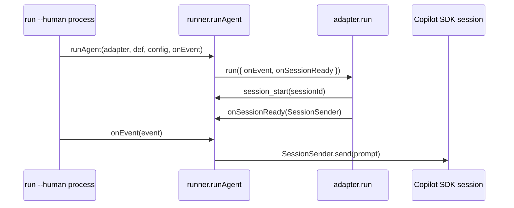
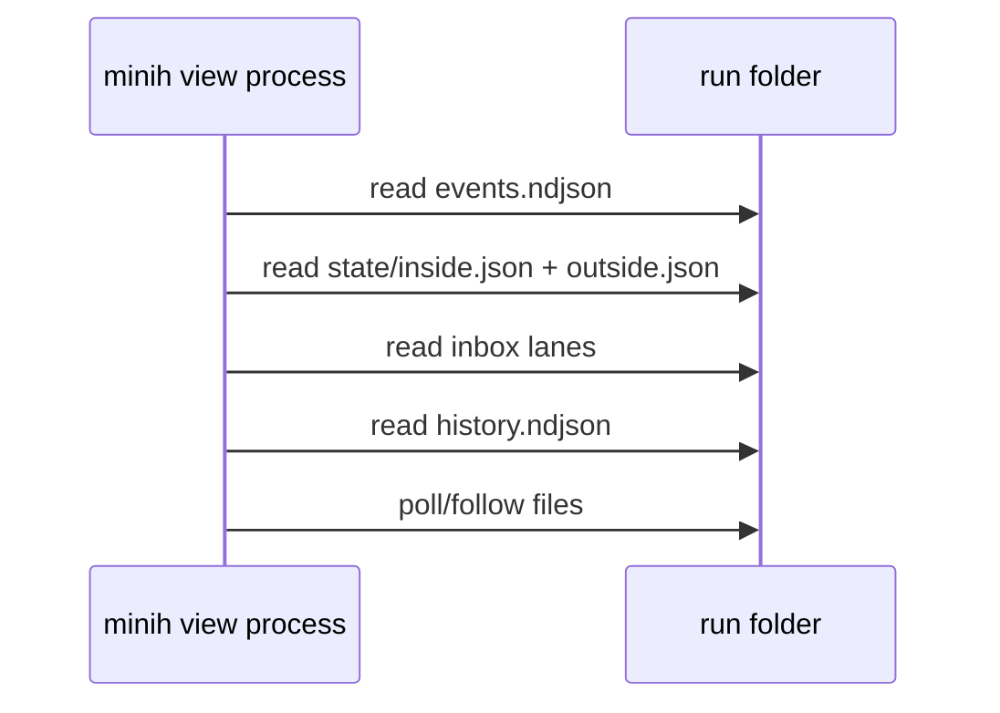

# Workshop: Attach and Control Channel

**Type**: Integration Pattern / API Contract  
**Plan**: 009-human-agent-view  
**Spec**: Not created yet; research-first workshop  
**Created**: 2026-04-28T07:32:23+10:00  
**Status**: Review

**Related Documents**:
- [Research dossier](../research-dossier.md)
- [Workshop 001: Product Shape and Pane Model](001-product-shape-and-pane-model.md)
- [Workshop 003: Pause Semantics](003-pause-semantics.md)
- [Workshop 004: View Model and Timeline](004-view-model-and-timeline.md)
- [Workshop 006: One Agent Mode and Message Semantics](006-one-agent-mode-and-message-semantics.md)

**Domain Context**:
- **Primary Domain**: `runner` owns run lifecycle, run folders, live `SessionSender` callback, and durable run artifacts.
- **Related Domains**: `cli` owns attach commands and TUI controls; `adapter` owns `SessionSender` and normalized events; `mcp` remains private inside-only and should not become the public attach control plane.

---

## Purpose

Decide how a separate process can attach to a running minih agent and, eventually, send messages or request pause actions. This is the load-bearing design question for making "start in human mode" and "attach later" feel like the same product.

## Key Questions Addressed

- What can attach mode do today using existing files?
- Why can start-and-view send messages but attach-view cannot?
- Which control-channel option best fits minih's architecture?
- What durable run identity must be written for attach-by-latest?
- How should failures be reported when the original runner is gone?

---

## Current Reality

### Existing Live Path



Same-process `run --human` can send messages because the original process receives `SessionSender` through `onSessionReady`.

### Existing Attach-Read Path



A separate process can read durable files, but it cannot access the in-memory `SessionSender`.

---

## Required Contracts

### 1. Live Run Manifest

Attach needs live identity before completion. `completed.json` is too late.

**Proposed file**:

```text
agents/<slug>/runs/<runId>/run.json
```

**Draft type**:

```ts
interface LiveRunManifest {
  schemaVersion: 1;
  slug: string;
  runId: string;
  runDir: string;
  pid: number;
  startedAt: string;
  updatedAt: string;
  status: 'starting' | 'active' | 'idle' | 'completing' | 'completed' | 'failed' | 'stale';
  sessionId: string | null;
  model: string | null;
  control: {
    available: boolean;
    kind: 'none' | 'file-command-lane';
    commandLanePath?: string;
  };
  counters: {
    events: number;
    toolCalls: number;
    messages: number;
    errors: number;
  };
}
```

**Write points**:

| Point | Manifest Update |
| --- | --- |
| Run folder created | `status: starting`, `sessionId: null`. |
| `session_start` event | set `sessionId`, `status: active`. |
| Event appended | update counters and `updatedAt`. |
| Terminal condition begins | `status: completing`. |
| `completed.json` written | `status: completed` or `failed`. |

### 2. Run Resolver

Commands need one shared interpretation of `latest`.

```ts
type RunResolveMode =
  | { kind: 'by-id'; runId: string }
  | { kind: 'latest-active' }
  | { kind: 'latest-completed' }
  | { kind: 'latest-any' };

interface ResolvedRun {
  slug: string;
  runId: string;
  runDir: string;
  manifest: LiveRunManifest | null;
  completed: CompletedMetadata | null;
  liveness: 'active' | 'stale' | 'completed' | 'failed' | 'unknown';
}
```

**Resolution policy**:

1. `--run <id>` always wins.
2. `view <slug>` prefers exactly one active run.
3. If multiple active runs exist, error with candidates.
4. If no active run exists, attach to latest completed only if unambiguous and label mode `completed`.
5. `connect` and `resume` can keep latest-completed semantics, but should eventually reuse the same resolver with a different mode.

---

## Control Channel Options

### Option A: Read-only attach only

**Description**: Attach process reads files and disables controls.

| Dimension | Assessment |
| --- | --- |
| Complexity | Low |
| Domain fit | Good |
| Send support | No |
| Pause support | UI-only follow pause |
| Failure behavior | Simple |

**Use**: MVP if we want fast value.

**Limitation**: Does not satisfy the user's "exact same experience" goal for send/pause.

### Option B: Same-process control only

**Description**: `run --human` gets `SessionSender`; attach remains read-only.

| Dimension | Assessment |
| --- | --- |
| Complexity | Low-medium |
| Domain fit | Good |
| Send support | Yes, only in start-and-view |
| Pause support | Same-process only |
| Failure behavior | Simple |

**Use**: Good first product increment, but must label attach mode honestly.

### Option C: Run-scoped file command lane

**Description**: Attach process appends control commands to a run-scoped file. Original runner watches/drains the lane and invokes `SessionSender` or control actions.

```text
runs/<runId>/control/
  commands.ndjson
  acks.ndjson
  status.json
```

**Draft command type**:

```ts
type HumanControlCommand =
  | {
      schemaVersion: 1;
      id: string;
      ts: string;
      source: 'human-tui';
      type: 'send_message';
      body: string;
    }
  | {
      schemaVersion: 1;
      id: string;
      ts: string;
      source: 'human-tui';
      type: 'set_follow_paused';
      paused: boolean;
    }
  | {
      schemaVersion: 1;
      id: string;
      ts: string;
      source: 'human-tui';
      type: 'request_agent_pause';
      reason: string | null;
    };
```

**Draft ack type**:

```ts
interface HumanControlAck {
  schemaVersion: 1;
  commandId: string;
  ts: string;
  status: 'accepted' | 'rejected' | 'failed';
  message: string;
}
```

| Dimension | Assessment |
| --- | --- |
| Complexity | Medium |
| Domain fit | Good if runner owns drain and cli owns append. |
| Send support | Yes |
| Pause support | Yes, if semantics are defined. |
| Failure behavior | Detectable through stale manifest / missing acks. |

**Recommendation**: Best long-term fit because minih already uses durable file lanes and watchers.

### Option D: Local IPC/socket server

**Description**: Original runner starts a local socket/IPC server; attach process connects.

| Dimension | Assessment |
| --- | --- |
| Complexity | Medium-high |
| Domain fit | New runtime infrastructure. |
| Send support | Yes |
| Pause support | Yes |
| Failure behavior | Clear connection errors. |

**Concern**: More platform-specific and introduces daemon-like concerns that minih has avoided.

### Option E: Public MCP control

**Description**: Attach process calls MCP tools.

| Dimension | Assessment |
| --- | --- |
| Complexity | High |
| Domain fit | Poor |
| Send support | Confusing |
| Pause support | Confusing |
| Failure behavior | Confuses private inside server with public host controls. |

**Decision**: Do not use MCP as the public attach control plane.

---

## Recommended Path

### Phase 1: Honest read-only attach

- Add live run manifest.
- Add shared run resolver.
- Add `view` read-only attach using `RunViewModel`.
- Add `run --human` same-process live view if straightforward.

### Phase 2: Same-process send

- `run --human` footer sends via the in-memory `SessionSender`.
- Attach mode still says `attached-read-only`.

### Phase 3: File command lane

- Runner creates and watches `control/commands.ndjson`.
- CLI append helper validates commands and writes atomically enough for append-only NDJSON.
- Runner drains commands and writes `control/acks.ndjson`.
- TUI shows command pending/accepted/failed state.

### Phase 4: Pause controls

- Implement only the pause variants approved in Workshop 003.

---

## Failure Modes

| Failure | UI Behavior | Contract Behavior |
| --- | --- | --- |
| No run found | Show envelope/human error; suggest `minih run <slug>`. | `E107`/existing validation error style. |
| Multiple active runs | List candidates and require `--run`. | No implicit attach. |
| Manifest stale | UI mode becomes `attached-read-only/stale`; disable controls. | `updatedAt` older than threshold. |
| Command lane exists but no ack | Show pending, then timeout to failed. | Ack timeout, no retry by default. |
| Original runner exits | Controls disabled; transcript remains readable. | Completed metadata or stale manifest wins. |
| Command rejected | Show reason in footer and timeline. | Ack `status: rejected`. |

---

## Security and Safety Notes

- This is local filesystem control, scoped to a run folder.
- Do not add network listeners for the first implementation.
- Validate command schemas before append and before drain.
- Treat command lane as advisory user intent; runner remains owner of actual session actions.
- Never expose raw SDK session objects to CLI components.

---

## Open Questions

### Q1: Should command lane be enabled for all runs or only `--human` runs?

**RESOLVED FOR TARGET DESIGN**: All fresh runs should eventually write a live manifest, and the target control channel should be available for all fresh runs, not only `--human`. That is what lets a human attach to a run started by another agent and still get the same control experience. The MVP may still ship `attached-read-only` first while the command lane is absent.

### Q2: Should `send_message` be distinct from outside-message delivery?

**REVISED AFTER WORKSHOP 006**: Do not treat human chat as a separate conceptual channel, and do not expose coordinated/non-coordinated agent modes. A footer submission is an **outside actor** message. It should be visible in run activity and delivered to the inside session when input delivery is available. A future command lane may still be needed for command acknowledgements, stale-run failure reporting, universal attach delivery, and future pause/stop controls.

### Q3: How should attach ask "what instance ID is this?"

**RESOLVED FOR DESIGN**: Do not ask the original agent conversationally. Persist `sessionId` in `run.json` as soon as `session_start` arrives, and show it in header.

### Q4: Should file command lane use `fs.watch` or polling?

**RESOLVED FOR TARGET DESIGN**: Reuse runner's existing file-watcher/watermark style rather than introducing sockets. Use durable file reads as truth and watchers as hints, with polling fallback if needed.

---

## Workshop Run Outcome

The attach workshop resolves to a staged but clear target:

1. **Now / mock-up**: attach is read-only unless it is the same process that started the run.
2. **MVP implementation**: every run gets a live manifest (`run.json`) and shared run resolver.
3. **Control implementation**: runner owns a run-scoped file command lane; CLI appends commands; runner drains them through the in-memory `SessionSender`.
4. **Never**: public MCP as the attach control plane.

### Resulting Capability Matrix

| Scenario | View | Send | Pause Scroll | Agent Pause |
| --- | --- | --- | --- | --- |
| `run --human` same process | Live | Yes, as outside actor message for coordinated runs | Yes | Not MVP |
| `view` active coordinated run with outside delivery available | Live control for outside messages | Yes, as outside actor message | Yes | No |
| `view` active run with no outside delivery/control lane | Live read-only | No | Yes | No |
| `view` active run, future command lane | Live control | Yes | Yes | Later |
| `view` completed run | Transcript/summary | No | Yes | No |

### Mock-up Implication

The mock-up must show a disabled input footer for `attached-read-only`. This is not a failure state; it is an honest capability label.

---

## Quick Reference

```text
MVP:
  run --human -> live-control
  view active coordinated run -> outside-message control when delivery is available
  view active run without delivery/control -> attached-read-only

Future:
  view        -> attached-control when run.json advertises control.available=true
```

```text
Do:
  cli writes control commands
  runner drains commands
  adapter remains hidden behind SessionSender

Do not:
  expose SDK directly
  use public MCP for outside control
  pretend side-state paused means process paused
```
