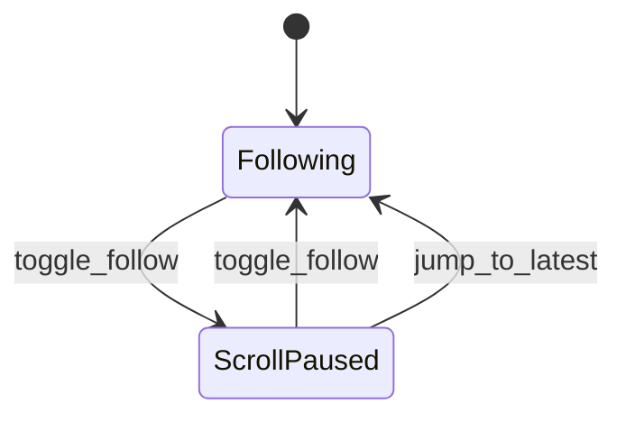
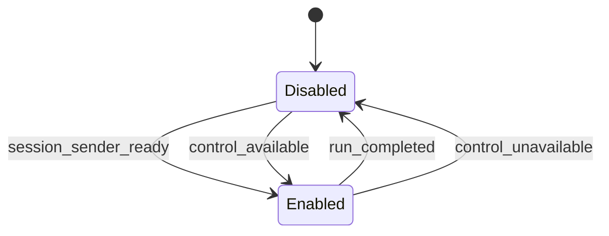
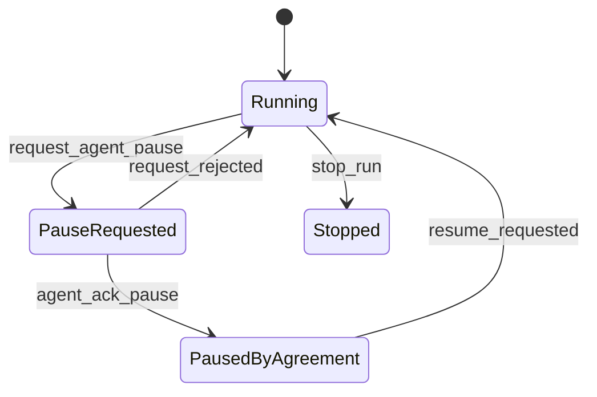

# Workshop: Pause Semantics

**Type**: State Machine / UX Contract  
**Plan**: 009-human-agent-view  
**Spec**: Not created yet; research-first workshop  
**Created**: 2026-04-28T07:32:23+10:00  
**Status**: Review

**Related Documents**:
- [Research dossier](../research-dossier.md)
- [Workshop 001: Product Shape and Pane Model](001-product-shape-and-pane-model.md)
- [Workshop 002: Attach and Control Channel](002-attach-and-control-channel.md)

**Domain Context**:
- **Primary Domain**: `cli` owns user-facing labels and controls.
- **Related Domains**: `runner` owns forwarders and run lifecycle; `adapter` owns SDK session termination/sending; coordination state schemas include `paused` statuses but do not define process pause.

---

## Purpose

Define what "pause the agent" can safely mean in the human view. The word pause is overloaded, so this workshop separates UI pause, input pause, coordination pause, model-requested pause, and termination.

## Key Questions Addressed

- What pause behavior can ship without a new control channel?
- What should the UI label as pause versus stop versus read-only?
- How do pause controls interact with inside/outside coordination state?
- Which pause semantics require runner or adapter changes?

---

## Pause Types

| Pause Type | User Label | What It Does | Requires Control Channel? | MVP? |
| --- | --- | --- | --- | --- |
| UI follow pause | `Pause scroll` | Stops auto-following latest transcript; run continues. | No | Yes |
| Input pause | `Disable input` | Prevents the TUI from sending new human messages. | No | Yes |
| Coordination pause | `Pause outside updates` | Stops or queues outside-to-inside forwarder delivery. | Yes | No |
| Model-requested pause | `Ask agent to pause` | Sends a message asking agent to wait. | Send capability | Maybe later |
| Hard stop | `Stop run` | Terminates/kills SDK session. | Adapter/runner action | No, separate feature |

**Decision**: MVP should only implement `Pause scroll` and capability-driven input disabling. Do not label these as "Pause agent."

---

## State Model

### UI Follow State



| State | Meaning | Run Impact |
| --- | --- | --- |
| `Following` | Panes auto-scroll to latest events. | None |
| `ScrollPaused` | User is reading history; new events accumulate unseen. | None |

### Input Capability State



| State | Meaning | Footer Label |
| --- | --- | --- |
| `Enabled` | Enter sends a message. | `Message agent:` |
| `Disabled` | User cannot send from this view. | Explain why: starting, read-only attach, completed, stale. |

### Future Agent Pause State



This is intentionally not MVP because it depends on control-channel semantics and agent cooperation.

---

## UX Labels

### Good Labels

| Label | Why |
| --- | --- |
| `Pause scroll` | Accurate: only UI follow changes. |
| `Resume follow` | Accurate and reversible. |
| `Input disabled: attached read-only` | Explains capability. |
| `Ask agent to pause` | Honest: this is a request, not a guaranteed process pause. |
| `Stop run` | Clear destructive action if later implemented. |

### Labels to Avoid

| Label | Problem |
| --- | --- |
| `Pause agent` | Implies process/model suspension that does not exist. |
| `Freeze` | Ambiguous and alarming. |
| `Hold all messages` | Could mean UI, inbox, forwarders, or SDK. |
| `Suspend session` | SDK may not support this as stated. |

---

## Interaction with Coordination State

Existing schemas allow statuses like `outside.status = paused` and `inside.status = paused`, but those are data published by the peers. They are not lifecycle controls.

### Rule

The TUI may display side-state `paused`, but must not infer that the SDK session or runner is paused.

### Example

```text
State pane:
  outside: paused (published by outside)
  inside: reviewing
  run: active

Footer:
  Scroll following | Input enabled
```

This is valid: the outside peer can be paused while the run remains active.

---

## Future Control Commands

If Workshop 002 chooses a run-scoped command lane, pause-related commands should be explicit.

```ts
type PauseControlCommand =
  | {
      type: 'set_ui_follow_paused';
      paused: boolean;
    }
  | {
      type: 'request_agent_pause';
      reason: string | null;
    }
  | {
      type: 'set_forwarders_paused';
      paused: boolean;
      lanes: Array<'outside-inbox' | 'outside-state'>;
    };
```

**Important**: `set_ui_follow_paused` should stay local UI state and probably never be written to the runner command lane.

---

## Pause Decision Table

| User Goal | Correct Action | MVP Support |
| --- | --- | --- |
| "I want to read older chat without jumping." | Pause scroll/follow. | Yes |
| "Do not let me accidentally send." | Disable input locally. | Yes |
| "Ask the agent to wait before continuing." | Send `request_agent_pause` message. | Later |
| "Stop outside milestones being forwarded." | Pause forwarders. | Later, high risk |
| "Kill this runaway run." | Stop/terminate run. | Later, separate command |
| "Mark outside side as paused." | `minih state set --side outside --status paused`. | Existing command, not TUI pause |

---

## Error and Recovery Behavior

| Scenario | UI Behavior |
| --- | --- |
| User presses pause in MVP | Toggle `follow:on/off`; show `scroll paused`. |
| User expects agent pause | Footer says `Agent pause not available; use message request when input is enabled.` |
| Attach read-only | Only scroll pause is available. |
| Run completed | Disable input; pause scroll still useful for transcript. |
| Future pause request pending | Show pending row in coordination/control pane. |
| Future pause rejected | Show rejected reason and leave run active. |

---

## Acceptance Criteria for MVP

- The UI has a follow/scroll pause that never changes run behavior.
- The footer never uses "pause agent" unless a real agent-pause control exists.
- Attach read-only mode disables input and explains why.
- Completed mode disables input and points to `minih resume`.
- Side-state `paused` is displayed as peer state, not lifecycle state.

---

## Open Questions

### Q1: Should a future "Ask agent to pause" be a normal message or a structured control command?

**RESOLVED FOR TARGET DESIGN**: Use a structured control command once the command lane exists. The runner can convert it into a clearly labeled prompt so it remains model-readable while still being ackable and visible in the control timeline.

### Q2: Should forwarder pause ever exist?

**DEFERRED**: It is powerful but risky. Pausing forwarders can break the guarantee that outside updates eventually reach the inside agent. Do not include it in MVP or mock-up controls.

### Q3: Should hard stop be in the same TUI?

**DEFERRED**: Probably yes eventually, but separate from pause. It should require confirmation and map to explicit adapter/runner termination behavior. Do not include it in Iteration 001.

---

## Workshop Run Outcome

The only "pause" in the mock-up is **Pause scroll**. It changes the UI follow behavior only and never implies the agent, runner, SDK session, or coordination forwarders are paused.

### Iteration 001 Footer Language

| Capability | Footer Text |
| --- | --- |
| Live control | `Message agent...  Enter send | Ctrl+F pause scroll | Ctrl+C close view` |
| Attached read-only | `Attached read-only. Ctrl+F pause scroll | Ctrl+C close view` |
| Completed | `Run complete. Use minih resume <slug> --run <runId> "<message>" for follow-up.` |

### Explicit Non-goals for Iteration 001

- No `Pause agent`.
- No `Pause forwarders`.
- No `Stop run`.
- No destructive keybindings.

---

## Quick Reference

```text
MVP controls:
  Ctrl+F  Pause/resume scroll
  Enter   Send only in live-control mode
  Ctrl+C  Quit view, not run

Not MVP:
  Pause agent
  Pause forwarders
  Stop run
```
