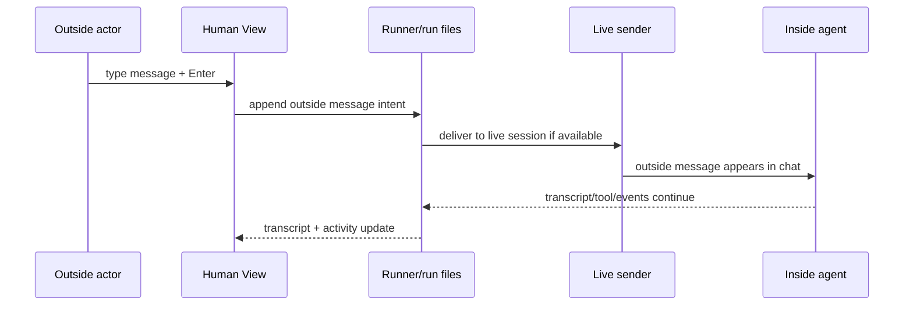

# Workshop: One Agent Mode and Message Semantics

**Type**: Integration Pattern / UX Contract  
**Plan**: 009-human-agent-view  
**Spec**: [human-agent-view-spec.md](../human-agent-view-spec.md)  
**Created**: 2026-04-28T08:55:41+10:00  
**Status**: Review

**Related Documents**:
- [Research dossier](../research-dossier.md)
- [Workshop 001: Product Shape and Pane Model](001-product-shape-and-pane-model.md)
- [Workshop 002: Attach and Control Channel](002-attach-and-control-channel.md)
- [Workshop 004: View Model and Timeline](004-view-model-and-timeline.md)
- [Workshop 005: Ink/React Prototype](005-ink-react-prototype.md)

**Domain Context**:
- **Primary Domains**: `cli` owns product language and operator controls; `runner` owns run-scoped message delivery and durable artifacts.
- **Related Domains**: `adapter` supplies live session send capability; `mcp` may expose optional inside tools but must not define a separate product mode.

---

## Purpose

Fix the product model for Human Agent View: there should be **one agent mode** across the product. A run always has an outside actor and an inside agent; agents can decide whether and how to exchange peer messages, but the UI should not expose "coordinated" versus "non-coordinated" as different kinds of agents.

## Key Questions Addressed

- What does "one agent mode" mean for Human Agent View?
- How should footer input be modeled when the outside actor sends a message?
- What terms should the UI use instead of implementation flags like `coordination.enabled`?
- What remains an implementation capability versus a product mode?

---

## Problem Statement

The earlier clarification question asked whether Human Agent View should support "coordinated" and "non-coordinated" agents differently. That was the wrong framing.

Current implementation has an internal `coordination.enabled` frontmatter flag. That flag controls whether extra outside/inside files, prompt sections, inside MCP tools, and runner forwarders are wired for a run. It is real implementation state and should remain available because it can be useful for CI or lightweight runs that do not need outside-message/state wiring, but it should not become the product vocabulary for Human Agent View.

From the user's perspective, there is just an agent run:

- someone or something outside the run can observe and send messages;
- the inside agent responds, uses tools, and produces output;
- some agents may talk to other agents or publish richer state;
- some agents may ignore peer messaging entirely.

Those are behaviors and capabilities, not different agent modes.

---

## Product Vocabulary

| Term | Meaning | Use in UI? |
| --- | --- | --- |
| Agent run | One execution/resume session for an agent. | Yes |
| Outside actor | Whoever is supervising or sending messages into the run: human, parent agent, CI, or script. | Yes |
| Inside agent | The model session currently running inside minih. | Yes |
| Outside message | A message authored outside the run and delivered to the inside agent. | Yes |
| Inside response | Agent transcript output or explicit inside reply. | Yes |
| Activity | Tools, messages, state changes, output checks, and diagnostics around the run. | Yes |
| Input capability | Whether this view can currently send an outside message. | Yes |
| Coordination enabled | Current implementation flag that wires extra message/state tooling. | No |
| Non-coordinated agent | Current implementation absence of that flag. | No |

### Labels to Prefer

```text
Outside actor
Inside agent
Send outside message...
Input available
Input read-only
Run complete
Activity
Messages
State / Output
```

### Labels to Avoid

```text
Coordinated mode
Non-coordinated mode
Human chat
Pause agent
MCP control
```

---

## One Agent Mode Principle

Every Human Agent View should be shaped the same way:

```text
Run
├── Header: run identity, status, input capability
├── Transcript: outside actor + inside agent conversation
├── Activity: tools, messages, state, output, diagnostics
└── Footer: send outside message or explain why input is read-only
```

The panes do not disappear because an agent chooses not to use peer messaging. They simply show less activity.

### Product Rule

Human Agent View does not ask, display, or require the user to understand whether a run is "coordinated". It only answers:

1. Is the run active, completed, stale, or failed?
2. Can this view send an outside message right now?
3. What has the inside agent said and done?
4. What outside/inside messages and state changes exist?

---

## Message Semantics

### Outside Message Is the Conceptual Source

When an outside actor types into the footer and presses Enter, the product intent is:

```text
outside actor input
  -> outside message record
  -> delivery into the inside agent's live session when possible
  -> visible transcript/activity evidence
```

Do not model this as a separate "human chat" channel. Human input, parent-agent input, and script/CI input are all outside messages.

### Delivery Is Not Acknowledgement

Delivery means the run accepted the outside message and attempted to put it in front of the inside agent. It does not mean the inside agent has read, understood, or acknowledged it.

The UI should distinguish:

| State | Meaning |
| --- | --- |
| queued | The outside message was accepted locally but not yet delivered. |
| delivered | The message was delivered into the live inside session. |
| visible in activity | The message exists in the run's outside-message/activity record. |
| acknowledged | The inside agent explicitly acked or replied to that outside message. |

### Sequence



---

## Capability, Not Mode

The UI can show capabilities without creating multiple agent modes.

| Run/View State | Footer Behavior | Product Wording |
| --- | --- | --- |
| Active and input delivery available | Footer enabled | `Send outside message...` |
| Active but delivery unavailable | Footer disabled | `Input read-only: live delivery unavailable` |
| Starting | Footer disabled | `Waiting for run to accept messages...` |
| Completed | Footer disabled | `Run complete; view is read-only` |
| Stale/original runner gone | Footer disabled | `Input read-only: original runner unavailable` |

These are run/control states. They are not agent modes.

---

## What Agents Decide

Agents decide behavior, not mode:

| Agent Behavior | Human View Impact |
| --- | --- |
| Agent ignores outside messages | Message still appears in activity; no ack/reply appears. |
| Agent replies in normal transcript | Transcript shows inside-agent response. |
| Agent sends structured inside reply | Activity shows inside message/reply. |
| Agent uses peer messaging tools | Activity shows richer message/ack/state timeline. |
| Agent publishes state | State / Output pane shows it. |
| Agent does none of the above | Transcript/tools/output still work. |

This keeps the product consistent while allowing agents to evolve their own collaboration patterns.

---

## Current Implementation vs Target Product

| Concern | Current Implementation | Target Product Language |
| --- | --- | --- |
| `coordination.enabled` | Opt-in flag for extra prompt/tool/forwarder wiring. | Hidden implementation detail. |
| Outside inbox lane | Exists for currently coordinated runs. | Outside message/activity source. |
| Inside MCP tools | Optional tools available to the inside agent. | Optional agent behavior, not UI mode. |
| Forwarders | Deliver outside changes into the live session for wired runs. | One possible delivery mechanism. |
| Human View | Scratch mock-up only. | One console over every run. |

### Architectural Implication

Plan-3 should keep the internal coordination gate, but should not create separate product phases for "coordinated agents" and "non-coordinated agents." If implementation needs staging, stage by capability:

1. View/read all runs.
2. Send outside messages when delivery is available.
3. Extend outside-message delivery only if product needs demand it.

Do not stage by exposing different agent modes.

### Gate Decision

**Resolved**: keep `coordination.enabled` as an internal capability gate. It remains valuable for CI and lightweight runs. Human Agent View should translate the resulting runtime state into `input available`, `input read-only`, or `run complete` rather than exposing the gate directly.

---

## UI Implications

### Header

Prefer:

```text
minih view smoke-test | active | input available | elapsed 05:36
run 2026-... | session 73e9ae6a | events 4842 | tools 40
```

Avoid:

```text
mode coordinated
mode non-coordinated
mode live-control
```

`live-control` can remain an internal capability enum if useful, but the UI should translate it into human terms.

### Footer

Enabled:

```text
Send outside message...   Enter send | Ctrl+F pause scroll | Ctrl+C close
```

Disabled:

```text
Input read-only: original runner unavailable. Ctrl+F pause scroll | Ctrl+C close
```

Completed:

```text
Run complete; view is read-only. Use resume for a new follow-up run.
```

### Right Pane

The right side can still be called `Workbench` in the scratch mock-up, but the child pane previously labeled `Coordination` should be product-labeled as `Messages` or `Activity`.

Recommendation:

```text
WORKBENCH
  Tools
  Messages
  State / Output
```

---

## Error and Edge Cases

| Case | Expected Behavior |
| --- | --- |
| Multiple outside actors send at once | Activity shows all outside messages in append order with source metadata when available. |
| Message delivered but no reply | Message remains delivered/unacked; no fake success beyond delivery. |
| Original runner died | View remains readable; input becomes read-only. |
| Agent does not have peer tools | Footer can still deliver into chat if live delivery exists; activity may have fewer structured rows. |
| No run messages exist | Messages pane says `No outside/inside messages yet`. |
| Completed run | Transcript/activity readable; footer disabled. |

---

## Spec Fixes Required

Update the spec to remove product ambiguity:

1. Replace "coordinated vs non-coordinated" product questions with "input capability and delivery availability".
2. Treat `coordination.enabled` as current implementation detail, not user-facing mode.
3. State that Human Agent View has one agent-run model across the product.
4. Keep `mcp` private inside-only; agents may use it, but it does not define Human View modes.
5. Rename user-facing "coordination" wording toward `Messages`, `Activity`, or `outside/inside messages`.

---

## Decisions

| Decision | Outcome |
| --- | --- |
| Product has one agent mode | Approved by user direction. |
| Internal coordination gate remains | Approved because it may be useful in CI/lightweight runs. |
| Outside/inside is universal product framing | Use for Human Agent View terminology. |
| Footer input is outside-actor messaging | Do not call it human-only chat. |
| Agents decide whether to use peer messaging | UI shows activity if present; absence is normal. |
| Implementation flags stay hidden | Do not ask users about `coordination.enabled` in Human View. |
| Capability labels are allowed | Active/read-only/completed/stale are run/view states, not agent modes. |

---

## Quick Reference

```text
Say:
  one agent run
  outside actor
  inside agent
  outside message
  input available/read-only

Do not say in product UI:
  coordinated agent
  non-coordinated agent
  coordination mode
  human chat
```
