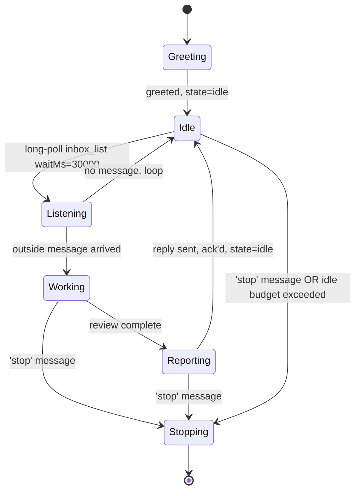

# Workshop: Coordinated Code Review Companion Agent

**Type**: Integration Pattern / Agent Design
**Plan**: 009-human-agent-view
**Spec**: [human-agent-view-spec.md](../human-agent-view-spec.md)
**Created**: 2026-04-28
**Status**: Draft

**Related Documents**:
- [Workshop 002: Attach and Control Channel](002-attach-and-control-channel.md)
- [Workshop 006: One Agent Mode and Message Semantics](006-one-agent-mode-and-message-semantics.md)
- [`agents/code-review/prompt.md`](../../../../agents/code-review/prompt.md) — current non-coordinated agent we are evolving from
- [`agents/coordination-smoke-test/prompt.md`](../../../../agents/coordination-smoke-test/prompt.md) — minimal coordination dogfood we are evolving past
- [Plan 008 — canonical coordination loop](../../008-canonical-coordination-loop/canonical-coordination-loop-plan.md)

**Domain Context**:
- **Primary**: agents (new exemplar agent under `agents/`).
- **Consumes**: `runner` coordination wiring (forwarders, manifest, env vars), `mcp` private inside server (six inbox/state tools).
- **Pairs with**: Phase 2 of plan 009 (`minih view <slug>`) — this agent is the dogfood subject the human view will attach to.

---

## Purpose

Design a runnable, **coordination-enabled code review agent** that an outside actor (a human, or another agent including this Copilot CLI session) can:

1. **Start in the background** with `minih run code-review-companion` and walk away.
2. **Attach to** at any time via `minih view code-review-companion` (Phase 2 of plan 009).
3. **Talk to** by sending outside messages — the inbox forwarder delivers them straight into the live SDK session, so the agent reacts in real time.
4. **Ask questions of**: "what's your status?", "review the diff in `src/runner/`", "what's blocking you?".
5. **Steer**: "skip the validator changes", "focus on Phase 2 surface", "stop and summarise".

The intent is to produce an **exemplar that proves the canonical coordination loop is good enough to support a working pair-programming companion**, not just a smoke test. If this agent is pleasant to work with, the loop is right; if it is awkward, the loop needs fixing — and we will know exactly where.

## Key Questions Addressed

- What does "coordination" actually look like for an agent that is doing real work alongside a human?
- How does the agent decide when to wait for input versus when to proceed independently?
- What state vocabulary lets the outside actor know what the agent is doing without needing to read every transcript line?
- How does the agent give and receive feedback through the inbox without spamming it?
- How does it pair with Phase 2 of plan 009 (the human view) to make "background agent we can chat with" a real product?
- What does the agent's frontmatter, prompt, instructions, and output schema look like end-to-end?

---

## Why a New Agent (Not a Patch to `code-review`)

The existing `agents/code-review/` agent is intentionally a **single-shot** review:
- No `coordination: enabled` frontmatter.
- Receives a `context` parameter at start, runs to completion, writes one JSON envelope, exits.
- Cannot be steered mid-flight; cannot ask the user a question; cannot wait.

That model is correct for "review this PR and exit". It is wrong for "sit alongside me and review what I am working on as I work on it". Trying to retrofit coordination onto the existing agent would either break the single-shot contract (current callers expect it to terminate) or produce a confusing dual-mode agent.

**Decision**: ship a sibling agent at `agents/code-review-companion/`. The existing `code-review` stays as-is. The companion is the new exemplar.

---

## Product Shape

### What the human experience feels like

```text
$ minih run code-review-companion --human

  ┌─ Code Review Companion ──────────────────────┐
  │ slug: code-review-companion                  │
  │ runId: 01HXY...                              │
  │ sessionId: sess-abc                          │
  │ status: active   capability: input available │
  │ inside.status: idle   outside.status: ready  │
  └──────────────────────────────────────────────┘

  Inside agent: Hello — companion ready. Tell me what you'd like
  reviewed. I will set my inside status to in-progress while I
  work and back to idle when I'm done. Send 'help' for the
  vocabulary I understand.

  > review src/runner/run-resolver.ts

  [Outside actor → Inside agent]
  Inside agent: Got it — switching to in-progress. Reading the
  file, the resolver tests, and Workshop 002 §2 for the contract.
  ...
  Inside agent: Done. 2 findings (1 medium, 1 low). I've left
  them in inside.json under findings; want me to send them to
  the inbox or just summarise here?

  > summarise

  Inside agent: ...
```

The same agent can be started by **any other agent** (e.g., a Copilot CLI session running `minih run code-review-companion` without `--human`). A human can then **attach** with `minih view code-review-companion` and pick up the conversation. That is the key product unlock — start by an agent, attach by a human, identical experience.

### What the agent-side experience feels like

The companion's prompt teaches it to:
- Treat `MINIH_CONTEXT=inside` as the signal that it is coordination-enabled.
- Greet the outside actor on startup with a short status message via `inbox_send`.
- Block on `inbox_list({ unread: true, waitMs: 30_000 })` when it has nothing to do, instead of looping or exiting.
- Publish state transitions for every meaningful step (`idle → reading → reviewing → reporting → idle`).
- Acknowledge every outside message via `inbox_ack` before acting on it.
- Only exit when the outside actor explicitly says "stop", or when it has been idle without messages past a configured budget.

---

## Key Questions Addressed (Detailed)

### Q1: What is the agent's lifecycle?



**Decision**: the companion never exits "successfully" the way a single-shot agent does. It exits when:
- The outside actor sends `{ type: 'control', subject: 'stop' }` (graceful), OR
- It has been idle for `idleBudgetMs` (configurable, default 30 minutes), OR
- Receives a SIGTERM via the runner.

On exit it writes the standard system-output report including a magic-wand retro of the session.

### Q2: What state vocabulary does it use?

Inside states (stored in `state/inside.json`):

| Status | Meaning | Outside actor can expect |
|--------|---------|-------------------------|
| `idle` | Waiting for the next outside message | Send a message; agent will react quickly |
| `reading` | Loading files / running git / reading docs to set up a review | Don't send another big task yet; small clarifications okay |
| `reviewing` | Actively analysing | Wait or queue clarifications via inbox |
| `reporting` | Composing the response | Almost done; let it finish |
| `blocked` | Needs a clarification it cannot infer | **Read the inbox — agent has asked you a question** |
| `stopping` | Shutting down on request or budget | Run is about to terminate |

The status enum lives in the agent's `state/inside-state.schema.json` so the runtime validator enforces it.

### Q3: What inbox vocabulary does it use?

Outside → inside (`type` field on `InboxMessage`):

| `type` | Meaning | Example body |
|--------|---------|---------------|
| `task` | A new review request | `"review the diff in src/runner/run-resolver.ts vs main"` |
| `question` | A clarification or status query | `"what's your status?"`, `"how long until done?"` |
| `directive` | A scope/focus change for ongoing work | `"skip the test files"`, `"focus on contract drift only"` |
| `control` | Lifecycle control | `"stop"`, `"pause for 5 minutes"` |

Inside → outside:

| `type` | Meaning |
|--------|---------|
| `progress` | Periodic status note while working ("read 3 of 7 files") |
| `finding` | A single review finding (one message per finding so the human view can render them as a list) |
| `summary` | The wrap-up after a task — a short prose synthesis |
| `question` | Companion needs a clarification before it can proceed (also sets state to `blocked`) |
| `ack` | Already covered by `inbox_ack` — but for messages that need a textual reply, this carries it |
| `farewell` | Final message before exit |

Every reply uses `ackOf` to point back to the message it is responding to so the human-view coordination timeline links them. As of FX001, `ackOf` is a first-class `inbox_send` parameter on the MCP tool surface — the rule is enforceable, not documentation-only.

### Q4: How does it block on input without busy-waiting?

The runner already supports bounded long-poll via `inbox_list({ waitMs })` (Plan 008 FX002). The agent prompt teaches it to call:

```text
inbox_list({ unread: true, waitMs: 30000, waitForAny: ['task', 'question', 'directive', 'control'] })
```

If a message arrives the call returns immediately. If the wait expires the agent gets an empty result and decides whether to:
- Keep waiting (most common — log a state heartbeat and loop).
- Self-terminate (only after `idleBudgetMs`).
- Send a "still here" `progress` message if it's been a while since it talked.

This pattern is the **canonical coordination loop** from Plan 008. The companion is a real consumer of it, not a smoke test.

### Q5: How does the human steer it?

Two channels, one product:

1. **Outside-actor message** (footer in Phase 2's view, or `minih outside-send code-review-companion --type task --body "..."` from any terminal). The inbox forwarder delivers the message into the live SDK session as a chat injection. The agent sees the new line in its conversation AND can poll `inbox_list` to inspect structured fields.
2. **Outside state changes** (`minih outside-state set code-review-companion key=value`). The state forwarder delivers a synthetic chat injection that says "outside state changed: {...}". The agent reads `state_get` to inspect.

Both channels go through the existing forwarders. **No new minih code is needed for the companion to work.** This is the workshop's load-bearing claim: the coordination stack we already shipped is enough.

### Q6: How does it pair with the Phase 2 human view?

The Phase 2 `view` command will render this companion specifically well:

- **Header**: shows `slug`, `runId`, `sessionId`, capability `input available`.
- **Transcript**: chat injections from forwarders appear as `Outside actor` rows; agent responses as `Inside agent` rows.
- **Workbench**: every outside `task`/`question`/`directive`/`control` and inside `progress`/`finding`/`summary`/`farewell` appears with `ackOf` correlation drawn between them.
- **State**: shows `inside.status` (`reviewing`, `blocked`, etc.) so the human knows whether to send another task or wait.

If the workbench feels noisy or the state labels are confusing while running this companion, that is direct evidence of a Phase 2 design problem.

---

## Anatomy of `agents/code-review-companion/`

```text
agents/code-review-companion/
├── prompt.md                  # frontmatter + behaviour
├── instructions.md            # detailed review checklists
├── input-schema.json          # optional initial brief
├── output-schema.json         # final farewell envelope
└── state/
    └── inside-state.schema.json   # enum: idle|reading|reviewing|reporting|blocked|stopping
```

### `prompt.md` (frontmatter + skeleton)

```yaml
---
description: "Long-running coordinated code-review companion that pairs alongside a human or supervising agent."
tags: [review, quality, coordination, exemplar]
model: gpt-5.5
reasoning: xhigh
timeout: 7200            # 2h ceiling — coordination loop should exit on idle budget first
coordination: enabled
---
```

**Body sections**:

1. **Identity & purpose** — "You are a long-running code review companion. You wait for outside messages, do focused reviews, and report back."
2. **The coordination loop** — explicit pseudocode: greet → loop { long-poll inbox → if message: ack, transition state, work, reply, transition back to idle; if budget exceeded: farewell, exit }.
3. **State vocabulary** — the table above; reminds the agent to call `state_transition` (not `state_set`) for status changes so history is recorded.
4. **Inbox vocabulary** — what `type`s exist outside→inside and inside→outside; rule: every reply has `ackOf`.
5. **Review checklists** — references `instructions.md`. The actual review heuristics (correctness, domain compliance, anti-reinvention, etc.) live there so the prompt stays small.
6. **Output contract** — minimal: a final `farewell` envelope written to `$MINIH_OUTPUT_PATH` summarising the session and including the magic-wand retro per `_shared/preamble.md`.

### `output-schema.json` (sketch)

```json
{
  "type": "object",
  "required": ["session", "findings", "summary", "retrospective"],
  "properties": {
    "session": {
      "type": "object",
      "required": ["startedAt", "endedAt", "exitReason", "messageCounts"],
      "properties": {
        "startedAt": { "type": "string", "format": "date-time" },
        "endedAt":   { "type": "string", "format": "date-time" },
        "exitReason": {
          "type": "string",
          "enum": ["stop_requested", "idle_budget", "timeout", "error"]
        },
        "messageCounts": {
          "type": "object",
          "properties": {
            "tasksReceived":  { "type": "integer" },
            "findingsSent":   { "type": "integer" },
            "questionsAsked": { "type": "integer" }
          }
        }
      }
    },
    "findings": {
      "type": "array",
      "items": { "$ref": "#/definitions/finding" }
    },
    "summary":       { "type": "string", "minLength": 50 },
    "retrospective": { "$ref": "#/definitions/retrospective" }
  }
}
```

`findings[]` items duplicate what was already sent inbox-style during the session — the schema captures the cumulative review for the run record so a future `minih history` viewer can read them without replaying inbox lanes.

---

## Initial Task — "Orient" Default

The companion is **never silent on boot**. Even when called with no `initialTask`, the agent performs an opinionated first action so the outside actor immediately has context to react to.

### `input-schema.json` (sketch)

```json
{
  "type": "object",
  "properties": {
    "initialTask": {
      "type": "string",
      "minLength": 1,
      "description": "Optional first task. If omitted, the agent runs the built-in 'orient' task: read the active plan tree and summarise where the work stands."
    },
    "planPath": {
      "type": "string",
      "description": "Optional explicit path under docs/plans/. If omitted, the agent picks the highest-numbered plan folder and uses that."
    },
    "idleBudgetMs": {
      "type": "integer",
      "minimum": 60000,
      "default": 1800000,
      "description": "Idle window before self-termination. Default: 30 minutes."
    }
  }
}
```

### Built-in "orient" behaviour

When `initialTask` is absent, the agent treats this as the first task (synthesised, with `id: 'task-orient-bootstrap'`):

```text
Orient yourself before waiting for human input:

1. List docs/plans/ and pick the active plan (highest-numbered folder).
   Or use the `planPath` input parameter if provided.
2. Read the plan's spec (`*-spec.md`), plan (`*-plan.md`), and plan-level
   flight plan (`*.fltplan.md`) to understand the mission and current
   status (Specifying / Planning / Ready / In Progress / Complete).
3. Read the most recently modified phase folder under `tasks/` (its
   `tasks.md` and `tasks.fltplan.md`) to see what just happened or what
   is in progress.
4. Read the latest workshop file under `workshops/` if one exists — that
   is usually the freshest design context.
5. Glance at `git --no-pager log --oneline -10` and the diff of the most
   recent commits so you know what code state matches the plan state.

Then send ONE inbox `progress` message with the headline:
   "Oriented on plan <ordinal-slug>, phase <N> (<status>). <one-sentence
    summary of where things stand>. Ready for next instructions."

Set `inside.status` → `idle`. Do NOT start any review work yet — wait
for the outside actor to send a `task`.
```

### Why this is the right default

- **No dead-air boot.** The first message in the transcript is always something the outside actor can react to: "Oriented on plan 009-human-agent-view, phase 1 (Complete). 30 new tests, just fft green, ready to start phase 2. Ready for next instructions."
- **Cheap and bounded.** Reading a handful of small markdown files + ten git lines is fast and predictable; orient should finish in under a minute.
- **Composable.** A CI invocation that knows exactly what it wants passes `initialTask`; a human pair-programming session passes nothing and gets oriented for free.
- **Self-evidencing for plan 009.** The very first message the Phase 2 view will render is a real coordination payload, not a stub greeting. Better dogfood.

### Acceptance addition

Append to the agent acceptance list (§ Acceptance Criteria for This Agent):

11. **Orient default**: `minih run code-review-companion` (no input parameters) sends one `progress` message within 60 s of `session_start` whose body identifies the active plan, the latest phase, its status, and a one-sentence summary, then sits at `inside.status: idle` until an outside message arrives.

---

## End-to-End Example Run

```text
$ minih run code-review-companion --human

# under the hood:
# 1. runner creates run dir + run.json (status: starting)
# 2. inside MCP server starts (six tools wired)
# 3. forwarders attach (outside inbox + outside state → live session.send)
# 4. session_start → run.json status: active
# 5. agent boots, reads MINIH_CONTEXT=inside, follows loop

[transcript starts]
Inside agent: progress msg — Oriented on plan 009-human-agent-view,
              phase 1 (Complete). 30 new tests added, `just fft`
              green, runner now writes live `run.json` manifest +
              shared resolver + pure HumanViewModel reducer. Ready
              for next instructions. (status: idle)

# user types into footer:
> review src/runner/run-resolver.ts focusing on the latest-active path

# inbox forwarder delivers as outside message + chat injection:

[Outside actor]: review src/runner/run-resolver.ts focusing on the
                 latest-active path

Inside agent: ack'd msg-001. State → reading.
              Reading file (165 lines), Workshop 002 §2 (resolver
              contract), and run-resolver.test.ts (9 tests).

Inside agent: State → reviewing. 4 minutes estimated.

Inside agent: progress msg — read complete. 1 thing caught my eye in
              per-candidate fault tolerance (latest-active loop swallows
              throw types other than ManifestSchemaVersionError). Want
              me to keep going or want details now?

> keep going

Inside agent: ack'd msg-002. Continuing.

Inside agent: finding msg — see inbox finding-001:
              MEDIUM, run-resolver.ts:117, "diagnostic instead of throw
              on per-candidate read errors" — fix is to widen the
              ManifestSchemaVersionError catch to include any read
              error so resolver never throws.

Inside agent: summary msg — 1 medium finding, otherwise clean. State → idle.

> stop

Inside agent: ack'd. State → stopping. Writing farewell envelope
              to $MINIH_OUTPUT_PATH.

# completed.json + run.json status: completed
```

The whole exchange happens in one process. The outside actor can be a human in the footer, a CI process that called `outside-send` then `view`, or another Copilot CLI session.

---

## Acceptance Criteria for This Agent

The companion is **done** when each of these can be demonstrated:

1. **Boot**: `minih run code-review-companion` starts and writes the greeting to inside inbox within 5 s of `session_start`.
2. **Idle behaviour**: with no outside messages, the agent stays alive long-polling, never busy-loops (verified by `events.ndjson` rate < 1 event/min while idle).
3. **Task reaction**: an outside `task` message arrives → state transitions `idle → reading → reviewing → reporting → idle` recorded in `state/history.ndjson`.
4. **Acks**: every outside message receives an `inbox_ack` and the responding inbox message has `ackOf = <outside id>`.
5. **Steering**: a `directive` message during a `reviewing` task narrows scope without restarting the review.
6. **Question**: when the agent cannot infer something it transitions to `blocked` and posts an inside `question` message; reply unblocks it.
7. **Stop**: an outside `control` `stop` message triggers a graceful farewell within 30 s, exits 0, writes `farewell` envelope.
8. **Idle budget**: after `idleBudgetMs` with no messages the agent self-terminates with `exitReason: 'idle_budget'`.
9. **Pairs with view**: `minih view code-review-companion` (Phase 2) shows transcript, workbench, state, and footer with capability `input available`. Sending from the footer reaches the agent in < 2 s.
10. **Self-improvement**: the farewell `retrospective` includes magic-wand feedback on the coordination loop itself.

---

## Implementation Order (when ready to build)

This workshop only **designs** the agent — it does not build it. When implementation kicks off, the order is:

1. Create `agents/code-review-companion/` skeleton with frontmatter, output-schema, inside-state schema.
2. Write `instructions.md` (review checklists; large but stable).
3. Write `prompt.md` body (small; coordination loop is the hard part).
4. Manual smoke: `minih run code-review-companion` + `minih outside-send` from a second terminal; observe `events.ndjson` and `state/history.ndjson`.
5. Plug into Phase 2 of plan 009 once that lands — first real human-view dogfood subject.
6. Iterate state vocabulary and inbox `type` set based on how the agent actually behaves; the workshop's tables are the v1 — expect refinement.

This sequence belongs in a **separate plan** (e.g., `010-code-review-companion`) when we're ready. For now the workshop is the design target.

---

## Decisions

| Decision | Rationale |
|----------|-----------|
| Sibling agent, not patch to `code-review` | Single-shot vs long-running are different products; conflating them confuses both. |
| **Default initial task is "orient"** | The agent ALWAYS does a productive first action: reads the active plan tree, summarises status, and reports — even if the caller passes no `initialTask`. No awkward "what should I do?" silence on boot. |
| Coordination via existing forwarders only — no new minih code | The forwarders we already shipped are the test. If they are not enough, that is the finding. |
| Long-poll `inbox_list({ waitMs })` is the wait primitive | Plan 008 FX002 introduced this exactly so an agent can sit idle without busy-looping. |
| `state_transition` for status changes (not `state_set`) | Workshop 001 of plan 008 — transitions are auditable history. |
| Reply messages always set `ackOf` | Lets the Phase 2 workbench draw correlation lines without inferring. |
| Inside-state schema enumerates statuses | The runtime validator enforces the vocabulary so agent hallucinations get caught early. |
| Idle budget exits cleanly with `farewell` envelope | Avoids hung sessions and gives every run a magic-wand retro. |
| Output schema includes both `findings` array and a session summary | One run produces many findings via inbox; the envelope captures them as the durable record. |

---

## Open Questions

### Q1: Should the companion accept an initial `task` via input parameter?

**RESOLVED**: Yes. The agent accepts an optional `initialTask` input parameter (string). If absent, the agent **defaults to a built-in "orient" task**: read the active plan tree under `docs/plans/<latest-plan>/` (spec, plan, fltplan, latest phase tasks, latest workshop), summarise where the work stands, and report back via inbox + state. After that summary the agent transitions to `idle` and waits for the next outside message. This means the companion is **immediately useful on boot** — no awkward "what should I do?" gap. See § "Initial Task" above for the full contract.

---

## Deferred to Implementation Plan

The following are implementation/polish concerns to resolve when the agent is actually built (separate plan, e.g., `010-code-review-companion`). They do not block the workshop.

| Topic | Where it gets decided |
|-------|----------------------|
| `progress`-message throttling (one per 30 s? cumulative summarise?) | Implementation — observe the agent in real use, then tune the prompt. |
| Slash commands in the human-view footer (`/stop`, `/status`) | Phase 3 polish of plan 009, if free-text proves clunky. |
| Cross-link between the companion and the existing single-shot `code-review` agent | Documentation pass when the implementation plan kicks off. |
| Should the companion ever spawn a child `minih run code-review` as a focused sub-task? | Implementation experiment — spike before committing. |

---

## What Goes Where

| File | Owner | Lives in | Contains |
|------|-------|----------|----------|
| Workshop (this doc) | plan 009 | `docs/plans/009-human-agent-view/workshops/007-…md` | Design only |
| Implementation | future plan 010 (or absorbed into 009 Phase 2 dogfood) | `agents/code-review-companion/` | The actual agent |
| Phase 2 of plan 009 | runner+cli | `src/cli/human/*` | The view that pairs with this agent |
| Coordination loop | already shipped | `src/runner/inbox-forwarder.ts`, `src/runner/state-forwarder.ts`, `src/mcp/tools/*` | Unchanged — companion is a new consumer |

---

## Quick Reference

```text
Start:    minih run code-review-companion
Attach:   minih view code-review-companion
Steer:    minih outside-send code-review-companion --type directive --body "..."
State:    minih outside-state set code-review-companion key=value
Stop:     minih outside-send code-review-companion --type control --body "stop"
Inspect:  cat agents/code-review-companion/runs/<runId>/{run.json,state/inside.json,inbox/*/messages.ndjson}
```

```text
Inside states: idle | reading | reviewing | reporting | blocked | stopping
Outside types: task | question | directive | control
Inside types:  progress | finding | summary | question | ack | farewell
Reply rule:    every inside reply sets ackOf to the outside message it answers
               (first-class `inbox_send` parameter as of FX001).
```
