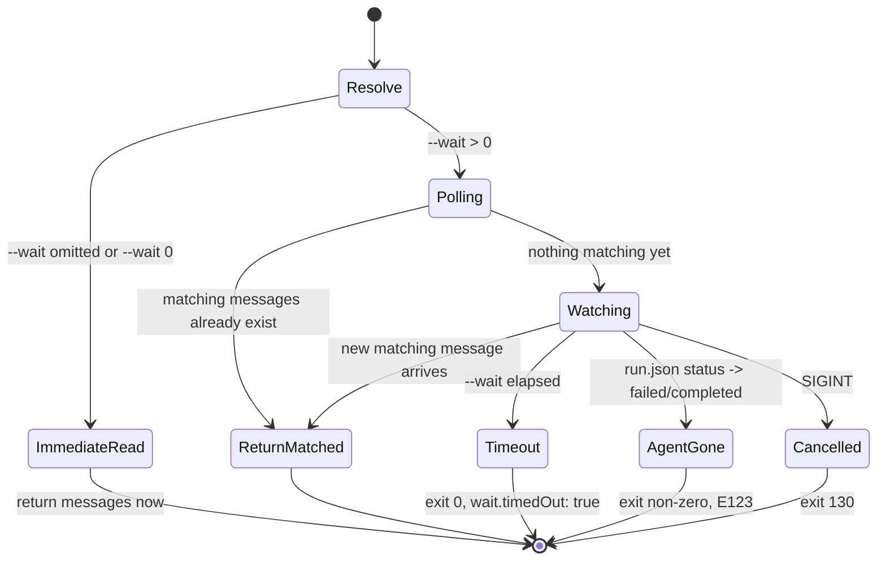

# Workshop: CLI Lane Semantics & Blocking Inbox

**Type**: CLI Flow + API Contract
**Plan**: 009-human-agent-view
**Spec**: [human-agent-view-spec.md](../human-agent-view-spec.md)
**Created**: 2026-04-28
**Status**: Draft

**Related Documents**:
- Workshop 002 — attach and control channel (the inbox/state surface this restructures)
- Workshop 006 — one-agent-mode and message semantics (the lane vocabulary)
- Workshop 007 — coordinated code-review companion (the agent type that makes the long-poll a daily-driver feature)
- Plan 008 FX002 — introduced the inside MCP `inbox_list` long-poll primitive that this workshop exposes outside

**Domain Context**:
- **Primary Domain**: `cli` (command surface restructure)
- **Related Domains**: `runner` (poll machinery shared with MCP), `mcp` (inside lane stays MCP-only for writes)

---

## Purpose

Restructure the minih CLI so **lane** (`inside` vs `outside`) is a first-class subcommand, fix the misleading `outside-` prefix that today reads the *inside* lane, and expose the bounded long-poll primitive (`--wait`) the inside MCP `inbox_list` already has. The outcome is a CLI tree where verb groupings mirror the data model, an operator can block-and-wait for the next agent reply without polling, and the inside lane is honestly read-only from outside actors.

## Key Questions Addressed

1. **Why does `outside-inbox-list` show inside messages today?** Two senses of "outside" got conflated: "called from outside" vs "lane=outside". Customers reading help expect the prefix to mean *lane*. It doesn't. Rename and group.
2. **Why isn't there a `--wait` on `outside-inbox-list`?** The inside MCP `inbox_list` long-polls (`waitMs` + `waitForAny`, capped at 30 s). The outside CLI just doesn't expose it. Operators end up loop-polling with `sleep 15` — observed live in the Option A experiment Run 001.
3. **Is the inside lane writable from outside?** No, by design. The agent process owns inside writes (state_set/transition, inbox_send, retros) via MCP tools. The CLI surfaces a **read-only** inside lane — symmetry without identity confusion.
4. **What about non-coordinated agents?** `inside`/`outside` subcommands return a clean `E121 NOT_COORDINATED` (with hint) — they don't simply 404. `doctor` already enforces the structural prerequisites.
5. **How do we ship this without breaking every script + agent prompt?** One-release alias period. Every flat `outside-*` and `state` command stays as a deprecated alias emitting a stderr warning, then is removed in the following release.

---

## Overview

### Today (flat)

```
minih outside-send <slug> --type --subject --body [--ack-of]
minih outside-inbox-list <slug> [--type] [--unread]   ← actually reads INSIDE lane
minih outside-context [slug]
minih outside-retro <slug> --message ...
minih state get|set|transition <slug> ...             ← already grouped (inconsistency)
minih retros [...]
minih run|status|list|tail|history|... (lifecycle)
```

**Two problems**:
1. Asymmetric: `state` is grouped, but `inbox`/`send`/`context`/`retro` are flat with `outside-` prefix.
2. Misleading: `outside-inbox-list` reads the **inside** lane (replies). The prefix means "called from outside", but the natural reading is "lane=outside".

### Proposed (lane-grouped)

```
minih outside <slug> ...      # operator-owned lane (R/W)
  inbox  list   [--wait <ms>] [--type <t>] [--unread] [--after <id>] [--run <runId>]
  inbox  send   --type --subject --body [--ack-of <id>] [--run <runId>]
  state  get    [--key <dot.path>] [--run <runId>]
  state  set    --status --data [--run <runId>]
  state  transition --to [--reason] [--run <runId>]
  context                     # print outside.md
  retro  add    --message [...] (was: outside-retro)

minih inside <slug> ...       # agent-owned lane (R-only from CLI)
  inbox  list   [--wait <ms>] [--type <t>] [--unread] [--after <id>] [--run <runId>]
  state  get    [--key <dot.path>] [--run <runId>]
  retro  show   [--run <runId>]   # reads farewell envelope's retro section

minih retros [...]            # cross-lane aggregator (unchanged)
minih run|resume|status|tail|history|list|init|inspect|...   # lifecycle (unchanged, top-level)
```

### Why this shape

| Property | Justification |
|----------|---------------|
| `inside`/`outside` are subcommand groups | Lane is the most-used dimension — operators think "what did the agent say?" (inside) vs "what did I send?" (outside). |
| Lifecycle commands stay top-level | `minih run smoke-test` is the most-typed command in the codebase. Don't move it. |
| Inside is read-only from CLI | Honest: only the agent process (via MCP) can author inside writes. CLI mirrors that boundary. |
| `--wait` works on both lanes | The long-poll primitive is the value, not lane-specific. Same flag, same semantics. |
| `state` becomes lane-prefixed | Eliminates the asymmetry. `--side` flag goes away (lane is the side). |

---

## Lane Surface Symmetry

The verb table makes the asymmetry explicit:

| Verb        | `outside` (R/W)                          | `inside` (R only from CLI)              |
|-------------|------------------------------------------|------------------------------------------|
| `inbox list`| ✅ list outside-lane messages I've sent  | ✅ list inside-lane messages agent sent  |
| `inbox send`| ✅ inject into outside lane              | ❌ MCP-only (`inbox_send`)               |
| `state get` | ✅ read outside.json                     | ✅ read inside.json                      |
| `state set` | ✅ write outside.json                    | ❌ MCP-only (`state_set`)                |
| `state transition` | ✅ write history + transition     | ❌ MCP-only (`state_transition`)         |
| `context`   | ✅ print outside.md                      | n/a (inside has no operator-facing context doc) |
| `retro add` | ✅ append outside retro                  | n/a (inside retros come from output envelope) |
| `retro show`| ✅ show outside retros                   | ✅ show inside retros (from envelope)    |

---

## --wait Semantics

The headline primitive. Reuses the inside MCP `inbox_list` machinery — see `src/mcp/tools/inbox.ts:46-194` (`inboxList` + `waitForMatchingMessages`). Key contract:

| Property | Value | Rationale |
|----------|-------|-----------|
| Default when `--wait` omitted | `0` (immediate, today's behaviour) | Backward compatible. Loops/CI shouldn't accidentally start blocking. |
| Default when `--wait` given without value | `300000` (5 min) | Matches user-stated default expectation; long enough for human-in-the-loop. |
| Maximum | `300000` (5 min) | Outside CLI gets a higher ceiling than the inside MCP cap of 30 s — operators want longer holds; agents must yield. |
| Minimum non-zero | `100 ms` | Avoid thrash. Anything lower is rejected with `E122 WAIT_OUT_OF_RANGE`. |
| Filters compose with wait | `--type`, `--unread`, `--after` | Identical to inside MCP `waitForAny` semantics. |
| Behaviour with existing matching messages | Return immediately with them + `wait.matched: true` | Same as MCP. No spurious sleeps. |
| Behaviour on timeout | Exit 0, envelope `data.wait.timedOut: true`, empty messages | Scripting-friendly; `if [ "$(... | jq -r .data.messages | length)" -gt 0 ]; then ...`. |
| Behaviour on agent process death during wait | `E123 AGENT_GONE` (non-zero exit) | Long-poll detects via `runs/<id>/run.json status != active` heartbeat (250 ms throttle). |
| SIGINT during wait | Cancel cleanly, exit 130, no partial output | Standard CLI convention. |

### Wait state machine



### Implementation note

Both the inside MCP `inboxList` and the outside CLI `outside inbox list --wait` should call into a shared **`pollInboxLane(location, lane, opts)`** helper (likely in `src/runner/inbox-poll.ts`, new). Lane is a parameter. Today's `waitForMatchingMessages` (in `src/mcp/tools/inbox.ts`) gets extracted upward — runner owns the primitive, MCP and CLI both consume. Keeps semantics identical and prevents drift.

---

## Concrete Examples

### Example 1: Operator drains agent replies after sending a task

```
$ minih outside inbox send code-review-companion \
    --type task --subject "review FX001-3" --body "..."
{"command":"outside.inbox.send","status":"ok","data":{"messageId":"01KQ...","ts":"..."}}

$ minih inside inbox list code-review-companion --wait 60000 --type summary --after 01KQ...
{"command":"inside.inbox.list","status":"ok","data":{"messages":[
  {"id":"01KR...","sender":"inside","type":"summary","subject":"FX001-3 — APPROVE","ackOf":"01KQ...","body":"..."}
],"wait":{"requestedMs":60000,"elapsedMs":12451,"timedOut":false,"matched":true}}}
```

The script blocks on the long-poll, returns the moment the summary arrives (or 60 s in, whichever first). No client-side polling loop.

### Example 2: Operator transitions outside-owned status

```
$ minih outside state transition code-review-companion --to engaged --reason "starting Run 002"
{"command":"outside.state.transition","status":"ok","data":{"transitioned":true,"from":"idle","to":"engaged"}}
```

(Identical to today's `minih state transition code-review-companion --to engaged --side outside`, but `--side` is gone — the lane is the subcommand.)

### Example 3: Read inside state without writing

```
$ minih inside state get code-review-companion
{"command":"inside.state.get","status":"ok","data":{"state":{"status":"reviewing","data":{"currentTask":"FX001-3","phase":"reading"},"updatedAt":"...","updatedBy":"inside"}}}

$ minih inside state set code-review-companion --status idle    # ERROR
{"command":"inside.state.set","status":"error","error":{"code":"E124","message":"inside lane is read-only from CLI; use the agent's MCP tool surface (state_set) — only the agent process can author inside writes."}}
```

### Example 4: Non-coordinated agent

```
$ minih outside inbox list smoke-test
{"command":"outside.inbox.list","status":"error","error":{"code":"E121","message":"agent 'smoke-test' is not coordinated (no 'coordination: enabled' in frontmatter); inside/outside subcommands require a coordinated agent.","hint":"Add 'coordination: enabled' to agents/smoke-test/prompt.md frontmatter and re-init with 'minih init smoke-test --coordinated'."}}
```

### Example 5: Long-poll until the agent farewells

```
# Wait up to 5 min for any of: summary, farewell, control-error
$ minih inside inbox list code-review-companion \
    --wait 300000 --type farewell
# Returns immediately when farewell arrives, or after 5 min with timedOut:true.
```

### Example 6: Pipelined Option A' (the workflow that motivated this)

```
# Edit task N, run tests, fire-and-forget review request, immediately start N+1.
do_work_for_task_N
minih outside inbox send code-review-companion \
  --type task --subject "review N" --body "files: ..."

do_work_for_task_N_plus_1
# When ready to gate (e.g., before final task):
minih inside inbox list code-review-companion \
  --wait 300000 --type summary --after $LAST_REVIEWED_ID
# block until the next pending review summary arrives, then act on it.
```

---

## Migration Strategy

### Aliases (one-release window)

| Old (deprecated, prints stderr warning) | New |
|------------------------------------------|-----|
| `minih outside-send <slug>`              | `minih outside inbox send <slug>` |
| `minih outside-inbox-list <slug>`        | `minih inside inbox list <slug>` (note: lane changes!) |
| `minih outside-context <slug>`           | `minih outside context <slug>` |
| `minih outside-retro <slug>`             | `minih outside retro add <slug>` |
| `minih state get <slug> --side outside`  | `minih outside state get <slug>` |
| `minih state get <slug> --side inside`   | `minih inside state get <slug>` |
| `minih state get <slug> --side both`     | (kept) `minih state get <slug>` (the only top-level `state` survivor — for the both-lanes use case) |
| `minih state set <slug>`                 | `minih outside state set <slug>` |
| `minih state transition <slug>`          | `minih outside state transition <slug>` |

Stderr warning format:
```
warn: 'minih outside-inbox-list' is deprecated and will be removed in the next release.
warn: Note: this command reads the INSIDE lane (replies). Use 'minih inside inbox list' instead.
warn: See https://github.com/AI-Substrate/minih/blob/main/docs/cli-migration.md
```

### Agent-prompt sweep

`grep -RIn 'outside-send\|outside-inbox-list\|outside-context\|outside-retro\|minih state ' agents/ docs/` produces the migration target list. All in-repo agent prompts, instructions, workshops, and example commands updated in the same PR. External users follow the warning.

### Removal release

One release later: aliases removed, deprecation warnings deleted, commander tree pruned. `minih state` (cross-lane both view) is the only `state` command left at top level.

---

## Error Codes (new + reused)

| Code | Where | Message | Cause |
|------|-------|---------|-------|
| E108 | existing | "Multiple runs found for X. Pass --run <runId>." | More than one active run for slug |
| E121 | new | "agent X is not coordinated; inside/outside subcommands require a coordinated agent." | Slug exists but `coordination` not enabled |
| E122 | new | "wait must be 0 or an integer between 100 and 300000 (5 min)." | `--wait` out of range |
| E123 | new | "agent process exited during long-poll." | `run.json` status changed to non-active mid-wait |
| E124 | new | "inside lane is read-only from CLI; use the agent's MCP tool surface." | Attempted `inside state set` etc. |
| E125 | new | "deprecated command 'X'; use 'Y' instead. Removal scheduled for next release." | (alias-stage warning, exit still 0) |

---

## Agent-Type Variants

Three agent shapes the CLI must serve:

| Agent type | Lane subcommands | Examples | Doctor enforces |
|------------|------------------|----------|-----------------|
| **Non-coordinated** (`coordination` absent or `disabled`) | All `outside`/`inside` calls return `E121 NOT_COORDINATED` | `smoke-test`, `convention-check`, most legacy agents | No outside.md, no inside-state schema, no inbox/state folders required |
| **Coordinated, single-shot** (`coordination: enabled`, no `outside.md`?) | Today this is forbidden by `doctor`; all 7 inside/outside verbs available | _hypothetical only_ | outside.md required if coordination enabled |
| **Coordinated, long-running** (`coordination: enabled`, idle long-poll loop) | All 7 inside/outside verbs available; `--wait` is the operator's primary tool | `code-review-companion`, `coordination-loop-validator`, `coordination-smoke-test` | All coordinated-agent prereqs |

**`doctor` updates** (one tiny addition):
- For each non-coordinated agent: warn (not error) if a script under `agents/<slug>/` references `outside-*` commands that wouldn't apply.
- For each coordinated agent: confirm `state/inside-state.schema.json` (preferred) OR `<agentDir>/inside-state.schema.json` (legacy) exists — already enforced as of FX001-2.

---

## Quick Reference (operator cheatsheet)

```bash
# === Lifecycle ===
minih run <slug>                       # start a run
minih status <slug>                    # active/stale/completed
minih tail <slug>                      # follow event stream
minih history <slug>                   # past runs
minih list                             # all agent definitions

# === Outside lane (R/W) — what I send the agent ===
minih outside inbox send <slug> --type task --subject "..." --body "..."
minih outside inbox list <slug> [--wait 300000] [--type ack] [--after <id>]
minih outside state get <slug>
minih outside state set <slug> --status engaged
minih outside state transition <slug> --to engaged --reason "..."
minih outside context <slug>           # print outside.md
minih outside retro add <slug> --message "..."

# === Inside lane (R only) — what the agent says ===
minih inside inbox list <slug> [--wait 300000] [--type summary] [--after <id>]
minih inside state get <slug>
minih inside retro show <slug>

# === Cross-lane ===
minih state get <slug>                 # both lanes
minih retros                           # aggregate retros
```

---

## Open Questions

### Q1: Should `--wait` apply to `state get` (await next state transition)?

**OPEN**: Could be useful for "block until agent reaches reviewing state". But a separate verb (`state watch <slug> --until <status>`) might be cleaner than overloading `get`. Defer to a future workshop.

### Q2: Should the alias warning be one release or two?

**OPEN — RECOMMEND ONE**: Minih's pre-1.0; users are mostly internal. One-release deprecation keeps the migration short. If pain emerges, extend by point-release.

### Q3: Does `inside retro show` need its own machinery, or just print the relevant section of the farewell envelope?

**RESOLVED**: Just print the relevant section of `agents/<slug>/runs/<id>/output/report.json` (or whatever the schema-validated output file is). No new storage. The retro lives in the envelope; the CLI is a convenience reader.

### Q4: Should `--wait` envelope expose the watermark for next-poll continuation?

**RESOLVED — YES**: Include `data.nextAfter: <last-message-id>` so the next call can `--after $nextAfter` without state on the client. Mirrors the inside MCP shape (`InboxListOutput.nextAfter` already exists).

### Q5: Do we need a `minih watch` top-level command (multi-lane composite TUI)?

**OPEN**: Out of scope for this workshop — the Phase 2 Ink view (the whole point of plan 009) is the answer. This workshop only covers the scriptable CLI.

---

## Acceptance Criteria for Implementing This Workshop

A future plan/spec can declare done when:

- [ ] `minih outside <verb>` and `minih inside <verb>` subtree exists and matches the table above
- [ ] `--wait`, `--type`, `--after`, `--unread` all work on both `outside inbox list` and `inside inbox list`
- [ ] Long-poll envelope shape matches inside MCP `inbox_list` (matched/timedOut/elapsedMs)
- [ ] `inside <write-verb>` returns `E124` cleanly without scary stack traces
- [ ] Non-coordinated agents return `E121` from any `inside`/`outside` subcommand
- [ ] All flat `outside-*` + `state get/set/transition` commands still work, with stderr deprecation warning
- [ ] `docs/cli-migration.md` exists with the alias mapping table
- [ ] All in-repo agent prompts and `docs/` references updated to the new tree
- [ ] `pollInboxLane` extracted to `src/runner/` and consumed by both inside MCP and outside CLI
- [ ] `just fft` exit 0; agent regression baseline (236+) intact

---

## What's Out of Scope

- The Phase 2 Ink TUI (it's the whole reason plan 009 exists; this workshop only restructures the scriptable CLI).
- Adding new lane-asymmetric writes (e.g., outside-injected inside state). Out of model.
- WebSocket/SSE-style transport (long-poll over file watch is good enough for v1).
- Auth/permissioning between operators on a shared `agents/` directory.
