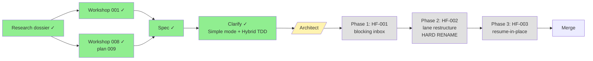

# Flight Plan: Coordination CLI Ergonomics

**Plan**: 010-coordination-cli-and-resume
**Spec**: [coordination-cli-and-resume-spec.md](./coordination-cli-and-resume-spec.md)
**Plan**: [coordination-cli-and-resume-plan.md](./coordination-cli-and-resume-plan.md)
**Status**: Architected (Simple mode, 19 tasks) — ready for `/plan-4-complete-the-plan`
**Generated**: 2026-04-28

---

## Mission

Make minih's coordination CLI **honest** (lane = subcommand), **blocking** (`--wait` on inbox reads), and **continuous** (resume = same run dir, same SDK session). Three coupled fixes (HF-001 / HF-002 / HF-003) surfaced live during plan 009's FX001 dogfood — `EXPERIMENT-LOG.md` records each one verbatim.

## Journey Map

## Phases (proposed)

| # | Phase | Scope | Complexity | Unblocks |
|---|-------|-------|------------|----------|
| 1 | HF-001 — Blocking inbox | Extract `pollInboxLane` to `runner/`; expose `--wait`/`--type`/`--after` on `outside-inbox-list` (and the future `inside inbox list`). MCP refactors to consume the shared primitive. | CS-2 | Run 002 of experiment harness; Phase 2 (Ink view) of plan 009 |
| 2 | HF-002 — Lane restructure (HARD RENAME) | `outside <verb>` + `inside <verb>` Commander trees; **no aliases** — old flat names removed in same PR; new error codes E121/E124; agent-prompt sweep across all in-repo coordinated agents (atomic); `inside retro show` included. | CS-3 | Honest CLI surface; clean break |
| 3 | HF-003 — Resume-in-place | Eligibility state machine; takeover protocol with `resume-intent.lock`; mutate `run.json` with `resumes[]`; rename `completed.json` → `completed-N.json`; `--resume-prompt` prefix convention; synthetic `{type: 'resume'}` event; "On Resume" preamble update; E125-E130. `MINIH_E2E=1` live SDK gate. | CS-3 | Long-running coordinated agents survive restarts without context loss |

## Outcome (verbatim from spec § Goals)

- Operators block-wait on next agent reply without polling loops
- CLI lane verbs match disk lanes (no more "outside reads inside" surprise)
- Stop + restart preserves run dir, SDK session, inbox/state/history continuity
- Structured "you were resumed" signal recognized by agents
- One-release alias period prevents script breakage
- Phase 2 Ink TUI inherits primitives ready-made
- Experiment harness (Run 002+) defaults to pipelined collaboration

## Out of Scope

- `minih agent <verb>` parent prefix for lifecycle (Workshop 008 Q5 deferred)
- Adapter API extension for true SDK system messages (Workshop 001 Q8 deferred)
- Multi-host or cross-version resume
- Resume-and-fork (clone-a-run-dir feature)
- Full Ink TUI (plan 009 Phase 2)

## Workshops

| # | Topic | Type | Status |
|---|-------|------|--------|
| 001 | Resume-in-place semantics | State Machine + Integration Pattern | ✅ Complete |
| _(plan 009)_ 008 | CLI lane semantics + blocking inbox | CLI Flow + API Contract | ✅ Complete |
| _(optional)_ — | Polling primitive contract | API Contract | _Defer; spec covers it_ |
| _(optional)_ — | Migration strategy | Other | _Defer; `docs/cli-migration.md`_ |

## Risks (top 3)

1. **Filter chain drift between CLI and MCP after sharing `pollInboxLane`** — single source of truth in runner extract; integration test asserts identical behavior.
2. **`[SYSTEM RESUME]` prefix misread by some LLMs as user turn** — `_shared/preamble.md` "On Resume" instructions; live smoke validates; escalate to adapter system-message channel if dogfooding shows confusion.
3. **Takeover race against actively writing process** — eligibility state machine refuses `active` without `--takeover`; lock file serializes; SIGTERM grace + SIGKILL bounded at 5 s.

## Status

| Stage | Done |
|-------|------|
| Research dossier | ✅ |
| Workshop 001 (HF-003 design) | ✅ |
| Workshop 008 (HF-001/-002 design — plan 009) | ✅ |
| Spec | ✅ |
| Clarify (Simple + Hybrid TDD + Hard Rename) | ✅ |
| Architect (`plan-3`) | ✅ — 19 tasks, 1 phase |
| Complete-the-Plan (`plan-4`) | ⬜ |
| Validate (`validate-v2`) | ⬜ |
| Implement (`plan-6` w/ pipelined Option A' + companion) | ⬜ |
| Merge | ⬜ |

## Flight Log

- **2026-04-28** — Plan created. Research dossier landed (4 explore agents). Workshop 001 (resume-in-place) landed. Spec drafted. Clarify done (8 Qs, all resolved): **Simple mode**, **Hybrid TDD**, **avoid mocks**, **`pollInboxLane` internal**, **bare `--wait` = 60s**, **HARD RENAME (no aliases)**, **include `inside retro show` in HF-002**, **keep top-level `minih state get`**. Ready for `/plan-3-architect`.
