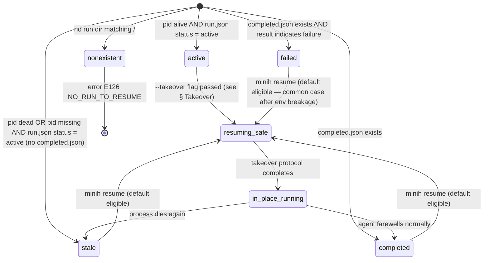
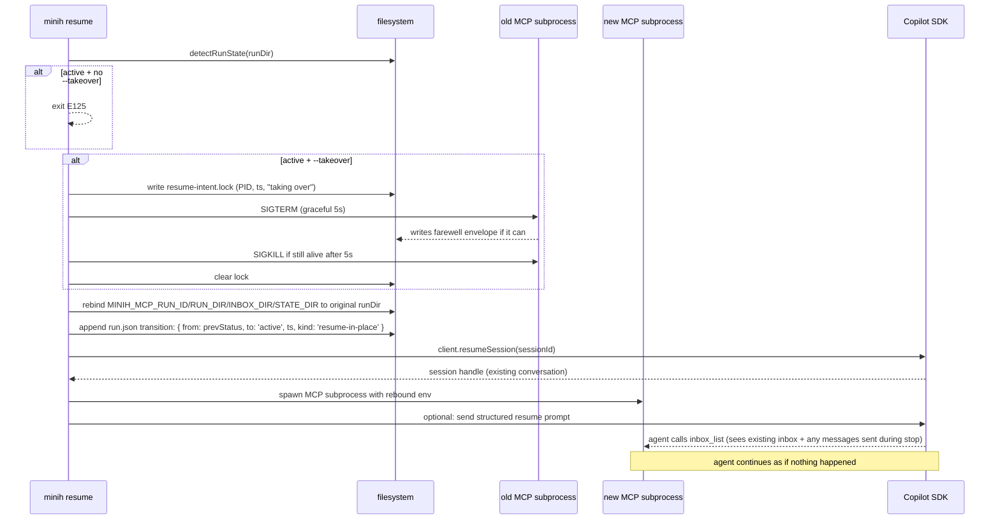

# Workshop: Resume-In-Place Semantics

**Type**: State Machine + Integration Pattern
**Plan**: 010-coordination-cli-and-resume
**Spec**: _(pending — this workshop precedes the spec on user request)_
**Created**: 2026-04-28
**Status**: Draft

**Related Documents**:
- [Research dossier — research-dossier.md](../research-dossier.md) (Critical Finding 01: HF-003 has no precedent)
- [Workshop 008 (plan 009) — CLI lane semantics + blocking inbox](../../009-human-agent-view/workshops/008-cli-lane-semantics-and-blocking-inbox.md) (HF-001/HF-002 design source)
- [Experiment Run 001 — HF-003 friction record](../../009-human-agent-view/prompts/EXPERIMENT-LOG.md) (lived motivation)

**Domain Context**:
- **Primary Domain**: `runner` (run-folder lifecycle, MCP env handoff)
- **Related Domains**: `cli` (`resume` command surface), `adapter` (SDK session reuse, optional structured prompt), `mcp` (subprocess restart contract)

---

## Purpose

Lock in the design for `minih resume <slug>` to behave **as if the agent never stopped**: same run dir, same SDK sessionId, same inbox/state files preserved, fresh MCP subprocess loading current dist, optional structured resume prompt the agent perceives as a system event rather than a user turn. Resolves Critical Finding 01 from the plan 010 research dossier before architecture begins.

## Key Questions Addressed

1. **Eligibility**: which run statuses can be resumed in place? What's the safe takeover boundary?
2. **Manifest evolution**: do we mutate `run.json` / `completed.json`, append, or write a new file?
3. **MCP subprocess restart protocol**: how do we cleanly stop the old subprocess, spawn a fresh one, and rebind env vars to the original run dir without races?
4. **Structured resume prompt**: extend `IAgentAdapter` with a system-message channel, or live with a prefix convention? When is each appropriate?
5. **Failure modes**: what happens when resume races against the original process still being alive, or when the original SDK session has expired server-side?

---

## Overview

### What "as if it didn't even stop" means concretely

When the user runs `minih resume <slug>` (no `--run` flag, no message), the new behavior is:

1. **Same run dir** — `agents/<slug>/runs/<originalRunId>/` is reused. The inbox, state, history, output, and event-stream files are all preserved and continue accumulating.
2. **Same SDK sessionId** — `client.resumeSession(sessionId)` reattaches to the prior LLM conversation.
3. **Fresh MCP subprocess** — the new MCP server process loads current `dist/`, gets `MINIH_MCP_RUN_ID` / `MINIH_MCP_RUN_DIR` / `MINIH_INBOX_DIR` / `MINIH_STATE_DIR` pointing at the **original** run dir.
4. **Optional resume signal** — by default the agent simply re-checks its inbox via long-poll (zero new prompt); if the operator passes `--resume-prompt "..."` or just `--message "..."`, the agent receives a structured signal explaining what happened.

### What changes vs today

| Concern | Today | Resume-in-place |
|---------|-------|------------------|
| Run dir | New `<runId>` per resume | Reused original `<runId>` |
| `run.json` | New file in new dir | Original mutated in place + transition logged |
| `completed.json` | New file in new dir; backlinks via `resumedFromRunId` | Original modified (status flips back to `active`) OR a sibling `resumed-at.ndjson` log records each resume |
| Inbox/state files | Empty in new dir | Carry forward (the whole point) |
| MCP subprocess | New subprocess in new env | New subprocess in original env (rebound) |
| SDK session | `resumeSession(sessionId)` | Same |
| Prompt model | `session.send({prompt: message})` | Same OR structured-prompt path (see below) |
| Eligibility | `completed` only | `completed` + `stale` + opt-in for `active` |

---

## Eligibility State Machine

### Resume-eligibility states for a run

Each run dir has an effective state at any moment, derived from filesystem + process liveness:



### Eligibility rules

| Run state | `minih resume` (default) | `minih resume --takeover` | Reason |
|-----------|--------------------------|---------------------------|--------|
| **active** | ❌ refuse with `E125 ALREADY_ACTIVE` | ✅ proceed (with confirmation prompt if TTY) | Two processes on one run dir = corrupted inbox/state |
| **stale** | ✅ proceed | ✅ proceed | Original process died; takeover is safe |
| **completed** | ✅ proceed | ✅ proceed | Standard "send a follow-up" case (today's behavior, in-place-ified) |
| **failed** | ✅ proceed | ✅ proceed | Common case: env broke, fix it, resume. State carries forward. |
| **nonexistent** | ❌ `E126 NO_RUN_TO_RESUME` | ❌ same | Nothing to resume |

### Stale detection

A run is **stale** when `run.json.status === 'active'` but `pid` is no longer running (or `pid` is null). Detection on `minih resume`:

```ts
function detectRunState(runDir: string): RunState {
  const runJson = readManifest(runDir);
  const completedJson = readCompletedJson(runDir); // null if absent

  if (completedJson) {
    return completedJson.result?.status === 'failed' ? 'failed' : 'completed';
  }

  if (runJson.status === 'active') {
    if (runJson.pid && isProcessAlive(runJson.pid)) return 'active';
    return 'stale';  // pid dead or missing
  }

  return 'failed'; // active manifest with non-active status is a corruption case
}

function isProcessAlive(pid: number): boolean {
  try {
    process.kill(pid, 0);  // signal 0 = test, no actual signal sent
    return true;
  } catch {
    return false;  // ESRCH or permission
  }
}
```

### Default selection (no `--run` passed)

Today: pick latest `completed.json` run. **Change**: pick the *most recently active* eligible run. Tiebreak by `updatedAt`. If multiple are eligible, error `E108 MULTIPLE_RUNS` with the candidate list (mirrors current `outside-send` behavior).

---

## Takeover Protocol

When resume picks an `active` or `stale` run, we follow this exact sequence:



### Lock file contract

`<runDir>/resume-intent.lock` exists only during the takeover window. Contains JSON:

```json
{
  "pid": 12345,
  "startedAt": "2026-04-28T10:30:00.000Z",
  "originalSessionId": "abc-123",
  "kind": "takeover|stale-revive|completed-followup"
}
```

The next `minih resume` checks for a lock first. If found:
- Lock < 30s old → wait + retry (someone else is mid-takeover)
- Lock ≥ 30s old → assume stale takeover, force-clear with warning, proceed

Lock is cleared on success or when the resuming process exits cleanly. Crash leaves stale lock (handled above).

---

## Manifest Evolution

### `run.json` mutation

The original `run.json` is **mutated in place**, never replaced. Each resume appends to a new field:

```json
{
  "schemaVersion": 1,
  "slug": "code-review-companion",
  "runId": "2026-04-28T19-26-31-074Z-0527",
  "runDir": "...",
  "pid": 6789,
  "startedAt": "2026-04-28T09:26:31.074Z",
  "updatedAt": "2026-04-28T20:30:00.000Z",
  "status": "active",
  "sessionId": "a52fb73e-632c-4a66-b1a1-21a5578c4852",
  "model": "gpt-5.4",
  "control": { "available": true, "kind": "none" },
  "counters": { "events": 8204, "toolCalls": 47, "messages": 13, "errors": 3 },
  "resumes": [
    {
      "ts": "2026-04-28T10:30:00.000Z",
      "fromState": "stale",
      "kind": "stale-revive",
      "previousPid": 1549,
      "rebuildHint": "dist rebuilt at 09:52:30Z"
    }
  ]
}
```

The `pid` field is updated to the new resuming process. `counters` continue from the previous values (event ordinal preserved). `resumes[]` is append-only.

### `completed.json` evolution

Three options were considered:

| Option | Description | Pros | Cons | Decision |
|--------|-------------|------|------|----------|
| **A. Mutate** | Delete or overwrite `completed.json` when resuming | Simple | Loses original completion record | ❌ |
| **B. Sibling log** | Keep `completed.json`; write a new `resumed-at.ndjson` line per resume; on final exit, `completed.json` is rewritten with the latest result | Preserves history, cleanly versions | Two files to keep consistent | ❌ |
| **C. Renamed history** | On resume, rename `completed.json` → `completed-N.json` (where N is `resumes.length`), let the new run write a fresh `completed.json` on next exit | History preserved as discrete files; the canonical `completed.json` is always "the latest exit"; matches operator mental model | Requires synchronization | ✅ **Chosen** |

**Why C**: `completed.json` is consumed by `minih history`, `findRunSession`, and several tests. Keeping it singular but versioning predecessors lets all readers stay simple. The numbered history files are inspectable for debugging but not in the hot read path.

### Coordination artifact handling

Inbox files (`inbox/{inside,outside}/messages.ndjson`) and state files (`state/inside.json`, `state/outside.json`, `state/history.ndjson`) **continue accumulating**. Resume does not touch them. This is the entire point.

### Snapshot files

`run-folder-snapshot.json` (used by `coordinationFiles` snapshot) is regenerated on each resume — it captures the **current** state of the run dir at that moment, so a subsequent code-review of the resumed session sees the live picture.

---

## Structured Resume Prompt

### Three options

| Option | Description | Adapter change | Agent visibility | Decision |
|--------|-------------|----------------|------------------|----------|
| **P1. Pure plain-prompt** | Pass `--message` becomes a normal `session.send({prompt: message})` user turn. No new flag. Default no-message resume sends nothing — agent's idle long-poll picks up any pending inbox messages. | None | Looks like a user turn | Available always |
| **P2. Prefix convention** | `--resume-prompt "..."` wraps the message in a recognizable envelope: `[SYSTEM RESUME @ 2026-04-28T10:30:00Z reason="MCP rebuilt"]\n\n<message>`. Agents look for the bracketed prefix in `_shared/preamble.md` instructions. Still uses `session.send({prompt})`. | None | Looks like a tagged user turn | ✅ **Chosen for v1** |
| **P3. Adapter system channel** | Extend `IAgentAdapter` with `sendSystem({prompt})` method. Backed by SDK's system-message API if available, else falls back to P2's prefix. | New adapter method + impl across SdkCopilotAdapter and FakeAgentAdapter | Genuine system message in the LLM transcript | Defer to v2; revisit if P2 in practice causes confusion |

### v1 contract (P2 chosen)

```bash
# Default: no message, no prompt — agent re-checks inbox via long-poll on resume.
minih resume code-review-companion

# Explicit user follow-up — appears as a user turn in transcript.
minih resume code-review-companion "any updates on FX001-7?"

# Structured resume signal — appears as a tagged user turn the agent recognizes.
minih resume code-review-companion --resume-prompt "MCP rebuilt with FX001-2/3; tools are now ackOf-aware"

# Both message and resume-prompt — resume-prompt is sent first as a separate turn.
minih resume code-review-companion --resume-prompt "..." "follow-up"
```

The resume-prompt envelope:

```
[SYSTEM RESUME]
  ts: 2026-04-28T10:30:00.000Z
  reason: MCP rebuilt with FX001-2/3; tools are now ackOf-aware
  fromState: stale
  previousPid: 1549

(continue from your last task — your inbox and state are intact)
```

### Agent-side recognition

`agents/_shared/preamble.md` (the shared agent preamble) gets a new "On Resume" section:

```markdown
## On Resume

If you receive a user turn beginning with `[SYSTEM RESUME]`, this is not a user message — it's a structured signal that:
1. Your run was paused and is now continuing in the **same run dir**.
2. Your inbox, state, and history files are intact — read them.
3. You should orient briefly (`inbox_list` + `state_get` + glance at `state/history.ndjson`) and then continue from where you left off, or pick up the new direction the resume-prompt provides.
4. Acknowledge briefly in a `progress` inbox message; do NOT repeat your full orient sequence.
```

---

## Failure Modes & Recovery

### F1. Original SDK session expired server-side

`client.resumeSession(sessionId)` rejects with a 404-ish error.

**Behavior**: surface clearly with `E127 SESSION_EXPIRED`, suggest `minih run <slug>` (fresh start) — do NOT silently fall through to a new run dir, because that would lose coordination state without warning.

### F2. Run dir locked by another resume

`resume-intent.lock` < 30s old, owned by another process.

**Behavior**: wait up to 35s, retry. If still locked, surface `E128 RESUME_IN_PROGRESS` with the locking PID + ts.

### F3. Coordinated agent's inbox file corrupted at resume time

`waitForMatchingMessages`-equivalent re-read fails on torn final line.

**Behavior**: same as inside MCP today — surface `MCP_INBOX_CORRUPT` (now `E129 INBOX_CORRUPT` at the CLI level). Do not auto-truncate; the operator must decide.

### F4. Active process refuses SIGTERM during takeover

`--takeover` against an `active` run that ignores SIGTERM for >5s.

**Behavior**: SIGKILL after 5s. Log to stderr and append a `forced-takeover: true` flag to the resume log entry. The operator opted in by passing `--takeover`; they accepted the risk.

### F5. MCP env vars rebound but new subprocess fails to start

E.g., port collision (none today, but spawn could fail).

**Behavior**: detect via spawn error, rollback the lock, leave manifest in `stale` (do not advance to `active`), surface `E130 MCP_SPAWN_FAILED` with the underlying error. Operator can retry resume cleanly — no half-state to clean up.

---

## Quick Reference

```bash
# Most common: resume a recently stopped/completed run, no message.
minih resume code-review-companion

# Resume with a follow-up message (today's UX, but now in-place).
minih resume code-review-companion "carry on with FX001-7"

# Resume with an explicit system signal (typical after dist rebuild).
minih resume code-review-companion --resume-prompt "MCP rebuilt; tools are now FX001-aware"

# Force takeover of an active run (rare, dangerous).
minih resume code-review-companion --takeover --resume-prompt "previous process unresponsive"

# Pick a specific historical run.
minih resume code-review-companion --run 2026-04-28T19-26-31-074Z-0527
```

### Error codes (new for HF-003)

| Code | Message | Cause |
|------|---------|-------|
| E125 | "run X is currently active (pid Y); pass --takeover to override" | Default refuses to take over an alive run |
| E126 | "no run found for slug X" | Nothing to resume |
| E127 | "SDK session for run X has expired; start a fresh run with `minih run X`" | `client.resumeSession` rejected |
| E128 | "another resume is in progress for run X (lock held by pid Y for Zs)" | Concurrent takeover |
| E129 | "inbox file in run X has a torn final line; manual recovery needed" | Corruption surfaced on resume |
| E130 | "MCP subprocess failed to start: <reason>" | Spawn failure post-rebind |

---

## Open Questions

### Q1: Should resume-in-place be the default, or opt-in via `--in-place`?

**RESOLVED — DEFAULT IN-PLACE**: today's "create new run dir" behavior is the surprising one (the user explicitly called this out: "would love to be able to resume in same folder"). New default is in-place; opt out with `--fresh` if the operator wants today's behavior. Documented as a behavior change in the migration doc.

### Q2: Does `--resume-prompt` send a separate turn or merge with `--message`?

**RESOLVED — SEPARATE TURN**: cleaner LLM transcript. The structured signal lands first (system context), then the user message lands (user instruction). Two `session.send({prompt})` calls in sequence; both await idle.

### Q3: How do we handle the `resumedFromRunId` field that today's `completed.json` carries?

**RESOLVED**: drop it. With in-place semantics, the original runId is the only runId; `resumes[]` in `run.json` carries the resume history. Provide a one-release deprecation: when reading old `completed.json` files, accept and ignore the field.

### Q4: Should `--takeover` against an `active` run prompt for confirmation in TTY mode?

**RESOLVED — YES**: TTY confirmation `"This will SIGTERM pid 1549 (alive 5m32s, last event 12s ago). Continue? [y/N]"`. Bypassed with `--yes`. Non-TTY (e.g., CI) requires `--yes`.

### Q5: Should we support resuming agents that were originally non-coordinated?

**RESOLVED — YES, BUT TRIVIALLY**: non-coordinated agents have no inbox/state to preserve. In-place resume for them just means: same run dir (event stream continues accumulating), same SDK sessionId. No new behavior, just consistency.

### Q6: What happens to `events.ndjson` on resume? Continue appending or new file?

**RESOLVED — CONTINUE APPENDING**: it's append-only NDJSON, naturally extends. Add a synthetic event at the boundary: `{type: 'resume', ts, fromState, kind, ...}` so consumers (tail, the future Ink view) can render the boundary visually.

### Q7: Should the workshop also cover `--no-resume-prompt` for explicit silent resume?

**OPEN**: probably not — silent resume is the default (no `--resume-prompt`, no `--message`). A `--no-resume-prompt` flag would only make sense if `--resume-prompt` had a default value, which it doesn't. Defer.

### Q8: Adapter API change for system message channel — when?

**OPEN — DEFER TO v2**: P2 (prefix convention) is sufficient for v1. Track this as a workshop opportunity for plan 011 if v1 dogfooding shows the prefix is consistently misread.

---

## Acceptance Criteria for Implementing This Workshop

A future plan-3 phase covering HF-003 can declare done when:

- [ ] `minih resume <slug>` (no flags) reuses original run dir + sessionId; inbox/state files preserved
- [ ] Eligibility state machine implemented in `detectRunState`; tested against active/stale/completed/failed/nonexistent
- [ ] `--takeover` flag works on `active` runs with TTY confirmation + `--yes` bypass
- [ ] `resume-intent.lock` lifecycle correct under crash + concurrent-resume scenarios
- [ ] `run.json` mutated in place with `resumes[]` append-only log
- [ ] `completed.json` versioned via `completed-N.json` rename on resume; latest always wins
- [ ] MCP env vars rebound to original run dir before subprocess spawn
- [ ] `--resume-prompt` and `--message` send as separate sequential SDK turns
- [ ] Synthetic `{type: 'resume', ...}` event appended to `events.ndjson` at the boundary
- [ ] All E125-E130 error codes implemented with envelope + helpful hints
- [ ] `agents/_shared/preamble.md` "On Resume" section landed
- [ ] All in-repo coordinated agents updated to recognize `[SYSTEM RESUME]` envelope
- [ ] Live smoke: stop `code-review-companion` mid-task, resume in place, verify it picks up FX001 review thread without losing context
- [ ] `just fft` exit 0; integration test under `MINIH_E2E=1`

---

## What's Out of Scope

- Adapter API extension for true SDK system messages (P3) — defer to v2 if prefix convention proves insufficient
- Multi-host resume (resuming a run from a different machine) — single-host only for v1
- Cross-version resume (resuming a run started under a different minih major version) — refuse with `E131 INCOMPATIBLE_VERSION` instead
- Resume-and-fork (cloning a run dir and resuming the clone) — useful for what-if exploration but a separate feature
