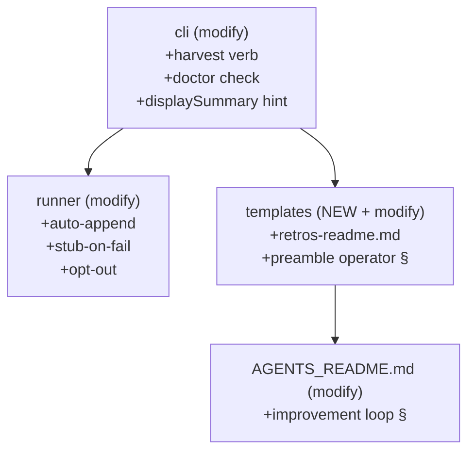

# Flight Plan — Retro Harvest Loop

**Plan**: [retro-harvest-loop-spec.md](./retro-harvest-loop-spec.md)
**Workshop source**: [Plan 010 / Workshop 002](../010-coordination-cli-and-resume/workshops/002-retro-harvest-discipline.md)
**Status**: Specifying (spec drafted; clarify next)
**Mode candidate**: Simple
**Created**: 2026-04-29

---

## Journey Map

## Phases

| # | Phase | Status | Notes |
|---|-------|--------|-------|
| – | Spec | ✅ Drafted | This file's existence proves it. |
| – | Clarify | ⏭️ Next | ≤8 questions; resolve auto-append default, ledger grain, stub-entry policy, doctor scope. |
| – | Architect | ⏭️ Pending | Single-phase Simple mode; HF-A → HF-D tier breakdown per Workshop 002. |
| – | Implement | ⏭️ Pending | One coordinated commit per HF tier; standard `just fft` gate. No live SDK smoke needed. |

## Acceptance Roll-Up

12 acceptance criteria (AC-1 through AC-12). All testable via existing CLI test patterns + new runner unit tests. No live-SDK gate required.

## Domain Touch Map

## Flight Log

| Date | Event | Note |
|------|-------|------|
| 2026-04-29 | Plan created | Off Workshop 002. Closes the consumer side of the magicWand/difficulties loop. |

---

**Next step**: `/plan-2-v2-clarify --plan docs/plans/011-retro-harvest-loop/retro-harvest-loop-spec.md`
