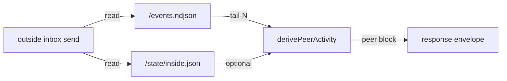

# Workshop: Peer Activity Telemetry — Ground-Truth Visibility for Coordinated Agents

**Type**: Integration Pattern + API Contract
**Plan**: 011-retro-harvest-loop (workshop spans into plan 012)
**Spec**: _(meta — applies to every coordination protocol that uses inside agents, not a single feature)_
**Created**: 2026-04-29
**Status**: Draft

**Related Documents**:
- [Plan 011 / Power On Mode run-file](../prompts/option-c/runs/001-power-on.md) — the lived motivation
- [Plan 010 / Workshop 002 (retro harvest discipline)](../../010-coordination-cli-and-resume/workshops/002-retro-harvest-discipline.md) — same spirit (closing observer-side loops)
- `src/runner/inbox-poll.ts` — the existing primitive that observes outside lane; this workshop extends the same idea to inside lane

**Domain Context**:
- **Primary domain**: `runner` (events.ndjson is the runner's product; derivation lives here)
- **Related domains**: `cli` (`outside inbox send`/`list` response surface), `mcp` (the inside `inbox_list` tool whose calls we're observing)

---

## Purpose

Lock the design for **objective, derived-from-telemetry peer activity visibility** in the outside-lane CLI. State alone is insufficient — coordinated agents can forget to set state, lag behind reality, or misreport. But every meaningful action they take goes through MCP tool calls, and **every tool call is recorded in `events.ndjson`**. This workshop designs the surface that turns those tool calls into a peer-activity snapshot the orchestrator sees in the response of `outside inbox send` (and related commands).

The goal: when an orchestrator fires a message into the inside agent's inbox, the response should make it **structurally impossible** to be unaware that:

1. The agent is alive but not polling.
2. The agent IS polling but with a filter that excludes this message type.
3. The agent stopped polling some time ago.
4. The agent has never polled at all.

## Key Questions Addressed

1. What signals does `events.ndjson` already carry that we can derive peer activity from?
2. State (self-reported) vs telemetry (observed) — when do they conflict, and which wins?
3. What does the `peer` block in the `outside inbox send` response envelope look like?
4. How do we keep this CLI-side derivation cheap (no full event-stream scan per send)?
5. What does the orchestrator do with the signal (block? warn? proceed?) — and is that the orchestrator's choice or the protocol's?

---

## The Lived Motivation (5 lines)

Plan 011's Power On Mode run lost ~30 minutes because the inside agent's `inbox_list waitForAny` filter was `['task', 'question', 'directive', 'control']` and every Power On ping used `briefing` or `review-request` — types not in the filter. The agent was alive, polling, healthy. Its tool calls were RECORDED. But nothing surfaced that mismatch to the orchestrator. The orchestrator's only signal was 60-second drain timeout. **The fix is not "make agents better at self-reporting"; it's "let the runner observe what the agent is actually doing".**

---

## Two Sources of Truth — and Why Telemetry Wins

| Signal | Source | Strength | Weakness |
|--------|--------|----------|----------|
| **State** (`state/inside.json`) | Agent calls `state_set` / `state_transition` | Semantic — agent says "I'm reviewing X" | Self-reported. Can be stale, missing, wrong, or never set. |
| **Telemetry** (`events.ndjson` tool calls) | Runner records every MCP tool invocation | Objective — agent literally did this | Lower-level. "Polled inbox at 03:42Z" needs interpretation. |

The two are **complementary, not redundant**:

- State tells you the agent's *intention*.
- Telemetry tells you the agent's *behavior*.
- When they disagree, **behavior wins** — the agent might claim `state: idle` but if its last `inbox_list` call was 35 minutes ago, it's effectively dead, regardless of what it told you.

This workshop focuses on the telemetry side because it's the **structural** layer. Telemetry-driven peer visibility makes coordinated protocols robust against agent self-reporting bugs (like the one that bit us in plan 011).

---

## What We Can Derive From `events.ndjson`

Every coordinated agent's run dir contains `events.ndjson` — an append-only stream where the runner records (among many other things) every `tool_call` event with full `input` payload and timestamp. Here are the events that matter for inside-lane visibility:

```jsonc
// Polling event — the agent asked the runner-managed inside-MCP for messages
{
  "type": "tool_call",
  "timestamp": "2026-04-29T03:13:01.877Z",
  "data": {
    "toolName": "minih-coordination-inbox_list",
    "input": {
      "unread": true,
      "waitMs": 30000,
      "waitForAny": ["task", "question", "directive", "control"]
    },
    "toolCallId": "tooluse_DHUT8YLaWErdRTYLRQyJ9e"
  }
}

// Send event — the agent emitted an outside-bound message
{
  "type": "tool_call",
  "timestamp": "2026-04-29T03:12:53.890Z",
  "data": {
    "toolName": "minih-coordination-inbox_send",
    "input": { "type": "progress", "subject": "...", "body": "..." }
  }
}

// Ack event — the agent acknowledged a specific outside message
{
  "type": "tool_call",
  "timestamp": "2026-04-29T03:43:11.114Z",
  "data": {
    "toolName": "minih-coordination-inbox_ack",
    "input": { "messageId": "01KQBKQZPDFV04EGZBNCBDV14K" }
  }
}

// State transition (self-reported, included for cross-check)
{
  "type": "tool_call",
  "timestamp": "2026-04-29T03:43:42.703Z",
  "data": {
    "toolName": "minih-coordination-state_transition",
    "input": { "to": "reviewing", "reason": "..." }
  }
}
```

### Derived facts (the `peer` block contents)

From the last N minutes of `events.ndjson`, the runner can compute:

| Derived field | Source signal | Meaning |
|----|----|----|
| `lastPollAt` | Newest `inbox_list` call's timestamp | When the agent last asked for messages |
| `lastPollFilter` | Newest `inbox_list` call's `waitForAny` array | The set of types it was listening for |
| `lastPollWaitMs` | Newest `inbox_list` call's `waitMs` | How long that poll's window is |
| `pollWindowEndsAt` | `lastPollAt + lastPollWaitMs` | When the current long-poll will return naturally |
| `currentlyPolling` | `pollWindowEndsAt > now` | Is the agent inside an active long-poll right now? |
| `willMatchType` | `lastPollFilter` ⊇ `{type just sent}` | Will the message we just sent satisfy the agent's filter? |
| `pollCadenceMs` | Median delta between recent `inbox_list` calls | How frequently does this agent normally poll? |
| `idleSinceMs` | `now - lastPollAt` | How long since the last poll (when not currently polling) |
| `lastSendAt` | Newest `inbox_send` (sender=inside) call | When the agent last spoke |
| `lastAckOf` | Newest `inbox_ack` call's `messageId` | The most recent outside message it processed |
| `selfReportedState` | `state/inside.json.status` | Cross-check: what the agent claims it's doing |
| `selfReportedStateAge` | `now - state.updatedAt` | How fresh that claim is |

These are all read from existing event data — no new instrumentation needed.

---

## Surface Design

### `outside inbox send` response — extended envelope

```jsonc
{
  "command": "outside.inbox.send",
  "status": "ok",
  "timestamp": "2026-04-29T03:19:30.354Z",
  "data": {
    "slug": "code-review-companion",
    "runId": "2026-04-29T13-12-02-428Z-7abb",
    "messageId": "01KQBKZDS2216904GXBZTG2WYG",
    "target": "inside",
    "timestamp": "2026-04-29T03:19:30.338Z",
    "message": { /* ... */ },

    // NEW — peer activity snapshot derived from events.ndjson
    "peer": {
      "verdict": "deaf",                            // see § Verdict states
      "verdictReason": "lastPollFilter does not include type 'review-request'",

      // Behavioral facts (objective)
      "lastPollAt": "2026-04-29T03:18:47.123Z",
      "lastPollFilter": ["task", "question", "directive", "control"],
      "lastPollWaitMs": 30000,
      "pollWindowEndsAt": "2026-04-29T03:19:17.123Z",
      "currentlyPolling": false,
      "willMatchType": false,
      "pollCadenceMs": 33000,
      "idleSinceMs": 13000,
      "lastSendAt": "2026-04-29T03:12:53.890Z",
      "lastAckOf": null,

      // Self-reported state (informational, lower-trust)
      "selfReportedState": "idle",
      "selfReportedStateAge": 387000
    }
  }
}
```

### Verdict states — what the orchestrator should DO with this

The `peer.verdict` is a **derived single-word summary** so a script (or a hurried operator) can decide quickly. Five values:

| Verdict | Condition | Orchestrator should... |
|---------|-----------|-----------------------|
| `listening` | Currently polling AND `willMatchType: true` | Proceed normally — message lands in active filter window |
| `between-polls` | Not currently polling but cadence is recent (< 2× pollCadenceMs) AND `willMatchType: true` | Proceed normally — message will be picked up on next poll |
| `deaf` | Currently polling OR recently polling, BUT `willMatchType: false` | **STOP** — message will be ignored. Either resend with a different type or fix the agent's filter. |
| `silent` | No `inbox_list` call in last 5 minutes AND `idleSinceMs > 2× pollCadenceMs` | **WARN** — agent has stopped polling; it's working on something else (running a tool that takes time, or stuck) |
| `dead` | No `inbox_list` call in last 30 minutes OR run.json status != 'active' | **STOP** — agent is gone; resume or restart |

`deaf` is the verdict that would have caught the plan 011 bug at send-time.

### TTY rendering

```
$ minih outside inbox send code-review-companion --type review-request --subject "review HF-A" --body "..."

⚠️  PEER VERDICT: DEAF
   Last poll: 03:18:47Z (13s ago); filter: task, question, directive, control
   Your message type 'review-request' is NOT in the agent's filter.
   The agent will not see this message until: (a) you send a different type, (b) the agent
   re-polls with a wider filter, or (c) the next idle-budget triggers a full inbox scan.
   Hint: use --type task instead, or fix the companion's outside.md.

✓ Message sent (id: 01KQBKZDS2216904GXBZTG2WYG)
```

The send still succeeds — we don't refuse; we just make the failure mode visible. Operator can act or override.

---

## Cost & Implementation

### Where the derivation lives



A new `src/runner/peer-activity.ts` module exports `derivePeerActivity(runDir, opts)`. It:

1. Reads only the **last ~100 lines** of `events.ndjson` (use `fs` reverse-tail; events are append-only). 100 lines covers ~minutes of activity even for chatty agents.
2. Filters those lines for `tool_call` events with `toolName ∈ {minih-coordination-inbox_list, _send, _ack, state_transition}`.
3. Reads `state/inside.json` (cheap; small file).
4. Computes the derived fields above.
5. Computes the verdict from the derived fields + the message type just sent.

Total cost per send: one bounded file read, one tiny JSON parse, O(100) array scan. Sub-millisecond.

### Where it's invoked

| Command | Use peer block? | Notes |
|---------|----------------|-------|
| `outside inbox send` | ✅ Always | The signal that catches the bug at send-time |
| `outside inbox list --wait` | ✅ Always | Tells operator if waiting for an agent that isn't polling |
| `inside inbox list` | ⚠️ Optional | Same agent's own data; less useful but cheap |
| `outside context` | ❌ No | Context view, not a transactional surface |
| `outside retro add` | ✅ Always | Operator should know if agent will see the retro |
| `outside state set / transition` | ✅ Always | Same — agent observability matters even more for state changes |
| `state get` | ❌ No | Pure read |
| `minih run` / `minih resume` | N/A | No peer at start; only after run begins |
| `minih doctor` | ✅ For each agent | Audit "which agents are deaf right now?" |

### Backward compatibility

The `peer` block is purely additive. Existing scripts that read `data.messageId` etc. are unaffected. Older `minih` versions returning envelopes WITHOUT `peer` blocks remain valid; consumers should treat absence as "unknown" not as a failure.

---

## Edge Cases & Failure Modes

### F1. Agent has never polled (run just started)

- `lastPollAt: null`, `idleSinceMs: null`, `verdict: 'silent'` (with reason: "no poll observed yet").
- After the first poll, verdict updates naturally.

### F2. `events.ndjson` is missing or torn

- Treat as `verdict: 'unknown'`. Don't fail the send; log a debug line.
- Operationally: this means the run dir is corrupted; the orchestrator decides what to do.

### F3. Self-reported state contradicts telemetry

- E.g. `state.status: 'reviewing'` but `lastPollAt` is 5 minutes old.
- The verdict comes from telemetry (objective). The `selfReportedState` is reported alongside but does NOT influence the verdict.
- TTY rendering shows both with a `⚠ stale` marker on `selfReportedState` if `selfReportedStateAge > 60s` AND state is non-`idle`.

### F4. Agent is currently inside a long `bash` or `task` tool call (not polling)

- `currentlyPolling: false`, `idleSinceMs` large.
- Verdict: `silent` (reason: "agent is mid-tool-call; will resume polling after").
- This is correct! The orchestrator should know to wait. We can also report the most recent non-coordination tool call's name for hints: `currentlyRunningTool: 'bash'`.

### F5. Agent is dead (`run.json.status: 'failed' / 'completed'`)

- Verdict: `dead`. Reason includes the run.json result.

### F6. `lastPollFilter` is `null` (older inbox_list calls didn't pass `waitForAny`)

- Treat as "open filter" (matches all types). Verdict goes to `listening` if currently polling, `between-polls` otherwise.

### F7. Non-coordinated agent

- No state, no inside MCP, no events of these types. Send command doesn't render a peer block (or renders `verdict: 'n/a'`).

### F8. Race: poll window closes between read and send

- Acceptable. The peer block is a snapshot. If the agent re-polls with a different filter immediately after our send, the snapshot captured the moment of decision. Don't try to be transactional; that's overengineering.

---

## What the Orchestrator (Human or LLM) Does With the Signal

Three policies, increasing strictness:

### Policy A — Visible (default, recommended)
- Always show the verdict. Never block. Operator decides.
- Suits Power On Mode and most async coordination.

### Policy B — Block on `deaf`
- `outside inbox send` exits non-zero (E15X DEAF_PEER) if `verdict: deaf`.
- Operator must `--force` or change message type.
- Suits high-stakes review protocols where silent failure is unacceptable.

### Policy C — Auto-coerce
- If `verdict: deaf` AND there's an alternate type in the agent's filter, the CLI logs a warning and rewrites the type. (E.g. `briefing` becomes `task`.)
- Risky — discards the operator's intent. Probably not v1.

**Default = A.** Policy B selected via `--strict-peer` flag. Policy C deferred.

---

## Open Questions

### Q1: Does the peer block live in EVERY outside command, or only `inbox send`?

**RESOLVED — Most transactional surfaces** (the table above). Reads (`state get`, `inspect`) skip it; writes (`send`, `state set`, `retro add`) include it. Cost is sub-millisecond; the symmetry is worth it.

### Q2: How far back should we tail events.ndjson?

**OPEN.** Options:
- (a) Fixed 100 lines — simple, covers most cases, may miss long-cadence pollers.
- (b) Fixed 1000 lines — more headroom, still cheap.
- (c) Time-windowed (last 5 minutes) — semantically correct but requires reading until timestamp threshold.
- Recommend (b) for v1: 1000 lines is still ms-scale; covers 30+ minutes of polling for typical agents.

### Q3: Should we cache the derived peer activity?

**OPEN.** Probably not v1. The cost is small. If profiling shows it matters, cache by `(runDir, mtimeOf(events.ndjson))`.

### Q4: What if multiple inside MCP processes share one runDir? (Resume in place takeover)

**RESOLVED — Most-recent wins.** events.ndjson is append-only; the most recent tool calls are by the current process. The `lastPollAt` etc. naturally reflect the live process. Stale calls from the prior process before a takeover are ignored by virtue of being older.

### Q5: What about coordination-aware agents that DON'T poll inbox_list (hypothetical)?

**RESOLVED — `verdict: silent` with reason: "no inbox_list calls observed".** That's accurate and useful — these agents won't receive messages anyway, and the send response makes that explicit.

### Q6: Should we surface peer activity for OUTSIDE-bound sends from the inside agent?

**OPEN.** The reverse direction (inside-side visibility into the outside): does the inside MCP `inbox_list` call return a `peer` block describing whether the outside is also listening / when it last sent? Probably useful for symmetry, but smaller blast radius. Defer to v2.

### Q7: What if an LLM-orchestrated parent reads the JSON envelope but can't parse the `peer` block?

**RESOLVED.** The verdict field is a single-word string with stable values. An LLM reading the envelope sees `"peer": { "verdict": "deaf" }` and can react. The full block is for tooling and for humans; the verdict alone is the contract.

### Q8: Naming — `peer` vs `inside` vs `agent` vs `recipient`?

**RESOLVED — `peer`.** Symmetric with the existing "outside" / "inside" lane vocabulary. The agent on the receiving end of a send is the peer relative to the orchestrator. `recipient` would also work; `peer` is shorter and matches existing terminology.

---

## Quick Reference

```bash
# Default — verdict shown, send proceeds
$ minih outside inbox send code-review-companion --type review-request --subject "x" --body "y"
⚠️  PEER VERDICT: DEAF
   Your message type 'review-request' is NOT in the agent's filter [task, question, directive, control].
✓ Message sent

# Strict mode — refuses to send to deaf peer
$ minih outside inbox send code-review-companion --type review-request --strict-peer ...
✗ Refusing to send: PEER VERDICT: DEAF (use --force or change --type)
exit 1
```

```jsonc
// Programmatic — minimal contract for callers
const env = JSON.parse(stdout);
if (env.data.peer?.verdict === 'deaf') {
  console.warn(`Agent won't see this message until filter is fixed.`);
}
```

```typescript
// Derivation primitive (for tests + reuse)
import { derivePeerActivity } from 'minih/runner';

const peer = derivePeerActivity({
  runDir,
  messageType: 'review-request',
  now: Date.now,
  tailLines: 1000,
});
// → { verdict: 'deaf', willMatchType: false, lastPollFilter: [...], ... }
```

---

## Why This Matters More Than It Looks

The plan 011 Power On Mode run lost 30 minutes to a silent failure that was **invisible by construction**: the orchestrator's only signal was timeout. State alone wouldn't have helped because the agent reported `idle` (correctly!) — the bug was elsewhere, in the polling filter, which the agent didn't know was wrong either.

Telemetry-derived peer activity flips this: the runner OBSERVES what the agent is doing and reports it back to anyone who wants to communicate with the agent. The agent doesn't need to know it has a bug for the orchestrator to find out. **This is the structural fix that makes coordinated protocols robust against agent self-reporting bugs in general — not just the one plan 011 hit.**

It's also cheap. Cost: one bounded file read per send. Implementation: a small derivation module + an additive envelope field. The hardest part is the verdict-rule table above, and most of those rules are obvious once written.

This becomes plan 012 alongside the simple companion-prompt fix (extend `waitForAny` to include `briefing` + `review-request`). The prompt fix patches today's bug; the telemetry surface prevents tomorrow's class of bug.
