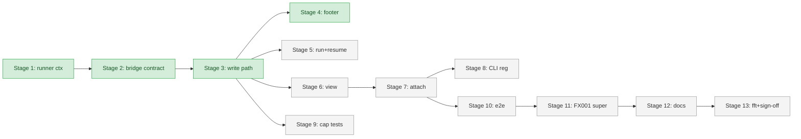

# Flight Plan: Fix FX008 — `minih attach` cross-process read+write TUI

**Fix**: [FX008 dossier](./FX008-minih-attach-cross-process-tui.md)
**Status**: Ready for takeoff
**Depends on**: None (subsumes FX001; workshop 005)

## What → Why

**Problem**: Three coupled UX failures:
1. The AI runs companions/agents headlessly in background; the human in another terminal can `minih view` (read-only) but cannot type to the agent without flipping shells.
2. `run --human` footer input for coordinated agents goes to the SDK conversation channel (silent — bypasses inbox).
3. Lifecycle ownership for any write-mode TUI must encode "Ctrl-C detaches, never kills" once.

**Fix**: New `minih attach <slug>` command + 5-row InputBridge capability table + additive `OnSessionReadyContext` fields. Workshop 005 owns the design; this dossier ships it.

## Domain Context

| Domain | Relationship | What Changes |
|--------|-------------|-------------|
| `cli` | Primary | New `attach.ts`; widened `input-bridge.ts`; migrated `view.ts`/`run.ts`/`resume.ts`; CLI registration; footer rendering |
| `runner` | Secondary (additive) | `OnSessionReadyContext` gains `coordinated`, `agentSlug`; runtime callsite updated |
| `adapter` | None | `SessionSender` semantics unchanged |

## Stages

- [x] **Stage 1: Runner ctx widening** — `OnSessionReadyContext` adds `coordinated` + `agentSlug` (additive); runner.ts callsite passes them. (FX008-1)
- [x] **Stage 2: InputBridge contract widening** — 5-value capability enum; widened `InputBridgeInput` shape including optional `commandName`; capability resolution table. (FX008-2)
- [x] **Stage 3: Coordinated write path** — `submit()` for `'input → inbox'` uses `appendInboxMessage` with proper `CoordinationRunLocation`; subject synthesis helper. (FX008-3)
- [x] **Stage 4: Footer label rendering** — 5 capability strings render in the footer. (FX008-4)
- [ ] **Stage 5: run.ts + resume.ts migration** — thread new ctx fields. (FX008-5, FX008-6)
- [ ] **Stage 6: view.ts migration** — read-only flow, new bridge shape preserved. (FX008-7)
- [ ] **Stage 7: New attach.ts command** — clone view.ts structure with attach-specific bridge wiring. (FX008-8)
- [ ] **Stage 8: CLI registration** — `attach` listed in `--help` with detach-not-kill reminder. (FX008-9)
- [ ] **Stage 9: Tests — capability table coverage** — 5-row capability tests. (FX008-10)
- [ ] **Stage 10: Tests — e2e attach with wake assertion** — gated `MINIH_E2E=1`; asserts agent wakes + PID survives detach. (FX008-11)
- [ ] **Stage 11: FX001 supersession** — header + cross-link in FX001.md. (FX008-12)
- [ ] **Stage 12: Docs** — AGENTS.md companion-mode mention; `--help` text; FX003 how-to (when present). (FX008-13)
- [ ] **Stage 13: `just fft` + companion sign-off** — pipeline clean; companion farewell received. (FX008-14)

## Flight Status

## Checklist

- [x] FX008-1 — runner: `OnSessionReadyContext` + callsite (additive)
- [x] FX008-2 — cli: `InputBridge` 5-value enum + widened input
- [x] FX008-3 — cli: coordinated `submit()` write path
- [x] FX008-4 — cli: footer label rendering
- [ ] FX008-5 — cli: `run.ts` migration
- [ ] FX008-6 — cli: `resume.ts` migration
- [ ] FX008-7 — cli: `view.ts` migration
- [ ] FX008-8 — cli: NEW `attach.ts`
- [ ] FX008-9 — cli: `cli.ts` registration
- [ ] FX008-10 — test: capability table (5 rows)
- [ ] FX008-11 — test: e2e attach with wake assertion
- [ ] FX008-12 — docs: FX001 SUPERSEDED
- [ ] FX008-13 — docs: AGENTS.md + `--help`
- [ ] FX008-14 — verify: `just fft` + companion farewell

## Acceptance

- [ ] In coordinated `--human` run, footer text → outside-lane inbox entry visible to `wait_for_any` inside + `outside inbox list` outside.
- [ ] In non-coordinated `--human` run, footer text → SDK conversation (no regression).
- [ ] `resume --human` exhibits same routing as `run --human`.
- [ ] `minih attach <slug>` mounts TUI; coordinated agents accept footer typing; Ctrl-C detaches without affecting run lifecycle.
- [ ] `view <slug>` continues to work unchanged (read-only).
- [ ] `--help` lists `attach`; `attach --help` includes Ctrl-C reminder.
- [ ] FX001 marked SUPERSEDED with cross-link.
- [ ] Existing input-bridge tests + 5 new capability tests + 1 e2e test pass.
- [ ] `just fft` clean.
