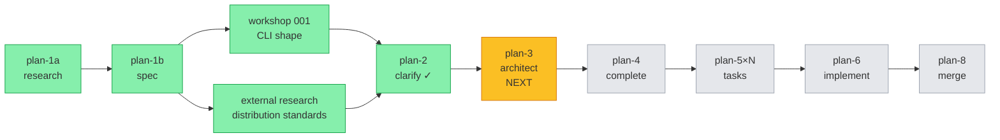
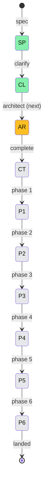

# Flight Plan — Agent Pack Install

**Plan**: `docs/plans/017-agent-pack-install/`
**Spec**: `agent-pack-install-spec.md`
**Mode**: Full
**Complexity**: CS-3 (medium)
**Status**: Specifying → ready for `/plan-3-v2-architect`

---

## Journey Map

---

## Suggested Phases (final shape determined by `/plan-3`)

| # | Phase | Domains | Headline Outcome |
|---|---|---|---|
| 1 | Foundations | runner | Manifest types/schemas, validators, `IAgentPackFetcher` interface + Fake — no real network code yet |
| 2 | Local install path | runner | Install/info/list/remove against fake fetcher; sidecar write + read; atomic swap; preserve runtime dirs |
| 3 | Real fetch | runner | GitHub tarball download + extract; HTTP error handling; 10 MB cap; size + commit-sha display |
| 4 | CLI surface + UX | cli | `agent <verb>` subcommand wiring; `minih list` aliasing; confirmation prompt; flag set; JSON envelope |
| 5 | Registry seed + dogfood | runner + cli | Author `agent.json` for `code-review-companion`; add registry entry; ship in `dist/templates/`; verify end-to-end |
| 6 | Docs + release | docs | AGENTS_README/README updates, `docs/how/agent-pack.md`, changelog, release-please notes |

---

## Flight Status

---

## Phases Table

| Phase | Status | Started | Landed | Notes |
|---|---|---|---|---|
| Specify | ✓ done | 2026-05-03 | 2026-05-03 | research-dossier + workshop + spec authored |
| Clarify | ✓ done | 2026-05-03 | 2026-05-03 | All Q1-Q11 resolved (workshop carried most) |
| Architect | ✓ done | 2026-05-03 | 2026-05-03 | 6-phase plan, 45 tasks, 10 Key Findings, full Validation Record |
| Phase 1 | ✓ done | 2026-05-03 | 2026-05-03 | Foundations shipped (commit `3bcb001`) |
| Phase 2 | ⚠ subsumed | 2026-05-03 | 2026-05-03 | Folded into FX001 + FX002 — no separate phase commit |
| FX001 | ✓ done | 2026-05-03 | 2026-05-03 | Local-path install vertical slice (`a8aa801`) |
| FX002 | ✓ done | 2026-05-03 | 2026-05-03 | `agent info` + `agent list` (`de40459`/`549aa97`) |
| Phase 3 | ✓ done | 2026-05-03 | 2026-05-03 | Real GitHub fetch + tarball extraction (`073b339`) |
| Phase 4 | ⚠ partial | — | — | install/info/list shipped; remove + confirmation prompt + `--check` flags pending (FX003+) |
| Phase 5 | ✓ done | 2026-05-03 | 2026-05-03 | Registry seed + dogfood — `code-review-companion` end-to-end verified live in 1.6s; `agent list --available` wired; T011 follow-up registered |
| Phase 6 | ✓ done | 2026-05-03 | 2026-05-03 | Docs phase shipped — `docs/how/agent-pack.md` (~520 LOC), README "Agent Packs" section, AGENTS.md companion-mode install step, AGENTS_README.md getting-started mention, runner Concepts table refresh; companion review caught F001/F002/F003 (HIGH+HIGH+MEDIUM) doc-vs-code drift + all 3 fixed inline before phase close |

---

## Flight Log

### 2026-05-03 (Phase 6)

- ✅ **Phase 6 dossier generated** via `/plan-5-v2-phase-tasks-and-brief --phase 6` — 6 tasks (T6.1-T6.6); skipped formal validate-v2 sweep (docs-only, low risk; companion review provides equivalent live coverage)
- ✅ Companion booted (run `2026-05-03T16-08-00-909Z-ca43`) using lessons from Phase 5 (`mode: async, detach: true`, no output piping)
- ✅ T6.1 `docs/how/agent-pack.md` authored (~520 LOC) — manifest format, sidecar, security model, error reference, curation, common pitfalls; cross-link to companion-mode.md (no duplication)
- ✅ Companion T6.1 review fired 3 HIGH/MEDIUM findings (catch-rate vindicating Power-On-Mode):
  - F001 HIGH: how-to claimed `--yes` skipped a confirmation prompt — but no prompt exists in v1
  - F002 HIGH: error table claimed E184 was active — no throw site exists; current code returns `upgraded`
  - F003 MEDIUM: manifest guard claims included drive-letter coverage + "before extract" — both inaccurate (drive-letter is tarball-level; tarball extracts to tmp before manifest validation)
- ✅ All 3 findings fixed inline (commit `ab53691`) before continuing
- ✅ T6.2 README "Agent Packs" H2 added after Quick Start (discoverable in first-glance browse)
- ✅ T6.3 AGENTS.md companion-mode preflight now includes `minih agent install code-review-companion` first-time setup
- ✅ T6.4 AGENTS_README.md install/getting-started mentions `agent` subcommand; `dist/AGENTS_README.md` rebuilt + verified byte-identical
- ✅ T6.5 runner Concepts table — refreshed agent-pack-install entry (was P3 stub) + new "Bundled agent registry" entry covering catalog read + slug resolution + curation principle
- ✅ T6.6 plan progress + flight log + final commit hygiene
- ⏭ Next: PR `007-backgrounding` → `main` to ship plan 017; FX003 post-merge follow-up; Phase 4 remainder as fix dossiers

### 2026-05-03 (Phase 5)

- ✅ **Phase 5 dossier generated** via `/plan-5-v2-phase-tasks-and-brief --phase 5` — T001-T011 (10 tasks; T002b + T009b inserted by validation)
- ✅ Validate-v2 broad sweep — 4 parallel agents (Source-Truth, Cross-Ref, Completeness, Forward-Compat) — 2 HIGH + 6 MEDIUM fixes applied inline; Forward-Compatibility Matrix shows all consumers green
- ✅ Companion booted (run `2026-05-03T15-04-50-212Z-e6ee`) but went silent after orient — fell back to no-companion mode mid-phase per plan-6-companion fallback protocol
- ✅ T001 audit: prompt.md soft-edit on minih-internal drift-audit reference (graceful degradation for non-minih projects)
- ✅ T002 + T002b: canonical `code-review-companion/agent.json` (4 files, manifestVersion `0.1.0`, tags `[companion, review, coordination, exemplar, quality]`) + 9 unit tests guarding the load-bearing security gate
- ✅ T003: local-install round-trip verified (install → info → re-install no-op) against existing built CLI
- ✅ T004 + T005 + T006: bundled registry catalog with 1 curated entry; `scripts/copy-schemas.js` extension; `dist/templates/agents-registry.json` byte-identical with source; `agent list --available` wired (was deferred from Phase 4)
- ✅ T007: registry-seed unit tests (8 cases) including explicit curation-gate assertion ("smoke-test", "convention-check", etc. MUST NOT be in catalog)
- ✅ T008: MINIH_E2E headline e2e — `code-review-companion` installed live from real GitHub in **1.6s wall-clock** (well within spec AC1's 5s soft budget)
- ✅ T009: MINIH_REGRESSION baseline + dedupe assertion via `toMatchInlineSnapshot()`
- ✅ T009b: Spec AC11 self-install regression — E183 collision when target slug already exists; `--as` escape hatch verified
- ✅ T010: Domain.md history rows for runner + cli; Phase Index → ✅
- ✅ T011: Post-merge follow-up registered (FX003 stub for `MINIH_E2E_PREMERGE` flip + `outside.md` authoring)
- ⏭ Next: `/plan-7-v2-code-review --phase 5 --plan ...` (replaces companion review since companion died) → then `/plan-5-v2-phase-tasks-and-brief --phase 6` (docs)

### 2026-05-03 (Phase 3)

- ✅ Research dossier written (~31 KB) — codebase context, prior plans, foundations confirmed
- ✅ External research note: 6 competing standards surveyed; Claude Code Plugin Marketplaces selected as conceptual model
- ✅ Workshop 001 (CLI shape) — verb list, manifest format, registry distribution model all converged
- ✅ Spec authored with 15 acceptance criteria + Mode: Full + Hybrid testing approach + Hybrid docs strategy
- ✅ Clarify session — Q1-Q6 + spec Q2-Q11 all resolved
- ✅ Plan 3 (architect) — 6 phases, 45 tasks, 10 Key Findings, 11/12 lens validation, all HIGH addressed
- ✅ Plan 5 (Phase 1 dossier) — 8 tasks, 74-test scope, 9/12 lens validation, both HIGHs addressed
- ✅ **Phase 1 implementation shipped** — `src/runner/agent-pack/` (7 files, ~1300 LOC), 74 new tests green, `just fft` green, domain.md updated for runner + cli
- ⏭ Next: `/plan-5-v2-phase-tasks-and-brief --phase "Phase 2: ..."` to expand Phase 2 dossier

---

## Open Questions / Watchpoints

- **R2 deepresearch (tarball extraction in modern Node)** — not yet executed; recommend before architect to inform dependency choice (`tar-stream` vs hand-rolled)
- **Workshop 002 candidates** — atomic-swap algorithm, manifest schema evolution, registry promotion process. None block plan-3 but architect may surface a need for one or two.
- **First HTTP code in repo** — `IAgentPackFetcher` injection seam is the load-bearing test design choice; architect should validate.
