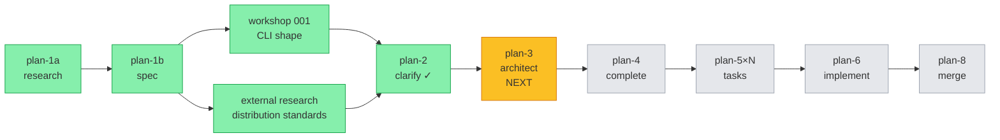
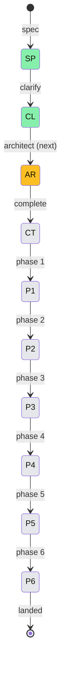

# Flight Plan — Agent Pack Install

**Plan**: `docs/plans/017-agent-pack-install/`
**Spec**: `agent-pack-install-spec.md`
**Mode**: Full
**Complexity**: CS-3 (medium)
**Status**: Specifying → ready for `/plan-3-v2-architect`

---

## Journey Map

---

## Suggested Phases (final shape determined by `/plan-3`)

| # | Phase | Domains | Headline Outcome |
|---|---|---|---|
| 1 | Foundations | runner | Manifest types/schemas, validators, `IAgentPackFetcher` interface + Fake — no real network code yet |
| 2 | Local install path | runner | Install/info/list/remove against fake fetcher; sidecar write + read; atomic swap; preserve runtime dirs |
| 3 | Real fetch | runner | GitHub tarball download + extract; HTTP error handling; 10 MB cap; size + commit-sha display |
| 4 | CLI surface + UX | cli | `agent <verb>` subcommand wiring; `minih list` aliasing; confirmation prompt; flag set; JSON envelope |
| 5 | Registry seed + dogfood | runner + cli | Author `agent.json` for `code-review-companion`; add registry entry; ship in `dist/templates/`; verify end-to-end |
| 6 | Docs + release | docs | AGENTS_README/README updates, `docs/how/agent-pack.md`, changelog, release-please notes |

---

## Flight Status

---

## Phases Table

| Phase | Status | Started | Landed | Notes |
|---|---|---|---|---|
| Specify | ✓ done | 2026-05-03 | 2026-05-03 | research-dossier + workshop + spec authored |
| Clarify | ✓ done | 2026-05-03 | 2026-05-03 | All Q1-Q11 resolved (workshop carried most) |
| Architect | ✓ done | 2026-05-03 | 2026-05-03 | 6-phase plan, 45 tasks, 10 Key Findings, full Validation Record |
| Phase 1 | ✓ done | 2026-05-03 | 2026-05-03 | Foundations shipped — 74 new tests, just fft green; types + manifest + registry + sidecar + url + fetcher seam + re-exports + E180-E184 |
| Phase 2 | ⏭ next | — | — | Local install path (FakeAgentPackFetcher) |

---

## Flight Log

### 2026-05-03

- ✅ Research dossier written (~31 KB) — codebase context, prior plans, foundations confirmed
- ✅ External research note: 6 competing standards surveyed; Claude Code Plugin Marketplaces selected as conceptual model
- ✅ Workshop 001 (CLI shape) — verb list, manifest format, registry distribution model all converged
- ✅ Spec authored with 15 acceptance criteria + Mode: Full + Hybrid testing approach + Hybrid docs strategy
- ✅ Clarify session — Q1-Q6 + spec Q2-Q11 all resolved
- ✅ Plan 3 (architect) — 6 phases, 45 tasks, 10 Key Findings, 11/12 lens validation, all HIGH addressed
- ✅ Plan 5 (Phase 1 dossier) — 8 tasks, 74-test scope, 9/12 lens validation, both HIGHs addressed
- ✅ **Phase 1 implementation shipped** — `src/runner/agent-pack/` (7 files, ~1300 LOC), 74 new tests green, `just fft` green, domain.md updated for runner + cli
- ⏭ Next: `/plan-5-v2-phase-tasks-and-brief --phase "Phase 2: ..."` to expand Phase 2 dossier

---

## Open Questions / Watchpoints

- **R2 deepresearch (tarball extraction in modern Node)** — not yet executed; recommend before architect to inform dependency choice (`tar-stream` vs hand-rolled)
- **Workshop 002 candidates** — atomic-swap algorithm, manifest schema evolution, registry promotion process. None block plan-3 but architect may surface a need for one or two.
- **First HTTP code in repo** — `IAgentPackFetcher` injection seam is the load-bearing test design choice; architect should validate.
