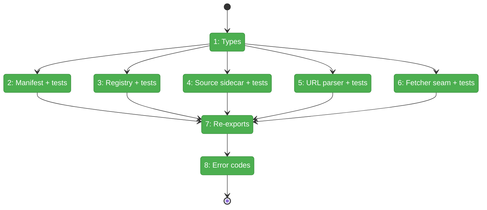
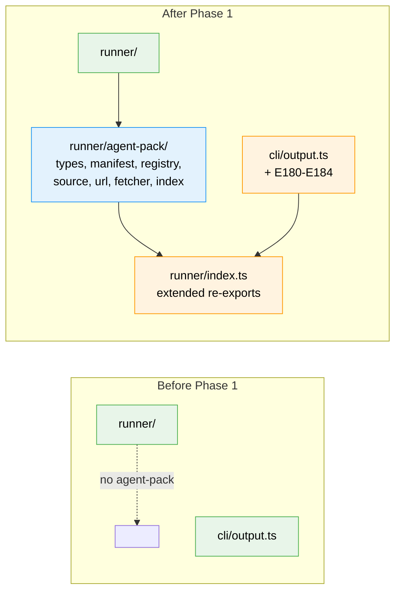

# Flight Plan: Phase 1 — Foundations

**Plan**: [`../../agent-pack-install-plan.md`](../../agent-pack-install-plan.md)
**Phase**: Phase 1: Foundations — types, manifest, registry, source sidecar, fetcher seam
**Generated**: 2026-05-03
**Status**: Landed

---

## Departure → Destination

**Where we are**: minih has no `agent-pack/` module. CLI surface has no `agent` subcommand. No remote-fetch code. No on-disk formats for `agent.json` / `agents-registry.json` / `.minih-source.json`. Error codes E180-E184 unallocated.

**Where we're going**: `src/runner/agent-pack/` exists with 7 files (types, manifest, registry, source, url, fetcher, index). Public surface is exported via `runner/index.ts`. `IAgentPackFetcher` injection seam works (verified by `FakeAgentPackFetcher` tests). All path-safety + manifest validation is enforced. Error codes E180-E184 wired in. Phase 2 can consume the seam without rework.

---

## Domain Context

### Domains We're Changing

| Domain | What Changes | Key Files |
|---|---|---|
| `runner` | New internal sub-module `agent-pack/` (7 files) + re-exports from `runner/index.ts` | `src/runner/agent-pack/{types,manifest,registry,source,url,fetcher,index}.ts`, `src/runner/index.ts` |
| `cli` | Add error codes E180-E184 to existing `ErrorCodes` const (pure additive) | `src/cli/output.ts` |

### Domains We Depend On (no changes)

| Domain | What We Consume | Contract |
|---|---|---|
| (Node stdlib) | `node:fs`, `node:path`, `node:crypto` | Standard |

No imports from `mcp` or `adapter`. Cross-domain direction (`cli → runner`) preserved.

---

## Flight Status

<!-- Updated by /plan-6-v2: pending → active → done. Use blocked for problems/input needed. -->

**Legend**: grey = pending | yellow = active | red = blocked/needs input | green = done

---

## Stages

<!-- Updated by /plan-6-v2 during implementation: [ ] → [~] → [x] -->

- [x] **Stage 1: Define public types** — central type surface for the whole module (`src/runner/agent-pack/types.ts` — new file)
- [x] **Stage 2: Manifest validator + denylist** — TDD-first; covers path traversal, runtime-dir, missing prompt.md (`src/runner/agent-pack/manifest.ts` — new file)
- [x] **Stage 3: Registry catalog reader** — read `dist/templates/agents-registry.json`; Levenshtein "did you mean" (`src/runner/agent-pack/registry.ts` — new file)
- [x] **Stage 4: Source sidecar r/w + checksums** — `.minih-source.json` round-trip with sha256 checksums (`src/runner/agent-pack/source.ts` — new file)
- [x] **Stage 5: URL parser** — npm-style `github:` shorthand + HTTPS + flag; canonical re-render (`src/runner/agent-pack/url.ts` — new file)
- [x] **Stage 6: Fetcher seam** — `IAgentPackFetcher` interface + `FakeAgentPackFetcher` + `GitHubAgentPackFetcher` stub (`src/runner/agent-pack/fetcher.ts` — new file)
- [x] **Stage 7: Re-exports** — `agent-pack/index.ts` barrel + extend `runner/index.ts` (`src/runner/agent-pack/index.ts` — new; `src/runner/index.ts` — modified)
- [x] **Stage 8: Error codes E180-E184** — extend `ErrorCodes` const + docblock (`src/cli/output.ts` — modified)

---

## Architecture: Before & After

**Legend**: existing (green, unchanged) | changed (orange, modified) | new (blue, created)

---

## Acceptance Criteria

- [ ] All Phase 1 unit tests pass (T002, T003, T004, T005, T006 = 40+ test cases collectively)
- [ ] `npm run build` clean (TS strict mode)
- [ ] `just fft` green
- [ ] No imports from `cli/`, `mcp/`, or `adapter/` into `runner/agent-pack/` (domain direction holds — verified by code-review)
- [ ] `IAgentPackFetcher` interface stable enough that Phase 2 can build against it without changes (forward-compat verified by code-review against `agent-pack-install-plan.md` Phase 2 task 2.1)
- [ ] No new external dependencies added (deferred to Phase 3 if `tar-stream` is needed)

## Goals & Non-Goals

**Goals**:
- Stable type surface (`AgentPackManifest`, `AgentPackSource`, `MinihSourceSidecar`, `RegistryEntry`, `RegistryCatalog`, `InstallAction`, `ParsedAgentUrl`)
- Manifest validator enforces every named attack vector
- Registry reader resolves slugs with helpful "did you mean" hints
- Source sidecar round-trips deterministically
- URL parser handles all three accepted syntaxes; canonical re-render
- Fetcher injection seam works for Phase 2 tests
- Error codes E180-E184 allocated

**Non-Goals**:
- Real `fetch()` against GitHub (Phase 3.2)
- Tarball extraction (Phase 3.3)
- Install/upgrade/remove orchestration (Phase 2)
- CLI command surface (Phase 4)
- Authoring `agents/code-review-companion/agent.json` (Phase 5.1)

---

## Checklist

- [x] T001: Create `src/runner/agent-pack/types.ts` with all public type definitions
- [x] T002: TDD `manifest.ts` — validation, denylist, implicit-manifest fallback
- [x] T003: TDD `registry.ts` — catalog reader + Levenshtein hints
- [x] T004: TDD `source.ts` — sidecar r/w + sha256 checksums
- [x] T005: TDD `url.ts` — npm-style + HTTPS + flag forms
- [x] T006: TDD `fetcher.ts` — `IAgentPackFetcher` + Fake + real impl stub
- [x] T007: Re-exports — `agent-pack/index.ts` + `runner/index.ts` extension
- [x] T008: Error codes E180-E184 in `cli/output.ts`
