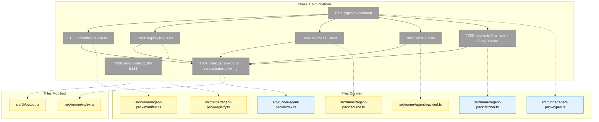
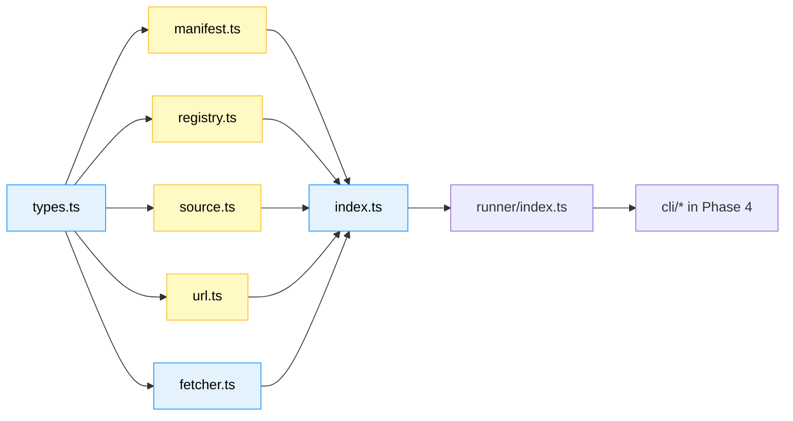
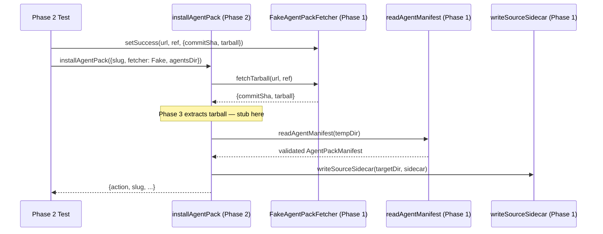

# Phase 1: Foundations — types, manifest, registry, source sidecar, fetcher seam

**Plan**: [`agent-pack-install-plan.md`](../../agent-pack-install-plan.md)
**Phase**: Phase 1 (no prior phases)
**Status**: Ready for implementation
**Generated**: 2026-05-03

---

## Executive Briefing

**Purpose**: Lay the read-only + interface foundations for agent-pack so Phase 2 (local install path) and Phase 3 (real fetch) can build on a stable, testable seam without rework. **No CLI surface, no real network code, no install behavior** in this phase — those come later.

**What We're Building**: A new `src/runner/agent-pack/` sub-module containing types, the manifest reader/validator (`agent.json`), the registry catalog reader (`agents-registry.json`), the source sidecar reader/writer (`.minih-source.json`), the URL parser (npm-style `github:` shorthand + HTTPS + flag forms), and the `IAgentPackFetcher` injection interface with a working `FakeAgentPackFetcher`. Plus error codes E180-E184 in `src/cli/output.ts`.

**Goals**:
- ✅ All new types compile cleanly with strict TS
- ✅ `agent.json` validation rejects every named attack vector (path traversal, runtime-dir, null bytes, leading slash, missing `prompt.md`)
- ✅ Registry reader resolves slugs and returns Levenshtein "did you mean" hints for typos
- ✅ Source sidecar round-trips (write → read → equal); checksums are deterministic
- ✅ `IAgentPackFetcher` interface is stable and consumable via `runner/index.ts` re-exports
- ✅ `FakeAgentPackFetcher` works for Phase 2 install tests
- ✅ URL parser handles all three accepted syntaxes; canonical re-render is deterministic
- ✅ Error codes E180-E184 wired into `ErrorCodes` const

**Non-Goals**:
- ❌ Real `fetch()` against GitHub (Phase 3.2)
- ❌ Tarball extraction (Phase 3.3)
- ❌ Install/upgrade/remove orchestration (Phase 2)
- ❌ CLI command surface (Phase 4)
- ❌ Authoring `agents/code-review-companion/agent.json` (Phase 5.1)

---

## Pre-Implementation Check

| File | Exists? | Domain | Action | Notes |
|---|---|---|---|---|
| `src/runner/agent-pack/types.ts` | NO (directory `src/runner/agent-pack/` does not exist yet) | runner | CREATE | Contract file — public type surface |
| `src/runner/agent-pack/manifest.ts` | NO | runner | CREATE | Internal — validation logic |
| `src/runner/agent-pack/registry.ts` | NO | runner | CREATE | Internal — catalog reader |
| `src/runner/agent-pack/source.ts` | NO | runner | CREATE | Internal — sidecar r/w |
| `src/runner/agent-pack/fetcher.ts` | NO | runner | CREATE | Contract (interface) + internal (Fake) — see Comp-LOW deferral note: split or document the dual role |
| `src/runner/agent-pack/url.ts` | NO | runner | CREATE | Internal — URL parser |
| `src/runner/agent-pack/index.ts` | NO | runner | CREATE | Contract — re-exports public surface |
| `src/runner/index.ts` | YES | runner | MODIFY | Add re-exports from `agent-pack/index.ts` |
| `src/cli/output.ts` | YES | cli | MODIFY — add **NEW** error codes E180-E184 (codes do not exist in source today; T008 creates them) | Existing `ErrorCodes` const currently caps at `E171` |
| `test/runner/agent-pack/manifest.test.ts` | NO | runner (test) | CREATE | TDD |
| `test/runner/agent-pack/registry.test.ts` | NO | runner (test) | CREATE | TDD |
| `test/runner/agent-pack/source.test.ts` | NO | runner (test) | CREATE | TDD |
| `test/runner/agent-pack/fetcher.test.ts` | NO | runner (test) | CREATE | TDD — Fake covered |
| `test/runner/agent-pack/url.test.ts` | NO | runner (test) | CREATE | TDD |

**Concept search check**: ran searches for `IAgentPackFetcher`, `agent-pack`, `agents-registry` — no existing implementation found. Inspirational patterns (to mirror, not duplicate):
- `IAgentAdapter` / `FakeAgentAdapter` at `src/adapter/interface.ts` and `src/adapter/fake.ts` — model for the fetcher seam
- `validateSlug` at `src/runner/folder.ts:29` — model for path-safety validation in `manifest.ts`
- `levenshtein()` at `src/runner/validator.ts:17` — model for "did you mean" in `registry.ts` (consider extracting to a shared util, OR copy if too small to share)
- `parseFrontmatter` at `src/runner/folder.ts:232` — model for sidecar JSON parsing approach

**Harness check**: No `docs/project-rules/harness.md` exists. No agent harness — implementation will use standard testing only (Hybrid TDD per spec § Testing Strategy).

---

## Architecture Map



---

## Tasks

| Status | ID | Task | Domain | Path(s) | Done When | Notes |
|---|---|---|---|---|---|---|
| [x] | T001 | Create `src/runner/agent-pack/types.ts` defining: `AgentPackManifest` (with `name`, `version`, `description`, `author`, `tags?`, `type?`, `minihVersion?`, `files: Array<{path: string; description: string}>`), `AgentPackSource` (with `type: 'registry' \| 'url'; url; ref; subpath?; commitSha; registrySlug?`), `MinihSourceSidecar` (with `schemaVersion: '1'; slug; source; installedAt; manifestVersion; fileChecksums: Record<string,string>`), `RegistryEntry` (with `slug; url; ref; subpath?; description; tags?; since?; minihVersion?`), `RegistryCatalog` (with `version: '1'; agents: RegistryEntry[]`), `InstallAction = 'installed' \| 'upgraded' \| 'unchanged' \| 'removed'`, `ParsedAgentUrl` (discriminated union by `type`). | runner | `/Users/jordanknight/substrate/minih/src/runner/agent-pack/types.ts` | `npm run build` passes; types exported and consumable via `import { AgentPackManifest, ... } from './types.js'` | Workshop 001 schema; spec § Clarifications Q5/Q8; Plan Finding 05 (sidecar versioning) |
| [x] | T002 | TDD: Write `test/runner/agent-pack/manifest.test.ts` covering: (1) happy path — valid manifest with all fields parses; (2) missing `prompt.md` in `files[]` → reject; (3) path with `..` → reject; (4) path with leading `/` → reject; (5) path with null byte → reject; (6) path starting with `runs/`/`inbox/`/`state/`/`.git/` → reject; (7) absolute path → reject; (8) duplicate paths in `files[]` → reject; (9) non-string description → reject; (10) frontmatter without `name`/`version`/`description` → reject. THEN implement `src/runner/agent-pack/manifest.ts` exporting: `readAgentManifest(agentDir: string): AgentPackManifest \| null` (returns null if no agent.json), `validateManifest(manifest: unknown): ValidationResult` (returns `{ok: true; manifest} \| {ok: false; errors: string[]}`), `synthesizeImplicitManifest(agentDir: string): AgentPackManifest` (canonical-files convention fallback). All file path checks use the same denylist constants as the extractor will (export them for Phase 3.3 reuse). | runner | `/Users/jordanknight/substrate/minih/src/runner/agent-pack/manifest.ts`, `/Users/jordanknight/substrate/minih/test/runner/agent-pack/manifest.test.ts` | All 10+ test cases green; `prompt.md` enforcement covered; runtime-dir denylist tested explicitly | Plan Finding 03 (path-traversal); spec AC5, AC6, AC7 |
| [x] | T003 | TDD: Write `test/runner/agent-pack/registry.test.ts` covering: (1) read valid catalog; (2) catalog missing → return empty list; (3) catalog with unknown `version` → loud error; (4) slug hit returns full entry; (5) slug miss with no near match → return `null` + empty hints; (6) slug miss with one near match (Levenshtein ≤2) → return `null` + 1 hint; (7) slug miss with multiple near matches → return up to 3 hints; (8) malformed catalog JSON → loud error. THEN implement `src/runner/agent-pack/registry.ts` exporting: `readRegistryCatalog(): RegistryCatalog`, `resolveRegistrySlug(slug: string, catalog?: RegistryCatalog): {entry: RegistryEntry; suggestions?: string[]} \| {entry: null; suggestions: string[]}`, `listRegistryAgents(catalog?: RegistryCatalog): RegistryEntry[]`. Read catalog from `dist/templates/agents-registry.json` via `fileURLToPath(new URL('../../templates/agents-registry.json', import.meta.url))` (matches `init.ts:160`). Levenshtein helper: extract from `src/runner/validator.ts:17` to a small shared util `src/runner/agent-pack/levenshtein.ts` OR inline if cheaper (decide during implementation; either is fine). | runner | `/Users/jordanknight/substrate/minih/src/runner/agent-pack/registry.ts`, `/Users/jordanknight/substrate/minih/test/runner/agent-pack/registry.test.ts` | All 8 cases green; `version: "1"` parsing works; tolerant of unknown fields (forward-compat per Plan Risk row) | Plan Finding 06 (curation); Plan-Level Risk: registry shape drift — `version` field tested |
| [x] | T004 | TDD: Write `test/runner/agent-pack/source.test.ts` covering: (1) round-trip: write sidecar → read sidecar → deep equal; (2) checksum compute is deterministic across runs; (3) checksum compute uses sha256 + hex; (4) `verifyChecksums` returns per-file `'unchanged'`/`'modified'`/`'missing'`; (5) write into a non-existent agentDir → throws clean error; (6) read from agentDir without sidecar → returns `null`; (7) sidecar with unknown fields preserved on read; (8) sidecar with missing required field → loud error. THEN implement `src/runner/agent-pack/source.ts` exporting: `readSourceSidecar(agentDir: string): MinihSourceSidecar \| null`, `writeSourceSidecar(agentDir: string, sidecar: MinihSourceSidecar): void`, `computeFileChecksums(agentDir: string, files: string[]): Record<string,string>` (uses `crypto.createHash('sha256')`), `verifyChecksums(agentDir: string, expected: Record<string,string>): Record<string, 'unchanged' \| 'modified' \| 'missing'>`. Sidecar location: `<agentDir>/.minih-source.json`. | runner | `/Users/jordanknight/substrate/minih/src/runner/agent-pack/source.ts`, `/Users/jordanknight/substrate/minih/test/runner/agent-pack/source.test.ts` | All 8 cases green; round-trip pure; checksum determinism stable across multiple runs | Plan Finding 05 (schema evolution); Workshop 001 sidecar shape |
| [x] | T005 | TDD: Write `test/runner/agent-pack/url.test.ts` covering each accepted syntax form: (1) `github:owner/repo` (defaults: ref=`main`, subpath=`null`); (2) `github:owner/repo#ref`; (3) `github:owner/repo#ref:subpath`; (4) `github:owner/repo:subpath` (no ref); (5) `https://github.com/owner/repo`; (6) `https://github.com/owner/repo#ref:subpath`; (7) HTTPS with `?path=` query string; (8) bare slug → reject (not a URL); (9) malformed `github:` (missing repo) → reject; (10) `..` in subpath → reject; (11) canonical re-render: parse → render → re-parse equals original; (12) when `--subpath` flag is provided, override URL fragment. THEN implement `src/runner/agent-pack/url.ts` exporting: `parseAgentUrl(input: string, opts?: {subpathOverride?: string}): ParsedAgentUrl`, `renderAgentUrlCanonical(parsed: ParsedAgentUrl): string`. Canonical form is npm-style `github:owner/repo#ref:subpath` per workshop. | runner | `/Users/jordanknight/substrate/minih/src/runner/agent-pack/url.ts`, `/Users/jordanknight/substrate/minih/test/runner/agent-pack/url.test.ts` | All 12+ cases green; npm-style is canonical; canonical re-render is identity on round-trip | Spec § Clarifications Q8 (all three syntaxes accepted; npm-style canonical) |
| [x] | T006 | TDD: Write `test/runner/agent-pack/fetcher.test.ts` covering `FakeAgentPackFetcher`: (1) preset `(url, ref) → {commitSha, tarball}` returns the preset tuple; (2) call recorded for assertion (`callHistory`); (3) `(url, ref)` not preset → reject with descriptive error mentioning the missing key; (4) Fake supports overriding return per call (for retry/upgrade simulations); (5) call counter incrementable; (6) helper `setSuccess(url, ref, opts)` and `setFailure(url, ref, err)`. THEN implement `src/runner/agent-pack/fetcher.ts` exporting: `interface IAgentPackFetcher { fetchTarball(url: string, ref: string): Promise<{commitSha: string; tarball: Buffer}> }`, `class FakeAgentPackFetcher implements IAgentPackFetcher { ... }`, AND a stub `class GitHubAgentPackFetcher implements IAgentPackFetcher { fetchTarball() { throw new Error('not implemented in Phase 1; see Phase 3.2') } }` — keep the class declared so consumers can name the type, but bodies are placeholders. The `IAgentPackFetcher` contract is the load-bearing forward-compat surface; do not introduce extra methods (keep it minimal). | runner | `/Users/jordanknight/substrate/minih/src/runner/agent-pack/fetcher.ts`, `/Users/jordanknight/substrate/minih/test/runner/agent-pack/fetcher.test.ts` | Fake passes 6 cases; real impl stub compiles + throws on call | Plan Finding 01 (test seam); Plan-Level Risk: interface churn — Phase 2 will compile against this contract before Phase 1 is "done" |
| [x] | T007 | Wire re-exports: create `src/runner/agent-pack/index.ts` exporting all public types from `types.ts`, the public functions from `manifest.ts`/`registry.ts`/`source.ts`/`url.ts`, and `IAgentPackFetcher` + `FakeAgentPackFetcher` + `GitHubAgentPackFetcher` from `fetcher.ts`. THEN extend `src/runner/index.ts` to re-export from `./agent-pack/index.js` so `cli` (and tests outside the runner domain) can import via `import { AgentPackManifest, IAgentPackFetcher, ... } from '../../runner/index.js'`. | runner | `/Users/jordanknight/substrate/minih/src/runner/agent-pack/index.ts`, `/Users/jordanknight/substrate/minih/src/runner/index.ts` | `import { IAgentPackFetcher } from '../../runner/index.js'` works in a consumer test file; `npm run build` clean | Plan domain manifest classification; cross-domain consumption pattern |
| [x] | T008 | Add error codes E180-E184 to `src/cli/output.ts`'s `ErrorCodes` const: `AGENT_PACK_REGISTRY_MISS = 'E180'`, `AGENT_PACK_FETCH_FAILED = 'E181'`, `AGENT_PACK_INVALID = 'E182'`, `AGENT_PACK_ALREADY_INSTALLED = 'E183'`, `AGENT_PACK_SOURCE_MISMATCH = 'E184'`. Update the docblock at the top of `output.ts` (the `*   E... ...` comment list) accordingly. | cli | `/Users/jordanknight/substrate/minih/src/cli/output.ts` | All 5 codes exported as members of `ErrorCodes`; TypeScript const assertion preserved; docblock current | Spec § Errors table (all 5 codes); foundational for Phase 2-4 use |

**Pre-completion verification** (run before marking phase done):
- `just fft` (full quality gate) green — required before any commit
- `npx vitest run test/runner/agent-pack/` — all phase-1 tests green
- `npm run build` produces no new errors
- No imports from `cli` or `mcp` into `runner/agent-pack/` (domain direction holds)
- `npx tsc --noEmit` clean

---

## Context Brief

### Key findings from plan

- **Finding 01** (Critical) — first HTTP code in src/. Phase 1 establishes `IAgentPackFetcher` injection seam (T006). All Phase 2 install tests bind to the Fake; real `fetch()` happens in Phase 3.2.
- **Finding 03** (High) — manifest path-traversal & runtime-dir tampering. T002 enforces the denylist BEFORE any file is written. Constants exported so the extractor (Phase 3.3) reuses them.
- **Finding 05** (High) — `.minih-source.json` schema evolution. T004 bakes in `schemaVersion: "1"` from day 1; reader tolerates unknown fields (forward-compat); validator refuses unknown `schemaVersion`.
- **Finding 06** (High) — registry is curation gate. T003 ensures install only resolves slugs through the registry; the source repo's `agents/` directory is never auto-scanned. Tests cover the "internal-only slug" case (registry miss).
- **Plan-Level Risk** — `IAgentPackFetcher` interface churn between Phase 1 and Phase 4. Mitigation: T006 keeps the interface minimal; Phase 2 task 2.1 will compile against it before Phase 1 is declared "done" (compile-time consumer test, no extra methods sneaking in).

### Domain dependencies (consumed)

- `runner/folder.ts` (existing) — pattern reference for `validateSlug` and error class style; do NOT call directly (no behavioral coupling). Constants and patterns mirrored not imported.
- `runner/validator.ts:17` — `levenshtein()` helper. Either: (a) extract to shared util `src/runner/agent-pack/levenshtein.ts` and re-export from both consumers, OR (b) copy inline (it's ~20 lines). Decide based on whether the existing one's semantics match. Acceptable to defer to a follow-up if it's not blocking.
- `node:fs`, `node:path`, `node:crypto` — standard.

### Domain constraints

- `agent-pack/` is an internal sub-module of `runner`. No imports from `cli/`, `mcp/`, or `adapter/`. (`runner` → `adapter` is allowed; `agent-pack/` does not need adapter.)
- `runner/index.ts` re-exports the public surface; cross-domain consumers (cli) import from there.
- `IAgentPackFetcher` is a public **contract** (T006) — treat its shape as a versioned commitment for the duration of v1.

### Reusable from prior phases

None — this is Phase 1.

### Forward dependencies (what Phase 2-3 will consume)

- T001 (types.ts): all type names. Phase 2 build will fail loudly if any rename.
- T002 (manifest validation): used by Phase 2's install orchestration to validate fetched manifests; runtime-dir denylist constants reused by Phase 3.3 extractor.
- T003 (registry.resolveRegistrySlug): used by Phase 2 install entry point.
- T004 (source.write/read/verify): used by Phase 2 install (write on success) and `agent info` (read for display).
- T005 (url.parseAgentUrl): used by Phase 4 CLI command for argument parsing.
- T006 (IAgentPackFetcher): Phase 2 install accepts injected fetcher; Phase 3.2 fills the real impl; Phase 4 CLI wires the composition.
- T008 (error codes): used everywhere in Phases 2-4.

### Mermaid: data flow inside Phase 1



### Mermaid: how Phase 2 will consume the seam



### AC ↔ Task trace (Phase 1 contributions)

Phase 1 contributes foundations consumed by later phases. Direct AC verification by Phase 1 tasks:

| Spec AC | Verifying Phase 1 Task(s) | Notes |
|---|---|---|
| AC5 (manifest with arbitrary extras) | T001 (types), T002 (validation reads `files[]`) | Full verification at Phase 4.4 (info display) |
| AC6 (implicit-manifest fallback) | T002 (`synthesizeImplicitManifest`) | Full verification at Phase 2.8 |
| AC7 (path-traversal & runtime-dir defense) | T002 (denylist + traversal rejection) | Full verification at Phase 3.3 (extractor) |
| AC12 (registry curation enforced) | T003 (registry-only resolution; tests cover internal-slug miss) | Full verification at Phase 4 (CLI surface) |

ACs 1, 2, 3, 4, 8, 9, 10, 11, 13, 14, 15 are not directly verified by Phase 1 — they require Phase 2+ orchestration. Phase 1 provides the seams.

---

## Discoveries & Learnings

_Populated during implementation by plan-6._

| Date | Task | Type | Discovery | Resolution | References |
|---|---|---|---|---|---|

**Types**: `gotcha` | `research-needed` | `unexpected-behavior` | `workaround` | `decision` | `debt` | `insight`

---

## Directory layout

```
docs/plans/017-agent-pack-install/
├── agent-pack-install-plan.md
├── agent-pack-install-spec.md
├── agent-pack-install.fltplan.md
├── research-dossier.md
├── workshops/
│   └── 001-cli-shape.md
├── external-research/
│   └── distribution-standards.md
└── tasks/
    └── phase-1-foundations/
        ├── tasks.md            ← THIS FILE
        ├── tasks.fltplan.md    ← generated next
        └── execution.log.md    ← created by plan-6
```

---

**Next step**: Run `/plan-6-v2-implement-phase-companion --phase "Phase 1: Foundations" --plan "/Users/jordanknight/substrate/minih/docs/plans/017-agent-pack-install/agent-pack-install-plan.md"` to begin implementation with companion review.

---

## Validation Record (2026-05-03)

`/validate-v2` ran 4 parallel validators against this dossier. Lens coverage: 9/12 (above 8-floor; only Performance/Scale, Deployment/Ops, Concept Documentation partially uncovered — Performance is N/A for tasks dossier).

| Agent | Lenses Covered | Issues | Verdict |
|---|---|---|---|
| Source-truth | Hidden Assumptions, Concept Documentation | 2 HIGH (1 fixed, 1 false-positive clarified), 1 LOW fixed | ⚠️ → ✅ |
| Cross-reference | Integration & Ripple, Domain Boundaries | 0 | ✅ PASS |
| Completeness | Edge Cases & Failures, Security & Privacy, Hidden Assumptions | 3 MEDIUM **OPEN**, 2 LOW **OPEN** | ⚠️ |
| Forward-Compatibility | Forward-Compatibility, Technical Constraints, User Experience | 0 | ✅ PASS |

### Forward-Compatibility Matrix

| Consumer | Requirement | Failure Mode | Verdict | Evidence |
|----------|-------------|--------------|---------|----------|
| Phase 2 dossier | stable types from T001 + `validateManifest`/sidecar/checksum/fetcher seam | shape mismatch | ✅ | tasks.md T001+T002+T004+T006 + plan Phase 2 task table |
| Phase 3 dossier | denylist constants reusable; `GitHubAgentPackFetcher` stub contract | encapsulation lockout | ✅ | tasks.md T002 explicitly exports denylist for Phase 3.3; T006 declares stub class |
| Phase 4 dossier | URL parser + error codes + runner re-exports | contract drift | ✅ | tasks.md T005, T007, T008 provide all three |
| plan-6 implementer | concrete deliverables, paths, tests, success criteria | test boundary | ✅ | tasks.md T001-T008 each have absolute paths + concrete success criteria |

**Outcome alignment**: "With `minih agent install code-review-companion`, adoption becomes one command. The harness becomes shareable, which is how velocity compounds across teams." — Phase 1 structurally advances that outcome by stabilizing the seams Phase 2-5 need.

**Standalone?**: No — Phase 2 dossier is the immediate next-phase consumer, plus 3 other named consumers.

### Fixes applied (HIGH × 2 → addressed; LOW × 1 fixed)

| ID | Source | Disposition |
|---|---|---|
| ST-H1 | Source-truth: `validateSlug` cited at `:23`, actually `:29` | **FIXED** — line number corrected to `:29` |
| ST-H2 | Source-truth: E180-E184 "don't exist in source" | **CLARIFIED** — false positive (T008 IS the task that creates them); pre-impl table now reads "MODIFY — add **NEW** error codes E180-E184 (codes do not exist in source today; T008 creates them)" |
| ST-L1 | Source-truth: dossier assumes `src/runner/agent-pack/` exists conceptually | **FIXED** — pre-impl table T001 row now explicitly notes the directory is absent today |

### Open (deferred per user directive "fix all HIGH" — surface for follow-up)

| ID | Severity | Source | Issue | Disposition |
|---|---|---|---|---|
| Comp-M1 | MEDIUM | Completeness | T002 manifest tests miss uppercase path components, Windows backslashes, Unicode normalization tricks | Add to T002 test list during plan-6 implementation; not blocking dossier acceptance. Trivial additions; can be picked up by implementer. |
| Comp-M2 | MEDIUM | Completeness | T003 registry tests omit permission-failure (EACCES) handling | Add a test case for catalog read permission error during plan-6 implementation. Behavior should be loud failure with clear error message. |
| Comp-M3 | MEDIUM | Completeness | T005 URL parser misses URL-encoded `..`, embedded null bytes, oversized URLs (>2KB), invalid UTF-8 | Add to T005 test list during plan-6. Encoded traversal is genuinely security-relevant; should be picked up if implementer reads this record. |
| Comp-L1 | LOW | Completeness | T004 sidecar tests don't acknowledge concurrent-write/lock/disk-full | Add a comment in T004 implementation noting these failure modes are deferred to follow-up. |
| Comp-L2 | LOW | Completeness | Pre-completion verification doesn't mention `MINIH_REGRESSION=1` baseline | Genuinely out of scope for Phase 1 (no CLI surface yet); add a one-line note saying so. Can be added in plan-6 commit message. |

**Overall**: ⚠️ VALIDATED WITH FIXES — 2 of 2 HIGH addressed (1 genuine fix + 1 clarification of false positive). 5 MEDIUM/LOW open per user directive. Phase 1 dossier is ready for `/plan-6-v2-implement-phase-companion`.

**Outcome alignment**: "With `minih agent install code-review-companion`, adoption becomes one command. The harness becomes shareable, which is how velocity compounds across teams." — Phase 1 structurally advances that outcome by stabilizing the seams Phase 2-5 need.
