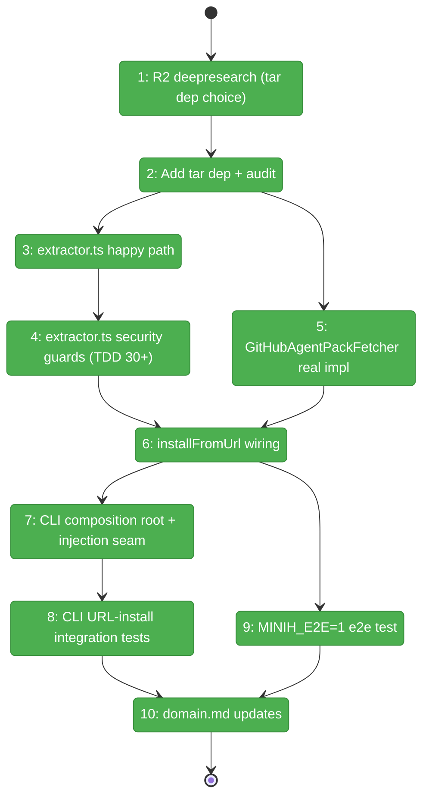
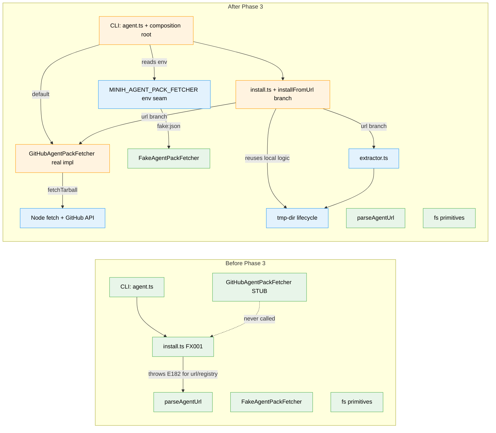

# Flight Plan: Phase 3 — Real GitHub fetch

**Plan**: [`../../agent-pack-install-plan.md`](../../agent-pack-install-plan.md)
**Phase**: Phase 3: Real fetch — GitHub tarball download + extract
**Generated**: 2026-05-03
**Status**: Landed

---

## Departure → Destination

**Where we are**: Phase 1 (Foundations) is shipped: `runner/agent-pack/` has types, manifest validator, registry reader, source sidecar (with sha256 checksums), URL parser, and the `IAgentPackFetcher` injection seam. Local-path install + info + list ship in FX001 + FX002 — users can already `minih agent install /abs/path/to/agent` and see drift via `agent info`. URL and registry sources currently throw E182 ("not yet available; see Phase 3/4"). No HTTP code exists in `src/` yet; no tarball-extract code; no real `GitHubAgentPackFetcher` impl. CI test count: 827 passed | 10 skipped | 0 vulns.

**Where we're going**: A user can run `minih agent install github:AI-Substrate/minih#main:agents/code-review-companion` from any project on disk and have the agent installed end-to-end against real GitHub. The system fetches the tarball through Node's built-in `fetch()` (no new HTTP dep), enforces a 10 MB cap pre- AND mid-stream, extracts with the full security guard suite (DoS bombs, traversal, symlinks, file-mode, runtime-dir denylist), strips the GitHub `<repo>-<sha>/` top-level prefix, then reuses the FX001 local-install atomic-swap + sidecar code with `source.type = 'url'` and the resolved 40-char `commitSha`. Default `npm test` makes ZERO real network calls (everything routed through `FakeAgentPackFetcher` via the `MINIH_AGENT_PACK_FETCHER` env-var injection seam); `MINIH_E2E=1` opt-in covers the live-network path.

---

## Domain Context

### Domains We're Changing

| Domain | What Changes | Key Files |
|--------|-------------|-----------|
| `runner` | NEW `extractor.ts` (tarball → temp dir + DoS/traversal/symlink guards). `fetcher.ts` `GitHubAgentPackFetcher.fetchTarball` stub body REPLACED with real `fetch()` impl. `install.ts` URL E182-stub REPLACED with `installFromUrl()` that fetches → extracts → reuses local-install logic. `index.ts` + `runner/index.ts` re-export `extractTarball` and `ExtractOptions`. | `src/runner/agent-pack/extractor.ts` (new), `src/runner/agent-pack/fetcher.ts`, `src/runner/agent-pack/install.ts`, `src/runner/agent-pack/index.ts`, `src/runner/index.ts` |
| `cli` | `agent install` action gains a composition root that builds the real `GitHubAgentPackFetcher` by default and honors the `MINIH_AGENT_PACK_FETCHER=fake:<json>` injection seam (Phase 4.10 mechanism, scaled-down). | `src/cli/commands/agent.ts` |
| `build` | Add chosen tar dep (T001 deepresearch decides — default expectation `tar-stream`); update `package.json` + lockfile; verify clean `npm audit`. | `package.json`, `package-lock.json` |
| `docs` | Domain history row + composition entry for new files; Concepts section gains `extractTarball`. Plan progress updated. R2 deepresearch artifact authored. | `docs/domains/runner/domain.md`, `docs/plans/017-agent-pack-install/agent-pack-install-plan.md`, `docs/plans/017-agent-pack-install/external-research/tarball-extract.md` (new) |

### Domains We Depend On (no changes)

| Domain | What We Consume | Contract |
|--------|----------------|----------|
| `runner/agent-pack` (Phase 1) | `IAgentPackFetcher` interface, `FakeAgentPackFetcher`, `RUNTIME_DIR_NAMES`, `parseAgentUrl`, `readAgentManifest`, `synthesizeImplicitManifest`, `writeSourceSidecar`, `computeFileChecksums`, `installAgentPack` (existing local branch) | `runner/index.ts` re-exports |
| `cli/output` (Phase 1) | `ErrorCodes` E180-E184, `pickErrorCode` regex precedence (`\bE18N\b`-literal-first) | `src/cli/output.ts` |
| Node 20 stdlib | `fetch()`, `node:zlib.createGunzip`, `node:fs.{mkdtempSync, rmSync, ...}`, `node:os.tmpdir` | built-in |
| Vitest pattern | `describe.skipIf(process.env.MINIH_E2E !== '1', ...)` for opt-in network tests | existing convention (`test/e2e/two-agent-coordination.test.ts`, `test/cli/resume-in-place.test.ts`) |

---

## Flight Status

<!-- Updated by /plan-6-v2: pending → active → done. Use blocked for problems/input needed. -->

**Legend**: grey = pending | yellow = active | red = blocked/needs input | green = done

---

## Stages

<!-- Updated by /plan-6-v2 during implementation: [ ] → [~] → [x] -->

- [x] **Stage 1: Decide the tar dep** — Run `/deepresearch-v2` (Perplexity) to compare `tar-stream` vs `node-tar` vs hand-rolled minimal reader; record DECISION block in research artifact (`external-research/tarball-extract.md` — new file)
- [x] **Stage 2: Install tar dep + verify audit** — `npm install --save <chosen>`; `just fft` + `npm audit` GREEN (`package.json`, `package-lock.json`)
- [x] **Stage 3: Build extractor happy path** — Stream-based `extractTarball`; strips top-level `<repo>-<sha>/` prefix; 5 fixture-driven tests green (`extractor.ts` — new file, `extractor.test.ts` — new file)
- [x] **Stage 4: Land extractor security guards** — Full DoS + traversal + symlink + file-mode + runtime-dir-denylist + Windows-drive + Unicode + pax/longname suite; 38+ TDD cases — every named attack class has at least one explicit test
- [x] **Stage 5: Real GitHub fetcher impl** — Replace `GitHubAgentPackFetcher.fetchTarball` stub with `fetch()`-based real impl; pre/mid-stream 10 MB cap; URL-encoded ref; 30 s wall-clock; no-retry policy; commit-sha extraction from redirect; 16 mocked-fetch tests (`fetcher.ts`)
- [x] **Stage 6: Wire installFromUrl** — `install.ts` URL E182-stub replaced; uses extractor + fetcher + reuses FX001 local-install logic; tmp-dir cleanup verified via `minih-agent-pack-*` prefix scan; slug derivation documented; 11 fake-fetcher tests
- [x] **Stage 7: CLI composition root + injection seam (production-safe)** — `agent.ts` instantiates real fetcher by default; honors `MINIH_AGENT_PACK_FETCHER=fake:<json>` env var **only under `NODE_ENV=test`**; hard-fails loudly otherwise; emits warning line on every fake-fetcher invocation
- [x] **Stage 8: CLI URL integration tests** — `agent-install-url.test.ts` (new file, 11 cases — 3 production-safety + 8 URL install) — built CLI + injected fake; covers --ref/--subpath/--as flag overrides + HTTPS URL form + E181 paths
- [x] **Stage 9: MINIH_E2E=1 real-fetch test** — `test/e2e/agent-pack-real-fetch.test.ts` (new file) — gated by env var; pulls from real `github:AI-Substrate/minih`; default `npm test` skips it
- [x] **Stage 10: Domain.md + plan progress** — `runner/domain.md` history + composition + Concepts; plan-6a updates `agent-pack-install-plan.md`

---

## Architecture: Before & After

**Legend**: existing (green, unchanged) | changed (orange, modified) | new (blue, created)

---

## Acceptance Criteria

- [ ] `minih agent install github:owner/repo#ref:subpath` succeeds end-to-end (via injected fake in CI; against real GitHub when `MINIH_E2E=1`)
- [ ] Tarball ≥ 10 MB rejected with E182 BEFORE extraction begins (pre-stream Content-Length AND mid-stream byte counter)
- [ ] Extractor refuses every named attack class with E182: traversal (`..`, leading `/`, null bytes), symlinks (typeflag `'2'`), hard-links (`'1'`), device/FIFO (`'3'`/`'4'`/`'6'`), file mode > `0o755`, decompression bomb (1 MB → 1 GB), entry-count flood (10 K), path-length attack (4 KB), per-entry size (> 2 MB), cumulative size (> 10 MB), expansion ratio (> 100x), gunzip wall-clock (> 5 s), runtime-dir paths (`runs/`, `inbox/`, `state/`, `.git/`), inconsistent top-level prefix mid-stream, malformed/truncated tar, duplicate-path entries
- [ ] Top-level `<repo>-<sha>/` prefix stripped on extract — verified by fixture test
- [ ] `installAgentPack({source: {type: 'url', ...}, fetcher})` returns `action: 'installed'` on first call, `'unchanged'` when checksums match, `'upgraded'` when content changes — all with sidecar `source.type === 'url'` and 40-char `commitSha`
- [ ] Default `npm test` makes ZERO real GitHub calls (every URL test routes through `FakeAgentPackFetcher`)
- [ ] `MINIH_E2E=1 npx vitest run test/e2e/agent-pack-real-fetch.test.ts` GREEN against real `github:AI-Substrate/minih#main:agents/code-review-companion`
- [ ] `just fft` GREEN: lint + format + build + typecheck + test + audit (0 high/critical vulns)
- [ ] Tmp-dir cleanup verified zero across the suite (count `os.tmpdir()` entries before + after)
- [ ] Domain rule preserved: `runner/agent-pack` does not import from `cli`/`mcp`/`adapter`; `cli` imports only from `runner/index.ts` re-exports
- [ ] FX001 local-install + FX002 info/list tests still pass unchanged (backward compat)
- [ ] `MINIH_REGRESSION=1` baseline for `minih list`/`minih doctor` still GREEN (Phase 3 doesn't touch list output but verify)

## Goals & Non-Goals

**Goals**:
- All Phase 3 plan tasks 3.1-3.5 land
- Spec ACs 1, 4, 7, 13, 14, 15 are demonstrably testable end-to-end via the URL install path
- Forward-compat preserved: `MinihSourceSidecar.schemaVersion = '1'`; `IAgentPackFetcher` interface unchanged
- Test isolation: no real network in default suite; tmp-dir leakage zero
- Security defaults: every named attack class has an explicit test; reject-by-default posture

**Non-Goals**:
- Confirmation prompt for non-registry URLs (Phase 4.3)
- Registry-slug resolution (Phase 4 — registry path keeps its E182 stub)
- `--check` / `--check-remote` flags (Phase 4 / Phase 4 follow-up)
- `agent remove` orchestration (Phase 4.7)
- Authoring `agents/code-review-companion/agent.json` (Phase 5.1)
- Private-repo auth tokens (v2)
- Proxy / custom CA / corporate-network support (deferred — Comp-M1 in plan validation record)
- Hardening the fetcher-injection env var with `NODE_ENV=test` gate (Phase 4.10)

---

## Checklist

- [x] T001: R2 deepresearch — tar parser dep choice; output `external-research/tarball-extract.md` with DECISION block
- [x] T002: Add chosen tar dep + verify clean audit (`package.json`, `package-lock.json`); `just fft` GREEN
- [x] T003: `extractor.ts` happy path (TDD) — `extractTarball(buffer, destDir, opts?)`; strips `<repo>-<sha>/` prefix; 5 cases
- [x] T004: `extractor.ts` security guards (TDD 38+) — DoS + traversal + symlink + file-mode + runtime-dir denylist + Windows/Unicode/pax/longname; every named attack class
- [x] T005: `GitHubAgentPackFetcher.fetchTarball` real impl (TDD) — Node `fetch()`; pre/mid 10 MB cap; commit-sha from redirect; URL-encoded ref; 30 s wall-clock; no-retry policy; 16 mocked cases
- [x] T006: Wire `installFromUrl` in `install.ts` — replaces FX001 URL stub; reuses local-install logic; tmp-dir lifecycle; `minih-agent-pack-*` prefix scoping; slug derivation; 11 fake-fetcher cases
- [x] T007: CLI composition root + `MINIH_AGENT_PACK_FETCHER=fake:<json>` injection seam in `agent.ts`; **NODE_ENV=test gated** + warning line + 3 production-safety tests
- [x] T008: New `test/cli/agent-install-url.test.ts` — 8 integration cases via injected fake
- [x] T009: New `test/e2e/agent-pack-real-fetch.test.ts` — `MINIH_E2E=1`-gated; real GitHub
- [x] T010: Update `docs/domains/runner/domain.md` + `docs/domains/cli/domain.md` (history + composition + Concepts) + run `/plan-6a-v2-update-progress`
