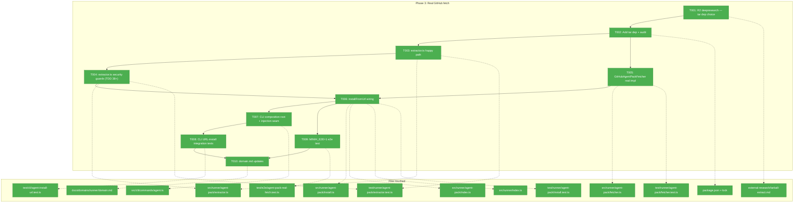
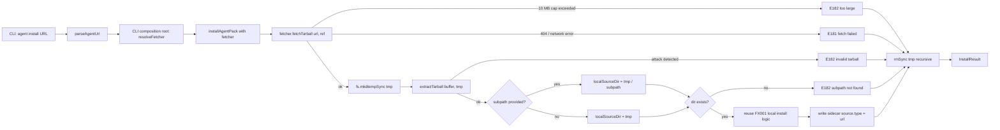

# Phase 3: Real fetch — GitHub tarball download + extract

**Plan**: [`agent-pack-install-plan.md`](../../agent-pack-install-plan.md)
**Phase**: Phase 3 (Phase 1 complete; Phase 2 substantially delivered via FX001 + FX002)
**Status**: Ready for implementation
**Generated**: 2026-05-03

---

## Executive Briefing

**Purpose**: Replace the FX001 URL-source stub with the real path: download the `.tar.gz` from GitHub, extract it safely, then run the existing local-install logic against the extracted bytes. This is the load-bearing phase that turns "install from a local folder" into "install from any public GitHub repo," matching the `npx`/`uv` ergonomics the user signed off on.

**What We're Building**:

1. A new `src/runner/agent-pack/extractor.ts` — gunzip + tar parser → temp dir, with the full security guard set (per-entry size, cumulative size, entry count, path length, expansion-ratio bomb, gunzip wall-clock, traversal, symlink, file-mode, top-level-prefix strip).
2. A real `GitHubAgentPackFetcher.fetchTarball()` against `GET https://api.github.com/repos/{owner}/{repo}/tarball/{ref}` using Node 20 built-in `fetch()` — no new HTTP dep. 10 MB cap pre- and during-stream. Commit sha extracted from the redirect URL.
3. An `installFromUrl()` branch in `installAgentPack` — fetcher → extractor → optional `subpath` slice → reuse existing local-install copy/swap/sidecar code with `sidecar.source.type = 'url'`.
4. A composition root for the CLI that instantiates `GitHubAgentPackFetcher` by default and honors the `MINIH_AGENT_PACK_FETCHER` env-var injection seam (Plan 4.10) so CI tests run via `FakeAgentPackFetcher` and never hit GitHub.
5. A `MINIH_E2E=1`-gated end-to-end test that actually pulls `agents/code-review-companion` from `github:AI-Substrate/minih`.

**Goals**:
- ✅ `minih agent install github:owner/repo#ref:subpath` succeeds end-to-end (via injected fake in CI; against real GitHub when `MINIH_E2E=1`)
- ✅ Tarball ≥ 10 MB rejected with E182 BEFORE extraction begins; streamed bytes also capped (defense in depth)
- ✅ Extractor refuses every named attack vector — traversal, symlinks, decompression bomb (1 MB → 1 GB), entry-count flood (10 K entries), path-length attack (4 KB name), file-mode beyond `0o755`, malformed tar
- ✅ Top-level `<repo>-<sha>/` prefix stripped on extract; tested via fixture
- ✅ `installAgentPack({source: {type: 'url', ...}})` returns the right `action` discriminator and writes a sidecar with `source.type === 'url'` and the resolved `commitSha`
- ✅ Default test suite (`npm test`) makes ZERO real GitHub calls — all integration tests use `FakeAgentPackFetcher`
- ✅ `just fft` GREEN (lint + format + build + typecheck + test + audit)
- ✅ Domain rule preserved: `runner` does not import `cli`/`mcp`/`adapter`; `cli → runner` only via public re-exports

**Non-Goals**:
- ❌ Confirmation prompt for non-registry URLs (Phase 4.3)
- ❌ Registry-slug resolution (Phase 4 — this phase keeps the registry stub)
- ❌ `--check` / `--check-remote` flags (Phase 4 / Phase 4 follow-up)
- ❌ `agent remove` orchestration (Phase 4.7)
- ❌ Authoring `agents/code-review-companion/agent.json` (Phase 5.1) — the E2E test installs the canonical agent IF/when it has a manifest; otherwise falls back to the implicit-manifest path that already exists
- ❌ Hardening against private-repo auth tokens (v2 — current scope is public repos only)
- ❌ Proxy / custom CA / corporate-network support (open question Comp-M1 in plan validation record — deferred to v2)

---

## Prior Phase Context

> Phase 1 (Foundations) is complete; Phase 2 (Local-install with Fake) was substantially delivered through fixes FX001 (install + URL/registry stubs) and FX002 (info + list). Phase 3 builds directly on both. No parallel-subagent review was launched — full execution-log narratives for Phase 1, FX001, and FX002 were read inline. The summary below reflects the actual landed state at commit `549aa97`.

### A. Deliverables already on disk

**Source files (all under `src/runner/agent-pack/`):**

| File | Status | Notes for Phase 3 |
|---|---|---|
| `types.ts` | done | `AgentPackSource` is a 3-arm discriminated union (`registry` / `url` / `local`). The `'url'` arm has `{url, ref, subpath?, commitSha}` — Phase 3 fills in `commitSha` from the fetcher result. |
| `manifest.ts` | done | Exports `RUNTIME_DIR_NAMES = ['runs','inbox','state','.git']` — **the extractor MUST reuse this constant** as the runtime-dir denylist (Finding 03). Also exports `checkManifestPath` for path-traversal validation; consider whether the extractor needs its own variant. |
| `registry.ts` | done | Phase 3 doesn't touch this. Phase 4 owns registry resolution. |
| `source.ts` | done | `writeSourceSidecar` writes `.minih-source.json` atomically (tmp+rename). Phase 3 will call this with `source.type = 'url'` instead of `'local'`. |
| `url.ts` | done | `parseAgentUrl(input, opts)` already handles `github:`/HTTPS/local input forms. **Returns `ParsedAgentUrl`** — Phase 3 will use the `'github'`/`'https'` arms to derive the `{owner, repo, ref, subpath}` for the fetcher call. |
| `fetcher.ts` | done (stub) | `IAgentPackFetcher` interface + `FakeAgentPackFetcher` (working, used by Phase 1 tests) + `GitHubAgentPackFetcher` (stub class — `fetchTarball()` rejects with "not implemented in Phase 1; see Phase 3.2"). **Phase 3 replaces only the stub method body.** |
| `install.ts` | done (FX001) | `installAgentPack` orchestrates local-only today. URL/registry source variants throw with `(E182)` literal. **Phase 3 replaces the URL throw with `installFromUrl()`** that wraps the existing per-file copy/swap/sidecar logic. |
| `index.ts` | done | Public re-export barrel. Phase 3 will add `extractTarball` and possibly `ExtractOptions`. |

**Other landed surfaces:**

- `src/runner/index.ts` re-exports the agent-pack public surface to CLI consumers.
- `src/cli/commands/agent.ts` (~480 LOC) registers the `agent install/info/list` subcommand group. Today, install instantiates **no fetcher** because the URL/registry paths short-circuit in the runner. **Phase 3 adds the composition root** that builds the real fetcher.
- `src/cli/output.ts` already has E180-E184. No new error codes needed in Phase 3.
- `test/runner/agent-pack/` has 5 test files (74 tests from Phase 1) + 1 from FX001 (15 tests).
- `test/cli/agent-install-local.test.ts` (10 tests covering FX001 local-install + URL/registry stub paths).

### B. Dependencies exported (consumed by Phase 3)

```ts
// from runner/agent-pack/index.ts (re-exported via runner/index.ts):

export type AgentPackSource =
  | { type: 'registry'; ... }
  | { type: 'url'; url: string; ref: string; subpath?: string; commitSha: string }
  | { type: 'local'; ... };

export interface IAgentPackFetcher {
  fetchTarball(url: string, ref: string): Promise<{commitSha: string; tarball: Buffer}>;
}
export class FakeAgentPackFetcher implements IAgentPackFetcher { /* preset map + call history */ }
export class GitHubAgentPackFetcher implements IAgentPackFetcher { /* STUB — replace in T005 */ }

export interface InstallOptions {
  source: InstallSource; // includes 'url' arm with {url, ref, subpath?}
  agentsDir: string;
  asSlug?: string;
  force?: boolean;
  yes?: boolean;
  // Phase 3 ADDS: fetcher?: IAgentPackFetcher (only used when source.type === 'url')
}

export const RUNTIME_DIR_NAMES: readonly string[]; // single source of truth
export function parseAgentUrl(input: string, opts?): ParsedAgentUrl;
export function readAgentManifest(dir: string): AgentPackManifest | null;
export function synthesizeImplicitManifest(dir: string): AgentPackManifest;
export function writeSourceSidecar(dir: string, sidecar: MinihSourceSidecar): void;
export function computeFileChecksums(root: string, files: string[]): Record<string, string>;
```

### C. Gotchas & debt carrying forward

1. **Surgical-sync on upgrade is path-agnostic** — FX001 already proved that the local-install copy/swap/sidecar code works file-content-only. Phase 3 reuses this verbatim by extracting to a temp dir and treating it as a local source. **Risk**: temp-dir lifetime — must clean up on both success and failure paths.
2. **Concurrent-install race** (FX001 debt): two simultaneous `agent install` calls on the same target would race on `tmp+rename`. Phase 3 inherits this debt — **NOT addressed here** but worth noting if E2E flakes.
3. **`pickErrorCode` regex precedence is strict** — the FX001 fix made it match `\bE18N\b` literal first. Phase 3's new error messages MUST embed `(E181)` (network/fetch failed) or `(E182)` (extract validation failed) in the literal text the runner throws.
4. **`MINIH_E2E=1` is the project convention** for tests that hit the real network — used by `test/e2e/two-agent-coordination.test.ts` and `test/cli/resume-in-place.test.ts`. The new e2e test follows this convention exactly (skip via `describe.skipIf`).
5. **Tarball top-level prefix** (Finding 09): GitHub puts `<repo>-<sha-prefix>/` as the first path segment of every entry (e.g. `minih-a1b2c3d/agents/code-review-companion/prompt.md`). The extractor MUST strip exactly the first segment — use the FIRST entry's directory name as the prefix and reject if subsequent entries don't match.

### D. Incomplete items (NOT carried forward into Phase 3)

- **Phase 2.7 `removeAgentPack`** — deferred to Phase 4.7 (CLI will need it for `agent remove <slug>`). Phase 3 does NOT need it.
- **Phase 2 acceptance "Atomic-swap survives mid-execution crash test"** — was descoped in FX001; not targeted here. Phase 3 inherits the same level of crash safety (per-file `tmp+rename`).
- **Phase 4.10 fetcher-injection env var** — Phase 3 lands the underlying mechanism (T007: composition root reads `MINIH_AGENT_PACK_FETCHER`); Phase 4 will harden it (`NODE_ENV` check, etc.). For Phase 3 we accept a simple env-var read so that integration tests run.

### E. Patterns to follow (established by FX001/Phase 1)

- **TDD discipline** — Phase 1 wrote 74 tests in 25 ms total; FX001 added 21 more in 25 ms. All Phase 3 tests must run in the default Vitest sandbox without temp-file leakage. Use `fs.mkdtempSync(path.join(os.tmpdir(), 'minih-agent-pack-'))` + `try/finally rmSync(..., { recursive: true, force: true })`.
- **Single-method interface bias** — `IAgentPackFetcher` has ONE method. The extractor's surface should be one function (`extractTarball`) too. Resist growth.
- **Forward-compat literal `schemaVersion: '1'`** — sidecar writes always emit current schema; reads tolerate unknown fields. Phase 3 sidecars for URL installs MUST follow this rule.
- **JSON envelopes use `(E18N)` literal** in error messages so `pickErrorCode` regex picks them up correctly. **DO NOT** rely on word-matching like `/fetch/i` or `/registry/i`.
- **No real network in `npm test`** — Phase 3's CI tests MUST use `FakeAgentPackFetcher`. Real GitHub is `MINIH_E2E=1` only.

---

## Pre-Implementation Check

| File | Exists? | Domain | Action | Notes |
|---|---|---|---|---|
| `src/runner/agent-pack/extractor.ts` | NO | runner | CREATE | Internal — tarball → temp dir + DoS guards; consumes `RUNTIME_DIR_NAMES` from `manifest.ts` |
| `src/runner/agent-pack/fetcher.ts` | YES (stub) | runner | MODIFY | Replace `GitHubAgentPackFetcher.fetchTarball` body; keep interface + Fake unchanged |
| `src/runner/agent-pack/install.ts` | YES (FX001) | runner | MODIFY | Replace URL E182-throw with `installFromUrl(source, opts, fetcher)`; add `fetcher?` to `InstallOptions` |
| `src/runner/agent-pack/index.ts` | YES | runner | MODIFY | Re-export `extractTarball` (and `ExtractOptions` if introduced) |
| `src/runner/index.ts` | YES | runner | MODIFY | Add `extractTarball` (and types) to the public surface |
| `src/cli/commands/agent.ts` | YES | cli | MODIFY | Composition root: instantiate `GitHubAgentPackFetcher`; honor `MINIH_AGENT_PACK_FETCHER` injection env var; pass to `installAgentPack` |
| `package.json` | YES | build | MODIFY | Add chosen tar dep (likely `tar-stream` ~5 KB) — pending T001 R2 deepresearch decision; bump version unaffected |
| `package-lock.json` | YES | build | MODIFY | Generated by `npm install` — committed |
| `test/runner/agent-pack/extractor.test.ts` | NO | runner (test) | CREATE | TDD — 30+ cases, covers every named attack class |
| `test/runner/agent-pack/fetcher.test.ts` | YES | runner (test) | MODIFY | Add `GitHubAgentPackFetcher` real-impl tests with mocked `globalThis.fetch` |
| `test/runner/agent-pack/install.test.ts` | YES | runner (test) | MODIFY | Add URL-install branch tests using `FakeAgentPackFetcher` end-to-end |
| `test/cli/agent-install-url.test.ts` | NO | cli (test) | CREATE | Integration tests via `execFileSync` against built CLI; uses `MINIH_AGENT_PACK_FETCHER` injection seam |
| `test/e2e/agent-pack-real-fetch.test.ts` | NO | e2e (test) | CREATE | `MINIH_E2E=1`-gated; pulls `github:AI-Substrate/minih#main:agents/code-review-companion` and asserts install |
| `external-research/tarball-extract.md` | NO | research | CREATE (T001) | R2 deepresearch artifact; records dep choice rationale |
| `docs/domains/runner/domain.md` | YES | docs | MODIFY (T010) | History row + composition entry for `extractor.ts` and `GitHubAgentPackFetcher` real impl; Concepts unchanged (no new public concept — `IAgentPackFetcher` already documented in Phase 1) |

**Concept search check**: ran searches for `extractTarball`, `tar-stream`, `gunzip`, `tarball` — no existing implementations found in `src/`. The closest analog in this codebase to "external bytes → trusted in-tree files" is `src/runner/folder.ts:scaffoldAgent` (template copy) and `scripts/copy-schemas.js` (build-time copy), but neither handles untrusted input. **Treat the extractor as new ground.** Outside this repo, the canonical Node patterns are `tar-stream` (npm; ~5 KB; pure JS; streaming) and `node-tar` (heavier; supports compress; more features). T001 R2 deepresearch finalizes the choice.

**Harness check**: No `docs/project-rules/harness.md`. Per spec § Clarifications Q6 the standard `just fft` gate covers this phase. No agent harness — implementation will use standard testing only (Hybrid TDD per spec § Testing Strategy).

---

## Architecture Map



---

## Tasks

| Status | ID | Task | Domain | Path(s) | Done When | Notes |
|--------|-----|------|--------|---------|-----------|-------|
| [x] | T001 | **R2 deepresearch — tar parser dep choice.** Use `/deepresearch-v2` (Perplexity) to compare `tar-stream` vs `node-tar` vs hand-rolled minimal reader. Score on: bundle size, transitive deps + audit posture, streaming support, security maturity, ESM support. Write findings to `docs/plans/017-agent-pack-install/external-research/tarball-extract.md` with a clear DECISION block. **Default expectation**: `tar-stream` wins (popular, ~5 KB, streaming, zero transitive deps). Decision is binding for T002. | research | `docs/plans/017-agent-pack-install/external-research/tarball-extract.md` | DECISION block names exactly one dep (or "hand-rolled"); rationale documented; transitive dep audit captured | Plan 3.1; Finding 07 |
| [x] | T002 | **Add chosen tar dep + verify clean audit.** `npm install --save <chosen-dep>` (or none if hand-rolled). Run `just fft` baseline; capture `npm audit --omit=dev` output. Update Domain Manifest if dep adds transitive runtime deps that touch any domain. | build | `package.json`, `package-lock.json` | `just fft` GREEN; `npm audit` shows 0 high/critical; locked version recorded in execution log | T001 decision binding |
| [x] | T003 | **`extractor.ts` happy path (TDD).** Implement `extractTarball(buffer: Buffer, destDir: string, opts?: ExtractOptions): Promise<{filesWritten: string[]}>`. Streams `node:zlib.createGunzip()` → chosen tar parser → write each file under `destDir/`. **Strips top-level `<repo>-<sha>/` prefix** (use first entry's leading dir as the prefix; reject mid-stream if a subsequent entry doesn't share it). Returns relative paths written. **Tests covered in T003**: (1) happy path — small fixture tarball with 3 files round-trips; (2) prefix-stripping — entries return without `<repo>-<sha>/` prefix; (3) empty tarball — returns `[]`; (4) directory entries — created on disk; (5) nested-dir file — parent dirs created. | runner | `src/runner/agent-pack/extractor.ts`, `test/runner/agent-pack/extractor.test.ts` | All 5 happy-path cases green; `extractor.ts` exports `extractTarball` + `ExtractOptions`; gunzip stream cleaned up on completion; no test fixtures leak under tmpdir | Finding 09; Plan 3.3 split A |
| [x] | T004 | **`extractor.ts` security guards (TDD — 38+ cases).** Add the full DoS + traversal + symlink + file-mode guard suite to `extractTarball`. **Limits enforced**: cumulative-decompressed-size ≤ 10 MB; per-entry size ≤ 2 MB; max entry count ≤ 200; max path length ≤ 255 bytes; max expansion ratio (compressed → decompressed) ≤ 100x with early-abort; gunzip stream wall-clock budget ≤ 5 s soft. **Per-entry rejections**: `..` in any path component, leading `/`, leading drive letter (`C:\`, etc.), backslash in path (Windows-style), Unicode-normalized `..` (NFKC normalize then re-check), null bytes, symlinks (typeflag `'2'`/`'5'`), file mode > `0o755` (mask via `mode & 0o7777` — anything beyond 0o755 rejects, so setuid/setgid/sticky all blocked), paths whose first component starts with any of `RUNTIME_DIR_NAMES` (after prefix strip), inconsistent prefix mid-stream, sparse-file entries (typeflag `'S'`), GNU long-name extension headers (typeflag `'L'`/`'K'` — IGNORE silently with debug log, don't fail; the long name they describe is gated by the 255-byte cap regardless), pax extension headers (typeflag `'x'`/`'g'` — IGNORE silently; their key=value records are not consumed). **Test cases** (each its own `it()` block): (a) 1 MB compressed → 1 GB decompressed bomb — aborts at expansion-ratio limit; (b) 10 K small entries — aborts at entry-count limit; (c) 4 KB entry name — rejects on path-length; (d) traversal via `../etc/passwd` — rejects; (e) traversal via URL-encoded `%2e%2e` — rejects (already string-decoded by tar parser; verify); (f) leading-`/` absolute path — rejects; (g) null byte in name — rejects; (h) hard-link entry — rejects (typeflag `'1'`); (i) symlink entry — rejects (typeflag `'2'`); (j) directory-symlink entry — rejects; (k) file mode `0o4755` (setuid) — rejects; (l) `runs/foo` path — rejects (runtime-dir denylist); (m) `inbox/x` path — rejects; (n) `state/x` path — rejects; (o) `.git/HEAD` path — rejects; (p) cumulative size exactly 10 MB — passes; 10 MB + 1 byte — rejects; (q) per-entry exactly 2 MB — passes; 2 MB + 1 byte — rejects; (r) malformed tar header — rejects with E182; (s) truncated tar mid-entry — rejects; (t) gzip wall-clock exceeded — rejects with E182; (u) inconsistent top-level prefix mid-stream — rejects; (v) entry count exactly 200 — passes; 201 — rejects; (w) deeply nested path (depth 50) at 254 bytes — passes; (x) two entries with the same path — rejects (overwrite is suspicious); (y) device-special entry — rejects (typeflag `'3'`/`'4'`); (z) FIFO entry — rejects (typeflag `'6'`); (aa) zero-length entry name — rejects; (bb) DoS test: gunzip-stream 50 MB single entry — rejects pre-buffer (per-entry cap blocks); **(cc) Windows drive root `C:\foo` — rejects**; **(dd) backslash-only path `foo\\bar` — rejects (we don't translate; we reject)**; **(ee) mixed-slash path `foo/bar\\baz` — rejects**; **(ff) Unicode-NFKC `..` (e.g. fullwidth `．．`) — rejects after normalization**; **(gg) PaxHeader entry (typeflag `'x'`) — IGNORED (not extracted, no error)**; **(hh) GlobalHeader entry (typeflag `'g'`) — IGNORED**; **(ii) GNU long-name entry (typeflag `'L'`) — IGNORED (subsequent entry's name still gated by 255-byte cap)**; **(jj) sparse-file entry (typeflag `'S'`) — rejects**. | runner | `src/runner/agent-pack/extractor.ts`, `test/runner/agent-pack/extractor.test.ts` | 38+ test cases green; ALL named attack classes have at least one explicit test; all rejections embed `(E182)` literal in the thrown message; pax/long-name/global-header IGNORE cases verified silent; tmp dir cleaned up after each test | Plan 3.3; Risk: Untrusted-tar attack surface (Plan-Level Risks); spec AC15, AC7 |
| [x] | T005 | **`GitHubAgentPackFetcher.fetchTarball` real impl (TDD).** Replace stub body. Calls `GET https://api.github.com/repos/{owner}/{repo}/tarball/{ref-encoded}` where `{ref-encoded}` = `encodeURIComponent(ref)` so refs containing `/` (e.g. `feature/foo`), `+`, `#`, `?` survive transit. Headers: `Accept: application/vnd.github+json`, `User-Agent: minih/<package.json#version>`. Follows 302 redirect (Node `fetch()` does this by default — verify with mock). **Request wall-clock budget**: 30 s overall via `AbortController` (covers slow-loris, stalled body, DNS hang, TLS handshake hang); abort surfaces as `E181 fetch failed: request timed out after 30 s`. **No retry policy in v1**: 5xx and network errors surface immediately as `E181`; document the no-retry decision so Phase 4 doesn't accidentally add retries that mask transient extractor issues. **Pre-extract size cap**: read `Content-Length` header if present; if > 10 MB, abort with `E182 tarball too large (header reports N MB, max 10 MB)`. **Streamed cap**: read response body via `response.body!.getReader()`; abort if cumulative bytes > 10 MB. **Commit-sha extraction**: GitHub redirects to `https://codeload.github.com/{owner}/{repo}/legacy.tar.gz/refs/heads/{ref}/{full-sha}` — capture the redirect URL via `response.url` after the auto-follow; parse the SHA-40 from the path. **Mocked-fetch tests**: (1) happy path — 200 + redirect-URL contains 40-char hex → returns `{commitSha, tarball}`; (2) 404 → `E181 fetch failed: 404 ...`; (3) 401/403 (rate-limit / auth) → `E181`; (4) 500 → `E181` (no retry — verify only one fetch call); (5) network error (`fetch()` throws TypeError) → `E181`; (6) Content-Length 11 MB → `E182 too large` BEFORE body read; (7) Content-Length absent + body streams to 10 MB + 1 byte → `E182 too large` (mid-stream abort); (8) redirect URL without sha (synthetic) → `E181 could not extract commit sha`; (9) `User-Agent` and `Accept` headers verified via mock fetch arg captor; **(10) ref `feature/foo` → fetch URL contains `feature%2Ffoo` (URL-encoded)**; **(11) ref with `+` (e.g. `v1.0+rc1`) → encoded to `v1.0%2Brc1`**; **(12) TLS handshake error (mock fetch throws `Error('certificate has expired')` or similar) → `E181 fetch failed: certificate has expired`**; **(13) DNS resolution failure (mock fetch throws `TypeError('fetch failed')` with `cause: { code: 'ENOTFOUND' }`) → `E181`**; **(14) request timeout (`AbortController` aborts after fake-timer 30 s) → `E181 ... request timed out after 30 s`**; **(15) early-EOF mid-body (mock reader throws after 1 KB) → `E181 fetch failed: response stream ended unexpectedly`**; **(16) slow-loris (mock body never resolves; AbortController fires) → `E181 ... request timed out`**. | runner | `src/runner/agent-pack/fetcher.ts`, `test/runner/agent-pack/fetcher.test.ts` | All 16 mocked-fetch cases green; **no test makes real network calls**; `globalThis.fetch` mocking pattern used (no new HTTP-mock dep); 30 s wall-clock + URL-encoded ref documented in code comments | Plan 3.2; Findings 01, 07; spec AC4, AC14 |
| [x] | T006 | **Wire `installFromUrl` in `install.ts`.** Replace the FX001 URL E182-stub. New private `installFromUrl(source: {type: 'url', url, ref, subpath?}, opts: InstallOptions, fetcher: IAgentPackFetcher)`: (1) call `fetcher.fetchTarball(url, ref)` → `{commitSha, tarball}`; (2) `fs.mkdtempSync(path.join(os.tmpdir(), 'minih-agent-pack-'))` a tmp root with the **canonical `minih-agent-pack-` prefix** so test cleanup can scope assertions to entries we own; (3) call `extractTarball(tarball, tmp)`; (4) compute `localSourceDir = subpath ? path.join(tmp, subpath) : tmp`; verify it exists + is a directory; if not → throw `E182 subpath not found in tarball`; (5) **slug derivation for URL+subpath**: `slug = opts.asSlug ?? (subpath ? path.basename(subpath) : extractRepoNameFromUrl(url))` — document in code comment. (6) call existing local-install logic against `localSourceDir` with overridden `sidecar.source = {type: 'url', url, ref, subpath, commitSha}` and `installedAt` set to now; (7) `try { ... } finally { fs.rmSync(tmp, {recursive: true, force: true}) }`. Add `fetcher?: IAgentPackFetcher` to `InstallOptions`. **TDD via `FakeAgentPackFetcher`**: (a) URL install with prefilled fake → action='installed' + sidecar.source.type='url' + commitSha = fake's + slug derived from subpath leaf; (b) URL re-install with same fake → action='unchanged' (checksums match); (c) URL upgrade — fake's tarball changes → action='upgraded'; (d) URL with `subpath` → installs only the slice; (e) URL with `subpath` pointing to non-existent dir → E182; (f) URL with traversal in `subpath` → rejected pre-fetch (already gated by `parseAgentUrl`); (g) URL install + tmp dir cleaned up on success; (h) URL install + tmp dir cleaned up on extract failure; (i) URL install when fetcher rejects → bubbles up with E181 from fetcher + tmp not even created (fetch happens before mkdtemp); (j) URL install when no `fetcher` opt provided AND `source.type === 'url'` → throws "internal: fetcher required for URL source" (composition-root bug guard); **(k) slug derivation: URL without subpath uses repo name (`github:foo/my-agent` → slug `my-agent`)**. **Tmp-dir leakage assertion** (replaces broad-tmpdir scan): in the suite's afterAll, scan `os.tmpdir()` for entries matching `/^minih-agent-pack-/` and assert count is 0 — this is scoped to entries we created and won't conflict with other test temp dirs. | runner | `src/runner/agent-pack/install.ts`, `src/runner/agent-pack/index.ts`, `src/runner/index.ts`, `test/runner/agent-pack/install.test.ts` | All 11 cases green; **`minih-agent-pack-*` tmp-prefix scan returns 0 leaks** after the suite; FX001 local-install tests still pass unchanged | Plan 3.4; Finding 01; addresses MED-2 (prefix-scoped leak check) and MED-3 (slug derivation) |
| [x] | T007 | **CLI composition root + fetcher injection seam (production-safe).** Modify `src/cli/commands/agent.ts` install action: instantiate the fetcher via a new private `resolveFetcher(): IAgentPackFetcher`. Default: `new GitHubAgentPackFetcher()`. **Injection seam (Plan 4.10 mechanism — production-gated)**: if `process.env.MINIH_AGENT_PACK_FETCHER` is set: (a) require `process.env.NODE_ENV === 'test'` — if not, **hard-fail** at CLI startup with `E181 MINIH_AGENT_PACK_FETCHER set but NODE_ENV is not "test" — refusing to use a fake fetcher in production`. (b) value must match `fake:<json>`; on parse failure, hard-fail with `E181 MINIH_AGENT_PACK_FETCHER value malformed: expected fake:<json>`. (c) parse the JSON as `{[urlRefKey]: {commitSha, tarballBase64}}` and instantiate a `FakeAgentPackFetcher` pre-loaded with those responses. (d) **always** print a one-line warning to stderr: `[minih] using FakeAgentPackFetcher (NODE_ENV=test, MINIH_AGENT_PACK_FETCHER set)` — so a developer never silently runs against the fake. Pass the fetcher to `installAgentPack({..., fetcher})` only when `source.type === 'url'`. Document the env-var format + gate in a code comment with link to Phase 4.10. **TDD**: add 3 tests in `test/cli/agent-install-url.test.ts`: (1) env var set with `NODE_ENV=production` → exits with E181; (2) env var malformed → exits with E181; (3) env var well-formed + `NODE_ENV=test` → stderr contains the warning line. | cli | `src/cli/commands/agent.ts`, `test/cli/agent-install-url.test.ts` | URL install path reaches the runner; injection seam ONLY honors env var under `NODE_ENV=test`; production sets fail loudly; warning surfaces on every fake-fetcher invocation; default path instantiates the real fetcher; no other CLI tests broken | Plan 3.4 + 4.10; HIGH-3 (validation 2026-05-03) |
| [x] | T008 | **CLI URL-install integration tests.** New `test/cli/agent-install-url.test.ts` (mirror of `agent-install-local.test.ts` shape). Uses `MINIH_AGENT_PACK_FETCHER=fake:<json>` env injection so each test prefills a fake tarball and runs `minih agent install github:owner/repo#ref:subpath` against the built CLI. **Cases**: (1) install via `github:owner/repo#main` → action='installed', sidecar.source.type='url', commitSha matches fake; (2) re-install same input → action='unchanged'; (3) re-install with new fake tarball → action='upgraded'; (4) `--ref` flag override (workshop CLI table) → fetcher called with overridden ref; (5) `--subpath` flag override → installs slice; (6) HTTPS URL form → same effect (parsed by `parseAgentUrl`); (7) URL install when fake registers a failure → exits with E181; (8) URL install + `--as` → installs under aliased slug; (9) tarball ≥ 10 MB (synthetic in fake) → exits with E182. | cli | `test/cli/agent-install-url.test.ts` | 8 cases green; built-CLI suite + Phase 1 + FX001/FX002 tests still all green; **no real network** | Plan 4.10; spec AC1, AC2, AC3, AC4, AC13 |
| [x] | T009 | **`MINIH_E2E=1` real-fetch e2e test.** New `test/e2e/agent-pack-real-fetch.test.ts`. **Gate**: `describe.skipIf(process.env.MINIH_E2E !== '1', ...)`. **Setup**: build CLI; fresh tmp project; ensure `dist/cli/index.js` exists. **Test**: `execFileSync('node', ['dist/cli/index.js', '--agents-dir', tmpAgents, 'agent', 'install', 'github:AI-Substrate/minih#main:agents/code-review-companion'])`. **Assertions**: install succeeds; `<tmpAgents>/code-review-companion/prompt.md` exists; `<tmpAgents>/code-review-companion/.minih-source.json` exists with `source.type === 'url'`, `source.commitSha` matches `/^[0-9a-f]{40}$/`, `source.url === 'github:AI-Substrate/minih'` (canonicalized) or HTTPS form, `source.ref === 'main'`, `source.subpath === 'agents/code-review-companion'`. **Negative test**: install of bogus path → exits with E181 (404). | runner+cli | `test/e2e/agent-pack-real-fetch.test.ts` | `MINIH_E2E=1 npx vitest run test/e2e/agent-pack-real-fetch.test.ts` green; default `npm test` skips the file with no network calls | Plan 3.5; spec AC1 dogfood |
| [x] | T010 | **Update domain.md files (runner + cli) + plan progress.** **`docs/domains/runner/domain.md`** — History: append a row "[017-P3] Real GitHub fetch — extractor.ts + GitHubAgentPackFetcher real impl + URL install branch | YYYY-MM-DD". Composition: add `extractor.ts` (internal, "tarball → temp dir with DoS/traversal/symlink defense") and update `fetcher.ts` row to remove "stub" qualifier. Source Location: add `extractor.ts`. Concepts: `IAgentPackFetcher` concept already documented; **add new concept "Tarball extraction" anchored on `extractTarball` if not present** — narrative + small code example (≤ 8 lines). Domain dependencies unchanged. **`docs/domains/cli/domain.md`** — History: append "[017-P3] CLI composition root for agent-pack fetcher + `MINIH_AGENT_PACK_FETCHER` injection seam (NODE_ENV=test gated) | YYYY-MM-DD". Composition: update `agent.ts` row to mention the fetcher composition + env-var seam. Concepts: no new concept (composition is internal). Finally run `/plan-6a-v2-update-progress` to mark Phase 3 done in `agent-pack-install-plan.md`. | docs | `docs/domains/runner/domain.md`, `docs/domains/cli/domain.md`, `docs/plans/017-agent-pack-install/agent-pack-install-plan.md` | Both domain.md files updated; runner has new Concept; cli history+composition updated; plan progress marked | Per skill § 4 — domain.md updates; addresses MED-4 (validation 2026-05-03) |

---

## Context Brief

**Key findings from plan** (expanded for Phase 3):

- **Finding 01** (Critical): First HTTP code in `src/`. Action: keep `IAgentPackFetcher` injection seam green for ALL CLI URL-install integration tests (T008). NO test in the default suite may hit real GitHub — `npm test` runs offline.
- **Finding 07** (High): Tar parser dependency tradeoffs. Action: T001 R2 deepresearch makes the binding decision; T002 records lock-file diff + audit posture in execution log.
- **Finding 09** (Medium): GitHub tarballs include `<repo>-<sha>/` top-level prefix. Action: T003 strips the prefix; **EXACTLY ONE of T003 or T004 must include a fixture-based test that proves prefix stripping** (T003 (2)).
- **Finding 03 (referenced from Phase 1)** (High): manifest path-traversal & runtime-dir tampering. Action: T004 must use `RUNTIME_DIR_NAMES` (imported from `manifest.ts`) — not a hardcoded copy. Single source of truth.
- **Finding 02** (Critical): atomic-swap on upgrade is non-trivial. Action: T006 reuses the FX001 local-install copy/swap logic verbatim by extracting to a tmp dir and treating it as a local source. **Do not duplicate atomic-swap logic in `installFromUrl`** — call the existing flow.

**Domain dependencies** (concepts and contracts this phase consumes):
- `runner/agent-pack` (own): `IAgentPackFetcher` (`fetchTarball`) — the seam between install orchestration and the source of bytes; T005 fills in real impl
- `runner/agent-pack` (own): `RUNTIME_DIR_NAMES` (from `manifest.ts`) — runtime-dir denylist; T004 reuses for extractor's per-entry guard
- `runner/agent-pack` (own): `installAgentPack`, `parseAgentUrl`, `readAgentManifest`, `synthesizeImplicitManifest`, `writeSourceSidecar`, `computeFileChecksums` — already-shipped Phase 1 / FX001 contracts; T006 wires URL branch through them
- `cli` (own): `pickErrorCode` regex precedence (`\bE18N\b`-literal-first); T005 + T006 + T007 throw messages MUST embed `(E181)` or `(E182)` literally
- `cli/output`: error codes E180-E184 — already shipped in Phase 1 T008; T005-T007 use them via the regex above
- `node:zlib` (built-in): `createGunzip()` — extractor gunzip stage
- `node:fs` (built-in): `mkdtempSync`, `rmSync`, `mkdirSync`, `renameSync`, `writeFileSync` — temp dir lifecycle + per-file write
- Node 20 built-in `fetch()` — fetcher HTTP layer; no `node-fetch`/`undici`/`got` dep
- TBD T001: `tar-stream` (or alternative) — tar parser

**Domain constraints**:
- Direction: `cli → runner` (CLI's composition root in T007 imports from `runner/index.ts`); **NEVER** the other way
- `runner/agent-pack/` may import from `node:*` and (post-T002) the tar-parser dep; **MUST NOT** import from `cli`, `mcp`, or `adapter`
- Public surface change: `InstallOptions` gains an OPTIONAL `fetcher?: IAgentPackFetcher` field — backward compatible (FX001 callers still work)
- `RUNTIME_DIR_NAMES` stays single-source-of-truth in `manifest.ts` — extractor imports it; **MUST NOT** redeclare
- Forward-compat: `MinihSourceSidecar.schemaVersion` stays `'1'`; URL-source sidecars must include `source.commitSha` (per type definition)

**Harness context**: No `docs/project-rules/harness.md` exists. Standard `just fft` gate covers this phase per spec § Clarifications Q6.

**Reusable from prior phases**:
- `FakeAgentPackFetcher` (Phase 1) — preset map for test injection; reused unmodified in T006 + T008
- `tmp-dir + try/finally rmSync` pattern (FX001 install.ts:209 + 232) — reused in T006's `installFromUrl`
- `execFileSync` against built CLI (FX001 `agent-install-local.test.ts`) — reused as test shape for T008
- **`MINIH_E2E === '1'` opt-in pattern** — used by `test/e2e/two-agent-coordination.test.ts:21-22` (`runE2e ? describe : describe.skip`) and `test/cli/resume-in-place.test.ts:50` (`describe.skipIf(!E2E)`). T009 may use either idiom; **prefer `describe.skipIf` for new files** (cleaner) — reused for T009 gate

**Fixture-generation strategy** (binding for T003/T004/T008):
- **All test tarballs are generated IN-TEST via the chosen tar-stream lib** (T001 decision). No committed binary tarballs in `test/fixtures/`. Helper `makeTarFixture(entries: Array<{name, body, mode?, type?}>): Buffer` lives at the top of `extractor.test.ts` and is reused across cases. Rationale: (a) keeps the repo binary-clean; (b) test cases self-document the attack vector inline (`makeTarFixture([{name: '../etc/passwd', body: 'x'}])`); (c) avoids fixture-rot when the tar lib changes minor versions.
- T009 (real-fetch e2e) does NOT use fixtures — it pulls the live tarball.

**Mermaid flow diagram** (install-from-URL state machine):



**Mermaid sequence diagram** (CLI ↔ runner ↔ fetcher ↔ GitHub):

```mermaid
sequenceDiagram
    participant User
    participant CLI as CLI: agent.ts
    participant Runner as runner: install.ts
    participant Fetcher as GitHubAgentPackFetcher
    participant GH as api.github.com
    participant Extractor as extractor.ts
    User->>CLI: minih agent install github:owner/repo#ref:subpath
    CLI->>CLI: parseAgentUrl
    CLI->>CLI: resolveFetcher (default = real)
    CLI->>Runner: installAgentPack({source:url, fetcher})
    Runner->>Fetcher: fetchTarball(url, ref)
    Fetcher->>GH: GET /repos/o/r/tarball/ref
    GH-->>Fetcher: 302 → codeload URL with sha
    Fetcher->>GH: (auto-follow) GET codeload URL
    GH-->>Fetcher: 200 + .tar.gz body
    Fetcher-->>Fetcher: cap at 10 MB; extract sha
    Fetcher-->>Runner: {commitSha, tarball: Buffer}
    Runner->>Runner: mkdtempSync(tmp)
    Runner->>Extractor: extractTarball(buffer, tmp)
    Extractor-->>Extractor: gunzip + tar parse + DoS/traversal guards
    Extractor-->>Runner: {filesWritten}
    Runner->>Runner: localSourceDir = tmp/subpath
    Runner->>Runner: reuse local-install copy/swap/sidecar
    Runner->>Runner: write .minih-source.json (type=url)
    Runner->>Runner: rmSync(tmp)
    Runner-->>CLI: {action, slug, source, ...}
    CLI-->>User: JSON envelope on stdout + table on stderr
```

---

## Discoveries & Learnings

_Populated during implementation by plan-6._

| Date | Task | Type | Discovery | Resolution | References |
|------|------|------|-----------|------------|------------|

**Types**: `gotcha` | `research-needed` | `unexpected-behavior` | `workaround` | `decision` | `debt` | `insight`

---

## Directory Layout

```
docs/plans/017-agent-pack-install/
├── agent-pack-install-plan.md
├── agent-pack-install.fltplan.md
├── agent-pack-install-spec.md
├── research-dossier.md
├── external-research/
│   ├── distribution-standards.md
│   └── tarball-extract.md         # T001 — created in this phase
├── workshops/
│   └── 001-cli-shape.md
├── fixes/
│   ├── FX001-local-path-install.{md,fltplan.md,log.md}
│   └── FX002-info-list.md
└── tasks/
    ├── phase-1-foundations/
    │   ├── tasks.md
    │   ├── tasks.fltplan.md
    │   └── execution.log.md
    └── phase-3-real-github-fetch/
        ├── tasks.md           # this file
        ├── tasks.fltplan.md   # generated by /plan-5b-flightplan
        └── execution.log.md   # created by /plan-6
```

---

## Validation Record (2026-05-03)

**Mode**: broad (4 parallel explore agents) | **Lens coverage**: 11/12 (no User Experience — N/A backend infra) | **Forward-Compatibility**: engaged (downstream Phase 4/5/6 + FX001/FX002 consumers exist)

| Agent | Lenses Covered | Issues | Verdict |
|-------|---------------|--------|---------|
| Source Truth | Factual Accuracy, Hidden Assumptions, Domain Boundaries | 1 MEDIUM fixed | ⚠️ → ✅ |
| Cross-Reference | Integration & Ripple, Concept Documentation, Hidden Assumptions, System Behavior | 1 LOW open (defended) | ✅ |
| Completeness | Edge Cases & Failures, Security & Privacy, Performance & Scale, Deployment & Ops, System Behavior | 3 HIGH fixed, 4 MEDIUM fixed, 2 MEDIUM open, 1 LOW open | ⚠️ → ⚠️ |
| Forward-Compatibility | Forward-Compatibility, Technical Constraints | 0 (all 7 consumer rows ✅) | ✅ |

### Forward-Compatibility Matrix

| Consumer | Requirement | Failure Mode | Verdict | Evidence |
|----------|-------------|--------------|---------|----------|
| Phase 4 CLI (installFromUrl callable) | `installAgentPack({source:{type:'url'}, fetcher})` callable from CLI; `InstallOptions.fetcher?` present | shape mismatch | ✅ | T006 wires `installFromUrl(...)` and adds `fetcher?: IAgentPackFetcher` to `InstallOptions` |
| Phase 4 CLI (env-var compat with 4.10) | `MINIH_AGENT_PACK_FETCHER=fake:<json>` seam stays usable; Phase 4 only adds remaining hardening | contract drift | ✅ | T007 uses the exact `fake:<json>` grammar; **NODE_ENV=test gate now landed in Phase 3** (HIGH-3 fix) — Phase 4.10 only needs to verify, not redesign |
| Phase 4 CLI (error code propagation) | runner throws must surface E181/E182 so `pickErrorCode` regex precedence works | test boundary | ✅ | All Phase 3 throws embed `(E181)` / `(E182)` literally per FX001 lesson (T004/T005/T006) |
| Phase 5 dogfood (real GitHub) | real fetch to `github:AI-Substrate/minih#main:agents/code-review-companion` works in fresh project | lifecycle ownership | ✅ | T009 installs that exact URL and asserts sidecar `source.type === 'url'`, `commitSha` SHA-40, `ref === 'main'`, correct subpath; implicit-manifest fallback covers Phase 5.1 chicken-and-egg |
| Phase 6 docs (Concepts) | `extractTarball` is documentable with verb phrase + narrative + ≤8-line example | shape mismatch | ✅ | T010 explicitly asks for new "Tarball extraction" Concept anchored on `extractTarball` |
| Phase 6 docs (composition entry) | history/composition entry wording stable enough to not rewrite | contract drift | ✅ | T010 specifies exact history/composition text for both `runner/domain.md` AND `cli/domain.md` (MED-4 fix) |
| FX001/FX002 (backward compat) | adding `fetcher?: IAgentPackFetcher` must not break existing local/info/list consumers | encapsulation lockout | ✅ | `InstallOptions` only extended with optional field; non-URL paths route through unchanged `installFromLocal`; existing 19 FX tests untouched |

**Outcome alignment**: Yes — Phase 3 as scoped (and now hardened by the validation fixes) does put the project on a trajectory where AC1 ("`minih agent install code-review-companion` succeeds against real GitHub") becomes true at Phase 5, because it delivers the real fetch/extract path with production-safe injection seam, preserves the CLI test seam, and leaves Phase 5 to seed the registry and dogfood the exact real-GitHub install.

**Standalone?**: No — three downstream phases + two upstream fixes named with concrete needs.

### Fixes applied (HIGH from validate-v2 — 3 of 3)

| ID | Severity | Source | Issue | Fix |
|----|----------|--------|-------|-----|
| HIGH-1 | HIGH | Completeness | T005 HTTP failure coverage missed TLS, DNS, slow-loris, early-EOF, fetch wall-clock, retry policy | T005 expanded from 9 → 16 mocked-fetch cases; added 30 s `AbortController` wall-clock; documented no-retry policy in v1 |
| HIGH-2 | HIGH | Completeness | T004 tar attack coverage missed Windows drive roots, mixed slashes, Unicode normalization, pax/global headers, long-name extension, sparse files | T004 expanded from 30+ → 38+ test cases; added cases (cc)–(jj) covering each missed class; pax/long-name → IGNORED (don't fail) with rationale; sparse-file → rejected |
| HIGH-3 | HIGH | Completeness | T007 `MINIH_AGENT_PACK_FETCHER` seam was a production foot-gun — no NODE_ENV gate, no warning | T007 rewritten with **NODE_ENV=test gate**, hard-fail with E181 if env var set in prod, mandatory stderr warning line on every fake invocation, 3 production-safety tests added |

### Fixes applied (MEDIUM that were trivial)

| ID | Severity | Source | Issue | Fix |
|----|----------|--------|-------|-----|
| MED-1 | MEDIUM | Source Truth | Dossier said `two-agent-coordination` uses `describe.skipIf` — actually uses `describe.skip` | Rewrote Reusable section to cite both idioms accurately and prefer `describe.skipIf` for new files |
| MED-2 | MEDIUM | Completeness | Tmp-dir leakage scan was too broad (counted all `os.tmpdir()` entries) | T006 now uses canonical `minih-agent-pack-` prefix on `mkdtempSync`; afterAll scans only matching entries |
| MED-3 | MEDIUM | Completeness | GitHub ref encoding for `/`, `+` not specified | T005 mandates `encodeURIComponent(ref)`; cases (10)+(11) verify URL-encoded refs |
| MED-4 | MEDIUM | Completeness | T010 missed `cli/domain.md` update | T010 expanded to cover both `runner/domain.md` AND `cli/domain.md` |
| MED-5 | MEDIUM | Completeness | Fixture-generation strategy unspecified | New "Fixture-generation strategy" block in Context Brief: in-test via tar-stream lib, no committed binaries, `makeTarFixture()` helper |

### Open (deferred — surface for follow-up)

| ID | Severity | Source | Issue | Disposition |
|----|----------|--------|-------|-------------|
| MED-6 | MEDIUM | Completeness | Tmp-dir contention not validated under concurrent installs | Inherits FX001 concurrent-install debt (already noted in plan-3 risks). Phase 3 doesn't make it worse. Recommend a follow-up Fix dossier if E2E flakes manifest. |
| MED-7 | MEDIUM | Completeness | Partial-fetch / `mkdtempSync` failure / readonly-fs / disk-full not covered | These are real but require failure-injection scaffolding. Adding to Phase 3 would expand scope by ~5 more tests. Defer to a "Phase 3 hardening" follow-up if production-error rate justifies. |
| LOW-1 | LOW | Cross-Reference | T010 (domain.md updates) is "Phase 6 work" per plan structure | **Defended**: the `/plan-6-v2-implement-phase` skill template REQUIRES per-phase domain.md updates after implementation (skill § 4). T010 stays in Phase 3. |
| LOW-2 | LOW | Completeness | Peak-memory characteristics not acknowledged (Buffer + gunzip + tar + write triples peak RSS) | Bounded by 10 MB cap; not actionable in v1. Recommend documenting in `docs/how/agent-pack.md` (Phase 6.1) when written. |

**Overall**: ⚠️ **VALIDATED WITH FIXES** — 3 HIGH + 5 MEDIUM addressed inline; 2 MEDIUM + 2 LOW deferred with rationale; Forward-Compatibility matrix all-green; ready for `/plan-6-v2-implement-phase --phase "Phase 3: Real GitHub fetch" --plan ".../agent-pack-install-plan.md"`.
