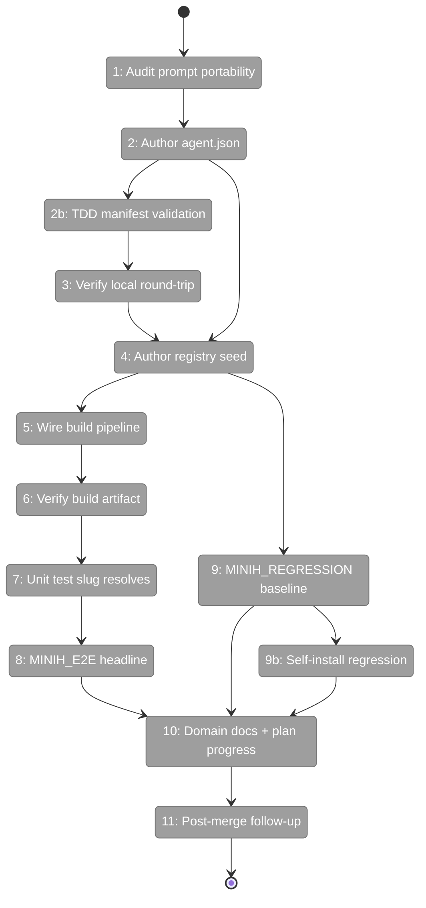
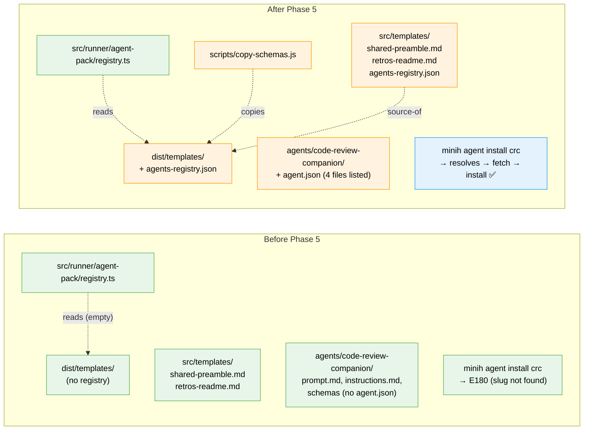

# Flight Plan: Phase 5 — Registry Seed + Dogfood

**Plan**: [`../../agent-pack-install-plan.md`](../../agent-pack-install-plan.md)
**Phase**: Phase 5: Registry seed + dogfood — `code-review-companion` end-to-end
**Generated**: 2026-05-03
**Status**: Ready for takeoff

---

## Departure → Destination

**Where we are**: Phase 1 + 3 + FX001 + FX002 shipped. The agent-pack module supports local install, real GitHub fetch via URL, info, list (installed), and the `--available` flag is wired but the registry catalog is empty (returns `[]`). `code-review-companion/` exists in the source repo with 4 files (`prompt.md`, `instructions.md`, `input-schema.json`, `output-schema.json`) but no `agent.json` manifest. The headline scenario `minih agent install code-review-companion` returns E180 (slug not found in registry).

**Where we're going**: A fresh-project user running `minih agent install code-review-companion` will have the canonical companion agent installed end-to-end against real GitHub. The bundled CLI ships `dist/templates/agents-registry.json` with one curated entry. `agents/code-review-companion/agent.json` becomes the canonical reference example for future agent authors. The curation principle (one-PR-at-a-time promotion; internal-only agents stay out) is enforced and regression-tested.

---

## Domain Context

### Domains We're Changing

| Domain | What Changes | Key Files |
|--------|-------------|-----------|
| `runner` (data) | NEW canonical manifest + bundled registry catalog | `agents/code-review-companion/agent.json`, `src/templates/agents-registry.json` |
| build pipeline (no domain) | Extend `copy-schemas.js` to ship the registry catalog | `scripts/copy-schemas.js` |
| `runner` (test) | Add unit + e2e tests for the bundled seed | `test/runner/agent-pack/registry-seed.test.ts`, `test/e2e/agent-pack-real-fetch.test.ts` |
| `cli` (test) | Add `MINIH_REGRESSION` baseline test | `test/cli/agent-list-baseline.test.ts` |
| `docs` | History rows + plan progress | `docs/domains/runner/domain.md`, `docs/domains/cli/domain.md`, `docs/plans/017-agent-pack-install/agent-pack-install-plan.md` |

### Domains We Depend On (no changes)

| Domain | What We Consume | Contract |
|--------|----------------|----------|
| `runner` (`agent-pack/registry.ts`) | Registry parsing + slug resolution | `readRegistryCatalog(path?)`, `resolveRegistrySlug(slug, catalog)`, `listRegistryAgents(catalog)` |
| `runner` (`agent-pack/manifest.ts`) | Manifest validation | `validateManifest(manifest)` |
| `runner` (`agent-pack/install.ts`) | Install orchestration with `source.type: 'registry'` | `installAgentPack({source: {type: 'registry', registrySlug, ...}, fetcher})` |
| `runner` (`agent-pack/fetcher.ts`) | Real GitHub tarball fetcher | `GitHubAgentPackFetcher.fetchTarball(url, ref)` |
| `cli` (`commands/agent.ts`) | Subcommand surface | `agent install`, `agent list --available`, `agent info <slug>` |

---

## Flight Status

<!-- Updated by /plan-6-v2: pending → active → done. Use blocked for problems/input needed. -->

**Legend**: grey = pending | yellow = active | red = blocked/needs input | green = done

---

## Stages

<!-- Updated by /plan-6-v2 during implementation: [ ] → [~] → [x] -->

- [x] **Stage 1: Audit prompt portability** — Sweep `prompt.md` + `instructions.md` for minih-internal paths (`agents/code-review-companion/prompt.md`, `agents/code-review-companion/instructions.md`)
- [~] **Stage 2: Author agent.json** — The canonical reference manifest with 4 files (`agents/code-review-companion/agent.json` — new file)
- [ ] **Stage 2b: TDD manifest validation** — Unit test runs `validateManifest()` against the canonical file (`test/runner/agent-pack/companion-manifest.test.ts` — new file)
- [ ] **Stage 3: Verify local install round-trip** — Manual smoke against built CLI (no new files; recorded in `execution.log.md`)
- [ ] **Stage 4: Author registry seed** — One curated entry, internal-only agents stay out (`src/templates/agents-registry.json` — new file)
- [ ] **Stage 5: Wire build pipeline** — Extend `copy-schemas.js` to ship the registry to `dist/templates/` (`scripts/copy-schemas.js`)
- [ ] **Stage 6: Verify build artifact** — Confirm `dist/templates/agents-registry.json` exists; `agent list --available` returns the seed (no new files)
- [ ] **Stage 7: Unit test slug resolves** — Vitest test reads source registry directly + resolves dogfood slug (`test/runner/agent-pack/registry-seed.test.ts` — new file)
- [ ] **Stage 8: MINIH_E2E headline** — Real GitHub install in tmp project; URL form pre-merge, slug form post-merge (`test/e2e/agent-pack-real-fetch.test.ts` — extend existing)
- [ ] **Stage 9: MINIH_REGRESSION baseline + duplicate-slug guard** — Snapshot of `agent list --available` output + dedup assertion (`test/cli/agent-list-baseline.test.ts` — new file)
- [ ] **Stage 9b: Self-install regression** — Verify `agent install code-review-companion` from inside the minih repo refuses (`test/cli/agent-install-self-protect.test.ts` — new file)
- [ ] **Stage 10: Domain docs + plan progress** — History rows + Phase Index ✅ + plan-level Flight Log entry (`docs/domains/runner/domain.md`, `docs/domains/cli/domain.md`, `docs/plans/017-agent-pack-install/agent-pack-install-plan.md`, `docs/plans/017-agent-pack-install/agent-pack-install.fltplan.md`)
- [ ] **Stage 11: Post-merge follow-up registration** — FX003 stub for `MINIH_E2E_PREMERGE` flip + `outside.md` authoring (followup tracker)

---

## Architecture: Before & After

**Legend**: existing (green, unchanged) | changed (orange, modified) | new (blue, created)

---

## Acceptance Criteria

- [ ] `agents/code-review-companion/agent.json` exists, validates via `validateManifest()`, lists exactly 4 files
- [ ] `src/templates/agents-registry.json` exists with exactly 1 entry (`code-review-companion`)
- [ ] After `npm run build`, `dist/templates/agents-registry.json` exists and matches source byte-for-byte
- [ ] `<built-cli> agent list --available` (no `MINIH_E2E` needed) returns the seed entry
- [ ] T003 manual local-install round-trip: `install → info → re-install no-op` works
- [ ] T007 unit test green: registry parses + slug resolves
- [ ] T008 MINIH_E2E test green (URL-form pre-merge OR slug-form post-merge)
- [ ] T009 `MINIH_REGRESSION=1 npm test` green; baseline matches seed
- [ ] Spec ACs verified at least once: AC1 (headline install), AC8 (list installed vs available), AC12 (curation enforced — internal agents return E180)
- [ ] `just fft` green
- [ ] No internal-only agents leaked into the registry (`smoke-test`, `convention-check`, etc. stay out)

## Goals & Non-Goals

**Goals**:
- One-command headline install works for `code-review-companion` in any fresh project
- Registry curation is exercised end-to-end and regression-tested
- The dogfood agent's `agent.json` is the canonical reference example
- Internal-only agents stay out of the bundled registry

**Non-Goals**:
- Authoring `outside.md` + 2 state schemas for the companion (deferred to FX003 followup)
- Promoting any other agent into the registry (one-at-a-time PR process)
- Phase 4 remainder (`agent remove` confirmation, `--check`/`--check-remote` flags)
- Phase 6 docs (`docs/how/agent-pack.md`, README "Agent Packs" section)

---

## Checklist

- [x] T001: Audit prompt + instructions for fresh-project portability
- [~] T002: Author `agents/code-review-companion/agent.json`
- [ ] T002b: TDD `validateManifest()` unit test for the canonical manifest
- [ ] T003: Verify FX001 local install round-trip against the new manifest
- [ ] T004: Create `src/templates/agents-registry.json` with 1 curated entry
- [ ] T005: Extend `scripts/copy-schemas.js` to copy registry to `dist/templates/`
- [ ] T006: Verify `npm run build` produces the bundled registry artifact
- [ ] T007: Add unit test that registry parses + slug resolves
- [ ] T008: MINIH_E2E gated headline e2e (URL-form pre-merge / slug-form post-merge) with timing budget
- [ ] T009: MINIH_REGRESSION-gated baseline + duplicate-slug guard
- [ ] T009b: Self-install regression (Spec AC11 coverage)
- [ ] T010: domain.md + plan progress + plan-level Flight Log entry
- [ ] T011: Post-merge follow-up registration (MINIH_E2E_PREMERGE flip + outside.md authoring)
