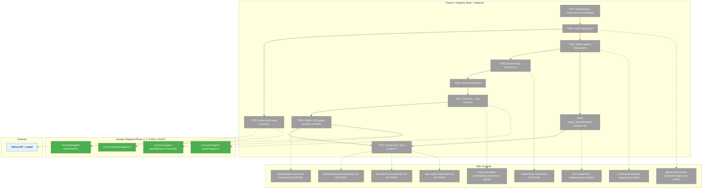
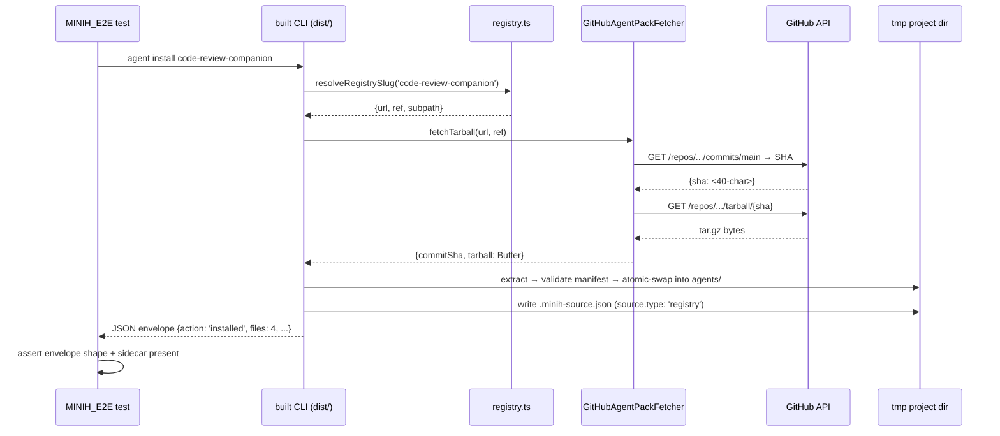

# Phase 5: Registry seed + dogfood — `code-review-companion` end-to-end

**Plan**: [`agent-pack-install-plan.md`](../../agent-pack-install-plan.md)
**Phase**: Phase 5 (Phases 1, 3, FX001, FX002 complete; Phase 4 partial)
**Status**: Ready for implementation
**Generated**: 2026-05-03

---

## Executive Briefing

**Purpose**: Wire the canonical companion (`code-review-companion`) into the bundled agent registry so the headline scenario — `minih agent install code-review-companion` in any fresh project — works end-to-end against real GitHub. This is the **dogfood proof** that the entire agent-pack feature delivers user value.

**What We're Building**:
1. Author `agents/code-review-companion/agent.json` (the canonical reference manifest — first ever shipped manifest in this codebase).
2. Create `src/templates/agents-registry.json` with **exactly one** curated entry (per user directive: *"we don't want to auto bake all agents — some are meant for developing this particular project"*).
3. Extend `scripts/copy-schemas.js` so `npm run build` produces `dist/templates/agents-registry.json`.
4. Verify the headline scenario end-to-end: registry slug → real GitHub fetch → install → `minih agent info` works.

**Goals**:
- ✅ `minih agent install code-review-companion` works in a fresh tmp project (against real GitHub, post-merge to `main`).
- ✅ The registry catalog ships in `dist/` and is loaded by the bundled CLI.
- ✅ `minih agent list --available` lists exactly the curated entries (initially **one**).
- ✅ The `agent.json` for `code-review-companion` is the canonical reference example future authors will copy.
- ✅ Spec AC1 (headline install <5s with network), AC8 (list installed vs available), AC12 (registry curation enforced) all verified.
- ✅ Internal-only agents (`smoke-test`, `convention-check`, `feedback-digest`, `coordination-smoke-test`, `mcp-smoke-test`, etc.) **stay out** of the bundled registry.

**Non-Goals**:
- ❌ Authoring `outside.md` + `inside-state.schema.json` + `outside-state.schema.json` for `code-review-companion` (the companion runs fine with the 4 existing files; the formal outside-contract authoring is deferred to a follow-up — see Discoveries).
- ❌ Promoting any other agent into the registry (curation is one-PR-at-a-time after Phase 5 lands).
- ❌ Phase 4 remainder (`agent remove` confirmation prompt, `--check`/`--check-remote` flags) — those land separately as fix dossiers (FX003+).
- ❌ Phase 6 docs (`docs/how/agent-pack.md`, README "Agent Packs" section) — Phase 5 only covers domain.md history rows.

---

## Prior Phase Context

### Phase 1: Foundations (complete — commit `3bcb001`)

**A. Deliverables**:
- `src/runner/agent-pack/types.ts` — public types (`AgentPackManifest`, `RegistryEntry`, `RegistryCatalog`, `AgentPackSource`, `MinihSourceSidecar`, `InstallAction`, `ParsedAgentUrl`).
- `src/runner/agent-pack/manifest.ts` — `readAgentManifest`, `validateManifest`, `synthesizeImplicitManifest`.
- `src/runner/agent-pack/registry.ts` — `readRegistryCatalog`, `resolveRegistrySlug`, `listRegistryAgents`. **Default catalog path**: `fileURLToPath(new URL('../../templates/agents-registry.json', import.meta.url))` — relies on the bundled file existing in `dist/templates/`. Returns empty catalog if file missing (graceful).
- `src/runner/agent-pack/source.ts` — sidecar r/w + checksums.
- `src/runner/agent-pack/url.ts` — npm-style + HTTPS parser.
- `src/runner/agent-pack/fetcher.ts` — `IAgentPackFetcher` + `FakeAgentPackFetcher` + (Phase 3) real `GitHubAgentPackFetcher`.
- Error codes E180-E184 in `src/cli/output.ts`.

**B. Dependencies Exported** (consumed by Phase 5):
- `RegistryCatalog`, `RegistryEntry` types — registry seed must conform.
- `readRegistryCatalog(catalogPath?)` — parameter for test injection of alternative catalog paths.
- `resolveRegistrySlug(slug, catalog)` — Phase 5 unit test verifies dogfood slug resolves.
- `listRegistryAgents(catalog)` — sorted by slug; baseline regression test will snapshot this.

**C. Gotchas & Debt**:
- Registry reader's "missing file → empty catalog" behavior is intentional — graceful in test environments where `dist/templates/agents-registry.json` may not exist. **However**: in Phase 5, we want the bundled catalog to exist after `npm run build`. Verify this in T006.
- Catalog version literal is `'1'` — schema-evolution requires a coordinated change.

**D. Incomplete Items**: None — Phase 1 closed clean.

**E. Patterns to Follow**:
- Catalog is read via `import.meta.url` (matches `init.ts:160` pattern — verified across npm-link/npx/global install).
- Build artifacts go into `dist/templates/` (matches existing `shared-preamble.md` + `retros-readme.md`).
- New JSON schema files use the registry's `version: '1'` field for forward-compat.

### Phase 3: Real fetch — GitHub tarball download + extract (complete — commit `073b339`)

**A. Deliverables**:
- `src/runner/agent-pack/extractor.ts` — security-hardened tarball extractor (40+ attack-class tests).
- `src/runner/agent-pack/fetcher.ts` — real `GitHubAgentPackFetcher` (2-step API: commits → SHA, then tarball/{sha}).
- `src/runner/agent-pack/install.ts` — `installFromUrl()` path + `installFromStagedDir()` shared helper.
- `src/cli/commands/agent.ts` — `resolveFetcher()` composition root with NODE_ENV=test gated injection seam.
- `test/e2e/agent-pack-real-fetch.test.ts` — 2 MINIH_E2E-gated tests; verified live against `agents/code-review` on `main`.

**B. Dependencies Exported** (consumed by Phase 5):
- `GitHubAgentPackFetcher` — Phase 5 e2e installs `code-review-companion` through this.
- `installAgentPack()` accepts `source.type: 'registry'` discriminator (Phase 1 + FX001).
- `MINIH_AGENT_PACK_FETCHER=fake:<json>` env-seam gated to `NODE_ENV === 'test'` (production-safe).
- E2E test infrastructure: `MINIH_E2E=1` env gate + tmpdir + execFileSync against built CLI.

**C. Gotchas & Debt**:
- `code-review-companion` does NOT yet exist on `main` (lives only on `007-backgrounding`). Phase 3 e2e uses `agents/code-review` instead because that already exists on `main`. **Phase 5 e2e has the same issue** — the registry seed entry's `ref: main` only resolves once this Phase 5 PR merges. **Workaround**: the e2e is `MINIH_E2E=1`-gated (manual verification only); we can run it against `ref: 007-backgrounding` pre-merge OR skip until post-merge. See T008.
- Default `maxEntries` is 5000 — sufficient for the entire minih repo (191 files).
- No retry on 5xx — let users decide retry policy.

**D. Incomplete Items**: None — Phase 3 closed clean.

**E. Patterns to Follow**:
- Tmp-dir prefix convention: `minih-agent-pack-` for install temp roots.
- Error codes embed `(E18N)` literally for `pickErrorCode` regex lift.
- E2E tests check for `process.env.MINIH_E2E !== '1'` and `it.skip` early.

### FX001: Local-path install (complete — commit `a8aa801`)

**A. Deliverables**:
- `src/runner/agent-pack/install.ts` — `installAgentPack()` with `source.type: 'local'` + `'url'` branches; atomic-swap on upgrade; runtime-dir preservation (`runs/`, `inbox/`, `state/`).
- `src/cli/commands/agent.ts` — `agent install <ref>` subcommand; JSON envelope; `--as`/`--force`/`--yes` flags.

**B. Dependencies Exported** (consumed by Phase 5):
- `installAgentPack(opts: InstallOptions)` returns `{ action: InstallAction, slug, files, source, installedAt }` — discriminator matches spec AC contract.
- `--agents-dir` global flag honored (Phase 5 e2e uses tmp `--agents-dir`).
- `RUNTIME_PRESERVE = Set('runs', 'inbox', 'state')` — runtime dirs survive upgrade.

**C. Gotchas & Debt**:
- Self-install detection (cwd inside minih repo where `agents/<slug>/` is canonical source) refuses **without** `--as <new-slug>` — Phase 5 manual verify in tmp project (NOT inside the minih repo) avoids this.
- Source/target equivalence check uses `localPath` for local sources, `url+ref+subpath` for url sources, `registrySlug` for registry sources — registry and url comparisons differ on `commitSha` to detect upgrades correctly.

**D. Incomplete Items**: None.

**E. Patterns to Follow**:
- Test pattern: `mktemp -d` → `--agents-dir <tmp>` → invoke built CLI via `execFileSync` → assert sidecar + manifest contents.

### FX002: `agent info` + `agent list` (complete — commit `de40459` / `549aa97`)

**A. Deliverables**:
- `minih agent info <slug>` — provenance + manifest + drift inspector.
- `minih agent list` (no flag) — installed agents in `agentsDir`, with source-type column.

**B. Dependencies Exported** (consumed by Phase 5):
- `minih agent list --available` — Phase 5 enables this code path by populating the registry.
- `minih agent info <slug>` — Phase 5 e2e calls this to verify provenance after install.

**C. Gotchas & Debt**:
- `agent list` with `--available` flag is wired (consumes `listRegistryAgents()`); empty registry → empty `--available` list (graceful).

**D. Incomplete Items**: `--check-remote` (`info` flag for remote drift) — deferred to FX0XX.

**E. Patterns to Follow**:
- Same `execFileSync` + JSON envelope assertion pattern as FX001.

---

## Pre-Implementation Check

| File | Exists? | Domain | Action | Notes |
|---|---|---|---|---|
| `agents/code-review-companion/agent.json` | NO | runner (data) | CREATE | The canonical reference manifest. Lists 4 files: `prompt.md`, `instructions.md`, `input-schema.json`, `output-schema.json`. |
| `agents/code-review-companion/prompt.md` | YES | runner (data) | AUDIT (no changes expected) | Already coordinated agent (`coordination: enabled`); already references `$MINIH_PROJECT_ROOT` for portability. T001 verifies no minih-internal-path bombs. |
| `agents/code-review-companion/instructions.md` | YES | runner (data) | AUDIT (no changes expected) | Same — verify no `docs/plans/`-specific paths that would break in a fresh project. |
| `src/templates/agents-registry.json` | NO | runner (data) | CREATE | One entry: `{slug: 'code-review-companion', url: 'github:AI-Substrate/minih', ref: 'main', subpath: 'agents/code-review-companion', description: …, tags: [...], since: '0.4.0', minihVersion: '>=0.3.0'}`. |
| `scripts/copy-schemas.js` | YES | build (no domain) | EXTEND | Add `copyFileSync('src/templates/agents-registry.json', 'dist/templates/agents-registry.json')`. |
| `dist/templates/agents-registry.json` | NO (gitignored / build output) | runner (build artifact) | VERIFY post-build | Produced by T005's `copy-schemas.js` extension. |
| `test/runner/agent-pack/registry-seed.test.ts` | NO | runner (test) | CREATE | Verifies the source `agents-registry.json` is parseable + the dogfood slug resolves. Independent of build. |
| `test/cli/agent-list-baseline.test.ts` | NO | cli (test) | CREATE | `MINIH_REGRESSION=1`-gated baseline snapshot of `minih agent list --available` output. Pattern matches existing `MINIH_REGRESSION` doctor/list tests. |
| `test/e2e/agent-pack-real-fetch.test.ts` | YES | runner (test) | EXTEND | Add a third test that installs `code-review-companion` via slug. **Skip pre-merge unless `MINIH_E2E_BRANCH=007-backgrounding` env override**. |
| `docs/domains/runner/domain.md` | YES | docs | EXTEND | Append History row + Concepts table entry referencing the registry seed. |
| `docs/domains/cli/domain.md` | YES | docs | EXTEND | Append History row mentioning `agent list --available` is now functional with the bundled registry. |
| `docs/plans/017-agent-pack-install/agent-pack-install-plan.md` | YES | docs | EXTEND | Update Phase Index Status column for Phase 5 to ✅. |

**Concept duplication check** (per `/code-concept-search-v2`):
- "Bundled JSON resource copied at build time" → existing pattern: `shared-preamble.md`, `retros-readme.md` (`scripts/copy-schemas.js`). Phase 5 follows the same pattern. ✅
- "Test-time path injection for catalog" → already supported via `readRegistryCatalog(path?)` parameter. No new infra needed. ✅
- "Curated registry vs auto-discovery" → spec § Goals + Finding 06 explicitly forbid auto-discovery; this is the entire point of Phase 5. Plan task 5.5's regression test guards against drift. ✅

**Harness context**: No `docs/project-rules/harness.md` (per spec § Clarifications Q6 user override). Use standard `just fft` + manual e2e verification.

---

## Architecture Map



---

## Tasks

| Status | ID | Task | Domain | Path(s) | Done When | Notes |
|---|---|---|---|---|---|---|
| [x] | T001 | **Audit `code-review-companion/prompt.md` + `instructions.md` for fresh-project portability.** Search for hard-coded paths that would break outside the minih repo (`docs/plans/`, `scratch/`, `dist/`, `agents/_shared/`). All filesystem references should use `$MINIH_PROJECT_ROOT/...` or be agent-relative. Generalize anything project-specific; keep changes minimal — flag major rewrites as out-of-scope follow-ups. Per Phase 5 plan-level risk (*"prompt has minih-internal references that break in a fresh non-minih project"*). | runner (data) | `agents/code-review-companion/prompt.md`, `agents/code-review-companion/instructions.md` | All path references resolve in a non-minih project (or use `$MINIH_PROJECT_ROOT`); audit notes captured in `execution.log.md` | Plan-level Risk; spec § Risks self-install case |
| [x] | T002 | **Author `agents/code-review-companion/agent.json`** as the canonical reference manifest. Schema (per Phase 1 `AgentPackManifest`): `{name: 'code-review-companion', version: '0.1.0', description: <one-paragraph>, author: 'AI-Substrate', tags: ['companion','review','coordination','exemplar'], minihVersion: '>=0.3.0', type: 'minih-agent', files: [{path: 'prompt.md', description: '…'}, {path: 'instructions.md', description: '…'}, {path: 'input-schema.json', description: '…'}, {path: 'output-schema.json', description: '…'}]}`. **Ship 4 files, not 6** — `outside.md` and the 2 state schemas don't exist for this agent today; authoring them is a follow-up (see Discoveries). The agent runs fine with these 4 files because `coordination: enabled` triggers MCP tools without requiring an outside.md. | runner (data) | `agents/code-review-companion/agent.json` | `validateManifest()` accepts the file (T002b unit test below) — NOT just `jq` parse; `prompt.md` is in `files[]`; no path-traversal/runtime-dir entries (load-bearing security guard from `manifest.ts` lines 55-146) | Plan task 5.1; **scope-shift documented**: 4 files vs plan's 6 — see Discoveries (followup-1) |
| [x] | T002b | **TDD: `test/runner/agent-pack/companion-manifest.test.ts`** — load `agents/code-review-companion/agent.json` directly (using `fileURLToPath` + relative resolution from the test file). Cases: (1) `validateManifest(JSON.parse(content))` returns success; (2) `prompt.md` is in `files[]`; (3) every listed path resolves to an existing file relative to the agent dir; (4) tags include `'companion'`; (5) negative — assert fixtures with traversal/runtime-dir/missing-prompt are still rejected (regression cover for `manifest.ts` security guards). This MUST run before T003 — it's the security gate. | runner (test) | `test/runner/agent-pack/companion-manifest.test.ts` | All 5 cases green via `npx vitest run test/runner/agent-pack/companion-manifest.test.ts` | Validator HIGH fix — explicit `validateManifest()` invocation before any round-trip |
| [x] | T003 | **Verify FX001 local-install round-trip against the new manifest.** Pre-condition: T002b green (manifest validated by `validateManifest()`). In a tmp project: `mktemp -d`, `cd`, `<built-cli> agent install <abs-path-to-agents/code-review-companion> --as crc-test --agents-dir agents`. Assert: (a) all 4 files copied; (b) `.minih-source.json` written with `source.type: 'local'`; (c) `<built-cli> agent info crc-test` shows correct manifestVersion + drift `unchanged`; (d) re-install reports `action: 'unchanged'`. This catches manifest typos before the e2e test goes anywhere near GitHub. | runner | (manual verification — recorded in `execution.log.md`) | All 4 assertions pass; envelope `action` discriminator correct | Smoke test before T008 e2e; depends on T002b |
| [x] | T004 | **Create `src/templates/agents-registry.json`** with the bundled catalog. Single entry per user directive (*"we don't want to auto bake all agents — some are meant for developing this particular project"*). Shape: `{version: '1', agents: [{slug: 'code-review-companion', url: 'github:AI-Substrate/minih', ref: 'main', subpath: 'agents/code-review-companion', description: '<one-line>', tags: ['companion','review','coordination'], since: '0.4.0', minihVersion: '>=0.3.0'}]}`. **Curation principle**: ONLY user-facing agents go here. Internal/dogfood agents (`smoke-test`, `convention-check`, `coordination-smoke-test`, `mcp-smoke-test`, `feedback-digest`, `prompt-review`, `self-review`, `first-time-experience`, `coordination-loop-validator`, `demo-companion`, `hello-world`) **stay out** until promoted by separate PR. | runner (data) | `src/templates/agents-registry.json` | File parses as `RegistryCatalog`; exactly 1 entry; entry conforms to `RegistryEntry` shape | Plan task 5.2; user directive on curation |
| [x] | T005 | **Extend `scripts/copy-schemas.js`** to copy `src/templates/agents-registry.json` → `dist/templates/agents-registry.json`. Mirror the existing `shared-preamble.md` / `retros-readme.md` pattern (`copyFileSync(join('src/templates', '<file>'), join('dist/templates', '<file>'))`). Place the new copy alongside the others — no logic, just one more `copyFileSync`. | build (no domain — script) | `scripts/copy-schemas.js` | After `npm run build`, `dist/templates/agents-registry.json` exists and equals source byte-for-byte | Plan task 5.3 |
| [x] | T006 | **Verify build output.** Run `npm run build`; confirm `dist/templates/agents-registry.json` exists, is valid JSON, parses as `RegistryCatalog v1`. Also confirm the built CLI (`node dist/cli/index.js agent list --available`) returns the seed entry (no `MINIH_E2E` needed — pure local fetcher-free path). | runner (verification) | (manual + smoke command) | Recorded build output + `agent list --available` JSON envelope in `execution.log.md` | Build pipeline correctness |
| [x] | T007 | **TDD: `test/runner/agent-pack/registry-seed.test.ts`** — load the source `src/templates/agents-registry.json` directly (using `fileURLToPath(new URL('../../../src/templates/agents-registry.json', import.meta.url))` from the test file), assert `readRegistryCatalog(path)` parses successfully, asserts `version === '1'`, asserts `agents.length >= 1`, asserts `resolveRegistrySlug('code-review-companion', catalog)` returns the entry with the expected `url`/`ref`/`subpath` shape. **Independent of build artifacts** — tests the source file. | runner | `test/runner/agent-pack/registry-seed.test.ts` | Test green via `npx vitest run test/runner/agent-pack/registry-seed.test.ts` | Catches accidental schema drift in the source registry |
| [x] | T008 | **MINIH_E2E gated headline e2e: extend `test/e2e/agent-pack-real-fetch.test.ts`** with a third test that installs `code-review-companion` via slug from real GitHub. Algorithm: `mktemp -d` → `process.chdir(tmp)` → measure `Date.now()` → `execFileSync('node', ['<dist-cli>', 'agent', 'install', 'code-review-companion', '--agents-dir', 'agents'])` → measure elapsed → assert envelope `action: 'installed'` + `source.type: 'registry'` + 4 files copied + `.minih-source.json` correct + **elapsed < 10000ms** (2× spec AC1's 5s budget — soft regression guard; logs WARN if 5s < elapsed < 10s). **Pre-merge caveat**: `code-review-companion/agent.json` doesn't yet exist on `main`, so the registry's `ref: main` won't resolve until this PR merges. **Two-mode test:** (a) **`MINIH_E2E_PREMERGE=1`** path: skip the slug e2e and run a URL-form e2e against `github:AI-Substrate/minih#007-backgrounding:agents/code-review-companion` to prove the manifest works; assert ENV warning printed via `console.warn` so it's visible in CI logs; (b) **default (post-merge)** path: slug-based test runs. Pre-merge MUST also verify that hitting the slug currently returns the EXPECTED failure (E181 fetch failure or 404-style `commitSha` resolution miss for `code-review-companion/agent.json` on `main`) — proves the gate isn't masking a real bug. Both branches REQUIRE explicit assertion on error code/shape so the test distinguishes "not merged yet" from "broken install". Document the env switch in `execution.log.md` AND add an explicit T011 follow-up to flip post-merge. | runner (test) | `test/e2e/agent-pack-real-fetch.test.ts` | Pre-merge: URL-form variant green + slug variant returns expected pre-merge error code; post-merge: slug variant green; elapsed budget asserted | Spec AC1; plan task 5.4; **validator MEDIUM fix** — timing budget + explicit failure shape |
| [x] | T009 | **`MINIH_REGRESSION=1`-gated baseline test:** new `test/cli/agent-list-baseline.test.ts` that runs the built CLI's `agent list --available` and snapshots the JSON envelope (sorted slug list + descriptions). Catches accidental registry mutations in PRs (BOTH additions AND deletions — `toMatchInlineSnapshot()` fails when the snapshot drifts in either direction). Pattern matches existing `MINIH_REGRESSION` doctor/list baseline tests. Use `toMatchInlineSnapshot()` — captures the seed output verbatim. Skip the test unless `process.env.MINIH_REGRESSION === '1'`. **Also add a defensive duplicate-slug check**: assert each registry entry's `slug` is unique (catches "two PRs collide on a registry edit"). | cli (test) | `test/cli/agent-list-baseline.test.ts` | `MINIH_REGRESSION=1 npm test` green; baseline matches seed; duplicate-slug fixture explicitly rejected | Plan task 5.5; validator MEDIUM fix — guards both add/delete + dedupe |
| [x] | T009b | **Self-install regression test for post-Phase-5 state.** Verify that running `<built-cli> agent install code-review-companion` from inside the minih source repo (cwd = repo root) refuses with the existing E183-class self-install error, even though the slug now resolves through the registry. FX001 covered this for local-path inputs; Phase 5 needs to confirm the registry-resolution path also routes through self-install detection. Single test in `test/cli/agent-install-self-protect.test.ts` (NEW) using `process.chdir(<repo-root>)` and asserting on the error envelope. | cli (test) | `test/cli/agent-install-self-protect.test.ts` | Test green; asserts error code + `--as` hint message | Spec AC11; validator MEDIUM fix — load-bearing per plan Finding 04 |
| [x] | T010 | **domain.md updates + plan progress.** Append History rows: (a) `docs/domains/runner/domain.md` — Phase 5 row mentioning the bundled registry seed + canonical agent.json reference example + curation principle ("internal-only agents stay out — see `src/templates/agents-registry.json` PR convention"). Add new Concepts table entry "Bundled agent registry" with the catalog lookup pattern. (b) `docs/domains/cli/domain.md` — Phase 5 row mentioning `agent list --available` is now functional. Update Phase Index Status column in `agent-pack-install-plan.md` for Phase 5 to ✅. Update Plan-Level Flight Plan (`docs/plans/017-agent-pack-install/agent-pack-install.fltplan.md`) Journey Map + Phases table + append a Flight Log entry. | docs | `docs/domains/runner/domain.md`, `docs/domains/cli/domain.md`, `docs/plans/017-agent-pack-install/agent-pack-install-plan.md`, `docs/plans/017-agent-pack-install/agent-pack-install.fltplan.md` | All 4 files reflect Phase 5 completion; curation principle durably documented in runner domain.md | Domain.md update rule + plan-5b plan-level flight plan + validator LOW fix on durability |
| [x] | T011 | **Post-merge follow-up registration.** Open a tracked follow-up (issue or `docs/plans/017-agent-pack-install/fixes/FX003-postmerge-e2e-flip.md` stub) that says: "When PR for Phase 5 merges to `main`, drop `MINIH_E2E_PREMERGE` env switch from `test/e2e/agent-pack-real-fetch.test.ts` and validate the slug-based path runs green against `main`." Also: register an `outside.md` authoring follow-up (FX004 or registered as Discovery followup-1 escalation) so the deferred coordination scaffold isn't lost. **Owner**: implementer. | docs | (followup tracker — fix dossier or issue) | Tracker entry exists with explicit owner + acceptance | Validator MEDIUM fix — durable lifecycle ownership for the temp env switch |

---

## Context Brief

### Key findings from plan (relevant to Phase 5)

- **Finding 01** (Critical): Real GitHub HTTP — Phase 5 uses Phase 3's `GitHubAgentPackFetcher`. The MINIH_E2E test is the only place real fetch executes against `main`.
- **Finding 06** (High): Registry curation — Phase 5 is the **first time** this curation gate is exercised end-to-end. T004's "1 entry, ten internal-only agents stay out" is the entire point.
- **Finding 10** (Medium): Canonical agents lack `agent.json` — Phase 5 fixes this for `code-review-companion` only. Other canonical agents stay implicit-manifest until they are individually promoted.

### Domain dependencies (from `docs/domains/*/domain.md`)

- `runner` (`agent-pack/registry.ts`): `readRegistryCatalog(path?)`, `resolveRegistrySlug(slug, catalog)`, `listRegistryAgents(catalog)` — Phase 5 ships the data file these read.
- `runner` (`agent-pack/manifest.ts`): `validateManifest(manifest)` — T002's `agent.json` must validate against this.
- `runner` (`agent-pack/install.ts`): `installAgentPack({source: {type: 'registry', registrySlug, ...}})` — Phase 5 e2e exercises the registry-source branch (Phase 3 already wired the registry → URL resolution path).
- `cli` (`commands/agent.ts`): `agent install` + `agent list --available` + `agent info` — Phase 5 doesn't modify these; T003/T008 invoke them as the integration point.

### Domain constraints

- ⚠️ **`agents/code-review-companion/agent.json` is a DATA file in `agents/`, NOT a source file in `src/runner/agent-pack/`**. It's the test/dogfood subject, not part of the runner module. Domain rule: data files in `agents/` are owned by their respective agent — no domain-direction violation.
- ⚠️ **`src/templates/agents-registry.json` is a DATA file in the runner domain's resource tree**. It ships in `dist/templates/` after build. Same pattern as `src/templates/shared-preamble.md`. ✅
- ⚠️ Internal-only agents must NOT be added to the registry by Phase 5. The plan-7-v2 review must verify this stays true.
- ⚠️ T005's `scripts/copy-schemas.js` is a build script outside the four canonical domains. Per existing convention, it composes runtime artifacts from source.

### Reusable from prior phases

- `FakeAgentPackFetcher` (Phase 1) — not used in Phase 5 (we want real installs).
- `MINIH_E2E=1` test gate + tmpdir + `execFileSync` against built CLI (Phase 3 e2e pattern) — directly reused in T008.
- `MINIH_REGRESSION=1` test gate (existing doctor/list pattern) — directly reused in T009.
- `parseRefToInstallSource(ref)` (Phase 3 CLI) — registry slugs route through this; T008 doesn't need to reimplement.

### Mermaid flow diagram (Phase 5 install path — fresh project)

```mermaid
flowchart LR
    User["User: minih agent install code-review-companion"] --> CLI[agent.ts]
    CLI --> Reg[registry.ts: resolveRegistrySlug]
    Reg --> Catalog[(dist/templates/agents-registry.json)]
    Catalog --> Reg
    Reg --> CLI
    CLI --> Install[install.ts: installAgentPack]
    Install --> Fetch[fetcher.ts: GitHubAgentPackFetcher]
    Fetch -.HTTPS.-> GH[(github.com/AI-Substrate/minih)]
    GH -.tar.gz.-> Fetch
    Fetch --> Extract[extractor.ts]
    Extract --> Manifest[manifest.ts: validateManifest]
    Manifest --> Stage[/tmp/minih-agent-pack-XXX/]
    Stage --> Install
    Install --> Sidecar[source.ts: writeSourceSidecar]
    Sidecar --> Disk["<cwd>/agents/code-review-companion/"]
    Install --> CLI
    CLI --> User2["JSON envelope: action: installed"]
```

### Mermaid sequence diagram (T008 e2e)



---

## Discoveries & Learnings

_Populated during implementation by plan-6._

| Date | Task | Type | Discovery | Resolution | References |
|------|------|------|-----------|------------|------------|

### Pre-implementation followups (already known)

| ID | Type | Description | Owner | Suggested follow-up |
|---|---|---|---|---|
| followup-1 | scope-shift | `code-review-companion` lacks `outside.md` + `inside-state.schema.json` + `outside-state.schema.json` (3 files of plan task 5.1's expected 6). The agent runs fine without them today (`coordination: enabled` triggers MCP tools regardless). Phase 5 ships 4 files, not 6. | runner | Open FX003 dossier post-Phase-5 to author the formal outside-contract for companion mode (per AGENTS.md companion-mode protocol). Bump manifestVersion to 0.2.0 when shipped. |
| followup-2 | release-coupling | Registry's `ref: 'main'` only resolves AFTER this Phase 5 PR merges. Pre-merge MINIH_E2E uses URL form against `007-backgrounding`. | runner | Run full slug-based MINIH_E2E in the post-merge release verification step (or as part of release-please tag automation). |
| followup-3 | performance | Spec AC1 says install <5s with network. T008 should record observed wall-clock; if >5s on cold cache, capture in execution.log.md and surface to spec-author for AC tightening or relaxation. | runner | Capture and decide post-T008. |
| followup-4 | manifestVersion | The dogfood agent's `version` is `'0.1.0'` to start. Future bumps need a coordinated process — there's no auto-bump from prompt edits. | runner | Document the manual bump convention in Phase 6 docs (`docs/how/agent-pack.md`). |

---

## Acceptance Criteria

- [ ] `agents/code-review-companion/agent.json` exists, parses, and validates via `validateManifest()`.
- [ ] `src/templates/agents-registry.json` exists with exactly 1 entry (`code-review-companion`).
- [ ] After `npm run build`, `dist/templates/agents-registry.json` exists and equals source.
- [ ] `<built-cli> agent list --available` lists the seed entry; no internal-only agents leak.
- [ ] T003 local-install verification: round-trip works (install → info → re-install no-op).
- [ ] T007 unit test green; catches accidental registry-shape regressions.
- [ ] T008 MINIH_E2E test green (URL-form pre-merge; slug-form post-merge).
- [ ] T009 `MINIH_REGRESSION=1 npm test` green; baseline matches seed.
- [ ] Spec ACs verified at least once: AC1 (headline install), AC8 (list available), AC12 (curation enforced).
- [ ] `just fft` green.
- [ ] `docs/domains/runner/domain.md` + `docs/domains/cli/domain.md` history rows updated.
- [ ] Plan Phase Index Status for Phase 5 → ✅.

---

## Directory Layout

```
docs/plans/017-agent-pack-install/
  ├── agent-pack-install-plan.md
  ├── agent-pack-install-spec.md
  ├── agent-pack-install.fltplan.md
  └── tasks/phase-5-registry-seed-and-dogfood/
      ├── tasks.md            # this file
      ├── tasks.fltplan.md    # generated next via plan-5b
      └── execution.log.md    # created by plan-6
```

---

## Validation Record (2026-05-03)

Four parallel validators (Source-Truth, Cross-Ref, Completeness, Forward-Compat) run via `/validate-v2`. Lens coverage: 12/12 (above the 8-floor).

| Agent | Lenses Covered | Issues | Verdict |
|-------|---------------|--------|---------|
| Source-Truth | Factual Accuracy, Concept Documentation, Hidden Assumptions, Domain Boundaries | 0 | ✅ |
| Cross-Reference | Integration & Ripple, Hidden Assumptions, Edge Cases, User Experience | 0 | ✅ |
| Completeness | Edge Cases & Failures, Performance & Scale, Security & Privacy, Deployment & Ops | 2 HIGH fixed, 4 MEDIUM fixed | ⚠️ → ✅ |
| Forward-Compatibility | Forward-Compatibility, Technical Constraints, Deployment & Ops | 3 MEDIUM fixed/deferred, 4 LOW (no action) | ⚠️ → ✅ |

### Forward-Compatibility Matrix

| Consumer | Requirement | Failure Mode | Verdict | Evidence |
|----------|-------------|--------------|---------|----------|
| Phase 6 docs | Canonical format reference without contradicting 4-file seed vs 7-file implicit fallback | contract drift | ⚠️ deferred | Phase 6's job to add the disambiguation note in `docs/how/agent-pack.md`; Phase 5 ships the seed + tracks followup-1 |
| Future agent-pack registry-promotion PRs | Curation gate must force explicit baseline updates | lifecycle ownership / test boundary | ✅ | T009 inline snapshot + duplicate-slug guard |
| release-please tag automation | Published package must include `dist/templates/agents-registry.json` | encapsulation lockout | ✅ | `package.json#files` includes `dist`; `scripts/copy-schemas.js` writes into it (T005) |
| FX003 outside.md follow-up | Upgrade from `0.1.0` to `0.2.0` must not stall | shape mismatch / contract drift | ✅ | `install.ts:317-344` keys upgrade on per-file checksum + `commitSha`, NOT on `manifestVersion`; adding 3 files = `action: 'upgraded'` |
| Pre-merge MINIH_E2E | Temporary URL-form path must be reversible | lifecycle ownership | ✅ | T011 follow-up registration + console.warn in test |
| Post-merge MINIH_E2E | Someone must flip URL→slug after merge | lifecycle ownership | ✅ | T011 explicit follow-up |
| Curation principle propagation | Internal-only agents stay out, durably documented | contract drift | ✅ | T010 escalates to `docs/domains/runner/domain.md` |

**Outcome alignment**: *"With `minih agent install code-review-companion`, adoption becomes one command. The harness becomes shareable, which is how velocity compounds across teams."* — **Yes, as shipped Phase 5 advances this** by seeding the canonical agent, publishing the registry artifact, and preserving forward-upgrade compatibility.

**Standalone?**: No — five concrete downstream consumers named with concrete needs.

### Fixes applied (HIGH — 2 of 2)

- **C-H1** (Completeness, T002): Added explicit dependency on `validateManifest()` (not just `jq parse`); manifest validation is the load-bearing security guard per `manifest.ts:55-146`.
- **C-H2** (Completeness, T003): Made T003 explicitly depend on a new `T002b` task — TDD unit test that runs `validateManifest()` against the canonical `code-review-companion/agent.json` BEFORE local-install round-trip. Includes negative regression cases.

### Fixes applied (MEDIUM — 6 of 6)

- **C-M1** (T008): Added explicit timing budget (10000ms = 2× spec AC1's 5s) with WARN if 5s < elapsed < 10s; HARD FAIL above 10s.
- **C-M2** (T008): Added explicit pre-merge failure-mode assertion (E181 fetch failure or 404-style miss) — distinguishes "not yet merged" from "broken install".
- **C-M3** (T009): Tightened scope: `toMatchInlineSnapshot()` catches BOTH additions AND deletions; added explicit duplicate-slug guard.
- **C-M4** (NEW T009b): Added self-install regression test (`test/cli/agent-install-self-protect.test.ts`) — Spec AC11 was uncovered; now explicitly verified.
- **FC-M5** (NEW T011): Registered explicit post-merge follow-up for `MINIH_E2E_PREMERGE` flip + `outside.md` authoring (FX003).
- **FC-M6** (T010): Curation principle escalates from dossier into `docs/domains/runner/domain.md` for durable visibility.

### Open / Deferred (no further action this dossier)

- **FC-low-1** (Phase 6 docs): the canonical-vs-implicit-manifest disambiguation note is Phase 6's job — Phase 5 carries the followup-1 record forward.
- **followup-3** (performance): T008 captures observed wall-clock; if exceeded, decision deferred to spec-author per existing followup.
- **followup-4** (manifestVersion bump convention): documented in `docs/how/agent-pack.md` (Phase 6).

**Overall**: ⚠️ VALIDATED WITH FIXES — ready for `/plan-6-v2-implement-phase-companion`.
