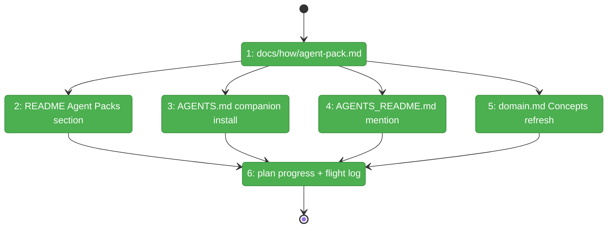

# Flight Plan: Phase 6 — Docs + Release Notes

**Plan**: [`../../agent-pack-install-plan.md`](../../agent-pack-install-plan.md)
**Phase**: Phase 6: Docs + release notes
**Generated**: 2026-05-03
**Status**: Landed

---

## Departure → Destination

**Where we are**: All code shipped (P1, FX001, FX002, P3, P5). `minih agent install code-review-companion` works end-to-end against real GitHub. But the feature is **invisible to users** — README has no mention; AGENTS.md still tells the LLM to hand-copy the companion folder; no how-to exists for users wanting to curate their own packs.

**Where we're going**: A user running `cat README.md | head -100` will see an "Agent Packs" section pointing them at `docs/how/agent-pack.md`. AGENTS.md tells the LLM to `minih agent install code-review-companion` (one less step than hand-copying). The how-to covers manifest format, security model, every error code, and common pitfalls. Final commit uses conventional `docs(plan-017):` so release-please picks it up cleanly.

---

## Domain Context

### Domains We're Changing
| Domain | What Changes | Key Files |
|--------|-------------|-----------|
| docs | NEW how-to + README extension + AGENTS.md/AGENTS_README.md edits | `docs/how/agent-pack.md`, `README.md`, `AGENTS.md`, `AGENTS_README.md` |
| docs (concepts) | Concepts table refresh | `docs/domains/runner/domain.md` |
| docs (plan) | Phase 6 → ✅; flight log | `docs/plans/017-agent-pack-install/*.md` |

### Domains We Depend On (no changes)
| Domain | What We Consume | Contract |
|--------|----------------|----------|
| runner (`agent-pack/*`) | Documentation reference for public contracts | `installAgentPack`, `IAgentPackFetcher`, `validateManifest`, etc. |
| build pipeline | `scripts/copy-schemas.js` ships `dist/AGENTS_README.md` | bundled artifact |

---

## Flight Status

**Legend**: grey = pending | yellow = active | red = blocked | green = done

---

## Stages

- [x] **Stage 1: Author docs/how/agent-pack.md** — full surface guide (manifest, sidecar, security, errors, pitfalls)
- [x] **Stage 2: README Agent Packs section** — 3-line demo + cross-link
- [x] **Stage 3: AGENTS.md companion install** — replace hand-copy snippet with `minih agent install`
- [x] **Stage 4: AGENTS_README.md getting started** — paragraph mentioning `agent` subcommand
- [x] **Stage 5: runner Concepts table** — add agent-pack entry
- [x] **Stage 6: Plan progress + flight log + final commit** — Phase 6 → ✅; conventional commit

---

## Acceptance Criteria

- [ ] `docs/how/agent-pack.md` exists, ≥10 sections, ≥1 code block per section
- [ ] README "Agent Packs" H2 discoverable (no scroll past 4 H2s)
- [ ] AGENTS.md uses `minih agent install` instead of hand-copy
- [ ] AGENTS_README.md install section mentions `agent` subcommand
- [ ] `dist/AGENTS_README.md` rebuilt
- [ ] domain.md Concepts has agent-pack entry
- [ ] All internal markdown links resolve
- [ ] `just fft` green
- [ ] Final commit uses `docs(plan-017):` conventional prefix

## Goals & Non-Goals

**Goals**: Make plan-017 user-discoverable; reduce companion setup by one step; document security model for trust.

**Non-Goals**: Code changes (Phase 4 remainder + FX003 deferred); migration guide for legacy hand-copy users.

---

## Checklist

- [x] T6.1: Author `docs/how/agent-pack.md`
- [x] T6.2: README "Agent Packs" section
- [x] T6.3: AGENTS.md companion-mode install
- [x] T6.4: AGENTS_README.md getting-started
- [x] T6.5: runner Concepts table refresh
- [x] T6.6: Plan progress + flight log + final commit
