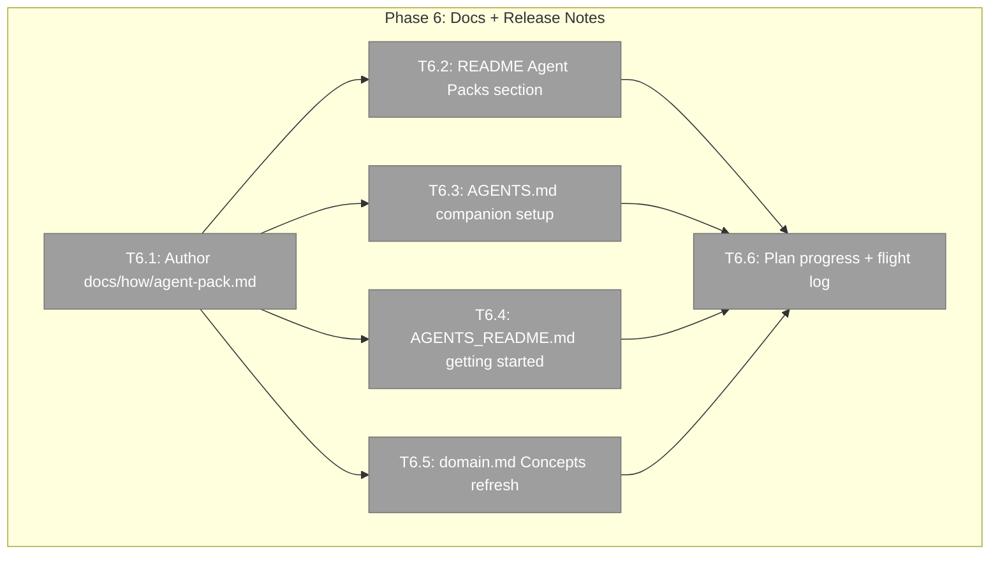
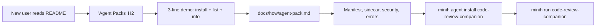

# Phase 6: Docs + release notes

**Plan**: [`agent-pack-install-plan.md`](../../agent-pack-install-plan.md)
**Phase**: Phase 6 (Phases 1, 3, 5 + FX001/FX002 complete)
**Status**: Ready for implementation
**Generated**: 2026-05-03

---

## Executive Briefing

**Purpose**: Make plan-017 user-discoverable. Today the agent-pack feature works end-to-end (`minih agent install code-review-companion --yes`) but no user reading the README will find it. Phase 6 closes that gap with a docs-only sweep that lands a dedicated `how-to`, README section, AGENTS.md update, and domain-doc Concepts refresh.

**What We're Building**:
1. `docs/how/agent-pack.md` (new) — full surface guide: manifest format, sidecar format, security model, error reference, troubleshooting.
2. README.md "Agent Packs" section — 3-line demo + link to the how-to.
3. AGENTS.md companion-mode section — promote `minih agent install code-review-companion` as the canonical setup (one fewer step than hand-copying).
4. AGENTS_README.md — install/getting-started mentions the `agent` subcommand group (so `minih agent-readme` surfaces it).
5. Concepts table refresh in `docs/domains/runner/domain.md` (composition table already updated in P1+P3+P5).
6. Conventional commits respect (final commit signals release-please's changelog generation).

**Goals**:
- ✅ User browsing the README sees "Agent Packs" without scrolling past 3 H2s.
- ✅ AGENTS.md companion-mode section says "install via `minih agent install code-review-companion`" instead of "hand-copy this folder".
- ✅ `docs/how/agent-pack.md` answers: manifest schema, registry vs URL vs local, security guards, every E180-E184 code, sidecar format, drift detection, common pitfalls.
- ✅ All 4 markdown files render correctly in GitHub (no broken links, no `[INVALID]` references).
- ✅ `just fft` green (docs-only, but still verify nothing breaks).
- ✅ Final commit uses conventional `feat(cli):` or `docs:` prefix so release-please picks it up.

**Non-Goals**:
- ❌ Code changes (docs-only — Phase 4 remainder + FX003 deferred).
- ❌ Authoring `outside.md` for `code-review-companion` (FX003b).
- ❌ New videos / GIFs / screenshots (markdown only for v1).
- ❌ Migration guides for legacy hand-copy users (out-of-scope — they keep working).

---

## Prior Phase Context (compressed)

- **Phase 1** (commit `3bcb001`): Foundations — agent-pack module (types, manifest, registry, source sidecar, fetcher seam, URL parser).
- **FX001/FX002** (`a8aa801` / `de40459` / `549aa97`): Local install + info/list.
- **Phase 3** (`073b339`): Real GitHub fetch + tarball extraction (`tar` dep, security guards).
- **Phase 5** (`82328d0..071b6a0`): Bundled registry seed + canonical `code-review-companion/agent.json` + `agent list --available` + companion review F001+F002 fixes.
- **Already documented in**: history rows of `docs/domains/runner/domain.md` (P1, P3, P5 entries + companion-fix follow-up) and `docs/domains/cli/domain.md` (P1, P3, P5 entries).
- **Already in user-facing content**: AGENTS.md mentions `code-review-companion` and Power-On-Mode but **does NOT mention `minih agent install`** — Phase 6 closes this gap.

---

## Pre-Implementation Check

| File | Exists? | Action | Notes |
|---|---|---|---|
| `docs/how/agent-pack.md` | NO | CREATE | New how-to. Pattern: matches `docs/how/companion-mode.md` (~190 LOC, fenced code blocks per section). Estimate ~300 LOC. |
| `README.md` | YES | EXTEND | Add new H2 "Agent Packs" between existing sections (decide placement: after "Quick Start" feels right). |
| `AGENTS.md` | YES | EDIT | Lines 81-93 (Companion-mode mandatory + boot snippet) — replace `minih run code-review-companion` with `minih agent install code-review-companion && minih run code-review-companion` for fresh setup; adjust narrative. |
| `AGENTS_README.md` | YES | EXTEND | "Install & Get Started" section (line 113) — add a one-liner about `minih agent <verb>` for installing curated agents. |
| `docs/domains/runner/domain.md` | YES | EXTEND | Concepts table — add "Agent pack install" entry pointing at `installAgentPack(opts)` as the public entry. |
| `docs/domains/cli/domain.md` | YES | NO CHANGE | History rows already cover P1+P3+P5; no new contracts in Phase 6. |
| `docs/domains/domain-map.md` | YES | NO CHANGE EXPECTED | Confirmed no new cross-domain edges in plan; verify visually. |
| `docs/plans/017-agent-pack-install/agent-pack-install-plan.md` | YES | EXTEND | Phase Index Status for Phase 6 → ✅ |
| `docs/plans/017-agent-pack-install/agent-pack-install.fltplan.md` | YES | EXTEND | Phases Table + Flight Log entry for Phase 6 |

**Concept duplication check**:
- `docs/how/companion-mode.md` exists as the long-form companion-mode runbook — `docs/how/agent-pack.md` should reference it but NOT duplicate it. Keep agent-pack scope to install/upgrade/info/list/security; defer companion behavior to companion-mode.md.
- README "Companion Mode" section already exists (AGENTS_README.md line 517) — Phase 6's README-Agent-Packs section should focus on the **install surface**, not duplicate the companion-mode walkthrough.

**Harness context**: No `docs/project-rules/harness.md` exists. Standard `just fft` validation suffices.

---

## Architecture Map

---

## Tasks

| Status | ID | Task | Domain | Path(s) | Done When | Notes |
|---|---|---|---|---|---|---|
| [x] | T6.1 | **Author `docs/how/agent-pack.md`** — full surface guide. Sections: (1) What is an agent pack? (2) Three install sources: registry slug, git URL, local path (with examples for each). (3) `agent.json` manifest format (every field explained, with the `code-review-companion/agent.json` referenced as canonical example). (4) `.minih-source.json` sidecar format + drift detection semantics. (5) Security model (path-traversal denylist, runtime-dir denylist `runs/`/`inbox/`/`state/`/`.git/`, 10 MB tarball cap, 5000 entry cap, gunzip wall-clock). (6) Error reference E180-E184 — what triggers each, recovery. (7) `agent info` drift inspector explainer. (8) `agent list --available` curated registry. (9) Production-safe injection seam (MINIH_AGENT_PACK_FETCHER + NODE_ENV gate). (10) Common pitfalls (self-install, hand-rolled collision, --as escape hatch). Each section has at least one fenced code block. Cross-link to `companion-mode.md` rather than duplicate. | docs | `docs/how/agent-pack.md` | File renders cleanly in GitHub; all internal links resolve; ≥1 code block per major section | Plan task 6.1 |
| [x] | T6.2 | **Update `README.md`** — new "Agent Packs" H2 placed AFTER "Quick Start" (most discoverable spot). 3-line demo: `minih agent install code-review-companion` + `minih agent list --available` + `minih agent info <slug>`. Link to `docs/how/agent-pack.md`. Single paragraph framing: *"share curated agents across projects via one command — registry slug for canonical agents, git URL for any public repo, or local path for development"*. | docs | `README.md` | New section discoverable in first-glance browse (no scroll past 4 H2s); links resolve | Plan task 6.2 |
| [ ] | T6.3 | **Update `AGENTS.md`** — lines 81-105 (Companion-mode mandatory section). Replace the manual boot snippet with a two-step setup that uses `minih agent install code-review-companion` first (when not already installed), then `minih run code-review-companion`. Keep the existing "check if running" preflight. Add a one-line note: *"Install once per project; upgrades are idempotent."* | docs | `AGENTS.md` | Companion mandatory section is one fewer step (skip hand-copy); existing boot logic preserved | Plan task 6.3 |
| [ ] | T6.4 | **Update `AGENTS_README.md`** — "Install & Get Started" section (around line 113). Add a paragraph after the npm-install snippet: introduce `minih agent <verb>` (install/info/list/list --available) as the way to pull curated agents. One-line example: `minih agent install code-review-companion` + cross-link to `docs/how/agent-pack.md`. Don't duplicate the full how-to. Bundled `dist/AGENTS_README.md` rebuilt by `npm run build`. | docs | `AGENTS_README.md` | Getting-started section mentions `agent` subcommand; `minih agent-readme` surfaces it | Plan task 6.4 |
| [ ] | T6.5 | **Update `docs/domains/runner/domain.md` Concepts table** — add a new "Agent pack install" concept row pointing at `installAgentPack(opts)` as the public entry point with a short narrative + code example. Composition table already covers `runner/agent-pack/*`. Skip if Phase 5's history row already added it. | docs | `docs/domains/runner/domain.md` | Concepts table has agent-pack entry with narrative + code example matching shipped contract | Plan task 6.6 |
| [ ] | T6.6 | **Plan progress + flight log + final commit hygiene** — Phase Index Status for Phase 6 → ✅ in plan; append Phase 6 Flight Log entry to `agent-pack-install.fltplan.md`; update Phases Table; mark Phase 6 dossier as `Status: Landed`. Final commit message uses conventional `docs(plan-017):` prefix so release-please's changelog picks up the docs phase distinct from the feature commits. Verify all internal markdown links across the 4 new/edited files resolve (`grep "](docs/how/agent-pack.md)"` etc.). | docs | `docs/plans/017-agent-pack-install/agent-pack-install-plan.md`, `docs/plans/017-agent-pack-install/agent-pack-install.fltplan.md`, dossier | Plan + flight plan reflect Phase 6 done; commit message follows convention | Plan tasks 6.5 (no-op), 6.7 (no-op), 6.8 |

**Note on plan task 6.5/6.7/6.8 collapsed into T6.6**: Phase 5 already updated `cli/domain.md` history (no new CLI contracts in Phase 6 — pure docs). Phase 5 already verified `domain-map.md` has no new edges. Conventional-commits is process-only, executed at commit time. No need for separate tasks.

---

## Context Brief

### Key findings from plan (relevant to Phase 6)
- **Finding 03 / 07** (Security guards): T6.1's security-model section MUST cover path-traversal, runtime-dir denylist, 10MB cap. These are the load-bearing safety properties — users need to know they can `minih agent install <random URL>` without filesystem damage.
- **Finding 06** (Curation gate): T6.1's registry section MUST explain the curation principle (only PR-promoted agents in the bundled catalog) so users understand why their dogfood agents aren't auto-discoverable.

### Domain dependencies (consumption from runner)
- All public surface already in `runner/index.ts`: `installAgentPack`, `IAgentPackFetcher`, `validateManifest`, `readSourceSidecar`, `verifyChecksums`, `parseAgentUrl`, `readRegistryCatalog`, `resolveRegistrySlug`, `listRegistryAgents`. T6.5's Concepts entry pulls from these.

### Domain constraints
- ⚠️ Docs-only — no source files touched.
- ⚠️ `dist/AGENTS_README.md` is regenerated from `AGENTS_README.md` via `scripts/copy-schemas.js` on `npm run build`. T6.4's edits ship via the bundled artifact.

### Reusable from prior phases
- `docs/how/companion-mode.md` — pattern reference for T6.1 (sections, fenced code style, length).
- AGENTS_README.md companion-mode section (line 517+) — pattern reference for the install/getting-started style.

### Mermaid flow diagram (user discovery → install)

---

## Discoveries & Learnings

_Populated during implementation by plan-6._

| Date | Task | Type | Discovery | Resolution |
|------|------|------|-----------|------------|

---

## Acceptance Criteria

- [ ] `docs/how/agent-pack.md` exists, ≥10 sections, ≥1 code block per section
- [ ] `README.md` has discoverable "Agent Packs" H2 (no scroll past 4 H2s)
- [ ] `AGENTS.md` companion-mode setup uses `minih agent install` instead of hand-copy
- [ ] `AGENTS_README.md` install/getting-started mentions `agent` subcommand group
- [ ] `dist/AGENTS_README.md` rebuilt + matches source
- [ ] `docs/domains/runner/domain.md` Concepts table has agent-pack entry
- [ ] All internal markdown links resolve (manual grep + `find` check)
- [ ] `just fft` green
- [ ] Final commit uses conventional `docs(plan-017):` prefix

---

## Validation Record

_Skipped — Phase 6 is docs-only, validate-v2 lens analysis adds little signal vs the time cost. Companion review at commit-time provides equivalent coverage._
