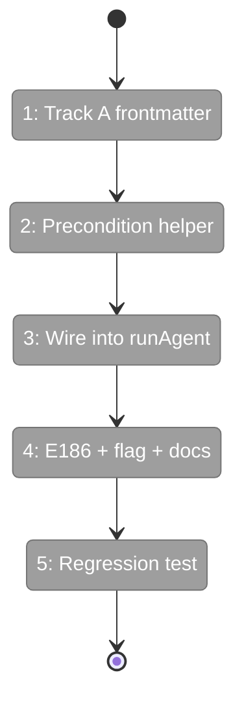
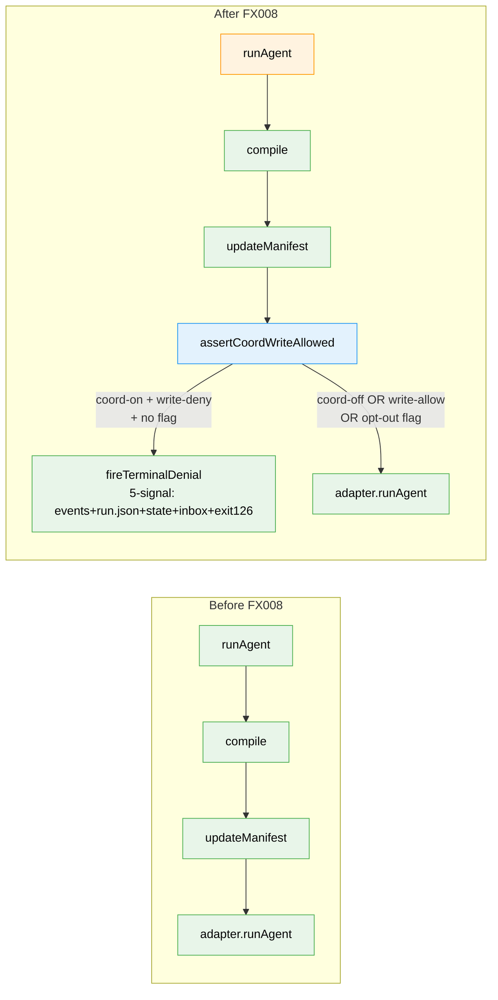

# Flight Plan: Fix FX008 — Boot precondition for coordination + write:deny mismatch

**Fix**: [FX008-coordination-write-precondition.md](./FX008-coordination-write-precondition.md)
**Plan**: [agent-permissions-plan.md](../agent-permissions-plan.md)
**Source issue**: [#25](https://github.com/AI-Substrate/minih/issues/25)
**Generated**: 2026-05-04
**Status**: Ready for takeoff

---

## What → Why

**Problem**: Coordinated agents (`coordination: enabled`) booted under any preset that denies `write` are structurally broken — they can't write the canonical farewell envelope at `output/report.json`, but minih boots them anyway and lets them burn 7200 s of timeout before exiting cleanly with no envelope. Operators see no signal until ~14 minutes after a useless briefing, when manual pid-diagnosis reveals the silent failure.

**Fix**: At runner boot — immediately after `compile()` resolves the permission policy — refuse to start any `coordination: enabled` run whose resolved policy denies `write`, unless operator passes `--allow-coord-write-deny`. Failure fires the existing 5-signal denial protocol with new error code E186 and an actionable remediation message. Plus: add `write: allow` to the canonical `code-review-companion/prompt.md` overrides so fresh installs and upgrades stop tripping the guard.

---

## Domain Context

| Domain | Relationship | What Changes |
|--------|-------------|-------------|
| `runner` (permissions) | owns precondition | New `assertCoordWriteAllowed()` helper; called from `runAgent` |
| `cli` | exposes operator opt-out | `--allow-coord-write-deny` flag on `minih run`; E186 error code |
| `agents/code-review-companion` | canonical pack update | One-line frontmatter override (Track A) |

**Domains we depend on (no changes)**:

| Domain | What We Consume | Contract |
|--------|----------------|----------|
| `runner/permissions` | `compile()`, `resolvePreset()`, `fireTerminalDenial()`, `PermissionDenialReason['kind']` enum (additive extension) | Workshop 002 § Q1 5-signal protocol |
| `runner/folder` | `coordinationRunLocation()`, `inboxLanePath()`, `stateFilePath()` | Run-folder layout contract |

---

## Flight Status

<!-- Updated by /plan-6-v2: pending → active → done. Use blocked for problems/input needed. -->

**Legend**: grey = pending | yellow = active | red = blocked/needs input | green = done

---

## Stages

<!-- Updated by /plan-6-v2 during implementation: [ ] → [~] → [x] -->

- [ ] **Stage 1: Track A — canonical frontmatter** — add `write: allow` to `permissions.overrides` (`agents/code-review-companion/prompt.md` — existing file, one new line)
- [ ] **Stage 2: Precondition helper** — `assertCoordWriteAllowed()` pure-function with 6 unit tests (`src/runner/permissions/coord-write-precondition.ts` — new file)
- [ ] **Stage 3: Wire into runAgent** — call site after `updateManifest({permissions:...})`; `PermissionDenialReason['kind']` extends with `'coord-write-deny'`; existing `fireTerminalDenial` path drives 5-signal output (`src/runner/runner.ts`, `src/runner/permissions/handler.ts`)
- [ ] **Stage 4: E186 code + opt-out flag + docs** — register E186; add `--allow-coord-write-deny` to `minih run`; update `docs/how/permissions.md` § Coordinated agents + cross-link from `companion-mode.md` (`src/cli/output.ts`, `src/cli/commands/run.ts`, `src/runner/types.ts`, `docs/how/permissions.md`, `docs/how/companion-mode.md`)
- [ ] **Stage 5: Regression test** — `test/cli/run-coord-write-deny.test.ts` (new) + companion envelope smoke (`test/agents/companion-output-envelope.test.ts` — new); 3 cases per AC-FX8.2/AC-FX8.5/AC-FX8.6

---

## Architecture: Before & After

**Legend**: existing (green, unchanged) | changed (orange, modified) | new (blue, created)

---

## Acceptance Criteria

- [ ] **AC-FX8.1** Track A — companion frontmatter `permissions.overrides.write: allow`; envelope writes succeed on idle-budget exit
- [ ] **AC-FX8.2** Boot precondition fires for `coordination: enabled` + `write: deny` (no opt-out flag)
- [ ] **AC-FX8.3** 5-signal coverage: events.ndjson + run.json `terminalReason` + inside-state `error` + inside-inbox `permission-error` + exit 126
- [ ] **AC-FX8.4** Error message includes slug, presetName, source provenance, three remediation paths, and `permissions reset` hint when source is `sidecar.lockedDefault`
- [ ] **AC-FX8.5** `--allow-coord-write-deny` flag on `minih run` boots normally even when policy denies write
- [ ] **AC-FX8.6** Coordination-disabled agents with `write: deny` boot normally (precondition only fires for `coordination: enabled`)
- [ ] **AC-FX8.7** Additive enum extension — `PermissionDenialReason['kind']` adds `'coord-write-deny'` without breaking existing handlers
- [ ] **AC-FX8.8** Opt-out flag is per-run only — no `MINIH_ALLOW_COORD_WRITE_DENY` env-var fallback

## Goals & Non-Goals

**Goals**: Turn a 14-minute silent failure into a sub-second actionable error. Surface the failure across every canonical surface (events / run.json / inside-state / inside-inbox / exit code). Give operators three clear remediation paths in the error message itself. Make the canonical companion bootable out-of-the-box without manual frontmatter edits.

**Non-Goals**: Auto-fix the resolved policy (refuses, doesn't rewrite). Implement `$MINIH_OUTPUT_PATH` auto-narrowing (deferred to FX010). Detect / repair stale local installs (separate pack-drift issue). Migrate any existing run.json. Become a per-tool runtime check (compile-time policy precondition only).

---

## Checklist

- [ ] FX008-1: Add `write: allow` to canonical companion frontmatter
- [ ] FX008-2: Implement `assertCoordWriteAllowed()` precondition + 6 unit tests
- [ ] FX008-3: Wire precondition into `runAgent`; extend `PermissionDenialReason['kind']` additively
- [ ] FX008-4: Allocate E186; document in `output.ts` and `permissions.md`
- [ ] FX008-5: Add `--allow-coord-write-deny` flag to `minih run`
- [ ] FX008-6: Regression test `run-coord-write-deny.test.ts` + companion envelope smoke
- [ ] FX008-7: Update `docs/how/permissions.md` + cross-link `docs/how/companion-mode.md`
