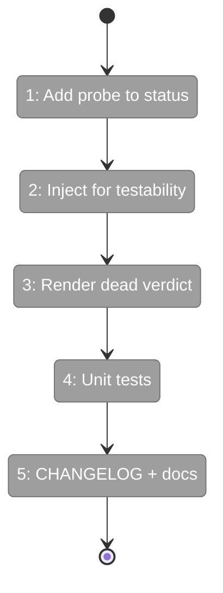
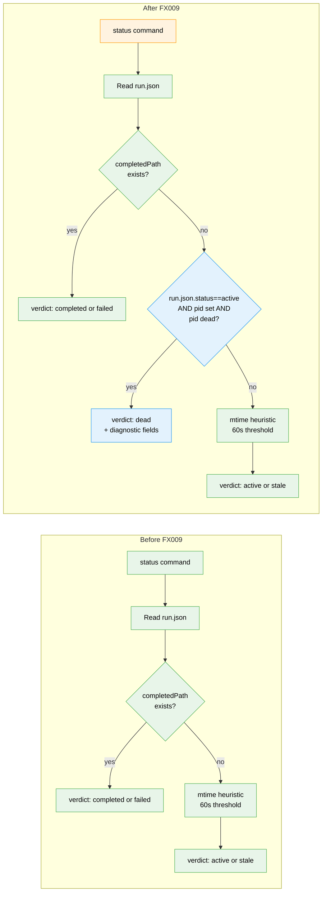

# Flight Plan: Fix FX009 — `minih status` pid-liveness probe

**Fix**: [FX009-status-pid-probe.md](./FX009-status-pid-probe.md)
**Plan**: [agent-permissions-plan.md](../agent-permissions-plan.md)
**Source issue**: [#24](https://github.com/AI-Substrate/minih/issues/24)
**Generated**: 2026-05-04
**Status**: Ready for takeoff

---

## What → Why

**Problem**: `minih status` uses a 60-second `events.ndjson` mtime heuristic to decide `verdict: 'active'`. Runs whose pid has exited mid-stream stay reported as active for up to 60 s — and orchestrator polling on `verdict == 'active'` selects dead `runId`s and sends briefings into the void. Real-world cost: 14 m 27 s of wasted briefing-then-diagnosis time in Chainglass's repro.

**Fix**: Lift `isProcessAliveDefault` (already exported from `src/runner/index.ts`, used by `attach`/`view` since the prior FX009 era) into `src/cli/commands/status.ts`. When `run.json.status === 'active'` and `run.json.pid` is set, gate `verdict: 'active'` on the pid probe. Dead pid → `verdict: 'dead'` immediately, on the very next status poll.

Read-only. Healing is FX011 `minih reconcile`'s job.

---

## Domain Context

| Domain | Relationship | What Changes |
|--------|-------------|-------------|
| `cli/commands/status` | adds pid probe to verdict resolution | New `else if` clause; new JSON fields when verdict is `'dead'`; new TTY rendering for `'dead'` |

**Domains we depend on (no changes)**:

| Domain | What We Consume | Contract |
|--------|----------------|----------|
| `runner` | `isProcessAliveDefault(pid: number): boolean` | Already exported from `src/runner/index.ts:190` |

---

## Flight Status

**Legend**: grey = pending | yellow = active | red = blocked/needs input | green = done

---

## Stages

- [ ] **Stage 1: Add pid probe to status verdict chain** — new `else if` between `completedPath` and `eventsPath` checks (`src/cli/commands/status.ts`)
- [ ] **Stage 2: Inject `isProcessAlive` for testability** — match the pattern in `run-resolver.ts:62` (`src/cli/commands/status.ts`)
- [ ] **Stage 3: Render `'dead'` verdict** — TTY red ✗ + remediation hint; JSON envelope adds diagnostic fields conditionally (`src/cli/commands/status.ts`)
- [ ] **Stage 4: Unit tests — 5 cases** (`test/cli/status-pid-probe.test.ts` — new file)
- [ ] **Stage 5: CHANGELOG entry + companion-mode.md polling note** (`CHANGELOG.md`, `docs/how/companion-mode.md`)

---

## Architecture: Before & After

**Legend**: existing (green, unchanged) | changed (orange, modified) | new (blue, created)

---

## Acceptance Criteria

- [ ] **AC-FX9.1** Dead pid → `verdict: 'dead'` within one `status` call (no 60 s window)
- [ ] **AC-FX9.2** Read-only — `run.json` checksum unchanged before/after probe
- [ ] **AC-FX9.3** Completed runs → `verdict: 'completed'` (probe NOT consulted)
- [ ] **AC-FX9.4** Missing `pid` field → falls through to mtime heuristic
- [ ] **AC-FX9.5** `isProcessAlive` injection works (no hidden globals)
- [ ] **AC-FX9.6** JSON envelope has diagnostic fields ONLY when verdict is `'dead'`
- [ ] **AC-FX9.7** TTY display: red `✗` + hint pointing at `minih reconcile <slug>` (or "coming soon" if FX011 not yet shipped)
- [ ] **AC-FX9.8** CHANGELOG entry with orchestrator migration note

## Goals & Non-Goals

**Goals**: Cut Chainglass's 14-m-27-s window down to one status poll. Stay read-only — `status` is a fast read; healing belongs in FX011. Match the FX009-prior probe semantics already in use by `attach`/`view`.

**Non-Goals**: Mutate `run.json`. Race-safe concurrent writes. Cross-host pid probe. Heal `run.json.status` to `'crashed'`. Surface synthetic events for the death (FX012's job).

---

## Checklist

- [ ] FX009-1: Import `isProcessAliveDefault`; add resolution clause
- [ ] FX009-2: Inject for testability
- [ ] FX009-3: Render `'dead'` in TTY + JSON envelope
- [ ] FX009-4: Unit tests — 5 cases
- [ ] FX009-5: CHANGELOG + companion-mode.md polling note
