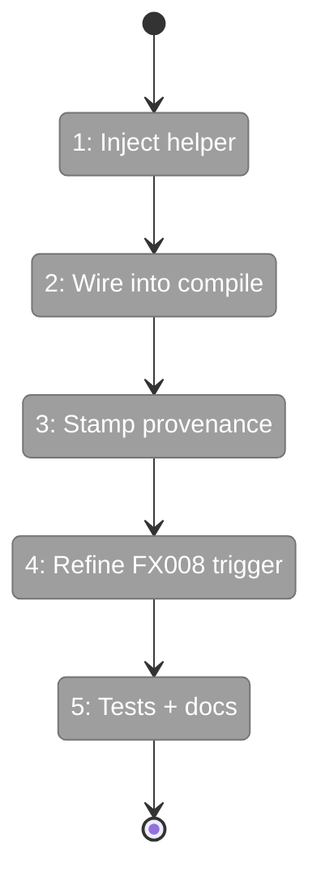
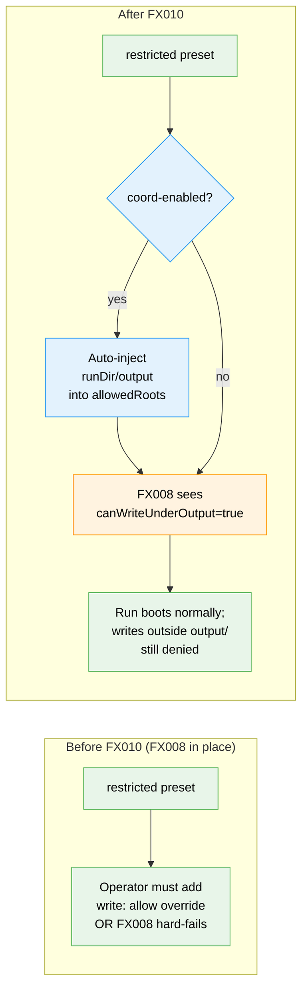

# Flight Plan: Fix FX010 — `restricted` preset + `$MINIH_OUTPUT_PATH` auto-narrowing

**Fix**: [FX010-restricted-output-auto-narrow.md](./FX010-restricted-output-auto-narrow.md)
**Plan**: [agent-permissions-plan.md](../agent-permissions-plan.md)
**Source issue**: [#25](https://github.com/AI-Substrate/minih/issues/25) (suggested fix #1)
**Generated**: 2026-05-04
**Status**: DEFERRED — depends on FX008

---

## What → Why

**Problem**: Even after FX008, coordinated agents under `restricted` need a `write: allow` override that's globally permissive — wider than the actual contract requires. The contract is "write `output/report.json`"; the override is "write anywhere".

**Fix**: Inject `<runDir>/output/` into the resolved `allowedRoots` when the run is `coordination: enabled` AND the preset is in the restricted-family (`restricted`, `read-only`, `network`). The policy-layer `decisions.write === 'deny'` becomes "deny except for output/", which matches the documented contract precisely and keeps the security posture tight.

---

## Domain Context

| Domain | Relationship | What Changes |
|--------|-------------|-------------|
| `runner/permissions/compile` | adds auto-injection step | `injectCoordOutputRoot()` helper called after `canonicalizeRoots` |
| `runner/permissions/coord-write-precondition` (FX008) | trigger refinement | Replaces `decisions.write === 'deny'` with `!canWriteUnderOutput(policy, runDir)` |

**Domains we depend on (no changes)**:

| Domain | What We Consume | Contract |
|--------|----------------|----------|
| `runner/permissions/fs-guard` | allowedRoots check (already in place) | Workshop 001 § Q5 allowedRoots composition |

---

## Flight Status

---

## Stages

- [ ] **Stage 1: `injectCoordOutputRoot()` helper** — pure function (`src/runner/permissions/compile.ts`)
- [ ] **Stage 2: Wire into `compile()`** — call after `canonicalizeRoots`; gated on coord-enabled + restricted-family preset
- [ ] **Stage 3: Provenance in run.json** — `permissions.coordOutputAutoAllowed: true` field surfaced in `minih status` (`src/runner/runner.ts`)
- [ ] **Stage 4: Refine FX008 trigger** — `canWriteUnderOutput()` replaces `decisions.write === 'deny'` (`src/runner/permissions/coord-write-precondition.ts`)
- [ ] **Stage 5: Tests + CHANGELOG + permissions.md** — coverage of four-corner matrix; cross-link from companion-mode.md

---

## Architecture: Before & After

---

## Acceptance Criteria

- [ ] **AC-FX10.1** Coord-enabled + `restricted` writes to `<runDir>/output/` succeed without `write: allow` override
- [ ] **AC-FX10.2** Writes to ANY OTHER path under same setup still fire 5-signal denial
- [ ] **AC-FX10.3** Non-coordinated runs under `restricted` unaffected
- [ ] **AC-FX10.4** `run.json.permissions.coordOutputAutoAllowed: true` provenance recorded
- [ ] **AC-FX10.5** FX008 precondition correctly handles post-FX010 case (no false fires)

## Goals & Non-Goals

**Goals**: Make `restricted` semantically usable for coord-enabled agents without forcing operators to broaden the write-allow scope. Keep the security posture as tight as the contract permits.

**Non-Goals**: Loosen `restricted` for non-coordinated agents. Auto-allow writes outside `output/`. Remove the FX008 precondition. Provide per-tool path narrowing (the auto-injection is at the directory level only).

---

## Checklist

- [ ] FX010-1: `injectCoordOutputRoot()` helper
- [ ] FX010-2: Wire into `compile()`
- [ ] FX010-3: Provenance in `run.json`
- [ ] FX010-4: FX008 trigger refinement
- [ ] FX010-5: Tests
- [ ] FX010-6: CHANGELOG + permissions.md

## Dependencies

- **FX008** must land first (precondition surface). FX010-4 depends on FX008's `coord-write-precondition.ts` existing.
