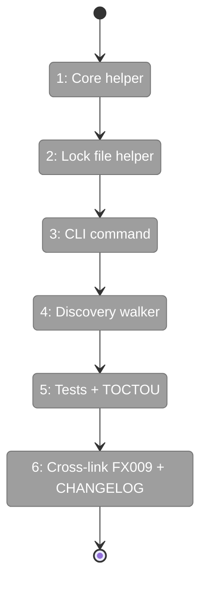
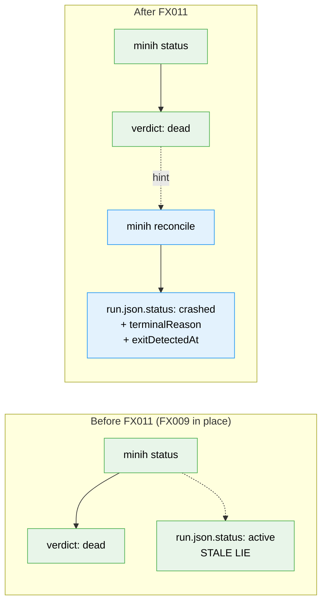

# Flight Plan: Fix FX011 — `minih reconcile`

**Fix**: [FX011-minih-reconcile.md](./FX011-minih-reconcile.md)
**Plan**: [agent-permissions-plan.md](../agent-permissions-plan.md)
**Source issue**: [#24](https://github.com/AI-Substrate/minih/issues/24)
**Generated**: 2026-05-04
**Status**: DEFERRED — sister fix to FX009

---

## What → Why

**Problem**: After FX009 makes `minih status` return `verdict: 'dead'` for dead-pid runs, the underlying `run.json.status` still says `'active'`. Read-only `status` is correct, but tools that walk `run.json` directly (CI, retros, future minih commands) keep seeing the lie.

**Fix**: New idempotent `minih reconcile` command — opt-in healer. Walks dead-pid runs, atomically rewrites `run.json` to `status: 'crashed'` with `terminalReason: 'pid-vanished'` + `exitDetectedAt`. Single-writer-per-rundir via lock file + atomic rename. Safe to run from cron / pre-commit / system-restart hooks.

---

## Domain Context

| Domain | Relationship | What Changes |
|--------|-------------|-------------|
| `cli/commands/reconcile` (NEW) | new command | `src/cli/commands/reconcile.ts` |
| `runner/reconcile` (NEW helper) | core logic | `src/runner/reconcile.ts` + `src/runner/reconcile-lock.ts` |

**Domains we depend on (no changes)**:

| Domain | What We Consume | Contract |
|--------|----------------|----------|
| `runner` | `isProcessAliveDefault` | Re-uses FX009-prior infrastructure |

---

## Flight Status

---

## Stages

- [ ] **Stage 1: `reconcileRun()` core helper** — pure, injectable clock + probe + lock (`src/runner/reconcile.ts` — new)
- [ ] **Stage 2: Lock file helper** — `O_CREAT | O_EXCL` + ttl-based stale steal (`src/runner/reconcile-lock.ts` — new)
- [ ] **Stage 3: `minih reconcile` command** — CLI wiring + JSON envelope output (`src/cli/commands/reconcile.ts` — new, `src/cli/index.ts`)
- [ ] **Stage 4: `--all` discovery walker** — async generator, streams (`src/cli/commands/reconcile.ts`)
- [ ] **Stage 5: Tests — 7 cases + TOCTOU regression** (`test/cli/reconcile.test.ts` — new)
- [ ] **Stage 6: FX009 hint cross-link + CHANGELOG** (`CHANGELOG.md`, FX009 dossier hint string)

---

## Architecture: Before & After

---

## Acceptance Criteria

- [ ] **AC-FX11.1** `minih reconcile <slug>` heals stale-active runs
- [ ] **AC-FX11.2** `--all` walks all slugs deterministically
- [ ] **AC-FX11.3** `--dry-run` writes nothing (verified by checksum)
- [ ] **AC-FX11.4** Concurrent invocations race-safe (lock + atomic rename)
- [ ] **AC-FX11.5** TOCTOU re-check under lock prevents lost-update
- [ ] **AC-FX11.6** Stale locks (ttl elapsed) stolen automatically
- [ ] **AC-FX11.7** `'crashed'` status documented as additive
- [ ] **AC-FX11.8** TTY summary readable; JSON envelope machine-parsable

## Goals & Non-Goals

**Goals**: Heal stale `run.json` files deterministically. Pure single-writer semantics. Idempotent — converges in two passes worst case. Compose cleanly with FX009 (status hints at it).

**Non-Goals**: Auto-reconcile at boot. Heal events.ndjson truncation (FX012's domain). GC old run dirs. Cross-host. Heal `completed.json`-mismatched runs (separate bug).

---

## Checklist

- [ ] FX011-1: `reconcileRun()` core helper
- [ ] FX011-2: Lock file helper
- [ ] FX011-3: `minih reconcile` command
- [ ] FX011-4: `--all` discovery walker
- [ ] FX011-5: Unit tests — 7 cases
- [ ] FX011-6: TOCTOU regression test
- [ ] FX011-7: Cross-link FX009 + CHANGELOG

## Dependencies

- **Independent** of FX008/FX010/FX012.
- **Coordinated landing with FX009** — FX009 hint string targets `minih reconcile`.
