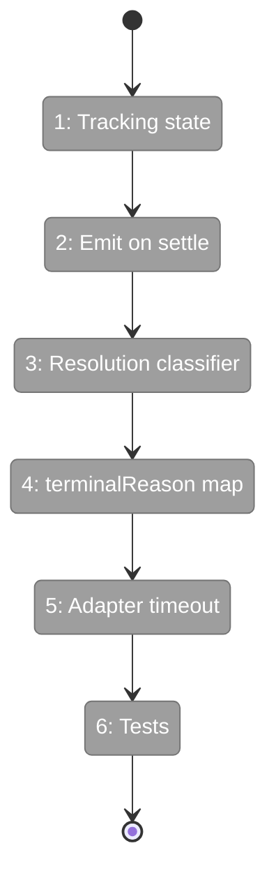
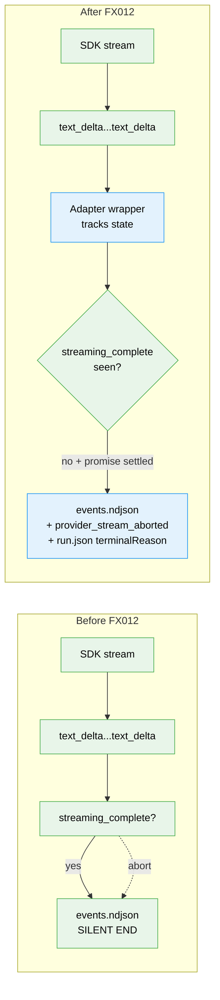

# Flight Plan: Fix FX012 — `provider_stream_aborted` synthetic event

**Fix**: [FX012-provider-stream-aborted.md](./FX012-provider-stream-aborted.md)
**Plan**: [agent-permissions-plan.md](../agent-permissions-plan.md)
**Source issue**: [#24](https://github.com/AI-Substrate/minih/issues/24)
**Generated**: 2026-05-04
**Status**: DEFERRED — observability layer for the bug surfaced in issue #24

---

## What → Why

**Problem**: When the SDK provider stream truncates mid-tokens (concurrent contention, transport drop, provider OOM), the events.ndjson ends in mid-`text_delta` with no terminal marker. Live `tail` users see a frozen stream and have no idea why; post-mortem tools have to re-derive death conditions.

**Fix**: Adapter-side synthetic `provider_stream_aborted` event on SDK promise settlement when the latest messageId has no `streaming_complete`. Schema verbatim from Chainglass: `lastMessageId`, `lastDeltaContent` (80-byte truncated), `totalBytesEmitted`, `elapsedSinceFirstDeltaMs`, `sdkResolution` (4-value enum), `pidAtAbort`, `pidAliveAfterAbort`. Single source of truth — every consumer benefits.

---

## Domain Context

| Domain | Relationship | What Changes |
|--------|-------------|-------------|
| `adapter/sdk-copilot` | tracking + synthetic emit | New state fields + emit on settle |
| `adapter/events` | new event type | Schema additive |
| `runner` | maps to terminalReason | `'provider-stream-aborted'` value (additive enum) |

**Domains we depend on (no changes)**:

| Domain | What We Consume | Contract |
|--------|----------------|----------|
| `adapter/events` | event-write path | Existing emission machinery |

---

## Flight Status

---

## Stages

- [ ] **Stage 1: Tracking state in adapter** — `currentMessageId` / `currentMessageStreamingCompleted` / `currentMessageFirstDeltaTs` / `currentMessageBytesEmitted` / `lastDeltaContent` (`src/adapter/sdk-copilot.ts`)
- [ ] **Stage 2: Emit synthetic event** — on promise settle, gated on no-streaming-complete (`src/adapter/sdk-copilot.ts`)
- [ ] **Stage 3: Resolution classifier** — `classifyResolution(settle)` returns 4-value enum (`src/adapter/sdk-copilot.ts`)
- [ ] **Stage 4: Map event to terminalReason** — runner watches event, sets `run.json.terminalReason` (`src/runner/runner.ts`)
- [ ] **Stage 5: Adapter per-message timeout** — env-configurable, fires synthetic with `sdkResolution: 'adapter-timeout'` (`src/adapter/sdk-copilot.ts`)
- [ ] **Stage 6: Tests + Chainglass regression fixture** — 6 cases + repro shape (`test/adapter/provider-stream-aborted.test.ts` — new)

---

## Architecture: Before & After

---

## Acceptance Criteria

- [ ] **AC-FX12.1** Clean completion → NO synthetic event
- [ ] **AC-FX12.2** Mid-stream resolution → event with `sdkResolution: 'promise-resolved-no-terminal-marker'`
- [ ] **AC-FX12.3** Mid-stream rejection → event with `sdkResolution: 'promise-rejected'`
- [ ] **AC-FX12.4** Adapter timeout → event with `sdkResolution: 'adapter-timeout'`
- [ ] **AC-FX12.5** Event schema EXACTLY matches Chainglass-locked shape (7 fields)
- [ ] **AC-FX12.6** `run.json.terminalReason: 'provider-stream-aborted'` set on event observation
- [ ] **AC-FX12.7** `lastDeltaContent` truncated to 80 bytes
- [ ] **AC-FX12.8** Existing consumers tolerate new event type
- [ ] **AC-FX12.9** Combined with FX009: `verdict: 'dead'` + `terminalReason` distinguishes failure modes

## Goals & Non-Goals

**Goals**: Single source of truth (events.ndjson) for stream-abort observability. Live `tail` users see the death the moment minih notices it. Post-mortem tools get the signal for free. Cross-FX synergy: paired with FX009/FX011 produces a clean diagnostic surface.

**Non-Goals**: Heal the truncated stream. Replay aborted streams. Cross-host event aggregation. Synthetic events for other abnormal terminations (separate FX-events follow this pattern).

---

## Checklist

- [ ] FX012-1: Tracking state
- [ ] FX012-2: Emit on settle
- [ ] FX012-3: Resolution classifier
- [ ] FX012-4: terminalReason mapping
- [ ] FX012-5: Adapter timeout integration
- [ ] FX012-6: Unit tests — 6 cases
- [ ] FX012-7: Chainglass regression fixture
- [ ] FX012-8: CHANGELOG + docs

## Dependencies

- **Independent** of FX008/FX010/FX011.
- **Composes with FX009 + FX011** — operator gets `verdict: 'dead' + terminalReason: 'provider-stream-aborted'` as the integrated diagnostic.
