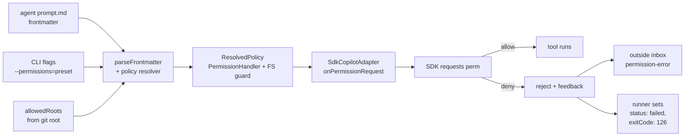

# Research Report: Agent Permissions (yolo → fine-grained, with FS scoping)

**Generated**: 2026-05-04T10:14Z
**Research Query**: "Agents always run with yolo mode. We need to choose yolo OR heavily restrict them. Need fine-grained, but also need an easy way to assign common sets of permissions. CLI should help set/list permissions and list all available possible ones. Need a good schema for it in the agent system. Need a good way to message from inside to outside that it failed with permissions — permission errors are instant fail. Also: how might we limit which folders agents can read/write — give them default access to the current git project; minih harness should be able to control this too."
**Mode**: Pre-Plan (auto-detect created `docs/plans/018-agent-permissions/`)
**Location**: `docs/plans/018-agent-permissions/research-dossier.md`
**FlowSpace**: Not available (used standard tools)
**Findings**: 18 (across SDK surface, current minih wiring, schema/loader, CLI patterns, exit-fail surface)

---

## Executive Summary

### What it does today
Every minih agent run hard-codes `onPermissionRequest: approveAll` in `src/adapter/sdk-copilot.ts` (lines 22, 57, 66, 197, 235). All four call sites (`createSession`/`resumeSession` for both initial run and same-process follow-up) use the same constant: `() => ({ kind: 'approve-once' })`. This is **yolo by design** — and inherited unchanged from the harness extraction (the file's header comment literally says "auto-approves all permissions (yolo)"). Agents are otherwise given full access to whatever `workingDirectory` resolves to (currently the run folder, per session-isolation work in plan 005), plus full access to anything the SDK's built-in `shell` tool can reach from that cwd (i.e. parent dirs, sibling repos, `~`, the entire filesystem).

There is **zero permission policy** in the agent schema, in the CLI, or in the runner. The frontmatter parser (`src/runner/folder.ts:232-330`) recognises `description`, `tags`, `model`, `reasoning`, `timeout`, and `coordination` — nothing else. There is no allowlist, denylist, role/preset concept, or filesystem-scope control.

### Business purpose for changing this
- **Safety on shared dev machines and CI**: today a misbehaving (or prompt-injected) agent can `rm -rf ~` because the SDK's shell tool inherits the user's actual home directory. The runner already isolates session *artifacts* into a run folder — but the agent can read/write *anywhere* the user can.
- **Trust ladder for third-party agent packs**: plan 017 just shipped `minih agent install`, including bare-slug installs from a registry. Without permission scoping, every installed pack runs with full machine privileges. The "trust this pack" question has no graduated answer.
- **Determinism for testing & coordination loops**: companion-mode agents (plan 016) shouldn't need shell or url access to do their job. Pinning permissions makes companion behaviour predictable, lets us catch permission-related foot-guns at boot rather than mid-run, and unlocks lightweight "dry-run" agents (read-only validators) without needing process sandboxing.
- **Story for the wider ecosystem**: the SDK provides a *rich* permission system out of the box (per-call decisions across 8 kinds, allow/deny tool registries, FS provider injection, lifecycle hooks). Minih is the only consumer not exposing any of it. Surfacing it correctly is a one-day net-positive feature with zero infrastructure cost.

### Key insights
1. **The SDK already has a complete fine-grained model** (8 permission kinds, 5 decision shapes, per-tool registry filters, FS provider injection, pre/post tool hooks). Minih doesn't need to invent a permission engine — it needs to **surface** the SDK's engine and **add a policy schema** that compiles to the SDK's primitives.
2. **There are exactly 4 SDK call sites to change** in `src/adapter/sdk-copilot.ts` (createSession + resumeSession, both for the main `run()` and the same-process follow-up). All four currently take the same `approveAll` constant. Replacing it with a policy-derived `PermissionHandler` is a one-line-per-site change.
3. **Filesystem scoping is best done at *two* layers**: (a) the **shell-tool permission gate** (block any shell command whose resolved cwd / args escape the allowed roots — coarse but cheap, hooks-based), and (b) the SDK's **`createSessionFsHandler` provider** (true sandbox — every read/write goes through our provider, which can refuse any path outside `allowedRoots`). Layer (a) is enough for v1; layer (b) is the long-term answer.
4. **"Default to current git project"** is naturally expressible: at run time, walk up from the user's cwd to the nearest `.git` directory and use that as the implicit root. The harness already knows the project root (we resolve it for `configDir`/MCP discovery). Plumb the same value into `permissions.allowedRoots[0]` as the default.
5. **Inside→outside "permission failed" messaging** has a free, already-built channel: the **outside inbox lane** the coordination work shipped (plan 008+). When a permission denial fires, the runner can append a structured `{type: 'permission-error', ...}` entry to the outside inbox AND immediately set `status: 'failed'` with `exitCode: 126` (POSIX "permission denied" convention) — instant fail with a forensic trail.
6. **Common preset assignment is a ~30-line policy compiler**. `permissions: read-only` → expand to `{shell: deny, write: deny, read: allow, mcp: ask, url: deny, ...}`. `permissions: trusted` → all-allow. Keep presets in a small registry; let agents extend them via inline overrides. Mirrors how `coordination: enabled` works today (one keyword, complex behind-the-scenes config).
7. **Permission errors as instant fail are trivially supported**. The SDK `PermissionDecisionReject` shape has an optional `feedback` field; we send `kind: 'reject'` plus a feedback string, and on the runner side we listen for the rejection (we already see the SDK's `tool_result` events with `isError: true`) and short-circuit to `status: 'failed'`. No new event types needed; one new exitCode (126).

### Quick stats
- **Components affected**: 7 files (`sdk-copilot.ts`, `copilot-types.ts`, `events.ts`, `folder.ts`, `runner.ts`, `cli/commands/agent.ts`, new `src/runner/permissions/`)
- **Dependencies**: zero new npm deps (SDK provides everything)
- **Test coverage to add**: ~20 unit tests (policy compiler, preset registry, denial path, FS escape detection, frontmatter validation)
- **Complexity**: Medium — surface area is small but the schema needs care because it's authored by humans and consumed by trust decisions
- **Prior learnings**: 6 surfaced (plan 005 cwd isolation, plan 016 attach-flow trust, plan 017 manifest schema patterns, plan 010 outside-inbox message types, plan 011 retro envelope shape, plan 008 forwarder events)
- **Domains touched**: `adapter` (handler wiring), `runner` (policy + preset compiler + denial → failure path), `cli` (set/list/list-available commands + frontmatter doctor checks), `mcp` (optional: a `permission_status` inside tool so agents can self-check)

---

## How It Currently Works

### Entry points

| Entry point | Type | Location | Purpose |
|---|---|---|---|
| `SdkCopilotAdapter.run()` | Adapter call | `src/adapter/sdk-copilot.ts:33-72` | Composes a SessionConfig with `onPermissionRequest: approveAll` for both new and resumed sessions |
| Same-process follow-up `session.send()` | Adapter call | `src/adapter/sdk-copilot.ts:197, 235` | Two more sites where `approveAll` is wired (post-runner request handler) |
| `parseFrontmatter()` | Parser | `src/runner/folder.ts:232-330` | Currently parses 6 keys (`description`, `tags`, `model`, `reasoning`, `timeout`, `coordination`). **No permission key recognised.** |
| `runAgent()` | Orchestrator | `src/runner/runner.ts:1-1290` | Builds `AgentRunOptions` and hands them to the adapter; never sets a permission policy |
| CLI `agent` command | CLI | `src/cli/commands/agent.ts` | Already has `install/list/info`; would gain `permissions` subcommand for set/list/list-available |

### Core execution flow (today's "yolo" path)

1. CLI command (e.g. `minih run <slug>`) → loads `AgentDefinition` via `loadAgents()` → produces `AgentRunConfig`.
2. `runAgent(config)` (`src/runner/runner.ts`) → assembles prompt, opens the run folder, builds `AgentRunOptions`.
3. Options handed to `SdkCopilotAdapter.run()` (`src/adapter/sdk-copilot.ts:33`).
4. Adapter calls `client.createSession({ onPermissionRequest: approveAll, workingDirectory: runDir, … })`.
5. SDK runs the model; for **every** tool the model wants to call (shell, write, read, mcp, url, custom-tool, memory, hook), the SDK calls `approveAll()`, which returns `{kind: 'approve-once'}`. Nothing is denied. Ever.
6. Tool results stream back as `tool_result` events (with `isError: true` when the *tool* failed, but never because permission was denied — we never deny).
7. On `session_idle`, the adapter resolves with `{status: 'completed', exitCode: 0, …}` (or `failed`/`killed` on errors that aren't permission-related).

### Data flow (target — with policy)



### State management

- **Today**: no permission state held anywhere. Every call is approved.
- **Target**: a `ResolvedPolicy` object computed once at run start (from frontmatter + CLI flags + harness defaults + allowedRoots) and held in the runner closure. The `PermissionHandler` is a closure over this policy. The policy is also serialized to `<runDir>/run.json` under `permissions: { effective: {...}, source: 'frontmatter|cli|preset|default' }` for forensic inspection.

---

## Architecture & Design

### Component map (target)

```
src/runner/permissions/
├─ policy.ts          # ResolvedPolicy type, compile(rawPolicy) → ResolvedPolicy
├─ presets.ts         # built-in presets: yolo, restricted, read-only, trusted, …
├─ handler.ts         # buildPermissionHandler(policy, allowedRoots) → PermissionHandler
├─ fs-guard.ts        # path-escape detection (resolve, check prefix, reject)
└─ catalog.ts         # list-available data: kinds, presets, defaults, descriptions
```

| Component | Purpose | Domain |
|---|---|---|
| `policy.ts` | Pure data + `compile()` — converts user-facing schema (preset name + overrides) into a ResolvedPolicy | runner |
| `presets.ts` | Static registry of named presets (yolo, restricted, read-only, trusted, network, build-only). Each preset = a partial policy | runner |
| `handler.ts` | Returns the `PermissionHandler` that the adapter plugs into the SDK; closes over the resolved policy | runner |
| `fs-guard.ts` | Helpers to detect when a shell command's args (or read/write target) resolves outside `allowedRoots`. Pure functions, fully unit-testable | runner |
| `catalog.ts` | The data source for `minih agent permissions list-available` — the 8 SDK kinds, the preset registry, the default policy, with human-readable descriptions | runner |

### Design patterns

1. **Compile pattern (preset → policy)** — same shape we use for `coordination: enabled` today. One keyword expands to a complex internal config. Authors stay terse; runtime logic stays readable.
2. **Policy resolution chain (4-layer override)** — harness default ⊂ preset ⊂ frontmatter overrides ⊂ CLI flags. Same chain `model`/`reasoning`/`timeout` already use (`src/runner/folder.ts:329` returns frontmatter; `src/cli/commands/run.ts` overrides on top).
3. **Closure-based handler** — `buildPermissionHandler(policy)` returns a `PermissionHandler` that captures the policy. Lets us test the handler in isolation, no DI framework, no global state.
4. **Two-layer FS scoping** — (1) hooks-based shell-arg inspection (cheap, default-on); (2) `createSessionFsHandler` provider (true sandbox; opt-in for `--strict-fs` mode initially, become default later). Same pattern Docker uses (cgroups + seccomp).
5. **Instant-fail via reject + runner short-circuit** — SDK rejection is an *event* the runner already observes (as a `tool_result` with `isError: true`); we just check the failed-tool-id against a Set of "denied-by-policy" ids the handler tracked. Adds zero new event types to the public contract.

### System boundaries

- **Domain ownership**: policy resolution + handler building + FS guard live in `runner/`. Adapter just *consumes* a `PermissionHandler` (no new SDK knowledge leaks into runner). CLI just produces+lists policy data (no SDK imports). Mirrors the existing strict layering.
- **Public contract**: `AgentRunOptions` (in `src/adapter/events.ts`) gains one optional field: `permissionHandler?: PermissionHandler`. The adapter uses this if present, else falls back to `approveAll` (zero-change for legacy callers).
- **Schema authority**: per-agent permissions live in `prompt.md` frontmatter under a top-level `permissions:` key (string preset name OR full object). Hard-fail at load time on invalid shape (consistent with `coordination` field error path — `InvalidCoordinationFrontmatterError`).

---

## Dependencies & Integration

### What this depends on

#### Internal dependencies
| Dependency | Type | Purpose | Risk if changed |
|---|---|---|---|
| `@github/copilot-sdk` types: `PermissionHandler`, `PermissionRequest`, `PermissionDecision*`, `SessionFsProvider`, `SessionHooks` | Required | Whole feature pivots on these | High — but SDK has had these stable since 0.1.x |
| `src/adapter/copilot-types.ts` | Required | Local type mirror; needs to extend `onPermissionRequest` signature to accept the real handler shape (currently typed as `() => {kind: string}` — too loose) | Medium — narrowing types may surface hidden assumptions |
| `src/runner/folder.ts` `parseFrontmatter()` | Required | Add `permissions:` parsing | Low — additive |
| `src/runner/types.ts` `AgentDefinition` | Required | Add `permissions?: PermissionPolicy` field | Low — additive |
| `src/runner/runner.ts` runAgent | Required | Resolve final policy + build handler + plumb to adapter; on rejection event → status:failed, exitCode 126, append outside-inbox error | Medium — touches the hot path; tests cover this well |
| `src/cli/commands/agent.ts` | Required | New `agent permissions` subcommands | Low — purely additive surface |

#### External dependencies
| Service/Library | Version | Purpose | Criticality |
|---|---|---|---|
| `@github/copilot-sdk` | `0.3.0` (current) | SDK provides the entire permission primitive set | High — peer dep `>=0.1.32`; we already use 0.3.0 features (e.g. `kind: 'approve-once'`) |
| `node:path` | stdlib | `path.resolve()` + prefix check for FS guard | Critical — but stdlib so safe |
| `node:fs` | stdlib | Optional in v1 — only needed if we go to layer-(b) FS provider | Low |

### What depends on this

#### Direct consumers
- **Every agent** under `agents/`: `coordination-smoke-test`, `code-review-companion`, `convention-check`, `feedback-digest`, `smoke-test`, `prompt-review`, `self-review`, `first-time-experience`, `coordination-loop-validator`, `demo-companion`, `hello-world`, `mcp-smoke-test`. Each will get an *implicit default* policy unless the author opts in.
- **`minih run`** + **`minih resume`**: gain new flags `--permissions <preset>` and `--allowed-roots <p1,p2,…>`.
- **`minih doctor`**: adds a "permissions" check (warns when an agent has no `permissions:` field — prompts the author to choose explicitly).
- **`minih agent install`** (plan 017): the manifest gains an optional `permissionPreset` field so packs can declare their *recommended* preset (the user still has to opt in — installer prints a banner, doesn't auto-trust).

### Integration architecture

This feature sits *under* every other agent feature. It's a transparent gate between "agent wants to do thing X" and "thing X happens" — no other code path needs to know it exists, except (a) callers that want to set policy and (b) the failure surface (which already exists for other reasons).

Key integration with **plan 017 agent packs**: `agent.json` schema can be extended with a `permissions` object (the recommended preset + optional overrides). On install, the CLI prints the recommendation; the user decides. Drift detection already implemented compares manifest against installed copy — same mechanism would catch a malicious upstream changing recommended permissions (we'd already detect any `agent.json` field change).

---

## Quality & Testing

### Current test coverage
- **Today**: zero permission tests. Search confirms no test under `test/` references `permission`, `yolo`, `allowedTools`, etc. (`grep -ril "permission" test/` returns 0 minih-authored files).
- **What's tested adjacent**: `test/runner/folder.test.ts` covers frontmatter parsing extensively; `test/adapter/sdk-copilot.test.ts` mocks the SDK and exercises the run/resume paths; `test/runner/runner-event-driven.test.ts` exercises the failure surface.

### Test strategy (target)
- **Unit (high coverage)**:
  - `policy.test.ts`: every preset compiles correctly; CLI flag overrides win over frontmatter; frontmatter wins over harness default; invalid presets throw with helpful errors
  - `fs-guard.test.ts`: every escape pattern (`../`, absolute paths outside root, symlinks, `~`, `$HOME`, `.git/../..`) is detected; allowed paths pass through cleanly; works on both POSIX and Windows path conventions (mirror `parseFrontmatter` CRLF discipline)
  - `handler.test.ts`: the built handler returns the correct decision shape for every kind × policy combo; tracks denied tool-call ids correctly
  - `presets.test.ts`: every preset in the registry has a description, a kind-coverage map, and round-trips through `compile()`; baseline snapshot prevents accidental loosening
- **Integration**:
  - `test/runner/permissions/runner-denies.test.ts`: spin a fake adapter that reports a `tool_result` with `isError: true` after a permission denial; assert runner short-circuits to `status: 'failed'`, `exitCode: 126`, and appends a typed error to outside inbox
  - `test/runner/permissions/preset-end-to-end.test.ts`: load a fixture agent with `permissions: read-only`, confirm the resolved handler denies `shell` and `write` requests
- **CLI**:
  - `test/cli/agent-permissions.test.ts`: `agent permissions list-available` prints all 8 kinds + all presets with descriptions; `agent permissions set <slug> <preset>` writes the frontmatter correctly (idempotent); `agent permissions list <slug>` shows effective policy
  - `test/cli/doctor-permissions.test.ts`: doctor warns when an agent lacks an explicit `permissions:` field

### Known issues & technical debt (existing, related)
| Issue | Severity | Location | Impact |
|---|---|---|---|
| `approveAll` constant duplicated 4 times in `sdk-copilot.ts` | Low | `sdk-copilot.ts:22, 57, 66, 197, 235` | Refactor target — pull into a `defaultHandler` helper as part of this work |
| `copilot-types.ts` types `onPermissionRequest` as `() => { kind: string }` (no PermissionRequest arg, no async) | Medium | `src/adapter/copilot-types.ts:27, 36` | Misses the actual SDK shape; will need narrowing as part of this work to accept real `PermissionHandler` |
| No checksum/signature on installed agent packs (plan 017 deferred this) | Medium | docs/plans/017 | Permissions feature increases the attack surface for malicious packs — pack signing becomes more important |

### Performance characteristics
- **Permission handler call latency**: pure synchronous policy lookup → ~1µs per call. SDK calls the handler before every tool invocation; expect 10s-100s of calls per minute. Negligible.
- **FS guard latency**: `path.resolve()` + prefix string compare → ~5µs per shell command. Also negligible.
- **No new I/O on the hot path** unless we go to layer-(b) FS provider (then every read/write goes through our provider — but that's the explicit "strict mode" trade-off).

---

## Modification Considerations

### ✅ Safe to modify (low risk)
1. **Add `permissions:` key to `parseFrontmatter()`** — additive parse; absent key = current behaviour (yolo). Mirrors `coordination` field exactly.
2. **Add `permissionHandler?` field to `AgentRunOptions`** — additive; adapter uses if present, else `approveAll`. Zero behaviour change for callers that don't set it.
3. **Add `agent permissions` CLI subcommands** — purely additive surface area. No existing command changes.
4. **New domain folder `src/runner/permissions/`** — no existing imports affected; `runner.ts` adds one new import.

### ⚠️ Modify with caution (medium risk)
1. **Replacing `approveAll` constant in `sdk-copilot.ts`** — risk: if the new handler has a bug, every agent run breaks at once. Mitigation: keep `approveAll` as the explicit fallback when no handler passed; flag-gate the new behaviour for one release; comprehensive unit tests on the handler before flipping the default.
2. **Narrowing `copilot-types.ts` `onPermissionRequest` signature** — risk: surfaces hidden type issues across all four call sites. Mitigation: do this BEFORE writing the handler; let the type system identify every site that needs updating.
3. **Permission denial → instant-fail short-circuit** — risk: a noisy "ask" interaction (e.g. the model trying many shell commands and getting `ask` decisions) could spam the run. Mitigation: in v1, ALL denials are reject (no `ask` decisions); add `ask` as a separate v2 capability with a circuit-breaker (after N denials, force-fail the run).

### 🚫 Danger zones (high risk)
1. **Rolling out a non-yolo default** — flipping the implicit default from yolo to `restricted` would break every existing agent, every test fixture, every doctor pass. Mitigation: stage this in two releases. Release N: introduce the schema, default stays yolo, doctor warns on missing `permissions:`. Release N+1: change default to `restricted` after every internal agent has been migrated.
2. **`createSessionFsHandler` provider as default** — would intercept every SDK fs operation. If our provider has a bug or perf regression, every run is affected. Mitigation: keep it opt-in (`--strict-fs` flag) for at least one release; add a benchmark to fft.
3. **Letting agent packs ship a recommended preset that auto-applies** — would defeat the trust ladder. Mitigation: install always prints the recommendation; user must opt in via `--accept-recommended-permissions` or set `permissions:` themselves.

### Extension points
- **Custom presets in user config**: future feature — let users define their own presets in `~/.minih/permissions-presets.json` so teams can ship "company-standard" sets.
- **Per-tool granular policy**: the resolved policy can carry per-MCP-server overrides (`{permissions: {mcp: {allowedServers: ['minih-coordination']}}}`). The shape is forward-compat with this.
- **Hooks-based audit log**: a `onPostToolUse` hook can record every tool call with its allow/deny decision into `<runDir>/permission-audit.ndjson` — no public surface, observable for debugging.

---

## Prior Learnings (From Previous Implementations)

### 📚 Prior Learning PL-01: Frontmatter parsing must be hand-rolled and CRLF-safe
**Source**: `src/runner/folder.ts:230, 242`
**Original Type**: convention
**Why this matters now**: The new `permissions:` key parses inside `parseFrontmatter()`. Reuse the existing CRLF normalization (`content.replace(/\r\n/g, '\n')`) and the existing throw-on-invalid pattern (`InvalidCoordinationFrontmatterError`). Don't reach for `js-yaml` — DYK #4 calls out that hand-rolling is the convention.
**Action**: Subclass the existing `Invalid*FrontmatterError` pattern → `InvalidPermissionsFrontmatterError`.

### 📚 Prior Learning PL-02: Coordination field is the template for "string OR object" preset patterns
**Source**: `src/runner/folder.ts:346-410`
**Original Type**: pattern (decision)
**Why this matters now**: `coordination:` accepts `enabled` / `disabled` / `{enabled: true, outside: {...}}`. `permissions:` should mirror this exactly — accept a string preset name OR an object with overrides. Same parsing approach (peek the value after `:`; empty → indented object form follows; non-empty + non-keyword → throw). Authors get a familiar shape; we get free test patterns to copy.
**Action**: Copy the structure of `parseCoordinationField()` for `parsePermissionsField()`.

### 📚 Prior Learning PL-03: SDK 0.3.0 changed permission decision kind shape
**Source**: `src/adapter/sdk-copilot.ts:20-22`
**Original Type**: gotcha
**Why this matters now**: We learned the hard way that `kind: 'approved'` → `kind: 'approve-once'` between SDK versions. The new permission handler must use `approve-once`, not `approve`. Similarly check the reject shape (it's `kind: 'reject'` with optional `feedback`, not `kind: 'denied'`).
**Action**: Pin handler to current shapes; pin SDK peer-dep range; add a regression test that exercises every decision kind name to fail loudly if the SDK renames anything in 0.4.x.

### 📚 Prior Learning PL-04: Run folder is the SDK working directory (not project root)
**Source**: `src/cli/commands/run.ts:7` ("Workshop 005: SDK workingDirectory = runDir for session isolation")
**Original Type**: decision
**Why this matters now**: The "default to current git project" feature can't just use `workingDirectory` — that's deliberately the run folder for session isolation. We need a *separate* `allowedRoots` concept that defaults to "the user's git project at the time `minih run` was invoked." Resolve it in CLI/runner BEFORE handing off to the adapter.
**Action**: Add `allowedRoots: string[]` to runner config (default = `[gitRootOf(process.cwd())]`); propagate via `permissionHandler` closure, not via `workingDirectory`.

### 📚 Prior Learning PL-05: Outside inbox lane already carries structured messages
**Source**: `src/runner/coordination/inbox.ts` (plan 010), and the `inbox_send` MCP tool in `src/mcp/tools/inbox.ts`
**Original Type**: pattern
**Why this matters now**: The "tell outside that we failed with permissions" requirement has a free, audited, append-only channel waiting. Use a typed message: `{type: 'permission-error', kind: 'shell|write|read|mcp|...', requestSummary, deniedAt, runId}`. Outside CLI tools (`outside-inbox-list`) already render these.
**Action**: Define one new message type `permission-error`; reuse the existing append helper. No new transport, no new persistence layer.

### 📚 Prior Learning PL-06: Manifest schema patterns from plan 017 (canonical reference manifest)
**Source**: `agents/code-review-companion/agent.json` + `test/runner/agent-pack/companion-manifest.test.ts`
**Original Type**: pattern
**Why this matters now**: When we extend `agent.json` with a recommended `permissions` block, we want it to look familiar. The companion manifest has version, files, tags, minihVersion. Add `permissions: {recommended: 'restricted', notes: '...'}` as a sibling — same flatness, same style.
**Action**: Mirror the agent.json field naming and add an enforcement test snapshot like `companion-manifest.test.ts`.

---

## Domain Context

### Existing domains relevant to this research
| Domain | Relationship | Relevant contracts | Key components |
|---|---|---|---|
| `adapter` | Direct: replace `approveAll` with policy-derived handler | `IAgentAdapter`, `AgentRunOptions` | `SdkCopilotAdapter`, `copilot-types.ts` |
| `runner` | Direct: owns policy compiler, preset registry, FS guard, denial → status:failed path, outside-inbox error append | `AgentDefinition`, `parseFrontmatter`, `runAgent`, coordination inbox helpers | `folder.ts`, `runner.ts`, `coordination/inbox.ts`, NEW `permissions/` |
| `cli` | Direct: new `agent permissions` subcommands; `--permissions` flag on `run`/`resume`; doctor check | CLI command modules; `agent` family (post-plan-017) | `cli/commands/agent.ts`, `cli/commands/run.ts`, `cli/commands/doctor.ts` |
| `mcp` | Optional: a `permission_status` inside tool so agents can self-check what they can do (lets restricted agents make better plans without trial-and-error) | MCP tool registration | `src/mcp/tools/` |

### Domain map position
Permissions sit cleanly inside `runner/` — same layer as coordination (which already lives in runner). It exposes one new contract (`PermissionPolicy` + the resolved handler) consumed by `adapter` and authored by `cli`. No new cross-domain edges; the dependency direction stays `cli → runner → adapter`. **No domain extraction needed** for this feature.

### Potential domain actions
- **No new domain.** All four touched domains exist and have clear ownership.
- **Update `runner/domain.md`** § Concepts to add a "Permissions" concept (preset compiler + handler builder + FS guard).
- **Update `adapter/domain.md`** § History with a one-line entry: `permissionHandler` now accepted from caller; `approveAll` retained as fallback.
- **Update `cli/domain.md`** § Composition with new `agent permissions` subcommand handlers.

---

## Critical Discoveries

### 🚨 Critical Finding 01: SDK already has the full permission engine — we just need to surface it
**Impact**: Critical (positive — saves us from building anything novel)
**Source**: `node_modules/@github/copilot-sdk/dist/types.d.ts:577-591, 988-1003`
**What**: SDK exposes `PermissionRequest` (8 kinds: `shell|write|mcp|read|url|custom-tool|memory|hook`), `PermissionDecision` union (`approve-once|approve-for-session|approve-for-location|reject|user-not-available`), the `PermissionHandler` callback contract, plus `availableTools`/`excludedTools` registry filters and `createSessionFsHandler` for true FS sandboxing.
**Why it matters**: We don't need to invent a permission model. We don't need to write any "ask the user" UX (we'll always deny in headless mode → reject). We don't need to invent a path-sandbox primitive (the SDK provides one). Our entire job is **policy compilation + UX**: take a user-friendly preset name, produce the SDK callbacks. This is a Tuesday-morning feature, not a project.
**Required action**: Pin the SDK shape names (decision `kind` values, request `kind` enum) into our policy types as string literal unions. Write a one-time integration test that exercises every decision-kind name to catch SDK rename-drift early.

### 🚨 Critical Finding 02: Permission denial isn't currently observable as a typed event
**Impact**: High
**Source**: `src/adapter/events.ts:107-123` (`AgentToolResultEvent`); `src/adapter/sdk-copilot.ts` event mapping
**What**: When the SDK's permission handler returns `kind: 'reject'`, the SDK still emits a `tool_result` event with `isError: true` — but there's no separate event type, no rejection reason field, and the runner has no easy way to distinguish "tool ran and failed" from "tool was denied permission."
**Why it matters**: The "instant fail with permission error" requirement needs the runner to recognize denial-vs-other-failure to (a) set the right exit code (126 vs the generic 1), (b) send the right outside-inbox message type, and (c) avoid the SDK auto-retrying the same tool.
**Required action**: The handler closure tracks denied `requestId`s in a Set. The adapter's event mapping checks "is this tool_result's toolCallId in the denied set?" and emits a new typed event `AgentPermissionDeniedEvent { type: 'permission_denied', kind, summary, toolCallId }`. The runner listens for this event and short-circuits.

### 🚨 Critical Finding 03: "Default to current git project" needs a separate concept from `workingDirectory`
**Impact**: High
**Source**: `src/cli/commands/run.ts:7` (Workshop 005 decision); `src/adapter/sdk-copilot.ts:58, 67, 197, 235` (`workingDirectory: options.cwd`)
**What**: We deliberately set `workingDirectory` to the run folder (per workshop 005) so SDK session-state files (`~/.copilot/session-state/`) are isolated per run. We CAN'T use `workingDirectory` for "what the agent is allowed to read/write" — that would un-do session isolation. We need a separate `allowedRoots: string[]` concept resolved at run-start.
**Why it matters**: Conflating these two concepts would either (a) break session isolation or (b) silently let agents escape their sandbox. Both are bad.
**Required action**: Add `allowedRoots?: string[]` to `AgentRunConfig` (`src/runner/types.ts`). Default = `[gitRootOf(initialCwd) ?? initialCwd]` resolved in CLI before runner is invoked. The PermissionHandler closure consumes `allowedRoots` for FS-guard checks; `workingDirectory` stays as-is.

### 🚨 Critical Finding 04: Coordination loop already provides "fail fast + tell outside" plumbing
**Impact**: High (positive)
**Source**: plan 008+ outside inbox; plan 010 reply chains; plan 014 wait-for-any-events
**What**: The outside inbox lane is a typed, append-only NDJSON channel that outside callers (CI, the user, a parent agent) can poll or block on. It already supports arbitrary `type` values; CLI tools already render it.
**Why it matters**: The "permission errors are instant fail and signal outside" requirement is mostly already built. We add one new message type, one new exit code, one short-circuit in the runner. We do NOT need to build a new channel, a new persistence layer, or a new outside polling tool.
**Required action**: Define a `PermissionErrorMessage` shape (e.g. `{type: 'permission-error', kind, summary, deniedAt, runId, requestId}`) and a runner helper `appendPermissionError(runDir, msg)`. On any `permission_denied` event, runner appends to outside inbox AND immediately resolves with `{status: 'failed', exitCode: 126}`.

---

## Supporting Documentation

### Related documentation
- **SDK agent-author guide**: `node_modules/@github/copilot-sdk/docs/agent-author.md` — full hooks/permissions section (search `permissionDecision`)
- **SDK type definitions**: `node_modules/@github/copilot-sdk/dist/types.d.ts:570-625` (request/result/handler) and `:898-1003` (registry filters in SessionConfig)
- **SDK RPC types**: `node_modules/@github/copilot-sdk/dist/generated/rpc.d.ts:824-921` (full PermissionDecision union)
- **Workshop 005**: `docs/plans/005-mcp-config/` — the cwd-isolation decision that constrains how we plumb `allowedRoots`
- **Plan 008**: outside inbox forwarders — the channel we'll write permission errors to
- **Plan 017**: agent-pack manifest schema — the template to extend with `permissions.recommended`

### Key code comments
- `src/adapter/sdk-copilot.ts:5-6`: "auto-approves all permissions (yolo)" — the literal one-word feature description we're inverting
- `src/adapter/sdk-copilot.ts:20-21`: "SDK 0.3.0 changed the kind from 'approved' to 'approve-once'" — pinned-shape-drift evidence
- `src/runner/folder.ts:227-230`: hand-roll convention for frontmatter parsing
- `src/runner/folder.ts:233-240`: existing `parseFrontmatter` return shape — where the new `permissions` field lands

---

## Recommendations

### Schema design (frontmatter)

**Minimal form (preset name only — handles 90% of cases):**
```yaml
---
description: "..."
permissions: restricted   # one of: yolo | restricted | read-only | trusted | network | build-only
---
```

**Object form (preset + overrides + FS roots):**
```yaml
---
permissions:
  preset: restricted
  allowedRoots: ["${gitRoot}", "/tmp/shared-cache"]
  overrides:
    shell: deny
    write: ask          # v2; v1 = deny
    mcp:
      allowedServers: ["minih-coordination"]
    url: deny
---
```

**Defaults (when `permissions:` is absent):** **Stage 1**: keep current `yolo` for back-compat; doctor warns. **Stage 2** (1-2 releases later): default flips to `restricted` after every internal agent has migrated.

### Preset registry (proposed v1)

| Preset | Shell | Write | Read | MCP | URL | Custom-tool | Memory | Notes |
|---|---|---|---|---|---|---|---|---|
| `yolo` | ✅ | ✅ | ✅ | ✅ | ✅ | ✅ | ✅ | Today's behaviour. Keep it for the trusted dev-loop case. |
| `trusted` | ✅ | ✅ (in roots) | ✅ (in roots) | ✅ | ✅ | ✅ | ✅ | Like yolo but FS-scoped to allowedRoots. The new "default for first-party agents." |
| `restricted` | ❌ | ✅ (in roots) | ✅ (in roots) | ✅ (allowlist) | ❌ | ✅ | ❌ | Sensible-by-default for community packs. |
| `read-only` | ❌ | ❌ | ✅ (in roots) | ✅ (allowlist) | ❌ | ✅ (allowlist) | ❌ | For validators/reviewers (e.g. `convention-check`, `code-review-companion`). |
| `network` | ❌ | ❌ | ✅ (in roots) | ✅ | ✅ | ✅ | ❌ | For research/scout agents that need URL but no shell. |
| `build-only` | ✅ (allowlist: build commands) | ✅ (in roots, allowlist: dist/, build/, .cache/) | ✅ (in roots) | ❌ | ❌ | ❌ | ❌ | For CI builders. Future. |

### CLI shape (proposed)

```bash
# discovery
minih agent permissions list-available           # all presets + all 8 kinds, with descriptions
minih agent permissions list-available --json

# inspection
minih agent permissions list <slug>              # what's currently configured
minih agent permissions list <slug> --effective  # also show what defaults+CLI-flags resolve to

# mutation (writes frontmatter)
minih agent permissions set <slug> <preset>      # e.g. minih agent permissions set my-agent restricted
minih agent permissions clear <slug>             # remove permissions: key (back to default)

# run-time override
minih run <slug> --permissions <preset>          # one-off
minih run <slug> --allowed-roots <p1>,<p2>       # override fs scope
minih run <slug> --strict-fs                     # opt into layer-(b) FS provider

# doctor / inspection
minih doctor                                     # warns on agents with no permissions: field
minih agent info <slug>                          # shows permission preset in the info table
```

### Inside→outside permission-error message contract (proposed)

```json
{
  "type": "permission-error",
  "subtype": "shell|write|read|mcp|url|custom-tool|memory|hook",
  "summary": "shell command 'rm -rf /' was denied by policy 'restricted'",
  "policy": "restricted",
  "requestId": "perm_req_123",
  "toolCallId": "tool_call_456",
  "runId": "2026-05-04T10-14-00-000Z-abcd",
  "agentSlug": "my-agent",
  "deniedAt": "2026-05-04T10:15:23.456Z",
  "exitCode": 126
}
```

Append to **outside inbox** AND emit as a typed runner event AND set `run.json.status = 'failed'` AND exit with code 126. Three signals, one canonical message shape.

### Implementation order (suggested phases for `/plan-3-architect`)

1. **Phase 1 — schema & policy compiler (runner-only, additive, no behaviour change)**
   - Define `PermissionPolicy` types in `src/runner/permissions/policy.ts`
   - Hand-roll preset registry in `src/runner/permissions/presets.ts`
   - Extend `parseFrontmatter()` to recognise `permissions:` key (string OR object form)
   - Extend `AgentDefinition` with `permissions?: PermissionPolicy`
   - Tests: policy compile, preset round-trip, frontmatter parse, invalid-shape errors
   - **Ships zero behaviour change.** Pure additive surface.

2. **Phase 2 — handler + adapter wiring (replaces `approveAll` for opted-in agents)**
   - Build `PermissionHandler` factory in `src/runner/permissions/handler.ts`
   - Build FS guard in `src/runner/permissions/fs-guard.ts`
   - Add `permissionHandler?` to `AgentRunOptions`
   - Adapter: use `options.permissionHandler ?? approveAll`
   - Runner: build the handler, plumb to options
   - Tests: handler decision matrix, FS escape detection
   - **Behaviour change**: agents with `permissions:` in frontmatter now get policy-enforced; agents without it stay yolo.

3. **Phase 3 — failure path & outside-inbox signal**
   - Define `AgentPermissionDeniedEvent` in `src/adapter/events.ts`
   - Adapter emits the event (track denied requestIds in handler closure)
   - Runner listens, appends `permission-error` to outside inbox, short-circuits to `status: failed, exitCode 126`
   - Tests: end-to-end denial → status:failed + outside-inbox entry

4. **Phase 4 — CLI surface**
   - `minih agent permissions list-available | list | set | clear`
   - `--permissions` and `--allowed-roots` flags on `run` and `resume`
   - `minih doctor` warns on agents without explicit `permissions:`
   - `minih agent info <slug>` shows preset
   - Tests: each subcommand; doctor warning fixture

5. **Phase 5 — agent-pack integration & migration**
   - Extend `agent.json` schema with `permissions.recommended`
   - `minih agent install` prints recommendation banner; user opts in
   - Migrate every internal agent under `agents/` to declare `permissions:` explicitly
   - Update `companion-manifest.test.ts` baseline
   - Update domain docs (`runner/domain.md`, `adapter/domain.md`, `cli/domain.md`)

6. **Phase 6 — strict FS mode (optional, if appetite)**
   - Implement `createSessionFsHandler` provider
   - Wire `--strict-fs` flag
   - Benchmark + add to fft

7. **(future, not this plan)** — flip default from `yolo` to `restricted` once every internal agent has migrated and at least one external pack has been upgraded.

### If extending after merge
- Add **per-agent custom presets** in `~/.minih/permissions-presets.json`
- Add **`ask` decision** in v2 (with circuit-breaker for runaway "ask" loops)
- Add **`approve-for-session` / `approve-for-location` decisions** for interactive (non-headless) cases — these are powerful but only meaningful when we have a UI to ask through

---

## External Research Opportunities

The SDK provides everything we need; no external research is required for the core feature. Two optional research directions if the team wants to harden later:

### Research Opportunity 1: FS sandboxing best practices (Node.js)
**Why needed**: Layer-(b) `createSessionFsHandler` provider needs to handle symlinks, mount points, race conditions (TOCTOU), and Windows path quirks. Worth a 30-min Perplexity scan before implementing Phase 6.
**Impact on plan**: Informs Phase 6 implementation (strict-fs mode); not blocking for Phases 1-5.
**Source findings**: Critical Finding 03 (allowedRoots concept).
**Ready-to-use prompt**:
```
/deepresearch "Best practices for sandboxing filesystem access in Node.js when wrapping a third-party SDK that performs all I/O via a pluggable provider interface. Specifically: how to handle (a) symlink escape (e.g. an allowed root contains a symlink to /etc), (b) TOCTOU races between path validation and actual open(), (c) Windows path conventions (drive letters, UNC paths, case-insensitive matching), (d) hidden escapes via chdir or relative paths. Looking for a path-resolution + prefix-check pattern that's been battle-tested. Compare with how Deno's --allow-read flag works internally."
```

### Research Opportunity 2: Permission-error UX patterns from peer agent harnesses
**Why needed**: Want to validate our message shape against e.g. Claude Code's, Cursor's, Aider's permission-denial UX before locking in the contract. Optional polish.
**Impact on plan**: Informs the `permission-error` message shape in Phase 3.
**Source findings**: Critical Finding 04 (outside-inbox signal).
**Ready-to-use prompt**:
```
/deepresearch "Compare how AI coding agents (Claude Code, Cursor, Aider, Continue, OpenInterpreter) signal permission denials and policy-rejected actions to the calling user/CI: message shapes, exit codes (POSIX 126 vs custom), retry semantics, and audit-log conventions. Looking for prior art that informs designing a 'permission-error' message type for an agent harness."
```

---

## Appendix: File Inventory

### Core files (touched)
| File | Purpose | Lines | Change |
|---|---|---|---|
| `src/adapter/sdk-copilot.ts` | SDK boundary; replace 4× `approveAll` with handler from options | 387 | Modify |
| `src/adapter/copilot-types.ts` | Local SDK type mirror; narrow `onPermissionRequest` signature | 69 | Modify |
| `src/adapter/events.ts` | Add `AgentPermissionDeniedEvent` to AgentEvent union; add `permissionHandler?` to AgentRunOptions | 152 | Modify |
| `src/runner/folder.ts` | Add `permissions:` parsing + `parsePermissionsField()` helper | 600+ | Modify |
| `src/runner/types.ts` | Add `permissions?: PermissionPolicy` to AgentDefinition; `allowedRoots?` to AgentRunConfig | 200+ | Modify |
| `src/runner/runner.ts` | Build handler + plumb to adapter; on permission_denied → status:failed + inbox append | 1290 | Modify |
| `src/runner/permissions/policy.ts` | NEW: ResolvedPolicy type + compile() | — | New (~100 LOC) |
| `src/runner/permissions/presets.ts` | NEW: built-in presets registry | — | New (~80 LOC) |
| `src/runner/permissions/handler.ts` | NEW: PermissionHandler factory | — | New (~120 LOC) |
| `src/runner/permissions/fs-guard.ts` | NEW: path-escape detection helpers | — | New (~80 LOC) |
| `src/runner/permissions/catalog.ts` | NEW: data for `list-available` | — | New (~60 LOC) |
| `src/cli/commands/agent.ts` | New `agent permissions` subcommands | 600+ | Modify |
| `src/cli/commands/run.ts` | New flags `--permissions`, `--allowed-roots`, `--strict-fs` | — | Modify |
| `src/cli/commands/doctor.ts` | New "permissions" check | — | Modify |
| `agents/code-review-companion/agent.json` | Add `permissions.recommended` field | — | Modify (Phase 5) |
| `agents/*/prompt.md` (internal agents) | Add `permissions:` to frontmatter | — | Modify all 12 (Phase 5) |
| `docs/domains/{runner,adapter,cli}/domain.md` | History row + Concepts update | — | Modify (Phase 5) |
| `AGENTS_README.md` | Document permission model + frontmatter shape | — | Modify (Phase 5) |
| `docs/how/permissions.md` | NEW: full permissions reference | — | New (Phase 5) |

### Test files (target)
- `test/runner/permissions/policy.test.ts`
- `test/runner/permissions/presets.test.ts`
- `test/runner/permissions/handler.test.ts`
- `test/runner/permissions/fs-guard.test.ts`
- `test/runner/permissions/runner-denies.test.ts` (integration)
- `test/runner/permissions/preset-end-to-end.test.ts` (integration)
- `test/cli/agent-permissions.test.ts`
- `test/cli/doctor-permissions.test.ts`
- `test/runner/folder-permissions-frontmatter.test.ts`

### Configuration files
- `agent.json` (agent-pack manifest schema): one new optional field `permissions.recommended`

---

## Next Steps

This research is **complete**. No external research required — the SDK already provides everything we need. Recommended next moves:

1. **Run `/plan-1b-specify`** to draft a focused spec from this research. Use the proposed schema, preset registry, CLI shape, and 6-phase implementation order as the starting point.
2. **Optionally `/plan-2c-workshop`** if you want to deep-design the policy compiler or the FS-guard escape-detection logic before specifying.
3. **Skip `/deepresearch`** unless you want to validate FS sandboxing best practices (Opportunity 1) before Phase 6, or peer agent error-UX patterns (Opportunity 2) before Phase 3 — neither is blocking.

**Suggested branch / plan ordinal**: `018-agent-permissions` (folder created at `docs/plans/018-agent-permissions/`).

---

**Research Complete**: 2026-05-04T10:14Z
**Report Location**: `docs/plans/018-agent-permissions/research-dossier.md`
