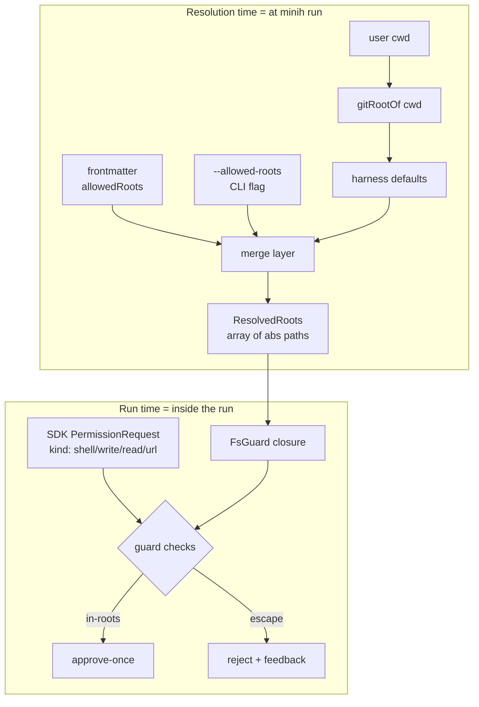
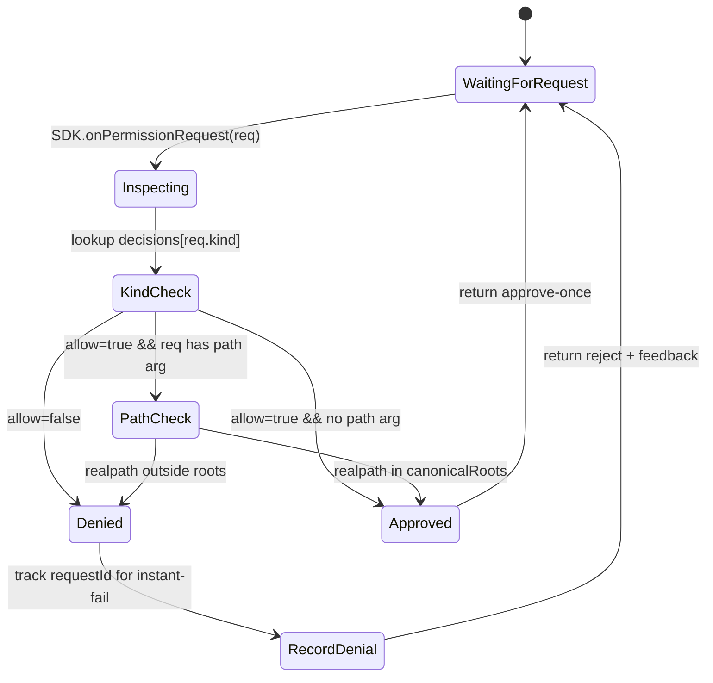

# Workshop: FS-Guard Semantics & `allowedRoots` Resolution

**Type**: Integration Pattern + Storage Design (mixed)
**Plan**: 018-agent-permissions
**Spec**: (pending — `/plan-1b-specify` next)
**Created**: 2026-05-04
**Status**: Draft

**Related Documents**:
- `../research-dossier.md` (Critical Finding 03 — `allowedRoots` ≠ `workingDirectory`)
- `./002-permission-error-protocol.md` (companion workshop — what happens when guard rejects)
- `docs/plans/005-mcp-config/` (Workshop 005 — why workingDirectory is the run folder)
- SDK type defs: `node_modules/@github/copilot-sdk/dist/types.d.ts:579-591` (PermissionRequest kinds), `:1097` (createSessionFsHandler)

**Domain Context**:
- **Primary Domain**: `runner` (policy compiler + FS guard live here)
- **Related Domains**: `adapter` (consumes the resolved handler), `cli` (resolves `allowedRoots` at invocation time + exposes flags)

---

## Purpose

Pin down the *exact* semantics for filesystem scoping in the new permission system. The research dossier identified that "default to current git project" sounds simple but contains a thicket of edge cases (symlink escape, TOCTOU, what "current" means, multi-root composition). This workshop makes every decision explicit so Phase 2 implementation is mechanical.

## Key Questions Addressed

1. What does **`allowedRoots`** actually contain — and at what moment is it computed?
2. What does **"current git project"** resolve to when the user's cwd has no `.git`, when they're in a worktree, when they're in a submodule, when minih is invoked via absolute path from outside any repo?
3. How does the FS guard handle **symlinks**? Are they resolved through, blocked, or allowed only if they stay inside roots?
4. What about **TOCTOU** races — the guard validates a path, then the SDK opens a different file at the same name?
5. **Multi-root composition** — how do CLI `--allowed-roots`, frontmatter `allowedRoots`, and the harness default combine? Union, intersection, or override?
6. How do **Windows path conventions** (drive letters, UNC paths, case-insensitive matching) work alongside POSIX (`~`, `$HOME`, relative paths)?
7. What's the boundary between **layer (a) hooks-based shell-arg inspection** and **layer (b) `createSessionFsHandler` provider**? Which v1 ships?
8. How does the guard interact with **MCP servers** (which run as separate processes the SDK spawns) and **custom tools** (which run in-process but with arbitrary handlers)?

---

## Overview

The agent permission feature has two scopes:
1. **Permission *kinds*** (shell, write, read, mcp, url, custom-tool, memory, hook) — the SDK already gates these via `onPermissionRequest`. We just compile a policy → handler.
2. **Filesystem *scope*** (which paths can be read/written) — the SDK does **not** intrinsically gate this; permission is per-kind, not per-path. We have to layer that ourselves.

This workshop is mostly about (2) because (1) is mechanical SDK plumbing. The FS-scope problem is the genuinely hard part — and it's where the difference between "feels secure" and "is secure" lives.

---

## Concept Map



---

## Q1: What is `allowedRoots`?

### Definition (decision)

`allowedRoots: string[]` — an **array of absolute, fully-resolved (canonical) directory paths**. Files anywhere under these paths are in-scope; everything else is out-of-scope.

- **Always absolute.** No relative paths, no `~`, no `$HOME`, no env var expansion at resolution time. Authors can write `~/foo` in frontmatter; the resolver expands it before storing.
- **Always canonical.** All symlinks fully resolved (via `fs.realpathSync`) at resolution time. A symlink at root resolution time is replaced by its target; symlinks created *after* resolution are caught by run-time check (see Q3).
- **Always directories.** A file path collapses to its parent directory at parse time, with a warning. A non-existent path is an error (refuse to start).
- **Always normalized for the host platform.** POSIX style on Linux/macOS; Windows-style absolute (drive letter or UNC) on Windows. The guard checks paths against this canonicalized list using `path.relative()` + leading-`..` test.

### Storage in `run.json`

The resolved roots are persisted to `<runDir>/run.json` for forensics:

```json
{
  "permissions": {
    "preset": "restricted",
    "allowedRoots": [
      "/Users/jk/substrate/minih",
      "/private/tmp/shared-cache"
    ],
    "rootsResolvedFrom": {
      "/Users/jk/substrate/minih": "git-root-of-cwd",
      "/private/tmp/shared-cache": "frontmatter:allowedRoots[1]"
    },
    "source": "frontmatter+cli"
  }
}
```

The `rootsResolvedFrom` map is for the audit trail — it lets `minih status` and `minih retros` show *why* a given root was permitted.

### Why this shape

- Abs+canonical at resolution time means the **hot-path check is a string-prefix compare** (~5µs). No system calls, no I/O, no allocator churn per tool call.
- The map of provenance lets a reviewer answer "why did the agent get write access to `/private/tmp`?" without re-running the resolver.
- Pinning paths means `minih run` is reproducible: re-running with the same flags produces the same scope, even if the user has since moved their working directory.

---

## Q2: What does "current git project" mean?

### The resolution algorithm (decision)

```typescript
function resolveDefaultAllowedRoots(invocationCwd: string): {
  roots: string[];
  reason: string;
} {
  // 1. Walk up from invocationCwd looking for .git (file OR directory — file = worktree/submodule)
  const gitRoot = findGitRoot(invocationCwd);

  if (gitRoot) {
    // 2a. .git is a directory → standard repo or submodule. Use the dir containing .git as root.
    if (statSync(join(gitRoot, '.git')).isDirectory()) {
      return { roots: [realpathSync(gitRoot)], reason: 'git-root-of-cwd' };
    }
    // 2b. .git is a file → worktree or submodule. The .git file points to the actual gitdir.
    //     The user's "project" is still the directory containing the .git file (the working tree).
    //     We don't want to use the parent repo's gitdir as the root — that would over-scope.
    return { roots: [realpathSync(gitRoot)], reason: 'git-worktree-of-cwd' };
  }

  // 3. No .git anywhere up the tree → fall back to invocationCwd itself.
  //    This is intentional: "minih run my-agent" from anywhere should always work,
  //    just with a tighter default scope.
  return { roots: [realpathSync(invocationCwd)], reason: 'cwd-no-git-root' };
}
```

### Edge case table

| Scenario | Default root resolves to | Reason key |
|---|---|---|
| User in `~/work/repo/src` (.git at `~/work/repo/`) | `~/work/repo` | `git-root-of-cwd` |
| User in `~/work/repo/sub-mod/x` (.git is a *file* in `sub-mod/`) | `~/work/repo/sub-mod` | `git-worktree-of-cwd` |
| User in `~/work/wt/branch-foo` (a `git worktree`) | `~/work/wt/branch-foo` | `git-worktree-of-cwd` |
| User in `/tmp` (no `.git`) | `/tmp` | `cwd-no-git-root` |
| User in `~/` (no `.git`) | `~/` | `cwd-no-git-root` ⚠️ |
| User invoked via absolute path: `cd /tmp; minih run …` | `/tmp` | `cwd-no-git-root` |
| User has `MINIH_PROJECT_ROOT` env var set | env-var value (validated abs+exists) | `env:MINIH_PROJECT_ROOT` |

### The home-directory escape hatch

The `~/` case marked ⚠️ is a foot-gun: the user runs from their `~` and accidentally grants access to their entire home directory. **Mitigation**:

- **Doctor warning** when default resolution lands on `$HOME` or `/`. Refuse-with-instructions in CI mode (`MINIH_CI=1`).
- **Hard refuse** if the resolved root is `/`, `~/`, `/tmp`, or `/var/tmp` and `permissions: yolo` is also set. (Yolo at home directory = "delete my dotfiles" — at least force the user to re-confirm.)
- **`MINIH_PROJECT_ROOT` env var** (advisory): harness operators can pre-set this for predictable CI runs. Highest precedence among defaults but lower than CLI flags.

---

## Q3: Symlink semantics

### Decision: resolve at registration, refuse-on-escape at use

**Two distinct moments:**

1. **At root registration** (resolution time, once per run): we call `fs.realpathSync(root)` on every entry in `allowedRoots`. Whatever the symlink points to *now* is what becomes the canonical root. If a root is `~/work/projects` and that's a symlink to `/Volumes/External/projects`, the canonical root becomes `/Volumes/External/projects`.

2. **At each FS access** (run time, every tool call that touches a path): we call `fs.realpathSync()` on the *path the agent wants to touch*, then check whether the resolved path is under any canonical root. This catches:
   - Symlinks **inside** an allowed root that point **out** of it. e.g. allowed root is `/repo`; agent reads `/repo/secrets-link` which is a symlink to `/etc/passwd`. realpath → `/etc/passwd`, prefix-test fails, denied.
   - Symlinks created **after** root resolution. Same protection: every access re-resolves.

### Trade-off table

| Approach | Pros | Cons | Decision |
|---|---|---|---|
| Resolve once, never re-check | O(1) at run time | Symlink-after-registration escape | ❌ Rejected |
| Always resolve, never canonicalize roots | Always-correct | Slow (syscall per check); breaks symlinked roots | ❌ Rejected |
| **Canonicalize roots once + realpath each access** | Roots stable; per-access protection | One stat() per path-using tool call | ✅ **Chosen** |
| Reject all symlinks unconditionally | Simplest | Breaks normal repos with symlinks | ❌ Rejected |

The cost is one `realpath` call per path-touching tool call. The SDK already does an `open()` for the read/write — adding a stat in front is amortized into noise.

### Pseudocode

```typescript
function isPathAllowed(absPath: string, canonicalRoots: string[]): boolean {
  let real: string;
  try {
    real = fs.realpathSync(absPath);
  } catch (e) {
    // ENOENT during write to a not-yet-existing file: realpath the parent dir,
    // then re-attach the basename.
    if (e.code === 'ENOENT') {
      real = path.join(fs.realpathSync(path.dirname(absPath)), path.basename(absPath));
    } else {
      return false; // EACCES, ELOOP, anything else → deny
    }
  }
  return canonicalRoots.some(root => {
    const rel = path.relative(root, real);
    return rel === '' || (!rel.startsWith('..') && !path.isAbsolute(rel));
  });
}
```

### Worked examples

| Allowed root (canonical) | Requested path | Real path | Decision |
|---|---|---|---|
| `/repo` | `/repo/src/foo.ts` | `/repo/src/foo.ts` | ✅ allow |
| `/repo` | `/repo/../etc` (normalized: `/etc`) | `/etc` | ❌ deny |
| `/repo` | `/repo/link-to-passwd` (symlink) | `/etc/passwd` | ❌ deny |
| `/repo` | `/repo/.git/config` | `/repo/.git/config` | ✅ allow (any path under root) |
| `/repo` | `/repo/new-file.ts` (doesn't exist yet, write op) | `/repo/new-file.ts` (computed via parent) | ✅ allow |
| `/repo` (canonical of `~/work/repo` symlink → `/Volumes/Ext/repo`) | `~/work/repo/foo` (which realpaths to `/Volumes/Ext/repo/foo`) | `/Volumes/Ext/repo/foo` | ✅ allow |

---

## Q4: TOCTOU races

### The threat model

Classic time-of-check-to-time-of-use:

```
1. Guard checks `/repo/foo.ts` → resolves to `/repo/foo.ts` → allow.
2. Attacker (or another process) renames `/repo/foo.ts` → symlink to /etc/passwd.
3. SDK opens `/repo/foo.ts` → follows the symlink → reads /etc/passwd.
```

### Decision: accept the race for v1, document it

This race is **fundamentally unfixable in userspace without OS-level support** (e.g. Linux `O_NOFOLLOW`, FreeBSD Capsicum, openat with file descriptors). The Node `fs` API doesn't expose `openat` directly. To genuinely close TOCTOU we'd need to:
- Open a file descriptor on the parent dir at validation time
- Resolve the path *relative* to that fd
- Pass the fd to the actual op

This is the path Deno took (and it's hairy — see Deno PR #21632). For v1 we **don't** do this. We document the residual risk in `docs/how/permissions.md` and note that the threat model is "honest mistakes by the agent + simple injection attacks," not "active malware on the user's machine."

### Mitigations that are *worth* doing

1. **Re-resolve on each access** (Q3) — closes the symlink-after-registration window which is the realistic risk.
2. **`createSessionFsHandler` provider** (Phase 6, opt-in) — when we own every fs syscall, we *can* use `openat` semantics via the provider's API. That's the long-term path.
3. **Reject ops on paths inside `.git/` for non-`yolo` presets** — git internals are a frequent attacker target. Optional v2 hardening.

### What we explicitly say in the spec

> The v1 FS guard provides **best-effort containment against well-behaved-but-mistaken agents and simple prompt-injection.** It is not a security boundary against active local attackers. Use OS-level sandboxing (containers, chroot, macOS sandbox-exec) for adversarial threat models.

---

## Q5: Multi-root composition

### The four sources of `allowedRoots`

Resolved in this exact order:

1. **Harness default** = `[gitRootOf(invocationCwd) ?? invocationCwd]` (always present, computed at runner entry)
2. **Frontmatter** `permissions.allowedRoots` (optional, agent-author-declared)
3. **CLI** `--allowed-roots p1,p2,…` (optional, per-invocation override)
4. **Env var** `MINIH_ALLOWED_ROOTS` (optional, harness-operator override — colon-separated POSIX, semicolon-separated Windows)

### Composition rule (decision: **scoped union with explicit precedence flags**)

```typescript
type AllowedRootsRule =
  | { mode: 'replace'; roots: string[] }       // literal list, replaces all upstream
  | { mode: 'extend'; roots: string[] };       // appended on top of upstream (union)
```

Each source declares its own mode:

- **Harness default**: implicit `replace` (it's the floor)
- **Frontmatter**: defaults to `extend` (most natural for agents — "I need `/tmp/cache` in addition to whatever the user gave me"). Authors can write `mode: replace` to opt out.
- **CLI flag**: `--allowed-roots p1,p2` is `extend`; `--allowed-roots-only p1,p2` is `replace`. Two flags so the user is explicit.
- **Env var**: `extend` (harness operators can add roots without disabling the agent's intent).

### Resolution example

```yaml
# Frontmatter
permissions:
  allowedRoots:
    mode: extend
    roots: ["/tmp/agent-cache"]
```

```bash
$ MINIH_ALLOWED_ROOTS=/srv/data \
  minih run my-agent --allowed-roots /tmp/extra
```

Invoked from `~/work/repo/src/`:

| Layer | Mode | Contribution |
|---|---|---|
| Harness default | `replace` | `/Users/jk/work/repo` |
| Frontmatter | `extend` | `/tmp/agent-cache` |
| Env var | `extend` | `/srv/data` |
| CLI flag | `extend` | `/tmp/extra` |

**Final canonical roots** (after dedupe and realpath): `[/Users/jk/work/repo, /private/tmp/agent-cache, /srv/data, /private/tmp/extra]`

### Forbidden roots — always rejected

Hardcoded denylist applied **after** resolution, before run start. Refuse to start with a clear error.

| Path | Reason |
|---|---|
| `/` | Root filesystem |
| `/etc`, `/sys`, `/proc`, `/dev` | System config |
| `/var/log` (warning, not refuse) | System logs |
| User home dir (`os.homedir()`) | Too broad — must be opted into via explicit subdir |
| `/tmp`, `/var/tmp` | Shared tmp — flag warning, allow with `permissions: yolo` |

### CLI shape

```bash
# Add to harness default
minih run my-agent --allowed-roots /tmp/cache,/srv/data

# Replace harness default entirely (rare; sandbox use case)
minih run my-agent --allowed-roots-only /sandbox

# Inspect what was resolved (without running)
minih run my-agent --dry-run-permissions
```

---

## Q6: Path conventions across platforms

### Decision: normalize at boundary, work in canonical form internally

| Concern | POSIX | Windows |
|---|---|---|
| Path separator | `/` | `\` (but Node accepts both) |
| Absolute test | starts with `/` | drive letter `C:\…` or UNC `\\server\share\…` |
| Case sensitivity | case-sensitive | case-insensitive (NTFS+ReFS); case-sensitive (most newer setups) |
| Home dir | `~` or `$HOME` | `%USERPROFILE%` |
| Drive letters | n/a | must preserve drive case for compare |

### Normalization rules

```typescript
function canonicalize(p: string): string {
  // 1. Expand ~ and env vars (only at parse time, not at use time)
  if (p.startsWith('~')) p = path.join(os.homedir(), p.slice(1));
  p = p.replace(/\$\{?(\w+)\}?/g, (_, k) => process.env[k] ?? '');

  // 2. Resolve to absolute relative to *invocation cwd* (not run dir)
  if (!path.isAbsolute(p)) p = path.resolve(invocationCwd, p);

  // 3. realpath if exists (resolves symlinks); else fallback to normalized non-existing path
  try {
    p = fs.realpathSync(p);
  } catch (e) {
    if (e.code !== 'ENOENT') throw e;
    p = path.resolve(p);
  }

  // 4. On Windows, lowercase the drive letter for stable compare (D: vs d:)
  if (process.platform === 'win32' && /^[a-zA-Z]:/.test(p)) {
    p = p[0].toLowerCase() + p.slice(1);
  }

  return p;
}
```

### Case-sensitivity behavior

Windows file systems are case-insensitive by default. We **do not** lowercase the whole path (would break valid paths on case-sensitive filesystems mounted on Windows, e.g. a Linux VHD). Instead we use Node's `fs.realpathSync` which respects the filesystem's actual case rules. The prefix check then uses `path.relative()` which inherits those rules.

For the explicit edge case: if a user is on case-insensitive macOS APFS (default) and types `/Users/JK/repo` instead of `/Users/jk/repo`, realpath returns the canonical case. The check works.

### Tests we'll write
- Round-trip: every preset+root combo through `canonicalize()` produces idempotent output
- POSIX-only fixtures: relative path, `~`, `$HOME`, double-slash, trailing slash, dot-dot-in-middle
- Windows fixtures (mock `process.platform`): drive letter casing, UNC path, mixed separators

---

## Q7: Layer (a) shell-arg inspection vs Layer (b) `createSessionFsHandler`

### What each layer covers

```
                ┌──────────────────────────────────────┐
                │ Agent (LLM) decides to call a tool   │
                └──────────────────────────────────────┘
                              │
            ┌─────────────────┼──────────────────┐
            ▼                 ▼                  ▼
      ┌──────────┐      ┌──────────┐       ┌──────────┐
      │  shell   │      │write/read│       │ mcp/url  │
      │  tool    │      │ tools    │       │  /custom │
      └──────────┘      └──────────┘       └──────────┘
            │                 │                  │
            ▼                 ▼                  ▼
      [Layer A]          [Layer A]          [Layer A]
      hooks.onPre        onPermission       onPermission
      ToolUse            Request            Request
      (inspect           (allow/deny        (allow/deny
       command           by kind)           by kind)
       args)
            │                 │                  │
            ▼                 ▼                  ▼
      [if shell           [Layer B]
      runs free            createSession
      it can do            FsHandler
      anything            (intercepts
      under cwd]           every fs call)
```

### Layer (a) — onPreToolUse hook + onPermissionRequest

**What it gates**:
- *Permission kinds* (shell, write, read, mcp, url, custom-tool, memory, hook) via `onPermissionRequest`
- *Specific shell commands and their arguments* via `hooks.onPreToolUse` (returns `{permissionDecision: 'deny', permissionDecisionReason: '…'}` to override even an allowed-by-kind shell call)

**What it does NOT gate**: anything the shell tool spawns *after* approval. Once `bash -c "rm -rf /"` is approved, bash does what bash does. We can detect risky commands at the gate, but we can't audit a bash subshell's syscalls.

**v1 scope**: Layer (a). Shell-arg inspection in `onPreToolUse` does:
- Parse the shell command (heuristic; not perfect — see "Limitations")
- Check whether any path argument resolves outside `allowedRoots`
- For known-dangerous commands without path args (`rm -rf`, `chmod 777`, `curl … | bash`) emit a denial *if* preset isn't `yolo`/`trusted`

### Layer (b) — `createSessionFsHandler` provider

**What it gates**: every fs operation the SDK runtime performs (read, write, list, stat, watch). The SDK wraps each call through our provider, which can refuse with arbitrary granularity.

**What it does NOT gate**: shell-spawned subprocess fs ops (bash still talks directly to the kernel; the provider only sees the SDK's own calls).

**Phase 6 scope** (opt-in `--strict-fs`): wire the provider, deny anything outside `allowedRoots` at the syscall level. Pair with `permissions: read-only` (no shell at all) for maximally tight runs.

### Decision: ship Layer (a) in v1, Layer (b) opt-in in Phase 6

Layer (a) handles the 90% case (the agent uses shell, write, read tools normally; the FS guard checks paths in those tool args). Layer (b) is the rigorous belt-and-braces option for users who turn off shell entirely.

### Limitations of Layer (a) (documented honestly)

1. **Shell-arg parsing is heuristic.** We use a minimal tokenizer; we won't catch every escape (e.g., `eval`, `$(cat path)`). Solution: when shell is allowed, we trust the command-author. Restricted preset disables shell entirely → no shell-arg analysis needed.
2. **`cd` inside shell defeats path inspection.** `bash -c "cd /tmp/escaped && cat secrets"` — we'd see `cd` and `cat`, but not realise the cwd shifted. Mitigation: in restricted preset, shell is `deny`. In trusted preset, shell is `allow` and the user accepted that risk.
3. **Tools other than shell/write/read may take paths.** We detect path-typed args by inspecting the `parameters` JSON Schema for `format: path` or known patterns (`*Path`, `*Dir`, `cwd`). Custom tools without typed paths fall through (allowed). Documented limitation.

---

## Q8: MCP servers and custom tools

### MCP servers

MCP servers run as **separate processes** the SDK spawns. They have their own `cwd` (we set it via the MCP config) and their own filesystem access — independent of our FS guard.

**Decision**: MCP-server scoping is a server-by-server policy:
- The policy `mcp.allowedServers: string[]` controls which servers can run (already supported by SDK's `availableTools` filter)
- The policy `mcp.serverCwd: 'agent-cwd' | 'run-dir' | 'project-root'` controls where servers spawn (default: `run-dir` — same as agent)
- We do **not** try to FS-scope a remote MCP server (it does what it does)

This matches the SDK's existing model: MCP servers are trust boundaries; you allow/deny the whole server.

### Custom tools

Custom tools run **in-process** in the SDK runtime. Their handlers are arbitrary JS code that may call `fs.*` directly. Our FS guard cannot reach into their internals.

**Decision**: custom-tool authors are responsible for their own FS scope. We document this in `docs/how/permissions.md`. The `permissions.custom-tool` policy gates *whether the tool can run at all*, not what it does once running.

### MCP+custom interaction matrix

| Tool type | Permission gate | FS scope |
|---|---|---|
| Built-in shell | `kind: shell` + Layer (a) shell-arg inspection | `allowedRoots` (best-effort) |
| Built-in write/read | `kind: write` / `read` + path inspection of args | `allowedRoots` (strict) |
| Built-in url | `kind: url` | n/a (network, not FS) |
| MCP tool | `kind: mcp` + per-server allowlist | server's own — out of our hands |
| Custom tool | `kind: custom-tool` + per-name allowlist | tool's own — author responsibility |

---

## Schema (canonical, frontmatter)

```yaml
---
description: "Example agent showing every permissions field"
permissions:
  preset: restricted             # one of catalog
  allowedRoots:
    mode: extend                 # 'extend' (default) | 'replace'
    roots:                       # list of paths; ~ and ${ENV} expanded at parse
      - "${gitRoot}"             # special var = git-root-of-cwd at run time
      - "/tmp/agent-cache"
  overrides:                     # per-kind overrides on top of preset
    shell: deny
    write: allow
    read: allow
    mcp:
      allowedServers: ["minih-coordination", "github"]
    url: deny
    custom-tool:
      allowedNames: ["my_safe_tool"]
    memory: deny
    hook: allow
---
```

### Special variables (resolved at run time, before canonicalize)

| Variable | Resolves to |
|---|---|
| `${gitRoot}` | Git root of invocation cwd, or invocation cwd if no `.git` |
| `${runDir}` | Current run folder (e.g. `agents/my-agent/runs/2026-…/`) |
| `${agentDir}` | Agent definition dir (e.g. `agents/my-agent/`) |
| `${HOME}` / `~` | User home directory |
| `${ENV_VAR}` | Any process env var |

### TypeScript types

```typescript
export type PermissionKind =
  | 'shell' | 'write' | 'read' | 'mcp'
  | 'url' | 'custom-tool' | 'memory' | 'hook';

export type PermissionDecisionShape =
  | { decide: 'allow' }
  | { decide: 'deny' }
  | { decide: 'ask' };  // v2 only, not v1

export interface AllowedRootsRule {
  mode: 'extend' | 'replace';
  roots: string[];   // raw form; canonicalized at compile()
}

export interface PermissionOverrides {
  shell?: PermissionDecisionShape['decide'];
  write?: PermissionDecisionShape['decide'];
  read?: PermissionDecisionShape['decide'];
  mcp?: { decide?: 'allow' | 'deny'; allowedServers?: string[] };
  url?: PermissionDecisionShape['decide'];
  'custom-tool'?: { decide?: 'allow' | 'deny'; allowedNames?: string[] };
  memory?: PermissionDecisionShape['decide'];
  hook?: PermissionDecisionShape['decide'];
}

export interface PermissionPolicy {
  preset: 'yolo' | 'trusted' | 'restricted' | 'read-only' | 'network' | 'build-only';
  allowedRoots?: AllowedRootsRule;
  overrides?: PermissionOverrides;
}

/** What runner.ts produces after compiling all four sources together. */
export interface ResolvedPolicy {
  preset: PermissionPolicy['preset'];
  canonicalRoots: string[];                 // abs, realpathed, normalized
  rootsResolvedFrom: Record<string, string>;
  decisions: Record<PermissionKind, 'allow' | 'deny'>;
  mcpAllowedServers?: string[];             // null = all, [] = none, [...]= allowlist
  customToolAllowedNames?: string[];
}
```

---

## State Machine: Guard Decision Flow



### Transition table

| From | Trigger | Guard | Action | To |
|---|---|---|---|---|
| WaitingForRequest | `onPermissionRequest(req)` | — | log request | Inspecting |
| Inspecting | — | always | look up `decisions[req.kind]` | KindCheck |
| KindCheck | — | `decision === 'deny'` | — | Denied |
| KindCheck | — | `decision === 'allow'` && req has path arg | extract path | PathCheck |
| KindCheck | — | `decision === 'allow'` && no path arg | — | Approved |
| PathCheck | — | `isPathAllowed(path, canonicalRoots)` | — | Approved |
| PathCheck | — | path outside roots | record path | Denied |
| Approved | — | — | return `{kind: 'approve-once'}` | WaitingForRequest |
| Denied | — | — | track requestId; return `{kind: 'reject', feedback: '…'}` | RecordDenial |
| RecordDenial | — | — | append to deniedRequestIds Set | WaitingForRequest |

The denial tracking is what powers Workshop 002's instant-fail wiring.

---

## Quick Reference (for implementation)

```typescript
// src/runner/permissions/fs-guard.ts

export function canonicalizeRoots(
  rawRoots: string[],
  invocationCwd: string,
  runDir: string,
  agentDir: string,
): { roots: string[]; resolvedFrom: Record<string, string> } { … }

export function isPathAllowed(
  absPath: string,
  canonicalRoots: string[],
): boolean { … }

export function extractPathArg(
  request: PermissionRequest,
  toolName: string,
  toolArgs: unknown,
): string | null { … }
```

```typescript
// src/runner/permissions/handler.ts

export function buildPermissionHandler(
  resolved: ResolvedPolicy,
  onDeny: (requestId: string, reason: string) => void,
): PermissionHandler {
  return (request, invocation) => {
    const decision = resolved.decisions[request.kind];
    if (decision === 'deny') {
      onDeny(request.requestId, `kind '${request.kind}' is denied by policy '${resolved.preset}'`);
      return { kind: 'reject', feedback: `Permission denied: ${request.kind} not allowed by '${resolved.preset}'` };
    }
    const pathArg = extractPathArg(request, …);
    if (pathArg && !isPathAllowed(path.resolve(pathArg), resolved.canonicalRoots)) {
      onDeny(request.requestId, `path '${pathArg}' is outside allowedRoots`);
      return { kind: 'reject', feedback: `Path '${pathArg}' is outside the allowed roots [${resolved.canonicalRoots.join(', ')}]` };
    }
    return { kind: 'approve-once' };
  };
}
```

---

## Open Questions

### Q9: Should `${gitRoot}` resolve at *parse* time (resolution) or *execute* time (every check)?

**RESOLVED**: Parse time. Resolving on every check would mean `cd` inside a tool could shift scope mid-run — silently widens or narrows access. Stable canonical roots throughout a run is the predictable choice. If the user wants different scope, they re-invoke `minih run` from a different cwd.

### Q10: What about read access to the SDK's own session-state files (`~/.copilot/session-state/`)?

**RESOLVED**: The SDK reads/writes its own session state via paths we can't redirect. It doesn't go through `onPermissionRequest` (it's the SDK's own bookkeeping, not a tool call). FS guard ignores SDK-internal calls — they're not in our threat model.

### Q11: Should denied paths leak in feedback, or be redacted?

**RESOLVED**: Echo the path. The denial is to the *agent*, not to a remote attacker; the agent already knew what path it was trying to use. Redacting would just make the failure harder to diagnose. The audit trail (`run.json` + outside inbox) records the same paths.

### Q12: How does this interact with `enableConfigDiscovery: true`?

**OPEN**: SDK's config discovery walks up from cwd looking for `.copilot/`, `.mcp.json`, `AGENTS.md`. It crosses our root boundary by design (typically goes higher). For now, exempt config discovery from FS guard — the SDK does this to find configuration, not user data. Document it. Revisit if it ever surfaces an issue.

### Q13: Does the FS guard apply to the inside MCP server's coordination files?

**RESOLVED**: No. The inside MCP server is *us*; it writes to `<runDir>/inbox/…` and `<runDir>/state/…` which are by design outside the user's project. We exempt our own MCP server's file ops from the guard. (They go through our own helpers, not the SDK runtime, so they bypass `onPermissionRequest` anyway.)

### Q14: How do we test FS guard against real symlink attacks?

**RESOLVED**: Test fixtures create temporary symlink trees in `tmpdir()`. Tests for: (a) symlink inside root pointing outside, (b) symlink chain longer than ELOOP, (c) symlink whose target doesn't exist, (d) symlink whose target is a directory containing the root (cycle). All fixtures cleaned up via `afterEach`.

---

## Acceptance Criteria (this design)

- [ ] `allowedRoots` resolution algorithm has unambiguous output for every cwd shape (no `.git`, in-`.git`-dir, in-worktree, in-submodule)
- [ ] Symlinks are resolved to canonical at registration AND on every access
- [ ] Multi-source merge (harness + frontmatter + CLI + env) is order-independent for `extend` modes; `replace` mode demonstrably wipes lower layers
- [ ] Forbidden roots (`/`, system dirs) are rejected before run start with a clear message
- [ ] Path-bearing tool arguments are extracted via JSON-Schema `format: path` + name-pattern fallback
- [ ] Layer (a) (shell-arg inspection) covers shell, write, read; layer (b) (FsHandler provider) is opt-in via `--strict-fs` and deferred to Phase 6
- [ ] Windows path conventions (drive letter, UNC, case-insensitive FS) handled correctly with `path.relative` + canonical casing
- [ ] Denial feedback echoes the offending path and the policy name (no redaction)
- [ ] `run.json` records `permissions.allowedRoots` with `rootsResolvedFrom` provenance map
- [ ] No new npm dependencies introduced

---

**Workshop status**: Draft → Review (after spec authoring); promote to Approved before Phase 2 implementation.
