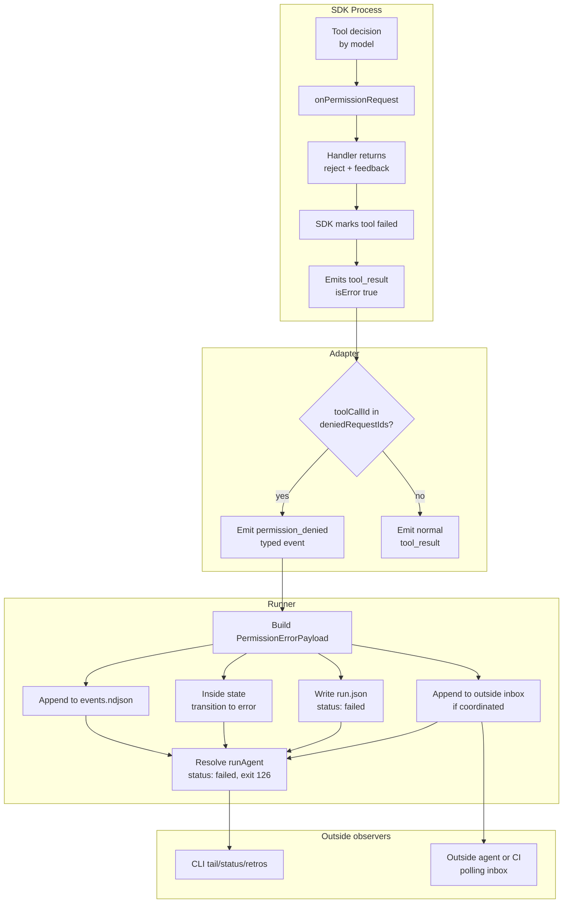
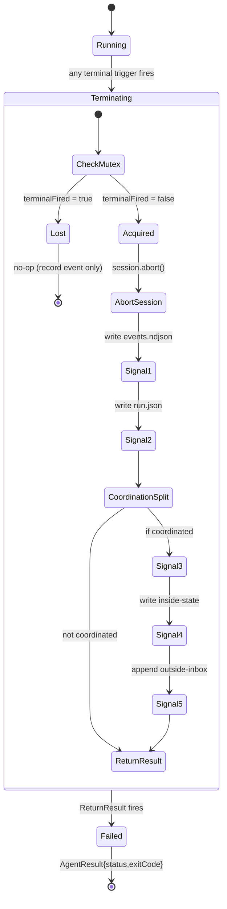

# Workshop: Permission-Error Multi-Channel Signal Contract

**Type**: State Machine + Integration Pattern
**Plan**: 018-agent-permissions
**Spec**: (pending — `/plan-1b-specify` next)
**Created**: 2026-05-04
**Status**: Draft

**Related Documents**:
- `../research-dossier.md` (Critical Finding 02 + 04 — denial isn't a typed event today; outside-inbox is the right channel)
- `./001-fs-guard-and-allowed-roots.md` (companion workshop — what produces a denial)
- `src/runner/types.ts:211-224` (existing `InboxMessage` shape)
- `src/cli/coordination.ts:92-117` (existing `appendInboxMessage` helper)
- SDK type defs: `node_modules/@github/copilot-sdk/dist/generated/rpc.d.ts:824-921` (decision shapes)

**Domain Context**:
- **Primary Domain**: `runner` (event emission + status mapping + inbox append + state transition)
- **Related Domains**: `adapter` (emits new typed event), `cli` (renders permission errors in `tail`/`status`/`retros`)

---

## Purpose

Define the **complete state machine and atomicity contract** for what happens when the FS guard or kind-policy produces a denial. The research dossier said "fire 3 signals: typed event + outside inbox + run.json status + exit code 126" — this workshop pins down ordering, idempotency, error handling, and interactions with other failure modes (timeout, crash, MCP error).

## Key Questions Addressed

1. What is the **minimum complete signal set** for a permission denial, and in what order is each signal produced?
2. What if **outside-inbox append fails** (disk full, permission denied on the inbox itself, torn write)? Do we still fail the run? Do we retry?
3. **Idempotency**: same `requestId` denied twice (e.g. SDK retries internally) — one inbox entry or two?
4. **Race vs timeout**: timeout fires *while* we're processing a denial — which exit code wins?
5. **Sub-agent / nested invocation**: when a custom tool wraps another permission-checked op, whose denial bubbles, and through how many event layers?
6. What is the **public message-shape contract** (frontmatter `type`, `subtype`, fields) that outside callers can rely on?
7. How do **coordinated** vs **non-coordinated** agents differ? Inbox lane only exists for coordinated runs.
8. How does this interact with the **resume-takeover** flow (plan 010)?

---

## Overview

A permission denial in minih is **always terminal for the run**. The user said it directly: *"permission errors are instant fail."* This decision simplifies a lot:

- We don't need an "ask" UI loop in v1 (the SDK has `kind: 'ask'` for interactive sessions; we never use it).
- We don't need exponential-backoff retry logic.
- We don't need to consider "the agent learns and tries again" — the run is dead the moment a denial fires.

But "instant fail" is multiple actions, executed in sequence, that must be **atomic from the outside's perspective**:
1. The PermissionHandler returns `{kind: 'reject', feedback}` to the SDK.
2. The handler closure tracks the `requestId` in a denial set.
3. The adapter sees a `tool_result` with `isError: true` for that `toolCallId`.
4. The adapter checks the denial set, emits a typed `permission_denied` event.
5. The runner listens for the event, builds a `PermissionErrorPayload`, appends to outside inbox (if coordinated), updates `run.json`, transitions inside-state to `error`, returns `{status: 'failed', exitCode: 126}` to the caller.

If any of these steps fails, the run still fails — but the failure mode and forensics need to be predictable. That's what this workshop pins down.

---

## Concept Map



---

## Q1: The minimum complete signal set

### Five signals, ranked by criticality

| # | Signal | Where | Required | If write fails |
|---|---|---|---|---|
| 1 | Typed `AgentPermissionDeniedEvent` in `events.ndjson` | `<runDir>/events.ndjson` | **Mandatory** — primary forensic record | Run fails with critical error; emit to stderr |
| 2 | `run.json` status update: `{status: 'failed', exitCode: 126, terminalReason: 'permission-denied', terminalDetails: {…}}` | `<runDir>/run.json` | **Mandatory** — operator-facing summary | Same as #1 |
| 3 | Exit code 126 returned to caller | process exit / `runAgent()` return | **Mandatory** — POSIX convention | n/a (if process can't exit, bigger problems) |
| 4 | `permission-error` message in outside inbox | `<runDir>/inbox/outside/messages.ndjson` | **Conditional** — only if coordinated | Run still fails; warning logged but not fatal |
| 5 | Inside state transition to `status: error` with `terminalReason: 'permission-denied'` | `<runDir>/state/inside.json` | **Conditional** — only if coordinated | Run still fails; warning logged |

### Decision: signal #1, #2, #3 are mandatory; #4, #5 are best-effort

**Rationale**: signals #1-#3 are local to the run folder and the process. They are the source of truth. Failing to write them means the run is in an undefined state — we should fail loudly.

Signals #4-#5 are coordination conveniences. If the inbox lane is unwritable (disk full, permission), the *core failure* still works — we still exit 126, we still write `run.json`. The outside CLI tools and the human operator can observe the failure via `minih status` (which reads `run.json`) even if the inbox lost the message. Document this in `docs/how/permissions.md`.

### Order-of-emission decision

```
1. Adapter emits permission_denied event
   ↓
2. Runner catches event → buffers payload (in-memory only)
   ↓
3. Runner forces SDK session abort (so no further events arrive)
   ↓
4. Runner writes signals in this order:
   a. events.ndjson (mandatory, throws on failure)
   b. run.json (mandatory, throws on failure)
   c. inside-state transition (best-effort, logs on failure)
   d. outside inbox append (best-effort, logs on failure)
   ↓
5. Runner returns AgentResult { status: 'failed', exitCode: 126, output, sessionId }
```

The ordering matters: **events.ndjson and run.json before the coordination signals** because the local-truth signals are mandatory. If we wrote inbox first and then crashed before run.json, observers would have a coordination signal but no run-level record — the worst kind of inconsistency.

---

## Q2: What if outside-inbox append fails?

### The atomicity question

The append is `fs.appendFileSync(filePath, JSON.stringify(message) + '\n')`. Failure modes:
- ENOSPC (disk full)
- EACCES (permission denied on the inbox file itself — should never happen since we created it, but theoretically)
- EROFS (read-only filesystem)
- ENOENT (the inbox dir was deleted mid-run — pathological)
- Torn write (process killed between fs call and OS flush)

### Decision: best-effort with explicit retry policy

```typescript
async function tryAppendPermissionError(
  runDir: string,
  payload: PermissionErrorPayload,
  attempts = 3,
): Promise<{ ok: true } | { ok: false; reason: string }> {
  for (let i = 0; i < attempts; i++) {
    try {
      // Reuse existing appendInboxMessage helper (src/cli/coordination.ts:92)
      appendInboxMessage(/* ... */);
      return { ok: true };
    } catch (e) {
      if (i === attempts - 1) {
        // Last attempt failed. Log to stderr; do NOT throw.
        process.stderr.write(
          `WARN: failed to append permission-error to outside inbox after ${attempts} attempts: ${e.message}\n`,
        );
        return { ok: false, reason: e.message };
      }
      // Brief backoff before retry
      await new Promise(r => setTimeout(r, 50 * (i + 1)));
    }
  }
  return { ok: false, reason: 'unreachable' };
}
```

The reason codes are also written to `run.json.terminalDetails.coordinationSignals = { inboxAppend: 'ok' | 'failed:reason' }` so the operator can audit.

### Decision: torn writes are a known caveat, not retried

The existing `appendInboxMessage` writes the JSON line atomically *to the file*, but the OS may not have flushed to disk when SIGKILL hits. Torn writes are detected by `readInboxLaneOrExit` (`src/cli/coordination.ts:130-138`) which already checks for trailing-newline integrity. This means a torn permission-error line is observable but un-readable — not silently lost.

Rather than fsync after every append (perf cost on every coordination message), we accept this trade-off and document it. **Recovery**: if a torn line is detected, the inbox is marked corrupt at that point but the run.json status remains canonical.

---

## Q3: Idempotency

### Could the same `requestId` be denied twice?

**Yes, occasionally.** Cases:
1. SDK retries the same tool internally (rare — usually the SDK respects rejection)
2. Resume-takeover: a run is takeovered after a denial; the new process re-reads the session and re-denies
3. Bug in the handler closure that doesn't track request IDs correctly

### Decision: idempotent on `(runId, requestId)`

**The handler closure tracks denied request IDs in a `Set<string>`. The first denial for a given `requestId` triggers full signal emission. Subsequent denials of the same `requestId` are silently approved-as-already-denied** (the handler returns `{kind: 'reject'}` again, but `onDeny()` is gated):

```typescript
const deniedRequestIds = new Set<string>();
const onDeny = (requestId: string, reason: string) => {
  if (deniedRequestIds.has(requestId)) return; // idempotent
  deniedRequestIds.add(requestId);
  emit('permission_denied', { requestId, reason, … });
};
```

The runner-side handler also de-dupes: at runner level we ignore subsequent `permission_denied` events for the same `requestId`. Belt-and-braces.

### What about the same *kind* denied multiple times for different requests?

Each `requestId` is unique per request. Even if every shell call is denied (10 in a row), each is a distinct `requestId`. Each gets its own `permission_denied` event, its own inbox entry, its own events.ndjson line — but only the **first** triggers the run-terminating short-circuit (signals #2 and #3 fire once; signals #1 and #4 may have multiple entries if multiple denials race during the abort window).

### Decision: terminal signal #2/#3 fire exactly once

```typescript
let terminalFired = false;
adapter.on('permission_denied', async (event) => {
  // Idempotent at runner level too
  if (terminalFired) {
    // Still record the event (signal #1) but no terminal action
    appendToEventsNdjson(event);
    return;
  }
  terminalFired = true;
  await emitAllTerminalSignals(event);
  await session.abort();  // close the SDK session so no more events arrive
});
```

---

## Q4: Race vs timeout

### The scenario

```
t=0     run starts with --timeout 60
t=58s   model decides to run a forbidden shell command
t=58.0  handler returns reject → SDK emits tool_result error
t=58.05 adapter emits permission_denied
t=58.1  runner starts emitting terminal signals (events, run.json, inbox, state)
t=60.0  TIMEOUT FIRES while runner is mid-emission
```

### Which signal wins?

**Decision: the *first* terminal-trigger to fire owns the exit code; later triggers are no-ops.**

The runner already has a `terminalReason: string | null` slot for the first-cause-of-death. The state machine:

```mermaid
stateDiagram-v2
    [*] --> Running
    Running --> Terminating_PermissionDenied: permission_denied event
    Running --> Terminating_Timeout: timeout fires
    Running --> Terminating_Crash: SDK error / unhandled
    Terminating_PermissionDenied --> Failed: signals emitted, exit 126
    Terminating_Timeout --> Failed: signals emitted, exit 124
    Terminating_Crash --> Failed: signals emitted, exit 1
    Terminating_PermissionDenied --> [no-op]: timeout fires too late
    Terminating_Timeout --> [no-op]: permission_denied fires too late
```

Implementation: a single mutex flag `terminalFired` (above) gates entry to any terminal pipeline. First writer wins.

### Concrete behavior table

| First trigger | Second trigger | Final exitCode | Final terminalReason | Notes |
|---|---|---|---|---|
| permission_denied | timeout | 126 | `permission-denied` | Timeout becomes a no-op |
| timeout | permission_denied | 124 | `timeout` | Denial event still recorded in events.ndjson |
| permission_denied | crash | 126 | `permission-denied` | Crash trace appended to events.ndjson |
| crash | permission_denied | 1 | `crash` | Denial recorded but doesn't override |

The principle: **earliest-known terminal cause wins**. This is what operators expect ("why did my run die?" — answer is the *first* fatal thing).

---

## Q5: Sub-agent / nested invocation

### The scenario

A custom tool (in-process JS handler) internally invokes another permission-checked op:
```typescript
// Custom tool implementation
defineTool('deploy', { handler: async () => {
  await fs.writeFile('/etc/passwd', '...');  // requires write permission
  await spawn('systemctl', ['restart']);     // requires shell permission
}});
```

The SDK will gate the *outer* `custom-tool: deploy` call. The inner `fs.writeFile` and `spawn` calls — does the SDK gate them?

### Reality check

**Custom-tool handler internals are not gated.** The handler is arbitrary JS; once the custom tool is approved, the handler runs to completion or throws. The SDK doesn't wrap `fs.*` or `child_process.*` for custom tool authors.

This is true for MCP tools too. Once an MCP server's tool is approved, the server does what it does.

### Decision: surface this honestly in the policy contract

- The `permissions.custom-tool` policy gates *whether the tool runs*, not what it does internally.
- The `permissions.mcp` policy gates *which servers can be talked to*, not what those servers do.
- For tightest control, users should set `permissions: read-only` (no shell, no write, no custom-tool, no mcp) — then there's no nested invocation surface.

We document this in `docs/how/permissions.md` § Limitations. The trust boundary stops at the SDK's tool dispatch. Going deeper would require Layer (b) — `createSessionFsHandler` — which intercepts SDK fs calls but still doesn't reach inside custom-tool handlers' direct `fs.*` calls.

### What about *nested* permission denials?

If a custom tool's handler explicitly invokes the SDK's tool API (e.g. via the `client.invokeTool('shell', {...})` shape — does this exist?), and that invocation is denied, the denial bubbles to the *outer* tool as a thrown error from the inner call. The handler may catch and recover, or propagate.

**Decision**: if the inner denial is observable as a `permission_denied` event, it counts as a terminal trigger (Q4 rules apply). If the custom tool catches and silently retries with different args, that's the tool author's choice — not a bug in our handler.

---

## Q6: The public message-shape contract

### Outside-inbox `permission-error` message

This is the canonical inter-process contract. Outside CLI tools, parent agents, and CI all read this shape.

```typescript
interface PermissionErrorMessage extends InboxMessage {
  // Standard InboxMessage fields:
  id: string;              // ULID
  sender: 'inside';        // permission errors always come from inside
  type: 'permission-error';
  subject: string;         // e.g. "shell command denied: rm -rf /tmp"
  body: string;            // human-readable; includes feedback echoed to model
  ts: string;              // ISO-8601
  ackOf?: never;           // permission errors are not replies
  meta: PermissionErrorMeta;
}

interface PermissionErrorMeta {
  /** Required: which kind of permission was denied. */
  kind: 'shell' | 'write' | 'read' | 'mcp' | 'url' | 'custom-tool' | 'memory' | 'hook';

  /** Required: which preset was active at denial time. */
  policyPreset: string;

  /** Required: SDK requestId — for correlating with events.ndjson. */
  requestId: string;

  /** Required: SDK toolCallId — for correlating with the tool_result event. */
  toolCallId: string;

  /** Required: ISO-8601 timestamp of the denial. */
  deniedAt: string;

  /** Required: which run produced this. */
  runId: string;

  /** Required: which agent. */
  agentSlug: string;

  /** Required: exit code the run will exit with (always 126 in v1). */
  exitCode: 126;

  /** Optional: the path that triggered the denial (FS-guard cases). */
  deniedPath?: string;

  /** Optional: which root list the path failed against (FS-guard cases). */
  allowedRootsAtDenial?: string[];

  /** Optional: tool name (e.g. 'shell') for kind-only denials. */
  toolName?: string;

  /** Optional: short reason category for filtering. */
  reasonCode: 'kind-denied' | 'path-outside-roots' | 'mcp-server-not-allowed' | 'custom-tool-not-allowed';

  /** Optional: the exact feedback string sent back to the model. */
  feedbackToModel?: string;
}
```

### Worked example (JSON line in `messages.ndjson`)

```json
{
  "id": "01HM4KZQX9V8N3W2Y6T1B0H5RP",
  "sender": "inside",
  "type": "permission-error",
  "subject": "shell command denied: rm -rf /tmp/build",
  "body": "Permission denied: shell not allowed by 'restricted' preset. Path '/tmp/build' is outside allowedRoots [/Users/jk/work/repo]. The agent received this feedback: 'Permission denied: shell command rejected — preset restricted does not allow shell.' Run terminated with exitCode 126.",
  "ts": "2026-05-04T11:23:45.678Z",
  "meta": {
    "kind": "shell",
    "policyPreset": "restricted",
    "requestId": "perm_req_abc123",
    "toolCallId": "tool_call_xyz789",
    "deniedAt": "2026-05-04T11:23:45.678Z",
    "runId": "2026-05-04T11-20-00-000Z-aabb",
    "agentSlug": "my-agent",
    "exitCode": 126,
    "toolName": "shell",
    "reasonCode": "kind-denied",
    "feedbackToModel": "Permission denied: shell command rejected — preset restricted does not allow shell."
  }
}
```

### Versioning the contract

- Add `meta.contractVersion: 1` field. Outside readers can dispatch by version.
- Document in `docs/how/permissions.md` that `meta` fields **may add new optional fields** in minor versions but **will not remove fields** without a major bump.
- The schema lives at `src/schemas/permission-error.json` (mirrors plan-008 inbox-message.json pattern).

---

## Q7: Coordinated vs non-coordinated agents

### Asymmetric availability

`coordination: enabled` is per-agent frontmatter. Coordinated agents get inbox lanes (inside + outside), state files, and the inside MCP server. Non-coordinated agents get none of that.

### Decision: signals #4 and #5 are coordination-only, but everything else is universal

| Signal | Non-coordinated | Coordinated |
|---|---|---|
| #1 events.ndjson `permission_denied` | ✅ always | ✅ always |
| #2 run.json status update | ✅ always | ✅ always |
| #3 exit code 126 | ✅ always | ✅ always |
| #4 outside inbox append | ❌ skipped | ✅ best-effort |
| #5 inside state → error | ❌ skipped | ✅ best-effort |

Rationale: the local-truth signals (events, run.json, exit code) work identically for every agent. The coordination signals are extra observability that only makes sense when the lanes exist. Skipping them for non-coordinated agents is a no-op, not a degradation.

### CLI rendering must handle both

`minih status <slug>` reads `run.json` — works for both. `minih outside-inbox-list <slug>` reads the inbox — only works for coordinated. `minih retros --slug <slug>` and `minih tail` work for both via events.ndjson.

When the user runs `minih tail` on a non-coordinated agent that just permission-denied, they see:
```
[2026-05-04T11:23:45.678Z] permission_denied  shell  /tmp/build outside allowedRoots [/Users/jk/work/repo]
[2026-05-04T11:23:45.679Z] session.terminated  reason: permission-denied  exitCode: 126
```

That's enough. The coordination inbox is a bonus, not the primary forensic surface.

---

## Q8: Resume-takeover interaction

### The scenario

A run produces a permission denial, dies with exit 126. The user wants to inspect, fix the policy, and resume.

```bash
minih run my-agent --permissions restricted   # dies with 126
# user edits prompt.md to set permissions: trusted
minih resume my-agent --run <runId>          # what happens?
```

### Decision: permissions are re-resolved at resume

The resume flow already re-loads the agent definition (per plan 010). The new policy is compiled fresh. The previous denial is in the run's events.ndjson (audit trail) but does not propagate forward — the resumed run is a fresh policy world.

`run.json` records this:
```json
{
  "status": "completed",   // or whatever the resume produced
  "terminalReason": null,
  "resumes": [
    {
      "kind": "completed-followup",
      "fromState": "failed",
      "previousTerminalReason": "permission-denied",
      "previousExitCode": 126,
      "ts": "2026-05-04T11:30:00Z"
    }
  ]
}
```

The resume itself can also produce a permission denial (with the new policy). That denial creates a *new* terminal record on top of the old one. The audit chain is preserved.

### Decision: takeover does not retry the denied tool call

When a takeover happens, the SDK session resumes from where it was — but the previously-denied tool call is *not* automatically retried. The model has to decide what to do next. With the new (looser) policy, the model may try the same tool with success; or it may have moved on. We don't synthesize the "retry the previously-denied call" path in v1.

---

## State Machine: Full Run Termination



### Trigger → exit code mapping

| Trigger | terminalReason | exitCode | Convention |
|---|---|---|---|
| permission_denied | `permission-denied` | 126 | POSIX "command found but not executable" |
| timeout | `timeout` | 124 | POSIX (`timeout` utility convention) |
| crash | `crash` | 1 | Generic |
| user-abort (Ctrl-C / kill) | `aborted` | 130 | POSIX (128 + SIGINT=2) |
| session_error | `session-error` | 1 | Generic |

### `run.json` shape (after permission denial)

```json
{
  "status": "failed",
  "exitCode": 126,
  "terminalReason": "permission-denied",
  "terminalDetails": {
    "kind": "shell",
    "policyPreset": "restricted",
    "deniedPath": "/tmp/build",
    "allowedRootsAtDenial": ["/Users/jk/work/repo"],
    "requestId": "perm_req_abc123",
    "toolCallId": "tool_call_xyz789",
    "deniedAt": "2026-05-04T11:23:45.678Z",
    "feedbackToModel": "Permission denied: ..."
  },
  "coordinationSignals": {
    "insideStateTransition": "ok",
    "outsideInboxAppend": "ok"
  }
}
```

If a coordination signal failed:
```json
"coordinationSignals": {
  "insideStateTransition": "ok",
  "outsideInboxAppend": "failed: ENOSPC"
}
```

---

## Events: New Type

### `AgentPermissionDeniedEvent` (added to AgentEvent union)

Lives in `src/adapter/events.ts`:

```typescript
export interface AgentPermissionDeniedEvent extends AgentEventBase {
  type: 'permission_denied';
  data: {
    kind: 'shell' | 'write' | 'read' | 'mcp' | 'url' | 'custom-tool' | 'memory' | 'hook';
    requestId: string;
    toolCallId: string;
    toolName?: string;
    policyPreset: string;
    reasonCode: 'kind-denied' | 'path-outside-roots' | 'mcp-server-not-allowed' | 'custom-tool-not-allowed';
    /** Echoed to the model. */
    feedbackToModel: string;
    /** Present when reasonCode === 'path-outside-roots'. */
    deniedPath?: string;
    /** Present when reasonCode === 'path-outside-roots'. */
    allowedRoots?: string[];
  };
}
```

### Where it appears in events.ndjson

The line is written **once per requestId**, regardless of how many times the SDK sees the same denial. Sample line:

```json
{"timestamp":"2026-05-04T11:23:45.678Z","eventId":"evt_…","type":"permission_denied","data":{"kind":"shell","requestId":"perm_req_abc123","toolCallId":"tool_call_xyz789","toolName":"shell","policyPreset":"restricted","reasonCode":"kind-denied","feedbackToModel":"Permission denied: ..."}}
```

### Tail rendering

`minih tail` formats this event with a red background and the bell character (˷):

```
˷ permission_denied  shell  preset=restricted  request=perm_req_abc123
   reason: kind-denied
   feedback: Permission denied: shell not allowed by 'restricted'
```

---

## Atomicity Guarantees

### What we guarantee
1. **At-most-once terminal**: only the first terminal trigger produces signals #2-#5. Every subsequent trigger is recorded in events.ndjson but does not affect the exit code or `terminalReason`.
2. **Events are append-only and ordered**: events.ndjson lines are written in arrival order with no reordering. Readers process them sequentially.
3. **`run.json` is consistent**: once `status: 'failed'` is written, `terminalReason` and `exitCode` are also present in the same write (single-shot atomic write via temp-file + rename, mirroring existing run.json updates).
4. **Best-effort coordination signals are independent**: if outside-inbox append fails, inside-state may still succeed (and vice versa).

### What we explicitly do NOT guarantee
1. **Cross-file atomicity**: events.ndjson, run.json, inbox, and state are 4 separate files. There is no transaction wrapping them. A SIGKILL between two writes leaves the run folder in an intermediate state.
2. **Read-side consistency during write**: a reader (e.g. `minih tail`) hitting events.ndjson during the terminal-write window may see signal #1 but not yet signal #2 in run.json. Idempotent reads (re-tail, re-status) recover correctly.
3. **Network durability**: if the inbox is on a network filesystem (NFS), latency and async-flush behavior are inherited. Document but don't try to fix.

### Recovery contract (post-crash)

If the run-process is SIGKILL'd between signals #1 and #2, the run folder is in this state:
- `events.ndjson` has the `permission_denied` line ✅
- `run.json` still says `status: 'running'` ⚠️

The next `minih status <slug> --run <runId>` call detects this via the `staleness-resolver` (already shipped in plan FX009 — see memory). The resolver scans events.ndjson, finds the most recent terminal-class event (`permission_denied`, `session.terminated`, `session_error`), and synthesizes a `run.json` patch with `status: 'failed'` and the corresponding `terminalReason`/`exitCode`.

This means the **events.ndjson is the canonical source of truth** for "what happened"; run.json is a derived summary that can be reconstructed if needed.

---

## Quick Reference (for implementation)

```typescript
// Adapter side — src/adapter/sdk-copilot.ts

const deniedRequestIds = new Set<string>();

const handler = buildPermissionHandler(resolved, (requestId, reason, details) => {
  if (deniedRequestIds.has(requestId)) return; // idempotent
  deniedRequestIds.add(requestId);
  emit({
    type: 'permission_denied',
    timestamp: new Date().toISOString(),
    data: { ...details, requestId, ... },
  });
});
```

```typescript
// Runner side — src/runner/runner.ts

let terminalFired = false;
let terminalReason: string | null = null;

adapter.on('event', async (event) => {
  appendEventNdjson(runDir, event);

  if (event.type === 'permission_denied') {
    if (terminalFired) return;
    terminalFired = true;
    terminalReason = 'permission-denied';

    const payload = buildPermissionErrorPayload(event, runDir, runId, agentSlug, resolved);
    await session.abort();

    // Mandatory signals
    await writeRunJson(runDir, {
      status: 'failed',
      exitCode: 126,
      terminalReason: 'permission-denied',
      terminalDetails: payload.terminalDetails,
    });

    // Best-effort coordination signals
    if (coordinated) {
      const signals = { insideStateTransition: 'ok', outsideInboxAppend: 'ok' };
      try { await writeInsideStateError(runDir, payload); }
      catch (e) { signals.insideStateTransition = `failed: ${e.message}`; }
      try { await tryAppendPermissionError(runDir, payload); }
      catch (e) { signals.outsideInboxAppend = `failed: ${e.message}`; }
      await updateRunJsonField(runDir, 'coordinationSignals', signals);
    }
  }
});
```

---

## Open Questions

### Q9: Should `permission-error` be filterable by `outside-inbox-list --type permission-error`?

**RESOLVED**: Yes. The existing `outside-inbox-list` already supports `--type` filter (per plan-008). We just use the new type name. Tests will exercise the filter.

### Q10: Should we surface a "you have N permission-denied runs in last 7 days" metric?

**OPEN**: Could be useful for "is this agent misbehaving" telemetry (related to plan 011 retro harvest and plan 012 peer telemetry). Defer to a follow-up — not in 018 scope.

### Q11: What about the SDK's `defaultJoinSessionPermissionHandler` (used in shared sessions)?

**RESOLVED**: Out of scope for v1. Minih doesn't use shared sessions; the join-session path is unused. Document in `docs/how/permissions.md` § "Future" and revisit if/when shared sessions become relevant.

### Q12: Do we want a `--no-fail-on-permission-denied` escape hatch?

**RESOLVED**: No. The user said "permission errors are instant fail." A flag to disable that defeats the safety property. If someone wants soft-fail behavior, they should use `permissions: yolo` (or just not set permissions).

### Q13: Should the inside MCP server expose a `permission_status` tool so agents can self-check?

**OPEN**: Could let restricted agents make better plans without trial-and-error denials. Implementation cost: ~30 LOC (new tool wrapping the resolved policy). Decision: defer to **Phase 6 stretch goal**; explicitly mark as a magicWand candidate for the companion to flag during Phase 2 review.

### Q14: What if the inside MCP server itself triggers a permission denial?

**RESOLVED**: It can't, because the inside MCP server's tools (`inbox_*`, `state_*`, `wait_*`) write to coordination files that are exempt from the FS guard (Workshop 001 § Q13). The inside MCP server is part of *us*, not part of the agent's tool surface from a permissions perspective.

---

## Acceptance Criteria (this design)

- [ ] `AgentPermissionDeniedEvent` is added to AgentEvent union and emitted exactly once per `requestId`
- [ ] Five-signal emission order is enforced: events → run.json → inside-state → outside-inbox
- [ ] Mandatory signals (#1, #2, #3) fail loudly; best-effort signals (#4, #5) record reason but don't fail the run
- [ ] First terminal trigger wins; subsequent triggers are recorded in events but no-op for status
- [ ] Idempotent on `(runId, requestId)`: same denial twice produces one event line, one inbox entry
- [ ] `run.json.terminalReason` is one of `permission-denied | timeout | crash | aborted | session-error`
- [ ] Exit code mapping: 126 (permission), 124 (timeout), 130 (abort), 1 (everything else)
- [ ] Coordinated agents get all 5 signals; non-coordinated get 1-3 only
- [ ] `permission-error` message shape matches `meta.contractVersion: 1` schema, validated against `src/schemas/permission-error.json`
- [ ] Resume after permission denial re-resolves policy fresh; previous denial preserved in audit trail but not propagated
- [ ] Existing FX009 staleness resolver detects torn run.json after SIGKILL during signal emission, recovers from events.ndjson
- [ ] No new public event-shape addition without contractVersion bump

---

**Workshop status**: Draft → Review (after spec authoring); promote to Approved before Phase 3 implementation.
