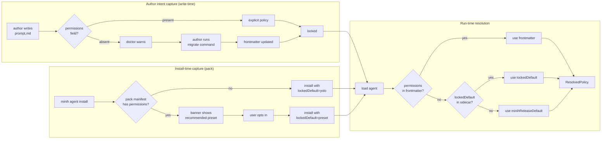
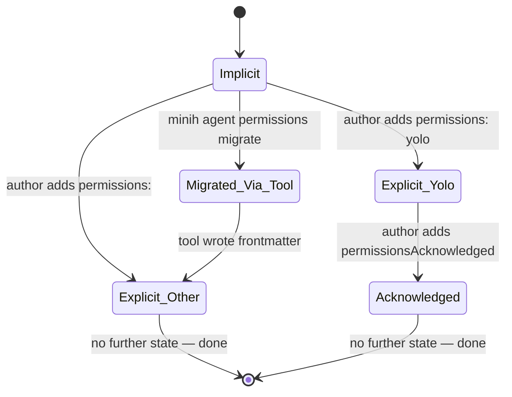

# Workshop: Default-Flip Migration Strategy

**Type**: Integration Pattern + State Machine + CLI Flow (mixed)
**Plan**: 018-agent-permissions
**Spec**: (pending — `/plan-1b-specify` next)
**Created**: 2026-05-04
**Status**: Draft

**Related Documents**:
- `../research-dossier.md` (§ Modification Considerations — "Rolling out a non-yolo default" danger zone)
- `./001-fs-guard-and-allowed-roots.md` (the policy resolution that drives this migration)
- `./002-permission-error-protocol.md` (what users see when their agent hits the new default)
- Plan 017 deferred fix dossier `docs/plans/017-agent-pack-install/fixes/FX003-postmerge-followups.md` (precedent for staged rollout)

**Domain Context**:
- **Primary Domain**: `runner` (default-policy resolution + lockedAtInstallTime sidecar)
- **Related Domains**: `cli` (doctor warnings + migration command + env-var escape hatch), `agent-pack` from plan 017 (manifest field + install behaviour)

---

## Purpose

Pin down **how minih flips the implicit default from `yolo` to `restricted` without breaking every existing agent in the wild.** The research dossier sketched a 2-stage rollout ("Stage 1: doctor warns; Stage 2: default flips") but didn't address the harder questions: how do we tell migrated from un-migrated, what happens to plan-017-installed packs that pre-date the schema, what's the escape hatch, when do we actually pull the trigger, and how do we communicate it.

This workshop is mostly about **operator UX and trust** — the technical wiring is one config switch. The real work is making sure no one wakes up to a broken agent on Tuesday because we shipped Monday.

## Key Questions Addressed

1. What does the **rollout timeline** look like — what milestones gate the flip?
2. How do we tell **"author has explicitly chosen yolo"** from **"author hasn't seen the new schema yet"**? Both look like "no `permissions:` field" today.
3. What about **plan-017-installed packs** that have no `permissions:` — when the default flips, do they silently change behaviour?
4. What's the **escape hatch** for users on the day-of-flip? `MINIH_PERMISSIONS_DEFAULT=yolo`?
5. How does **doctor** participate — what warnings, what severities, what's the noise budget?
6. What's the **migration command** look like? `minih agent permissions migrate <slug>`?
7. How do we **communicate** the change — changelog, release notes, banner on first run after upgrade?
8. How do we measure **"every internal agent has migrated"** before pulling the trigger?

---

## Overview

The flip from `yolo` default to `restricted` default is the single highest-leverage **and** highest-risk decision in plan 018. Get it right and minih becomes safe-by-default for the next decade. Get it wrong and we break trust with every existing user simultaneously.

The non-negotiable constraint: **no existing agent should silently change behaviour from one minih version to the next.** Every behaviour change must be either (a) explicitly opted into by the author or (b) accompanied by a loud, actionable warning ahead of time.

That gives us four design pillars:

1. **Distinguishability**: differentiate "explicitly chose yolo" from "hasn't migrated yet"
2. **Stickiness**: an agent's effective default is locked at install/scaffold time, not re-resolved per-release
3. **Loudness**: doctor warns early, often, and with a clear remediation
4. **Reversibility**: an env-var or CLI flag can undo the flip for one run, one user, or one CI fleet

---

## Concept Map



---

## Q1: The rollout timeline (decision)

### Six numbered releases, each with a single behaviour change

We treat the flip as a **multi-release migration**, not a single switch. Each release does exactly one thing so users can roll back any single step without unwinding everything.

| Release | Codename | Behaviour change | What users see |
|---|---|---|---|
| **R1** | "Schema arrives" | New `permissions:` frontmatter field is recognised. Default still `yolo`. Doctor passes silently. | No-op for anyone who doesn't read the changelog. |
| **R2** | "Doctor warns" | Doctor emits a `warning` severity for any agent without explicit `permissions:`. CLI surface (`agent permissions list/set/migrate`) ships. `MINIH_PERMISSIONS_DEFAULT` env var ships. | `minih doctor` produces a yellow line per un-migrated agent with the migration command shown. |
| **R3** | "Pack install captures intent" | `minih agent install` records `lockedDefault` in sidecar based on user choice at install time. Existing installed packs get `lockedDefault: yolo` on first read (idempotent migration of the sidecar). | Installing a new pack now prompts (or auto-locks) the recommended preset. Existing packs unchanged. |
| **R4** | "Internal agents migrated" | All 12 first-party agents under `agents/` ship with explicit `permissions:`. None rely on the implicit default. Internal regression test asserts this. | First-party agents demonstrate the new schema; community can copy the patterns. |
| **R5** | "Default flips for *new* agents" | `minih init` and `minih agent install` (without recommended preset) both default to `restricted`, not `yolo`. Existing agents (read from disk) still resolve to `yolo` via `lockedDefault` sidecar OR explicit frontmatter. | Newly-scaffolded agents are restricted-by-default; nothing existing breaks. |
| **R6** | "Default flips for *all* agents" | `minihReleaseDefault: restricted`. Agents without explicit `permissions:` AND without a `lockedDefault: yolo` sidecar get `restricted`. The escape hatch `MINIH_PERMISSIONS_DEFAULT=yolo` survives. Doctor severity for un-migrated escalates from `warning` to `fail` (i.e. `--strict` would fail; default still passes but with a louder banner). | Day of: most users see no change because they migrated in R2-R4. The honest holdouts get a banner explaining the change, with the env-var escape hatch printed. |

### Gates between releases

| Between | Gate condition |
|---|---|
| R1 → R2 | At least 1 minor version on the new schema; no schema parser bugs reported. |
| R2 → R3 | Doctor warning rate trends down across telemetry samples (we don't have telemetry — proxy: at least 4 weeks of warnings in shipped releases, no spike of "doctor is annoying" issues). |
| R3 → R4 | All first-party agents under `agents/` have explicit `permissions:`. Regression test in fft enforces this. |
| R4 → R5 | At least 1 minor version of "all internals migrated" with no behaviour drift reported. |
| R5 → R6 | At least 2 minor versions of "new defaults to restricted." Either telemetry or a tracked issue thread shows community packs catching up. |

### Why six steps, not "stage 1 / stage 2"

The original sketch was 2 stages. Pulling apart the work into 6 releases lets each step be **individually reversible** and **individually communicable**. If R3 (pack install captures intent) goes wrong, we can roll it back without un-shipping the schema (R1) or the doctor warnings (R2). Each release ships one promise.

---

## Q2: Distinguishing "explicit yolo" from "hasn't migrated"

### The problem

Today: every agent has no `permissions:` field. After the flip, that's ambiguous — did the author intentionally want yolo, or did they not yet see the new schema?

### Decision: introduce `permissions: yolo` as the explicit form

After R1 ships, authors who *want* yolo write it explicitly:

```yaml
---
description: "..."
permissions: yolo   # explicit — author has seen the schema
---
```

Doctor distinguishes:
- **`permissions: yolo`** → ✅ pass (explicit choice)
- **`permissions:` absent** → ⚠️ warning (un-migrated)

This works because R1 *recognises* the field but doesn't change behaviour. So in R1 the warning is silent (R1 = "schema arrives, no behavior change"). R2 turns the warning on. By the time R6 flips the default, every author who actually wanted yolo has migrated to the explicit form during R2-R5.

### What about the original frontmatter spec — should *every* agent eventually have `permissions:`?

**Decision: yes.** The end state (post-R6) is that no agent is implicit. The implicit default exists only as a safety net for unmigrated agents. Eventually (long after this plan) we may strip the implicit default entirely; that's a future minor-version task. For now, the implicit default tracks `minihReleaseDefault` (initially `yolo`, then `restricted` at R6).

---

## Q3: Plan-017-installed packs (lockedDefault sidecar)

### The trust property we need to preserve

> A pack installed under minih `0.4.0` with no recommended preset must continue to behave the same way under minih `0.5.0`, `1.0.0`, and `2.0.0`, until the user explicitly upgrades or removes it.

### Decision: `lockedDefault` field in `.minih-source.json` sidecar

Plan 017 already writes a sidecar at `<agentsDir>/<slug>/.minih-source.json` with provenance info. We extend it:

```json
{
  "source": { "type": "registry", "registrySlug": "code-review-companion" },
  "version": "0.1.0",
  "commitSha": "abc123",
  "installedAt": "2026-04-30T12:00:00Z",
  "lockedDefault": "yolo",
  "lockedDefaultRecordedAt": "2026-04-30T12:00:00Z",
  "lockedDefaultReason": "no-recommended-preset-at-install-time"
}
```

`lockedDefault` is **the policy that this installation will use forever** when the agent's frontmatter has no explicit `permissions:`. It's set once, at install, based on:

| Install path | lockedDefault value | reason |
|---|---|---|
| Pack manifest has `permissions.recommended` AND user accepted | `<recommended preset>` | `accepted-recommendation` |
| Pack manifest has `permissions.recommended` AND user declined | `yolo` | `declined-recommendation` |
| Pack manifest has no recommendation | minih's release-default at install time | `no-recommended-preset-at-install-time` |
| Local-path install (manifest absent) | `yolo` | `local-install-no-manifest` |
| Existing pack pre-dating the schema (R3 read it for the first time) | `yolo` | `pre-schema-install-grandfathered` |

### One-time backfill (R3)

When R3 ships, the first time minih reads any `.minih-source.json` without a `lockedDefault` field, it writes one in. Idempotent: the value is `yolo` (preserving existing behaviour). The sidecar's `lockedDefaultRecordedAt` records the moment.

```typescript
function ensureLockedDefault(sidecarPath: string): void {
  const sidecar = readSidecar(sidecarPath);
  if ('lockedDefault' in sidecar) return; // already migrated
  sidecar.lockedDefault = 'yolo';
  sidecar.lockedDefaultRecordedAt = new Date().toISOString();
  sidecar.lockedDefaultReason = 'pre-schema-install-grandfathered';
  writeSidecar(sidecarPath, sidecar);
}
```

### Policy resolution at run time (full picture)

```
1. Frontmatter has explicit `permissions:` field?
   YES → use that (highest precedence)
   NO  → continue
2. `<agentsDir>/<slug>/.minih-source.json` has `lockedDefault`?
   YES → use that (preserves behaviour-at-install-time)
   NO  → continue (this branch only happens for hand-rolled un-installed agents)
3. `MINIH_PERMISSIONS_DEFAULT` env var set?
   YES → use that (operator escape hatch)
   NO  → continue
4. Use `minihReleaseDefault` (== current minih version's default)
```

### Why a sidecar field, not a global config

The user could have many installed packs, each from a different release era. A global "minih default" would change behaviour for all of them at once. Per-pack lockedDefault means each pack's behaviour-at-install-time is preserved independently. Same principle as Cargo's `Cargo.lock`, npm's `package-lock.json`: pin per-artifact, not per-installation.

---

## Q4: Escape hatch (`MINIH_PERMISSIONS_DEFAULT`)

### Decision: env var only, NO CLI flag for the escape

| Path | Allowed? | Why |
|---|---|---|
| `MINIH_PERMISSIONS_DEFAULT=yolo` env var | ✅ | Operator-level config, fits CI use case ("our whole fleet is in a containerized sandbox; yolo is fine") |
| `--permissions-default yolo` CLI flag | ❌ | We already have `--permissions yolo` per-run. A "default" flag is too easy to leave on persistently. |
| `~/.minih/config.json` global | ❌ for v1 | Would persist across sessions silently; high foot-gun for "I forgot I set this." Defer until users ask. |

### Behaviour table

| Env var value | Effect |
|---|---|
| unset | Use sidecar lockedDefault → `minihReleaseDefault` |
| `yolo` | Override implicit default to yolo for un-migrated agents this process |
| `restricted` | Override implicit default to restricted (useful in CI to *force* the new behaviour for testing) |
| any other preset name | Same as above |
| invalid value | Refuse to start with clear error |

### Loud signaling when env var is set

Whenever `MINIH_PERMISSIONS_DEFAULT` is non-empty, **every** `minih run` invocation prints a yellow banner to stderr:

```
[!] MINIH_PERMISSIONS_DEFAULT=yolo is set — un-migrated agents will run with full permissions
```

The banner appears even when the agent has explicit `permissions:` (because the operator should know the env var is having no effect on this particular run — counter-intuitive operator confusion is real).

### Sunset clock

The env var is **promised to be supported through R6 + 2 minor versions.** A doctor `note` in R6+ surfaces "your env var is set; consider migrating your agents instead." We don't auto-remove the env var support — operators with weird CI setups deserve a stable escape hatch.

---

## Q5: Doctor warnings — severity, noise budget, format

### Severity ramp across releases

| Release | Without `permissions:` | With `permissions: yolo` (explicit) |
|---|---|---|
| R1 | (silent) | (silent) |
| R2 | `warning` | `pass` |
| R3 | `warning` (sidecar will inject lockedDefault on next run) | `pass` |
| R4 | `warning` (still allowed for community packs; first-party should fail in `--strict`) | `pass` |
| R5 | `warning` | `pass` |
| R6 | `warning` (with louder banner) | `pass` |
| R6 + N | (escalate to `fail` in a future workshop) | `pass` |

### The doctor message

```
⚠ permissions      missing-permissions-field
                   This agent has no `permissions:` field. The current minih default for
                   un-migrated agents is yolo. To migrate:
                     minih agent permissions migrate <slug>
                   To explicitly keep yolo:
                     Add `permissions: yolo` to prompt.md frontmatter.
                   Learn more: docs/how/permissions.md
```

### Noise budget

The warning fires **once per agent per `doctor` run**, not per check or per file. The total noise at R2 across all 12 first-party agents would be 12 lines. After R4, that's 0 lines (all migrated). Budget acceptable.

### `doctor --strict` behaviour

`doctor --strict` already treats warnings as failures. After R2, `doctor --strict` fails on any un-migrated agent. CI pipelines using `doctor --strict` are forced to migrate (or pin minih version). Documented as the migration trigger.

### Per-agent suppress

Authors who genuinely want to ignore the warning (for valid reason) can put a marker in frontmatter:

```yaml
---
permissions: yolo   # I really mean it
permissionsAcknowledged: 2026-05-15
---
```

The `permissionsAcknowledged` field is purely advisory — not enforced — but it documents intent and date. Future doctor releases may use it to sunset the field gracefully.

---

## Q6: Migration command (`minih agent permissions migrate`)

### CLI shape

```
$ minih agent permissions migrate <slug> [--preset <name>] [--dry-run]

┌─────────────────────────────────────────────────────────────┐
│ STEP 1: Discover                                            │
│   • Load agent from agents/<slug>/                          │
│   • Read prompt.md frontmatter                              │
│   • Detect current state:                                    │
│     - Has explicit permissions: → "already migrated"         │
│     - No permissions field    → eligible to migrate          │
│   • If installed pack: read lockedDefault from sidecar       │
└─────────────────────────────────────────────────────────────┘
                              │
                              ▼
┌─────────────────────────────────────────────────────────────┐
│ STEP 2: Recommend preset                                    │
│   • If --preset given, use it                                │
│   • Else: heuristic recommendation:                          │
│     - Agent has shell tool needs / runs build/lint?          │
│       → "trusted" (FS-scoped, all kinds)                     │
│     - Read-only inspection / review agent?                   │
│       → "read-only"                                          │
│     - Companion-style mode?                                   │
│       → "read-only"                                          │
│     - Network/url heavy (research)?                          │
│       → "network"                                            │
│     - Default: "restricted"                                  │
└─────────────────────────────────────────────────────────────┘
                              │
                              ▼
┌─────────────────────────────────────────────────────────────┐
│ STEP 3: Show diff                                           │
│   • Render proposed frontmatter change as unified diff       │
│   • Show preset implications (kinds allowed/denied)          │
│   • Ask user to confirm (unless --dry-run or --yes)          │
└─────────────────────────────────────────────────────────────┘
                              │
                              ▼
┌─────────────────────────────────────────────────────────────┐
│ OUTPUT                                                      │
│                                                             │
│   ✅ Migrated agents/code-review-companion/prompt.md         │
│      from: implicit yolo                                     │
│      to:   permissions: read-only                            │
│                                                             │
│      Run `minih doctor` to verify.                          │
│                                                             │
└─────────────────────────────────────────────────────────────┘
```

### Heuristic recommendations table

The migrate command makes a best-guess preset based on signals from the agent definition:

| Signal | Inferred intent | Recommendation |
|---|---|---|
| `tags:` includes `review`, `companion`, `audit`, `lint`, or `inspect` | Read-only inspection | `read-only` |
| Agent prompt mentions `git`, `build`, `compile`, `test`, `npm`, `cargo` | Active dev work | `trusted` |
| Agent prompt mentions `fetch`, `download`, `http`, `url`, `research` | Network agent | `network` |
| `coordination: enabled` | Coordinated agent (often need MCP) | `restricted` (with explicit `mcp.allowedServers`) |
| None of above | Conservative default | `restricted` |

The heuristic is a **suggestion**, not enforcement. The migrate command always shows the diff and asks; user can override with `--preset`.

### `--dry-run` mode

```
$ minih agent permissions migrate code-review-companion --dry-run

Would update agents/code-review-companion/prompt.md:

  --- a/agents/code-review-companion/prompt.md
  +++ b/agents/code-review-companion/prompt.md
  @@ -1,4 +1,5 @@
   ---
   description: "Power-On-Mode review companion"
   tags: [companion, review, coordination, exemplar, quality]
  +permissions: read-only
   ---

Recommended preset: read-only
Reasoning: tags include 'review', 'companion'

Run without --dry-run to apply.
```

### Bulk migrate (`migrate --all`)

```bash
# Migrate every agent in agents/ that doesn't have explicit permissions
$ minih agent permissions migrate --all --dry-run
$ minih agent permissions migrate --all --yes  # auto-accept recommendations
```

The bulk path is the answer to "I have 50 community packs in this project; help me." It iterates all un-migrated agents and applies recommendations one by one. With `--yes`, auto-accepts all recommendations (printing the diff per agent for the audit log).

---

## Q7: Communication strategy

### What lands where

| Surface | Content |
|---|---|
| **CHANGELOG.md** | Per-release entry: "R1 introduces `permissions:` frontmatter (no behaviour change); see docs/how/permissions.md" / "R2 adds doctor warning for un-migrated agents" / "R6 default flips from yolo to restricted; existing installed packs preserved via lockedDefault sidecar" |
| **Release notes** (`gh release create`) | Highlights the migration step + escape hatch + migration command. |
| **`minih --version`** | Footer one-liner: "ℹ permissions default is `yolo`; will flip to `restricted` in v0.X" — only when version is in the R2-R5 window. |
| **First-run banner** (post-upgrade) | Detect when minih's installed version differs from the previously-recorded version (`~/.minih/last-seen-version`). On first invocation, print a one-time banner with migration pointers. Suppressed by `MINIH_NO_FIRST_RUN_BANNER=1`. |
| **`minih doctor`** | Per-agent warning (Q5). |
| **`minih agent install`** | When the pack has `permissions.recommended`, banner shows "this pack recommends preset X; run with --accept-recommended-permissions or set explicitly." |
| **`docs/how/permissions.md`** | Full reference. Migration FAQ. Threat model. Escape hatches. Glossary. |
| **`AGENTS_README.md`** | Quick-start for permissions in the same place model/timeout/coordination are documented. Bundled to dist via copy-schemas script. |

### First-run banner shape

```
$ minih run my-agent

────────────────────────────────────────────────────────────────────
ℹ minih 0.5.0 introduces explicit permissions for agents.
  Most agents will need a 1-line frontmatter change.

  See:    docs/how/permissions.md
  Run:    minih agent permissions migrate --all --dry-run
  Skip:   touch ~/.minih/permissions-acknowledged
────────────────────────────────────────────────────────────────────

[2026-05-04T11:23:45Z] session.start ...
```

The banner only shows once. Detection: maintain `~/.minih/last-seen-version`. If file content ≠ current version, show banner, write current version. Suppressed entirely by either `MINIH_NO_FIRST_RUN_BANNER=1` or the existence of `~/.minih/permissions-acknowledged`.

### Tone discipline

- **Never scary.** "Your agents are in danger" → ❌. "Most agents will need a 1-line change" → ✅.
- **Always actionable.** Every banner ends with a command to run.
- **Always escapable.** Every banner shows the env var or marker file that turns it off.
- **Never repeats.** First-run banner is one-time. Doctor warnings are one-per-agent-per-run. The `MINIH_PERMISSIONS_DEFAULT` warning prints only when the env var is set.

---

## Q8: Measuring "ready to flip"

### What "ready" means

We can't ship R6 (default flip) until we have evidence that the user base has caught up. Without telemetry, we use proxies.

### Internal gates (we control)

| Gate | Mechanism |
|---|---|
| All first-party agents migrated | `test/agents/permissions-explicit.test.ts` — fft-blocking regression. Asserts every `agents/*/prompt.md` has explicit `permissions:` field. |
| Doctor produces zero warnings on a fresh checkout | Same test, expressed via `doctor` CLI exit code + JSON output check. |
| Migration tooling has been used in anger | Run `permissions migrate --all` on a sample of public packs (companion, smoke-test, et al) and verify the heuristic produces sensible output. |

### External signals (we observe)

| Signal | Threshold |
|---|---|
| GitHub issues mentioning "permissions" | None blocking; track for "this confused me" sentiment |
| At least 1 minor version on R5 default-for-new-only | 4-week wait minimum |
| Plan-017's bundled registry packs (currently 1: code-review-companion) all have `permissions.recommended` | 100% (currently 0%; flag as Phase 5 task) |

### Decision: hold the trigger until 3-of-3 internal gates AND 4-week R5 dwell

This is the kind of decision the project lead makes with judgment, not a formula. The gates are necessary; they're not sufficient. Document the decision in the R6 release notes ("we held the flip for X weeks; the following gates were green").

---

## State Machine: Per-Agent Migration State



| State | Description | Doctor severity | Default resolves to |
|---|---|---|---|
| Implicit | No `permissions:` field | warning (R2+); fail (R6+ in `--strict`) | `lockedDefault` from sidecar OR `minihReleaseDefault` |
| Explicit_Yolo | Has `permissions: yolo` | pass | `yolo` (frontmatter wins) |
| Explicit_Other | Has `permissions: <preset>` | pass | preset (frontmatter wins) |
| Migrated_Via_Tool | Same as Explicit_Other; just records the route | pass | preset |
| Acknowledged | Explicit_Yolo + `permissionsAcknowledged` field | pass + note | yolo |

---

## Storage: Sidecar Schema Changes

### `.minih-source.json` v0.2.0 (was v0.1.0 from plan 017)

```json
{
  "$schemaVersion": "0.2.0",
  "source": { "type": "registry", "registrySlug": "code-review-companion" },
  "version": "0.1.0",
  "commitSha": "abc123",
  "installedAt": "2026-04-30T12:00:00Z",
  "fileChecksums": { "prompt.md": "sha256:...", "agent.json": "sha256:..." },

  "lockedDefault": "yolo",
  "lockedDefaultRecordedAt": "2026-04-30T12:00:00Z",
  "lockedDefaultReason": "pre-schema-install-grandfathered"
}
```

### `agent.json` extension (manifest)

```json
{
  "manifestVersion": "0.2.0",
  "slug": "code-review-companion",
  "version": "0.1.0",
  "files": ["prompt.md", "instructions.md", "input-schema.json", "output-schema.json"],
  "tags": ["companion", "review", "coordination", "exemplar", "quality"],
  "minihVersion": ">=0.5.0",

  "permissions": {
    "recommended": "read-only",
    "rationale": "Companion agents only inspect; they don't modify code.",
    "fallback": "restricted"
  }
}
```

The `permissions.fallback` field gives users who decline the recommendation a sensible second-choice default. If they decline, install uses `fallback` (or `yolo` if no fallback specified).

### Schema migration

Plan 017 promised "manifest schema is versioned." Bumping to `manifestVersion: 0.2.0` triggers `companion-manifest.test.ts` snapshot updates. Backward-compat: `0.1.0` manifests still load (we just don't see the recommended preset; sidecar's `lockedDefaultReason: 'no-recommended-preset-at-install-time'`).

---

## CLI Flow: Install with Recommendation

```
$ minih agent install code-review-companion

┌─────────────────────────────────────────────────────────────┐
│ STEP 1: Resolve registry → fetch tarball → extract           │
└─────────────────────────────────────────────────────────────┘
                              │
                              ▼
┌─────────────────────────────────────────────────────────────┐
│ STEP 2: Read manifest                                        │
│   • Detect permissions.recommended: "read-only"               │
│   • Show recommendation prompt                                │
└─────────────────────────────────────────────────────────────┘
                              │
                              ▼
┌─────────────────────────────────────────────────────────────┐
│ PROMPT (interactive)                                         │
│                                                              │
│   This pack recommends running with permissions: read-only   │
│   Rationale: Companion agents only inspect; they don't       │
│              modify code.                                    │
│                                                              │
│   [A]ccept recommendation (read-only)                        │
│   [F]allback to: restricted                                  │
│   [Y]olo (full permissions)                                  │
│   [C]ancel install                                           │
│                                                              │
│   Choice: _                                                  │
└─────────────────────────────────────────────────────────────┘
                              │
                              ▼
┌─────────────────────────────────────────────────────────────┐
│ OUTPUT                                                       │
│                                                              │
│   ✅ Installed code-review-companion                         │
│      Version: 0.1.0                                          │
│      Permissions: read-only (accepted recommendation)        │
│                                                              │
│      Locked: this preset will be used until you change       │
│      prompt.md frontmatter or remove the agent.              │
│                                                              │
└─────────────────────────────────────────────────────────────┘
```

### Non-interactive mode (`--yes` or CI)

| Flag combination | Behaviour |
|---|---|
| `install <slug> --yes` | Auto-accept recommendation (lockedDefault = recommended). |
| `install <slug> --yes --no-recommended` | Use fallback preset. |
| `install <slug> --yes --permissions yolo` | Override entirely; lockedDefault = yolo. |
| `install <slug> --yes` (manifest has no recommendation) | lockedDefault = `minihReleaseDefault` (in R5+ this is `restricted`). |

---

## Quick Reference

```bash
# Check migration status across all agents
minih doctor

# Migrate one agent (interactive)
minih agent permissions migrate <slug>

# Migrate one agent with explicit preset
minih agent permissions migrate <slug> --preset read-only

# Bulk-migrate everything
minih agent permissions migrate --all --dry-run    # preview
minih agent permissions migrate --all --yes        # apply

# Per-run override
minih run <slug> --permissions yolo                # this run only

# Operator/CI fleet override
MINIH_PERMISSIONS_DEFAULT=yolo minih run <slug>

# Suppress first-run banner
touch ~/.minih/permissions-acknowledged
# or
MINIH_NO_FIRST_RUN_BANNER=1 minih run <slug>
```

---

## Open Questions

### Q9: Should we ship a `minih agent permissions check` that verifies an agent's behaviour against its declared preset?

**OPEN**: Useful — would do a dry-run with the preset, watch for what tools the agent tries to use, and tell the author "you declared read-only but your agent tried to call shell." Implementation: instrument the existing `agent run` with denial-recording mode. Defer to post-R6 — not blocking the migration itself.

### Q10: Should the migration tool also offer to commit the changes to git?

**RESOLVED**: No. Stay silent on git. Authors run `git diff` and commit themselves. Auto-committing is too invasive — out of scope.

### Q11: What about agents in projects without `agents/` (i.e. just experimenting in `~/scratch`)?

**RESOLVED**: Same flow. The migrate command works on any path. No special-case for "real project" vs "experiment."

### Q12: Does R6's flip apply to `minih init` scaffold output retrospectively?

**RESOLVED**: No. R5 is the moment scaffold output changes (`init` writes `permissions: restricted` into new agents). Scaffolds emitted before R5 are existing files; users migrate them like anything else.

### Q13: How do we handle `minih agent install` *without* a recommendation in R3+?

**RESOLVED**: As Q3's table shows: `lockedDefault = minihReleaseDefault` at install time + `lockedDefaultReason: 'no-recommended-preset-at-install-time'`. In R3 (yolo era) that's yolo. In R6 (restricted era) that's restricted. The pin happens at install, not at run — so a pack installed in R3 keeps yolo behaviour through R6 unless the user upgrades the pack OR runs `permissions migrate`.

### Q14: Can the lockedDefault be unset/cleared?

**OPEN**: A `minih agent permissions reset <slug>` command would clear `lockedDefault` from the sidecar so the agent picks up `minihReleaseDefault`. Useful for "I want to opt this old pack into the new defaults." Defer to user-feedback after R6; not in v1 scope.

### Q15: What about `minih agent upgrade` (re-pulling from registry)?

**RESOLVED**: Upgrading a pack does NOT change `lockedDefault` unless the new manifest has a different `permissions.recommended` value AND the user re-accepts. The default behaviour: preserve the existing lockedDefault unless explicitly changed. Documented in plan 017 followups.

### Q16: How do we test the migration story end-to-end?

**RESOLVED**: 4-tier test plan:
1. **Unit** — sidecar read/write with each `lockedDefaultReason`; resolution chain exercised in isolation
2. **Integration** — set `MINIH_PERMISSIONS_DEFAULT`, run a no-permissions agent, verify the right policy was used
3. **CLI** — `minih doctor` produces expected warnings; `agent permissions migrate` writes frontmatter correctly
4. **Time-travel regression** — fixtures with sidecars from R3 era run cleanly under R5 era binary; documents wire compatibility

---

## Acceptance Criteria (this design)

- [ ] Six numbered releases R1-R6, each with exactly one behaviour change
- [ ] Schema introduction (R1) is no-op for existing users
- [ ] Doctor warning (R2) is non-blocking by default; `--strict` makes it fail
- [ ] Sidecar `lockedDefault` field with one-time backfill on first read post-R3
- [ ] `MINIH_PERMISSIONS_DEFAULT` env var as the *only* fleet-wide escape hatch in v1
- [ ] First-run banner detects version change via `~/.minih/last-seen-version`
- [ ] `minih agent permissions migrate` ships with heuristic + explicit + dry-run + bulk
- [ ] Resolution order: frontmatter → sidecar `lockedDefault` → env var → `minihReleaseDefault`
- [ ] Manifest schema bumps to 0.2.0 with `permissions.recommended` + `permissions.fallback`
- [ ] Install banner with [A/F/Y/C] interactive choice; non-interactive maps via flags
- [ ] All first-party `agents/*/prompt.md` carry explicit `permissions:` by R4
- [ ] R5 pre-flip dwell ≥ 4 weeks; 3-of-3 internal gates green before R6
- [ ] Communication: changelog + release notes + first-run banner + version footer + doctor + install banner; tone discipline applied
- [ ] No silent behaviour change between any consecutive minor versions for any specific agent

---

**Workshop status**: Draft → Review (after spec authoring); promote to Approved before R1 ships. Re-read at the gate between each release pair (R1→R2, R2→R3, …) to confirm the next step still makes sense given user feedback.
