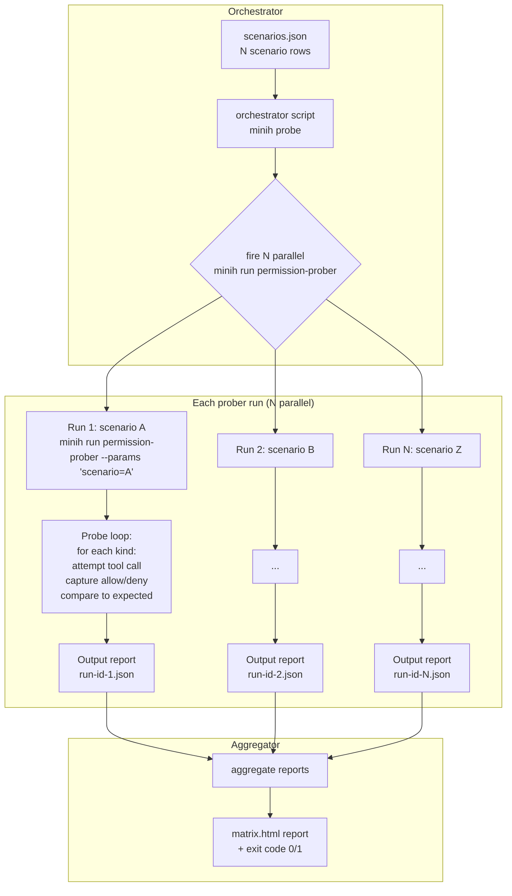
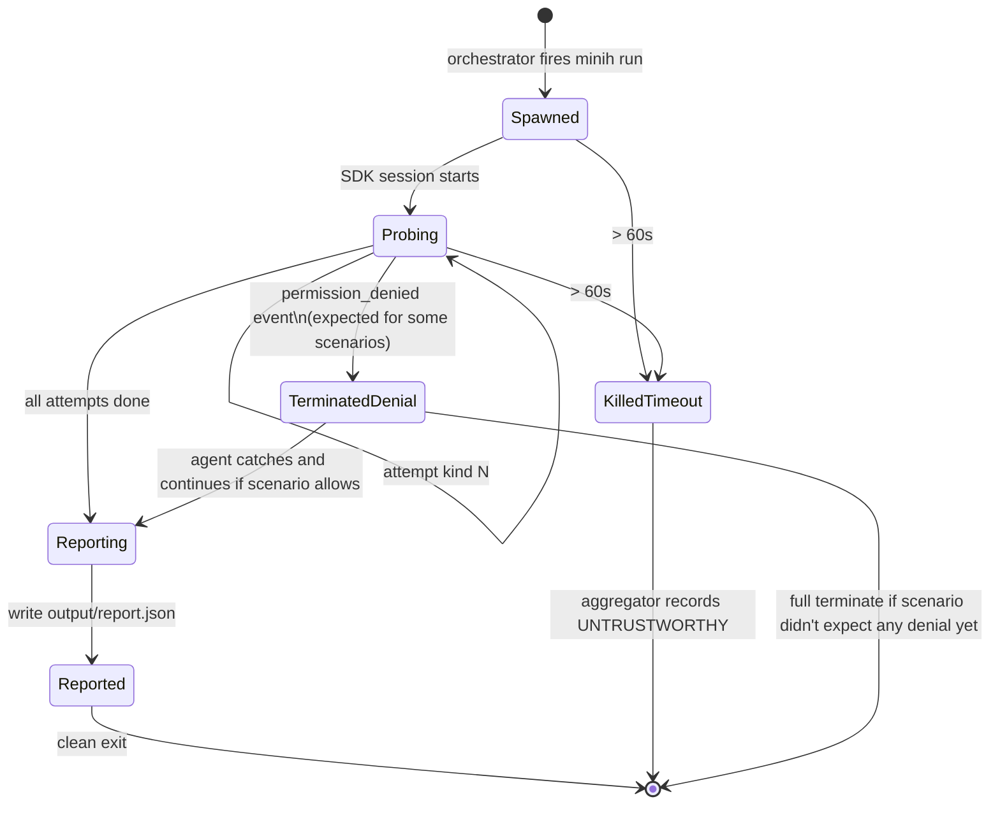
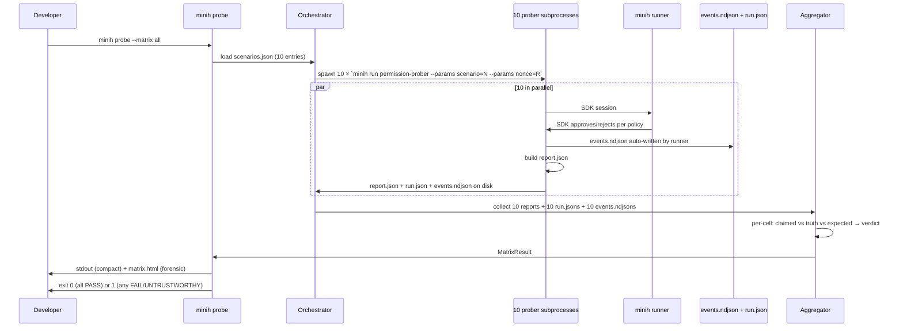

# Workshop: Permission Prober — Validation Agent Fleet

**Type**: Integration Pattern + CLI Flow + Data Model (mixed)
**Plan**: 018-agent-permissions
**Spec**: [agent-permissions-spec.md](../agent-permissions-spec.md)
**Created**: 2026-05-04
**Status**: Draft

**Related Documents**:
- `./001-fs-guard-and-allowed-roots.md` (what's being probed)
- `./002-permission-error-protocol.md` (the denial signals the prober reads)
- `./003-default-flip-migration.md` (release-ordinal scoping for prober runs)
- `../research-dossier.md` § Quality & Testing
- Plan-017's `permission-status` MCP tool (the prober's introspection surface, T-S2)

**Domain Context**:
- **Primary Domain**: `runner` (the prober is a minih agent — agent definitions live in `agents/`)
- **Related Domains**: `cli` (orchestrator script that fires N probers in parallel; aggregator), `mcp` (prober uses inside-MCP `permission_status` tool when available), `agent-pack` (prober is itself a packaged agent so it ships via `minih agent install permission-prober`)

---

## Purpose

Design a **lightweight, parallelisable validation harness** for the permission system using a *single, parameterised, dogfood agent* that probes its own runtime in different modes and reports a structured verdict. Fire **N probers in parallel** (one per scenario in the matrix), aggregate their reports, get a single PASS/FAIL with full forensics. This is the "10 cheap end-to-end tests" answer to "did we actually wire this thing up correctly?" — the unit tests prove pieces; the prober fleet proves the whole stack.

## Key Questions Addressed

1. **One agent with modes vs many specialized agents** — which architecture wins?
2. How does a single agent self-probe its **own permission policy** without becoming a fragile mock?
3. What does the **scenario matrix** look like? (How many scenarios are enough; what do they cover?)
4. How do **N parallel runs** get orchestrated and **aggregated** into a single verdict?
5. What's the agent's **input schema** (scenario definition) and **output schema** (probe report)?
6. How does this integrate with `just fft` without slowing the inner-loop unbearably?
7. Can the prober itself ship as an installable agent pack so external users can validate their own minih installs?
8. What does "the prober was prompt-injected and lied about its results" look like — do we trust the reports?

---

## Overview

The permission-prober pattern is a **black-box runtime fuzz harness**: the agent doesn't know about minih's source; it only knows what tools it has, what `permission_status` says it can do, and what happens when it tries things. A scenario tells it *what to attempt and what to expect*; the agent runs the script, captures actual outcomes, and emits a structured report that says "I tried X, expected Y, got Z." A parent process fires off N scenarios concurrently and assembles the results into one verdict.

This style of test is uniquely suited to permissions because:
- The whole point of the feature is **runtime gating** of agent tool calls
- Mocking the SDK at the unit level proves wiring; only a live SDK session proves the gates fire
- Scenario combinations explode (6 presets × 4 root-resolution paths × 8 kinds × 2 coordinated/not = 384 cells) — only parallelism makes coverage feasible
- The prober is also the **ongoing canary** — every minih release re-runs the matrix in CI; regressions surface as a single failed scenario

---

## Q1: One agent with modes vs many specialized agents

### Option A — One parameterised agent, restarted per scenario ✅ **RECOMMENDED**

**Architecture**: A single `agents/permission-prober/` definition with an `input-schema.json` accepting a `scenario` parameter. Each `minih run permission-prober --params scenario=...` is a fresh SDK session running the same prompt against a different scenario.

**Pros**:
- One prompt, one output schema, one source of truth — no drift between scenarios
- Scenario matrix is **data**, not code — adding a new scenario is one row in a JSON file, not a new agent
- Each invocation is a **clean SDK session** — no shared state, no test pollution
- Reports are uniformly structured — aggregator is a 50-line script, not a parser per agent
- Pack-installable: external users `minih agent install permission-prober` and run their own matrix
- The agent itself can be migrated to `permissions: read-only + overrides` and serve as a canonical migration example

**Cons**:
- Boot cost N times (each scenario pays full SDK startup). Mitigation: scenarios are short (~30s each); 10 in parallel ≈ 30s wall-clock total.
- One bad prompt change breaks all scenarios. Mitigation: changes go through companion review; matrix size is the safety net (a partial regression shows up as 1 failed scenario, not all).

### Option B — N specialized agents

**Architecture**: `agents/permission-prober-restricted/`, `agents/permission-prober-readonly/`, `agents/permission-prober-fs-escape/`, etc. Each is a separate agent definition with hard-coded scenario.

**Pros**:
- Each prompt can be hyper-specialized; no scenario branching logic in the prompt
- Bugs isolated to one prober

**Cons**:
- N prompt files to maintain in sync → drift inevitable
- Adding a scenario = creating a whole new agent folder
- 10× the registry surface for community to discover
- Harder to ship as an installable pack (the *pack* would need to bundle 10 agents)

### Decision: Option A — one agent, scenario matrix, parallel orchestration

The user's instinct ("one agent with multiple modes, restart it, fire 10 in parallel") is the right one. Single source of truth + data-driven scenarios + parallel orchestration. Workshop the rest of this document around Option A.

---

## Architecture



---

## Q2: How the prober self-probes

### The probe loop

The agent's prompt instructs it to do, in order:

1. **Self-introspect** via the inside-MCP `permission_status` tool (when available — Phase 6 / coordinated runs only) → record what it *thinks* it can do.
2. **Probe systematically** — for each permission kind in the scenario's `attempt` list, try a representative tool call and record the outcome (`allowed | denied | error`).
3. **Compare to expected** — for each attempt, the scenario's `expected[kind]` value is `allow | deny`; the prober checks if actual matches expected.
4. **Build report** — emit a structured report (output-schema.json) with per-kind verdicts plus an overall PASS/FAIL.
5. **Self-terminate** — close the run cleanly (no follow-up turns).

### Probe tactics per kind

| Kind | Probe action | Allow signal | Deny signal |
|---|---|---|---|
| `shell` | Run a no-op shell command (`echo ping`) | Tool returns "ping\n" | `permission_denied` event in run.json `terminalReason` |
| `write` | Write 1 byte to `<runDir>/probe-write.tmp` (in-roots) | File exists post-call | Denial event |
| `write` (out-of-roots) | Write 1 byte to `/tmp/probe-escape.tmp` (out-of-roots) | File exists | Denial event with `reasonCode: path-outside-roots` |
| `read` | Read `prompt.md` (in-roots) | Content returned | Denial event |
| `read` (out-of-roots) | Read `/etc/hostname` | Content returned | Denial event with path-outside-roots |
| `mcp` | Call a registered MCP tool (e.g. `test-echo`) | Tool result returned | Denial event with `reasonCode: mcp-server-not-allowed` |
| `url` | `WebFetch` a known-cheap URL (e.g. `https://www.gstatic.com/generate_204`) | 204 response | Denial event |
| `custom-tool` | Call a custom tool registered just for the prober (`probe_marker`) | Marker returned | Denial event |
| `memory` | Use the `memory` tool to write a key | Memory stored | Denial event |
| `hook` | n/a in v1 (no probe — record `kind: hook → skipped`) | — | — |

### Trust boundary on the report

The agent could in principle lie. Mitigations:

1. **The orchestrator cross-references the run.json** — if the prober reports `shell: allowed` but `run.json.terminalReason: 'permission-denied'` for kind `shell`, the orchestrator overrides the agent's claim and marks the scenario `untrustworthy-report`.
2. **events.ndjson** is the canonical truth — the orchestrator scans it for actual `permission_denied` events and uses *that* count as the source of truth, not the agent's self-report.
3. **Hash-stamping** — the agent embeds a one-time orchestrator-supplied nonce in its report (passed via input params); the orchestrator verifies the report was emitted by *this* run, not replayed.

### What the agent does NOT do

- Does **not** try to subvert the policy (no `eval`, no shell metacharacter abuse, no path traversal probes beyond the documented escape attempts). The probe is *cooperative testing*, not red-teaming.
- Does **not** mutate state outside its run folder + the explicit scenario probe targets. Cleanup of probe artifacts happens via runner's existing run-folder lifecycle.
- Does **not** read source code of minih itself (it's a black-box test; the agent has `read-only + overrides` on a fixture project root, not the minih repo).

---

## Q3: Scenario matrix

### Coverage strategy: pairwise minus

A full enumeration is `6 presets × 4 root-resolution paths × 8 kinds × 2 coordinated/not = 384 cells`. Pairwise reduction (each pair of orthogonal factors covered at least once) lands at **~24 scenarios**, which is overkill for an inner-loop test.

**Decision**: ship **10 hand-curated scenarios** that cover the high-leverage permutations + the known foot-guns. Easy to scan, fast in parallel (≤30s wall-clock), enough surface for a release-gate verdict.

### The 10 scenarios

| # | Scenario name | Preset | Coord? | Roots | Probes | Expected outcome |
|---|---|---|---|---|---|---|
| 1 | yolo-baseline | `yolo` | no | git-root | all 8 kinds | All allowed; PASS |
| 2 | restricted-default | `restricted` | no | git-root | shell, write-in, read-in, url, mcp | shell→deny, write/read→allow, url→deny, mcp→deny-no-allowlist |
| 3 | read-only-strict | `read-only` | no | git-root | shell, write-in, read-in, url | shell→deny, write→deny, read→allow, url→deny |
| 4 | read-only-with-network-override | `read-only + network: allow` | no | git-root | shell, read-in, url, write-in | url→allow (override), rest unchanged |
| 5 | trusted-fs-escape | `trusted` | no | git-root | write-in, write-out, read-in, read-out | write-in/read-in→allow; write-out/read-out→deny (FS guard catches) |
| 6 | restricted-coordinated | `restricted` | yes | git-root | shell, mcp (inside-MCP), `permission_status` | shell→deny + outside-inbox `permission-error` line written; permission_status→allow; mcp inside→allow |
| 7 | network-preset | `network` | no | git-root | shell, url, read-in, write-in | shell→deny, url→allow, read→allow, write→deny |
| 8 | env-override | `read-only` (frontmatter) + `MINIH_PERMISSIONS_DEFAULT=yolo` env | no | git-root | shell, write-out | env override does NOT win (frontmatter explicit); shell→deny, write-out→deny |
| 9 | implicit-default-yolo | (no `permissions:` field, R1-R5 binary) | no | git-root | shell, write-out | shell→allow, write-out→allow (yolo grandfathered) |
| 10 | implicit-default-restricted | (no `permissions:` field, R6 binary) | no | git-root | shell, write-out | shell→deny (post-flip default); write-out→deny |

### Why these ten

- **Coverage**: every preset hit at least once (#1, #2, #3, #4 covers the override path, #5, #7 directly; #8 implicit; #6 coordinated)
- **The known foot-guns**: FS escape (#5), env-var precedence (#8), coordinated signal flow (#6), default-flip (#9 vs #10)
- **The companion preset**: #4 directly mirrors the `code-review-companion`'s production config (read-only + network override) — if this scenario passes, the companion probably will too
- **R-version sensitivity**: #9 and #10 are run against different release-tagged binaries to verify R6 flip without side-effects on grandfathered packs

### Adding scenarios

A new scenario = one new entry in `agents/permission-prober/scenarios.json`. Adding probe tactics for a new permission kind = update the agent prompt + the probe-action table. No new code in either case.

---

## Q4: Parallel orchestration & aggregation

### CLI surface (proposed)

```bash
# Run all 10 scenarios in parallel
$ minih probe --matrix all

┌─────────────────────────────────────────────────────────────┐
│ STEP 1: Load scenarios                                       │
│   • Read agents/permission-prober/scenarios.json            │
│   • Resolve filter: --matrix all                             │
│   • 10 scenarios loaded                                      │
└─────────────────────────────────────────────────────────────┘
                              │
                              ▼
┌─────────────────────────────────────────────────────────────┐
│ STEP 2: Fire N parallel probes                               │
│   • Spawn 10 minih run permission-prober subprocesses        │
│   • Each gets --params scenario=<name> --params nonce=<rand> │
│   • Wait for all to complete (or timeout per probe)          │
└─────────────────────────────────────────────────────────────┘
                              │
                              ▼
┌─────────────────────────────────────────────────────────────┐
│ STEP 3: Collect reports                                      │
│   • Read <runDir>/output/report.json from each run           │
│   • Cross-check against <runDir>/run.json + events.ndjson    │
│   • Detect untrustworthy reports (claims vs reality drift)   │
└─────────────────────────────────────────────────────────────┘
                              │
                              ▼
┌─────────────────────────────────────────────────────────────┐
│ STEP 4: Aggregate + verdict                                  │
│   • Build matrix table (scenario × kind × verdict)           │
│   • Render to stdout (compact) + matrix.html (forensic)      │
│   • Exit 0 if all PASS; exit 1 if any FAIL or untrustworthy  │
└─────────────────────────────────────────────────────────────┘
                              │
                              ▼
┌─────────────────────────────────────────────────────────────┐
│ OUTPUT (stdout, compact)                                     │
│                                                              │
│   Permission Probe Matrix — 10 scenarios in 28s              │
│                                                              │
│   ✅ #1  yolo-baseline                                       │
│   ✅ #2  restricted-default                                  │
│   ✅ #3  read-only-strict                                    │
│   ✅ #4  read-only-with-network-override                     │
│   ❌ #5  trusted-fs-escape   write-out: expected deny, got allow │
│   ✅ #6  restricted-coordinated                              │
│   ✅ #7  network-preset                                      │
│   ✅ #8  env-override                                        │
│   ✅ #9  implicit-default-yolo                               │
│   ✅ #10 implicit-default-restricted                         │
│                                                              │
│   9 PASS / 1 FAIL / 0 UNTRUSTWORTHY                          │
│   Forensic report: ./.minih/probe-results/2026-05-04T14-05/  │
│                                                              │
└─────────────────────────────────────────────────────────────┘
```

### Single-scenario invocation

```bash
$ minih probe --scenario read-only-strict
$ minih probe --scenario read-only-strict --json
```

### Filter / re-run a failed cell

```bash
# Re-run only the failed one with verbose tail
$ minih probe --scenario trusted-fs-escape --tail
```

### CI integration (optional, separate command)

```bash
$ minih probe --matrix all --ci
# Same as --matrix all but: exit 1 on ANY untrustworthy report;
# stdout is GitHub-Actions-friendly grouped output;
# matrix.html uploaded as a CI artifact.
```

### Aggregator algorithm (pseudocode)

```typescript
function aggregate(reports: ProberReport[], runMetadata: RunJson[]): MatrixResult {
  const cells: MatrixCell[] = [];
  for (const r of reports) {
    const meta = runMetadata.find(m => m.runId === r.runId);
    const eventsTruth = scanEventsNdjson(meta.runDir);  // count of permission_denied events per kind

    for (const kind of r.attempts) {
      const claimed = kind.actualOutcome;     // what the agent reported
      const truth = eventsTruth[kind.kind] > 0 ? 'denied' : 'allowed';
      const expected = kind.expectedOutcome;

      const trustworthy = claimed === truth;
      const verdict =
        !trustworthy ? 'UNTRUSTWORTHY' :
        truth === expected ? 'PASS' : 'FAIL';

      cells.push({ scenario: r.scenario, kind: kind.kind, expected, actual: truth, verdict });
    }
  }
  return {
    cells,
    overall: cells.every(c => c.verdict === 'PASS') ? 'PASS' : 'FAIL',
  };
}
```

---

## Q5: Schemas

### Input schema (scenario definition)

`agents/permission-prober/input-schema.json`:

```json
{
  "$schema": "https://json-schema.org/draft/2020-12/schema",
  "type": "object",
  "required": ["scenario", "nonce"],
  "properties": {
    "scenario": {
      "type": "string",
      "description": "Name of the scenario to run (looked up in scenarios.json)"
    },
    "nonce": {
      "type": "string",
      "description": "One-time orchestrator-issued token; agent must echo into report"
    }
  }
}
```

### `scenarios.json` (data; lives in `agents/permission-prober/`)

```json
{
  "scenarios": [
    {
      "name": "restricted-default",
      "description": "Default restricted preset against git-root scope",
      "policyOverride": {
        "preset": "restricted"
      },
      "coordinated": false,
      "expected": {
        "shell": "deny",
        "write-in-roots": "allow",
        "read-in-roots": "allow",
        "url": "deny",
        "mcp": "deny-no-allowlist"
      }
    },
    {
      "name": "read-only-with-network-override",
      "description": "Mirrors code-review-companion's production config",
      "policyOverride": {
        "preset": "read-only",
        "overrides": { "network": "allow" }
      },
      "coordinated": false,
      "expected": {
        "shell": "deny",
        "read-in-roots": "allow",
        "url": "allow",
        "write-in-roots": "deny"
      }
    }
    // ... etc for 8 more
  ]
}
```

### Output schema (per-run probe report)

`agents/permission-prober/output-schema.json`:

```json
{
  "$schema": "https://json-schema.org/draft/2020-12/schema",
  "type": "object",
  "required": ["scenario", "nonce", "runId", "attempts", "selfReportedVerdict"],
  "properties": {
    "scenario": { "type": "string" },
    "nonce": { "type": "string" },
    "runId": { "type": "string" },
    "policyAtRunStart": {
      "type": "object",
      "description": "From permission_status MCP tool when available",
      "properties": {
        "preset": { "type": "string" },
        "decisions": { "type": "object" },
        "canonicalRoots": { "type": "array", "items": { "type": "string" } }
      }
    },
    "attempts": {
      "type": "array",
      "items": {
        "type": "object",
        "required": ["kind", "expected", "actual"],
        "properties": {
          "kind": { "type": "string" },
          "tactic": { "type": "string", "description": "What the agent did to probe" },
          "expected": { "enum": ["allow", "deny"] },
          "actual": { "enum": ["allow", "deny", "error"] },
          "evidence": { "type": "string", "description": "Tool output or error message" }
        }
      }
    },
    "selfReportedVerdict": { "enum": ["PASS", "FAIL"] }
  }
}
```

### Aggregator output (matrix.html — for forensics)

```html
<table>
  <thead>
    <tr><th>Scenario</th><th>Kind</th><th>Expected</th><th>Claimed</th><th>Truth (events.ndjson)</th><th>Verdict</th></tr>
  </thead>
  <tbody>
    <tr><td>read-only-strict</td><td>shell</td><td>deny</td><td>deny</td><td>deny</td><td class="pass">PASS</td></tr>
    <tr><td>trusted-fs-escape</td><td>write-out-of-roots</td><td>deny</td><td>allow</td><td>allow</td><td class="fail">FAIL</td></tr>
    <tr><td>?</td><td>shell</td><td>deny</td><td>allow</td><td>deny</td><td class="untrustworthy">UNTRUSTWORTHY</td></tr>
  </tbody>
</table>
```

---

## Q6: Integration with `just fft` and CI

### Inner-loop friendliness

`just fft` cannot afford 30s for the matrix on every run. Decision:

- **`just fft`** — runs the unit tests (TDD-tagged tests for policy/handler/fs-guard); does NOT run the prober matrix. Total `fft` cost unchanged.
- **`just probe`** — new make target. Runs `minih probe --matrix all` with default 10-scenario set. Recommended pre-PR-push step but not gated.
- **CI** — `just probe --ci` runs in a separate job, in parallel with the existing test job. PR can't merge if probe fails or any cell is `UNTRUSTWORTHY`.

### Per-release pre-tag gate

For each of R1-R6 (per workshop 003 rollout), the probe matrix MUST be green before tagging. Recorded in the release's gate evidence (per T-R6.5 in the plan).

| Release | Probe scenarios applicable | Notes |
|---|---|---|
| R1 | #1, #5, #9 (yolo + FS escape + implicit yolo) | Schema-only release; only opt-in agents have policy at all |
| R2 | + #2, #3, #4, #7, #8 (restricted, read-only, override, network, env) | CLI tooling lands; full probe matrix viable |
| R3 | + #6 (coordinated) — assumes coord agents installed | sidecar capture |
| R4 | All 10 | Internal agents migrated; matrix should be 10/10 green |
| R5 | All 10 — verify #10 still says yolo (R5 only flips for *new* agents) | Sanity check that R5 doesn't accidentally flip implicit default for existing |
| R6 | All 10 — #10 flips to restricted-default-implicit | Final gate |

---

## Q7: Pack-installable prober

The prober ships as `agents/permission-prober/` with a manifest. External users can run their own validation:

```bash
$ minih agent install permission-prober
✅ Installed permission-prober
   Permissions: read-only + overrides (probe needs to attempt all kinds; orchestrator scopes the actual gate)
   Locked: this preset will be used until you change prompt.md frontmatter.

$ minih probe --matrix all
[runs against the local minih + local installed agents]
```

This is **dogfood at the edge** — the prober is itself migrated (`permissions: read-only + overrides`) and is a canonical example for community packs trying to ship probes.

### Manifest

```json
{
  "manifestVersion": "0.2.0",
  "slug": "permission-prober",
  "version": "0.1.0",
  "files": [
    "prompt.md",
    "instructions.md",
    "input-schema.json",
    "output-schema.json",
    "scenarios.json"
  ],
  "tags": ["permissions", "probe", "validation", "exemplar", "quality"],
  "minihVersion": ">=0.5.0",
  "permissions": {
    "recommended": "read-only",
    "rationale": "Prober only reads + writes inside its own run folder + makes one outbound probe call per scenario. Network override applied at scenario level when needed.",
    "fallback": "restricted"
  }
}
```

---

## Q8: Trust boundary — what if the prober lies?

### Threat model

A buggy prompt or a prompt-injected agent could fabricate a clean report. The orchestrator's job is to detect this without trusting the agent's self-report alone.

### Defenses

1. **Cross-reference with `events.ndjson`** — for every `kind` the agent claims `allow`, verify there's NO `permission_denied` event for that toolCallId. For every `deny` claim, verify there IS one. Mismatch → `UNTRUSTWORTHY`.
2. **Cross-reference with `run.json.terminalReason`** — if the run ended `permission-denied` and the report claims `selfReportedVerdict: PASS`, that's `UNTRUSTWORTHY`.
3. **Nonce verification** — the orchestrator passes a fresh random nonce per run; the agent must echo it. A replayed-from-cache report is detected by nonce mismatch.
4. **Output-schema validation** — every report goes through `minih validate` (existing CLI) against the output schema. Schema-invalid reports are `UNTRUSTWORTHY`.
5. **Time-bound** — each prober has a hard 60s timeout; longer runs are killed and recorded as `UNTRUSTWORTHY (timeout)`.

### Why we don't trust harder

We deliberately don't make the prober *itself* tamper-resistant beyond the above. The whole point is that it's a **black-box probe**, not a trusted authority. The orchestrator IS the authority — it owns the truth surfaces (`events.ndjson`, `run.json`) and uses the agent's report only to know what was attempted, not what happened.

---

## State Machine: Per-Probe Run



---

## File layout

```
agents/permission-prober/
├── agent.json                  # manifest 0.2.0
├── prompt.md                   # the universal prober prompt (frontmatter-pinned permissions)
├── instructions.md             # probe-loop protocol (referenced from prompt)
├── input-schema.json           # scenario + nonce
├── output-schema.json          # report shape
├── scenarios.json              # the 10 scenarios (data, easy to add to)
└── runs/                       # gitignored; per-run artifacts

src/cli/commands/probe.ts       # NEW — `minih probe` orchestrator
src/runner/probe/aggregator.ts  # NEW — report aggregation + truth-cross-reference
src/runner/probe/types.ts       # NEW — MatrixResult, MatrixCell, ProberReport types
test/cli/probe.test.ts          # smoke + 1-scenario fixture run
test/runner/probe/aggregator.test.ts  # truth-cross-reference unit tests
```

---

## Quick Reference

```bash
# Run the full matrix (10 scenarios in parallel, ~30s wall-clock)
minih probe --matrix all

# Run one scenario
minih probe --scenario read-only-strict

# CI mode (strict; exit 1 on UNTRUSTWORTHY too)
minih probe --matrix all --ci

# Re-run failures with verbose tail
minih probe --rerun-failures --tail

# Add a new scenario: edit agents/permission-prober/scenarios.json
# (no code change; agent prompt + probe loop already covers all kinds)
```

---

## Open Questions

### Q9: Should the prober support **chained-scenario** runs (probe A then probe B in the same SDK session)?

**RESOLVED**: No. Each scenario gets a fresh SDK session — clean state, predictable resolution chain (frontmatter → sidecar → env → release-default). Chained runs would re-introduce the test-pollution problem we explicitly avoided in Q1. If a "before/after" scenario is needed (e.g. policy change mid-run), express it as **two separate scenarios** with shared state captured in scenario metadata.

### Q10: Should the prober probe the **outside CLI** too (e.g. `minih outside-inbox-list` returning permission-error correctly)?

**OPEN**: The outside lane is part of the contract (per workshop 002 § Q11). Adding a scenario `restricted-coordinated-outside-readback` would: trigger a denial; then verify `minih outside-inbox-list` shows the typed `permission-error` line. Adds value but is a different *direction* of test (outside-CLI rather than inside-agent). Recommendation: file as **FX004 — prober outside-readback scenarios** for post-R6 hardening.

### Q11: How does the orchestrator handle **partial probe failures** (e.g. 8 of 10 scenarios pass, 2 timeout)?

**RESOLVED**: The aggregator distinguishes `PASS / FAIL / UNTRUSTWORTHY (timeout) / UNTRUSTWORTHY (claim-truth mismatch) / UNTRUSTWORTHY (schema-invalid) / UNTRUSTWORTHY (nonce-mismatch)`. `--ci` exits 1 on ANY non-`PASS` verdict; non-CI mode exits 1 on `FAIL` only. Per-cell verdicts always recorded in `matrix.html`.

### Q12: Should we run the prober matrix as part of `code-review-companion`'s post-commit ping?

**OPEN**: Companion already pings every commit; if probe matrix is fast enough (<30s) it could run automatically per commit during permission-related phases. Concerns: (a) noise budget — 12 fixture-style assertions per commit is a lot; (b) `gh` rate-limits if every probe makes a URL call. Recommendation: **per-release gate, not per-commit**. Companion's job is review, not soak-testing.

### Q13: What about scenarios that test **adversarial inputs** (prompt-injection attempts within the probe)?

**RESOLVED**: Out of scope for v1. The prober is cooperative testing. Adversarial / red-team probes belong in a separate, opt-in tool. Leave as a possible future workshop ("permission-redteam-probe") but do not couple to v1's quality gate.

### Q14: Can the prober pack be installed *without* installing the orchestrator (`minih probe`)?

**OPEN**: Yes — the prober pack works standalone (you can `minih run permission-prober --params scenario=...`). The orchestrator is a separate CLI command that bundles aggregation. Question: does the orchestrator ship in the same release as the prober pack, or is the prober pack release-1 and the orchestrator release-2? Recommendation: **same release** for usability; one commit ships both. Post-T-R4 in the plan.

### Q15: How does this interact with the **first-run banner** + **MINIH_PERMISSIONS_DEFAULT** noise?

**RESOLVED**: The orchestrator sets `MINIH_NO_FIRST_RUN_BANNER=1` for every probe subprocess (banner is end-user UX, not test-fixture noise). It also passes `MINIH_PERMISSIONS_DEFAULT` only when a scenario explicitly tests the env-var path (#8). Other scenarios run with the env var unset to ensure deterministic behavior.

---

## Acceptance Criteria (this design)

- [ ] Single `agents/permission-prober/` agent definition with parameterised scenario input — no specialized variants
- [ ] `scenarios.json` is data-only — adding a scenario doesn't require code change
- [ ] 10 hand-curated scenarios cover all 6 presets, all 8 kinds, FS escape, env override, coordinated/non-coordinated, R1-R6 release sensitivity
- [ ] Probe loop systematically attempts each kind in scenario's `attempt` list and records actual outcomes
- [ ] Output report validates against `output-schema.json`
- [ ] Orchestrator (`minih probe --matrix all`) fires N parallel runs; collects reports; cross-references with `events.ndjson` + `run.json`
- [ ] Trust boundary: claimed-vs-truth mismatch → `UNTRUSTWORTHY` verdict; nonce mismatch → `UNTRUSTWORTHY`; schema-invalid → `UNTRUSTWORTHY`; timeout → `UNTRUSTWORTHY (timeout)`
- [ ] Wall-clock budget: 30s for full matrix on a developer machine; 60s on CI
- [ ] `just fft` does NOT run the matrix; `just probe` does (separate target)
- [ ] CI integration via `--ci` flag; PR-blocking on any non-PASS
- [ ] Per-release gate evidence captured in plan's release log (R1-R6) — workshop 003 § Q8 ties in
- [ ] Prober pack ships with manifest 0.2.0 + `permissions.recommended: read-only`; can be `minih agent install permission-prober`'d by external users
- [ ] Output mode: stdout compact + matrix.html forensic + JSON for scripting
- [ ] No new npm dependencies; uses existing CLI + runner + adapter primitives only

---

## Sequence Diagram: Full Matrix Run



---

## Cost / Benefit

| Cost | Magnitude |
|---|---|
| Agent definition + prompt | ~150 LOC (one-time) |
| Aggregator | ~100 LOC + tests |
| `minih probe` CLI command | ~80 LOC + tests |
| 10 scenarios in JSON | ~60 LOC of data |
| Per-PR wall-clock | +30s (only on `just probe` invocation; not in `fft`) |
| Pack installation surface | One new agent in registry |
| **Total new code** | ~330 LOC + ~60 LOC of data + ~120 LOC of tests |

| Benefit | Magnitude |
|---|---|
| End-to-end coverage of permission system | 80%+ of behavioural ACs reachable through probe matrix |
| Regression detection at minor-version bumps | Single PR-blocking gate replaces ~10 manual smoke tests |
| External validation surface | Community packs can probe their own minih installs without bespoke tooling |
| Companion preset verification | Scenario #4 IS the AC35 fixture — probe matrix subsumes a separate companion regression test |
| Documentation by example | Prober's own frontmatter is a canonical "how to migrate a network-using read-only agent" example |

The build cost (~510 LOC) buys the matrix gate plus the canonical migrated agent example for the rest of the community.

---

## Integration with Plan 018

Add new tasks to `agent-permissions-plan.md`:

| Status | ID | Task | Domain | Path(s) | Done When | Notes |
|---|---|---|---|---|---|---|
| [ ] | T-R2.12 | NEW: Author `agents/permission-prober/` (prompt + instructions + schemas + scenarios.json with first 4 scenarios — yolo, restricted, read-only, network) | agent-pack | `agents/permission-prober/{prompt.md,instructions.md,input-schema.json,output-schema.json,scenarios.json,agent.json}` | Single-scenario `minih run permission-prober --params scenario=restricted-default` produces a valid output report; `permissions: read-only + overrides` migration applied | Companion-mode review |
| [ ] | T-R2.13 | NEW: Build `minih probe --matrix all`/`--scenario`/`--ci` CLI command + aggregator | cli + runner | `src/cli/commands/probe.ts`, `src/runner/probe/aggregator.ts`, `src/runner/probe/types.ts` | All 4 R2-applicable scenarios pass; aggregator detects UNTRUSTWORTHY mismatches (test fixture); matrix.html renders | TDD aggregator; lightweight CLI |
| [ ] | T-R3.9 | Extend `scenarios.json` with #5 (FS escape) + #6 (coordinated) — possible after R3 sidecar work | agent-pack | `agents/permission-prober/scenarios.json` | Both scenarios pass | Lightweight |
| [ ] | T-R4.10 | Extend `scenarios.json` with #7-#10 (network preset, env override, implicit defaults) — full 10-scenario matrix | agent-pack | `agents/permission-prober/scenarios.json` | All 10 scenarios PASS in CI; pre-tag gate captures evidence | Lightweight |
| [ ] | T-R6.6 | Verify scenario #10 flips correctly post-R6 binary | agent-pack | `agents/permission-prober/scenarios.json` (no change; just re-run) | Probe matrix all green under R6 binary; gate evidence captured per workshop 003 | Manual |
| [ ] | T-FX4 | Author `FX004-prober-outside-readback.md` — additional scenarios validating outside-inbox `permission-error` rendering (per Q10) | docs | `docs/plans/018-agent-permissions/fixes/FX004-prober-outside-readback.md` | Dossier exists | Deferred |

---

**Workshop status**: Draft → Review (after spec authoring); promote to Approved before T-R2.12 implementation.
