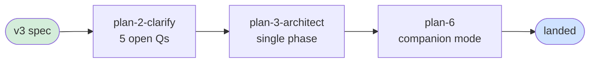

# Flight Plan: Companion Idle Check-In Protocol

**Status**: **Clarified** — ready for `/plan-3-architect`
**Spec**: [runner-idle-nudge-spec.md](runner-idle-nudge-spec.md)
**Created**: 2026-05-05
**Mode**: Simple (single phase, lightweight gates)

---

## At a Glance

Three framings considered; first two retired:

| Version | Framing | Status |
|---|---|---|
| v1 | Runner posts `control:idle-warning` to inside | ❌ Retired — inside isn't where pathology lives |
| v2 | Outside agent posts `control:idle-warning` to inside | ❌ Retired — outside is gone in 30% of cases |
| **v3** | **Inside companion sends `still-needed?` check-in to outside, exits if no reply** | ✅ **Current** |

**Empirical baseline** (workshop 001): 60% happy path, 30% orchestrator-never-engaged, 10% orchestrator-forgot-stop. The check-in heuristic addresses both the 30% (first-contact) and the 10% (post-task) with a single unified prompt rule.

**No runner changes. No CLI changes. Prompt-only.**

## Domain Footprint

| Domain | Relationship | Highlights |
|--------|--------------|-----------|
| `agents` (canonical companion) | **modify** | All work — `code-review-companion/{prompt.md, input-schema.json, output-schema.json, instructions.md}` |
| `runner` | consume | Zero code changes |
| `cli` | consume | Zero code changes |
| `mcp` | consume | Zero code changes |
| `adapter` | consume | Zero code changes |

## Key References

- **Authoritative use-case workshop**: [`workshops/001-idle-nudge-use-cases.md`](workshops/001-idle-nudge-use-cases.md) — empirical baseline + prompt diff sketch
- **Phase 2 runner-side blueprint** (out of scope here): [`../007-backgrounding/workshops/010-runner-soft-signals.md`](../007-backgrounding/workshops/010-runner-soft-signals.md)
- **Magic wand origin**: SQL `followups.mw-companion-idle-budget-visibility` (4+ retro mentions; resolved by deletion of clock-arithmetic prompt branch)
- **User direction**: *"why do they have to prompt. what has happened that the inside agent has stalled (has it even stalled). What is the flow."* — drove the v3 reframe

## Acceptance Snapshot (12 ACs from spec)

- [ ] AC1 — first-contact check-in fires after ~10 polls
- [ ] AC2 — `no_engagement` exit follows unanswered first-contact
- [ ] AC3 — engagement during wait window resets streak
- [ ] AC4 — post-task check-in fires after ~5 polls
- [ ] AC5 — `idle_budget` exit follows unanswered post-task check-in
- [ ] AC6 — stop-precedence preserved
- [ ] AC7 — single check-in per idle streak
- [ ] AC8 — configurable thresholds work
- [ ] AC9 — `threshold: 0` disables (legacy escape hatch)
- [ ] AC10 — schema validation accepts new fields + enum value
- [ ] AC11 — prompt content regression (new branches present, old clock arithmetic absent)
- [ ] AC12 — `docs/how/companion-mode.md` rewritten + dogfood-clean

## Open Questions Awaiting Clarify

✅ All resolved 2026-05-05. See spec § Clarifications.

## Clarify Summary

| Q | Topic | Decision |
|---|---|---|
| 1 | Workflow Mode | Simple |
| 2 | Testing | Lightweight |
| 3 | Mocks | Targeted |
| 4 | Docs | Hybrid (companion-mode.md + AGENTS.md mention) |
| 5 | Domains | Confirmed (agents only) |
| 6 | Default thresholds | More generous: 20/10/4 polls (~10 min / ~5 min / ~2 min) |
| 7 | Check-in body text | Workshop tentatives (natural language) |
| 8 | ackOf on check-in | Set to last task's id when post-task; unset when first-contact |
| 9 | Heuristic placement | Pseudocode in prompt.md, narrative in instructions.md |
| 10 | Dogfood criterion | No formal criterion — iterate organically |

## Complexity

**CS-1 (trivial)**, confidence 0.90 — uncertainty entirely on LLM behaviour with the new prompt. No code changes.

## Next Steps

- Resume `/plan-2-clarify` against the v3 scope (5 open questions remain — much smaller than v1/v2)
- Then `/plan-3-architect` — single-phase plan with task table
- Then `/plan-6-implement-phase-companion` — Power-On-Mode implementation

## History

| Date | Status | Notes |
|------|--------|-------|
| 2026-05-05 | Specifying v1 | Spec drafted from workshop 010 (runner-side framing); 5 open questions for clarify |
| 2026-05-05 | Specifying v2 | Reframed to orchestrator-as-nudger per user feedback |
| 2026-05-05 | Specifying v3 | **Reframed again** — workshop 001 surveyed actual run data (60/30/10 distribution); inside-asks-outside check-in protocol replaces both prior framings. CS dropped to CS-1 (prompt-only, no code). Prompt diff validated for LLM-friendliness. |
| 2026-05-05 | **Clarified** | All 10 questions resolved: Simple mode, Lightweight testing, Targeted mocks, Hybrid docs, Domain confirmed, generous default thresholds (20/10/4 polls), workshop body text, conditional ackOf, prompt.md pseudocode + instructions.md narrative, no formal dogfood gate. Ready for `/plan-3-architect`. |

