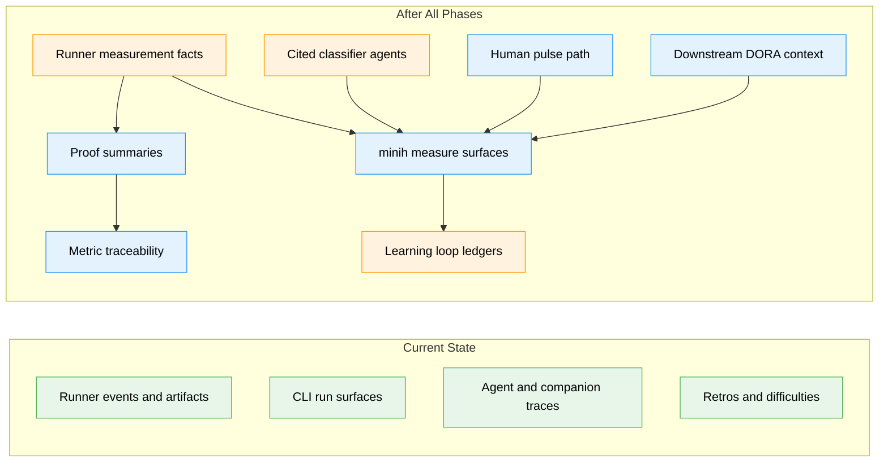

# Flight Plan: MiniH Harness Effectiveness Measurement

**Spec**: [minih-harness-measurement-spec.md](./minih-harness-measurement-spec.md)
**Plan**: Pending — run `/plan-3`
**Generated**: 2026-05-09
**Status**: Specifying

---

## The Mission

**What we're building**: MiniH will gain a measurement capability that shows whether the harness is making valuable work easier to enter, safer to change, faster to prove, and more likely to compound into reusable improvements. Users will be able to inspect run evidence, see a balanced scorecard, understand proof quality and friction, and connect findings to retrospectives, difficulties, magic-wand items, and later downstream delivery signals.

**Why it matters**: MiniH should prove value delivery through trusted evidence and calibrated learning, not through activity counts or productivity theater.

---

## Where We Are → Where We're Headed

```text
TODAY:                                      AFTER this plan:
MiniH has run artifacts, retros,            MiniH has a value-delivery scorecard
difficulties, validation, status,           grounded in proof quality, flow,
tail, probe, and companion-mode             learning, trust, and downstream context
signals, but no unified measurement layer.

🔵 Runner events and metadata exist         🟢 Runner facts feed measurement records
🔵 CLI status/tail/retros exist             🟢 CLI exposes measurement views
🔵 Companion mode exists                    🟢 Companions classify with citations
🔵 Probe precedent exists                   🟢 Benchmarks compare harness versions
❌ No proof-quality scorecard               🔴 Balanced scorecard
❌ No metric traceability registry          🔴 Framework traceability and caveats
❌ No pulse/trust measurement surface       🔴 Team-level human pulse path
❌ No DORA/ESSP bridge                      🔴 Optional downstream integration path
```



**Legend**: existing (green) | changed (orange) | new (blue)

---

## Scope

**Goals**:

- Measure whether MiniH reduces the time from intent to trustworthy evidence.
- Make proof quality visible beside any speed or flow improvement.
- Expose retries, waits, rescues, trust gaps, and proof failures as improvement inputs.
- Connect repeated friction to encoded mitigations and learning loops.
- Provide a balanced scorecard with hard signals, human signals, agent interpretation, and downstream context.
- Avoid individual productivity scoring, one-number rankings, and unsupported causal claims.

**Non-Goals**:

- Do not optimize for lines of code, PR count, prompt count, token count, or agent self-report.
- Do not create individual productivity scores, stack ranking, or surveillance views.
- Do not claim DORA or business causality before an evaluation method exists.
- Do not make dashboards the source of truth.
- Do not let agents invent facts without cited evidence.
- Do not require downstream integrations for the first useful local slice.

---

## Journey Map


**Legend**: green = done | yellow = active | grey = not started

---

## Phases Overview

Run `/plan-3` to generate implementation phases.

---

## Acceptance Criteria

- [ ] Users can inspect a completed MiniH run and see factual measurement fields, validation status, proof summary, caveats, and available evidence without reading run-directory files directly.
- [ ] Users can view a local balanced scorecard for a selected cohort/date range.
- [ ] Missing scorecard data is clearly distinct from zero values.
- [ ] Every reported metric has traceability metadata and caveats.
- [ ] Agents and companions can classify only when they cite evidence IDs or proof artifacts.
- [ ] Classification output is visibly interpretive and never overrides runner-owned facts.
- [ ] Team-level human pulse data can be captured or imported without producing individual productivity reports.
- [ ] Reporting surfaces discourage composite productivity scores, individual rankings, and unsupported DORA causality claims.

---

## Key Risks

| Risk | Mitigation |
|------|------------|
| Metrics become targets and invite gaming | Report balanced metric tensions, proof quality, provenance, and caveats instead of a single score |
| Measurement feels like surveillance | Default to team/system aggregation, avoid individual productivity views, and define privacy/redaction rules |
| "Validated" overclaims safety | Define proof levels and required artifacts before dashboarding proof metrics |
| Agent classifications appear factual | Require evidence IDs, confidence, caveats, and clear interpretive labeling |
| DORA movement is over-attributed to MiniH | Start with local leading capability claims and add causal evaluation later |

---

## Flight Log

_No phases completed yet._
