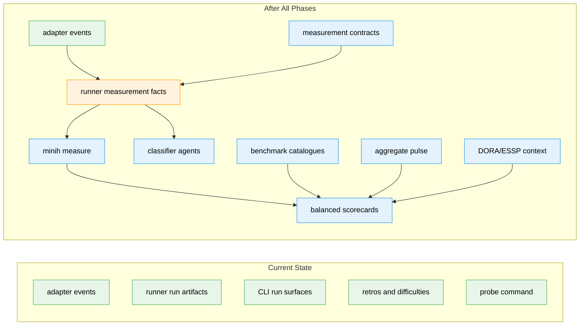
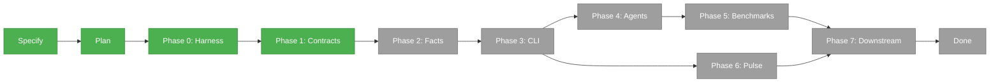

# Flight Plan: MiniH Harness Effectiveness Measurement

**Spec**: [minih-harness-measurement-spec.md](./minih-harness-measurement-spec.md)
**Plan**: [minih-harness-measurement-plan.md](./minih-harness-measurement-plan.md)
**Generated**: 2026-05-10
**Status**: Phase 1 landed

---

## The Mission

**What we're building**: MiniH will gain a local-first measurement layer that turns run evidence, proof summaries, benchmark results, retrospectives, and aggregate pulse data into a balanced value-delivery scorecard. Users will inspect a run through `minih measure`, see what proof level it reached, understand caveats, export redacted records, and connect recurring friction to reviewable improvements.

**Why it matters**: MiniH should prove value delivery through trusted evidence and calibrated learning, not through activity counts, code volume, or individual productivity scoring.

---

## Where We Are → Where We're Headed

```text
TODAY:                                      AFTER this plan:
4 registered domains                       5 registered domains
0 measurement domain                       1 conceptual measurement domain
0 minih measure commands                   1 measure namespace with local-first surfaces
0 measurement schemas                      6+ measurement/proof/pulse/classifier schemas
0 benchmark catalogues                     4 V1 catalogues
0 measurement agent packs                  2 cited interpretation agent packs

🔵 adapter events exist                    🔵 adapter remains normalized event source
🟡 runner artifacts exist                  🟢 runner emits proof + measurement records
🟡 CLI run/status/retros exist             🟢 CLI exposes measure inspect/scorecard/export
🟡 probe precedent exists                  🟢 benchmark catalogues reuse probe-style truth
❌ No proof-quality scorecard              🔴 Balanced proof/value/flow/learning scorecard
❌ No metric traceability registry         🔴 Metric registry with caveats and source levels
❌ No pulse/trust surface                  🔴 Aggregate pulse import/capture
❌ No DORA/ESSP bridge                     🔴 Optional downstream context with caveats
```



**Legend**: existing (green) | changed (orange) | new (blue)

---

## Scope

**Goals**:

- Measure whether MiniH reduces the path from intent to trustworthy evidence.
- Make proof quality visible beside flow and speed improvements.
- Expose retries, waits, rescues, false-pass candidates, and trust gaps as improvement inputs.
- Connect repeated friction to retrospectives, difficulties, magic-wand items, and reviewable mitigations.
- Provide a balanced local scorecard with facts, cited interpretation, aggregate pulse, and downstream context.
- Preserve trust by rejecting individual productivity scoring, one-number rankings, and unsupported causality claims.

**Non-Goals**:

- Do not measure success by lines of code, PR count, prompt count, token count, or agent self-report.
- Do not create individual productivity views, stack ranking, or surveillance surfaces.
- Do not claim DORA or business-outcome causality without an explicit evaluation method.
- Do not make dashboards the source of truth.
- Do not let agents invent facts, proof levels, or human-experience claims.
- Do not require external delivery-system integrations for the first useful local slice.

---

## Journey Map



**Legend**: green = done | yellow = active | grey = not started

---

## Phases Overview

| Phase | Title | Tasks | CS | Status |
|-------|-------|-------|----|--------|
| 0 | Build Harness Contract | 4 | CS-2 | Complete |
| 1 | Measurement Domain Contracts | 9 | CS-4 | Complete |
| 2 | Runner Measurement Facts | 6 | CS-5 | Pending |
| 3 | CLI Measurement Surface | 6 | CS-4 | Pending |
| 4 | Cited Interpretation Agents | 5 | CS-4 | Pending |
| 5 | Benchmarks and Learning Loops | 6 | CS-5 | Pending |
| 6 | Human Pulse and Privacy | 5 | CS-4 | Pending |
| 7 | Downstream Integration Contracts | 5 | CS-3 | Pending |

---

## Acceptance Criteria

- [ ] Users can inspect a completed run through `minih measure` and see measurement facts, validation status, proof summary, caveats, and evidence pointers.
- [ ] Users can view a local balanced scorecard with value/evidence, proof quality, flow/friction, learning, trust/pulse, and downstream status.
- [ ] Missing scorecard data is clearly distinct from zero values.
- [ ] Every user-visible metric has traceability metadata and caveats.
- [ ] Measurement agents and companions classify only with evidence IDs or proof artifacts.
- [ ] Interpretive agent output is visibly separate from runner-owned facts.
- [ ] Aggregate pulse data can be captured or imported without individual productivity reporting.
- [ ] Reporting surfaces discourage composite productivity scores, individual rankings, and unsupported DORA causality claims.

---

## Key Risks

| Risk | Mitigation |
|------|------------|
| Metrics become targets and invite gaming | Keep proof quality, caveats, missing data, and metric tensions visible; forbid composite productivity scores. |
| Measurement feels like surveillance | Aggregate pulse data, redact exports by default, and prohibit individual productivity views. |
| "Validated" overclaims safety | Define proof levels with required artifacts before scorecarding proof metrics. |
| Agent classifications appear factual | Require evidence IDs, confidence, caveats, and interpretive labels; runner facts remain authoritative. |
| Historical validation rewrites measurement meaning | Store schema-versioned snapshots and distinguish original proof state from current revalidation. |
| DORA movement is over-attributed to MiniH | Keep DORA/ESSP downstream and label it contextual unless causal evaluation exists. |

---

## Flight Log

<!-- Updated by /plan-6 and /plan-6a after each phase completes -->

Phase 0 harness contract completed with `docs/project-rules/harness.md`; Phase 1 measurement contracts are complete and Phase 2 is ready for tasking.

Phase 1 landed with proof-level helpers, metric registry, authority/redaction constants, six measurement schemas, schema contract tests, and an updated measurement domain contract. Full gate `just fft` passed before each commit boundary.
