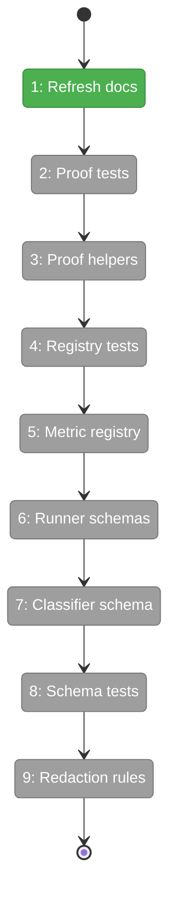
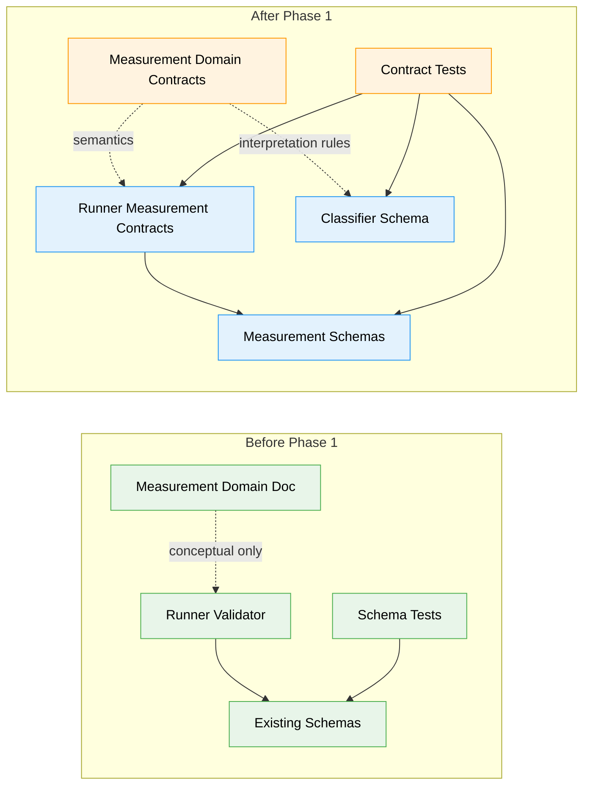

# Flight Plan: Phase 1 — Measurement Domain Contracts

**Plan**: [minih-harness-measurement-plan.md](../../minih-harness-measurement-plan.md)
**Phase**: Phase 1: Measurement Domain Contracts
**Generated**: 2026-05-10
**Status**: Ready for takeoff

---

## Departure → Destination

**Harness gate**: `docs/project-rules/harness.md` exists and validates MiniH's L2 engineering Boot -> Interact -> Observe loop.

**Where we are**: The measurement spec, workshops, master plan, conceptual measurement domain doc, and Phase 0 engineering harness contract exist. There are no runtime measurement contracts or schemas yet under `src/runner/measurement/` or `src/schemas/measurement-*.json`.

**Where we're going**: The system will have reviewed measurement concepts, proof-level and metric-registry contracts, JSON schema contracts, planned build-copy wiring, and focused contract tests. A Phase 2 implementer can derive runner-owned measurement facts without re-deciding proof levels, traceability wording, or redaction authority.

---

## Domain Context

### Domains We're Changing

| Domain | What Changes | Key Files |
|--------|--------------|-----------|
| measurement | Refines conceptual contracts, source-of-truth boundaries, traceability, and redaction guardrails. | `docs/domains/measurement/domain.md`, `docs/domains/registry.md`, `docs/domains/domain-map.md` |
| runner | Adds proof/metric contract modules, runner-owned schema contracts, and schema/proof/registry tests. | `src/runner/measurement/*`, `src/schemas/*.json`, `test/runner/measurement/*`, `test/runner/schemas.test.ts` |
| cli | Adds the classification schema contract that later CLI orchestration validates before surfacing interpretive output. | `src/schemas/measurement-classification.json` |

### Domains We Depend On (no changes)

| Domain | What We Consume | Contract |
|--------|-----------------|----------|
| adapter | Existing normalized events as future factual inputs only. | `AgentEvent` through runner contracts |
| mcp | Existing coordination state/inbox evidence through runner-owned files only. | Coordination file contracts |
| cli | Existing JSON envelope discipline for later measurement command output. | `MinihEnvelope` and command UX conventions |

---

## Flight Status

<!-- Updated by /plan-6-v2 during implementation: pending → active → done. Use blocked for problems/input needed. -->

**Legend**: grey = pending | yellow = active | red = blocked/needs input | green = done

---

## Stages

<!-- Updated by /plan-6 during implementation: [ ] → [~] → [x] -->

- [x] **Stage 1: Refresh domain docs** - clarify measurement as conceptual and preserve runtime ownership boundaries (`docs/domains/measurement/domain.md`).
- [ ] **Stage 2: Write proof tests** - describe L0-L6 defaults and artifact requirements before implementation (`test/runner/measurement/proof-levels.test.ts` - new file).
- [ ] **Stage 3: Add proof helpers** - export pure runner proof-level contracts (`src/runner/measurement/proof-levels.ts` - new file).
- [ ] **Stage 4: Write registry tests** - lock traceability levels, caveats, and framework wording (`test/runner/measurement/metric-registry.test.ts` - new file).
- [ ] **Stage 5: Add metric registry** - publish metric IDs, categories, mappings, and caveats (`src/runner/measurement/metric-registry.ts` - new file).
- [ ] **Stage 6: Add runner schemas** - add factual measurement, proof, scorecard, pulse, benchmark schemas, and explicit build-copy wiring (`src/schemas/*.json`, `scripts/copy-schemas.js`).
- [ ] **Stage 7: Add classifier schema** - require evidence-cited interpretive output for later CLI orchestration (`src/schemas/measurement-classification.json` - new file).
- [ ] **Stage 8: Extend schema tests** - compile and sample-validate every new schema (`test/runner/schemas.test.ts`).
- [ ] **Stage 9: Encode redaction rules** - keep fact, interpretation, human pulse, and downstream context authority visible (`docs/domains/measurement/domain.md`, `src/runner/measurement/types.ts`).

---

## Architecture: Before & After

**Legend**: existing (green, unchanged) | changed (orange, modified) | new (blue, created)

---

## Acceptance Criteria

- [ ] Every metric contract has traceability metadata and framework-mapping caveats.
- [ ] MiniH-local metrics are reported as "mapped to" or "aligned with" frameworks, not framework-native.
- [ ] Proof defaults are L5 for setup/change/benchmark, L4 for research/coordination, and L6 only for reproducibility.
- [ ] Interpretive classification output requires evidence IDs or proof artifacts.
- [ ] Classifications are visibly interpretive and cannot override runner-owned facts.
- [ ] Aggregate pulse contracts cannot produce individual productivity reports or composite productivity scores.
- [ ] Reporting contract tests reject composite productivity scores, individual rankings, missing provenance/redaction metadata, and unsupported DORA/business causality.
- [ ] The first useful local slice remains independent of downstream delivery-system integrations.

---

## Goals & Non-Goals

**Goals**:
- Define measurement vocabulary, proof levels, traceability, schemas, and authority/redaction contracts.
- Keep runtime ownership in runner and CLI while measurement remains conceptual.
- Add contract tests for proof levels, metric registry wording, and schema shapes.

**Non-Goals**:
- Emit measurement artifacts during runs; Phase 2 owns that.
- Add `minih measure` commands; Phase 3 owns that.
- Build classifier agents, benchmark execution, pulse capture, or downstream integrations.

---

## Checklist

- [x] T001: Refine the conceptual measurement domain docs (CS-2)
- [ ] T002: Add proof-level contract tests first (CS-2)
- [ ] T003: Implement proof-level contract helpers (CS-3)
- [ ] T004: Add metric registry contract tests first (CS-2)
- [ ] T005: Implement the metric registry contract (CS-3)
- [ ] T006: Add runner-owned measurement schemas and build copy wiring (CS-3)
- [ ] T007: Add the interpretive classification schema contract (CS-2)
- [ ] T008: Extend schema contract tests for every new schema, including privacy and missing-data negatives (CS-2)
- [ ] T009: Encode authority, composite-score, and redaction contracts (CS-2)

---

## PlanPak

Not active for this plan.
