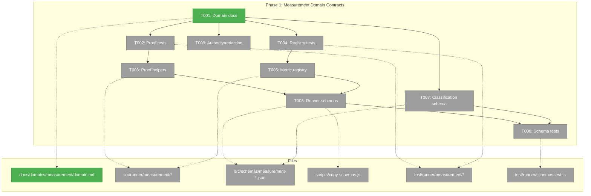
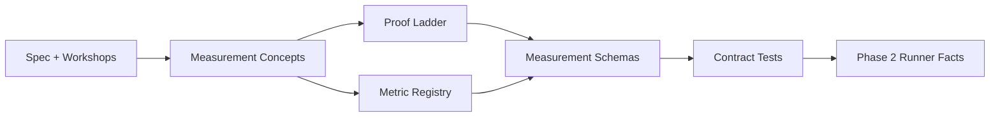
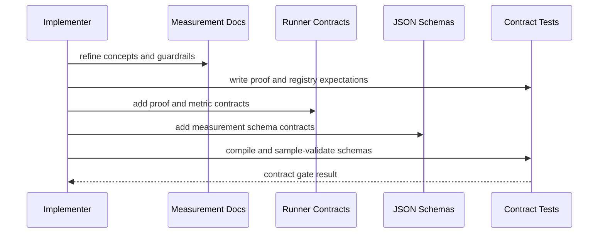

# Tasks: Phase 1 - Measurement Domain Contracts

**Plan**: [minih-harness-measurement-plan.md](../../minih-harness-measurement-plan.md)
**Phase**: Phase 1: Measurement Domain Contracts
**Created**: 2026-05-10
**Status**: Proposed - Phase 0 harness gate satisfied

---

## Executive Briefing

**Purpose**: This phase turns MiniH's measurement thesis into contracts that later runner, CLI, classifier, benchmark, and pulse work can safely consume. It defines the proof ladder, metric traceability, schema surfaces, and authority/redaction rules before any scorecard or measurement command can overclaim value.

**What We're Building**: A conceptual measurement domain contract, runner-owned proof and metric contracts, draft-2020-12 JSON schemas for the first measurement records, and a narrow contract test gate that proves the contracts compile and reject unsafe shapes.

**Goals**:
- Define the measurement vocabulary without introducing a runtime `measurement` import layer.
- Encode the L0-L6 proof ladder and default thresholds from the spec.
- Encode metric traceability so MiniH-local metrics say "mapped to" or "aligned with" frameworks.
- Add schema contracts for measurement events, proof summaries, scorecards, classifications, pulse aggregates, and benchmark catalogues.
- Define authority and redaction rules that separate runner-owned facts from interpretive or human-provided signals.
- Add focused contract tests so Phase 2 can build runner facts without re-deciding the vocabulary.

**Non-Goals**:
- Do not emit measurement artifacts during run finalization; Phase 2 owns that.
- Do not add `minih measure` commands or CLI UX; Phase 3 owns that.
- Do not create classifier or synthesizer agents; Phase 4 owns that.
- Do not implement pulse capture/import or benchmark execution; later phases own those surfaces.
- Do not claim DORA/ESSP causality or create individual productivity views.

---

## Prior Phase Context

Phase 1 mode skips the standard prior-phase review. The master plan declares a Phase 0 harness dependency, and `docs/project-rules/harness.md` now exists as the MiniH engineering harness contract.

### Phase 0: Build Harness Contract

A. **Deliverables**: `/Users/jordanknight/substrate/minih/docs/project-rules/harness.md` exists and defines Boot -> Interact -> Observe -> Validate for MiniH's engineering loop.

B. **Dependencies Exported**: Boot command `just build`, health check `minih doctor`, CLI interaction surfaces, evidence capture through `scratch/evidence/`, and narrow domain gates.

C. **Gotchas & Debt**: The harness is L2, not self-healing. Long-running interactive views and SDK-backed runs still need explicit auth/process handling.

D. **Incomplete Items**: L3/L4 harness maturity improvements remain future work; they are not required for Phase 1 contract implementation.

E. **Patterns to Follow**: Existing repo instructions already define dogfood paths and the full `just fft` gate; Phase 0 should formalize those as project harness evidence.

---

## Pre-Implementation Check

**Harness health check**: `docs/project-rules/harness.md` exists. Harness maturity is L2 after validation with `just build`, `minih doctor`, `minih list`, and redirected JSON evidence in `scratch/evidence/`.

| File | Exists? | Domain Check | Notes |
|------|---------|--------------|-------|
| `/Users/jordanknight/substrate/minih/docs/project-rules/harness.md` | Yes | project-rules | Satisfies the Phase 0 Harness gate for Phase 1 entry. |
| `/Users/jordanknight/substrate/minih/docs/domains/measurement/domain.md` | Yes | measurement | Modify only as conceptual contract documentation; do not make measurement a runtime import layer. |
| `/Users/jordanknight/substrate/minih/docs/domains/registry.md` | Yes | measurement cross-domain | Already registers measurement as Planned; update only if contract status changes. |
| `/Users/jordanknight/substrate/minih/docs/domains/domain-map.md` | Yes | measurement cross-domain | Already documents measurement as conceptual; preserve runtime import topology. |
| `/Users/jordanknight/substrate/minih/src/runner/measurement/types.ts` | No | runner | New contract file for proof, metric, authority, redaction, and schema-version types. |
| `/Users/jordanknight/substrate/minih/src/runner/measurement/proof-levels.ts` | No | runner | New proof ladder helper module. |
| `/Users/jordanknight/substrate/minih/src/runner/measurement/metric-registry.ts` | No | runner | New registry contract; use workshop traceability levels. |
| `/Users/jordanknight/substrate/minih/src/runner/index.ts` | Yes | runner | Re-export public measurement contracts only; no CLI imports. |
| `/Users/jordanknight/substrate/minih/src/schemas/measurement-event.json` | No | runner | New runner-owned factual event schema. |
| `/Users/jordanknight/substrate/minih/src/schemas/proof-summary.json` | No | runner | New proof summary schema. |
| `/Users/jordanknight/substrate/minih/src/schemas/measurement-scorecard.json` | No | runner | New balanced scorecard schema. |
| `/Users/jordanknight/substrate/minih/src/schemas/measurement-classification.json` | No | cli | New classifier output schema consumed by later CLI orchestration. |
| `/Users/jordanknight/substrate/minih/src/schemas/pulse-aggregate.json` | No | runner | New aggregate-only pulse schema; must not admit individual productivity fields. |
| `/Users/jordanknight/substrate/minih/src/schemas/benchmark-catalog.json` | No | runner | New benchmark catalogue schema for later runner records. |
| `/Users/jordanknight/substrate/minih/scripts/copy-schemas.js` | Yes | runner/build | Add new schemas so `npm run build` copies them to `dist/schemas`. |
| `/Users/jordanknight/substrate/minih/test/runner/schemas.test.ts` | Yes | runner | Extend strict AJV compile and sample validation coverage. |
| `/Users/jordanknight/substrate/minih/test/runner/measurement/proof-levels.test.ts` | No | runner | New contract tests for L0-L6 thresholds and artifact requirements. |
| `/Users/jordanknight/substrate/minih/test/runner/measurement/metric-registry.test.ts` | No | runner | New contract tests for traceability, caveats, and wording. |

**Concept duplication check**:
- Domain Concepts already define `Proof level`, `Metric traceability`, `Balanced scorecard`, `Aggregate pulse`, `False-pass candidate`, and `Reviewable mitigation` in `docs/domains/measurement/domain.md`.
- No runtime measurement implementation exists under `src/runner/measurement/`, and no measurement JSON schemas exist under `src/schemas/`; the new runtime contracts are safe to create.
- Reuse existing AJV and schema-test patterns from `src/runner/validator.ts`, `test/runner/schemas.test.ts`, and `scripts/copy-schemas.js`.

---

## Architecture Map



---

## Tasks

| Status | ID | Task | Domain | Path(s) | Done When | Notes |
|--------|----|------|--------|---------|-----------|-------|
| [x] | T001 | Refine the conceptual measurement domain docs | measurement | `/Users/jordanknight/substrate/minih/docs/domains/measurement/domain.md`<br>`/Users/jordanknight/substrate/minih/docs/domains/registry.md`<br>`/Users/jordanknight/substrate/minih/docs/domains/domain-map.md` | The docs explicitly preserve measurement as a conceptual contract domain, keep a `## Concepts` section, name source-of-truth boundaries, and leave runtime ownership in runner/cli/agents. | CS-2. Plan 1.1. Findings 02, 07, 08. |
| [ ] | T002 | Add proof-level contract tests first | runner | `/Users/jordanknight/substrate/minih/test/runner/measurement/proof-levels.test.ts` | Tests describe L0-L6, task-kind defaults, required artifacts, lower-confidence labels, and L6 reproducibility requirements before implementation. | CS-2. Covers [AC6]. |
| [ ] | T003 | Implement proof-level contract helpers | runner | `/Users/jordanknight/substrate/minih/src/runner/measurement/types.ts`<br>`/Users/jordanknight/substrate/minih/src/runner/measurement/proof-levels.ts`<br>`/Users/jordanknight/substrate/minih/src/runner/index.ts` | Runner exports typed proof-level contracts and helpers that classify setup/change/benchmark as L5 default, research/coordination as L4 default, and reproducibility as L6-only. | CS-3. Keep helpers pure; no adapter, CLI, or MCP imports. |
| [ ] | T004 | Add metric registry contract tests first | runner | `/Users/jordanknight/substrate/minih/test/runner/measurement/metric-registry.test.ts` | Tests assert traceability levels, source refs, caveats, scorecard categories, and forbidden framework-native wording for MiniH-local metrics. | CS-2. Covers [AC4] and [AC5]. |
| [ ] | T005 | Implement the metric registry contract | runner | `/Users/jordanknight/substrate/minih/src/runner/measurement/types.ts`<br>`/Users/jordanknight/substrate/minih/src/runner/measurement/metric-registry.ts`<br>`/Users/jordanknight/substrate/minih/src/runner/index.ts` | Registry entries include ID, display name, category, traceability level, framework mappings, local source refs, caveats, and reporting wording helpers. | CS-3. Use workshop 001 traceability levels L1-L4. |
| [ ] | T006 | Add runner-owned measurement schemas and build copy wiring | runner | `/Users/jordanknight/substrate/minih/src/schemas/measurement-event.json`<br>`/Users/jordanknight/substrate/minih/src/schemas/proof-summary.json`<br>`/Users/jordanknight/substrate/minih/src/schemas/measurement-scorecard.json`<br>`/Users/jordanknight/substrate/minih/src/schemas/pulse-aggregate.json`<br>`/Users/jordanknight/substrate/minih/src/schemas/benchmark-catalog.json`<br>`/Users/jordanknight/substrate/minih/scripts/copy-schemas.js` | Schemas declare draft-2020-12, compile in strict AJV, include schema version/provenance/redaction fields where relevant, and `scripts/copy-schemas.js` explicitly copies each new schema to `dist/schemas` during build. | CS-3. Covers [AC1], [AC2], [AC3], [AC9], [AC10], [AC12]. |
| [ ] | T007 | Add the interpretive classification schema contract | cli | `/Users/jordanknight/substrate/minih/src/schemas/measurement-classification.json`<br>`/Users/jordanknight/substrate/minih/scripts/copy-schemas.js` | Schema requires cited evidence IDs or proof artifacts, confidence, rationale, caveats, and an explicit interpretive marker before later CLI orchestration can surface classifier output. | CS-2. Covers [AC7] and [AC8]. |
| [ ] | T008 | Extend schema contract tests for every new schema | runner | `/Users/jordanknight/substrate/minih/test/runner/schemas.test.ts` | Strict AJV tests parse and compile every new schema and include positive/negative samples for proof, scorecard, classification, pulse aggregate, and benchmark catalogue shapes, including redaction/provenance violations, missing required evidence/citations, and missing-data edge cases on exportable records. | CS-2. Reuse existing `makeAjv()` + `ajv-formats` pattern. |
| [ ] | T009 | Encode authority and redaction contracts | measurement | `/Users/jordanknight/substrate/minih/docs/domains/measurement/domain.md`<br>`/Users/jordanknight/substrate/minih/src/runner/measurement/types.ts`<br>`/Users/jordanknight/substrate/minih/src/schemas/measurement-scorecard.json`<br>`/Users/jordanknight/substrate/minih/src/schemas/pulse-aggregate.json` | Facts, interpretation, human pulse, and downstream context each have source-of-truth labels; schemas and docs forbid individual productivity fields and composite productivity scores, and require redaction/provenance metadata for exportable records. | CS-2. Finding 07. Covers [AC10] and [AC13]. |

---

## Context Brief

**Key findings from plan**:
- Finding 02: Runner-owned facts must remain the authority; Phase 1 must define contracts that make agent interpretation visibly secondary.
- Finding 07: Human pulse and raw event data can become individual telemetry; Phase 1 must encode redaction, aggregate-only pulse, and forbidden productivity views.
- Finding 08: MiniH-local metrics are literature-aligned, not framework-native; Phase 1 must create traceability levels and caveat wording.
- Finding 03: Existing runner primitives and AJV patterns should be reused; Phase 1 should not introduce a parallel validation stack.

**Domain dependencies**:
- `measurement`: Proof level (`docs/domains/measurement/domain.md`) - source vocabulary for L0-L6 and default thresholds.
- `measurement`: Metric traceability (`docs/domains/measurement/domain.md`) - source vocabulary for L1-L4 traceability and framework-mapping caveats.
- `measurement`: Balanced scorecard (`docs/domains/measurement/domain.md`) - category contract that keeps value/evidence, proof quality, flow/friction, learning, trust/pulse, and downstream context separate.
- `runner`: AJV validation (`src/runner/validator.ts`, `test/runner/schemas.test.ts`) - existing validation and schema test pattern.
- `runner`: Public barrel (`src/runner/index.ts`) - export seam for contracts later consumed by CLI.
- `cli`: JSON envelope discipline (`docs/domains/cli/domain.md`) - later CLI consumers need stable schema outputs and missing-data semantics.

**Domain constraints**:
- Preserve import direction: `cli -> {mcp, runner, adapter}`, `mcp -> runner`, `runner -> adapter`.
- `measurement` is conceptual only; planned runtime files live under runner or CLI-owned surfaces.
- Runner code must not import CLI or MCP.
- Adapter supplies normalized events only; no metric interpretation belongs in adapter.
- JSON schemas exposed through MCP later must avoid MCP SDK-hostile schema constructs; Phase 1 schemas should stay simple and rely on runtime validation where needed.

**Harness context**:
- **Boot**: `just build` rebuilds `dist/`; health check is `minih doctor`.
- **Interact**: Terminal CLI surfaces such as `minih doctor`, `minih list`, and the phase's Vitest gates; Phase 1 must not inspect run-dir files directly.
- **Observe**: JSON envelopes, stderr diagnostics, Vitest output, validation output, and optional `scratch/evidence/` command captures.
- **Maturity**: L2 - MiniH has an engineering harness contract with automated build and CLI health validation.
- **Pre-phase validation**: Agent MUST validate Boot -> Interact -> Observe at implementation start, then run the narrow contract gates for proof levels, metric registry, and schemas.

**Reusable from prior phases**:
- No plan-020 implementation phases have completed yet.
- Reuse existing schema wiring in `scripts/copy-schemas.js`.
- Reuse existing strict AJV test style in `test/runner/schemas.test.ts`.
- Reuse fresh-AJV validation practice in `src/runner/validator.ts`.

**Mermaid flow diagram**:



**Mermaid sequence diagram**:



---

## Discoveries & Learnings

_Populated during implementation by plan-6._

| Date | Task | Type | Discovery | Resolution | References |
|------|------|------|-----------|------------|------------|

**Types**: `gotcha` | `research-needed` | `unexpected-behavior` | `workaround` | `decision` | `debt` | `insight`

---

## Directory Layout

```text
docs/plans/020-minih-harness-measurement/
  ├── minih-harness-measurement-plan.md
  └── tasks/phase-1-measurement-domain-contracts/
      ├── tasks.md
      ├── tasks.fltplan.md
      └── execution.log.md   # created by plan-6
```

---

## Validation Record (2026-05-10)

### Validation Thesis

**Raison d'être**: The Phase 1 tasks dossier turns the master plan's Phase 1 row into implementation-ready work for measurement contracts before any runner facts or CLI scorecards depend on them.

**Value claim**: Phase 2+ implementation agents get a clearer, safer, more repeatable path because this dossier names exact files, domains, contracts, tests, guardrails, and blockers for proof levels, metric traceability, schemas, authority, and redaction.

**Artifact promise**: An implementation agent can start Phase 1 with enough source-truth context to create the contract layer without inventing product intent, breaking domain boundaries, or building runtime measurement behavior too early.

**Intended beneficiaries**: Phase 1 implementer, reviewers, Phase 2 runner-facts implementer, Phase 3 CLI implementer, and validation agents.

**Proof target**: Implementation.

**Evidence standard**: Correct file paths/existence checks, alignment to the master plan Phase 1 task table, source-code match for existing AJV/schema patterns, domain docs and import topology, explicit tests and done criteria, and clear handling for the now-satisfied Phase 0 harness gate.

**Thesis source**: `minih-harness-measurement-plan.md`, `minih-harness-measurement-spec.md`, `docs/domains/measurement/domain.md`, and user request `--phase 1 then run validation skill please`.

**Thesis verdict**: Advanced.

**Main thesis risk**: The Phase 0 harness gate is now satisfied, so the main remaining risk is implementation drift from the contract boundaries and anti-surveillance guardrails.

---

| Agent | Lenses Covered | Thesis Axes Covered | Issues | Verdict |
|-------|---------------|---------------------|--------|---------|
| Source Truth | Evidence Sufficiency, Technical Constraints, Domain Boundaries, Concept Documentation, Hidden Assumptions, System Behavior, Deployment & Ops, Integration & Ripple, Thesis Alignment | Implementation Readiness, Contract Integrity, Cross-Domain Coordination, Review Compression | 1 HIGH fixed, 1 MEDIUM fixed | Pass after fixes |
| Cross-Reference/Completeness | Evidence Sufficiency, Proof-Level Fit, Integration & Ripple, Hidden Assumptions, Edge Cases & Failures, Security & Privacy, Deployment & Ops, Performance & Scale, Thesis Alignment, Domain Boundaries | Implementation Readiness, Evidence Sufficiency, Proof-Level Fit, Security & Privacy, Agent Readiness | 2 MEDIUM fixed | Pass after fixes |
| Thesis Alignment | Thesis Alignment, Evidence Sufficiency, Proof-Level Fit, Hidden Assumptions, Security & Privacy, Domain Boundaries, Concept Documentation, User Experience, Integration & Ripple | User/Product Value Preservation, Attention Reduction, Learning Compounding | 1 HIGH fixed, 1 MEDIUM fixed | Pass after rerun |
| Forward Compatibility | Forward-Compatibility, Integration & Ripple, Domain Boundaries, Test Boundary, Contract Integrity, Evidence Sufficiency, Hidden Assumptions, Technical Constraints, Thesis Alignment | Downstream Usefulness, Implementation Readiness, Contract Integrity, Cross-Domain Coordination, Review Compression | 1 HIGH fixed | Pass after corrective rerun |
| Patch Recheck | Hidden Assumptions, Technical Constraints, Security & Privacy, Evidence Sufficiency, Forward-Compatibility | Implementation Readiness, Contract Integrity, Security & Privacy | 0 | Pass |

### Forward-Compatibility Matrix

| Consumer | Requirement | Failure Mode | Verdict | Evidence |
|----------|-------------|--------------|---------|----------|
| `/plan-6-v2-implement-phase` for Phase 1 | Executable task list, exact paths, domain ownership, blocker/waiver guidance, and test expectations | Shape mismatch | ✅ | `tasks.md` includes the task list, exact paths, ownership, explicit Phase 0 blocker/waiver guidance, and test expectations; Phase 0 block is called out as evidence, not hidden. |
| Phase 2 Runner Measurement Facts dossier | Proof-level contracts, metric registry, schemas, source-of-truth labels, and redaction/authority rules | Encapsulation lockout | ✅ | Phase 1 tasks T003, T005, T006, T008, and T009 expose the contracts Phase 2 needs. |
| Phase 3 CLI Measurement Surface dossier | Exported runner contracts and classification/scorecard schemas for JSON envelope surfaces | Contract drift | ✅ | Phase 1 tasks T003, T006, T007, and T008 include runner exports plus classification and scorecard schema contracts. |
| Later validation/review agents | Traceable acceptance criteria, risks, and evidence standards | Test boundary | ✅ | The dossier includes acceptance criteria mapping, risks/blocker notes, pre-implementation checks, test tasks, and this validation record. |

**Thesis alignment**: Value claim advanced? Yes; Proof level: Target = Implementation, Actual = Implementation-ready dossier / harness-gate satisfied; Main thesis risk: The Phase 0 harness gate is now satisfied, so the remaining risk is implementation drift from the contract boundaries and anti-surveillance guardrails.

**Outcome alignment**: Yes — the patched artifact advances `MiniH should provide a local-first measurement capability that helps teams understand whether the harness is making valuable work easier to enter, safer to change, faster to prove, and more likely to compound into reusable capability.`

**Standalone?**: No — `/plan-6-v2-implement-phase`, Phase 2 runner work, Phase 3 CLI work, and later review/validation agents depend on this dossier's shape.

Overall: VALIDATED WITH FIXES — the previous Phase 0 harness blocker is resolved by `docs/project-rules/harness.md`; Phase 1 is ready for implementation validation.

---

## Validation Record (2026-05-10 — Post-Harness Refresh)

### Validation Thesis

**Raison d'être**: The Phase 1 tasks dossier exists to turn plan 020's Phase 1 row into implementation-ready work for measurement contracts now that Phase 0's engineering harness gate exists.

**Value claim**: Future implementers and reviewers get a safer, clearer, more repeatable path for building proof-level contracts, metric registry contracts, measurement schemas, classification schema, and authority/redaction rules without violating MiniH domain boundaries or drifting into productivity theater.

**Artifact promise**: The dossier and flight plan provide exact files, domains, task order, done criteria, harness context, validation gates, and downstream contract obligations sufficient for `/plan-6-v2` to implement Phase 1 without re-deciding the vocabulary or source-of-truth model.

**Intended beneficiaries**: Phase 1 implementer, reviewers, Phase 2 runner-facts implementer, Phase 3 CLI implementer, Phase 4 classifier/companion implementer, later benchmark/pulse/downstream phases, and MiniH maintainers.

**Proof target**: Implementation.

**Evidence standard**: Alignment with the spec, master plan Phase 1, domain registry/map, measurement domain concepts, existing AJV/schema/build-copy patterns, exact path checks, satisfied harness gate, and downstream compatibility with Phase 2+ needs.

**Thesis source**: `minih-harness-measurement-spec.md`, `minih-harness-measurement-plan.md`, `docs/domains/measurement/domain.md`, `docs/project-rules/harness.md`, and the refreshed Phase 1 dossier.

**Thesis verdict**: Advanced.

**Main thesis risk**: Remaining risk is execution drift into runtime/CLI behavior before Phase 1 contracts are fully pinned.

---

| Agent | Lenses Covered | Thesis Axes Covered | Issues | Verdict |
|-------|----------------|---------------------|--------|---------|
| Source Truth | Evidence Sufficiency, Technical Constraints, System Behavior, Deployment & Ops, Domain Boundaries, Concept Documentation, Hidden Assumptions, Thesis Alignment | Implementation Readiness, Contract Integrity, Agent Readiness, Cross-Domain Coordination | 1 MEDIUM investigated; rejected as false positive because `[AC13]` exists in the master plan acceptance criteria. | Pass after source check |
| Cross-Reference/Completeness | Evidence Sufficiency, Proof-Level Fit, Integration & Ripple, Hidden Assumptions, Edge Cases & Failures, Security & Privacy, Domain Boundaries, Concept Documentation, Deployment & Ops, Thesis Alignment | Review Compression, Implementation Readiness, Safety to Change, Contract Integrity, Security & Privacy | 0 | Pass |
| Thesis Alignment | Thesis Alignment, Evidence Sufficiency, Proof-Level Fit, Hidden Assumptions, Security & Privacy, Domain Boundaries, Concept Documentation, User Experience, Integration & Ripple | User/Product Value Preservation, Attention Reduction, Learning Compounding, Review Compression, Implementation Readiness | 0 | Pass |
| Forward Compatibility | Forward-Compatibility, Integration & Ripple, Domain Boundaries, Test Boundary, Contract Integrity, Evidence Sufficiency, Technical Constraints, Hidden Assumptions, Thesis Alignment | Downstream Usefulness, Contract Integrity, Cross-Domain Coordination, Implementation Readiness, Agent Readiness | 0 | Pass |

### Forward-Compatibility Matrix

| Consumer | Requirement | Failure Mode | Verdict | Evidence |
|----------|-------------|--------------|---------|----------|
| Phase 2 Runner Measurement Facts | Needs proof-level contracts, metric registry, schemas, redaction/authority, and immutable snapshot inputs. | shape mismatch | ✅ | T002-T009 define proof, registry, schema, and authority/redaction contracts; master plan Phase 2 consumes those contracts. |
| Phase 3 CLI Measurement Surface | Needs exported runner contracts plus scorecard/classification semantics, missing-data handling, caveats, and JSON envelopes. | shape mismatch | ✅ | T003, T006, T007, T008, and T009 define exports, scorecard/classification schemas, caveats, and missing-data contract tests. |
| Phase 4 Cited Interpretation Agents | Needs evidence IDs, confidence, caveats, proof artifact references, and visible interpretive markers. | contract drift | ✅ | T007 requires cited evidence/proof artifacts, confidence, rationale, caveats, and an explicit interpretive marker. |
| Phase 5 Benchmarks and Learning Loops | Needs benchmark catalogue schema and proof-level semantics for comparable scenarios. | test boundary | ✅ | T002, T003, T006, and T008 include proof semantics, benchmark-catalog schema, and schema validation coverage. |
| Phase 6 Human Pulse and Privacy | Needs aggregate-only pulse schema, privacy/redaction defaults, and no individual productivity fields. | contract drift | ✅ | T006, T008, and T009 include pulse aggregate schema, redaction/provenance negatives, and individual/composite productivity prohibitions. |

**Thesis alignment**: Value claim advanced? Yes; Proof level: Target = Implementation, Actual = Implementation; Main thesis risk: Remaining risk is execution drift into runtime/CLI behavior before Phase 1 contracts are fully pinned.

**Outcome alignment**: "MiniH should provide a local-first measurement capability that helps teams understand whether the harness is making valuable work easier to enter, safer to change, faster to prove, and more likely to compound into reusable capability." — yes, this artifact advances it.

**Standalone?**: No — Phase 2 runner facts, Phase 3 CLI measurement surfaces, Phase 4 interpretation agents, Phase 5 benchmarks, and Phase 6 pulse/privacy work consume this dossier's contracts.

Overall: VALIDATED.
