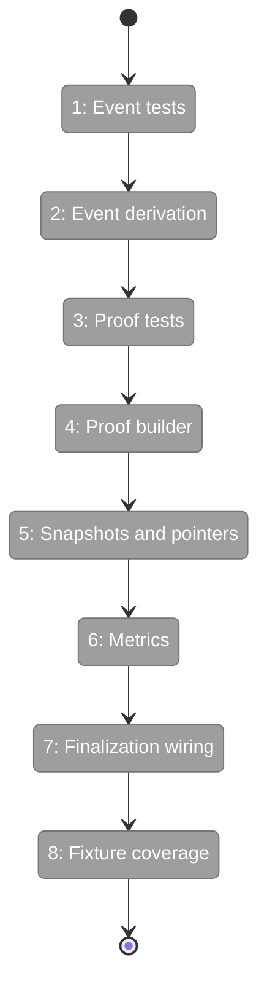
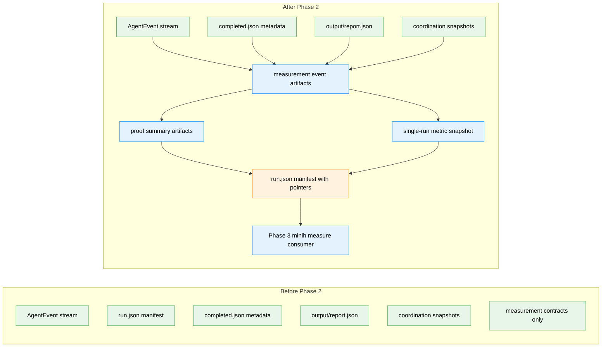

# Flight Plan: Phase 2 - Runner Measurement Facts

**Plan**: [../../minih-harness-measurement-plan.md](../../minih-harness-measurement-plan.md)
**Phase**: Phase 2: Runner Measurement Facts
**Generated**: 2026-05-15
**Status**: Ready for takeoff

---

## Departure -> Destination

**Where we are**: Phase 1 has landed the measurement vocabulary, proof-level helpers, metric registry, authority/redaction constants, and six JSON schema contracts. Runner already writes events, completed metadata, run manifests, coordination snapshots, velocity data, parsed retros, and retro ledger entries, but no per-run measurement artifacts are emitted yet.

**Where we're going**: The runner will emit immutable, schema-versioned measurement events, proof summaries, and deterministic single-run metric snapshots from existing run evidence. Phase 3 will be able to build `minih measure` on top of runner-owned artifacts instead of raw run-file inspection or agent interpretation.

---

## Domain Context

### Domains We're Changing

| Domain | What Changes | Key Files |
|--------|-------------|-----------|
| runner | Adds pure measurement derivation/builders, immutable artifact persistence, manifest pointers, and runner fixture coverage. | `src/runner/measurement/events.ts`, `proof-summary.ts`, `metrics.ts`, `snapshot.ts`, `runner.ts`, `run-manifest.ts`, `types.ts` |
| measurement | May update conceptual composition if Phase 2 adds new runner modules or clarifies runner-owned fact concepts. | `docs/domains/measurement/domain.md` |

### Domains We Depend On (no changes)

| Domain | What We Consume | Contract |
|--------|----------------|----------|
| adapter | Normalized `AgentEvent` objects emitted to the runner. | `src/adapter/events.ts` |
| cli | Existing future consumer only; no command UX in this phase. | JSON envelope and dogfood observation conventions |
| mcp | Existing coordination files indirectly through runner snapshots; no MCP imports. | run-scoped inbox/state file contracts |

---

## Flight Status

<!-- Updated by /plan-6-v2: pending -> active -> done. Use blocked for problems/input needed. -->

**Legend**: grey = pending | yellow = active | red = blocked/needs input | green = done

---

## Stages

<!-- Updated by /plan-6-v2 during implementation: [ ] -> [~] -> [x] -->

- [ ] **Stage 1: Lock event derivation expectations** - Add failing-first tests for stable event/evidence derivation (`test/runner/measurement/events.test.ts` - new file)
- [ ] **Stage 2: Derive runner measurement events** - Implement pure event derivation from run metadata, validation, artifacts, retros, coordination, and adapter events (`src/runner/measurement/events.ts` - new file)
- [ ] **Stage 3: Lock proof summary expectations** - Add proof summary fixture coverage for terminal states and missing artifacts (`test/runner/measurement/proof-summary.test.ts` - new file)
- [ ] **Stage 4: Build proof summaries** - Implement schema-versioned proof summaries over Phase 1 proof contracts (`src/runner/measurement/proof-summary.ts` - new file)
- [ ] **Stage 5: Persist immutable snapshots** - Write measurement/proof artifacts and manifest pointers without mutating historical proof semantics (`src/runner/measurement/snapshot.ts` - new file, `src/runner/run-manifest.ts`)
- [ ] **Stage 6: Compute deterministic metrics** - Add one-run metric helpers that preserve missing-vs-zero semantics (`src/runner/measurement/metrics.ts` - new file)
- [ ] **Stage 7: Wire finalization** - Emit measurement artifacts during `runAgent()` finalization after validation and artifact enumeration (`src/runner/runner.ts`)
- [ ] **Stage 8: Prove terminal-state behavior** - Cover completed, degraded, failed, timeout, coordinated, and missing-data fixtures (`test/runner/runner*.test.ts`, `test/runner/measurement/*.test.ts`)

---

## Architecture: Before & After

**Legend**: existing (green, unchanged) | changed (orange, modified) | new (blue, created)

---

## Acceptance Criteria

- [ ] Runner emits schema-versioned measurement events from existing run evidence without adapter, CLI, or MCP changes.
- [ ] Runner emits proof summaries with supported/default levels, artifacts, limitations, provenance, and redaction metadata.
- [ ] Measurement snapshots are immutable after first write and do not rewrite historical proof semantics during later reads or validation.
- [ ] `run.json` includes optional pointers to measurement/proof artifacts without embedding measurement payloads.
- [ ] Deterministic one-run metric helpers distinguish available, missing, not-applicable, not-configured, and redacted data.
- [ ] Completed, degraded, failed, timeout, coordinated, and missing-data fixture tests pass.
- [ ] The narrow runner/measurement gate and `just fft` pass before commit.

## Goals & Non-Goals

**Goals**:
- Emit runner-owned measurement facts from existing evidence.
- Preserve proof quality and missing-data semantics.
- Prepare a stable artifact contract for Phase 3 CLI surfaces.
- Keep measurement local-first and evidence-backed.

**Non-Goals**:
- No `minih measure` command UX.
- No classifier/synthesizer agents.
- No benchmark catalogue execution.
- No pulse capture/import.
- No downstream DORA/ESSP integration or causality claims.

---

## Checklist

- [ ] T001: Add failing-first measurement event derivation tests
- [ ] T002: Implement pure measurement event derivation
- [ ] T003: Add proof summary builder tests
- [ ] T004: Implement proof summary builder
- [ ] T005: Persist immutable measurement snapshots and manifest pointers
- [ ] T006: Add deterministic single-run metric helpers
- [ ] T007: Wire runner finalization to emit measurement artifacts
- [ ] T008: Cover representative runner fixtures and update domain/docs if contracts changed
