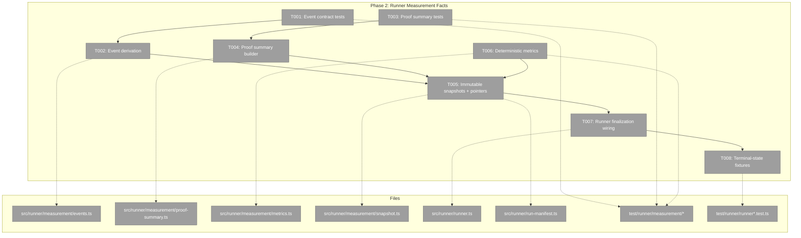
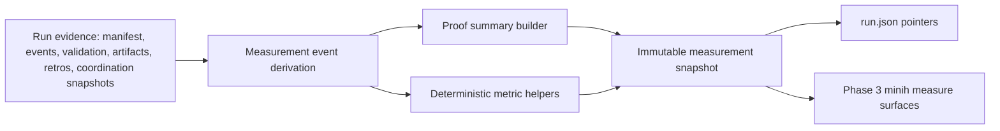
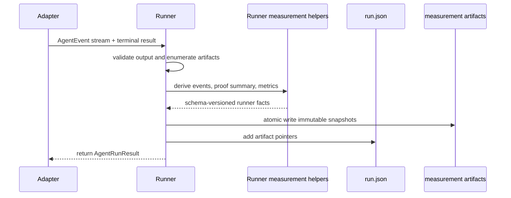

# Tasks: Phase 2 - Runner Measurement Facts

**Plan**: [minih-harness-measurement-plan.md](../../minih-harness-measurement-plan.md)
**Phase**: Phase 2: Runner Measurement Facts
**Created**: 2026-05-15
**Status**: Ready

---

## Executive Briefing

**Purpose**: This phase turns the Phase 1 measurement contracts into deterministic runner-owned facts. It creates immutable per-run measurement artifacts from evidence the runner already owns, so Phase 3 can expose `minih measure` without asking users or agents to read run-directory files directly.

**What We're Building**: Runner measurement event derivation, proof summary construction, deterministic single-run metric helpers, immutable artifact persistence, and manifest pointers that reference measurement outputs without duplicating them in `run.json`.

**Goals**:
- ✅ Derive stable measurement events from run metadata, adapter events, validation results, artifacts, retros, and coordination snapshots.
- ✅ Build proof summaries using the Phase 1 L0-L6 proof contracts and authority/redaction constants.
- ✅ Persist versioned measurement snapshots as immutable artifacts written during run finalization.
- ✅ Add run-manifest pointers to measurement/proof artifacts without turning `run.json` into a metric store.
- ✅ Keep missing data distinct from zero, false, or empty values.
- ✅ Cover completed, degraded, failed, timeout, coordinated, and missing-data cases with runner fixtures.

**Non-Goals**:
- ❌ Do not add the `minih measure` command namespace; Phase 3 owns CLI UX.
- ❌ Do not create classifier or synthesizer agents; Phase 4 owns interpretation.
- ❌ Do not implement benchmark catalogues or pulse capture/import; later phases own those surfaces.
- ❌ Do not infer human trust, DORA movement, or productivity from telemetry.
- ❌ Do not rewrite old `completed.json` proof semantics when a later validation command runs.

---

## Prior Phase Context

### Phase 0: Build Harness Contract

A. **Deliverables**: `/Users/jordanknight/substrate/minih/docs/project-rules/harness.md` defines MiniH's engineering Boot -> Interact -> Observe -> Validate loop. No Phase 0 `tasks.md` or `execution.log.md` exists under the plan tree.

B. **Dependencies Exported**: Boot command `just build`; health check `minih doctor`; public observation commands `minih status`, `minih tail --snapshot`, `minih retros --slug`, and `minih check`; evidence capture through JSON stdout, stderr diagnostics, `scratch/evidence/`, and plan execution logs.

C. **Gotchas & Debt**: The engineering harness is L2, not self-healing. Clean SIGTERM/SIGINT shutdown and standardized phase evidence scripts remain future hardening items. Direct reads of `agents/<slug>/runs/<runId>/...` remain forbidden unless a CLI gap is explicitly raised.

D. **Incomplete Items**: No blocker carries into Phase 2. Harness maturity improvements are later engineering-harness work, not a prerequisite for runner measurement facts.

E. **Patterns to Follow**: Use supported MiniH CLI surfaces for observation, treat stdout JSON as the machine contract, keep stderr human-readable, run narrow gates first, and use `just fft` before commit or push.

### Phase 1: Measurement Domain Contracts

A. **Deliverables**: Phase 1 added `/Users/jordanknight/substrate/minih/docs/domains/measurement/domain.md`, `/Users/jordanknight/substrate/minih/src/runner/measurement/types.ts`, `proof-levels.ts`, `metric-registry.ts`, `authority.ts`, measurement schema files under `/Users/jordanknight/substrate/minih/src/schemas/`, schema copy wiring, and runner measurement contract tests.

B. **Dependencies Exported**: The runner now exports proof levels, task-kind default thresholds, metric registry definitions, authority/redaction constants, missing-data statuses, forbidden measurement views, and JSON schema contracts for measurement events, proof summaries, scorecards, classifications, pulse aggregates, and benchmark catalogues.

C. **Gotchas & Debt**: Measurement is a conceptual domain only; runtime files must stay inside owning runner/CLI/agent surfaces. Missing data must never be collapsed into zero. Runner facts are authoritative; agents and companions may only add cited interpretation. Phase-end dogfood found that `minih validate <slug> --file <path>` is not supported despite skill text, so use current supported commands until that CLI gap is fixed.

D. **Incomplete Items**: Phase 1 had no deferred companion findings. It intentionally did not emit measurement artifacts, add CLI commands, create agents, implement benchmarks, or capture pulse data.

E. **Patterns to Follow**: Keep runner helpers pure and adapter-agnostic; reuse existing AJV, artifact, manifest, event, retro, and atomic-write patterns; preserve import direction `cli -> {mcp, runner, adapter}`, `mcp -> runner`, `runner -> adapter`; report MiniH-local metrics as "mapped to" or "aligned with," never framework-native.

---

## Pre-Implementation Check

**Engineering harness health check**: `docs/project-rules/harness.md` exists and identifies the harness as L2. `minih doctor` exited 0 on 2026-05-15 with a JSON envelope on stdout and no stderr.

| File | Exists? | Domain Check | Notes |
|------|---------|--------------|-------|
| `/Users/jordanknight/substrate/minih/src/runner/measurement/types.ts` | Yes | runner | Extend with measurement event, proof summary, metric result, snapshot, and artifact-pointer types. Contract change; keep public exports deliberate. |
| `/Users/jordanknight/substrate/minih/src/runner/measurement/events.ts` | No | runner | New pure derivation module for schema-shaped runner facts from manifests, `AgentEvent`, validation, artifacts, retros, and coordination snapshots. |
| `/Users/jordanknight/substrate/minih/src/runner/measurement/proof-summary.ts` | No | runner | New pure builder over Phase 1 `evaluateProof()` and proof artifact inventory. |
| `/Users/jordanknight/substrate/minih/src/runner/measurement/metrics.ts` | No | runner | New deterministic one-run metric helper module. Must preserve missing-vs-zero semantics. |
| `/Users/jordanknight/substrate/minih/src/runner/measurement/snapshot.ts` | No | runner | New persistence/shape module if implementation needs a focused writer. If added, update measurement domain composition because it is not yet listed in the master manifest. |
| `/Users/jordanknight/substrate/minih/src/runner/measurement/index.ts` | Yes | runner | Export only stable Phase 2 contracts needed by runner/CLI; avoid leaking internal helpers prematurely. |
| `/Users/jordanknight/substrate/minih/src/runner/runner.ts` | Yes | runner | Finalization writes `completed.json`, snapshots coordination files, lists artifacts, parses retros, and updates `run.json`; Phase 2 should hook after validation/artifact enumeration points. |
| `/Users/jordanknight/substrate/minih/src/runner/run-manifest.ts` | Yes | runner | Manifest writes are serialized and atomic. Add pointers, not embedded measurement payloads. |
| `/Users/jordanknight/substrate/minih/src/runner/types.ts` | Yes | runner | `CompletedMetadata` and `LiveRunManifest` are public contracts; any measurement pointers need backward-compatible optional fields. |
| `/Users/jordanknight/substrate/minih/src/runner/atomic-write.ts` | Yes | runner | Reuse `writeFileAtomic` / `writeFileAtomicAsync` for new immutable measurement artifacts. |
| `/Users/jordanknight/substrate/minih/src/schemas/measurement-event.json` | Yes | runner | Runtime outputs should validate against this contract shape. |
| `/Users/jordanknight/substrate/minih/src/schemas/proof-summary.json` | Yes | runner | Runtime proof summary should validate against this contract shape. |
| `/Users/jordanknight/substrate/minih/src/schemas/measurement-scorecard.json` | Yes | runner | Single-run metric helpers can produce scorecard-compatible metric/category data but should not add CLI scorecard UX. |
| `/Users/jordanknight/substrate/minih/test/runner/measurement/events.test.ts` | No | runner | New test file for event derivation and evidence IDs. |
| `/Users/jordanknight/substrate/minih/test/runner/measurement/proof-summary.test.ts` | No | runner | New test file for proof artifact mapping, limitations, and task-kind thresholds. |
| `/Users/jordanknight/substrate/minih/test/runner/measurement/metrics.test.ts` | No | runner | New test file for missing, zero, unsupported, and available metric values. |
| `/Users/jordanknight/substrate/minih/test/runner/measurement/snapshot.test.ts` | No | runner | New test file if snapshot writer is added; should prove immutable/idempotent behavior. |
| `/Users/jordanknight/substrate/minih/test/runner/runner.test.ts` | Yes | runner | Extend for terminal-state artifact writing and manifest pointer behavior. |
| `/Users/jordanknight/substrate/minih/test/runner/runner-event-driven.test.ts` | Yes | runner | Extend for coordinated run snapshots feeding measurement events. |
| `/Users/jordanknight/substrate/minih/docs/domains/measurement/domain.md` | Yes | measurement | Update only if Phase 2 creates new runner components or refines concepts; measurement remains conceptual. |

**Concept duplication check**:
- Domain Concepts already publish runner primitives for frozen inputs, degraded vs failed, event-driven terminal condition, velocity tracking, parsed report surfacing, run-scoped coordination state, atomic state writes, and run-folder coordination snapshots in `docs/domains/runner/domain.md`.
- Domain Concepts already publish measurement concepts for runner-owned facts, proof levels, missing data, balanced scorecards, aggregate pulse, false-pass candidates, and forbidden views in `docs/domains/measurement/domain.md`.
- FlowSpace text/code search found Phase 1 measurement contracts but no existing runtime `events.ts`, `proof-summary.ts`, `metrics.ts`, or snapshot writer under `src/runner/measurement/`; those modules are safe to create.
- Reuse `src/runner/runner.ts` finalization, `src/runner/run-manifest.ts`, `src/runner/atomic-write.ts`, `src/runner/probe/aggregator.ts` truth-vs-claim style, and `test/runner/*` fixture patterns instead of creating a parallel store.

---

## Architecture Map



---

## Tasks

| Status | ID | Task | Domain | Path(s) | Done When | Notes |
|--------|----|------|--------|---------|-----------|-------|
| [ ] | T001 | Add failing-first measurement event derivation tests | runner | `/Users/jordanknight/substrate/minih/test/runner/measurement/events.test.ts` | Tests describe stable event IDs, evidence IDs, event kinds, provenance, redaction, missing-data records, and mapping from run metadata plus `AgentEvent` input before implementation. | CS-2. Plan 2.1. Findings 02 and 03. Include adapter-event fixtures without changing adapter contracts. |
| [ ] | T002 | Implement pure measurement event derivation | runner | `/Users/jordanknight/substrate/minih/src/runner/measurement/types.ts`<br>`/Users/jordanknight/substrate/minih/src/runner/measurement/events.ts`<br>`/Users/jordanknight/substrate/minih/src/runner/measurement/index.ts` | Runner can derive schema-shaped measurement events for run start, run completion, validation, artifact, retro/difficulty, and coordination evidence from existing runner inputs, with no adapter, CLI, or MCP imports. | CS-3. Use `MEASUREMENT_SCHEMA_VERSION`, `runner-fact`, and redaction contracts from Phase 1. |
| [ ] | T003 | Add proof summary builder tests | runner | `/Users/jordanknight/substrate/minih/test/runner/measurement/proof-summary.test.ts` | Tests cover completed, degraded, failed, timeout, coordinated, and missing-artifact runs; proof summaries include required/missing artifact kinds, limitations, validation state, provenance, and redaction. | CS-2. Plan 2.2. Regress Phase 1 companion findings: empty evidence stays L0; incomplete evidence is capped below default. |
| [ ] | T004 | Implement proof summary builder | runner | `/Users/jordanknight/substrate/minih/src/runner/measurement/types.ts`<br>`/Users/jordanknight/substrate/minih/src/runner/measurement/proof-summary.ts`<br>`/Users/jordanknight/substrate/minih/src/runner/measurement/index.ts` | Completed and terminal runs can produce proof summaries using `evaluateProof()`, task-kind defaults, artifact inventory, validation state, limitations, schema version, provenance, and runner-fact authority. | CS-3. Do not let report prose or agent self-report upgrade proof levels. |
| [ ] | T005 | Persist immutable measurement snapshots and manifest pointers | runner | `/Users/jordanknight/substrate/minih/src/runner/measurement/snapshot.ts`<br>`/Users/jordanknight/substrate/minih/src/runner/run-manifest.ts`<br>`/Users/jordanknight/substrate/minih/src/runner/types.ts`<br>`/Users/jordanknight/substrate/minih/test/runner/measurement/snapshot.test.ts`<br>`/Users/jordanknight/substrate/minih/test/runner/run-manifest.test.ts` | Measurement/proof artifacts are written with schema version and stable paths, existing snapshots are not rewritten by later reads/validation, and `run.json` carries optional pointers to artifacts without embedding metric payloads. | CS-4. Plan 2.3 and 2.4. Finding 06. If `snapshot.ts` is added, update domain composition docs during implementation. |
| [ ] | T006 | Add deterministic single-run metric helpers | runner | `/Users/jordanknight/substrate/minih/src/runner/measurement/types.ts`<br>`/Users/jordanknight/substrate/minih/src/runner/measurement/metrics.ts`<br>`/Users/jordanknight/substrate/minih/test/runner/measurement/metrics.test.ts` | Metric helpers compute scorecard-compatible one-run values for proof quality, validation state, elapsed duration, event/tool counts, retry/friction placeholders, retro/difficulty presence, and unavailable downstream/pulse data while preserving missing-vs-zero semantics. | CS-3. Plan 2.5. Use `METRIC_REGISTRY`; no composite productivity score and no individual productivity fields. |
| [ ] | T007 | Wire runner finalization to emit measurement artifacts | runner | `/Users/jordanknight/substrate/minih/src/runner/runner.ts`<br>`/Users/jordanknight/substrate/minih/src/runner/types.ts`<br>`/Users/jordanknight/substrate/minih/test/runner/runner.test.ts`<br>`/Users/jordanknight/substrate/minih/test/runner/runner-event-driven.test.ts` | Run finalization writes measurement events, proof summary, and single-run metric snapshot after validation/artifact enumeration, updates manifest pointers, and treats measurement-write failures as explicit finalization failures rather than silent success. | CS-4. Plan 2.1-2.5. Hook after existing validation/artifact points; preserve terminal drain and coordination snapshot ordering. |
| [ ] | T008 | Cover representative runner fixtures and update domain/docs if contracts changed | runner | `/Users/jordanknight/substrate/minih/test/runner/measurement/*.test.ts`<br>`/Users/jordanknight/substrate/minih/test/runner/runner.test.ts`<br>`/Users/jordanknight/substrate/minih/test/runner/runner-event-driven.test.ts`<br>`/Users/jordanknight/substrate/minih/test/runner/schemas.test.ts`<br>`/Users/jordanknight/substrate/minih/docs/domains/measurement/domain.md` | Focused gates cover completed, degraded, failed, timeout, coordinated, missing-data, immutable snapshot, and schema-validation cases; domain docs mention any new runner measurement module and leave CLI UX to Phase 3. | CS-3. Plan 2.6. Narrow gate: `npx vitest run test/runner/measurement/*.test.ts test/runner/runner.test.ts test/runner/runner-event-driven.test.ts test/runner/schemas.test.ts`. |

---

## Context Brief

**Key findings from plan**:
- Finding 02: Runner-owned facts must remain the authority; Phase 2 must derive facts from runner evidence before classifier agents exist.
- Finding 03: Existing runner primitives already cover manifests, events, validation, artifacts, retro ledgers, atomic writes, and terminal drain behavior; Phase 2 must reuse them instead of creating a parallel measurement store.
- Finding 06: Revalidating old runs can mutate `completed.json`; Phase 2 must write immutable schema-versioned measurement snapshots and avoid rewriting historical proof semantics during later validation commands.
- Finding 07: Raw event data can drift into telemetry surveillance; Phase 2 outputs need provenance/redaction metadata and must avoid individual productivity fields.
- Finding 08: MiniH-local metrics are literature-aligned, not framework-native; metric outputs must keep traceability/caveats visible.

**Domain dependencies**:
- `runner`: `runAgent()` (`src/runner/runner.ts`) - finalization seam for output validation, artifact enumeration, completed metadata, manifest update, retro parsing, and coordination snapshots.
- `runner`: `CompletedMetadata` / `LiveRunManifest` (`src/runner/types.ts`) - source data and optional pointer contract for terminal run facts.
- `runner`: `writeManifest()` / `updateManifest()` (`src/runner/run-manifest.ts`) - serialized manifest persistence for `run.json`.
- `runner`: `writeFileAtomic` / `writeFileAtomicAsync` (`src/runner/atomic-write.ts`) - persistence primitive for new measurement artifacts.
- `adapter`: `AgentEvent` (`src/adapter/events.ts`) - normalized event input consumed by runner without adapter changes.
- `measurement`: Proof ladder (`src/runner/measurement/proof-levels.ts`) - L0-L6 evaluation and task-kind thresholds.
- `measurement`: Metric registry (`src/runner/measurement/metric-registry.ts`) - metric IDs, traceability, caveats, and safe wording.
- `measurement`: Authority/redaction (`src/runner/measurement/authority.ts`) - runner-fact authority, missing-data vocabulary, forbidden views, and redaction postures.
- `schemas`: `measurement-event.json`, `proof-summary.json`, `measurement-scorecard.json` - contract shapes Phase 2 artifacts should satisfy.

**Domain constraints**:
- Preserve import direction: `cli -> {mcp, runner, adapter}`, `mcp -> runner`, `runner -> adapter`.
- Runner measurement modules may import runner contracts and adapter event types, but must not import CLI or MCP.
- Measurement remains conceptual; runtime implementation lives in `src/runner/measurement/*` for this phase.
- `run.json` should carry artifact pointers only; measurement payloads belong in separate immutable artifacts.
- Missing data is a first-class value with reason and description; it is not zero, false, or an empty metric.
- Exportable records need schema version, evidence IDs, provenance, and redaction metadata.
- Measurement-write failures must surface explicitly; do not silently skip artifacts and report success-shaped runs.

**Engineering harness context**:
- **Boot**: `just build` rebuilds `dist/`; health check is `minih doctor`.
- **Interact**: Terminal CLI plus focused Vitest gates. For this phase, use runner tests and public MiniH CLI commands; do not inspect run-directory files directly outside tests.
- **Observe**: JSON envelopes, stderr diagnostics, Vitest output, completed metadata fixtures, manifest pointers, and plan execution log evidence.
- **Maturity**: L2 - MiniH has an engineering harness contract with automated build and CLI health validation.
- **Pre-phase validation**: Agent MUST validate Boot -> Interact -> Observe at implementation start, then run the narrow runner/measurement gates before `just fft`.

**Reusable from prior phases**:
- Phase 1 proof helpers: `evaluateProof()`, `getDefaultProofRequirement()`, `meetsDefaultValidatedThreshold()`.
- Phase 1 metric registry: `METRIC_REGISTRY`, `getMetricDefinition()`, `listMetricDefinitions()`.
- Phase 1 authority/redaction constants: `MEASUREMENT_AUTHORITY_CONTRACTS`, `REDACTION_POSTURE_CONTRACTS`, `MISSING_DATA_REASONS`, `MEASUREMENT_DATA_STATUSES`.
- Phase 1 schemas and strict AJV tests in `test/runner/schemas.test.ts`.
- Existing runner finalization pattern in `runAgent()`: validation, artifact listing, completed metadata, manifest update, parsed report, and retro harvest.
- Existing truth-vs-claim pattern from `src/runner/probe/aggregator.ts`.

**Mermaid flow diagram**:



**Mermaid sequence diagram**:



---

## Discoveries & Learnings

_Populated during implementation by plan-6._

| Date | Task | Type | Discovery | Resolution | References |
|------|------|------|-----------|------------|------------|

**Types**: `gotcha` | `research-needed` | `unexpected-behavior` | `workaround` | `decision` | `debt` | `insight`

---

## Directory Layout

```text
docs/plans/020-minih-harness-measurement/
  ├── minih-harness-measurement-plan.md
  └── tasks/phase-2-runner-measurement-facts/
      ├── tasks.md
      ├── tasks.fltplan.md
      └── execution.log.md   # created by plan-6
```
