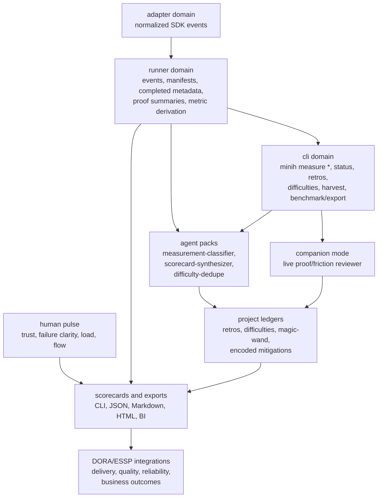

# Workshop: Measurement Manifestation Surfaces

**Type**: Integration Pattern / CLI Flow / Operating Model
**Plan**: `020-minih-harness-measurement`
**Spec**: Not yet created
**Created**: 2026-05-09T12:22:36+10:00
**Status**: Draft

**Value Thesis**: This workshop makes MiniH measurement implementable by deciding where the value-delivery system becomes visible: runner facts, CLI surfaces, agent packs, companion interpretation, proof contracts, scorecards, and human feedback loops.
**Target Proof Level**: Contract Ready
**Current Proof Level**: Preferred Direction

**Selected Value Axes**:
- **Implementation Readiness**: The architecture phase should know which repo domains own instrumentation, commands, contracts, and agents.
- **Operator Usability**: Humans should experience measurement through normal `minih` verbs, not by reading hidden run files or interpreting raw telemetry.
- **Agent Readiness**: Measurement agents and companions need explicit contracts for what they may classify and which evidence they must cite.
- **Proof Quality**: The product surface must separate factual evidence from interpretive classifications and downstream claims.
- **Learning Compounding**: Measurement should feed retros, difficulties, and magic-wand loops so each painful run can improve the harness.

**Related Documents**:
- [`../research-dossier.md`](../research-dossier.md)
- [`001-literature-traceability-matrix.md`](001-literature-traceability-matrix.md)
- [`002-ethos-value-delivery-scorecard.md`](002-ethos-value-delivery-scorecard.md)
- [`../../../domains/registry.md`](../../../domains/registry.md)
- [`../../../domains/domain-map.md`](../../../domains/domain-map.md)
- [`../../../../src/cli/index.ts`](../../../../src/cli/index.ts)
- [`../../../../src/runner/runner.ts`](../../../../src/runner/runner.ts)
- [`../../../../src/adapter/events.ts`](../../../../src/adapter/events.ts)
- [`../../../../src/cli/commands/difficulties.ts`](../../../../src/cli/commands/difficulties.ts)
- [`../../../../src/cli/commands/retros.ts`](../../../../src/cli/commands/retros.ts)
- [`../../../../src/cli/commands/harvest.ts`](../../../../src/cli/commands/harvest.ts)
- [`../../../../src/cli/commands/probe.ts`](../../../../src/cli/commands/probe.ts)

**Domain Context**:
- **Primary Domain**: runner - authoritative event capture, run lifecycle, proof metadata, derived metric facts, artifact writing.
- **Related Domains**: cli - operator commands, JSON envelopes, dashboard/export UX; adapter - normalized SDK event source; mcp - coordinated inside/outside state and inbox signals.
- **Boundary Rule**: Measurement derivation may consume adapter events and coordination signals, but runner must not depend upward on cli or mcp. CLI composes commands and agent runs; agents consume exported evidence through documented surfaces.

---

## Purpose

This workshop answers the practical manifestation question: "Will MiniH measurement show up as CLI tooling, special MiniH agents, companions, dashboards, or something else?"

The preferred answer is: **all of those, but in layers with different authority**. MiniH measurement should manifest first as runner-owned facts and CLI-owned operator surfaces. Special agents and companions should interpret those facts, not become the source of truth. Dashboards and downstream integrations should be projections of the same contracts.

## Fresh Entrant Outcome

A fresh human or agent should be able to use this workshop to reach **Contract Ready** with no additional context.

They should be able to:

- Explain which parts of the measurement system are imperative MiniH tooling versus agent interpretation.
- Identify the domain owner for each surface.
- Draft a feature spec and architecture plan without debating whether the feature is "a dashboard" or "an agent."
- Avoid overclaiming: facts come from hooks/harness/proofs; meaning comes from cited companion classifications; human experience comes from people.

## Key Questions Addressed

- How will the measurement system manifest in the product?
- Is it `minih` CLI tooling?
- Is it special MiniH agents and companion-mode peers?
- What else is required besides CLI commands and agents?
- Which domain owns each piece?
- What should V1 build first?

---

## Short Answer

MiniH harness measurement should manifest as a **layered product surface**:

```text
Runner facts
  -> proof and measurement contracts
  -> CLI operator surfaces
  -> benchmark/probe catalogs
  -> companion/agent interpretation
  -> scorecards, exports, retros, and backlog loops
  -> later DORA/ESSP/business integrations
```

The CLI is the primary user contract. Agents and companions are specialized workers. Dashboards are projections. Human pulse data remains human-owned. DORA is downstream.

| Surface | Role | Authority |
|---|---|---|
| Runner instrumentation | Captures timestamps, run state, events, proof metadata, validation results, intervention signals | Authoritative facts |
| Proof contracts | Define what "validated evidence" means for a run, benchmark, or task | Authoritative evidence standard |
| `minih` CLI | Lets operators inspect, summarize, export, classify, and benchmark without reading run files directly | Authoritative UX and JSON envelope |
| Measurement agents | Classify task intent, friction, proof quality, recurrence, and framework mapping with citations | Interpretive, evidence-cited |
| Companion mode | Reviews live work and adds friction/proof/retro signal at commit or run boundaries | Interpretive, real-time |
| Benchmark/probe packs | Run repeatable scenarios to measure accessibility and proof loops | Controlled synthetic evidence |
| Retros/difficulties/magic-wand ledgers | Convert pain into encoded mitigations and backlog | Compounding learning |
| Pulse capture | Captures trust, failure clarity, cognitive load, and flow from humans | Human experience evidence |
| Dashboard/export | Shows balanced scorecards and trends | Projection, not source of truth |
| DORA/ESSP integrations | Correlate local harness improvements with downstream delivery outcomes | Lagging/contextual evidence |

---

## Value Frame

| Field | Selection | Why It Matters |
|-------|-----------|----------------|
| Target Proof Level | Contract Ready | Architecture should be able to assign files, commands, schemas, and agent contracts from this workshop. |
| Primary Value Axis | Implementation Readiness | The next loop needs concrete product surfaces, not abstract measurement theory. |
| Supporting Value Axes | Operator Usability, Agent Readiness, Proof Quality, Learning Compounding | These keep the design usable, evidence-backed, and aligned with MiniH's harness ethos. |
| Downstream Loop Improved | Feature specification and architecture planning | The spec can say exactly what manifests in CLI, runner, agents, dashboards, and later integrations. |

## Evidence Ledger

| Evidence | Location | Supports | Status |
|----------|----------|----------|--------|
| Current CLI command registry | `src/cli/index.ts` | Existing operator surface and command namespace precedent | Ready |
| Current event/run metadata write path | `src/runner/runner.ts`, `src/adapter/events.ts` | Runner already owns event streams, manifests, completed metadata, and validation status | Ready |
| Existing retrospective and difficulty surfaces | `src/cli/commands/retros.ts`, `src/cli/commands/difficulties.ts`, `src/cli/commands/harvest.ts` | Measurement can feed existing learning loops | Ready |
| Existing scenario/probe pattern | `src/cli/commands/probe.ts` | Repeatable benchmark execution has a precedent | Ready |
| Measurement thesis | `research-dossier.md`, `002-ethos-value-delivery-scorecard.md` | Hooks sense -> harness proves -> companion agents interpret -> DORA/ESSP/SPACE explain impact | Ready |
| Concrete command names and schemas | This workshop | Preferred direction, not final spec | Draft |

---

## Decision Space

| Option | Description | Pros | Cons | Decision |
|--------|-------------|------|------|----------|
| CLI-only measurement | Add commands that calculate metrics from run artifacts and proof records | Simple, deterministic, dogfoods MiniH CLI | Cannot classify ambiguous friction, task intent, cognitive load, or missing-context patterns well | Rejected as insufficient |
| Agent-only measurement | Special agents read traces and write measurement reports | Flexible interpretation; fast to iterate | Turns opinions into authority; weaker reproducibility; harder to audit | Rejected as unsafe |
| Dashboard-first measurement | Build a visual scorecard before finalizing events and proof contracts | Easy to demo | Risks productivity theater and Goodhart pressure before semantics are stable | Rejected for V1 |
| Layered product surface | Runner facts + proof contracts + CLI + agents/companions + ledgers + exports | Separates facts from interpretation; respects domains; works locally before integrations | More pieces to specify | Selected |

**Preferred direction**: Build the layered surface. Start with contracts and CLI JSON, then add classifier agents, scorecard projections, pulse capture, and downstream integrations.

---

## Manifestation Map

### 1. Runner facts: the stopwatch and evidence source

Runner-owned code should be the factual layer because it already owns run folders, event streaming, manifests, completed metadata, validation, artifact listing, and retrospective harvest context.

| Capability | What manifests | Domain owner | Notes |
|---|---|---|---|
| Canonical measurement events | A normalized envelope for run, milestone, proof, intervention, and mitigation events | runner | Derived from existing adapter events and runner lifecycle, not agent prose |
| Proof summary records | A per-run proof summary with proof level, artifact inventory, rerun command, limitations, and validation result | runner | Needed before trustworthy scorecards |
| Metric derivation | Deterministic calculations such as Time to Validated Evidence, retry count, proof completeness | runner | Should be pure and testable |
| Privacy/redaction metadata | Redaction policy, prompt hash/excerpt rules, actor scope | runner | Required before exports or org rollups |
| Run-to-ledger hooks | Measurement records can feed retros/difficulties/magic-wand closure | runner | Extends current harvest/retro path |

The factual layer should avoid saying "this was cognitive load" or "this improved developer happiness." It can say "these events happened, this proof reached L5, this intervention was recorded, this mitigation later verified."

### 2. CLI tooling: the primary operator surface

The feature should be visible through `minih`, not hidden behind raw files or one-off scripts. Operators should be able to ask measurement questions through commands that return JSON envelopes and optional human-readable stderr output.

Candidate V1 namespace:

```bash
# Show a balanced local scorecard over recent runs
minih measure scorecard --since 30d

# Inspect one run's measurement facts and proof summary
minih measure inspect <slug> --run <runId>

# Export machine-readable measurement records for notebook/BI/warehouse use
minih measure export --since 30d --format ndjson --out measurement.ndjson

# Check whether measurement contracts are complete enough to trust
minih measure doctor

# Run a named benchmark catalog and emit comparable measurement facts
minih measure benchmark --catalog fresh-setup --max-parallel 4

# Ask the classifier agent to interpret a run or cohort using cited evidence
minih measure classify <slug> --run <runId>
minih measure classify --since 30d --agent code-review-companion
```

Why a `measure` namespace:

- Keeps measurement distinct from current `status`, `tail`, `history`, `retros`, `difficulties`, and `probe` commands.
- Provides one discoverable home for the scorecard, export, benchmark, classification, and doctor flows.
- Preserves existing command meanings while allowing existing commands to link into measurement records.
- Makes dogfooding possible: users do not need to inspect `agents/<slug>/runs/<runId>/...` directly.

Existing commands should remain part of the surface:

| Existing command | Measurement role |
|---|---|
| `minih status <slug>` | Quick run liveness and final state; can later show proof/measurement summary pointers |
| `minih tail <slug>` | Live event visibility; can later include measurement milestone events |
| `minih last-run <slug>` | Discovery of latest run and report path through CLI |
| `minih validate <slug> --file <path>` | Schema validation for agent outputs and measurement classification reports |
| `minih retros` | Human/agent retrospective aggregation for learning signals |
| `minih difficulties` | Current difficulty aggregation; future difficulty ledger should supersede exact-description frequency |
| `minih harvest <slug>` | Moves run retros into project ledgers; future measurement can attach proof/intervention summaries |
| `minih probe` | Precedent for scenario matrix orchestration and truth aggregation |

### 3. Special MiniH agents: interpretive workers, not source of truth

Measurement should include special agent packs, but they should be treated as classifiers and analysts over evidence.

Candidate agent packs:

| Agent pack | Purpose | Inputs | Output |
|---|---|---|---|
| `measurement-classifier` | Classify task intent, friction category, proof quality, repeated difficulty matches, and framework mapping | Measurement events, proof summaries, selected command outputs, retrospective entries | `measurement-classification.json` with citations and confidence |
| `scorecard-synthesizer` | Produce narrative scorecard interpretation for a cohort | Deterministic metric summary + classifier outputs + pulse aggregates | Markdown/JSON report with caveats and recommended mitigations |
| `difficulty-dedupe` | Cluster recurring difficulties that exact string matching misses | Difficulty ledger, failed milestones, errors, files/commands touched | Difficulty merge suggestions |
| `false-pass-auditor` | Review passed proofs that later saw failures, rework, or contradictory evidence | Proof summaries + later CI/review/incidents/manual audits | False-pass candidates with evidence |
| `pulse-summarizer` | Summarize team-level trust/failure clarity/cognitive-load feedback | Aggregated pulse data, not individual responses | Team-level trend and themes |

Agent output contract:

```typescript
interface MeasurementClassification {
  schemaVersion: 1;
  runId: string;
  agentSlug: string;
  classifiedAt: string;
  classifier: string;
  taskIntent: {
    label: string;
    confidence: number;
    evidenceIds: string[];
  };
  friction: Array<{
    category: string;
    severity: 'info' | 'degrading' | 'blocking';
    evidenceIds: string[];
    rationale: string;
  }>;
  proofAssessment: {
    claimedLevel: string | null;
    supportedLevel: string | null;
    missingEvidence: string[];
    evidenceIds: string[];
  };
  frameworkMapping: Array<{
    framework: 'DORA' | 'SPACE' | 'Accelerate' | 'ESSP' | 'MiniH-local';
    dimension: string;
    traceabilityLevel: 'L1' | 'L2' | 'L3' | 'L4';
    rationale: string;
    evidenceIds: string[];
  }>;
  caveats: string[];
}
```

Rule: **no evidence IDs, no classification**. Agents can label and explain. They cannot create facts that the runner did not record or a human did not provide.

### 4. Companion mode: live measurement companion

Companion mode should manifest as a real-time peer for active work, especially implementation phases and benchmark runs.

| Companion behavior | Measurement value |
|---|---|
| Watches commit/run boundaries | Catches proof gaps before the user sees "done" |
| Asks for missing evidence when a claim is under-proven | Improves proof completeness and trust |
| Records friction observations with cited trace evidence | Feeds difficulty ledger and recurrence detection |
| Distinguishes "agent says done" from "proof exists" | Reduces false-pass risk |
| Produces farewell envelope and retro | Feeds learning loop and future mitigation backlog |

Companion mode is not the whole product. It is the live interpretive layer that helps runs leave better evidence behind.

### 5. Benchmark and probe catalogs: controlled comparisons

MiniH should include repeatable benchmark catalogs because "is the harness improving?" needs controlled scenarios, not just organic run traces.

Candidate benchmark catalogs:

| Catalog | Proves | Example scenarios |
|---|---|---|
| `fresh-setup` | A fresh actor can reach a verified working context | install/build/seed/run/health/request/state verification |
| `proof-quality` | The proof ladder is reachable and reproducible | L3 command proof, L5 state proof, L6 rerun proof |
| `failure-recovery` | Known failures produce useful next steps | missing env, broken dependency, DB not seeded, permission denial |
| `coordination` | Companion/coordinated agents can exchange state/inbox signals | inside/outside handoff, live review, stop/farewell |
| `legacy-accessibility` | High-friction systems become easier to enter | benchmark tasks derived from customer-style harness scenarios |

The existing `minih probe` command is a useful precedent: it runs scenario matrices and cross-references agent self-report against truth. Measurement benchmarks should use the same spirit, but they should likely live under `minih measure benchmark` or a future `minih benchmark` namespace rather than overloading permission-specific `probe`.

### 6. Scorecards and dashboards: projections, not the product core

A dashboard can exist, but it should not be V1's foundation. V1 should produce trustworthy CLI JSON and exportable records. Dashboards can project those records after the contracts stabilize.

Scorecard surfaces:

| Surface | Audience | Shape |
|---|---|---|
| CLI table | Local operator | Small balanced scorecard with caveats |
| JSON envelope | Automation/CI | Stable machine-readable fields |
| Markdown report | Plan/spec/review docs | Narrative plus tables and evidence links |
| HTML/static dashboard | Team review | Trend and cohort views |
| Data export | Warehouse/BI | Redacted NDJSON/JSONL/CSV |
| Executive rollup | Leadership | Value-delivery narrative plus downstream DORA context |

Dashboard guardrails:

- No single productivity number.
- No individual ranking.
- Show proof quality beside speed.
- Show intervention and false-pass signals beside "time saved."
- Label flow proxies as proxies.
- Keep DORA downstream and caveated.

### 7. Human pulse: soft metrics as a product loop

MiniH should include a lightweight human feedback surface because trust, failure clarity, cognitive load, and flow cannot be inferred from telemetry.

Candidate surfaces:

```bash
# Local/manual pulse capture for a team or rollout cohort
minih measure pulse record --cohort platform-team

# Import aggregated pulse data from another survey system
minih measure pulse import --file pulse-results.json

# Show trust calibration beside false-pass and proof quality
minih measure pulse summary --since 90d
```

The pulse surface should default to aggregation. It should not expose individual productivity scoring.

### 8. DORA/ESSP integrations: later correlation layer

DORA and business metrics should manifest later through integrations, after local harness metrics are stable.

Possible integrations:

| Integration | Use |
|---|---|
| GitHub issues/PRs | Lead-time context, review/rework links, issue-to-proof trace |
| GitHub Actions/CI | Build/test reliability, later contradiction to proofs |
| ADO/Jira | Work-item lead time and status mapping |
| Deployment tooling | Deployment frequency and lead time to production |
| Incident/SLO systems | CFR, MTTR, reliability, false-pass follow-up |
| Finance/product systems | Business outcome context only when explicitly defined |

The design should say "correlate with downstream outcomes," not "MiniH caused DORA to improve," until the evaluation method is explicit.

---

## Product Surface Stack



Import-direction note: the diagram describes product flow, not TypeScript imports. The runner may expose measurement functions and artifacts. CLI composes commands. Agents are external run content. MCP remains inside-only coordination infrastructure.

---

## Candidate File and Contract Layout

This is a design sketch, not an implementation mandate.

```text
src/
  runner/
    measurement/
      events.ts              # canonical measurement event types
      proof-summary.ts       # proof summary model and derivation helpers
      metrics.ts             # deterministic metric calculations
      scorecard.ts           # balanced scorecard aggregation
      redaction.ts           # export-safe shaping
  cli/
    commands/
      measure.ts             # namespace entry point
src/schemas/
  measurement-event.json
  proof-summary.json
  measurement-classification.json
  measurement-scorecard.json
agents/
  measurement-classifier/
    prompt.md
    output-schema.json
    instructions.md
  scorecard-synthesizer/
    prompt.md
    output-schema.json
  difficulty-dedupe/
    prompt.md
    output-schema.json
docs/plans/020-minih-harness-measurement/
  benchmarks/
    fresh-setup.json
    proof-quality.json
    failure-recovery.json
```

Why runner owns `measurement/`:

- It already owns run lifecycle, artifact writing, validation status, and event consumption.
- Deterministic metrics should be testable without CLI or agent dependencies.
- CLI can call runner APIs without reversing domain direction.
- Agents can consume exported measurement bundles without becoming in-process dependencies.

Why CLI owns `measure.ts`:

- The CLI is the public composition root and user-facing product surface.
- JSON envelopes and stderr tables already belong there.
- It can orchestrate special agent runs without runner importing agent packs.

Why agents are packs:

- The model prompts and output schemas need iteration without corrupting deterministic metric code.
- Installing/upgrading measurement agents can follow existing agent-pack patterns.
- Different teams may want different classifiers while preserving the same evidence contract.

---

## Example Operator Flows

### Flow A: Inspect one run

```bash
$ minih measure inspect code-review-companion --run 2026-05-09T12-00-00-000Z-abcd

Run: code-review-companion / 2026-05-09T12-00-00-000Z-abcd
Result: completed
Validated: true
Proof level: L4 claimed, L4 supported
Time to validated evidence: 8m 12s
Interventions: 1 operator redirect
Friction: permission-policy clarification
Caveats: no rerun proof recorded
```

JSON envelope sketch:

```json
{
  "ok": true,
  "command": "measure inspect",
  "data": {
    "slug": "code-review-companion",
    "runId": "2026-05-09T12-00-00-000Z-abcd",
    "result": "completed",
    "validated": true,
    "proof": {
      "claimedLevel": "L4",
      "supportedLevel": "L4",
      "artifacts": ["output/report.json"],
      "caveats": ["no rerun proof recorded"]
    },
    "metrics": {
      "timeToValidatedEvidenceMs": 492000,
      "interventionCount": 1,
      "retryCount": 2
    }
  }
}
```

### Flow B: Build a local scorecard

```bash
$ minih measure scorecard --since 30d

MiniH Measurement Scorecard (30d)

Value & Evidence
  Time to Validated Evidence P50/P90: 11m / 34m
  Evidence-backed decisions: 18

Proof Quality
  L5+ proof share: 42%
  Proof completeness: 81%
  False-pass candidates: 3

Flow & Friction
  Intervention rate: 22%
  Top repeated difficulty: missing proof recipe

Learning
  Encoded mitigation rate: 37%
  Difficulty half-life: 6d

Trust
  Proof trust pulse: not configured

Downstream
  DORA integration: not configured
```

The scorecard should show missing data as missing, not fake it with zeroes.

### Flow C: Classify a run with an agent

```bash
$ minih measure classify code-review-companion --run 2026-05-09T12-00-00-000Z-abcd

Classifier: measurement-classifier
Task intent: implementation_review (0.86)
Friction: missing_cli_surface (degrading)
Proof assessment: L4 supported, L5 missing state/system proof
Framework mapping: SPACE Efficiency/Flow, ESSP Quality, MiniH-local proof quality
```

The classifier command should write a structured report and validate it against `measurement-classification.json`.

### Flow D: Run a benchmark catalog

```bash
$ minih measure benchmark --catalog fresh-setup --max-parallel 4

Catalog: fresh-setup
Scenarios: 6
Passed: 5
Failed: 1
P50 Time to Verified Working Context: 9m
Top failure: DB seed verification missing
```

This is how "harness got better" becomes comparable across versions.

### Flow E: Close the learning loop

```bash
$ minih measure scorecard --since 30d --recommend

Recommended encoded mitigations:
1. Add proof recipe for DB overlay verification
2. Add failure recovery hint for missing GH_TOKEN
3. Add benchmark scenario for companion stop/farewell
```

Recommendations can be agent-assisted, but each recommendation should cite the run evidence, difficulty recurrence, and expected metric improvement.

---

## What Belongs in V1

V1 should optimize for a small, trustworthy, local loop.

| V1 Component | Why It Comes First |
|---|---|
| Measurement event envelope | Without stable facts, every downstream surface is brittle |
| Proof summary contract | Proof quality is the guardrail against speed theater |
| Deterministic metric derivation | Time, counts, completeness, and validation depth should not require an LLM |
| `minih measure inspect` | Operators need a single-run truth view |
| `minih measure scorecard` | Teams need a small balanced local view |
| `minih measure export` | Keeps future dashboards/BI decoupled from CLI internals |
| `measurement-classifier` agent | Adds interpretation while keeping evidence citations explicit |
| Difficulty/retro integration | Turns measurement into encoded mitigation, not passive reporting |

V1 should not start with:

- Real-time executive dashboards.
- Individual productivity views.
- Broad DORA causality claims.
- Finance/AI leverage metrics.
- A single composite score.

---

## Authority Model

| Claim Type | Source of Truth | May Agents Help? | Reporting Rule |
|---|---|---|---|
| "This run started/ended at X" | runner event/metadata | No | Report as fact |
| "This proof reached L5" | proof summary + validation contract | Agents may flag missing evidence | Report as supported proof level with caveats |
| "This run had three retries" | event derivation | No | Report as fact |
| "This was a dependency-resolution friction" | classifier with cited events | Yes | Report as classification with confidence |
| "This difficulty recurred" | difficulty ledger + classifier dedupe | Yes | Report as evidence-backed recurrence |
| "Developers trust the proof" | aggregated pulse response | Agents may summarize themes | Report only at aggregate level |
| "MiniH improved DORA lead time" | downstream integration + evaluation design | Agents may narrate | Report as correlation unless causal design exists |
| "This engineer is productive" | Not allowed | No | Do not report |

---

## Attention Reduction

| Future Loop | Before Workshop | After Workshop |
|-------------|-----------------|----------------|
| Specification | Debate whether this is CLI, dashboard, agent, or telemetry | Layered answer with authority boundaries |
| Architecture | Guess where metric logic belongs | Runner owns facts; CLI owns commands; agents classify; dashboards project |
| Review | Reviewers reconstruct measurement intent from theory docs | Reviewers can check product surfaces against this manifestation map |
| Agent execution | Agents might invent metrics or overclaim from traces | Agents get explicit classification contracts and citation rules |
| Operator use | Operators inspect raw artifacts or ask humans what happened | Operators use `minih measure` and existing dogfood commands |
| Governance | Dashboard pressure could appear before trust exists | V1 starts with contracts, CLI JSON, and balanced scorecard guardrails |

---

## Open Questions

### Q1: Should the namespace be `minih measure`, `minih metrics`, or `minih scorecard`?

**PREFERRED**: `minih measure`.

Rationale: It covers inspect, scorecard, export, classify, doctor, pulse, and benchmark without implying that the whole feature is a dashboard or a metrics-only system.

### Q2: Should benchmark catalogs be data files, agents, or commands?

**PREFERRED**: Data catalogs orchestrated by CLI commands, with optional agent packs for scenario execution/classification.

Rationale: The benchmark definition should be inspectable and versionable. Agents can execute or interpret, but the benchmark contract should not live only in prompt text.

### Q3: Should companion mode be required for measurement?

**PREFERRED**: No for basic measurement, yes for high-value implementation/review loops where live proof/friction feedback matters.

Rationale: Deterministic facts should work for every run. Companions improve interpretation and proof quality, but the measurement system should not be blind when no companion is running.

### Q4: Where should pulse data live?

**OPEN**: Options include local JSON import/export, a project-level ledger, or integration with an external survey tool.

V1 can support import/export and a minimal local aggregate record. Detailed survey tooling can come later.

### Q5: Should measurement records be stored inside run folders?

**PREFERRED**: Per-run proof and measurement summaries may be written as run artifacts, but every supported read path must have a CLI surface.

Rationale: Run-local artifacts preserve provenance, but the dogfood contract means operators should use MiniH commands, not direct run-dir file reads.

### Q6: Is a dashboard in scope?

**PREFERRED**: Export and Markdown/CLI scorecard first; static dashboard later.

Rationale: Dashboarding before proof semantics stabilize invites shallow optimization. Stable JSON and exports keep the future dashboard easy.

---

## Validation / Acceptance

This workshop reaches **Contract Ready** when:

- The feature spec uses the layered manifestation model rather than choosing between CLI and agents.
- The architecture plan assigns runner, cli, adapter, mcp, and agent-pack responsibilities without reversing domain dependencies.
- V1 acceptance criteria include deterministic measurement facts, proof summaries, CLI inspection/scorecard/export, and at least one cited classifier agent.
- The plan explicitly defers dashboard-first, individual productivity, and DORA-causality claims.
- Every proposed operator read path has a `minih` command surface.

---

## Recommended Next Spec Language

MiniH harness measurement should manifest as a layered local-first product surface:

> MiniH should add a measurement layer that records runner-owned facts, proof summaries, and derived metrics; exposes them through `minih measure` CLI commands and JSON envelopes; uses specialized agents and companion mode only for cited interpretation; feeds retros/difficulties/magic-wand loops; and later exports to dashboards, pulse summaries, and downstream DORA/ESSP integrations.

This keeps the product on-piste: MiniH is not merely a dashboard, not merely an agent, and not a productivity counter. It is a harnessed evidence system that makes value delivery easier to prove and improve.
