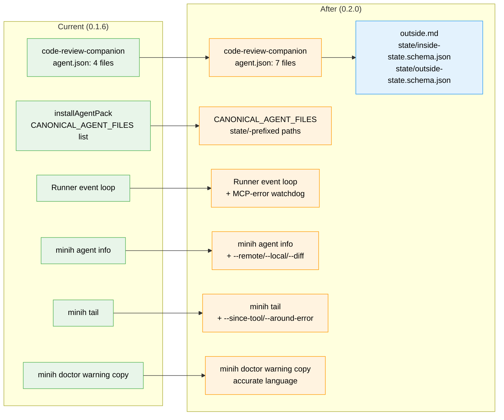

# Flight Plan: Coordinated Install Resilience

**Spec**: [coordinated-install-resilience-spec.md](./coordinated-install-resilience-spec.md)
**Plan**: [coordinated-install-resilience-plan.md](./coordinated-install-resilience-plan.md)
**Workshop**: [workshops/001-mcp-error-watchdog-state-machine.md](./workshops/001-mcp-error-watchdog-state-machine.md) (Contract Ready)
**Origin**: [`AI-Substrate/minih#30`](https://github.com/AI-Substrate/minih/issues/30) (downstream wedge report, 2026-05-15)
**Generated**: 2026-05-15
**Status**: **Ready** — plan-3 complete; 24 tasks across 4 workstreams + cross-cutting; validated 2026-05-15; awaiting `/plan-6-v2-implement-phase`
**Mode**: Simple (single-phase plan; clarify Q5 → one PR all workstreams)

---

## The Mission

**What we're building**: A four-phase fix for the canonical `code-review-companion` install wedge. We ship the missing per-agent schemas + outside contract so fresh installs work (Phase 1), close the implicit-manifest hole so future coordinated agents don't fall through the same crack (Phase 2), add a runner-level watchdog so any future MCP-error wedge terminates cleanly with `terminalReason: 'mcp_error'` instead of zombieing for ~30 minutes (Phase 3), and add the two diagnostic CLI surfaces operators needed during the live #30 investigation but had to `cat`/`grep` to get (Phase 4).

**Why it matters**: Downstream `AI-Substrate/pij` is blocked today; every other adopter who installs `code-review-companion` from `main` hits the same wedge silently. The harness IS the product — when it ships a broken canonical agent and provides no recovery signal when a run wedges, we set the worst possible example for adopters.

---

## Where We Are → Where We're Headed

```
TODAY (0.1.6):                              AFTER this plan (0.2.0):
─────────────────────────────────────       ─────────────────────────────────────
🔴 code-review-companion installs           🟢 Installs ship 7 files including
   with 4 files, no state schemas              state schemas + outside.md
🔴 'reading' state rejected at boot,        🟢 Schema enum matches prompt
   model wedges silently                       vocabulary; orient flow clean
🔴 Zombie run sits at status:"active"       🟢 Watchdog fires terminalReason:
   for ~30min until idle-budget               'mcp_error' after 60s post-isError
🔴 minih doctor warns "silently             🟡 Doctor warning rewritten:
   rejected" (misleading)                      "rejected at runtime; wedges
                                                run unless mcpErrorTimeoutMs set"
🔴 Implicit-manifest installs miss          🟢 CANONICAL_AGENT_FILES picks up
   state/ schemas (same wedge path)            state/inside-state.schema.json
🔴 No CLI way to preview install            🟢 minih agent info <slug> --remote
   payload before committing                   shows manifest without installing
🔴 No CLI way to find wedge-relevant        🟢 minih tail --since-tool /
   turns in events.ndjson                      --around-error surface them
```



**Legend**: existing (green, unchanged) | changed (orange, modified) | new (blue, created)

---

## Scope

**Goals**:
- Ship the missing schemas + outside contract for `code-review-companion`; bump to `0.2.0`; verify upgrade detection
- Close the implicit-manifest hole so coordinated agents without `agent.json` also ship `state/` schemas
- Terminate zombie runs cleanly with `terminalReason: 'mcp_error'` (default-on, frontmatter opt-out)
- Stop misleading operators (doctor copy + stale schema description)
- Make the dogfood rule enforceable (`agent info --remote`, `tail --since-tool`)

**Non-Goals**:
- Diagnosing why specific models go silent after `isError` (watchdog renders this moot)
- Hardening other agents' manifests beyond `code-review-companion`
- Rewriting `src/mcp/tools/state.ts` validation logic (it's correct; the bug is the missing schema file)
- Reshaping the broader `minih agent` verb tree (only the `info` flag set is in scope)
- Changing default model, default permissions, or any other companion-mode contract

---

## Journey Map


**Legend**: green = done | yellow = active | grey = not started

---

## Phases Overview

**Simple mode** — single phase, 4 workstreams + cross-cutting, **24 tasks** (T000–T023 inclusive). Tasks land in workstream order in a single PR (clarify Q5).

| Order | Workstream | Tasks | CS | Status |
|-------|------------|-------|----|--------|
| 1 | FX003b — ship 0.2.0 (unblock gate) | T000–T002 (3) | CS-1 | Pending |
| 2 | Implicit-manifest + doc/copy fixes | T003–T005 (3) | CS-1 | Pending |
| 3 | MCP-error watchdog | T006–T016 (11) | CS-3 | Pending |
| 4 | Diagnostic CLI surfaces (`agent info`, `tail` filters) | T017–T020 (4) | CS-2 | Pending |
| — | Cross-cutting (docs + release gate) | T021–T023 (3) | CS-1 | Pending |

**Workstream 1 is the critical path** — unbreaks downstream pij the moment it lands. Each workstream's commits are individually revertable if CI catches a regression mid-PR.

---

## Acceptance Criteria

Top-level success criteria (full list of 17 lives in the spec):

- [ ] Fresh `minih agent install code-review-companion` ships `state/inside-state.schema.json`, `state/outside-state.schema.json`, `outside.md` (Phase 1)
- [ ] `agent.json` reports `version: '0.2.0'` with 7 files; upgrade from `0.1.0` reports the 3 new files in `changedFiles[]` (Phase 1)
- [ ] Fresh post-`0.2.0` companion run executes `state_transition({ to: 'reading' })` without wedging (Phase 1 gate)
- [ ] Implicit-manifest install picks up `state/` schemas via `CANONICAL_AGENT_FILES` (Phase 2)
- [ ] Run (coordinated or non-coordinated) silent ≥60s after `isError: true` terminates with `terminalReason: 'mcp_error'` (Workstream 3 — default-on)
- [ ] Frontmatter `mcpErrorTimeoutMs: null` at root opts an agent out of the watchdog (Workstream 3)
- [ ] `minih agent info <slug> --remote` previews remote manifest without installing (Phase 4)
- [ ] `minih tail --since-tool <name>` filters snapshot from most-recent matching tool call (Phase 4)

---

## Key Risks

| Risk | Mitigation |
|------|-----------|
| Watchdog default-on flip surprises agents that legitimately pause after errors (coordination-loop-validator, custom test agents) | Opt-out frontmatter `mcpErrorTimeoutMs: null` at root; set it on the validator + any affected test agent; regression suite covers both default-on and opt-out paths |
| `agent info --remote` may force a small fetcher refactor (read manifest without installing) | If hairy, demote `--remote` to a separate PR; Phases 1-3 are the critical path |
| `--since-tool` interaction with `--follow` mode is ambiguous | Spec assumes `--since-tool` is snapshot-only for v1; clarify Q4 logged |
| Doctor copy rewrite breaks `MINIH_REGRESSION=1` baseline | Update baseline in same commit as the copy change |

---

## Flight Log

_No phases completed yet._
