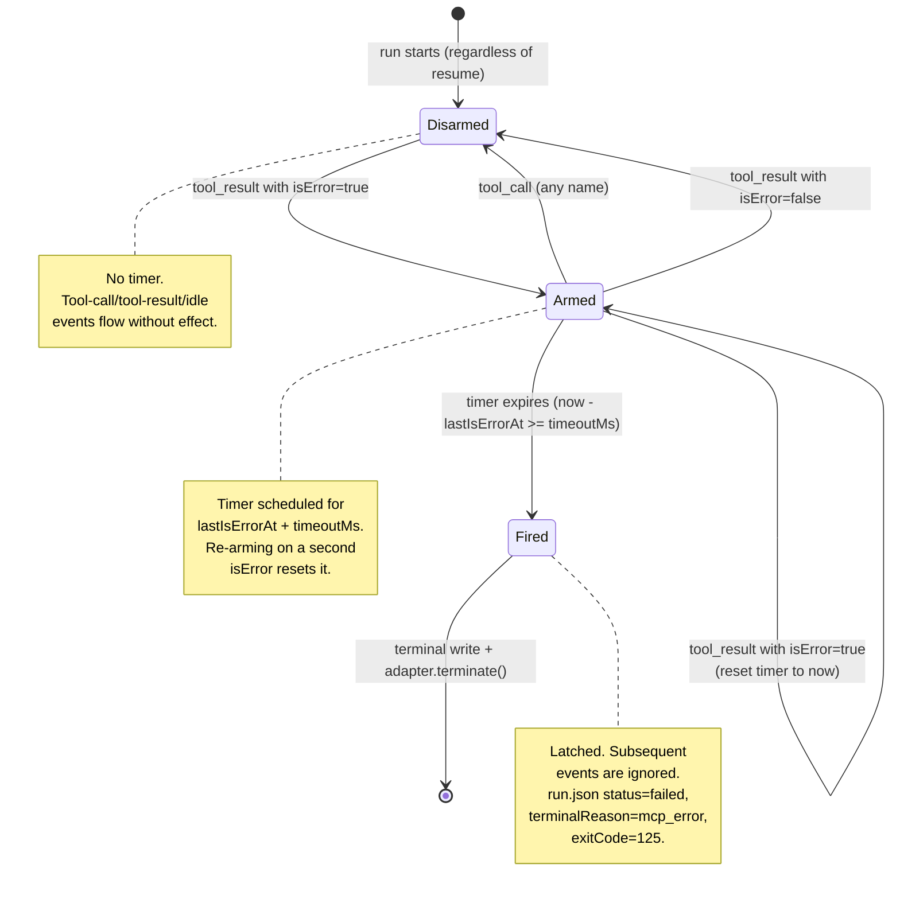

# Workshop: MCP-Error Watchdog Event-Loop Integration

**Type**: State Machine
**Plan**: 021-coordinated-install-resilience
**Spec**: [../coordinated-install-resilience-spec.md](../coordinated-install-resilience-spec.md)
**Created**: 2026-05-15
**Status**: Draft

**Value Thesis**: This workshop makes the watchdog's runtime contract — when it arms, when it disarms, when it fires, what it writes, how it composes with existing terminal conditions — explicit and reviewable before any code lands. Without this, the precedence ladder against `permission-denied` / `timeout` / forwarder-errors gets re-invented inside the PR diff and the reviewer has to reconstruct it from three different code sites.

**Target Proof Level**: Contract Ready — interfaces, state machine, signal protocol, and test scenarios specified concretely enough that an implementing agent (or developer) can build from this without re-asking the design questions.
**Current Proof Level**: Contract Ready (this document).

**Selected Value Axes**:
- **Implementation Readiness**: A coding agent can produce `runner/watchdog.ts` from this workshop with no further design clarification.
- **Safety to Change**: Future modifications to the terminal-condition set (e.g., a new "stalled inbox" condition) inherit the documented precedence ladder instead of re-inventing it.
- **Cross-Domain Coordination**: Watchdog is a runner-domain concept that interacts with the adapter (`adapter.terminate`), mcp (`tool_result.isError` semantics), and cli (frontmatter parsing) seams. Explicit cross-domain contracts here prevent later confusion.

**Related Documents**:
- [`../../016-a2a-companion-protocol/fixes/FX002-companion-state-transitions.log.md`](../../016-a2a-companion-protocol/fixes/FX002-companion-state-transitions.log.md) — origin of the wedge class
- [`../../018-agent-permissions/workshops/002-permission-error-protocol.md`](../../018-agent-permissions/workshops/002-permission-error-protocol.md) — the 5-signal denial protocol we mirror
- [`src/runner/permissions/error-signal.ts`](../../../../src/runner/permissions/error-signal.ts) — the canonical `fireTerminalDenial` pattern
- [GitHub issue #30](https://github.com/AI-Substrate/minih/issues/30) — bug report

**Domain Context**:
- **Primary Domain**: `runner` — owns event-loop integration + terminal-write path + frontmatter parsing
- **Related Domains**:
  - `adapter` (consume) — calls `adapter.terminate(sessionId)` to interrupt the SDK session; no contract change
  - `mcp` (consume) — reads `tool_result.isError` semantics; no contract change
  - `cli` (consume) — surfaces new `terminalReason: 'mcp_error'` in `minih status` / `minih retros`; downstream rendering, no contract change

---

## Purpose

Specify the runtime state machine for the **MCP-error watchdog**: a runner-level safety net that terminates a run with `terminalReason: 'mcp_error'` when the agent goes silent for a configurable threshold after any `tool_result` with `isError: true`. The workshop answers the load-bearing questions the spec flagged: precedence vs other terminal conditions, where the state lives, how resume/compact handle it, and what test scenarios prove it.

This workshop should make Phase 3 implementation tractable for a single coding agent without further design clarification.

## Fresh Entrant Outcome

A fresh human or agent should be able to use this workshop to reach **Contract Ready** with no additional context.

They should be able to:

- Implement `runner/watchdog.ts` (or equivalent) from the state machine and contract sections below
- Wire it into `runAgent`'s `handleEvent` callback without re-reading `runner.ts` end-to-end
- Write the 4 mandated test scenarios against `FakeAgentAdapter`
- Update `run.json`'s `terminalReason` union and add the `mcpError` snapshot field without breaking existing `permission-denied` tests
- Explain to a reviewer in one paragraph why the watchdog's precedence vs `permission-denied` / `timeout` / forwarder-errors is correct

## Key Questions Addressed

1. **Precedence ladder**: What happens if watchdog and `permission-denied` race? What if watchdog and `timeout`? What if watchdog and a normal `session_idle`?
2. **State location**: In-memory closure inside `runAgent`, or persisted? What survives a `resumeInPlace`? What survives a `compact()`?
3. **Disarm triggers**: Does any `tool_call` disarm, or only ones from the same tool? Does a successful `tool_result` disarm?
4. **Signal protocol**: Does the watchdog need a 5-signal write path like `permission-denied`, or is `run.json` + `events.ndjson` enough?
5. **Resume preservation**: When `resumeInPlace` reuses a `run.json` that previously had `terminalReason: 'mcp_error'`, does the field survive or get cleared? (Same question for the existing `permission-denied` — latent bug surface.)
6. **Frontmatter shape**: Where does `mcpErrorTimeoutMs` parse into the `AgentDefinition`? How does it default if absent?
7. **Adapter termination**: Is `adapter.terminate(sessionId)` sufficient to interrupt the SDK, or do we need additional teardown?

---

## Value Frame

| Field | Selection | Why It Matters |
|-------|-----------|----------------|
| Target Proof Level | Contract Ready | Phase 3 implementation must not re-derive precedence rules; reviewer must not re-derive them either |
| Primary Value Axis | Implementation Readiness | The single biggest cost saved by this workshop is the cycles a coding agent or reviewer would otherwise spend reconstructing the state machine from `runner.ts:720+` |
| Supporting Value Axes | Safety to Change, Cross-Domain Coordination | Watchdog joins a 3-condition terminal-set today; making the precedence rule explicit prevents the 4th and 5th conditions from re-inventing it |
| Downstream Loop Improved | Implementation + Review + Testing | All three loops touch this same state machine; one workshop pays back three times |

## Evidence Ledger

| Evidence | Location | Supports | Status |
|----------|----------|----------|--------|
| Existing `permission-denied` 5-signal protocol | `src/runner/permissions/error-signal.ts` (read 2026-05-15) | "Watchdog mirrors this; same shape, different reason" | Validated |
| `runAgent` `handleEvent` closure shape | `src/runner/runner.ts:858–904` (read 2026-05-15) | "Watchdog hooks into `handleEvent`, not a separate event loop" | Validated |
| `LiveRunStatus` + `terminalReason` types | `src/runner/types.ts:327–401` (read 2026-05-15) | "Need to widen `terminalReason: 'permission-denied'` → `'permission-denied' \| 'mcp_error'`" | Validated |
| `resumeInPlace` manifest preservation logic | `src/runner/runner.ts:444–482` (read 2026-05-15) | "Resume currently spreads the prior `run.json`, preserving stale `terminalReason`; need to clear explicitly" | Validated — **latent bug surface noted** |
| `adapter.terminate(sessionId)` exists and works | `src/runner/runner.ts:867–874` (timeout path uses it) | "Watchdog can terminate the same way the timeout path does" | Validated |
| `FakeAgentAdapter` emits events via `onEvent` callback | (referenced; spec evidence) | "Tests can drive watchdog by emitting `tool_result { isError: true }` then withholding `tool_call` for a configurable threshold" | Draft — confirm during P3 architecture |

---

## State Machine

### Conceptual Model

The watchdog is a per-run, in-memory state machine driven by `AgentEvent` deliveries through the runner's existing `handleEvent` callback. It has three states and four event types of interest.



### States

| State | Description | Entry Condition | Valid Transitions Out |
|-------|-------------|-----------------|----------------------|
| **Disarmed** | No recent `isError`; no timer pending. The default and steady-state. | Run start, OR transition from Armed via recovery. | → Armed (on `isError`) |
| **Armed** | An `isError` was seen at time `lastIsErrorAt`; timer scheduled for `lastIsErrorAt + timeoutMs`. | Transition from Disarmed via `isError`. | → Disarmed (recovery), → Armed (re-arm on subsequent `isError`), → Fired (timer expiry) |
| **Fired** | Latched terminal state. Has called `adapter.terminate()` and is in the process of writing terminal signals. Subsequent events are ignored. | Transition from Armed via timer expiry. | terminal (run exits) |

### Transitions

| From | To | Trigger | Guard | Action |
|------|-----|---------|-------|--------|
| Disarmed | Armed | `tool_result` event arrives with `isError === true` | Watchdog enabled (`mcpErrorTimeoutMs` is finite positive integer) | Record `lastIsErrorAt = event.timestamp`; record `terminatedToolName = event.data.toolName` (best-effort, may be from prior `tool_call`); `setTimeout(fire, timeoutMs)` |
| Armed | Disarmed | `tool_call` event arrives (any toolName) | none | `clearTimeout(timerHandle)`; clear `lastIsErrorAt`; clear `terminatedToolName` |
| Armed | Disarmed | `tool_result` event arrives with `isError === false` | none | Same as above |
| Armed | Armed | `tool_result` event arrives with `isError === true` | none | `clearTimeout(timerHandle)`; record `lastIsErrorAt = event.timestamp`; `setTimeout(fire, timeoutMs)` |
| Armed | Fired | Timer callback fires | `!watchdogState.terminalFired && !denialState.terminalFired` | Latch `terminalFired = true`; set `reason = 'mcp_error'`, `exitCode = 125`; populate `mcpError` payload; emit synthetic `mcp_error_watchdog_fired` event to `events.ndjson`; call `adapter.terminate(activeSessionId)`; fire signals 3-4 if coordinated |
| Disarmed/Armed | (no transition) | Any event type other than `tool_call` / `tool_result` | none | No-op |
| any | (no transition) | `terminalFired === true` (latched) | always | Ignore — already firing |

**Disarm policy rationale**: ANY `tool_call` disarms, not "same toolName as the prior errored call." A model that recovers from `state_transition`'s failure by trying `inbox_list` instead is still "making progress" — the watchdog's job is to detect *silence*, not *failure to retry the same tool*.

**Re-arm rationale**: Two consecutive `isError` events with no intervening `tool_call` reset the timer rather than letting the first one fire on the original schedule. This matches the operator intuition: "60s of silence since the *most recent* error," not "60s of silence since the *first* error in a streak."

### Events

| Event | Payload | Triggered By | Watchdog Behaviour |
|-------|---------|--------------|---------------------|
| `tool_call` | `{ toolName, input, toolCallId }` | SDK | Disarm if Armed; no-op otherwise |
| `tool_result` | `{ toolCallId, output, isError }` | SDK | If `isError`: arm or re-arm. If `!isError`: disarm if Armed. |
| `mcp_error_watchdog_fired` | `{ firstIsErrorAt, lastIsErrorAt, timeoutMs, terminatedToolName? }` | **Watchdog itself** (synthetic) | Emitted once on transition to Fired; observers (CLI tail, view) see why the run died |
| All others (`message`, `thinking`, `session_idle`, `session_start`, `session_error`, etc.) | various | SDK | No-op |

---

## Precedence Ladder

When multiple terminal conditions could fire, the order is **first-trigger-wins** via independent latches. Practically:

| # | Terminal Condition | Latch | Preempts What |
|---|---|---|---|
| 1 | **Timeout** (`config.timeout * 1000` ms since run start) | `timedOut: boolean` in `runAgent` closure | Everything — `Promise.race` against `timeoutPromise` wins; rest of try/finally skipped |
| 2 | **Permission denied** (handler returns `reject`) | `denialState.terminalFired` | Watchdog (when checked in timer callback's guard); not preemptive against in-flight timeout |
| 3 | **Watchdog fires** | `watchdogState.terminalFired` | Normal SDK completion (when checked in catch block) |
| 4 | **Forwarder error** (inbox/state forwarder rejects) | `forwarderErrors[]` array; first error wins | Watchdog and normal completion (thrown out of try block before watchdog can latch) |
| 5 | **Coord-write-deny precondition** (boot-time) | Synchronous throw before adapter session starts | All others (fires before they exist) |
| 6 | **Adapter failure** (generic) | catch block in main try | Normal completion |
| 7 | **Normal SDK completion** (`session_idle`) | `runPromise` resolves | (terminal — nothing to preempt) |

### Resolution Rules

**Rule R1 — Latch checks in timer callback.** The watchdog timer callback's first action is:
```typescript
if (watchdogState.terminalFired) return;       // already fired
if (denialState.terminalFired) return;          // permission won the race
if (timedOut) return;                            // timeout won the race
watchdogState.terminalFired = true;
// ... proceed to fire
```

This guarantees watchdog never overwrites a higher-precedence terminal reason.

**Rule R2 — Catch block reconciliation.** After the main `try` block resolves or throws, the runner checks each latch in precedence order. If `denialState.terminalFired` is true, the run is recorded as permission-denied (existing behaviour). If `watchdogState.terminalFired` is true AND `denialState.terminalFired` is false, the run is recorded as mcp_error.

**Rule R3 — Forwarder-error priority.** If a forwarder error has been recorded before the watchdog fires, the forwarder error wins (the runner throws it from the `.then()` chain in the runPromise composition, short-circuiting normal completion AND watchdog write-back). This is already the existing behaviour for permission-denied; we extend the same rule to watchdog.

**Rule R4 — Multiple `isError` from different tools.** No special handling. The state machine records only `lastIsErrorAt` and (best-effort) `terminatedToolName`. If `state_transition` errors at T=0, `bash` errors at T=30, and silence follows from T=30, the watchdog fires at T=30+timeoutMs with `terminatedToolName: 'bash'`. The Fired-state payload records `firstIsErrorAt: 0, lastIsErrorAt: 30` for forensics.

---

## Resume + Compact + Persistence

### In-memory only

Watchdog state lives in `runAgent`'s closure (alongside `denialState` and `forwarderErrors`). It is **not** persisted to disk during the run. There is no reason to: the state is fully derivable from the tail of `events.ndjson`, and a `runAgent` crash mid-run abandons the run anyway.

The only on-disk artifact is the post-fire write to `run.json` (`terminalReason: 'mcp_error'`, `mcpError: {...}`) — same shape as permission-denied's post-fire write.

### resumeInPlace (existing pathway)

**Bug surface noted**: `runner.ts:444-482` currently spreads the prior `run.json` into the resumed manifest:
```typescript
const updated = { ...existing, schemaVersion: 1, pid, status: 'starting', updatedAt, resumes: [...] };
```

This preserves `terminalReason: 'permission-denied'` and `permissionError` from the prior run into the resumed manifest. **Today this is latent** (no test covers resume-after-permission-denied), but adding `terminalReason: 'mcp_error'` and `mcpError` to the union widens the surface.

**Fix (in scope for Phase 3)**: explicitly clear terminal fields on resume:
```typescript
const updated = {
  ...existing,
  schemaVersion: 1,
  pid: process.pid,
  status: 'starting',
  updatedAt: startedAt.toISOString(),
  resumes: [...priorResumes, resumeEntry],
  // Clear prior terminal state — this is a fresh attempt.
  terminalReason: undefined,
  permissionError: undefined,
  mcpError: undefined,
};
```

Add a regression test: resume an mcp_error'd run, confirm the manifest no longer carries `terminalReason: 'mcp_error'` after resume completes successfully.

**Watchdog state on resume**: fresh `Disarmed`. The previous run's silence is not held against the resumed run.

### compact()

`compact()` is an adapter-level operation (resume a session + run `/compact`). It is **not** invoked by `runAgent` directly — it's a CLI command outside this code path. When/if a future flow chains `compact() → runAgent()`, the new `runAgent` invocation initializes a fresh watchdog. Out of scope for Phase 3.

---

## Signal Protocol

Mirror the `permission-denied` 5-signal protocol with `mcp_error` shape. Implementation parallels `runner/permissions/error-signal.ts`; new file `runner/mcp-error-signal.ts` (or co-located `runner/watchdog.ts` if total LOC stays small).

### Signal 1 — events.ndjson (synthetic event)

Emit a new event type `mcp_error_watchdog_fired` immediately when the timer callback latches. Shape:

```typescript
{
  type: 'mcp_error_watchdog_fired',
  timestamp: <ISO-8601 of fire time>,
  data: {
    firstIsErrorAt: <ISO-8601>,        // earliest isError in the streak that triggered fire
    lastIsErrorAt: <ISO-8601>,          // the isError that started the silence period
    timeoutMs: <number>,                // configured threshold (e.g. 60000)
    terminatedToolName: <string|null>,  // best-effort: tool that emitted the latest isError
    streakLength: <number>              // count of consecutive isErrors with no recovery
  }
}
```

Add to `AgentEvent` union in `src/adapter/events.ts`. Existing `events.ndjson` consumers (`peer-activity.ts`, `human-view-model.ts`, `pretty.ts`) treat unknown types as no-ops, so backward compat is preserved.

### Signal 2 — run.json

```json
{
  ...,
  "status": "failed",
  "terminalReason": "mcp_error",
  "mcpError": {
    "firstIsErrorAt": "2026-05-15T16:05:39.408Z",
    "lastIsErrorAt": "2026-05-15T16:05:39.408Z",
    "timeoutMs": 60000,
    "terminatedToolName": "minih-coordination-state_transition",
    "streakLength": 1
  }
}
```

Widen `LiveRunManifest.terminalReason` type:
```typescript
terminalReason?: 'permission-denied' | 'mcp_error';
```

Add new optional field:
```typescript
mcpError?: {
  firstIsErrorAt: string;
  lastIsErrorAt: string;
  timeoutMs: number;
  terminatedToolName: string | null;
  streakLength: number;
};
```

Mirror in `CompletedMetadata`:
```typescript
mcpError?: { firstIsErrorAt: string; lastIsErrorAt: string; timeoutMs: number; terminatedToolName: string | null; streakLength: number };
```

### Signal 3 — inside-state (coordinated agents only)

Best-effort write to `state/inside.json`:
```json
{
  "status": "error",
  "data": { "mcpError": { /* same shape as run.json.mcpError */ } },
  "updatedAt": "<ISO-8601>",
  "updatedBy": "inside"
}
```

Failures captured in `signalFailures` array (mirror permission-denied), surfaced in `run.json.coordinationSignals`. **Never throw**.

### Signal 4 — inside inbox lane (coordinated agents only)

Append typed `mcp-error` message:
```json
{
  "id": "<ULID>",
  "sender": "inside",
  "type": "mcp-error",
  "subject": "MCP error timeout: tool=minih-coordination-state_transition",
  "body": "Inside session went silent for 60000ms after a tool_result with isError. Last error was at <ts>. Run terminated with terminalReason: 'mcp_error'.",
  "ts": "<ISO-8601>",
  "meta": { "contractVersion": 1, "mcpError": { /* same shape */ } }
}
```

Mirror permission-denied's "write to INSIDE lane; outside readers see via `minih outside inbox list <slug>`" convention.

### Signal 5 — exit code

**125** (suggested — distinct from 124 timeout and 126 permission-denied). Rationale: POSIX-adjacent ("Command terminated by signal") without colliding with the existing 124/126 vocabulary. CLI error-code mapping in `src/cli/output/errors.ts` adds new code (e.g., `E125` or a named code like `MCP_ERROR_WATCHDOG_FIRED`).

---

## Decision Space

| Option | Description | Pros | Cons | Decision |
|--------|-------------|------|------|----------|
| **A** | Inline timer in `handleEvent` closure | Simplest; ~30 LOC | Hard to test in isolation; `handleEvent` already does 5 things | **Rejected** |
| **B** | New module `src/runner/watchdog.ts` exposing `createMcpErrorWatchdog({ timeoutMs, onFire })` returning `{ observeEvent, dispose }` | Testable in isolation; mirrors `inbox-forwarder.ts` / `state-forwarder.ts` shape; ~150 LOC | One more file | **Selected** |
| **C** | New sub-module `src/runner/mcp-error/` (3 files: state machine, signal protocol, types) | Parallels `runner/permissions/` structure | Heavyweight for the LOC count; YAGNI | **Rejected for v1**; revisit if scope grows |

**Selected: Option B.** Co-locate the signal protocol (`mcp-error-signal.ts` helpers) in the same file or a sibling for now. If `watchdog.ts` exceeds ~250 LOC, split into a sub-module per Option C.

### Contract for `watchdog.ts`

```typescript
export interface McpErrorWatchdogOptions {
  /** Threshold in ms. `null` or `<= 0` disables the watchdog entirely. */
  timeoutMs: number | null;
  /** Fired when the timer expires. Implementations should call `adapter.terminate()` from this callback. */
  onFire: (payload: {
    firstIsErrorAt: string;
    lastIsErrorAt: string;
    terminatedToolName: string | null;
    streakLength: number;
  }) => void;
}

export interface McpErrorWatchdog {
  /** Push every AgentEvent through here from `runAgent.handleEvent`. */
  observeEvent(event: AgentEvent): void;
  /** Clear the pending timer (if any). Called on shutdown / fire / SDK completion. */
  dispose(): void;
  /** True iff the watchdog has fired (latched). */
  hasFired(): boolean;
}

export function createMcpErrorWatchdog(
  options: McpErrorWatchdogOptions,
): McpErrorWatchdog;
```

**Wiring in `runAgent`** (sketch — exact location per Phase 3 architecture):

```typescript
const watchdog = createMcpErrorWatchdog({
  timeoutMs: resolvedTimeoutMs,  // from frontmatter + default
  onFire: (payload) => {
    // Emit synthetic event (signal 1)
    fs.appendFileSync(eventsPath, JSON.stringify({
      type: 'mcp_error_watchdog_fired',
      timestamp: new Date().toISOString(),
      data: { ...payload, timeoutMs: resolvedTimeoutMs },
    }) + '\n');
    // Latch state, schedule terminal write
    mcpErrorState.terminalFired = true;
    mcpErrorState.payload = payload;
    // Interrupt the SDK
    void adapter.terminate(activeSessionId).catch(() => { /* best-effort */ });
  },
});

const handleEvent = (event: AgentEvent): void => {
  // ... existing event handling ...
  watchdog.observeEvent(event);
};

// In runPromise.then() resolution, after the SDK reports complete:
watchdog.dispose();

// In the post-run reconciliation block (mirrors denialState handling):
if (mcpErrorState.terminalFired && !denialState.terminalFired) {
  await fireMcpErrorTerminal(mcpErrorState, { runDir, runId, agentSlug, agentsDir, coordinationEnabled });
  // Override agentResult to canonical mcp_error shape
  agentResult = {
    output: `Run terminated by MCP error watchdog after ${resolvedTimeoutMs}ms silence.`,
    sessionId: agentResult.sessionId,
    status: 'failed',
    exitCode: 125,
    tokens: agentResult.tokens,
  };
}
```

---

## Frontmatter Contract

### Parser changes

Add to `parseFrontmatter` output (or downstream consumer in `folder.ts`):

```typescript
interface AgentDefinitionFrontmatter {
  // existing fields...
  model?: string;
  reasoning?: string;
  timeout?: number;
  coordination?: CoordinationFrontmatter;
  permissions?: PermissionPolicy;
  // NEW:
  mcpErrorTimeoutMs?: number | null;
}
```

Add to `AgentDefinition` type:
```typescript
interface AgentDefinition {
  // existing fields...
  /**
   * Plan 021 — MCP error watchdog threshold in ms. `null` disables.
   * `undefined` (absent) means use the runtime default (60000).
   * Set in `prompt.md` frontmatter as `mcpErrorTimeoutMs: 60000` or `mcpErrorTimeoutMs: null`.
   */
  mcpErrorTimeoutMs?: number | null;
}
```

### Resolution rule

```typescript
const DEFAULT_MCP_ERROR_TIMEOUT_MS = 60_000;

function resolveMcpErrorTimeout(definition: AgentDefinition): number | null {
  if (definition.mcpErrorTimeoutMs === null) return null;        // explicit opt-out
  if (definition.mcpErrorTimeoutMs === undefined) return DEFAULT_MCP_ERROR_TIMEOUT_MS;
  if (definition.mcpErrorTimeoutMs <= 0) return null;            // treat 0 / negative as opt-out
  return definition.mcpErrorTimeoutMs;
}
```

**Per spec Q7 resolution**: flat at frontmatter root, not nested under `coordination`. Matches existing minih convention.

### Required prompt updates

Set `mcpErrorTimeoutMs: null` proactively on agents that legitimately stall after errors during tests:
- `agents/coordination-loop-validator/prompt.md` — its test suite asserts `isError` paths
- Any future test-harness agent that probes denial behavior

This is captured in **OQ1** of the spec (deferred to Phase 3 architecture).

---

## Test Scenarios

### Scenario 1 — Default-on: fires after silence

**Acceptance criterion**: AC-WATCHDOG-DEFAULT-ON

```typescript
it('terminates a run with terminalReason mcp_error after threshold silence', async () => {
  const adapter = new FakeAgentAdapter();
  adapter.queueEvent({ type: 'session_start', data: { sessionId: 's1' } });
  adapter.queueEvent({ type: 'tool_call', data: { toolName: 'x', toolCallId: 'tc1', input: {} } });
  adapter.queueEvent({ type: 'tool_result', data: { toolCallId: 'tc1', output: 'err', isError: true } });
  // ... no further events for >threshold ...

  const result = await runAgent(adapter, definitionWithTimeout(50), { slug, ... });

  expect(result.agentResult.status).toBe('failed');
  expect(result.agentResult.exitCode).toBe(125);
  const manifest = JSON.parse(fs.readFileSync(path.join(result.runDir, 'run.json'), 'utf8'));
  expect(manifest.terminalReason).toBe('mcp_error');
  expect(manifest.mcpError.timeoutMs).toBe(50);
  expect(manifest.mcpError.terminatedToolName).toBe('x');
});
```

Use `mcpErrorTimeoutMs: 50` in the definition's frontmatter to keep the test fast.

### Scenario 2 — Recovery: disarmed by subsequent tool_call

**Acceptance criterion**: AC-WATCHDOG-CANCELED-BY-RECOVERY

```typescript
it('does not terminate when a tool_call follows isError within threshold', async () => {
  const adapter = new FakeAgentAdapter();
  adapter.queueEvent({ type: 'tool_result', data: { toolCallId: 'tc1', output: 'err', isError: true } });
  await sleep(20);  // half the threshold
  adapter.queueEvent({ type: 'tool_call', data: { toolName: 'y', toolCallId: 'tc2', input: {} } });
  adapter.queueEvent({ type: 'tool_result', data: { toolCallId: 'tc2', output: 'ok', isError: false } });
  adapter.queueEvent({ type: 'session_idle', data: {} });

  const result = await runAgent(adapter, definitionWithTimeout(50), { slug, ... });

  expect(result.agentResult.status).toBe('completed');
  expect(result.agentResult.exitCode).toBe(0);
  const manifest = JSON.parse(fs.readFileSync(path.join(result.runDir, 'run.json'), 'utf8'));
  expect(manifest.terminalReason).toBeUndefined();
  expect(manifest.mcpError).toBeUndefined();
});
```

### Scenario 3 — Opt-out: `mcpErrorTimeoutMs: null`

**Acceptance criterion**: AC-WATCHDOG-OPT-OUT

```typescript
it('does not terminate when watchdog is disabled via frontmatter', async () => {
  const adapter = new FakeAgentAdapter();
  adapter.queueEvent({ type: 'tool_result', data: { toolCallId: 'tc1', output: 'err', isError: true } });
  // ... long silence ...

  // Use a normal `timeout: 1` config to ensure SOMETHING fires
  const result = await runAgent(adapter, definitionWithTimeout(null, /*timeout=*/1), { slug, ... });

  // Run dies via existing timeout path, NOT via watchdog
  expect(result.agentResult.exitCode).toBe(124);  // timeout, not 125
  expect(result.metadata.result).toBe('timeout');
  const manifest = JSON.parse(fs.readFileSync(path.join(result.runDir, 'run.json'), 'utf8'));
  expect(manifest.terminalReason).toBeUndefined();  // no mcp_error
});
```

### Scenario 4 — Configurable threshold

**Acceptance criterion**: AC-WATCHDOG-CONFIGURABLE

Implicit in scenarios 1 and 2 — both use `mcpErrorTimeoutMs: 50` (a non-default value). Explicit assertion: the recorded `mcpError.timeoutMs` matches the frontmatter value, not the 60000 default.

### Scenario 5 — Precedence vs permission-denied

```typescript
it('does not fire when permission denial preempts', async () => {
  const adapter = new FakeAgentAdapter();
  // Configure permissionHandler to reject 'bash'
  adapter.queueEvent({ type: 'tool_result', data: { toolCallId: 'tc1', output: 'err', isError: true } });
  adapter.queueEvent({ type: 'permission_denied', data: { kind: 'shell', decision: 'deny', message: 'no bash' } });
  // ... silence ...

  const result = await runAgent(adapter, definitionWithTimeoutAndPermissions(50, 'read-only'), { slug, ... });

  expect(result.agentResult.exitCode).toBe(126);  // permission-denied wins
  const manifest = JSON.parse(fs.readFileSync(path.join(result.runDir, 'run.json'), 'utf8'));
  expect(manifest.terminalReason).toBe('permission-denied');
  expect(manifest.mcpError).toBeUndefined();
});
```

### Scenario 6 — Resume clears prior mcp_error

**Acceptance criterion**: latent-bug fix noted in this workshop

```typescript
it('clears terminalReason from prior run on resumeInPlace', async () => {
  // Set up a run that already has terminalReason: 'mcp_error' in run.json (manually)
  const priorRunDir = setupRunDirWithMcpError();
  // Resume in place
  const result = await runAgent(adapter, definition, { 
    slug, 
    resumedFromRunId: priorRunId, 
    resumeInPlace: true,
    sessionId: priorSessionId,
    // ...
  });

  // The resumed run should not carry stale mcp_error
  const manifest = JSON.parse(fs.readFileSync(path.join(result.runDir, 'run.json'), 'utf8'));
  expect(manifest.terminalReason).toBeUndefined();
});
```

### Scenario 7 — Coordinated agent fires signals 3 + 4

```typescript
it('writes inside-state and inside-inbox lane on fire (coordinated agents)', async () => {
  const adapter = new FakeAgentAdapter();
  adapter.queueEvent({ type: 'tool_result', data: { toolCallId: 'tc1', output: 'err', isError: true } });
  // ... silence ...

  await runAgent(adapter, coordinatedDefinitionWithTimeout(50), { slug, ... });

  const insideState = JSON.parse(fs.readFileSync(insideStatePath, 'utf8'));
  expect(insideState.status).toBe('error');
  expect(insideState.data.mcpError).toBeDefined();

  const inboxLines = fs.readFileSync(insideInboxPath, 'utf8').trim().split('\n');
  const mcpErrorMsg = JSON.parse(inboxLines.at(-1)!);
  expect(mcpErrorMsg.type).toBe('mcp-error');
});
```

---

## Attention Reduction

| Future Loop | Before Workshop | After Workshop |
|-------------|-----------------|----------------|
| **Implementation** | Implementing agent has to (1) reverse-engineer precedence vs permission-denied/timeout from `runner.ts:720+`, (2) decide signal protocol from scratch, (3) decide where state lives, (4) discover the resumeInPlace bug surface | All four decisions are explicit; agent writes from the contract |
| **Review** | Reviewer must reconstruct the state machine from the diff, verify precedence claims by reading every terminal-condition site | Reviewer checks the diff against the documented state machine, transition table, and signal protocol |
| **Testing** | Test author invents 4 scenarios and may miss the latch-precedence edge cases | Test author lifts 7 documented scenarios directly |
| **Agent execution** | A coding agent (companion or otherwise) would re-ask design questions during implementation | Agent can act from this workshop with no clarification round-trip |

---

## Validation / Acceptance

This workshop reaches Contract Ready when:

- [ ] An implementing agent can produce `src/runner/watchdog.ts` matching the documented `McpErrorWatchdog` interface without further design clarification
- [ ] An implementing agent can wire it into `runAgent` from the sketch in § Decision Space without re-reading the workshop
- [ ] All 7 documented test scenarios can be implemented against `FakeAgentAdapter` without ambiguity
- [ ] The precedence ladder reconciles cleanly with the existing 6 terminal conditions in `runner.ts` — no condition is missed, no precedence rule contradicts existing behaviour
- [ ] The `resumeInPlace` clear-stale-terminal-fields fix is captured as a test scenario (Scenario 6)

---

## Open Questions

### Q1: Should `mcp_error_watchdog_fired` events include the streak's tool-call sequence?

**OPEN**: The synthetic event captures `firstIsErrorAt` / `lastIsErrorAt` / `streakLength`, but not the intervening tool names. For forensics, capturing `[toolName for each isError in streak]` could be useful — e.g., "model errored on `state_transition` then `inbox_send` then went silent." Tradeoff: array could grow unbounded if a model errors hundreds of times. Cap at 10 with a `truncated: true` flag?

**Recommendation**: Capture array, cap at 10, mark `truncated: true` if longer. Decide during Phase 3 architecture; doesn't block this workshop.

### Q2: Does `adapter.terminate(sessionId)` cleanly interrupt mid-`tool_call`?

**OPEN**: The timeout path uses `adapter.terminate(activeSessionId)` and the SDK's behaviour mid-tool is "best-effort." If the agent is inside a long `bash` call (e.g., waiting on a `sleep 120`), `terminate` may not kill the child process immediately. The watchdog inherits this limitation.

**Mitigation**: Document the limitation in `docs/how/companion-install-resilience.md`. Watchdog fires the *signals* immediately; the actual process teardown is on the same eventual-consistency basis as `timeout`. Not a watchdog-specific bug.

### Q3: Should the watchdog also apply to `tool_result` from non-MCP tools (bash, write, custom)?

**RESOLVED** (per spec Q6): Yes. The watchdog observes the `isError` field of all `tool_result` events, regardless of the tool's source (MCP, shell, write, custom-tool, etc.). The name "MCP error watchdog" is a misnomer in that sense — it's really an "any-tool error watchdog" — but the issue origin and the common case is MCP, and renaming late costs more than the slight inaccuracy. Document the broader scope clearly in `docs/how/`.

### Q4: What's the right exit code?

**RESOLVED** (this workshop): **125**. Distinct from 124 (timeout), 126 (permission-denied), 1 (generic failure). POSIX-adjacent. Add `E125` or named error code in `src/cli/output/errors.ts` during Phase 3.

### Q5: Does the synthetic event count toward `counters.events` in `run.json`?

**OPEN**: The synthetic `mcp_error_watchdog_fired` is written to `events.ndjson` like any other event, but it's emitted by the runner itself, not the adapter. Should it increment `counters.events` (consistent) or be excluded (since it's not adapter-originated)?

**Recommendation**: Include in `counters.events`. The counter is "events written to events.ndjson," not "events originated by the adapter." Cleaner.

---

## Quick Reference

**State**: `'Disarmed' | 'Armed' | 'Fired'`
**Latch**: `terminalFired: boolean`
**Default threshold**: `60_000` ms
**Frontmatter knob**: `mcpErrorTimeoutMs: number | null` (root-level)
**Disarm triggers**: any `tool_call` event; any `tool_result` with `!isError`
**Arm trigger**: any `tool_result` with `isError === true`
**Fire conditions**: state == Armed AND (now - lastIsErrorAt) >= timeoutMs AND no higher-precedence terminal latched
**Exit code**: `125`
**`run.json.terminalReason`**: `'mcp_error'`
**`run.json.mcpError`**: `{ firstIsErrorAt, lastIsErrorAt, timeoutMs, terminatedToolName, streakLength }`
**Synthetic event type**: `mcp_error_watchdog_fired`
**Module**: `src/runner/watchdog.ts` (option B selected)
**Resume**: prior `terminalReason` / `mcpError` cleared explicitly in `resumeInPlace` path
**Compact**: out of scope (fresh `runAgent` invocation = fresh watchdog)
