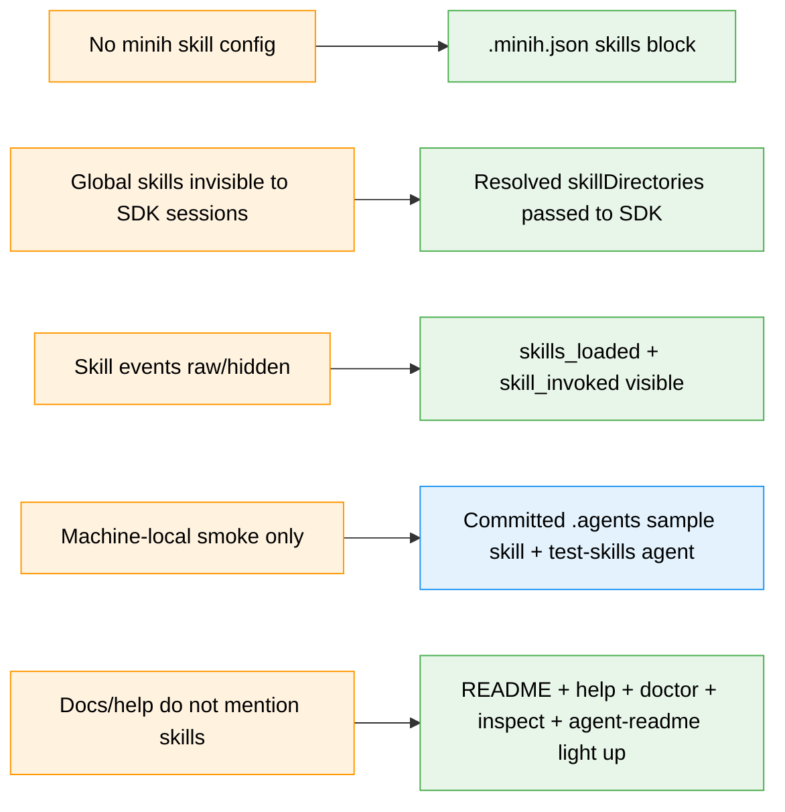

# Flight Plan: Minih Skills Config

**Spec**: [minih-skills-config-spec.md](./minih-skills-config-spec.md)
**Plan**: [minih-skills-config-plan.md](./minih-skills-config-plan.md)
**Workshop**: [workshops/001-cli-config-and-discovery.md](./workshops/001-cli-config-and-discovery.md)
**Backpressure**: [backpressure-coverage.md](./backpressure-coverage.md)
**Generated**: 2026-06-05
**Status**: READY — Simple mode implementation plan written
**Mode**: Simple

---

## The Mission

Add first-class minih skills configuration so SDK-backed agents can load local skills from portable aliases instead of hardcoded absolute paths. The primary path is repo config (`.minih.json`) plus run flags, deterministic minih-side alias resolution, and SDK pass-through of resolved `skillDirectories` / `disabledSkills`.

The portability proof is a committed repo-local skill fixture under `.agents/skills/minih-test-skill/SKILL.md` plus a committed minih agent under `agents/test-skills/`. Global skills like `grill-me` remain useful optional/manual evidence, but the deterministic backpressure should not depend on `~/.agents` inventory.

---

## Where We Are → Where We're Headed

---

## Journey Map

---

## Implementation Overview

**Simple mode** — one implementation phase with test-first tasks.

| Order | Workstream | Key Tasks | Proof |
|-------|------------|-----------|-------|
| 1 | Backpressure sensors first | Resolver, CLI, run/resume, adapter, display/help tests | Focused Vitest failures before code |
| 2 | CLI config/resolver | `src/cli/skills.ts`, `minih skills discover/doctor`, run flags | CLI envelopes + temp fixture dirs |
| 3 | Runner/adapter pass-through | `AgentRunConfig`, `AgentRunOptions`, SDK facade/session config | Fake adapter + SDK mock call capture |
| 4 | Skill event visibility | Adapter translation plus display/pretty rendering | Synthetic SDK events visible in tests |
| 5 | Portable smoke fixture | `.agents/skills/minih-test-skill/` + `agents/test-skills/` | Repo-local smoke works without global skill install |
| 6 | Docs/help polish | README, run/help, doctor, inspect, agent-readme | Structure/help tests |

---

## Acceptance Criteria Snapshot

- [ ] `.minih.json` enables skills without absolute paths.
- [ ] All v1 aliases resolve deterministically.
- [ ] No implicit global skills load without config or flags.
- [ ] `include` loads direct skill dirs only.
- [ ] Missing sources/includes are visible and actionable.
- [ ] Adapter passes `skillDirectories` / `disabledSkills` to create/resume sessions.
- [ ] `session.skills_loaded` and `skill.invoked` are visible.
- [ ] Repo-local `.agents/skills/minih-test-skill` loads through `agents/test-skills`.
- [ ] README/help/doctor/inspect/agent-readme all mention skills.
- [ ] Domain boundaries remain healthy.

---

## Key Risks

| Risk | Mitigation |
|------|------------|
| SDK skill event payload drift | Preserve raw payloads; add narrow skill-shape tests if feasible. |
| Loading too many global skills | Prefer `include`; test direct-dir selection and no recursive scans. |
| Run/resume drift | Shared CLI helper plus tests for both paths. |
| Machine-local global skills absent | Primary smoke uses committed repo-local `.agents` fixture. |
| Docs present but unclear | Structure tests + human review; make CLI surfaces explicit. |

---

## Flight Log

- 2026-06-05 — Workshop captured CLI/config/discovery design.
- 2026-06-05 — Spec written as Simple / CS-3 with Full TDD.
- 2026-06-05 — Backpressure survey rated Partial and recommended feature-specific sensors.
- 2026-06-05 — Plan written READY; user clarified portable backpressure should include committed `.agents` sample skill + `agents/test-skills` agent, incorporated into spec/backpressure/plan.
