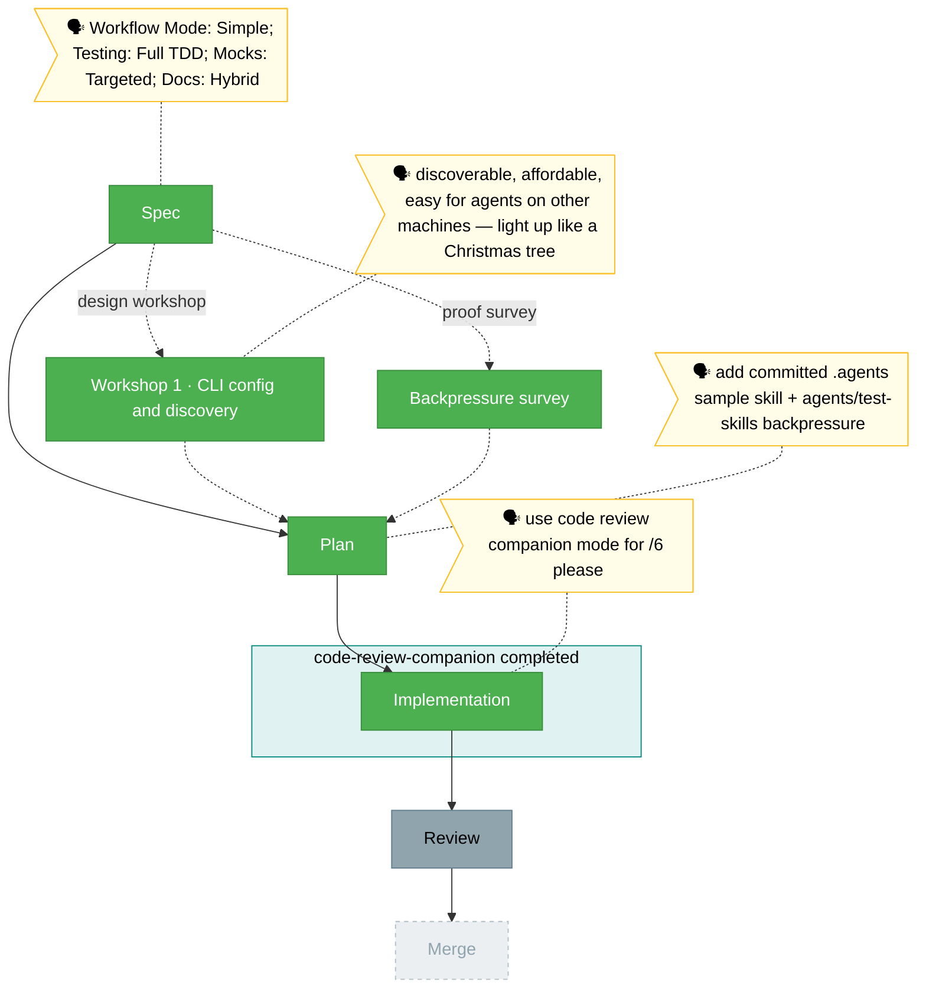

# Flight view — minih-skills-config

> Generated from [`the-flow.json`](./the-flow.json). Do not hand-edit this markdown as the primary; update the JSON and regenerate.

**Plan**: minih-skills-config · **Mode**: Simple · **Phases**: 1
**Rail**: `[the-flow] ◆─◆─◆─◆─◇` · **now**: Implementation complete · **next**: Review

**Legend**: 🟩 done · 🟧 in progress · 🟥 blocked · 🟦 known future (designed) · ⬜╴assumed future (dashed) · 🟨 🗣 verbatim/reconstructed user input · companion (teal, wraps) · worker (indigo, side)

## Nodes

- **Spec** — done: `minih-skills-config-spec.md`.
- **Workshop 1 · CLI config and discovery** — done: `workshops/001-cli-config-and-discovery.md`.
- **Backpressure survey** — done: `backpressure-coverage.md` (`Certainty: Partial`).
- **Plan** — done: `minih-skills-config-plan.md` (`Status: READY`) and `minih-skills-config.fltplan.md`.
- **Implementation** — done: `execution.log.md`; companion completed before final diff review.
- **Review** — known next: formal `/plan-7-v2-code-review` recommended.
- **Merge** — final explicit-confirmation step.
